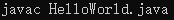
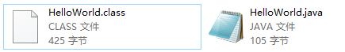
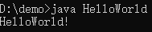
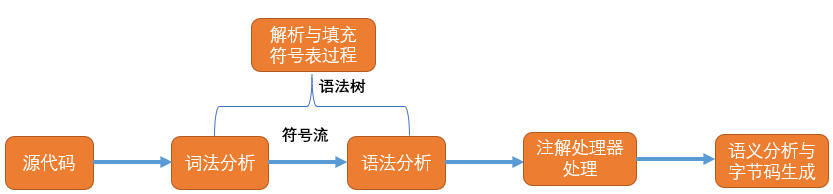
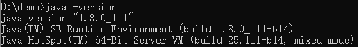
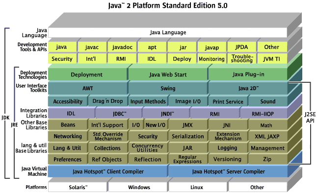

# ->HelloJava!
>Goya：
>Java是一门伟大的艺术，至少在我看来是的了，也许如果没有Java出现会出现别的类似编程语言，但是因为它的存在，促进了互联网的>发展。
>当我第一次接触Java是在初中，那时候有的塞班系统的手机上会出现一个Java的一些小游戏或者小应用，回忆中的样子应该是如此。
>到了大学，大二开始学习Java知道了这门著名的编程语言。
>那时候老师也不会将很多学习Java先要了解的一些知识，只是告诉你James Gosling发明了Java，并且在Sun公司，之后Sun被Oracle收购等等一些常识。然后便开始了Java语言的学习，那时候只知道按部就班的安装那些必备软件，然后开始敲。

学习Java我认为首先需要了解一下什么是Java？它用来干什么？它怎么实现的？它发展是什么？
我想在这个大时代背景下，程序员，编程，代码几乎人人皆知。而退十年来讲，都是陌生的。
随着时代的发展，让这些一部分人知道的事务变成众人皆知的事务，这就是互联网的进步以及大时代的笼罩下造成的氛围。你离开了这些就仿佛一个原始人，这么说也许太片面，但离了这些产品那真的会回退一个时代。
很多人都说互联网时代已经告去，大数据人工智能时代来临并飞速发展，那么怎么来，靠什么发展。我想这就是为什么电子信息专业的火爆以及许多人认为的“高薪资”。
***
# 那什么是Java
* 在1990年代之前，比较熟知的C、C++、SQL等著名语言被开发

* 在1990年代，推动编程语言发展的思想则是“提升程序员的生产力”，出现了很多快速应用程序开发，这些语言大都有相应的集成开发环境，也大多是面向对象的编程语言。像Java、Python、Ruby、Visual Basic、JavaScript、PHP等。而Java的出现则更加保守。

所以Java的产生可以理解为一门可以提高程序员生产力的语言。
而那时候的Java叫Oak，是为了服务家用电器等小型系统的编程语言。
但那时候这种智能化电器则不像现在般火爆。于是Sun便开始改造。

>摘自维基百科：
>Java编程语言的风格十分接近C++语言。继承了C++语言面向对象技术的核心，舍弃了容易引起错误的指针，以引用取代；移除了C++中的运算符重载和多重继承特性，用接口取代；增加垃圾回收器功能。在Java SE 1.5版本中引入了泛型编程、类型安全的枚举、不定长参数和自动装/拆箱特性。Sun对Java语言的解释是：“Java编程语言是个简单、面向对象、分布式、解释性、健壮、安全与系统无关、可移植、高性能、多线程和动态的语言”
>Java不同于一般的编译语言或解释型语言。它首先将源代码编译成字节码，再依赖各种不同平台上的虚拟机来解释执行字节码，从而具有“一次编写，到处运行”的跨平台特性。在早期JVM中，这在一定程度上降低了Java程序的运行效率。但在J2SE1.4.2发布后，Java的运行速度有了大幅提升。
>与传统类型不同，Sun公司在推出Java时就将其作为开放的技术。全球的Java开发公司被要求所设计的Java软件必须相互兼容。“Java语言靠群体的力量而非公司的力量”是Sun公司的口号之一，并获得了广大软件开发商的认同。这与微软公司所倡导的注重精英和封闭式的模式完全不同，此外，微软公司后来推出了与之竞争的.NET平台以及模仿Java的C#语言。后来Sun公司被甲骨文公司并购，Java也随之成为甲骨文公司的产品。

总结下来就是Java是一个面向对象的拥有“简单、面向对象、分布式、解释性、健壮、安全与系统无关、可移植、高性能、多线程和动态的语言”这些特点的语言。并且是一门开源语言（开放源代码全世界人学习或者修改加入自己的想法，但是Sun公司拥有Java的一部分权力）

那么首先我们可以分析一下，什么是编程语言：
>编程语言是用来定义计算机程序的形式语言。它是一种被标准化的交流技巧，用来向计算机发出指令。一种计算机语言让程序员能够准确地定义计算机所需要使用的数据，并精确地定义在不同情况下所应当采取的行动。

**所以Java就是一门我们可以根据Java的语法规则写出来的代码，它来编译成计算机识别的指令来操作计算机或者其他设备的语言。**
## 那么Java如何识别我们写的代码再编译成计算机识别的指令呢？
举一个例子：我们写一个**HelloWorld.java**
*这个时候可以不用纠结这些看不懂*
``` java
class HelloWorld{
	public static void main (String[] args){
		System.out.println("HelloWorld!");
	}
}
```
然后通过控制台执行javac


可以看到在HelloWorld.java同级目录生成一个.class文件


接着执行java命令


可以看到我们写的代码被计算机所解释编译执行，输出HelloWorld

### 那么这个javac是什么呢？

* 当安装好jdk后可以在jdk安装目录bin文件夹下看到这个脚本。
* 它是用来编译java程序的源代码，但是它本质是基于jdk标准类库中的javac类库实现，所以java的编译器实质是一个java程序
* javac又被称为前端编译器，仅负责源代码与字节码之间的转换，而在jvm内部还存在一个后置编译器（根据热点探测技术，可以将最有价值的字节码转换为机器码执行从而提升java程序的运行效率）
* javac 的意义就在于 将源码编译为字节码，同时做一些词法，语法，语义上的检查，最后生成可供jvm运行的字节码文件。
* 可以在lib中的tools jar包中sun.tools.javac;包下管理者java前端编译器的class文件，Main类中的main方法执行的是javac程序的执行入口。
* 同时在bin目录下可以看到很多脚本文件，比如java、javaw等

### 那这个.class文件又是什么呢？
.class文件又称**字节码文件**，它就是java帮我们进行的第一道翻译工作后的结果，这道翻译工作就是javac，可以理解为将源码编译为字节码，同时做一些词法，语法，语义上的检查，最后生成的.class文件供jvm运行。这一过程就叫**编译**，更准确的是称为**前端编译**。.class文件也就是**前端编译**产生的代码。

###前端编译：

**词法分析**：词法分析阶段是编译过程的第一个阶段。这个阶段的任务是从左到右一个字符一个字符地读入源程序，将字符序列转换为标记（token）序列的过程。这里的标记是一个字符串，是构成源代码的最小单位。在这个过程中，词法分析器还会对标记进行分类 。
词法分析器通常不会关心标记之间的关系（属于语法分析的范畴），举例来说：词法分析器能够将括号识别为标记，但并不保证括号是否匹配。
**语法分析**：语法分析的任务是在词法分析的基础上将单词序列组合成各类语法短语，如“程序”，“语句”，“表达式”等等.语法分析程序判断源程序在结构上是否正确.源程序的结构由上下文无关文法描述。
**将源代码中的字符流构造成抽象语法树的过程。抽象语法树是一种用来描述程序代码语法结构的树形表示方法。填充符号表： 符号表是一组符号地址和符号信息构成的表格。**
 **注解处理器处理**：我们平时使用的Java注解，本质就是用来对语法树做出修改，处理器的任务便是在编译是识别出这些注解同时修改抽象语法树。
**语义分析与字节码生成**：
语义分析是编译过程的一个逻辑阶段， 语义分析的任务是对结构上正确的源程序进行上下文有关性质的审查，进行类型审查。语义分析是审查源程序有无语义错误，为代码生成阶段收集类型信息。
语义分析的一个重要部分就是类型检查。比如很多语言要求数组下标必须为整数，如果使用浮点数作为下标，编译器就必须报错。再比如，很多语言允许某些类型转换，称为自动类型转换。
* 标注检查：语义分析的第一个步骤，用来检查包括诸如使用的变量是否已经声明、变量与赋值之间的数据类型是否能够匹配。其中有一个重要的步骤就是常量折叠
如：int a = 3 + 2， javap查看生成的class字节码，iconst指令向操作数栈中压入的是常量值5，这样在运行时期就不会CPU的运算量重新计算。
* 数据及控制流分析
用于检查诸如局部变量在使用前是否已经赋值，方法的每条路径上是否都有返回值，受查异常是否都被正常处理等问题。
* 解语法糖（desugar）
Java中我们经常使用的语法糖有泛型、自动装箱/拆箱、遍历循环、条件编译等.. 由于这些语法在运行时无法被识别，因此需要在编译阶段就将他们还原回简单的基础语法结构。
* 泛型
泛型的本质是参数化类型的应用，参数类型可以用在类、接口和方法的创建中，分别称为泛型类、泛型接口和泛型方法。
在Java中，泛型只在源码中存在，一旦经常编译，就会替换成原来的原生类型并且在相应的地方加上了强制类型转换代码。这一过程也叫做类型擦除
* 自动装箱/拆箱
基本类型自动装箱成包装类型，包装类型拆箱成基本类型，大多数Java程序员都已经了解。只是使用上有些地方需要注意，比方包装类型在使用“==”进行比较时，只有遇到算术运算时才会自动拆箱。
* 遍历循环
诸如 for(int i : list) {} 这样的loop循环在编译后都会转换成对数据结构iterator的调用
* 条件编译
对于if和常量搭配使用，在编译器发现不会执行到的语句块，将不会出现在编译之后的class文件当中
* 生成字节码class文件
在Compiler生成class文件时，不仅仅将前面步骤生成的信息转化成字节码，还会进行少量的代码添加和转换工作，如<init>和<clinit>就是在该阶段添加进class文件当中，如果Compiler发现代码中没有任何构造器，那么将会添加一个无参数的、访问性与当前类一致的构造器（也即经常所说的默认无参构造器）

### 后端编译
在Java中，javac执行的结果就是得到一个字节码，而这个字节码其实就是一种中间代码。

然后得到的class文件并不能被机器所识别。这个时候就通过JVM来解释字节码，将其翻译成对应的机器指令，逐条读入，逐条解释执行，这是传统的JVM解释器的功能，为了解决这种效率问题，引入了JIT技术。（即使编译器）
[深入浅出JIT编译](https://www.ibm.com/developerworks/cn/java/j-lo-just-in-time/index.html)

当JVM通过类加载器加载class文件里的字节码后，会通过解释器解释称汇编指令最终再转译成CPU可以识别的机器指令，解释器是软件来实现的，主要是为了实现同一份 Java 字节码可以在不同的硬件平台上运行，而将汇编指令转换成机器指令由硬件直接实现。

从软件层面上， class 文件被加载进虚拟机后，类信息会存放在方法区，在实际运行的时候会执行方法区中的代码，在 JVM 中所有的线程共享堆内存和方法区，而每个线程有自己独立的 Java 方法栈，本地方法栈（面向 native 方法），PC寄存器（存放线程执行位置），当调用一个方法的时候， Java 虚拟机会在当前线程对应的方法栈中压入一个栈帧，用来存放 Java 字节码操作数以及局部变量，这个方法执行完会弹出栈帧，一个线程会连续执行多个方法，对应不同的栈帧的压入和弹出，压入栈帧后就是 JVM 解释执行的过程了。

JAVA程序还是通过解释器进行解释执行，当JVM发现某个方法或代码块运行特别频繁的时候，就会认为这是“热点代码”（Hot Spot Code)。然后JIT会把部分“热点代码”翻译成本地机器相关的机器码，并进行优化，然后再把翻译后的机器码缓存起来，以备下次使用。

HotSpot虚拟机中内置了两个JIT编译器：Client Complier和Server Complier，分别用在客户端和服务端，目前主流的HotSpot虚拟机中默认是采用解释器与其中一个编译器直接配合的方式工作。

当 JVM 执行代码时，它并不立即开始编译代码。首先，如果这段代码本身在将来只会被执行一次，那么从本质上看，编译就是在浪费精力。因为将代码翻译成 java 字节码相对于编译这段代码并执行代码来说，要快很多。第二个原因是最优化，当 JVM 执行某一方法或遍历循环的次数越多，就会更加了解代码结构，那么 JVM 在编译代码的时候就做出相应的优化。

在机器上，执行java -version命令就可以看到自己安装的JDK中JIT是哪种模式:


#### 热点检测
上面我们说过，要想触发JIT，首先需要识别出热点代码。目前主要的热点代码识别方式是热点探测（Hot Spot Detection），有以下两种：
1. 基于采样的方式探测（Sample Based Hot Spot Detection) ：周期性检测各个线程的栈顶，发现某个方法经常出险在栈顶，就认为是热点方法。好处就是简单，缺点就是无法精确确认一个方法的热度。容易受线程阻塞或别的原因干扰热点探测。
2. 基于计数器的热点探测（Counter Based Hot Spot Detection)。采用这种方法的虚拟机会为每个方法，甚至是代码块建立计数器，统计方法的执行次数，某个方法超过阀值就认为是热点方法，触发JIT编译。
在HotSpot虚拟机中使用的是第二种——基于计数器的热点探测方法，因此它为每个方法准备了两个计数器：方法调用计数器和回边计数器。
方法计数器。顾名思义，就是记录一个方法被调用次数的计数器。
回边计数器。是记录方法中的for或者while的运行次数的计数器。

#### 编译优化
前面提到过，JIT除了具有缓存的功能外，还会对代码做各种优化。说到这里，不得不佩服HotSpot的开发者，他们在JIT中对于代码优化真的算是面面俱到了。

**经过前端编译与后端编译，最终我们的java文件被机器所执行。**
## JDK、JRE与JVM：

###JDK
Java Development ToolKit(Java开发工具包)。JDK是整个JAVA的核心，包括了Java运行环境（Java Runtime Envirnment），一堆Java工具（javac/java/jdb等）和Java基础的类库（即Java API 包括rt.jar）。
最主流的JDK是Sun公司发布的JDK，除了Sun之外，还有很多公司和组织都开发了属于自己的JDK。
JDK有以下三种版本：
J2SE， standard edition，标准版，是我们通常用的一个版本
J2EE， enterpsise edtion，企业版，使用这种JDK开发J2EE应用程序
J2ME，micro  edtion，主要用于移动设备、嵌入式设备上的java应用程序
### JRE
Java  Runtime  Enviromental(java运行时环境)。也就是我们说的JAVA平台，所有的Java程序都要在JRE下才能运行。包括JVM和JAVA核心类库和支持文件。与JDK相比，它不包含开发工具——编译器、调试器和其它工具。
### JVM
我们刚生成的.class文件就是通过jvm来编译执行
Java Virtual Mechinal(JAVA虚拟机)。JVM是JRE的一部分，它是一个虚构出来的计算机，是通过在实际的计算机上仿真模拟各种计算机功能来实现的。JVM有自己完善的硬件架构，如处理器、堆栈、寄存器等，还具有相应的指令系统。JVM 的主要工作是解释自己的指令集（即字节码）并映射到本地的 CPU 的指令集或 OS 的系统调用。Java语言是跨平台运行的，其实就是不同的操作系统，使用不同的JVM映射规则，让其与操作系统无关，完成了跨平台性。JVM 对上层的 Java 源文件是不关心的，它关注的只是由源文件生成的类文件（ class file ）。类文件的组成包括 JVM 指令集，符号表以及一些补助信息。

## 至此，一个HelloWorld的demo，这篇只是粗略的讲述，具体在日后整理再做分析。