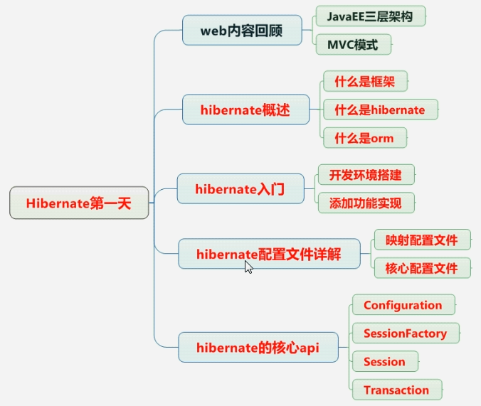
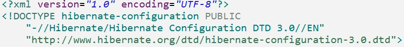
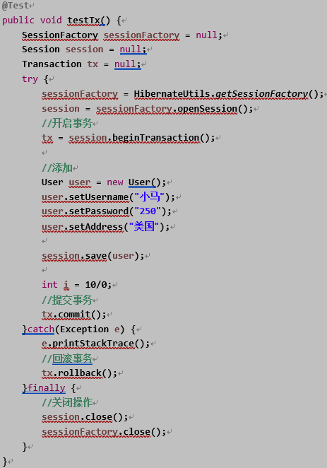

# Hibernate

JavaEE三层结构：
web层：struts2框架
service层：spring框架
dao层：hibernate框架
MVC思想：
m：模型
v：视图
c：控制器

Hibernate概述：
hibernate框架应用在javaee三层结果中的dao层框架
在dao层里面做对数据库crud操作，使用hibernate实现crud操作，hibernate底层代码就是jdbc，hibernate对jdbc进行封装，使用hibernate好处，不需要写复杂的jdbc代码了，不需要写sql语句实现
hibernate开源的轻量级框架
hibernate版本：
Hibernate3.x
Hibernate4.x
Hibernate5.x（学习）

lib：hibernate相关jar包

Hibernate核心内容是ORM（关系对象模型）。可以将对象自动的生成数据库中的信息，使得开发更加的面向对象。这样作为程序员就可以使用面向对象的思想来操作数据库，而不用关心繁琐的JDBC。所以，Hibernate处于三层架构中的D层（持久层）。

**使用Hibernate的优点**

1. Hibernate可以使用在java的任何项目中，不一定非要使用在java web项目中。因为Hibernate不需要类似于tomact这些容器的支持，可以直接通过一个main方法进行测试。
2. 通过下面的实例，可以发现使用Hibernate可以大大减少代码量。
3. 由于使用了Hibernate，代码中不涉及具体的JDBC语句，所以就方便了代码的可移植性。

**缺点**

首先，hibernate把数据库和你隔离了，你不需要关注数据库是mysql还是oracle，hibernate来帮你生成查询的sql。但问题也来了，如果你就要用某种数据库特有的功能，或者你就要让查询的sql完全符合你的心意，这就难了。如果使用hibernate，虽然它也能对生成的查询进行一定程度的定制，但就有点隔靴搔痒了，而且你开发起来付出的代价可能更大。至于hibernate对native sql的支持，其实也还是完善的，有兴趣的朋友可以看看。而且这种native sql还能返回non-managed entity，不走hibernate的cache，优化是能搞了，但如果你整个项目都这么搞，那还是ibatis对sql管理的好些。

第二，很多web服务，对cache的依赖是非常大的，hibernate自带的cache按理说也是很强大的，但是还是不能满足很多需求。

第三，hibernate的确是在你项目开始的时候给你节约了很多时间。但是它让你的业务逻辑模型和数据库模型互相依赖的程度太高了。这短期没有问题，但随着项目的变迁，这些都会改变，在维持这种紧紧耦合的关系的时候，你会发现你的代码特别脆弱，随便改一处数据库的schema，整个java项目可能要改几十处。而且现在mybatis的自动mapping做的也不差，开发起来也没多花多少时间。等项目进入中后期，你需要大量定制和优化查询的时候，mybatis的开发效率就胜出了。

强烈建议不用hibernate，尤其是需要处理大量数据或者大并发情况的网站服务

当一个 历经多年，无数个程序员迭代出来的 一千多张表 的大型系统 然后 hibernate 到底有多噩梦了, 后期 干脆 直接JDBC了 因为hibernate 在这种 表结构 完全乱套的

## ORM思想
hibernate使用orm思想对数据库进行crud操作
在web阶段学习javabean，更正确的叫法，实体类
**orm：object relational mapping：对象关系映射**
让实体类和数据库进行一一对应
让实体类首先和数据库表对应
让实体类属性和表里面字段对应
不需要直接操作数据库表，而操作表对应实体类对象

## Hibernate入门
**搭建hibernate环境：**

* 第一步：导入hibernate的jar包

  

  hibernate本身没有日志信息输出，需要导入日志信息输出的jar包：

  还有mysql驱动的jar包：

  

* 第二步：创建实体类：

  

  使用hibernate，不需要自己手动创建表，hibernate帮把表创建出来

* 第三步：配置实体类和数据库表一一对应关系（映射关系）

  使用配置文件实现映射关系
  创建xml格式的配置文件。实体类名字.hbm.xml
  映射配置文件没有固定要求，建议，在实体类所在包里面创建。
  配置是xml格式，在配置文件中首先引入xml约束
  学过dtd、schema，在hibernate里面引入dtd约束

  

  配置映射关系

  

  

* 第四步：创建hibernatede的核心配置文件

  核心配置文件格式xml，但是核心配置文件名称和位置是固定的
  位置必须在src下面，名称：必须hibernate.cfg.xml

  引入dtd约束：

  

  hibernate操作过程中，只会加载核心配置文件，其他配置文件不会加载

  * 第一部分：配置数据库信息

    

  * 第二部分：配置hibernate信息

    

  * 第三部分：把映射文件放到核心配置文件中

    

### 实现添加操作

* 第一步：加载hibernate核心配置文件
* 第二步：创建SessionFactory对象
* 第三步：使用SessionFactory创建session对象
* 第四步：开启事务
* 第五步：写具体逻辑crud操作
* 第六步：提交事务
* 第七步：关闭资源

建表，插入记录

###  Hibernate配置文件详解

#### Hibernate映射配置文件

映射配置文件位置名称和位置没有固定要求
映射配置文件中，标签name属性值写实体类相关内容
class标签name属性值实体类全路径
id标签和property标签name属性值，实体类属性内容
id标签和property标签，column属性可以省略，不写默认和name属性值一样
property标签里面还有type属性：设置生成表字段的类型，自动对应类型

#### Hibernate核心配置文件

配置写位置要求：

配置三部分要求：
数据库部分必须的
hibernate部分可选的
映射文件必须的
核心配置文件和名称位置固定的：
位置：src下面
名称：hibernate.cfg.xml

### Hibernate核心api

#### Configuration

到src下面找到名称hibernate.cfg.xml配置文件，创建对象，把配置文件放到对象里面（加载核心配置文件）

#### SessionFactory

使用Configuration对象创建sessionFactory对象
创建sessionfactory过程中做事情：
根据核心配置文件中，有数据库配置，有映射文件部分，到数据库立案根据映射关系吧表创建

创建sessionFactory过程中，这个过程特别耗资源：
在hibernate操作中，建议一个项目一般创建一个sessionFactory对象
具体实现：
写工具类：写静态代码块实现
静态代码块在类加载时候执行，执行一次

#### Session

session类似于jdbc中connection
调用session里面不同的方法实现crud操作
添加：save方法
修改：update方法
删除：delete方法
根据id查询fget方法
session对象-单线程对象：
session对象不能共用，只能自己使用

#### Transaction

事务对象

事务提交和回滚方法

事务概念
事务四个特性
原子性、一致性、隔离性、持久性

### 解决配置文件没有提示问题
把约束文件引入到eclipse中
window-->Perferences-->xm c(XML Catalog)-->
在配置文件复制网址
add
url-key-网址
location：本地文件路径

### 实体类编写规则

实体类里的属性要是私有的
私有属性使用公开的get、set方法操作
要求实体类有属性作为唯一的值（一般使用ID值）
实体类属性建议不使用基本数据类型，建议使用基本数据类型对应的包装类
八个基本类型对应的包装类：
int-Integer
char-Character
byte-Byte
short-Short
long-Long
float-Float
double-Double
boolean-Boolean

### Hibernate主键生成策略

hibernate要求实体类里面有一个属性作为唯一值，对应表主键，主键可以不同生成策略
hibernate主键生成策略有很多值：

在class属性里面有很多的值：

native：根据使用的数据库帮选择那个值
uuid：hibernaete自动生成uuid的值：
使用uuid生成策略，实体类里的id属性类型必须字符串类型

配置部分写出uuid值

### 实体类操作
save会保存，如果update没查就该，只会该指定值，其他为null
调用session里的save方法实现

根据id查询：
调用session里面的get方法

**修改操作：**

**删除操作：**

**实体类对象状态（概念）：**

* **瞬时态：对象里面没有id值，对象与session没有关联**

  

* **持久态：对象里面有id值，对象与session关联**

  

* **托管态：对象里面有id值，对象与session没有关联**

  

演示实体类对象的方法：

saveOrUpdate：实现添加、修改

### Hibernate一级缓存

什么是缓存
数据存到数据库里面，数据库本身是文件系统，使用流方式操作文件，效率不是很高：
把数据存到内存里面，不需要使用流方式，可以读取内存中数据
把数据放到内存中，提供读取效率

#### Hibernate缓存
hibernate框架中提供很多优化方式，hibernate的缓存就是一个优化方式
hibernate缓存特点：

* **第一类：hibernate的一级缓存**
  * hibernate的一级缓存默认打开的
  * hibernate的一级缓存使用范围，是session范围，从session创建到session关闭范围
  * hibernate的一级缓存中，存储数据必须持久态数据

* **第二类：hibernate的二级缓存**
  * 目前已经不适用了，替代技术：redis
  * 二级缓存默认不是打开的，需要配置及
  * 二级缓存适用范围是sessionFactory

#### 验证一级缓存存在

验证方式：
首先根据uid=1查询，返回对象
其次再根据uid=1查询，返回对象

第一步执行get方法之后，发送sql语句查询数据库
第二步执行get方法之后，没有发送sql语句，查询一级缓存内容

#### Hibernate一级缓存执行过程

#### Hibernate一级缓存特性

持久态自动更新数据库

执行过程

### Hibernate事务操作
什么是事务：
是操作中基本单元，一组操作，要么都成功，要么都失败
事务特性：
原子性，一致性，持久性，隔离性
不考虑隔离性产生问题：
脏读，不可重复读，虚度
设置事务隔离级别：
mysql默认隔离级别：repeatable read

#### Hibernate事务代码规范写法

代码结构：

### Hibernate绑定session

session类似于jdbc的connection，之前web阶段学过ThreadLocal
Hibernate帮实现与本地线程绑定session
获取与本地线程session：
在hibernate核心配置文件中配置

调用sessionFactory里面的方法得到

获取与本地线程绑定session时候，关闭session报错，不需要手动关闭

### Hibernate的api使用

#### Query对象

使用Query对象，不需要写sql语句，但是写hql语句
hql：hibernate query language，hibernate提供的查询语言，这个hql语句和普通sql很相似
hql和sql区别：
使用sql操作表和表字段
使用hql操作实体类和属性
查询所有hql语句：
from 实体类名称
Query对象的使用：
创建Query对象
调用Query对象里的方法

#### Criteria对象

使用这个对象查询操作，但是使用这个对象的时候，不需要写语句，直接调用实现

#### SQlQuery对象

使用hibernate时候，调用底层sql实现

返回的是一个数组形式list集合每部分是个数组

 返回的是一个对象数组

**web开发中sessionFactory不要关闭**

### 表与表之间的关系

一对多：一个分类里有多个商品，一个商品只能属于一个分类
一对多建表：通过外键建立关系

多对多：一个订单里面有多个商品，一个商品属于多个订单

一对一：一个男人只能有一个妻子，一个女人只能有一个丈夫

### 一对多操作

#### 一对多映射配置

以客户（Customer）联系人（LinkMan）为例
第一步：创建两个实体类，客户和联系人
第二步：让两个实体类之间互相表示：
在客户实体类里面表示多个联系人：一个客户里面有多个联系人

hibernate要求使用集合表示多的数据，使用set集合

在联系人实体类里面表示所属客户：一个联系人只能属于一个客户

配置映射文件：
实体类名称.hbm.xml：hibernate-mapping里面配置
一般一个实体类对应一个映射文件
把映射最基本配置完成

在映射文件中，配置一对多关系：
在客户映射文件中，表示所有联系人
class里面配置：

在联系人映射文件中，表示所属客户 
class里面配置：

创建核心配置文件，把映射文件引入核心配置文件中

#### 一对多级联操作

级联操作：
级联保存：添加了一个客户，为这个客户添加多个联系人
添加客户，为这个客户添加一个联系人
方式一：

方式二：
一般都是根据客户添加联系人
第一步：在客户映射文件中进行配置
在客户映射文件里面，set标签进行配置

第二步：创建客户和联系人对象，只需要把联系人放到客户里面就可以了，最终只需要保存客户就行了

级联删除：删除某一个客户，这个客户的所有联系人都删除
删除某个客户，把客户里面联系人也删除
具体实现：
第一步：在客户映射文件中，进行配置
set标签属性cascade属性值delete

第二步：在代码中直接删除客户：
先根据id查询对象，调用session里面delete方法删除

执行过程：
根据id查询客户
根据外键id查联系人
把联系人外键设置为null
删除联系人

#### 一对多修改操作

***inverse属性***
 因为hibernate是双向维护外键，在客户和联系人里面都需要维护外键，修改客户时候修改一次外键，修改联系人时候也修改一次外键，造成效率问题
 解决方式：让其中一方不维护外键
 一对多里面，让其中为一的那一方方放弃外键维护
 具体实现：在放弃关系维护映射文件中，进行配置，在set标签上使用inverse属性
 inverse属性默认值：false，不放弃关系维护。true，表示放弃关系维护

 ### 多对多操作

#### 多对多映射配置

以用户和角色为例：
 第一步：创建实体类，用户和角色
 第二步：让两个实体类之间互相表示
 用户里面表示所有角色，使用set集合

 一个角色多个用户，使用set集合

 第三步：配置映射关系：
 基本配置：Role.hbm.xml：

 User.hbm.xml：

 配置多对多关系
 在用户里面表示所有角色，使用set标签
 Role.hbm.xml：

 User.hbm.xml：

 在角色里面表示所用用户，使用set标签
 第四步：在核心配置文件中引入映射文件

#### 多对多级联保存

 根据用户保存角色
 第一步：在用户配置文件中set标签进行配置，cascade值save-update

 第二步：写代码实现：
 创建用户和角色对象，把角色放到用户里面，最终保存用户就可以了

#### 多对多级联删除

第一步：在set标签进行配置，cascade值delete

 第二步：删除用户

#### 维护第三张表关系

 用户和角色是多对多关系，维护关系通过第三张表维护
 让某个用户有某个角色：
 第一步：通过id查询用户和角色
 第二步：把角色放到用户界面：
 把角色对象放到用户set集合

 让某个用户没有某个角色：
 第一步：通过id查询用户和角色
 第二步：从用户里面把角色去掉：
 从set集合里面把角色移出

### Hibernate查询方式

#### 对象导航查询
根据id查询某个客户，再查询客户里面所有联系人

#### OID查询
根据id查询某一条记录，返回对象
调用session里面的get方法实现

#### hql查询
Query对象，写hq语句实现查询
普通sql操作数据库表和字段，hql操作实体类和属性
常用的hql语句：
查询所有：from 实体类名称
条件查询：
from 实体类名称 where 实体类属性名称=? and 实体类属性名称=?
from 实体类名称 where 实体类属性名称 like ?
排序查询：from 实体类名称 order by 实体类属性名称 asc/desc
使用hql查询操作时候，使用Query对象：
创建Query对象，写hql语句
调用query对象里面的方法得到结果

##### 查询所有

##### 条件查询

hql条件查询语句写法：
from 实体类名称 where 实体类属性名称=? and 实体类属性名称=?

from 实体类名称 where 实体类属性名称 like ?

##### 排序查询

from 实体类名称 order by 实体类属性名称 asc/desc 

##### 分页查询

使用关键字limit实现

在hql中实现分页：
在hql操作中，在语句里面不能写limit，hibernate的Query对象封装了两个方法实现分页操作

##### 投影查询

查询的不是所有字段的值，而是部分字段的值
投影查询的hql语句：
select 实体类属性名称1，实体类属性名称2 from 实体类属性名称
select后面不能写* ，不支持  

##### 聚合函数的使用

常用聚集函数：count、sum、avg、max、min
hql聚集函数写法：
查询表记录数：
select count(* ) from 实体类名称 

#### QBC查询

Criteria对象
使用hql查询需要写hql语句实现，使用qbc时候，不需要写语句，使用方法实现
使用qbc时候，操作实体类和属性
使用qbc，使用Criteria对象实现

##### 查询所有

创建Criteria对象
调用方法得到结果

##### 条件查询

没有语句，使用封装的方法

##### 排序查询

##### 分页查询

开始位置计算公式：（当前页-1）* 每页记录数

##### 统计查询

##### 离线查询

不用session也能创建Criteria对象

servlet调用service，service调用dao
dao里面对数据库crud操作
在dao里面使用hibernate框架，使用hibernate框架的时候，调用session里面的方法实现功能

#### HQL多表查询

Mysql里面多表查询：
内连接：

左外连接：

右外连接：

HQL多表查询：
内连接：
内连接查询hql语句写法：客户联系人为例
from Customer c inner join c.setLinkMan

左外连接：
返回list中每部分是数组
hql语句：from Customer c left outer join c.setLinkMan
右外连接：
迫切内连接：和内连接底层实现一样的
区别：使用内连接返回list中每部分是数组，迫切内连接返回list每部分是对象
hql语句写法：from Customer c inner join fetch c.setLinkMan
迫切左外连接：from Customer c left outer join fetch c.setLinkMan
返回list每部分是对象

#### 本地sql查询
SQLQuery对象，使用普通sql实现查询

### Hibernate检索策略概念

hibernate检索策略分为两类：
立即查询：根据id查询，调用get方法，一调用get方法马上发送语句查询数据库

延迟查询：根据id查询，还有load方法，调用load方法不会马上发送语句查询数据，只有得到对象里面的值时候才会发送语句查询数据库

延迟查询：
类级别延迟：根据id查询返回实体类对象，调用load方法不会马上发送语句
关联级别延迟：查询某个客户，再查询这个客户的所有联系人，查询客户的所有联系人的过程是否需要延迟，这个过程称为关联级别延迟 

关联级别延迟操作：
在映射文件中进行配置实现：
根据客户得到所有的联系人，在客户映射文件中配置

在set标签傻瓜使用属性
fetch：值：select（默认）
lazy：值：
true：延迟（默认）
false：不延迟，调用get后，发送两条sql语句
extra：极其延迟，极其懒惰，要什么值给什么值

### Hibernate批量抓取

查询所有客户，返回list集合，遍历list集合，得到每个客户，得到每个客户的所有联系人
效率低：会发送很多sql语句

在客户的映射文件中，set标签配置

batch-size值：值越大，发送语句越少