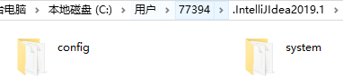
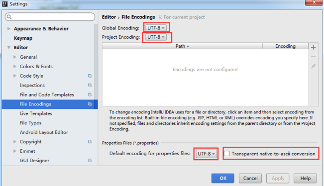
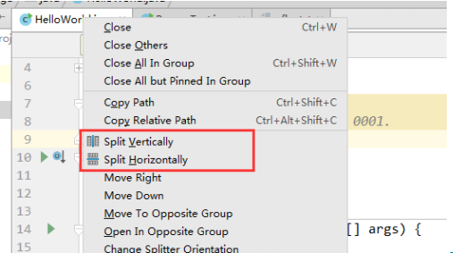
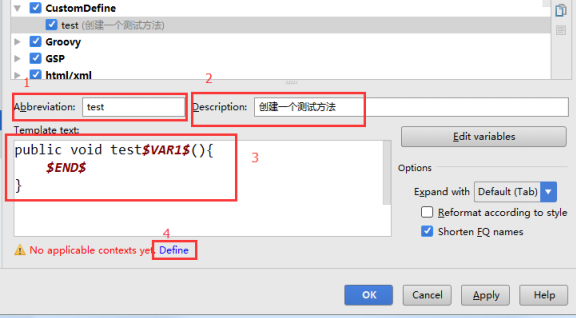

# IDEA

## IDEA的主要优势(相较于Eclipse而言)

1. 强大的整合能力，比如Git、Maven、Spring等
2. 提示功能的快速、便捷
3. 提示功能的范围广
4. 好用的快捷键和代码模板
5. 精准搜索
6. ...

## IDEA的目录结构

* bin：容器，执行文件和启动参数
* help：快捷键文档和其他帮助文档        
* jre64：64位java运行环境        
* lib：idea依赖的类库        
* license：各个插件许可        
* plugin：插件

**设置目录结构：**



* config目录是Intellij个性化设置目录        
* system目录是Intellij系统文件目录

## IDEA的使用

### 如何调整VM配置文件


### 创建Java工程


* Create New Project：创建一个新的工程        
* Import Project：导入一个现有工程        
* Open：打开一个已有工程        
* Check out form Version Control： 可以通过服务器上的项目地址 check out Github 上面项目或其他 Git 托管服务器上的项目

### 设置显示常见的视图


### Module:模块         

在 IntelliJ IDEA 中 Project 是最顶级的级别，次级别是 Module。一个 Project IntelliJ IDEA 的安装、配置与使用 可以有多个 Module。目前主流的大型项目都是分布式部署的，结构都是类似这 种多 Module 结构。


这类项目一般是这样划分的，比如：core Module、web Module、plugin Module、 solr Module 等等，模块之间彼此可以相互依赖。通过这些 Module 的命名也可 以看出，他们之间都是处于同一个项目业务下的模块，彼此之间是有不可分割的 业务关系的。         

相比较于多 Module 项目，小项目就无需搞得这么复杂。只有一个 Module 的 结构 IntelliJ IDEA 也是支持的，并且 IntelliJ IDEA 创建项目的时候，默认就是单 IntelliJ IDEA 的安装、配置与使用 Module 的结构的。

#### 如何删除模块


### 查看项目配置：


### 常用配置


#### Appearance & Behavior

##### 设置主题


##### 设置窗体及菜单的字体及字体大小(可忽略)


##### 设置编辑区主题(可忽略)

Idea默认提供了两个编辑区主题，可以通过如下的方式进行选择


* 如果想要更多的主题效果，可以到如下网站下载：

  [主题](http://www.riaway.com)

* 下载以后，导入主题

  file - > import settings - > 选中下载的主题jar文件 ->  一路确认 - > 重启

#### Editor - General

##### 设置鼠标滚轮修改字体大小(可忽略)


可以增加 **Ctrl + 鼠标滚轮** 快捷键来控制代码字体大小写显示

##### 设置鼠标悬浮提示


##### 设置自动导包功能


* Add unambiguous imports on the fly：自动导入不明确的结构
* Optimize imports on the fly：自动帮我们优化导入的包

##### 设置显示行号和方法间的分隔符


如上图红圈所示，可以勾选Show line numers：显示行数，建议一般勾选上

Show method separators：显示方法分隔线，有助于区分开方法，建议勾选

##### 忽略大小写提示


IDEA的代码提示和补充功能有一个特性，区分大小写，如上图标注所示，默认就是First letter区分大小写的。

**新版：2019-1-3这样修改**


##### 设置取消单行显示tabs的操作


#### Editor - Font

##### 设置默认的字体、字体大小、字体行间距


#### Editor - Color Scheme

##### 修改当前字体、字体大小、字体行间距(可忽略)

如果当前主题不希望使用默认字体、字体大小、字体行间距、还可以单独设置


##### 修改当前主题的控制台输出的字体及字体大小(可忽略)


##### 修改代码中注释的字体颜色


Doc Comment-Text：修改文档注释的字体颜色

Block Comment：修改多行注释的字体颜色

Line Comment：修改单行注释的字体颜色

#### Editor - Code Style

##### 设置超过指定import个数，改为*，(可忽略)


#### Editor - File and Code Templates

##### 修改类头的文档注释信息


`/** @author shkstart @create ${YEAR}-${MONTH}-${DAY} ${TIME} *///`

**常用的预设的变量，这里直接贴出官网给的：**

```java
${PACKAGE_NAME} - the name of the target package where the new class or interface will be created. 
${PROJECT_NAME} - the name of the current project. 
${FILE_NAME} - the name of the PHP file that will be created.
${NAME} - the name of the new file which you specify in the New File dialog box during the file creation. 
${USER} - the login name of the current user. 
${DATE} - the current system date. 
${TIME} - the current system time. 
${YEAR} - the current year. 
${MONTH} - the current month. 
${DAY} - the current day of the month. 
${HOUR} - the current hour. 
${MINUTE} - the current minute. 
${PRODUCT_NAME} - the name of the IDE in which the file will be created. 
${MONTH_NAME_SHORT} - the first 3 letters of the month name. Example: Jan, Feb, etc. 
${MONTH_NAME_FULL} - full name of a month. Example: January, February, etc
```

#### Editor - File Encodings

##### 设置项目文件编码



说明：Transparent native-to-ascii conversion主要用于转换ascii，一般都要勾选，不然Properties文件中的注释信息显示的都不是中文

#### Build,Execution,Deployment

##### 设置自动编译


##### 设置省电模式(可忽略)


##### 设置代码水平或垂直显示



#### 设置快捷键(Keymap)

##### 设置快捷键为Eclipse快捷键


##### 通过快捷键功能修改快捷键设置


##### 通过指定快捷键，查找或修改其他功能


##### 导入已有的设置


### 关于模板(Templates)

(Editor - Live Templates 和 Editor - General - Postfix Completion)

#### Live Templates(实时代码模板)功能介绍

它的原理就是配置一些常用代码字母缩写，在输入简写时可以出现你预定义的固定模式的代码，使得开发效率大大提高，同时也可以增加个性化。最简单的例子 就是在 Java 中输入 sout 会出现 System.out.println();

#### 已有的常用模板

##### Postfix Completion默认如下


##### Live Templates默认如下


二者的区别：Live Templates可以自定义，而Postfix Completion不可以，同时，有些操作二者都提供了模板，Postfix Templates较Live Templates能快0.01s

**举例：**

**psvm：可生成main方法**

**sout：System.out.println()快捷输出**

类似的：

soutp = System.out.println("方法形参名 = " + 形参名);

soutv = System.out.println("变量名 = " + 变量);

soutm = System.out.println("当前类名.当前方法");

"abc".sout => System.out.println("abc");

**fori：可生成for循环**

iter：可成增强for循环

itar：可生成普通for循环

**list.for：可生成集合list的for循环**

**ifn：可生成if(xxx = null)******

**prsf：可生成private static final**

类似的：

psf：可生成 public static final

psfi：可生成 pubic static final int

psfs：可生成 public static final String

#### 修改现有模板：Live Templates

通过调用psvm调用不习惯，可以修改

#### 自定义模板


先定义一个模板组：


选中自定义的模板组，点击"+"来定义模板



1. Abbreviation：模板的缩略名称
2. Description：模板的描述
3. Template text：模板的代码片段
4. 应用范围，比如点击Define,选择如下


### 配置Tomcat

在IDEA中配置Tomcat之前，需要保证已经安装并配置了Tomcat的环境变量


### 关联数据库

#### 关联方式


#### 常用操作


### 版本控制(Version Control)

不管是个人开发还是团队开发，版本控制都会被使用，而IDEA也很好的集成了版本控制相关结果


很多人认为Intellij自带了SVN或是Git等版本控制工具，认为只要安装了IntellijIDEa就可以完全使用版本控制应有的功能，这是一种完全错误的解读，Intellij IDEA是自带对这些版本控制工具的插件支持，但是该装什么版本控制客户端还是要照样装的


Intellij IDEA对版本控制的支持是以插件化的方式来实现的，旗舰版默认支持目前主流的版本控制软件，CVS、Subversion(SVN)、Git、Mercurial、Perforce、TFS。又因为目前太多人使用Github进行协同或是项目版本管理，所以Intellij IDEA同时自带了Github插件，方便Checkout和管理你的Github项目

在实际开发中，发现IDEA中使用SVN经历不算愉快，经常会遇到很多问题，比如紧急下IDEA无法更新、提交等

#### 提前安装好Git客户端

[Git的msysGit官网下载](https://git-scm.com/)

[Git客户端TortoiseGit官网下载](http://download.tortoisegit.org/tgit/)

#### 关联git.exe


#### 关联GitHub上的账户，并测试连接


#### 在Github上创建账户下的一个新的仓库作为测试


#### 支持从当前登录的github账号上直接Checkout项目


#### 在IDEA中clone Github上的仓库


这里需要在Github的自己账户下，复制项目仓库路径，填写上图git repository URL中


#### 连接成功会下载github上的项目


根据自己需要，选择本窗口还是开启一个新窗口

#### 除此之外，还可以通过如下方式连接GitHub


#### 本地代码分享到GitHub


此时会在github上创建一个新的仓库，而非更新已经存在的仓库

#### Git的常用操作


clone：拷贝远程仓库

commit：本地提交

push：远程提交

pull：更新到本地

#### 没有使用Git时本地历史记录的查看


即使我们项目没有使用版本控制功能，Intellij IDEA也给我们提供了本地文件历史记录

### 断点调试

#### Debug的设置


设置Debug连接方式，默认时Socket，Shared memory是Windows特有的一个属性，一般在Windows系统下建议使用此设置，内存占用相对较少

#### 常用断点调试快捷键


#### 条件断点

**说明：**

调试的时候，在循环里增加条件判断，可以极大的提高效率，心情也能愉悦

**具体操作：**

在断点处点击调出条件断点，可以在满足某个条件下，实施断点

**查看表达式的值(Ctrl+u)**

选择行 ctrl+u 还可以查看框中输入编写代码时的其他方法


### 配置Maven

#### Mavan介绍

Maven -> Ant -> Maven -> Gradle

Mave是Apache提供的一款自动化构建工具，用于自动化构建和依赖管理，开发团队基本不用花多少时间就能自动完成工程的基础构建配置，因为Maven使用了一个标准的目录结构和一个默认的构建生命周期。

**构建环节：**


#### Maven的配置

maven下载-解压-配置(settings配置仓库reposiroty)


* Maven home directory：可以指定本地Maven的安装目录所在，因为已经配置了M2_HOME系统参数，所以直接这样配置Intellij IDEA是可以找到的，但是加入没有配置，这里选择Maven安装目录，此外不建议使用IDEA默认的
* User settings file/Local repository：我们还可以指定Maven的settings.xml位置和本地仓库位置


* Import Maven projects atuomaticallu：表示Intellij IDEA会实时监控项目的pom.xml文件，进行项目变动设置
* Automatically download：在Maven导入依赖包时候，是否自动下载源码和文档，不建议勾选，因为会加快项目从外网导入依赖包的速度。Intellij支持直接从公网下载源码和文档，如果需要我们可以针对某个依赖包进行联网下载
* VM options for importer：可以设置导入的VM参数，一般不需要主动该，除非项目真的导入太慢了我们再增大此参数

#### 创建对应的Module


Group：组织或公司域名，倒叙

Artiface：项目模块名称

Version：默认maven生成版本

其中常用的是clean、compile、package、install。

如果其他项目需要将这里的模块作为依赖使用，那就可以install安装到本地仓库的位置

maven下创建的web工程目录会和eclipse不一样，需要手动创建resource、java、test文件

### 其他设置

#### 生成javadoc


输入：

Locale：输入语言类型：zh_CN

Other command line arguments：-encoding UTF-8 -charset UTF-8

#### 缓存和索引的清理


#### 取消更新


