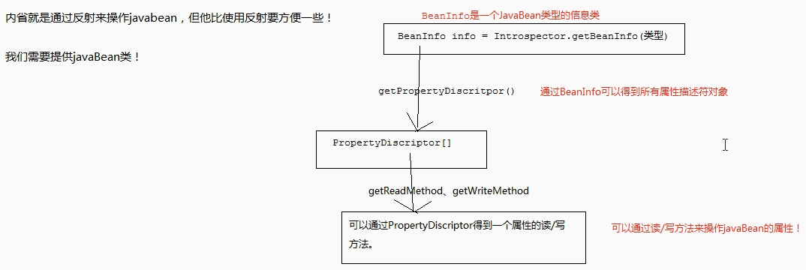
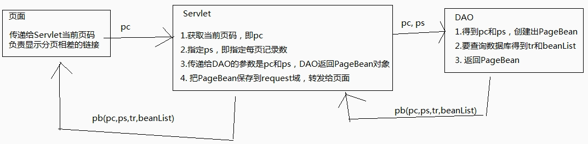

# JavaBean
必须要为成员提供get/set方法（提供一个也可以）如果只有get方法，那么这个属性是只读属性必须要有默认构造器（没参）一般对于具有get/set方法的成员变量称之为属性其实就算一个属性没有对应的成员变量，只有get/set方法也是可以的属性的名称就是get/set方法去除get/set后，再把首字母小写

get/set决定属性名称

方法名称满足一定的规范，那么他就是属性

boolean类型的属性，他的读方法可以是is开头或是get开头

**JavaBean内省**
内省类 -->Bean信息 -->属性描述符 -->属性的get/set对应的Method! -->反射

commons-beanutils 依赖内省完成的
导包：
commons-beanutils.jar
commons-logging.jar
```java
String className = "cn.cj.domain.Person";
Class clazz = Class.forName(className);
Object bean = clazz.newInstance();
BeanUtils.setProperty(bean,"name","张三");

String age = BeanUtils.getProperty(bean,"age");
```

把map中的属性直接封装到一个bean中要求map的key与bean的属性名相同
BeanUtils.populate(user,map);

map转换成指定类型的javaBean对象

```java
public static <T> T toBean(Map map, Class<T> clazz){
try{
    T bean = clazz.clazz.newInstance();
    BeanUtils.populate(bean,map);
    return bean;
}catch(Exception e){
    throw new RuntimeException(e);
}
}
```



**jsp中的javabean相关标签**

`<jsp:useBean>` 创建或查询bean
在域中查找名为user1的bean，如果不存在，创建

```javascript
<jsp:useBean id = "user1" class="cn.cj.domain.User" scope="page"/>创建保存
<jsp:useBean id = "user1" class="cn.cj.domain.User" scope="page"/>查找
```
`<jsp:setProperty>`
```javascript
<jsp:setProperty property="username" name="user1" value="admin"/>设置名为user1的javabean的username属性值为admin
```
`<jsp:getProperty>`
```javascript
<jsp:getProperty property="username" name="user1"/>获取名为user1的javabean的名为username属性值
```

## JDBC分页-监听器

**分页**

分页的优点：只查询一页，不查询所有页
分页数据：

```java
数据都是从Servlet传递来的
Servlet：
    当前页：pageCode，pc
        pc：如果页面没有传递当前页码，那么Servlet默认是第一页，或者按页面传递为准
    总页数：totallPages。tp
        tp：总记录数/每页记录数
    总记录数：totallRecored，tr
        tr：dao来获取，select count(*) from t_customer;
    每页记录数：业务数据或叫系统数据
    当前页数据：beanList
    url
```
数据的传递：
```java
这些分页数据总要在各层之间来回传递
把这些分页数据封装到一个javaBean中，就叫分页Bean，例如PageBean
```
分页在各层中处理：

页面：给出分页相关的链接们

```java
    页面需要给Servlet传递当前页码pc
Servlet：创建PageBean对象，给PageBean所有属性赋值，然后传递给页面
    Servlet需要给Dao传递pc、ps
Service：
Dao：
    tr：select count(*) t_customer
    beanList：select * from t_customer LIMIT x,y
```


## 监听器

JavaWeb监听器：Listener

```java
监听器是一个接口，内容我们来实现
监听器需要注册
监听器的方法，会在特定事件发生时被调用
```

观察者：
```java
事件源
事件
监听器
```
事件源：三大域
```java
ServletContext：
    生命周期监听：ServletContextListener：两个方法，一个出生时调用，一个死亡时调用
        void contextInitialized(ServletContextEvent sce)：创建SErvletcontext时
        void contextDestroyed(ServletContextEvent sce)：销毁SErvletcontext时
    属性监听：ServletCcontextAttributeListener：三个方法，一个在添加属性时调用，一个在替换属性时调用，最后一个在移出属性时调用
        void attributeAdded(ServletContextEvent event)：添加属性时
        void attributeReplaced(ServletContextEvent event)：替换属性时
        void attributeRemoved(ServletContextEvent event)：移除属性时
    可以存放一些在tomcat启动时就要完成的代码
HttpSesion：
    生命周期监听：HttpSesionListener：两个方法，一个出生时调用，一个死亡时调用
        void sessionCreated(HttpSessionEvent se)：创建session时
        void sessionDestroyed(HttpSessionEvent se)：销毁session时
    属性监听：HttpSesionAttributeListener：三个方法，一个在添加属性时调用，一个在替换属性时调用，最后一个在移出属性时调用
        void attributeAdded(HttpSessionBindingEvent event)：添加属性时
        void attributeReplaced(HttpSessionBindingEvent event)：替换属性时
        void attributeRemoved(HttpSessionBindingEvent event)：移除属性时
ServletRequest：
    生命周期监听：ServletRequestListener：两个方法，一个出生时调用，一个死亡时调用
        void requestInitialized(ServletRequestEvent sre)：创建request时
        void requestDestroyed(ServletRequestEvent sre)：销毁request时
    属性监听：ServletRequestAttributeListener：三个方法，一个在添加属性时调用，一个在替换属性时调用，最后一个在移出属性时调用
        void attributeAdded(ServletRequestEvent event)：添加属性时
        void attributeReplaced(ServletRequestEvent event)：替换属性时
        void attributeRemoved(ServletRequestEventevent)：移除属性时
```
写一个监听器类：
```java
要求必须实现某个监听器接口
注册，是在web.xml中配置来完成注册
```

```xml
<listener>
        <listener-class>cn.cj.web.listener.AListener</listener-class>
    </listener>
```
事件对象：
```java
ServletContextEvent：ServletContext getServletContext()
HttpServletEvent：HttpSession getSession()
ServletRequest：
    ServletContext getServletContext()；
    ServletRequest getServletRequest();
ServletContextAttributeEvent:
    ServletContext getServletContext();
    String getName()：获取属性名
    Object getValue()：获取属性值
HttpSessionBindingEvent
    String getName()：获取属性名
    Object getValue()：获取属性值
ServletRequestEvent
    String getName()：获取属性名
    Object getValue()：获取属性值
感知监听器（都与HttpSession相关）
    用来添加到JavaBena上，而不是添加到三大域上
    这两个监听器都不需要在web.xml中注册
```
HttpSessionBindingListener：
```java
添加到javaBean上，javaBean就知道自己是否添加到Session中  
```
HttpSessionActivationListener：
```java
Tomcat会在session从时间不被使用时钝化session对象，所谓钝化session，就是把session通过序列化的方式保存到硬盘文件中。当用户再使用session时，Tomcat还会把钝化的对象再活化session，所谓活化就是把硬盘文件中的session在反序列化回内存。当session被Tomcat钝化时，session中存储的对象也被纯化，当session被活化时，也会把session中存储的对象活化。如果某个类实现了HttpSessionActiveationListener接口后，当对象随着session被钝化和活化时，下面两个方法就会被调用：
```
public void sessionWillPassivate(HttpSessionEvent se)：当对象感知被活化时调用本方法；
public void sessionDidActivate(HttpSessionEvent se)：当对象感知被钝化时调用本方法；
HttpSessionActivationListener监听器与HttpSessionBindingListener监听器相似，都是感知型的监听器，例如让Person类实现了HttpSessionActivationListener监听器接口，并把Person对象添加到了session中后，当Tomcat钝化session时，同时也会钝化session中的Person对象，这时Person对象就会感知到自己被钝化了，其实就是调用Person对象的sessionWillPassivate()方法。当用户再次使用session时，Tomcat会活化session，这时Person会感知到自己被活化，其实就是调用Person对象的sessionDidActivate()方法。
注意，因为钝化和活化session，其实就是使用序列化和反序列化技术把session从内存保存到硬盘，和把session从硬盘加载到内存。这说明如果Person类没有实现Serializable接口，那么当session钝化时就不会钝化Person，而是把Person从session中移除再钝化！这也说明session活化后，session中就不在有Person对象了。