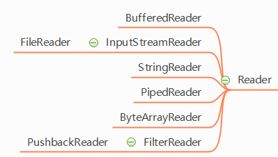

# File类

我们要想实现IO的操作，就必须知道硬盘上文件的表现形式

而Java提供了一个类File供我们使用

File：文件和目录（文件夹）路径名的抽象表示形式

## 构造方法：

```java
File(String pathname);//根据一个路径得到File对象
File(String parent,String child);//根据一个目录和一个子文件/目录得到File对象
File(File parent,String child);//根据一个父File对象和一个子文件/目录得到File对象
```

```java
public class FileDemo{
  public static void main(String[] args){
    File file = new File("E:\\demo\\a.txt");
    File file2 = new File("E:\\demo","a.txt");
    File file3 = new File("E:\\demo");
    File file4 = new File(file3,"a.txt");
  }
}
```

## File类的方法

```java
//创建功能
public boolean createNewFile();//创建文件，如果存在这样的文件，就不创建了
public boolean mkdir();//创建文件夹，如果存在这样的文件，就不创建了
public boolean mkdirs();//创建文件夹，如果父文件夹不存在，会帮你创建出来

//删除功能
public boolean delete();
//如果创建文件或则文件夹忘了写盘符路径，默认在项目路径下
//Java中的删除不走回收站
//要删除一个文件夹，请注意该文件夹内不能包含文件或者文件夹

//重命名功能
public boolean renameTo(File dest);
//如果路径名相同，就是改名
//如果路径名不同，就是改名并剪切
//路径以盘符开始：绝对路径 C:\\a.txt
//路径不以盘符开始：相对路径 a.txt

//判断功能
public boolean isDirectory();//判断是否是目录
public boolean isFile();//判断是否是文件
public boolean exists();//判断是否存在
public boolean canRead();//判断是否可读
public boolean canWrite();//判断是否可写
public boolean isHidden();//判断是否隐藏

//获取功能
public String getAbsolutePath();//获取绝对路径
public String getPath();//获取相对路径
public String getName();//获取名称
public long length();//获取长度，字节数
public long lastModified();//获取最后一次的修改时间，毫秒值

public String[] list();//获取指定目录下的所有文件或者文件夹的名称数组
public File[] listFiles();//获取指定目录下的所有文件或者文件夹的File数组
//要想实现这个效果，就必须学习一个接口：文件过滤器
public String[] list(FilenameFilter filter);
public File[] listFiles(FilenameFilter filter);
```

## 递归

方法定义中调用方法本身的现象

程序调用自身的编程技巧称为递归（ recursion）。递归做为一种算法在程序设计语言中广泛应用。 一个过程或函数在其定义或说明中有直接或间接调；

用自身的一种方法，它通常把一个大型复杂的问题层层转化为一个与原问题相似的规模较小的问题来求解，递归策略只需少量的程序就可描述出解题过；

程所需要的多次重复计算，大大地减少了程序的代码量。递归的能力在于用有限的语句来定义对象的无限集合。递归是一种应用非常广泛的算法（或者编程技巧）。递归求解问题的分解过程，去的过程叫“递”，回来的过程叫“归”。

递归需要满足的三个条件：1. 一个问题的解可以分解为几个子问题的解；2. 这个问题与分解之后的子问题，除了数据规模不同，求解思路完全一样；3. 存在递归终止条件。

### **递归的三个条件：**

1. 边界条件
2. 递归前进段
3. 递归返回段

**当边界条件不满足时，递归前进；当边界条件满足时，递归返回。**

### 递归注意实现

要有出口，否则就是死递归

次数不能太多，否则就内存溢出

构造方法不能递归使用

### 递归5的阶乘


###  递归问题

**问题：N级台阶（比如100级），每次可走1步或者2步，求总共有多少种走法？**

分析：如果有大于2级的n级台阶，那么假如第一次跳一级台阶，剩下还有n-1级台阶，有f(n-1)种跳法，假如第一次条2级台阶，剩下n-2级台阶，有f(n-2)种跳法。这就表示f(n)=f(n-1)+f(n-2)，即斐波那契数列。假设只有一个台阶，那么只有一种跳法，那就是一次跳一级，f(1)=1；如果有两个台阶，那么有两种跳法，第一种跳法是一次跳一级，第二种跳法是一次跳两级，f(2)=2。

```java
//费波纳契数列变形，求n个台阶的走法，递归方式
public int f(int n){
  if(n<=2){
    return n;
  }
  return f(n-1)+f(n+2);
}
```

编写递归代码的关键是，只要遇到递归，我们就把它抽象成一个递推公式，不用想一层层的调用关系，不要试图用人脑去分解递归的每个步骤。

**递归代码要警惕重复计算**

为了避免重复计算，我们可以通过一个数据结构（比如散列表）来保存已经求解过的 f(k)。

```java
//费波纳契数列变形，求n个台阶的走法，递归方式
public int f(int n){
  //新建一个HashMap，用来保存已经求过的f(n)，避免重复计算
  HashMap<Integer,Integer> hashMap = new HashMap<>();
  if(n<=2){
    return n;
  }
  //求f(n)时，先判断map中是否已经存在，如果存在直接取值
  if(hashMap.containsKey(n)){
    return hashMap.get(n);
  }
  int ret = f(n-1)+f(n+2);
  hashMap.put(n,ret);//将f(n)存进map中
  return ret;
}
```

**递归代码要警惕堆栈溢出**

我们可以通过在代码中限制递归调用的最大深度的方式来解决这个问题，递归调用超过一定深度（比如 1000）之后，我们就不继续往下再递归了，直接抛出异常。

```java
int depth = 0;//全局变量，表示递归的深度
//费波纳契数列变形，求n个台阶的走法，递归方式
public int f(int n){
  ++depth;
  if(depth>1000){
    System.out.println("超过设定深度了");
  }
  //新建一个HashMap，用来保存已经求过的f(n)，避免重复计算
  HashMap<Integer,Integer> hashMap = new HashMap<>();
  if(n<=2){
    return n;
  }
  //求f(n)时，先判断map中是否已经存在，如果存在直接取值
  if(hashMap.containsKey(n)){
    return hashMap.get(n);
  }
  int ret = f(n-1)+f(n+2);
  hashMap.put(n,ret);//将f(n)存进map中
  return ret;
}
```

**怎么将递归代码改写为非递归代码？**

递归本身就是借助栈来实现的，如果我们自己在内存堆上实现栈，手动模拟入栈、出栈过程，便可以将递归改成非递归。

```java
//费波纳契数列变形，求n个台阶的走法，非递归方式
public int f(int n){
  //n = 1或n = 2,直接返回f(1) = 1,f(2) = 2
  if(n<2){
    return n;
  }
  int ret = 0;//ret中存储的结果f(n)
  int prepre = 1;//prepre存储的值是f(n-2),初始值是f(1)=1
  int pre = 2;//pre存储的值是f(n-1),f(2)=2
  for(int i = 3;i<n;i++){
    //手动模拟栈的过程
    ret = prepre + pre;
    prepre = pre;
    pre = pre;
  }
  return ret;
}
```

**递归:文件目录**

```java
import java.io.File;

/**
 * 任务：计算一个文件夹大小：累加文件的大小
 * @author gyf
 *
 */
public class Demo01 {

    public static void main(String[] args) {
        //递归:文件目录
        /**打印出a目录所有文件名称，包括子文件夹的文件*/
        
        //1.创建目录对象
        File dir = new File("C:/Users/10301/Desktop/a");
        
        //2.打印目录的子文件
        printSubFile(dir);
    }
    
    public static void printSubFile(File dir){
        //打印目录的子文件
        File[] subfiles = dir.listFiles();
        
        for(File f : subfiles){
            if(f.isDirectory()){//文件夹
                printSubFile(f);
            }else{//文件
                System.out.println(f.getAbsolutePath());
            }
            
        }
    }
}
```

**练习:从键盘输入接收一个文件夹路径,打印出该文件夹下所有的.jpg文件名**

```java
import java.io.File;
import java.util.Scanner;

public class Demo02 {
    public static void main(String[] args) {
        // TODO Auto-generated method stub
        //练习:从键盘输入接收一个文件夹路径,打印出该文件夹下所有的.jpg文件名

        //1.获取文件路径
        Scanner scanner = new Scanner(System.in);
        System.out.println("请输入一个文件夹路径...");
        String path = scanner.nextLine();
        
        //2.把路径封装成File对象
        File file = new File(path);
        if(!file.exists()){
            System.out.println("此路径对应的文件不存在");
            return;
        }
        
        if(!file.isDirectory()){
            System.out.println("请输入文件夹路径，而不文件路径");
            return;
        }
        
        //3.遍历文件夹下的子文件
        printSubFile(file);
        
    }
    
    public static void printSubFile(File dir){
        //打印目录的子文件
        File[] subfiles = dir.listFiles();
        
        for(File f : subfiles){
            if(f.isDirectory()){//文件夹
                printSubFile(f);
            }else{//文件
                if(f.getName().endsWith(".jpg")){
                    System.out.println(f.getAbsolutePath());
                }
            }
        }
    }
}
```

# IO流


IO流用来处理设备之间的数据传输,Java对数据的操作是通过流的方式
Java用于操作流的类都在IO包中，上传文件和下载文件

Java对数据的操作是通过流的方式

Java用于操作流的对象都在IO包中

Stream是java的一个类，专门用于处理程序个外部设备的输入输出（简称IO），这里的外部设备可以是文件、键盘或者网络。基本所有的流都在这个包中。实际上流就是数据在程序和外部设备之间的管道，而类的方法则是管道上的各种按钮。

**所以为什么需要流呢？**

在数据量很大的情况下，节省时间
内存有限，需要“分时分步”进行传输
带宽有限
而stream可以分次传输数据，一点一点传，这就是Stream存在的意义。这里可以参照腾X的下载软件，每次下载一个文件都是在本地建一个cache文件，然后把文件分成很多个部分缓存到本地，等缓存完毕再以.qlv形式的文件保存在硬盘中。

**流的重要性：**

流是java的一个类，但类并不是流
流是单向的，要么input，要么output。
流不会改变原数据，也不能存储数据
Java的Stream有很多个子类，可以划分为若干类

**按流向分为两种：**

输入流（读取数据）
输出流（写数据）

Java流的传输只有一个方向，所以我们把从外部设备流向程序的数据流称为输入流。

反之，把程序数据流向外部设备的流称为输出流。

**流按操作类型分为两种**:

字节流 : 字节流可以操作任何数据,因为在计算机中任何数据都是以字节的形式存储的
字符流 : 字符流只能操作纯字符数据，比较方便。

## 四大基本Stream

Java流有很多种，但是基本都是继承自四个基本流（*这四个类是抽象类，不能直接实例化new*）：

- InputStream：输入字节流
- OutputStream：输出字节流
- Reader：输入字符流
- Writer：输出字符流

### 字节流

字节流以字节（8bit）为单位，字节流能处理所有类型的数据（如图片、avi等）

#### InputStream


字节输入流

1. InputStream 是所有的输入字节流的父类，它是一个抽象类。用来读取数据。
2. ByteArrayInputStream、StringBufferInputStream、FileInputStream 是三种基本的介质流，它们分别从Byte 数组、StringBuffer、和本地文件中读取数据。
3. ObjectInputStream 和所有FilterInputStream 的子类都是装饰流（装饰器模式的主角）

**字节输入流操作步骤:**

创建字节输出流对象

调用read()方法读取数据，并把数据显示在控制台

释放资源

**计算机如何识别什么时候把两个字节转换为一个中文？**

第一个字节肯定是负数

第二个字节常见的是负数，可能有正数

当看到负数就把两个字节拼在一起

##### FileInputStream

**文件输入流**

FileInputStream 从文件系统中的某个文件中获得输入字节。FileInputStream 用于读取诸如图像数据之类的原始字节流。要读取字符流，请考虑使用 FileReader

**构造方法：**

```java
FileInputStream(File file)
FileInputStream(String name)
```

**成员方法：**

```java
int read() 从此输入流中读取一个数据字节。
```

**案例:读取一个txt文件数据(方法一)**

- 1.FileInputStream用于读取文件数据，在构造方法中传入文件对象


- 2.构造方法，有可能抛出文件找不到的异常


- 3.read方法是每次读取一个字节的数据,把字节转成int返回
  - 读取数据也会抛出异常，比如突然文件某部份数据损坏了
  - 读取的数据是文件编码的表值(ascii,GBK,unicode)
  - ascii是包含在GBK或者unicode中的
  - 如果读取数据到最后，会返回一个-1（代表读完数据了）


- 4.文件不用后，要关闭输入流，避免占用资源

```java
    import java.io.File;
    import java.io.FileInputStream;
    import java.io.FileNotFoundException;
    import java.io.IOException;
    
    /**
     * 读取txt文件内容
     * 1.通过FileInputStream来读取txt文件内容
     * 2.读取内容通过read方法，
     *   》read方法每次读文件1个字节(byte),把byte转成int返回
          》当读到后的时候，返回-1，-1表示读取文件结束
       3.当读完文件后，这个输入流要关闭，释放资源
     *
     */
    public class Demo01 {
    
        public static void main(String[] args) throws IOException {
            //FileNotFoundException fnfe;
    
            //案例：读取txt文件内容
            //1.创建一个文件对象
            File file = new File("a.txt");
            
            //2.创建一个文件输入流【读取文件数据】对象
            FileInputStream fis1 = new FileInputStream(file);
            
            //再创建一个文件输入 流对象 
            FileInputStream fis2 = new FileInputStream("b.txt");
            
            //3.读取a.txt的数据
            /**
             * 1.read方法每次读文件1个字节(byte),把byte转成int返回
             * 2.当读到后的时候，返回-1，-1读取文件结束
             */
            System.out.println(fis1.read());
            System.out.println(fis1.read());
            System.out.println(fis1.read());
            System.out.println(fis1.read());
            
            //4.关闭流
            fis1.close();
            fis2.close();
    
        }
    }
```

**案例:读取一个txt文件数据(方法二)**

```java
//1.创建一个文件对象
File file = new File("abc.txt");
System.out.println(file.getAbsolutePath());
                
//2.创建一个文件输入流
FileInputStream inputStream = new FileInputStream(file);
        
int b;
//while循环里，每次读取字节赋值给b
while((b = inputStream.read()) != -1){
System.out.println(b);
}
```

**面试题:read()方法读取的是一个字节,为什么返回是int,而不是byte ？**

> 因为字节输入流可以操作任意类型的文件,比如图片音频等,这些文件底层都是以二进制形式的存储的,如果每次读取都返回byte,有可能在读到中间的时候遇到111111111 那么这11111111是byte类型的-1,我们的程序是遇到-1就会停止不读了,后面的数据就读不到了,所以在读取的时候用int类型接收,如果11111111会在其前面补上 24个0凑足4个字节,那么byte类型的-1就变成int类型的255了这样可以保证整个数据读完,而结束标记的-1就是int类型


```java
public class Demo01 {

    public static void main(String[] args) {
        //面试题:read()方法读取的是一个字节,为什么返回是int,而不是byte ？
        //如果使用FileInputStream读取图片数据
        /**
         * 00010111 00010111 00010111 00010111
         * 00010111 11111111 00010111 00010111
         * 
         * byte:11111111 表示的-1
         * int:00000000 00000000 00000000 11111111  byte转成int 补0 了不是-1   因此往后读数据
         * 
         * 为什么11111111是表示-1？
         * 因为计算机是以补码的方式计算
         * 补码： 11111111 （-1）
         * 反码： 11111110
         * 原码:  10000001
         * 
         * 假如使用FileInputStream读取图片的时候，
         * 图片中间有一段数据刚好是 11111111，这八个一表示的-1，用byte接收
         * java程序如果读取的是-1，后面的数据就不读取
         * 如果把8个1转成int,那就是00000000 00000000 00000000 11111111,这个表示255，
         * 就不是-1，归避后面数据没有读取问题
         * 
         */
    }
}
```

##### DataInputSteam

数据输入流

操作基本数据类型

##### ByteArrayInputStream

内存输入流

操作字节数组

##### SequenceInputStream 序列流

**什么是序列流**

> 序列流可以把多个字节输入流整合成一个, 从序列流中读取数据时, 将从被整合的第一个流开始读, 读完一个之后继续读第二个, 以此类推.

案例：使用字节流把两个件数据写到另一个文件

案例：使用序列流把两个件数据写到另一个文件

```java
import java.io.FileInputStream;
import java.io.FileNotFoundException;
import java.io.FileOutputStream;
import java.io.IOException;
import java.io.SequenceInputStream;

public class Demo01 {

    public static void main(String[] args) throws IOException {
        //SequenceInputStream 序列流
        /**
         * InputStream:输入流
         * Sequence:序列 连续
         * 
         * 序列流可以把多个字节输入流整合成一个, 从序列流中读取数据时, 
         * 将从被整合的第一个流开始读, 读完一个之后继续读第二个, 以此类推.
         */
        test2();
        
    }

    public static void test2() throws FileNotFoundException, IOException {
        //需求：a.txt,b.txt 依次写c.txt
        
        //创建序列流
        FileInputStream fis1 = new FileInputStream("a.txt");
        FileInputStream fis2 = new FileInputStream("b.txt");
        SequenceInputStream sis = new SequenceInputStream(fis1, fis2);
        
        //创建输出流
        FileOutputStream fos = new FileOutputStream("c.txt");
        
        //读写 
        int b = 0;
        while((b = sis.read()) != -1){
            fos.write(b);
        }
        
        fis2.close();
        sis.close();
        fos.close();
    }

    public static void test1() throws FileNotFoundException, IOException {
        //需求：a.txt,b.txt 依次写c.txt
        //1.创建两个输入流
        FileInputStream fis1 = new FileInputStream("a.txt");
        FileInputStream fis2 = new FileInputStream("b.txt");
        
        //2.创建一个输出流
        FileOutputStream fos = new FileOutputStream("c.txt");
        
        //3.先把a文件的内容写到c.txt
        int b = 0;
        while((b=fis1.read()) != -1){
            fos.write(b);
        }
        
        fos.write("\r\n".getBytes());//换行
        
        //4.再把b文件内容写到c.txt
        while((b=fis2.read()) != -1){
            fos.write(b);
        }
        
        //5.关流
        fis1.close();
        fis2.close();
        fos.close();
    }
}
```

**序列流整合多个字节流（了解）**

```java
import java.io.FileInputStream;
import java.io.FileNotFoundException;
import java.io.FileOutputStream;
import java.io.InputStream;
import java.io.SequenceInputStream;
import java.util.Enumeration;
import java.util.Vector;

public class Demo01 {

    public static void main(String[] args) throws Exception {
        //SequenceInputStream序列流使用二
        //需求，把a.txt b.txt c.txt 的内容拷贝到d.txt
        //1.Vector是集合
        Vector<InputStream> vector = new Vector<InputStream>();
        vector.add(new FileInputStream("a.txt"));
        vector.add(new FileInputStream("b.txt"));
        vector.add(new FileInputStream("c.txt"));
        
        //2.Enumeration枚举
        Enumeration<InputStream> e = vector.elements();
        
        //3.序列流
        SequenceInputStream sis = new SequenceInputStream(e);
        
        //4.创建输出流
        FileOutputStream fos = new FileOutputStream("d.txt");
        
        //读写 
        int b = 0;
        while((b = sis.read()) != -1){
            fos.write(b);
        }
        
        sis.close();
        fos.close();
    }
}
```


#### OutputStream

1. OutputStream 是所有的输出字节流的父类，它是一个抽象类。
2. ByteArrayOutputStream、FileOutputStream 是两种基本的介质流，它们分别向Byte 数组、和本地文件中写入数据。PipedOutputStream 是向与其它线程共用的管道中写入数据，
3. ObjectOutputStream 和所有FilterOutputStream 的子类都是装饰流。

**字节输出流操作步骤:**

创建字节输出流对象

写数据

释放资源

write(int b):写一个字节

write(byte[] b):写一个字节数组

write(byte[] b,int off,int len):写一个字节数组的一部分

**如何实现数据的换行？**

实现换行不同操作系统换行符号识别不一样

Windows:\r\n

Linux:\n

Mac:\r

##### FileInputStream

- 文件输出流是用于将数据写入 File 的输出流。
- FileOutputStream 用于写入诸如图像数据之类的原始字节的流。
- 查看文档的构造方法和成员方法

**创建字节输出流做了几件事情：**

调用系统功能去创建文件

创建fos对象

把fos对象指向这个文件

//关闭此文件输出流并释放与此流有关的系统资源

//让流对象变成垃圾，这样就可以被垃圾回收器回收

//通知系统去释放跟该文件相关的资源

fos.close();

**如何实现数据的追加写入？**

FileOutPutStream构造方法的第二个参数:true

写在末尾处可以实现追加

**案例:往一个abc.txt文件写数据（知识点）**

- new FileOutputStream(file)这种构造方法，会把以前的内容都删除
- new FileOutputStream(file,true);这种构造方法能追加内容
- FileNotFoundException是IOException的子类
- write(int b)，写数据

```java
    import java.io.File;
    import java.io.FileOutputStream;
    import java.io.IOException;
    import java.io.OutputStream;
    
    public class Demo01 {
    
        public static void main(String[] args) throws IOException {
            // TODO Auto-generated method stub
    
    /*      FileOutputStream:表示文件输出流，用于往文件写内容
     *      
     *      构造方法
     *      FileOutputStream(String name)
     *      FileOutputStream(File file) 
     *      
     *      方法
     *      write(int b);//每次写一个字节
     *      write(byte[] b) ;//一次写多个字节
     * */
            
            //案例：往b.txt 写个内容
            //1.创建文件输出流对象
            //FileOutputStream fos = new FileOutputStream("b.txt");
            OutputStream fos = new FileOutputStream("b.txt");//多态写法
            
            //2.写数据 
    //      fos.write(97);//a
    //      fos.write(98);//b
    //      fos.write(99);//c
            
            //一次性写多个字节
            byte[] bytes = {97,98,99,100,101};
            fos.write(bytes);
            //3.关闭流
            fos.close();
        }
    
    }
```

**案例:拷贝图片和音频**

- 原理，使用输入流读取数据，使用输出流写数据
- 画图讲原理和性能
  每次都读一次字节，太慢，效率太低


```java
import java.io.FileInputStream;
import java.io.FileNotFoundException;
import java.io.FileOutputStream;
import java.io.IOException;

public class Demo01 {

    public static void main(String[] args) throws IOException {
        
        //案例:拷贝图片
        /**
         * 目的：结合输入流和输出流使用
         * 
         * 图片路径：C:\Users\10301\Desktop\a\cm.jpg
         */
        
        //1.先创建输入流对象和输出流对象
        FileInputStream fis = new FileInputStream("C:/Users/10301/Desktop/a/cm.jpg");
        FileOutputStream fos = new FileOutputStream("C:/Users/10301/Desktop/a/cm2.jpg");
        
        //2.通过输入流读取图片的数据
        int b = 0;
        while( (b = fis.read()) != -1){
            //3.通过输出流写入图片数据
            fos.write(b);
        }
        
        //4.关闭流
        fos.close();
        fis.close();
        System.out.println("图片拷贝成功");
    }
}
```

**字节数组拷贝之available()方法**

```java
import java.io.FileInputStream;
import java.io.FileNotFoundException;
import java.io.FileOutputStream;
import java.io.IOException;

public class Demo01 {

    public static void main(String[] args) throws IOException {
        //案例:拷贝图片【优化一、这种方式在大文件下不建议使用】
        /**
         * 前面拷贝图片问题：每次只读一个字节，写入的时候也是一个字节一个字节写
         *                  如果有10W个字节，就要读10W次，写10W次
         * 
         * 字节数组拷贝之available()方法
         */
        //1.文件输入流
        FileInputStream fis = new FileInputStream("C:/Users/10301/Desktop/a/cm.jpg");
        int size = fis.available();//是返回文件的长度【字节为单位】
        System.out.println("文件的大小:" + size);
        
        //2.现在一次读文件大小的字节
        //2.1定义一个字节数组
        byte[] bytes = new byte[size];//相当于现在是一个空杯子
        //2.2 把数据读到字节数组中
        int r = fis.read(bytes);//这个方法的返回值读取到的实际长度
        System.out.println("r:" + r);
        
        //3.把字节数组一次性写入到文件
        //3.1 输出流
        FileOutputStream fos = new FileOutputStream("C:/Users/10301/Desktop/a/cm-副本.jpg");
        //3.2 写数据
        fos.write(bytes);
        
        //4.关闭流
        fis.close();
        fos.close();
    }
}
```

**案例:正确的拷贝文件的方法（杯子思想、缓冲思想）**

1. 输入流读取数据的方法:

   read(byte[] b) 读取指定字节数的数据


2. 输出流写数据的方法:

   write(byte[] b)

   write(byte[] b, int off, int len)写出有效的字节个数


```java
import java.io.FileInputStream;
import java.io.FileOutputStream;
import java.io.IOException;

/**
 * 杯子思想,缓冲思想
 * @author gyf
 *
 */
public class Demo01 {

    public static void main(String[] args) throws IOException {
        //案例:拷贝图片【优化二、这种方式开发中建议经常使用】
        /**
         * 1.每次只读一个字节，又觉得太慢
         * 2.一次性读一个文件的所有数据，又怕内存装不下
         *   内存只有2G,视频3G,这样就会内存溢出
         * 
         * 3.最终解决方法：折中，定义每次读8KB
         * 
         */
        
        //1.输入流
        FileInputStream fis = new FileInputStream("C:/Users/10301/Desktop/a/cm.jpg");
        //2.输出流
        FileOutputStream fos = new FileOutputStream("C:/Users/10301/Desktop/a/cm-副本2.jpg");
        
        //3.定义个8kb字节数组，也叫缓冲区流
        byte[] bytes =  new byte[1024 * 8];
        
        int len = 0;
        int i = 0;
        while( (len = fis.read(bytes)) != -1){
            i++;
            //4.写入文件
            fos.write(bytes,0,len);
        }
        
        System.out.println("读取的次数:" + i);
        
        //5.关闭流
        fis.close();
        fos.close();
    }
}
```

##### DataOutputSteam

数据输出流

操作基本数据类型

**什么是数据输入输出流**

DataInputStream, DataOutputStream可以按照基本数据类型大小读写数据
例如:
按Long大小写出一个数字, 写出时该数据占8字节. 读取的时候也可以按照Long类型读取, 一次读取8个字节.

```java
import java.io.DataInputStream;
import java.io.DataOutputStream;
import java.io.FileInputStream;
import java.io.FileNotFoundException;
import java.io.FileOutputStream;
import java.io.IOException;

public class Demo01 {

    public static void main(String[] args) throws IOException {
        // TODO Auto-generated method stub

        //DataOutputStream&DataInputStream 数据输入输出流
/*      DataInputStream, DataOutputStream可以按照基本数据类型大小读写数据 
        例如按Long大小写出一个数字, 写出时该数据占8字节. 
        读取的时候也可以按照Long类型读取, 一次读取8个字节.*/

        //读3个long数据
        DataInputStream dis = new DataInputStream(new FileInputStream("a.txt"));
        System.out.println(dis.readLong());//读8个字节
        System.out.println(dis.readLong());//读8个字节
        System.out.println(dis.readLong());//读8个字节
        
    }

    public static void test1() throws FileNotFoundException, IOException {
        long a = 997;
        long b = 998;
        long c = 999;
        
        //使用FileOutputStream没法写入long类型数据
        FileOutputStream fos = new FileOutputStream("a.txt");
        //byte -128~127 0~255
/*      fos.write(997);只会写一个字节，不会写4个字节
        fos.write(998);
        fos.write(999);*/
        
        //fos.wr
        DataOutputStream dos = new DataOutputStream(fos);
        dos.writeLong(a);//写4个字节
        dos.writeLong(b);
        dos.writeLong(c);
        
        dos.close();
    }

}
```


##### ByteArrayOutputStream

内存输出流

操作字节数组

此类实现了一个输出流，其中的数据被写入一个 byte 数组。缓冲区会随着数据的不断写入而自动增长。可使用 toByteArray() 和 toString() 获取数据。


```java
import java.io.ByteArrayOutputStream;
import java.io.FileInputStream;
import java.io.IOException;

public class Demo01 {

    public static void main(String[] args) throws IOException {
        //ByteArrayOutputStream 字节数组输出流
        /**
         * 1.前面学习的流-必需关于一个文件
         * FileOutputStream fos = new FileOutputStream("a.txt")
         * 
         * 2.ByteArrayOutputStream 不需要关联文件
         *  
         * 3.此类实现了一个输出流，其中的数据被写入一个 byte 数组。
         *    缓冲区会随着数据的不断写入而自动增长。
         *   可使用 toByteArray() 和 toString() 获取数据。
         */
                
        //1.创建字节数组输出流对象
        ByteArrayOutputStream baos = new ByteArrayOutputStream();
                
        //2.输入流
        FileInputStream fis = new FileInputStream("a.txt");
        
        //3.写入输出流
        int b = 0;
        while((b = fis.read()) != -1){
            baos.write(b);
        }
        
        //自动把字节数组 转成 字符串
        System.out.println(baos.toString());
        System.out.println(baos.toString("UTF-8"));//指定编码格式的字符串
        
        //获取文件数据
        byte[] bytes = baos.toByteArray();
        System.out.println(new String(bytes));
        System.out.println(new String(bytes, "UTF-8"));//指定编码格式的字符串
        
        //4.关流
        fis.close();
        
    }
}
```

**面试题：找bug**

> 定义一个文件输入流,调用read(byte[] b)方法,将a.txt文件中的内容打印出来(byte数组大小限制为5)

```java
import java.io.ByteArrayOutputStream;
import java.io.FileInputStream;
import java.io.FileNotFoundException;
import java.io.IOException;

public class Demo01 {

    public static void main(String[] args) throws IOException {
        // TODO Auto-generated method stub
/*      面试题：找bug
        定义一个文件输入流,调用read(byte[] b)方法,
        将a.txt文件中的内容打印出来(byte数组大小限制为5)*/

        //1.文件输入流
        FileInputStream fis = new FileInputStream("a.txt");
        
        //2.字节数组输出流
        ByteArrayOutputStream baos = new ByteArrayOutputStream();
        
        //3.字节数组【缓冲区思想，杯子思想】
        byte[] arr = new byte[5];
        int len;
        while((len = fis.read(arr)) != -1) {
            //通过字节缓冲数组写入
            baos.write(arr, 0, len);
            
            //把字节转成字符串
            /**
             * 中文乱码问题
             */
            System.out.println(new String(arr,0,len));
        }
        
        //内部会调用toString方法,把字节数组转成字符串
        System.out.println(baos);
        
        fis.close();
    }
}
```


##### 对象操作流ObjecOutputStream& ObjecInputStream （了解）

**什么是对象操作流**

该流可以将一个对象写出, 或者读取一个对象到程序中. 也就是执行了序列化和反序列化的操作.

**归档（序列化） ：将对象存在一个文件解归档=反序列化：把一个文件解析出对象**

ObjecOutputStream对象输出流，把一个对象存储起来，存储的对象必须实现Serializable接口
ObjecInputStream对象输入流，把存的数据还原成一个对象

```java
import java.io.EOFException;
import java.io.FileInputStream;
import java.io.FileNotFoundException;
import java.io.FileOutputStream;
import java.io.IOException;
import java.io.ObjectInput;
import java.io.ObjectInputStream;
import java.io.ObjectOutputStream;
import java.io.Serializable;

public class Demo01 {

    public static void main(String[] args) throws IOException, ClassNotFoundException {
        // TODO Auto-generated method stub
        //对象操作流ObjectOutputStream& ObjectInputStream
        /**
         * 一、ObjectOutputStream：将一个对象写入文件
         *    1.如果使用这个类写入对象，这个对象需要序列化
         *    2.序列化就是让这个对象实现一个Serializable接口
         *    3.如果没实现Serializable接口，会抛异常NotSerializableException

         * 二、ObjectInputStream：从文件中读一个对象
         */
        
        //案例：从文件中取出女朋友对象
        //1.创建一个对象输入流
        FileInputStream fis = new FileInputStream("gf.data");
        ObjectInputStream ois = new ObjectInputStream(fis);
        
        //2.读数据
        GirlFriend gf1 = (GirlFriend) ois.readObject();
        System.out.println(gf1);
        GirlFriend gf2 = (GirlFriend) ois.readObject();
        System.out.println(gf2);
        
        /**
         * 如果没有数据可读了，强制读的时候报错了EOFException，
         */
        System.out.println(ois.readObject());
    }

    public static void test1() throws FileNotFoundException, IOException {
        //案例：将对象直接存入文件
        //1.创建女朋友对象
        GirlFriend gf1 = new GirlFriend("林志玲", 1.78);
        GirlFriend gf2 = new GirlFriend("林心如", 1.68);
        
        //2.创建对象输出流
        FileOutputStream fos = new FileOutputStream("gf.data");
        ObjectOutputStream oos = new ObjectOutputStream(fos);
        
        //3.往文件存入对象
        oos.writeObject(gf1);
        oos.writeObject(gf2);
        
        //4.关流
        oos.close();
    }

}

class GirlFriend implements Serializable{
    String name;
    double height;
    public GirlFriend(String name, double height) {
        super();
        this.name = name;
        this.height = height;
    }
    @Override
    public String toString() {
        return "GirlFriend [name=" + name + ", height=" + height + "]";
    }
}
```

**对象操作流优化**

为了方便读取多个对象
建立把将对象存储在集合中，然后将集合对象存入取出

```java
import java.io.FileNotFoundException;
import java.io.FileOutputStream;
import java.io.IOException;
import java.io.ObjectOutputStream;
import java.io.Serializable;
import java.util.ArrayList;
import java.util.List;

public class Demo01 {

    public static void main(String[] args) throws IOException, IOException {
        //对象操作流优化-思路，存多个对象时，把对象存在list里面
        
        //把女朋友对象存在List中，再把List写入文件【序列化/归档】
        
        //1.创建集合
        List<GirlFriend> list = new ArrayList<GirlFriend>();
        
        //2.添加女朋友
        list.add(new GirlFriend("林志玲", 1.78));
        list.add(new GirlFriend("林心如", 1.68));
        list.add(new GirlFriend("林嘉欣", 1.58));
        
        //3.把list存入文件
        ObjectOutputStream oos = new ObjectOutputStream(new FileOutputStream("list.data"));
        oos.writeObject(list);
        
        //4.关流
        oos.close();
    }
}

class GirlFriend implements Serializable{
    String name;
    double height;
    public GirlFriend(String name, double height) {
        super();
        this.name = name;
        this.height = height;
    }
    @Override
    public String toString() {
        return "GirlFriend [name=" + name + ", height=" + height + "]";
    }
}
```

```java
import java.io.FileInputStream;
import java.io.FileNotFoundException;
import java.io.IOException;
import java.io.ObjectInput;
import java.io.ObjectInputStream;
import java.util.List;

public class Demo02 {

    public static void main(String[] args) throws IOException, ClassNotFoundException {
        // TODO Auto-generated method stub

        //案例：从list.data 读取所有的女朋友对象【反序列化、解归档】
        
        //1.创建对象输入流
        ObjectInputStream ois = new ObjectInputStream(new FileInputStream("list.data"));
        
        //2.读取List对象
        Object obj = ois.readObject();
        
        //把obj转list
        @SuppressWarnings("unchecked")
        List<GirlFriend> list = (List<GirlFriend>)obj;
        System.out.println(obj.getClass());
        
        //遍历
        for(GirlFriend gf : list){
            System.out.println(gf);
        }
        
        ois.close();
    }

}
```

##### 序列化

序列化流：ObjectOutputStream

反序列化流：ObjectInputStream

**序列化数据后，再次修改类文件，读取数据会出现问题，如何解决？**

使用transient关键字声明不需要序列化的成员变量

**NotSerializableException：未序列化异常**

类通过实现java.io.Serializable接口以启用其序列化功能，未实现此接口的类将无法使其任何状态序列化或反序列化，该接口没有任何方法，类似这种没有方法的接口被称为标记接口

**Serializable接口的ID**

要归档或者序列化的对象必须实现Serializable接口才能被序列化
Serializable 中有个id，但ID不是一定有加的
SerialVersionUid，简言之，其目的是序列化对象版本控制，有关各版本反序列化时是否兼容。
如果在新版本中这个值修改了，新版本就不兼容旧版本，反序列化时会抛出InvalidClassException异常。
如果修改较小，比如仅仅是增加了一个属性，我们希望向下兼容，老版本的数据都能保留，那就不用修改；
如果我们删除了一个属性，或者更改了类的继承关系，必然不兼容旧数据，这时就应该手动更新版本号，即SerialVersionUid。

```java
import java.io.FileInputStream;
import java.io.FileNotFoundException;
import java.io.FileOutputStream;
import java.io.IOException;
import java.io.ObjectInputStream;
import java.io.ObjectOutputStream;
import java.io.Serializable;

public class Demo01 {

    public static void main(String[] args) throws IOException, ClassNotFoundException{
        // TODO Auto-generated method stub

    /*  Serializable接口的ID
        1.要归档或者序列化的对象必须实现Serializable接口才能被序列化 
        2.Serializable 中有个id，但ID不是一定要加的
        3.SerialVersionUid，简言之，其目的是以序列化对象进行版本控制，有关各版本
        反序列化时是否兼容。
        4.如果在新版本中这个值修改了，新版本就不兼容旧版本，反序列化时会抛出InvalidClassException异常。
        5.如果修改较小，比如仅仅是增加了一个属性，我们希望向下兼容，老版本
            的数据都能保留，那就不用修改；
        6.如果我们删除了一个属性，或者更改了类的继承关系，必然不兼容旧数据，
                这时就应该手动更新版本号，即SerialVersionUid。
        7.一般不会添加ID,就算添加了ID,版本号最好不要修改
*/
        
        //save();
        //取学生
        ObjectInputStream ois = new ObjectInputStream(new FileInputStream("stu.data"));
        Student stu = (Student) ois.readObject();
        System.out.println(stu);
        
    }

    public static void save() throws IOException, FileNotFoundException {
        //1.创建学生对象
        Student stu = new Student("霍建华");
        
        //2.把学生存入文件
        ObjectOutputStream oos = new ObjectOutputStream(new FileOutputStream("stu.data"));
        
        /**
         * 存的学生的版本号是1
         */
        oos.writeObject(stu);
        
        //3.关流
        oos.close();
    }

}


class Student implements Serializable{

    /**
     * 序列化版本ID
     */
    private static final long serialVersionUID = 1L;
    
    private String name;
    
    private String hometown;

    public Student(String name) {
        super();
        this.name = name;
    }
    @Override
    public String toString() {
        return "Student [name=" + name + "]";
    }
    
}
```

#### IO-编码表


```java
String (byte[] bytes,String charsetName);//通过指定的字符集编码字节数组
byte[] getBytes(String charsetName);//使用指定的字符集合把字符串编码为字节数组
```

#### BufferedInputStream和BufferOutputStream

- 这两个流是内置了缓冲区流,也就是说内部有一个 字节数组
- 缓冲思想
  字节流一次读写一个数组的速度明显比一次读写一个字节的速度快很多，
  java本身在设计的时候,加入了数组这样的缓冲区效果，
  也考虑到了这样的设计思想(装饰设计模式后面讲解)，所以提供了字节缓冲区流
- BufferedInputStream
  BufferedInputStream内置了一个缓冲区(数组)
  从BufferedInputStream中读取一个字节时
  BufferedInputStream会一次性从文件中读取8192个(8Kb), 存在缓冲区中, 返回给程序
  程序再次读取时, 就不用找文件了, 直接从缓冲区中获取
  直到缓冲区中所有的都被使用过, 才重新从文件中读取8192个
- BufferedOutputStream
  BufferedOutputStream也内置了一个缓冲区(数组)
  程序向流中写出字节时, 不会直接写到文件, 先写到缓冲区中
  直到缓冲区写满, BufferedOutputStream才会把缓冲区中的数据一次性写到文件里

**案例:使用缓冲输入输出流拷贝文件**


```java
import java.io.BufferedInputStream;
import java.io.BufferedOutputStream;
import java.io.FileInputStream;
import java.io.FileNotFoundException;
import java.io.FileOutputStream;
import java.io.IOException;

public class Demo01 {
    public static void main(String[] args) throws IOException {
        // TODO Auto-generated method stub
        //1.创建文件输入流
        FileInputStream fis = new FileInputStream("C:/Users/10301/Desktop/a/ghsy.mp3");
        //2.创建文件输出流
        FileOutputStream fos = new FileOutputStream("C:/Users/10301/Desktop/a/ghsy-副本.mp3");
        //3.输入流读数据、输出流写数据
        int b = 0;
        while( (b = fis.read()) != -1){
            fos.write(b);
        }
        //4.关流
        fis.close();
        fos.close();
        System.out.println("音频拷贝完成..."); 
    }
    private static void test1() throws FileNotFoundException, IOException {
        /*  BufferedInputStream和BufferedOutputStream
            >这两个流是内置了缓冲区流,也就是说内部有一个字节数组
            >这个两个类没有前面我们写的好用，因为它内部每次读8kb字节，如果想读80kb,没办法
    */
            //案例：拷贝音频文件
            //1.创建缓冲输入流
            FileInputStream fis = new FileInputStream("C:/Users/10301/Desktop/a/ghsy.mp3");
            BufferedInputStream bis = new BufferedInputStream(fis);
            //2.创建缓冲输出流
            FileOutputStream fos = new FileOutputStream("C:/Users/10301/Desktop/a/ghsy-副本.mp3");
            BufferedOutputStream bos =new BufferedOutputStream(fos);
            //3.输入流读数据、输出流写数据
            int b = 0;
            // bis.read()方法，内部会读8kb数据
            while( (b = bis.read()) != -1){
                bos.write(b);//内部会写8kb数据
            }
            
            //4.关流,只需要关缓冲流，文件流不用关
            bis.close();//【内部会关文件流输入流】
            bos.close();//【内部会关文件流输出流】
            System.out.println("音频拷贝完成...");
    }

}
```

##### 带Buffered的流和自己写的数组缓冲对比

自己写的数组的读写和带Buffered的读取哪个更快?
自己写数组会略胜一筹,因为读和写操作的是同一个数组
而Buffered操作的是两个数组

##### BufferOutputStream的flush和close方法的区别

- flush()方法
  用来刷新缓冲区的,刷新后可以再次写出
- close()方法
  用来关闭流释放资源的的,如果是带缓冲区的流对象的close()方法,不但会关闭流,还会再关闭流之前刷新缓冲区,关闭后不能再写出

```java
import java.io.BufferedInputStream;
    import java.io.BufferedOutputStream;
    import java.io.FileInputStream;
    import java.io.FileOutputStream;
    import java.io.IOException;
    
    public class Demo01 {
        public static void main(String[] args) throws IOException {
            //BufferedOutputStream的flush和close方法的区别
        /*  flush()方法
                1.用来刷新缓冲区的,刷新后可以再次写出 
            close()方法
                2.用来关闭流释放资源的
                3.如果是带缓冲区的流对象的close()方法,不但会关闭流,还会再关闭流之前刷新缓冲区,关闭后不能再写出 
        */
            //案例：把a文件的内容拷贝到b文件
            //1.输入流
            FileInputStream fis = new FileInputStream("a.txt");
            BufferedInputStream bis = new BufferedInputStream(fis);
            //2.输出流
            FileOutputStream fos = new FileOutputStream("b.txt");
            BufferedOutputStream bos = new BufferedOutputStream(fos);
            //3.读写操作
            int b = 0;
            while( (b = bis.read()) != -1){
                bos.write(b);
            } 
            bos.flush();
            bos.write(97);
            //bos.flush();
            //4.关闭流
            bis.close();
            bos.close();
        }
    }
```

##### 字节流读写中文乱码问题

字节流读取中文:
字节流读取中文的问题
字节流在读中文的时候有可能会读到半个中文,造成乱码

```java
import java.io.FileInputStream;
import java.io.IOException;

public class Demo06 {
    public static void main(String[] args) throws IOException {
        //字节流读写中文乱码问题
        //1.读数据
        //创建文件输入流
        FileInputStream fis = new FileInputStream("a.txt");
        //读
        //定义字节数组[杯子思想，缓冲区思想]
        /**
         * 在UTF-8编码表中，一个中文占3个字节,一个英文占1个字节
         * 在GBK编译中，一个中文占2个字节
         */
        byte buf[] = new byte[3];
        int len = 0;
        while( (len = fis.read(buf)) != -1){
            System.out.println("len:" + len );
            //把字节转成字符串
            String s = new String(buf, 0, len);
            System.out.println("s:" + s);
        }
    }
}
```

字节流写入中文的问题
字节流直接操作的字节,所以写出中文必须将字符串转换成字节数组
写出回车换行 write("\r\n".getBytes());

```java
import java.io.FileOutputStream;
import java.io.IOException;

public class Demo01 {
    public static void main(String[] args) throws IOException { 
        //案例：往a.txt文件写中文
        //1.输出流
        FileOutputStream fos = new FileOutputStream("a.txt");
        //2.写中文
        String s = "你好，Gosling最近好吗？";
        //把字符转成字节数组
        //byte[] bytes = s.getBytes();
        /**
         * charsetName 字符编码 UTF-8(Unicode),GBK,ASCII
         */
        byte[] bytes = s.getBytes("UTF-8");
        fos.write(bytes);
        //3.关流
        fos.close();
    }
}
```

##### 流的标准处理代码

**流的标准处理异常代码1.6版本及其以前**

```java
import java.io.FileInputStream;
import java.io.FileNotFoundException;
import java.io.FileOutputStream;
import java.io.IOException;

public class Demo01 {
    public static void main(String[] args) throws IOException{
        //流的标准处理异常代码-jdk1.6版本及其以前
        //案例：a.txt的内容拷贝到b.txt
        FileInputStream fis = new FileInputStream("a.txt");
        FileOutputStream fos = new FileOutputStream("b.txt");
        try {
            //读写数据会抛出
            int b = 0;
            while((b = fis.read()) != -1){
                fos.write(b);
            }
        } catch (IOException e) {
            e.printStackTrace();
        }finally {
            //关流
            try {
                fis.close();
            }finally {
                fos.close();
            }
        }
    }

    public static void test1() throws FileNotFoundException {

        FileInputStream fis = new FileInputStream("a.txt");
        FileOutputStream fos = new FileOutputStream("b.txt");
        
        try {
            //读写数据会抛出
            int b = 0;
            while((b = fis.read()) != -1){
                fos.write(b);
            }
        } catch (IOException e) {
            e.printStackTrace();
        }finally {
            //关流
            try {
                fis.close();
            } catch (IOException e) {
                e.printStackTrace();
            }
            
            try {
                fos.close();
            } catch (IOException e) {
                e.printStackTrace();
            }
        }
    }
}
```

**流的标准处理异常代码1.7以上版本**

原理：在try()中创建的流对象必须实现了AutoCloseable这个接口,如果实现了,在try后面的{}(读写代码)执行后就会自动调用,流对象的close方法将流关掉

```java
import java.io.FileInputStream;
import java.io.FileOutputStream;

public class Demo01 {

    public static void main(String[] args)throws Exception {
        //流的标准处理异常代码1.7版本
        /**
         * 1.把流对象的声明放在try() 括号里面
         * 2.操作流【读写数据】的代码放在花括号里面
         * 3.这样写不用关闭流，java自动关闭流
         * 4.在try的括号里的对象，必须是实现AutoCloseable的接口
         */
        try(
            FileInputStream fis = new FileInputStream("a.txt");
            FileOutputStream fos = new FileOutputStream("b.txt");
            //Person p = new Person();
            //声明一个自己输入流
            MyInputStream myis = new MyInputStream();
        ){
            int b = 0;
            while((b = fis.read()) != -1){
                fos.write(b);
            }
        }
    }
}

class Person{
}

class MyInputStream implements AutoCloseable{
    @Override
    public void close() throws Exception {
        System.out.println("我的输入流关闭了...");
    }
}
```

##### 练习

**练习:图片加密**

```java
import java.io.FileInputStream;
import java.io.FileOutputStream;
import java.io.IOException;

public class Demo01 {
    public static void main(String[] args)throws IOException {
        // TODO Auto-generated method stub
        //练习:图片加密
        //1.输入输出流
        FileInputStream fis = new FileInputStream("C:/Users/10301/Desktop/a/cm2.jpg");
        FileOutputStream fos = new FileOutputStream("C:/Users/10301/Desktop/a/cm.jpg");
        
        //2.读写数据
        /**
         * 加密操作
         * 解密操作
         * 
         * 一个数异或2次，数据不变
         */
        int b = 0;
        while((b = fis.read()) != -1){
            fos.write(b ^ 5);
        }
        
        //3.关流
        fis.close();
        fos.close();

        System.out.println("图片加密完成");
    }

}
```

**练习:根据用户输入的文件拷贝文件到当前项目目录**

```java
import java.io.File;
import java.io.FileInputStream;
import java.io.FileNotFoundException;
import java.io.FileOutputStream;
import java.io.IOException;
import java.util.Scanner;

public class Demo01 {

    public static void main(String[] args) throws IOException {
        //练习:根据用户输入的文件[图片]拷贝文件到当前项目目录
        //C:/Users/10301/Desktop/a/cm2.jpg
        
        //1.获取用户输入的文件路径
        Scanner scanner = new Scanner(System.in);
        System.out.println("请输入一个文件的路径[请不要输入文件夹路径]:");
        String path = scanner.nextLine();
        
        //2.判断这个路径是否为文件
        File file = new File(path);
        if(file.isDirectory()){
            System.out.println("您输入的路径不是一个文件");
            return;
        }
        
        //3.如果是文件就拷贝
        //3.1 输入流
        FileInputStream fis = new FileInputStream(path);
        
        //3.2输出流
        FileOutputStream fos = new FileOutputStream(file.getName());
        
        //3.3读写【性能】
        byte[] buf = new byte[8 * 1024];
        
        int len = 0;
        while((len = fis.read(buf)) != -1){
            fos.write(buf, 0, len);
        }
        
        //3.4关流
        fis.close();
        fos.close();
        
        System.out.println("文件拷贝完成...");
        
    }
}
```

**练习:录入数据拷贝到文件**

```java
import java.io.FileNotFoundException;
import java.io.FileOutputStream;
import java.io.IOException;
import java.util.Scanner;

public class Demo01 {

    public static void main(String[] args) throws IOException {
        //练习:录入数据拷贝到文件
        //1.创建一个文件输出流
        FileOutputStream fos = new FileOutputStream("new.txt");
        
        //2.创建一个Scanner对象
        Scanner scanner = new Scanner(System.in);
        System.out.println("请输入需要录入内容...输入quit代表退出");
        
        //3.通过死循环来获取用户输入【当输入quit，代表不录入】
        while(true){
            //获取用户的输入
            String line = scanner.nextLine();
            
            //退出循环
            if(line.equals("quit")){
                break;
            }
            
            //写入文件
            fos.write(line.getBytes());
            //换行
            fos.write("\r\n".getBytes());
        }
        
        //4.关流
        fos.close();
    }
}
```

### 字符流

字符流以字符为单位，根据码表映射字符，一次可能读多个字节，字符流只能处理字符类型的数据

1. 字符流是可以直接读写字符的IO流
2. 字符流读取字符, 就要先读取到字节数据, 然后转为字符.
3. 写入字符, 需要把字符转为字节再写出
4. 字符流=字节流+编码表


**InputStreamReader**

InputStreamReader(InputStream is);//用默认的编码读取数据

InputStreamReader(InputStream is,String charsetName);//用指定的编码读取数据

```java
//InputStreamReader的方法
int read();//一次读取一个字符
int read(char[] chs);//一次读取一个字符数组
```

**OutputStreamWriter**

OutputStreamWriter(OutputStream out);//根据默认编码把字节流的数据转换为字符流

OutputStreamWriter(OutputStream out,String charsetName);//根据指定编码把字节流数据转换为字符流

```java
//OutputStreamWriter的方法
public void write(int c);//写一个字符
public void write(char[] cbuf);//写一个字符数组
public void write(char[] cbuf,int off,int len);//写一个字符数组的一部分
public void write(String str);//写一个字符串
public void write(String str,int off,int len);//写一个字符串的一部分
```


由于我们常见的操作都是使用本地默认编码，所以不用指定编码

而转换流的名称有点长，所以Java就提供了其子类供我们使用

```java
OutputStreamWriter = FileOutputStream + 编码表(GBK);
FileWriter = FileOutputStream + 编码表(GBK);

InputStreamReader = FileInputStream + 编码表(GBK);
FileReader = FileInputStream + 编码表(GBK)
```

**close()和flush()的区别？**

close()：关闭流对象，但是先刷新一次缓冲区，关闭之后，流对象不可与再继续使用

flush()：仅仅刷新缓冲区，刷新之后，流对象还可以继续使用


#### Reader

1. Reader 是所有的输入字符流的父类，它是一个抽象类。
2. CharReader、StringReader 是两种基本的介质流，它们分别将Char 数组、String中读取数据。PipedReader 是从与其它线程共用的管道中读取数据。
3. BufferedReader 很明显就是一个装饰器，它和其子类负责装饰其它Reader 对象。
4. FilterReader 是所有自定义具体装饰流的父类，其子类PushbackReader 对Reader 对象进行装饰，会增加一个行号。
5. InputStreamReader 是一个连接字节流和字符流的桥梁，它将字节流转变为字符流。FileReader 可以说是一个达到此功能、常用的工具类，在其源代码中明显使用了将FileInputStream 转变为Reader 的方法。我们可以从这个类中得到一定的技巧。Reader 中各个类的用途和使用方法基本和InputStream 中的类使用一致。后面会有Reader 与InputStream 的对应关系。



#### Writer

1. Writer 是所有的输出字符流的父类，它是一个抽象类。

2. CharArrayWriter、StringWriter 是两种基本的介质流，它们分别向Char 数组、String 中写入数据。PipedWriter 是向与其它线程共用的管道中写入数据，

3. BufferedWriter 是一个装饰器为Writer 提供缓冲功能。

4. PrintWriter 和PrintStream 极其类似，功能和使用也非常相似。

5. OutputStreamWriter 是OutputStream 到Writer 转换的桥梁，它的子类FileWriter 其实就是一个实现此功能的具体类（具体可以研究一SourceCode）。

   

   ​

##### FileReader读取字符流

查看API的方法
案例:使用FileReader 读取一个文本数据（知识点):

> 1、read方法是读取字符char
>
> 2、一个字符可能占用1个字节，2个字节，或者3个字节
>
> 3、占用字节个的数根据码表决定(ASCII:1字节，GBK:2字节 unicode:3个字节)
>
> 4、用int表示字节，假如读取到2个字节，int有4个字节，前个两个字节可以补0
>
> 5、GBK,unicode中，中文的字符的第一个字节都是负数，所以知道怎么去读取
>
> 6、读取的方式与FileInputStream字节流差不多，会用FileInputStream，就会用 FileReader

```java
import java.io.FileInputStream;
import java.io.FileNotFoundException;
import java.io.FileReader;
import java.io.IOException;

/**
 * 以后读纯文本文件，使用FileReader这个类，为什么？因为我们不用考虑乱码问题
 */
public class Demo01 {

    public static void main(String[] args) throws IOException {
        //读字节
        FileInputStream fis = new FileInputStream("a.txt");
        //int 00000000 00000000 00000000 11111111
        System.out.println((byte)fis.read());
        System.out.println((byte)fis.read());
        System.out.println((byte)fis.read());
        
        System.out.println((byte)fis.read());
    
        System.out.println((byte)fis.read());
        System.out.println((byte)fis.read());
        System.out.println((byte)fis.read());
    }

    public static void test1() throws FileNotFoundException, IOException {
        //FileReader 
        /**
         * FileReader 用于读取字符
         */
        
        //1.创建对象
        FileReader reader = new FileReader("a.txt");
        
        //2.读取数据
        /**
         * reader.read() : 先读取到字节数据, 然后转为字符
         */
        System.out.println((char)reader.read());
        System.out.println((char)reader.read());
        System.out.println((char)reader.read());
        System.out.println((char)reader.read());
        System.out.println((char)reader.read());
        System.out.println(reader.read());
        
        int c;
        while((c = reader.read()) != -1){
            System.out.println((char)c);
        }
        
        //3.关闭流
        reader.close();
    }
}
```

##### FileWiter 写入字符流

**查看API中FileWriter的方法**

**案例:使用FileWrite写入数据（知识点）**

> 1.其实内部是通过一个字符数组缓冲区写入文件
> 2.内部方法，创建一个字符串长度的字符数组缓存区

```java
import java.io.FileWriter;
import java.io.IOException;

/**
 * FileWiter:
 * 掌握：
 * 1.write方法使用
 * 2.write方法内部实现，内部是通过一个字符数组缓冲区写入文件
 *
 */
public class Demo01 {

    public static void main(String[] args) throws Exception {
        //FileWiter 文件写入流、文件写入字符流

        //案例：使用FileWiter往一个文件a.txt写内容
        
        //1.创建writer对象
        FileWriter writer = new FileWriter("a.txt");
        
        //2.写内容
        writer.write("你好!");
        writer.write("\r\n");
        writer.write("你好!");
        writer.write("\r\n");
        writer.write("你好!");
        writer.write("\r\n");
        writer.write("你好!");
        
        //3.关闭
        writer.close();
    }
}
```

##### 案例:字符流的拷贝

> //案例:字符流的拷贝
> //思路：用FileReader读字符,用FileWriter写字符

```java
import java.io.FileNotFoundException;
import java.io.FileOutputStream;
import java.io.FileReader;
import java.io.FileWriter;
import java.io.IOException;

public class Demo01 {

    public static void main(String[] args) throws IOException {
        //案例:字符流的拷贝
        //思路：用FileReader读字符,用FileWriter写字符
        
        //1.创建 “读取流” 对象
        FileReader reader = new FileReader("a.txt");
        
        //2.创建 "写入流" 对象
        FileWriter writer = new FileWriter("b.txt");
        
        //3.读取和写入【缓冲思想】
        char[] buf = new char[8 * 1024];
        int len = 0;
        while( (len = reader.read(buf)) != -1){
            writer.write(buf, 0, len);
        }
        
        //4.关闭流
        reader.close();
        writer.close();
    }

    public static void test1() throws FileNotFoundException, IOException {
        //1.创建 “读取流” 对象
        FileReader reader = new FileReader("a.txt");
        
        //2.创建 "写入流" 对象
        FileWriter writer = new FileWriter("b.txt");
        
        //3.读取和写入
        int c = 0;
        while((c = reader.read()) != -1){
            writer.write(c);
        }
            
        //4.关闭流
        reader.close();
        writer.close();
    }
}
```

##### 使用字符流的场景

```java
import java.io.FileWriter;

public class Demo01 {

    public static void main(String[] args) {
        //使用字符流的场景
        /**
         * 1.使用FileReader读取字符
         *      原理：先读字节，把字节转成字符（byte -> char）
         * 2.使用FileWriter写入字符
         *      原理：writer(String str),str 转成 字符数组 再转成 字节写入文件
         *      (string -> char[] -> char -> byte)
         * 如果是读取文本文件，使用FileReader比较好,不考虑乱码问题
         * 如果是写入文本文件，不建议使用FileWriter,直接使用FileOutputStream好一点
         */
    

    }
}
```

##### 带缓冲的字符流 BufferedReader/BufferedWriter

1. **BufferedReader**
   1. read()方法读取字符时会一次读取若干字符到缓冲区,然后逐个返回给程序, 降低读取文件的次数, 提高效率
2. **BufferedWriter**
   1. write()方法写出字符时会先写到缓冲区缓冲区写满时才会写到文件, 降低写文件的次数, 提高效率
   2. 查看源码:字符缓冲区的大小是8192

```java
import java.io.BufferedReader;
import java.io.BufferedWriter;
import java.io.FileNotFoundException;
import java.io.FileReader;
import java.io.FileWriter;
import java.io.IOException;

public class Demo01 {

    public static void main(String[] args) throws IOException {
        // TODO Auto-generated method stub

        /**
         * 带缓冲的字符流 BufferedReader/BufferedWriter
         * 1.这两个类，内部都一个缓冲区，字符数组
         * 2.br.read()方法，内部会读8192（8*1024）个字符
         * 3.bw.write(),内部会写8192（8*1024）个字符
         * 
         * 回顾：带缓冲的字节流,BufferedInputStream/BufferedOutputStream
         * 1.这两个类，内部都一个缓冲区，字节数组
         */
        
        
        //需求：拷贝文件,a.txt -> b.txt
        //1.创建Reader
        FileReader fr = new FileReader("a.txt");
        BufferedReader br = new BufferedReader(fr);
        
        //2.创建Writer
        FileWriter fw =new FileWriter("b.txt");
        BufferedWriter bw = new BufferedWriter(fw);
        
        //3.读写
        int c = 0;
        while( (c = br.read()) != -1){
            bw.write(c);
        }
        
        //4.关流
        br.close();//内部关闭FileReader
        bw.close();//内部关闭FileWriter
        
        
    }

}
```

**BufferedReader的readLine()&BufferedWriter的newLine()方法**

```java
import java.io.BufferedReader;
import java.io.FileNotFoundException;
import java.io.FileReader;
import java.io.IOException;

public class Demo01 {

    public static void main(String[] args) throws IOException {
        //BufferedReader的readLine()&BufferedWriter的newLine()方法
        /**
         * 1.readLine()，每次读取一行数据
         */
        
        
        //1.创建Reader
        FileReader fr = new FileReader("a.txt");
        BufferedReader br = new BufferedReader(fr);
        
        //2.读一行数据
/*      System.out.println(br.readLine());
        System.out.println(br.readLine());
        System.out.println(br.readLine());
        System.out.println(br.readLine());
        System.out.println(br.readLine());
        System.out.println(br.readLine());*/
        String line = null;
        while((line = br.readLine()) != null){
            System.out.println(line);
        }
        
        //3.关流
        br.close();
    }
}
```

**BufferedWriter的newLine()方法**

```java
import java.io.BufferedReader;
import java.io.BufferedWriter;
import java.io.FileNotFoundException;
import java.io.FileReader;
import java.io.FileWriter;
import java.io.IOException;

public class Demo01 {

    public static void main(String[] args) throws IOException {
        //BufferedWriter的newLine()方法
        // newLine()换行
        
        //往b.txt写a.txt文件的内容【一行一行拷贝,读一行写一行】
        //1.创建Reader
        FileReader fr = new FileReader("a.txt");
        BufferedReader br = new BufferedReader(fr);
        
        //2.创建writer
        FileWriter fw = new FileWriter("b.txt");
        BufferedWriter bw = new BufferedWriter(fw);
        
        //3.读一行写一行
        String line = null;
        while((line = br.readLine()) != null){
            bw.write(line);
            /**
             * 当使用readline读取一行数据时，不会读回车换行"\r\n"字符
             */
            //bw.write("\r\n");
            bw.newLine();//换行
        }
        
        //4.关流
        br.close();
        bw.close();
    }
}
```

**案例:使用带缓冲的字符流拷贝文件**

**BufferedReader的readLine()&BufferedWriter的newLine()方法 **

1. BufferedReader的readLine()方法可以读取一行字符(不包含换行符号)
2. BufferedWriter的newLine()可以输出一个跨平台的换行符号"\r\n"

**案例:将文本反转**

> 一个文本文档上的文本反转,第一行和倒数第一行交换,第二行和倒数第二行交换

```java
import java.io.BufferedReader;
import java.io.BufferedWriter;
import java.io.FileNotFoundException;
import java.io.FileReader;
import java.io.FileWriter;
import java.io.IOException;
import java.util.ArrayList;
import java.util.List;

/**
 * 掌握思想：
 * 1.for循环的倒序遍历
 */
public class Demo01 {

    public static void main(String[] args) throws IOException {
        //案例:将文本反转写入另一个文件
        
        //1.把文本每一行内容读取出来存在List<String> 集合
        //1.1 集合对象
        List<String> list = new ArrayList<String>();
        
        //1.2一行行读取文件
        BufferedReader br = new BufferedReader(new FileReader("a.txt"));
        String line = null;
        while((line = br.readLine()) != null){
            list.add(line);
        }
        
        System.out.println(list);
        
        //2.当我们要写入文件时，倒序保存List集合中的内容到文件中
        BufferedWriter bw = new BufferedWriter(new FileWriter("b.txt"));
        for(int i = list.size() - 1 ; i>=0; i--){
            bw.write(list.get(i));
            bw.newLine();//换行 
        }
        
        //3.关闭流
        br.close();
        bw.close();
        System.out.println("finish....");
    }
}
```

#### 装饰(Decorator)设计模式

**装饰模式的概念:**
动态的给一个对象添加一些额外的功能，就增加功能来说，装饰模式比生成子类更为灵活。
在不必改变原类文件和使用继承的情况下，动态的扩展一个对象的功能。
它是创建一个包装对象，也就是使用装饰来包裹真实的对象。

**适用性**

1. 需要扩展一个类的功能，或给一个类添加附加职责。
2. 当不能采用生成子类来实现，比如final类

**装饰模式的实现方式**

1. 装饰对象和真实对象有相同的接口。
2. 装饰对象包含一个真实对象的引用（reference）
3. 装饰对象的所有方法，内部实现都是通过真实对象的引用来调用，然后实现自己的功能

```java
//案例1
public class Demo01 {

    public static void main(String[] args) {
        //
        /**
         * 一、设计模式【一种固定代码风格】
         *     面试题：Java中有哪些设计模式
         *     常用设计模式：装饰模式、单例模式、模版模式、适配器模式、代理模式、工厂模式...
         * 
         * 二、装饰(Decorator)设计模式
         *  1.装饰模式的概念:
            装饰模式是动态的给一个对象添加一些额外的功能，就增加功能来说，装饰模式比生成子类更为灵活。
            装饰模式是在不必改变原类文件和使用继承的情况下，动态的扩展一个对象的功能。
            装饰模式是创建一个包装对象，也就是使用装饰来包裹真实的对象。  
            
            2.装饰模式的实现方式
                1. 装饰对象和真实对象有相同的接口/抽象类。
                2. 装饰对象包含一个真实对象的引用（reference）
                3. 装饰对象的所有方法，内部实现都是通过真实对象的引用来调用，然后实现自己的功能

            3.适用性
                1. 需要扩展一个类的功能，或给一个类添加附加职责。
                2. 当不能采用生成子类来实现，比如final类    
         */
        
    /*  BufferedInputStream bis = new BufferedInputStream(new FileInputStream("a.txt"));
        BufferedOutputStream bos;
        BufferedReader br;
        BufferedWriter bw;*/
        
        /*GYFStudent stu = new GYFStudent();
        stu.code();*/
        
        GYFStudent stu = new GYFStudent(new UniversityStudent());
        stu.code();
    }

}

//1.接口
interface Person{
    public void code();
}

//2.接口实现类
final class UniversityStudent implements Person{

    @Override
    public void code() {
        // TODO Auto-generated method stub
        System.out.println("在大学期间学了一点点C语言...");
    }
}

/*class GYFStudent extends UniversityStudent{
    @Override
    public void code() {
        // TODO Auto-generated method stub
        super.code();
        System.out.println("在GYF IT EDU 学习Java语言...");
    }
}*/

class GYFStudent implements Person{

    private UniversityStudent us;
    public GYFStudent(UniversityStudent us){
        this.us = us;
    }
    
    //装饰对象的所有方法，内部实现都是通过真实对象的引用来调用，然后实现自己的功能
    @Override
    public void code() {
        us.code();
        System.out.println("在GYF IT EDU 学习Java语言...");
    }
    
}
```

```java
//案例2
public class Demo {

    public static void main(String[] args) {

        GYFStudent stu = new GYFStudent();
        
        stu.coding();
    }
}


interface Person {
    //人可以具备编码的功能
    public void coding();
}


//大学生
class UniversityStudent implements Person{

    @Override
    public void coding() {
        System.out.println("我会一点c基础编程...");
    }
    
    public void piano(){
        System.out.println("我会钢琴...");
    }
}

//第一种继承类的写法
class GYFStudent extends UniversityStudent{
    @Override
    public void coding() {
        // TODO Auto-generated method stub
        super.coding();
        System.out.println("我会java基础编程了...");
    }
}

//class GYFStudent implements Person{
//  
//  private UniversityStudent uStu;
//  
//  public GYFStudent(UniversityStudent uStu) {
//      super();
//      this.uStu = uStu;
//  }
//
//
//  @Override
//  public void coding() {
//      // TODO Auto-generated method stub
//      uStu.coding();
//      System.out.println("我会java基础编程了...");
//  }
//}
```

##### InputStreamReader&OutputStreamWriter

- 这两个类用于使用指定的码表读写字符
- FileReader是使用默认码表读取文件, 如果需要使用指定码表读取请使用InputStreamReader(字符流,编码表)
- FileWriter是使用默认码表写出文件, 如果需要使用指定码表写入请使用OutputStreamWriter(字符流,编码表)

```java
import java.io.BufferedReader;
import java.io.FileInputStream;
import java.io.IOException;
import java.io.InputStreamReader;

public class Demo01 {

    public static void main(String[] args) throws IOException {
/*      InputStreamReader&OutputStreamWriter
        1>这两个类用于使用指定的码表读写字符*/
        
        
        //案例1：使用指定 “码表UTF-8&GBK” 读取字符
        /**
         * charsetName：字符编码的名称
         */
        FileInputStream fis = new FileInputStream("a.txt");
        InputStreamReader isr = new InputStreamReader(fis, "UTF-8");
        
        //读一个字符
    /*  System.out.println((char)isr.read());
        System.out.println((char)isr.read());*/
        
        //读一行
        BufferedReader br = new BufferedReader(isr);
        System.out.println(br.readLine());
        
        br.close();
        
    }
}
```

```java
//案例2
import java.io.BufferedWriter;
import java.io.FileNotFoundException;
import java.io.FileOutputStream;
import java.io.IOException;
import java.io.OutputStreamWriter;

/**
 * 掌握：
 * 1.当读取文件内容，还有写入文件，可以指定编码格式
 * 2.使用InputStreamReader&OutputStreamWriter这个类
 * @author gyf
 *
 */
public class Demo02 {

    public static void main(String[] args) throws IOException {
        // TODO Auto-generated method stub
    /*  OutputStreamWriter
        1>使用指定的编码 写入文件
        */
        
        //1.创建Writer
        FileOutputStream fos = new FileOutputStream("c.txt");
        OutputStreamWriter osw = new OutputStreamWriter(fos, "GBK");
        BufferedWriter bw = new BufferedWriter(osw);
        
        //2.写
        bw.write("你好，IO流...搞的我有点晕...");
        bw.newLine();
        bw.write("你好，IO流...搞的我有点晕...");
        bw.newLine();
        
        //3.关流
        bw.close();
    }
}
```

**练习:获取文本上字符出现的次数**

```java
import java.io.BufferedWriter;
import java.io.FileNotFoundException;
import java.io.FileReader;
import java.io.FileWriter;
import java.io.IOException;
import java.util.HashMap;
import java.util.Map;
import java.util.Map.Entry;

/**
 * 掌握:当键盘敲 enter键，两个字符\r\n : 回车换行
 *
 */
public class Demo01 {

    public static void main(String[] args) throws IOException {
        //练习:获取文本上字符出现的次数,把数据写入文件
/*      思路：
        1.遍历文本每一个字符
        2.字符出现的次数存在Map中
        *//**
         * Map<Character,Integer> map = new HashMap<Character,Integer>();
         * map.put('a',18);
         * map.put('你',2);
         *//*
        3.把map中的数据写入文件*/
        
        //==================================
        //1.创建Map集合
        Map<Character,Integer> map = new HashMap<Character,Integer>();
        //System.out.println(map.get('a'));
        
        //2.遍历每一个字符,每一个字符出现的次数放到map中
        FileReader reader = new FileReader("a.txt");
        int c = 0;
        while((c = reader.read()) != -1){
            //int 还原 char
            char ch = (char)c;
            // 判断char是否在map中第一次出现
            if(map.get(ch) == null){
                map.put(ch, 1);
            }else{
                map.put(ch, map.get(ch) + 1);
            }
        }
        
        //3.把map中数据存在文件count.txt
        //3.1 创建Writer
        BufferedWriter bw = new BufferedWriter(new FileWriter("count.txt"));
        
        //3.2 遍历map,再写入数据
        for(Entry<Character, Integer> entry :map.entrySet()){
            switch (entry.getKey()) {
            case ' ':
                bw.write("空格=" + entry.getValue());
                break;
            case '\t'://\t表示tab 键字符
                bw.write("tab键=" + entry.getValue());
                break;
            case '\r'://
                bw.write("回车=" + entry.getValue());
                break;
            case '\n'://
                bw.write("换行=" + entry.getValue());
                break;
            default:
                bw.write(entry.getKey() + "=" + entry.getValue());
                break;
            }
            bw.newLine();
        }
        
        //4.关流
        reader.close();
        bw.close();
    }
}
```

#### 打印流的概述和特点 (掌握)

**什么是打印流 **

该流可以很方便的将对象的toString()结果输出, 并且自动加上换行, 而且可以使用自动刷出的模式
System.out就是一个PrintStream, 其默认向控制台输出信息
PrintStream和PrintWriter分别是打印的字节流和字符流

**打印流的特点**

只有写数据的，没有读数据，只能操作目的地，不能操作数据源

可以操作任意类型的数据

如果启动了自动刷新，能够自动刷新

该流是可以直接操作文本文件的

**启动自动刷新**

```java
PrintWriter pw = new PrintWriter(new FileWriter("pw2.txt"), true);
```

```java
import java.io.FileNotFoundException;
import java.io.IOException;
import java.io.PrintStream;
import java.io.PrintWriter;

public class Demo01 {

    public static void main(String[] args) throws IOException {
        // TODO Auto-generated method stub

        //打印流的概述和特点 (掌握)
    /*  什么是打印流 
        1.该流可以很方便的将对象的toString()结果输出, 并且自动加上换行, 而且可以使用自动刷出的模式
        2.System.out就是一个PrintStream, 其默认向控制台输出信息
        3.PrintStream和PrintWriter分别是打印的字节流和字符流*/
        
        //1.打印的字节流【打印到控制台】
        PrintStream ps = System.out;
        ps.println("你好，元宵节快乐");//打印字符串
        ps.println(19.6);
        
        //2.打印的字符流
        /**
         * 1.PrintWriter调用打印方法，控制台是没有内容，它是把内容写到文件中
         * 2.如果打印了内容，没有调用flush或者close，内容在文件中也不存在
         */
        PrintWriter pw = new PrintWriter("test.txt");
        pw.println("吃汤圆了...");
        pw.print("超市一包汤圆10几块钱");
        pw.print(13.01);
        //pw.flush();
        pw.close();

    }

}
```

#### 标准输入输出流概述和输出语句(了解)

System.in是InputStream, 标准输入流, 默认可以从键盘输入读取字节数据

System.out是PrintStream, 标准输出流, 默认可以向Console中输出字符和字节数据

```java
public class Demo01 {

    public static void main(String[] args) {
        //标准输入输出流概述和输出语句(了解)
/*      System.in是InputStream, 标准输入流, 默认可以从键盘输入读取字节数据
        System.out是PrintStream, 标准输出流, 默认可以向Console中输出字符和字节数据*/
        
        InputStream is = System.in;//标准输入流
        PrintStream ps = System.out;//标准输出流


    }
}
```

#### 随机访问流概述和读写数据

**随机访问流概述 **

RandomAccessFile概述
RandomAccessFile类不属于流，是Object类的子类。但它融合了InputStream和OutputStream的功能。
支持对随机访问文件的读取和写入。

```java
import java.io.FileNotFoundException;
import java.io.IOException;
import java.io.RandomAccessFile;

/**
 * RandomAccessFile这个类用于文件断点下载
 * @author gyf
 *
 */
public class Demo01 {

    public static void main(String[] args) throws IOException {
        //随机访问流概述和读写数据
/*      随机访问流概述
        RandomAccessFile概述
        RandomAccessFile类不属于流，是Object类的子类。但它融合了InputStream和OutputStream的功能。
        支持对随机访问文件的读取和写入。*/

        /**
         * 构造方法两个参数：
         * name:文件名称、路径
         * mode:模式 ，r=read 只读、 w=write
         */
        //1.创建一个随机访问流对象，以读写的方式打开文件
        RandomAccessFile raf = new RandomAccessFile("a.txt", "rw");
        
        //2.读字符
        /**
         * 使用RandomAccessFile的readChar/readLine方法读文件有乱码问题
         */
/*      System.out.println(raf.readChar());
        System.out.println(raf.readChar());
        System.out.println(raf.readChar());
        System.out.println(raf.readLine());*/
        
        //使用字节数组来读比较好
/*      byte[] buf = new byte[1024];
        int len;
        while((len = raf.read(buf)) != -1){
            System.out.println(new String(buf,0,len));
        }*/
        
        //3.写数据
        //raf.writeChars("abc");
        //raf.writeBytes("abc");
        raf.seek(4);//指定位置
        raf.write(97);
        raf.write(98);
        raf.write(99);
    }
}
```

#### Properties的概述和作为Map集合的使用

**Properties的概述**

Properties 类表示了一个持久的属性集。

Properties 可保存在流中或从流中加载。

属性列表中每个键及其对应值都是一个字符串。

是Hashtable的子类，说明是一个map集合

**方法**

Properties的load()和store()

```java
public void load(Reader reader);//把文件中的数据读取到集合中
public void store(Writer writer,String comments);//把集合中的数据存储到文件
```

public Object setProperty(String key,String value)

public String getProperty(String key)

public Enumeration<String> stringPropertyNames()

```java
import java.io.FileInputStream;
import java.io.FileNotFoundException;
import java.io.FileOutputStream;
import java.io.IOException;
import java.time.Period;
import java.util.Map.Entry;
import java.util.Properties;
import java.util.Set;

public class Demo01 {

    public static void main(String[] args) throws IOException, IOException {
        //Properties的概述和作为Map集合的使用【掌握-经常用】

        /**
         * Properties:属性
            1.Properties 类表示了一个持久的属性集。
            2.Properties 可保存在流中或从流中加载。
            3.属性列表中每个键及其对应值都是一个字符串。
         */
        
        //遍历properties所有属性key和值value
        //1.创建属性对象
        Properties p = new Properties();
        
        //2.关联文件
        p.load(new FileInputStream("info.properties"));
        
        //3.遍历一
        Set<Object> keys = p.keySet();
        for(Object key : keys){
            System.out.println(key + "=" + p.get(key));
        }
        //System.out.println(keys);
        
        //4.遍历二
        System.out.println("=====================");
        //p.entrySet();
        for(Entry<Object, Object> entry :p.entrySet()){
            System.out.println(entry.getKey() + "=" + entry.getValue());
        }
    }

    public static void test2() throws IOException, FileNotFoundException {
        //使用Properties读取数据
        //1.创建属性对象
        Properties p = new Properties();
        
        //2.关联文件
        p.load(new FileInputStream("info.properties"));
        
        //3.通过key读数据
        String name = p.getProperty("name");
        String city = p.getProperty("city");
        String hometown = p.getProperty("hometown");
        System.out.println(name);
        System.out.println(city);
        System.out.println(hometown);
    }

    /**
     * 使用Properties来存储数据
     */
    public static void test1() throws IOException, FileNotFoundException {
        //1.创建属性对象
        Properties p = new Properties();
        
        //2.存数据
        p.setProperty("name", "gyf");
        p.setProperty("city", "广州");
        p.setProperty("hometown", "梅州");
        
        //3.关联文件
        /**
         * 当Properties把key和value存入文件，把中文转成unicode编码
         */
        p.store(new FileOutputStream("info.properties"), null);
    }
}
```

### 小结

```java
public class Demo01 {

    public static void main(String[] args) {
        // TODO Auto-generated method stub

        //捋一捋IO流
        
        /**
         * 一、IO流-输入输出流
         * I:input
         * O:out
         * IO流 操作文件，读取文件内容，往文件写内容
         * 
         * 二、字节流
         * 
         * >InputStream
         *  -FileInputStream 文件输入流，读的单位是字节
         *  -BufferedInputStream 缓冲输入流，内部有个byte[]字节数组
         *  -SequenceInputStream 序列流，把多个字节流整合成一个流
         *  -ObjectInputStream 对象输入流，直接从文件中读取一个对象,这个对象要实现serilazable接口
         *  -Sytem.in 标准输入流-指键盘
         *  -DataInputStream 数据输入流，按基本数据类型的大小(long) 读取文件
         *  
         * >OutputStream
         *  -FileOutputStream 文件输出流，写的单位是字节
         *  -BufferedOutputStream 缓冲输出流，内部有个byte[]字节数组
         *  -ByteArrayOutputStream 字节数组输出流，把数据读取到内存中，这个类不需要关联文件
         *  -ObjectOutputStream 对象输出流，直接把一个对象存入文件，
         *  -PrintStream 打印流，把内容打印到控制台
         *  -System.out 标准输出流-指控制台
         *  -DataOutputStream 数据输出流，按基本数据类型的大小(long) 写入文件
         *  
         * 三、字符流
         * >Reader
         *  -FileReader 文件读取流，读取的单位是字符
         *  -BufferedReader 缓冲读取流，内部有个char[] 字符数组
         *  -InputStreamReader 指定字符编码读取文件
         * 
         * >Writer
         *  -FileWriter 文件写入流,写入的单位是字符
         *  -BufferedWriter,缓冲写入流，内部有个char[] 字符数组
         *  -OutputStreamWriter 指定字符编码写入文件
         *  -PrintWriter 打印流，把内容打印一个文件
         *  
         *  
         * RandomAccessFile 随机访问流，特点：读和写都在一个类中
         * 
         * Properties 相当于Map一样使用，这个类把数据存在一个后缀名为.properties文件
         */
    }

}
```

