# Java8新特性

底层数据结构发生改变，更快
底层内存结构发生改变：
方法区是堆内存中永久区的一部分，1.8之后去掉方法区的永久区，方法区改为元空间。

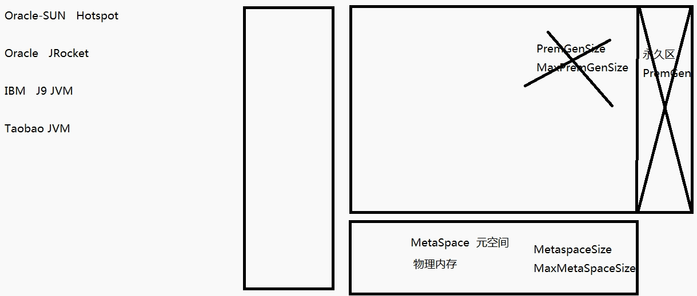

## Lambda表达式

### 为什么使用Lambda表达式

> Lambda 是一个匿名函数，我们可以把 Lambda表达式理解为是一段可以传递的代码（将代码像数据一样进行传递）。可以写出更简洁、更灵活的代码。作为一种更紧凑的代码风格，使Java的语言表达能力得到了提升。

### Lambda表达式

有一个实现要求:

SAM（Single AbstractMethod）只有一个抽象方法，除此之外没有其他方法

@FunctionalInterface 函数式接口

方法没有参数：（）->{};

方法有参数：（参数，参数）->{};

如果现在只有一行语句返回:(参数，参数)->语句

#### 从匿名类到 Lambda 的转换

```java
//匿名内部类
Runnable r1= new Runnable(){
  @Override
  public void run(){
    System.out.println("HelloWorld!");
  }
}

//Lambda表达式
Runnable r1 = () -> System.out.println("HelloWorld!");
```

```java
//原来使用匿名内部类作为参数传递
TreeSet<String> ts = new TreeSet<>(new Comparator<String>(){
  @Override
  public int compare(String o1,String o2){
    return Integer.compare(o1.length().o2.length());
  }
});

//Lambda表达式作为参数传递
TreeSet<String> ts2 = new TreeSet<>(
	(o1,o2) -> Integer.compare(o1.length(),o2.length())
);
```

### Lambda表达式语法

Lambda 表达式在Java 语言中引入了一个新的语法元素和操作符。这个操作符为 “->” ， 该操作符被称
为 Lambda 操作符或剪头操作符。

它将 Lambda 分为两个部分：

左侧：指定了 Lambda 表达式需要的所有参数

右侧：指定了 Lambda 体，即 Lambda 表达式要执行的功能。

**语法格式1：**

无参，无返回值，Lambda体只需要一条语句

```java
Runnabe r1 = () -> System.out.println("HelloWorld!");
```

**语法格式2：**

Lambda需要一个参数

```java
Consumer<String> fun = (args) -> System.out.println(args);
```

**语法格式3：**

Lambda只需要一个参数时，参数的小括号可以省略

```java
Consumer<String> fun = args -> System.out.println(args);
```

**语法格式4：**

Lambda需要两个参数，并且有返回值

```java
BinaryOperator<Long> bo = (x,y) ->{
  System.out.println("实现函数接口方法");
  return x + y;
}
```

**语法格式5：**

当Lambda体只有一条语句时，return与大括号可以省略

```java
BinaryOperator<Long> bo = (x,y) -> x + y;
```

**语法格式6：**

```java
BinaryOperator<Long> bo = (Long x, Long y) ->{//数据类型可以省略，因为可由编译器推断得出，称为"类型推断"
  System.out.println("实现函数接口方法");
  return x + y;
}
```

#### 类型推断

上述 Lambda 表达式中的参数类型都是由编译器推断得出的。Lambda 表达式中无需指定类型，程序依然可以编译，这是因为 javac 根据程序的上下文，在后台推断出了参数的类型。Lambda 表达式的类型依赖于上下文环境，是由编译器推断出来的。这就是所谓的“类型推断”

## 函数式接口

* 只包含一个抽象方法的接口，称为函数式接口。
* 你可以通过 Lambda 表达式来创建该接口的对象。（若 Lambda表达式抛出一个受检异常，那么该异常需要在目标接口的抽象方法上进行声明）。


* 我们可以在任意函数式接口上使用 @FunctionalInterface 注解，这样做可以检查它是否是一个函数式接口，同时 javadoc 也会包含一条声明，说明这个接口是一个函数式接口。

### 自定义函数式接口

```java
@FunctionInterface
public interface MyNumber{
  public double getValue();
}

//函数式接口中使用泛型:
@FunctionalInterface
public interface MyFunc<T>{
  public T getValue(T t);
}
```

### 作为参数传递Lambda表达式

```java
public String toUpperString(MyFunc<String> mf,String str){
  return mf.getValue(str);
}

//作为参数传递Lambda表达式:

String newStr = toUpperString(
	(str) -> str.toUpperCase(),"abcdef");
System.out.println(newStr);
```

作为参数传递 Lambda 表达式：为了将 Lambda 表达式作为参数传递，接收Lambda 表达式的参数类型必须是与该 Lambda 表达式兼容的函数式接口的类型。

### Java内置四大核心函数式接口

|          函数式接口           | 参数类型 |  返回类型   |                    用途                    |
| :----------------------: | :--: | :-----: | :--------------------------------------: |
| `Consumer<T>`<br />消费型接口 |  T   |  void   | 对类型为T的对象应用操作，<br />包含方法：`void accept(T t);` |
| `Supplier<T>`<br />供给型接口 |  无   |    T    |     返回类型为T的对象，<br />包含方法：`T get();`      |
|     `Function<T,R>`      |  T   |    R    | 对类型为T的对象应用操作，并返回结果，结果是R类型的对象，包含方法：`R apply(T t);` |
|      `Predicate<T>`      |  T   | boolean | 确定类型为T的对象是否满足某约束，并返回boolean值。包含方法：`boolean test(T t);` |

| 函数式接口                                    | 参数类型            | 返回类型            | 用途                                       |
| ---------------------------------------- | --------------- | --------------- | ---------------------------------------- |
| `BiFunction<T,U,R>`                      | T,U             | R               | 对类型为T,U参数应用操作，返回R类型的结果，<br />包含方法为`R apply(T t,U u);` |
| `UnaryOperator<T>`<br />（Function子接口）    | T               | T               | 对类型为T的对象进行一元运算，并返回T类型的结果。包含方法为`T apply(T t);` |
| `BinaryOperator<T>`<br />(BigFunction子接口) | T，T             | T               | 对类型为T的对象进行二元运算，并返回T类型的结果，包含方法为`T apply(T t1,T t2);` |
| `BigConsumer<T,U>`                       | T,U             | void            | 对类型为T,U参数应用操作，包含方法为`void accept(T t,U u)` |
| `ToIntFunction<T>`<br />`ToLongFunction<T>`<br />`ToDoubleFunction` | T               | int,long,double | 分别计算int,long,double值的函数                  |
| `IntFunction<R>`<br />`LongFunction<R>`<br />DoubleFunction<R> | int,long,double | R               | 参数分别为int，long，double类型的参数                |

## 方法引用与构造器引用

### 方法引用

当要传递给Lambda体的操作，已经有实现的方法了，可以使用方法引用！
（实现抽象方法的参数列表，必须与方法引用方法的参数列表保持一致！）
方法引用：使用操作符 “::” 将方法名和对象或类的名字分隔开来。
如下三种主要使用情况：

* 对象::实例方法
* 类::静态方法
* 类::实例方法

**例如：**

```java
(x) -> System.out.println(x);
//等同于：
System.out::println;
```

```java
BinaryOperator<Double> bo = (x,y) -> Math.pow(x,y);
//等同于：
BinaryOperator<Double> bo = Math::pow;
```

```java
compare((x,y) -> x.equals(y),"abcdef","abcdef");
//等同于：
comare(String::equals,"abc","abc");
```

注意：当需要引用方法的第一个参数是调用对象，并且第二个参数是需要引
用方法的第二个参数(或无参数)时：ClassName::methodName

### 构造器引用

格式： `ClassName::new`
与函数式接口相结合，自动与函数式接口中方法兼容。可以把构造器引用赋值给定义的方法，与构造器参数列表要与接口中抽象方法的参数列表一致！

**例如：**

```java
Function<Integer,MyClass> fun = (n) -> new MyClass(n);
//等同于
Function<Integer,MyClass> fun = MyClass::new;
```

### 数组引用

格式： `type[] :: new`

例如：

```java
Function<Integer,Integer[]> fun = (n) -> new Integer[n];
//等同于
Function<Integer,Integer[]> fun = Integer[]::new;
```

## StreamAPI

> Java8中有两大最为重要的改变。第一个是 Lambda 表达式；另外一个则是 Stream API(java.util.stream.*)。
>
> Stream 是 Java8 中处理集合的关键抽象概念，它可以指定你希望对集合进行的操作，可以执行非常复杂的查找、过滤和映射数据等操作。使用Stream API 对集合数据进行操作，就类似于使用 SQL 执行的数据库查询。也可以使用 Stream API 来并行执行操作。简而言之，
>
> Stream API 提供了一种高效且易于使用的处理数据的方式。

**流(Stream) 到底是什么呢？**
是数据渠道，用于操作数据源（集合、数组等）所生成的元素序列。
“集合讲的是数据，流讲的是计算！”

**注意：**

1. Stream 自己不会存储元素。
2. Stream 不会改变源对象。相反，他们会返回一个持有结果的新Stream。
3. Stream 操作是延迟执行的。这意味着他们会等到需要结果的时候才执行。

### Strean的操作三个步骤

* **创建Stream**

  一个数据源(如：集合、数组),获取一个流

* **中间操作**

  一个中间操作链，对数据源的数据进行处理

* **终止操作(终端操作)**

  一个终止操作，执行中间操作链，并产生结果

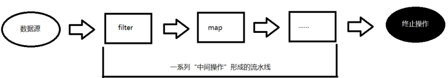

#### 创建Stream

Java8 中的 Collection 接口被扩展，提供了两个获取流的方法：

```java
default Stream stream(); //返回一个顺序流
default Stream parallelStream(); //返回一个并行流

```

##### 由数组创建流

Java8 中的 Arrays 的静态方法 stream() 可以获取数组流：

```java
static  Stream stream(T[] array);//返回一个流
```

重载形式，能够处理对应基本类型的数组：

```java
public static IntStream stream(int[] array)
public static LongStream stream(long[] array)
public static DoubleStream stream(double[] array)
```

##### 由值创建流

可以使用静态方法 Stream.of(), 通过显示值创建一个流。它可以接收任意数量的参数。

```java
public static<T> Stream<T> of(T... values); //返回一个流
```

##### 由函数创建流：创建无限流

可以使用静态方法 Stream.iterate() 和Stream.generate(), 创建无限流。

迭代
`public static Stream iterate(final T seed, finalUnaryOperator f)`
生成
`public static Stream generate(Supplier s）` 

#### Stream的中间操作

多个中间操作可以连接起来形成一个流水线，除非流水线上触发终止操作，否则中间操作不会执行任何的处理！而在终止操作时一次性全部处理，称为“惰性求值”。

##### 筛选与切片

| 方法                    | 描述                                       |
| --------------------- | ---------------------------------------- |
| `filter(Predicate p)` | 接收Lembda，从流中排除某些元素                       |
| `distinct()`          | 筛选，通过流所生成元素的hashCode()和equals()去除重复元素    |
| `limit(long maxSize)` | 截断流，使其元素不超过给定数量                          |
| `skip(long n)`        | 跳过元素，返回一个扔掉了前n个元素的流，若流中元素不足n个，则返回一个空流，与limit(n)互补 |

##### 映射

| 方法                                | 描述                                       |
| --------------------------------- | ---------------------------------------- |
| `map(Function f)`                 | 接收一函数作为参数，该函数会被应用到每个元素上，并将其映射成一个新的元素     |
| `mapToDouble(ToDoubleFunction f)` | 接收一个函数作为参数，该函数会被应用到每个元素上，产生一个新的DoubleStream |
| `mapToInt(ToIntFunction f)`       | 接收一个函数作为参数，该函数会被应用到每个元素上，产生一个新的IntStream |
| `mapToLong(ToLongFunction f)`     | 接收一个函数作为参数，该函数会被应用到每个元素上，产生一个新的LongStream |
| `flatMap(Function f)`             | 接收一个函数作为参数，将流中的每个值都换成另一个流，然后把所有流连接成一个流   |

##### 排序

| 方法                      | 描述                |
| ----------------------- | ----------------- |
| sorted()                | 产生一个新流，其中按自然顺序排序  |
| sorted(Comparator comp) | 产生一个新流，其中按比较器顺序排序 |

#### Sream的终止操作

终端操作会从流的流水线生成结果。其结果可以是任何不是流的值，例如：List、Integer，甚至是 void 。

##### 查找与匹配

| 方法                    | 描述                                       |
| --------------------- | ---------------------------------------- |
| allMath(Predicate p)  | 检查是否匹配所有元素                               |
| antMath(Predicate p)  | 检查是否至少匹配一个元素                             |
| noneMath(Predicate p) | 检查是否没有匹配所有元素                             |
| findFirst()           | 返回第一个元素                                  |
| findAny()             | 返回当前流中的任意元素                              |
| count()               | 返回流中元素总数                                 |
| max(Comparator c)     | 返回流中最大值                                  |
| min(Coparator c)      | 返回流中最小值                                  |
| forEach(Consumer c)   | 内部迭代(使用Collection接口需要用户去做迭代，称为外部迭代，相反，StreamAPI使用内部迭代---它帮你把迭代做了) |

##### 归约

| 方法                              | 描述                                  |
| ------------------------------- | ----------------------------------- |
| reduce(T iden,BinaryOperator b) | 可以将流中元素反复结合起来，得到一个值。返回T             |
| reduce(BinaryOperator b)        | 可以将流中元素反复结合起来，得到一个值，返回`Optional<T>` |

##### 收集

| 方法                   | 描述                                       |
| -------------------- | ---------------------------------------- |
| collect(Collector c) | 将流转换为其他形式，接收一个Collector接口的实现，用于给Steam中元素做汇总工作 |

Collector 接口中方法的实现决定了如何对流执行收集操作(如收集到 List、Set、Map)。但是 Collectors 实用类提供了很多静态方法，可以方便地创建常见收集器实例，具体方法与实例如下：

```java
toList  List<T>  //把流中元素收集到List  
List<Employee> emps = list.stream().collect(Collectors.tolist());  

toSet Set<T> //把流中元素收集到Set
Set<Employee emps = list.stream().collect(Collectors.toSet());  

toCollection Collection<T> //把流中元素收集到创建的集合
Collection<Employee> empls = list.stream().collect(Collectors.toCollection(ArrayList::new));

counting Long //计算流中元素的个数
long count = list.stream().collect(Collectors.counting());

summingInt Integer //对流中元素的整数属性求和
inttotal = list.stream().collect(Collectors.summingInt(Employee::getSalary));

averaginInt Double // 计算流中元素Integer属性的平均值
doubleavg = list.stream().collect(Collectors.averagingInt(Employee::getSalary));

summarrizingInt IntSummartStatistics //收集流中Integer属性的统计值，如平均值
IntSummaryStatisticsiss = list.stream().collect(Collectors.summarizingInt(Employee::getSalary));

joining String //连接流中每个字符串
String str = list.stream().map(Employee::getName).collect(Collectors.joining());

maxBy Optional<T> //根据比较器选择最大值
Optional<Emp> max = list.stream().collect(Collectors.maxBy(comparingInt(Employee::getSalary)));
minBy Optional<T> //根据比较器选择最小值
Optional<Emp> min = list.stream().collect(Collectors.minBy(comparingInt(Employee::getSalary)));

reducing 归约产生的类型 //从一个作为累加器的初始值开始，利用BinaryOperator流中元素逐个结合，从而归约成单个值
inttotal=list.stream().collect(Collectors.reducing(0, Employee::getSalar, Integer::sum));

collectingAndThen 转换函数返回的类型 //包裹另一个收集器，对其结果转换函数
inthow= list.stream().collect(Collectors.collectingAndThen(Collectors.toList(), List::size));

groupingBy Map<K, List<T>> //根据某属性值对流分组，属性为K，结果为V
Map<Emp.Status, List<Emp>> map= list.stream().collect(Collectors.groupingBy(Employee::getStatus));

partitioningBy Map<Boolean, List<T>> //根据true或false进行分区
Map<Boolean,List<Emp>>vd=
list.stream().collect(Collectors.partitioningBy(Employee::getManage));
```

### 并行流与串行流

并行流就是把一个内容分成多个数据块，并用不同的线程分别处理每个数据块的流。

Java 8 中将并行进行了优化，我们可以很容易的对数据进行并行操作。Stream API 可以声明性地通过 parallel() 与sequential() 在并行流与顺序流之间进行切换。

### Fork/Join 框架

Fork/Join 框架：就是在必要的情况下，将一个大任务，进行拆分(fork)成若干个小任务（拆到不可再拆时），再将一个个的小任务运算的结果进行 join 汇总.

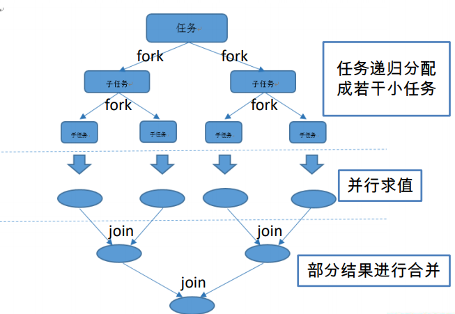

#### Fork/Join 框架与传统线程池的区别

> 采用 “工作窃取”模式（work-stealing）：
>
> 当执行新的任务时它可以将其拆分分成更小的任务执行，并将小任务加到线程队列中，然后再从一个随机线程的队列中偷一个并把它放在自己的队列中。
>
> 相对于一般的线程池实现,fork/join框架的优势体现在对其中包含的任务的处理方式上.在一般的线程池中,如果一个线程正在执行的任务由于某些原因无法继续运行,那么该线程会处于等待状态.而在fork/join框架实现中,如果某个子问题由于等待另外一个子问题的完成而无法继续运行.那么处理该子问题的线程会主动寻找其他尚未运行的子问题来执行.这种方式减少了线程的等待时间,提高了性能.

## 新时间日期API

### 使用 LocalDate、LocalTime、LocalDateTime

 LocalDate、LocalTime、LocalDateTime 类的实例是不可变的对象，分别表示使用 ISO-8601日历系统的日期、时间、日期和时间。它们提供了简单的日期或时间，并不包含当前的时间信息。也不包含与时区相关的信息。

注：ISO-8601日历系统是国际标准化组织制定的现代公民的日期和时间的表示法

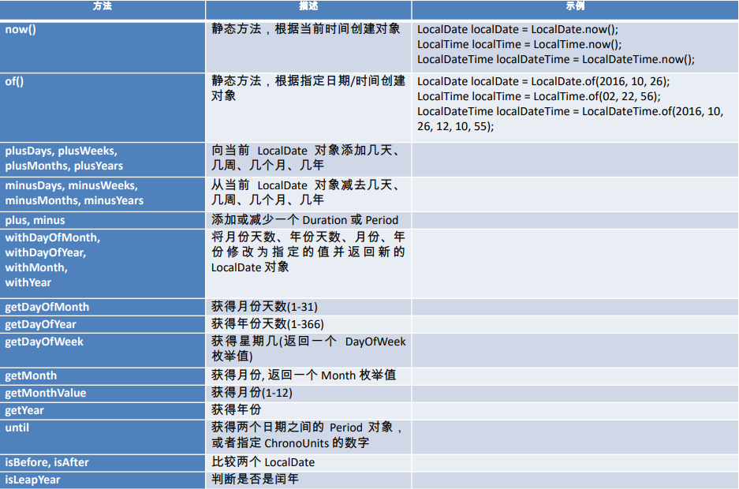

### Instant 时间戳

用于“时间戳”的运算。它是以Unix元年(传统的设定为UTC时区1970年1月1日午夜时分)开始所经历的描述进行运算

### Duration 和 Period

* Duration:用于计算两个“时间”间隔
* Period:用于计算两个“日期”间隔

### 日期的操纵

TemporalAdjuster : 时间校正器。有时我们可能需要获取例如：将日期调整到“下个周日”等操作。

* TemporalAdjusters : 该类通过静态方法提供了大量的常用 TemporalAdjuster 的实现。

例如获取下个周日：

```java
LocalDate nextSunday = LocalDate.now().with(
	TemporalAdjusters.next(DayOfWeek.SUNDAY)
);
```

### 解析与格式化

java.time.format.DateTimeFormatter 类：该类提供了三种格式化方法：

* 预定义的标准格式
* 语言环境相关的格式
* 自定义的格式

### 时区的处理

Java8 中加入了对时区的支持，带时区的时间为分别为：
ZonedDate、ZonedTime、ZonedDateTime
其中每个时区都对应着 ID，地区ID都为 “{区域}/{城市}”的格式
例如 ：Asia/Shanghai 等
ZoneId：该类中包含了所有的时区信息
getAvailableZoneIds() : 可以获取所有时区时区信息
of(id) : 用指定的时区信息获取 ZoneId 对象

### 与传统日期处理的转换

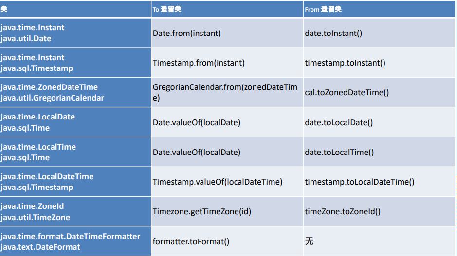

## 接口中的默认方法与静态方法

Java 8中允许接口中包含具有具体实现的方法，该方法称为“默认方法”，默认方法使用 default 关键字修饰。

**例如：**

```java
interface MyFunc<T>{
  T func(int a);
  
  defalut String getName(){
    return "Hello Java8";
  }
}
```

**接口默认方法的”类优先”原则**

若一个接口中定义了一个默认方法，而另外一个父类或接口中又定义了一个同名的方法时

* 选择父类中的方法。如果一个父类提供了具体的实现，那么接口中具有相同名称和参数的默认方法会被忽略。


* 接口冲突。如果一个父接口提供一个默认方法，而另一个接口也提供了一个具有相同名称和参数列表的方法（不管方法是否是默认方法），那么必须覆盖该方法来解决冲突

```java
interface MyFunc{
  defalut String getName(){
    return "Hello Java8";
  }
}

interface Named{
  defalut String getName(){
    return "Hello Java";
  }
}

class MyClass implements MyFunc,Named{
  public String getName(){
    return Named.super,getName();
  }
}
```

#### 接口中的静态方法

Java8 中，接口中允许添加静态方法。

```java
interface Named{
  public Integer myFun();
  default String getName(){
    return "Hello java";
  }
  
  static void show(){
    System.out.println("Hello World");
  }
}
```

## 其他特性

### Optional类

Optional 类(java.util.Optional) 是一个容器类，代表一个值存在或不存在，原来用 null 表示一个值不存在，现在 Optional 可以更好的表达这个概念。并且可以避免空指针异常。

**常用方法：**
`Optional.of(T t)` : 创建一个 Optional 实例
`Optional.empty()` : 创建一个空的 Optional 实例
`Optional.ofNullable(T t)`:若 t 不为 null,创建 Optional 实例,否则创建空实例
`isPresent()` : 判断是否包含值
`orElse(T t)` : 如果调用对象包含值，返回该值，否则返回t
`orElseGet(Supplier s)` :如果调用对象包含值，返回该值，否则返回 s 获取的值
`map(Function f)`: 如果有值对其处理，并返回处理后的Optional，否则返回 Optional.empty()
`flatMap(Function mapper)`:与 map 类似，要求返回值必须是Optional

### 重复注解与类型注解

Java 8对注解处理提供了两点改进：可重复的注解及可用于类型的注解。

```java
@Target({TYPE,FIELD,METHOD,PARAMETER,CONSTRUCTOR,LOCAL_VARIABLE})
@Retention(RetentionPolicy.RUNTIME)
public @interface MyAnnotations{
  MyAnnotation[] value();
}

@Repetable(MyAnnotations.class)
@Target({TYPE,FIELD,METHOD,PARAMETER,CONSTRUCTOR,LOCAL_VARIABLE,ElementType.TYPE_PARAMETER})
@Retention(RetemtionPolicy.RUNTIME)
public @interface MyAnnotation{
  String value();
}

@MyAnnotation("Hello")
@MyANnotation("World")
public void show(@MyAnnotation("abc")String str){
  
}
```

## JUC

在 Java 5.0 提供了 java.util.concurrent （简称JUC ）包，在此包中增加了在并发编程中很常用的实用工具类，用于定义类似于线程的自定义子系统，包括线程池、异步 IO 和轻量级任务框架。提供可调的、灵活的线程池。还提供了设计用于多线程上下文中的 Collection 实现等。

### volatile关键字 内存可见性

**内存可见性**

内存可见性（Memory Visibility）是指当某个线程正在使用对象状态而另一个线程在同时修改该状态，需要确保当一个线程修改了对象状态后，其他线程能够看到发生的状态变化。

* 可见性错误是指当读操作与写操作在不同的线程中执行时，我们无法确保执行读操作的线程能适时地看到其他线程写入的值，有时甚至是根本不可能的事情。


* 我们可以通过同步来保证对象被安全地发布。除此之外我们也可以使用一种更加轻量级的 volatile 变量。

**volatile 关键字**

Java 提供了一种稍弱的同步机制，即 volatile 变量，用来确保将变量的更新操作通知到其他线程。可以将 volatile 看做一个轻量级的锁，但是又与锁有些不同：

* 对于多线程，不是一种互斥关系
* 不能保证变量状态的“原子性操作”

### 原子变量 CAS算法

**CAS算法**

* CAS (Compare-And-Swap) 是一种硬件对并发的支持，针对多处理器操作而设计的处理器中的一种特殊指令，用于管理对共享数据的并发访问。
* CAS 是一种无锁的非阻塞算法的实现。
* CAS 包含了 3 个操作数：
  *  需要读写的内存值 V
  *  进行比较的值 A
  *  拟写入的新值 B
* 当且仅当 V 的值等于 A 时，CAS 通过原子方式用新值 B 来更新 V 的值，否则不会执行任何操作。

**原子变量**

* 类的小工具包，支持在单个变量上解除锁的线程安全编程。事实上，此包中的类可将 volatile 值、字段和数组元素的概念扩展到那些也提供原子条件更新操作的类。
* 类 AtomicBoolean、AtomicInteger、AtomicLong 和 AtomicReference 的实例各自提供对相应类型单个变量的访问和更新。每个类也为该类型提供适当的实用工具方法。
* AtomicIntegerArray、AtomicLongArray 和 AtomicReferenceArray 类进一步扩展了原子操作，对这些类型的数组提供了支持。这些类在为其数组元素提供 volatile 访问语义方面也引人注目，这对于普通数组来说是不受支持的。
* **核心方法：boolean compareAndSet(expectedValue, updateValue)**
* java.util.concurrent.atomic 包下提供了一些原子操作的常用类:
  * AtomicBoolean 、AtomicInteger 、AtomicLong 、 AtomicReference
  * AtomicIntegerArray 、AtomicLongArray
  * AtomicMarkableReference
  * AtomicReferenceArray
  * AtomicStampedReference

### ConcurrentHashMap 锁分段机制

**ConcurrentHashMap**

Java 5.0 在 java.util.concurrent 包中提供了多种并发容器类来改进同步容器的性能。

* ConcurrentHashMap 同步容器类是Java 5 增加的一个线程安全的哈希表。对与多线程的操作，介于 HashMap 与 Hashtable 之间。内部采用“锁分段”机制替代 Hashtable 的独占锁。进而提高性能。
* 此包还提供了设计用于多线程上下文中的 Collection 实现：ConcurrentHashMap、ConcurrentSkipListMap、ConcurrentSkipListSet、CopyOnWriteArrayList 和 CopyOnWriteArraySet。当期望许多线程访问一个给定 collection 时，ConcurrentHashMap 通常优于同步的 HashMap，ConcurrentSkipListMap 通常优于同步的 TreeMap。当期望的读数和遍历远远大于列表的更新数时，CopyOnWriteArrayList 优于同步的 ArrayList。

### CountDownLatch 闭锁

* Java 5.0 在 java.util.concurrent 包中提供了多种并发容器类来改进同步容器的性能。


* CountDownLatch 一个同步辅助类，在完成一组正在其他线程中执行的操作之前，它允许一个或多个线程一直等待。


* 闭锁可以延迟线程的进度直到其到达终止状态，闭锁可以用来确保某些活动直到其他活动都完成才继续执行：
  * 确保某个计算在其需要的所有资源都被初始化之后才继续执行;
  * 确保某个服务在其依赖的所有其他服务都已经启动之后才启动;
  * 等待直到某个操作所有参与者都准备就绪再继续执行。

### 实现 Callable 接口

* Java 5.0 在 java.util.concurrent 提供了一个新的创建执行线程的方式：Callable 接口


* Callable 接口类似于 Runnable，两者都是为那些其实例可能被另一个线程执行的类设计的。但是 Runnable 不会返回结果，并且无法抛出经过检查的异常。


* Callable 需要依赖FutureTask ，FutureTask 也可以用作闭锁。

### Lock 同步锁

**显示锁 Lock**

* 在 Java 5.0 之前，协调共享对象的访问时可以使用的机制只有 synchronized 和 volatile 。Java 5.0 后增加了一些新的机制，但并不是一种替代内置锁的方法，而是当内置锁不适用时，作为一种可选择的高级功能。


* ReentrantLock 实现了 Lock 接口，并提供了与synchronized 相同的互斥性和内存可见性。但相较于synchronized 提供了更高的处理锁的灵活性。

### Condition 控制线程通信

**Condition**

* Condition 接口描述了可能会与锁有关联的条件变量。这些变量在用法上与使用 Object.wait 访问的隐式监视器类似，但提供了更强大的功能。需要特别指出的是，单个 Lock 可能与多个 Condition 对象关联。为了避免兼容性问题，Condition 方法的名称与对应的 Object 版本中的不同。


* 在 Condition 对象中，与 wait、notify 和 notifyAll 方法对应的分别是await、signal 和 signalAll。


* Condition 实例实质上被绑定到一个锁上。要为特定 Lock 实例获得Condition 实例，请使用其 newCondition() 方法。

### 线程按序交替

编写一个程序，开启 3 个线程，这三个线程的 ID 分别为A、B、C，每个线程将自己的 ID 在屏幕上打印 10 遍，要求输出的结果必须按顺序显示。
如：ABCABCABC…… 依次递归

### ReadWriteLock 读写锁

* ReadWriteLock 维护了一对相关的锁，一个用于只读操作，另一个用于写入操作。只要没有 writer，读取锁可以由多个 reader 线程同时保持。写入锁是独占的。。


* ReadWriteLock 读取操作通常不会改变共享资源，但执行写入操作时，必须独占方式来获取锁。对于读取操作占多数的数据结构。 ReadWriteLock 能提供比独占锁更高的并发性。而对于只读的数据结构，其中包含的不变性可以完全不需要考虑加锁操作。

### 线程八锁

* 一个对象里面如果有多个synchronized方法，某一个时刻内，只要一个线程去调用其中的一个synchronized方法了，其它的线程都只能等待，换句话说，某一个时刻内，只能有唯一一个线程去访问这些synchronized方法


* 锁的是当前对象this，被锁定后，其它的线程都不能进入到当前对象的其它的synchronized方法


* 加个普通方法后发现和同步锁无关
* 换成两个对象后，不是同一把锁了，情况立刻变化。
* 都换成静态同步方法后，情况又变化
* 所有的非静态同步方法用的都是同一把锁——实例对象本身，也就是说如果一个实例对象的非静态同步方法获取锁后，该实例对象的其他非静态同步方法必须等待获取锁的方法释放锁后才能获取锁，可是别的实例对象的非静态同步方法因为跟该实例对象的非静态同步方法用的是不同的锁，所以毋须等待该实例对象已获取锁的非静态同步方法释放锁就可以获取他们自己的锁。


* 所有的静态同步方法用的也是同一把锁——类对象本身，这两把锁是两个不同的对象，所以静态同步方法与非静态同步方法之间是不会有竞态条件的。但是一旦一个静态同步方法获取锁后，其他的静态同步方法都必须等待该方法释放锁后才能获取锁，而不管是同一个实例对象的静态同步方法之间，还是不同的实例对象的静态同步方法之间，只要它们同一个类的实例对象！

### 线程池

* 第四种获取线程的方法：线程池，一个 ExecutorService，它使用可能的几个池线程之一执行每个提交的任务，通常使用 Executors 工厂方法配置。


* 线程池可以解决两个不同问题：由于减少了每个任务调用的开销，它们通常可以在执行大量异步任务时提供增强的性能，并且还可以提供绑定和管理资源（包括执行任务集时使用的线程）的方法。每个 ThreadPoolExecutor 还维护着一些基本的统计数据，如完成的任务数。


* 为了便于跨大量上下文使用，此类提供了很多可调整的参数和扩展钩子 (hook)。但是，强烈建议程序员使用较为方便的 Executors 工厂方法 ：


* Executors.newCachedThreadPool()（无界线程池，可以进行自动线程回收）
* Executors.newFixedThreadPool(int)（固定大小线程池）
* Executors.newSingleThreadExecutor()（单个后台线程）它们均为大多数使用场景预定义了设置。

### 线程调度

**ScheduledExecutorService**

一个 ExecutorService，可安排在给定的延迟后运行或定期执行的命令。

### ForkJoinPool 分支/合并框架 工作窃取

**Fork/Join 框架**

Fork/Join 框架：就是在必要的情况下，将一个大任务，进行拆分(fork)成若干个小任务（拆到不可再拆时），再将一个个的小任务运算的结果进行 join 汇总。

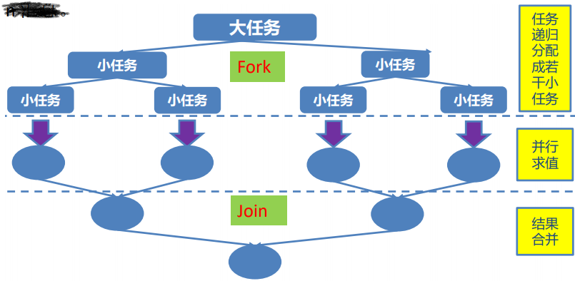

**Fork/Join 框架与线程池的区别**

* 采用 “工作窃取”模式（work-stealing）：当执行新的任务时它可以将其拆分分成更小的任务执行，并将小任务加到线程队列中，然后再从一个随机线程的队列中偷一个并把它放在自己的队列中。


*  相对于一般的线程池实现，fork/join框架的优势体现在对其中包含的任务的处理方式上.在一般的线程池中，如果一个线程正在执行的任务由于某些原因无法继续运行，那么该线程会处于等待状态。而在fork/join框架实现中，如果某个子问题由于等待另外一个子问题的完成而无法继续运行。那么处理该子问题的线程会主动寻找其他尚未运行的子问题来执行.这种方式减少了线程的等待时间，提高了性能。

## NIO

Java NIO（New IO）是从Java 1.4版本开始引入的一个新的IO API，可以替代标准的Java IO API。NIO与原来的IO有同样的作用和目的，但是使用的方式完全不同，NIO支持面向缓冲区的、基于通道的IO操作。NIO将以更加高效的方式进行文件的读写操作。

**Java NIO 与 IO 的主要区别**

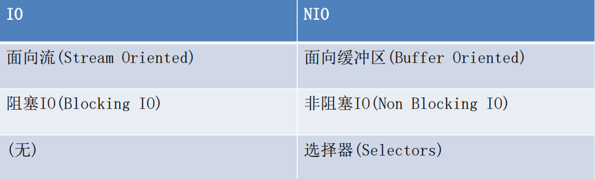

### 通道（Channel）与缓冲区（Buffer）

Java NIO系统的核心在于：通道(Channel)和缓冲区(Buffer)。通道表示打开到 IO 设备(例如：文件、套接字)的连接。若需要使用 NIO 系统，需要获取用于连接 IO 设备的通道以及用于容纳数据的缓冲区。然后操作缓冲区，对数据进行处理。

**简而言之，Channel 负责传输， Buffer 负责存储**

#### 缓冲区（Buffer）

* 缓冲区（Buffer）：一个用于特定基本数据类型的容器。由 java.nio 包定义的，所有缓冲区都是 Buffer 抽象类的子类。


* Java NIO 中的 Buffer 主要用于与 NIO 通道进行交互，数据是从通道读入缓冲区，从缓冲区写入通道中的。

Buffer 就像一个数组，可以保存多个相同类型的数据。根据数据类型不同(boolean 除外) ，有以下 Buffer 常用子类：

* ByteBuffer
* CharBuffer
* ShortBuffer
* IntBuffer
* LongBuffer
* FloatBuffer
* DoubleBuffer

上述 Buffer 类 他们都采用相似的方法进行管理数据，只是各自管理的数据类型不同而已。都是通过如下方法获取一个 Buffer对象：

**static XxxBuffer allocate(int capacity) : 创建一个容量为 capacity 的 XxxBuffer 对象**

##### 缓冲区的基本属性

Buffer 中的重要概念：

* 容量 (capacity) ：表示 Buffer 最大数据容量，缓冲区容量不能为负，并且创建后不能更改。


*  限制 (limit)：第一个不应该读取或写入的数据的索引，即位于 limit 后的数据不可读写。缓冲区的限制不能为负，并且不能大于其容量。


*  位置 (position)：下一个要读取或写入的数据的索引。缓冲区的位置不能为负，并且不能大于其限制


*  标记 (mark)与重置 (reset)：标记是一个索引，通过 Buffer 中的 mark() 方法指定 Buffer 中一个特定的 position，之后可以通过调用 reset() 方法恢复到这个 position.

标记、位置、限制、容量遵守以下不变式： 0 <= mark <= position <= limit <= capacity

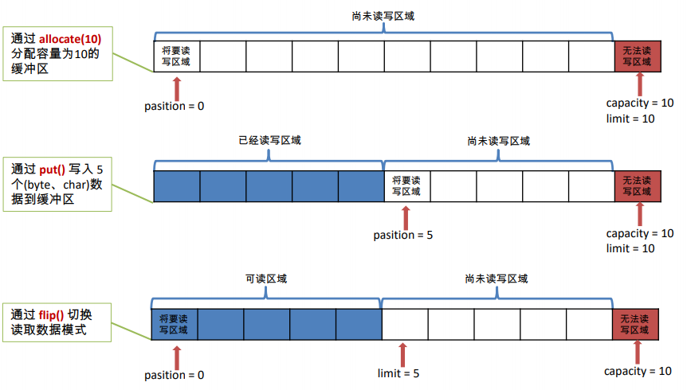

##### Buffer的常用方法

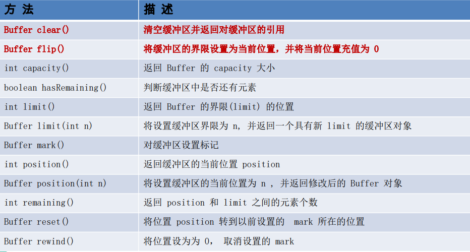

##### 缓冲区的数据操作

* Buffer 所有子类提供了两个用于数据操作的方法：get()与 put() 方法
  * 获取 Buffer 中的数据
    * get() ：读取单个字节
    * get(byte[] dst)：批量读取多个字节到 dst 中
    * get(int index)：读取指定索引位置的字节(不会移动 position)
  * 放入数据到 Buffer 中
    * put(byte b)：将给定单个字节写入缓冲区的当前位置
    * put(byte[] src)：将 src 中的字节写入缓冲区的当前位置
    * put(int index, byte b)：将指定字节写入缓冲区的索引位置(不会移动 position)

##### 直接与非直接缓冲区

* 字节缓冲区要么是直接的，要么是非直接的。如果为直接字节缓冲区，则 Java 虚拟机会尽最大努力直接在此缓冲区上执行本机 I/O 操作。也就是说，在每次调用基础操作系统的一个本机 I/O 操作之前（或之后），虚拟机都会尽量避免将缓冲区的内容复制到中间缓冲区中（或从中间缓冲区中复制内容）。


* 直接字节缓冲区可以通过调用此类的 allocateDirect() 工厂方法来创建。此方法返回的缓冲区进行分配和取消分配所需成本通常高于非直接缓冲区。直接缓冲区的内容可以驻留在常规的垃圾回收堆之外，因此，它们对应用程序的内存需求量造成的影响可能并不明显。所以，建议将直接缓冲区主要分配给那些易受基础系统的本机 I/O 操作影响的大型、持久的缓冲区。一般情况下，最好仅在直接缓冲区能在程序性能方面带来明显好处时分配它们。


* 直接字节缓冲区还可以通过 FileChannel 的 map() 方法 将文件区域直接映射到内存中来创建。该方法返回MappedByteBuffer 。Java 平台的实现有助于通过 JNI 从本机代码创建直接字节缓冲区。如果以上这些缓冲区中的某个缓冲区实例指的是不可访问的内存区域，则试图访问该区域不会更改该缓冲区的内容，并且将会在访问期间或稍后的某个时间导致抛出不确定的异常。


* 字节缓冲区是直接缓冲区还是非直接缓冲区可通过调用其 isDirect() 方法来确定。提供此方法是为了能够在性能关键型代码中执行显式缓冲区管理。

**非直接缓冲区**

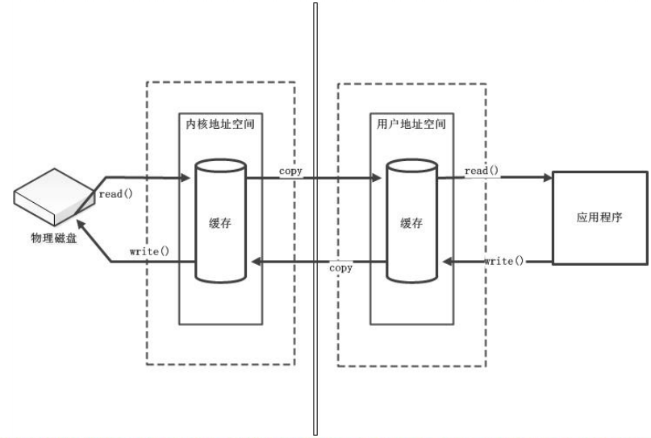

**直接缓冲区**

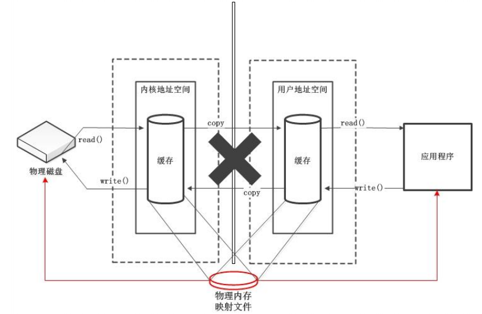

#### 通道（Channel）

通道（Channel）：由 java.nio.channels 包定义的。Channel 表示 IO 源与目标打开的连接。Channel 类似于传统的“流”。只不过 Channel本身不能直接访问数据，Channel 只能与Buffer 进行交互。

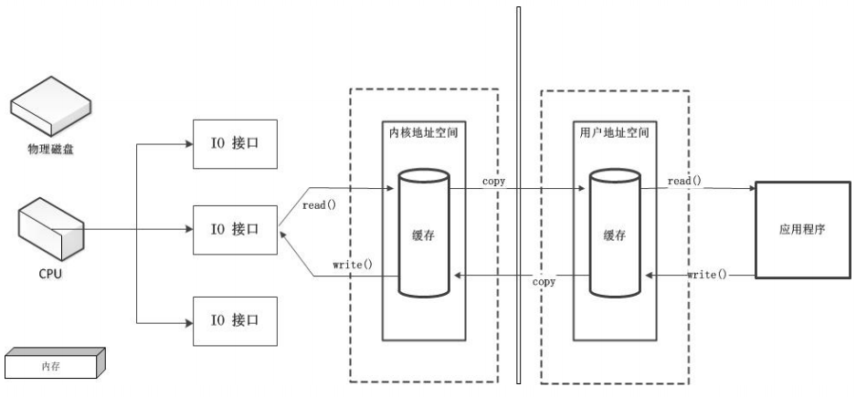

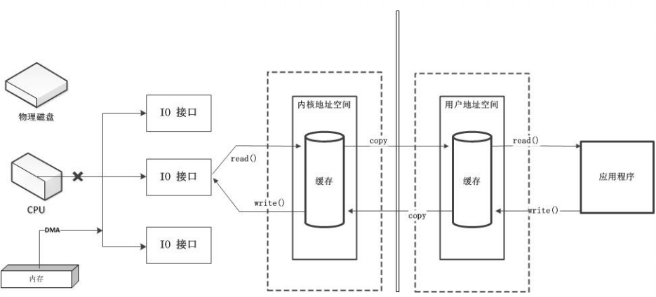

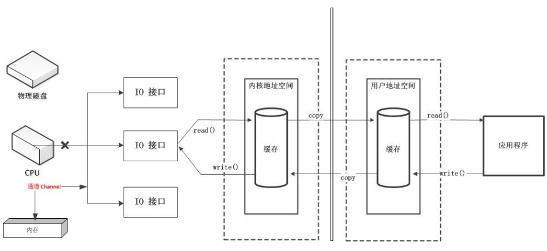

Java 为 Channel 接口提供的最主要实现类如下：

* FileChannel：用于读取、写入、映射和操作文件的通道。
* DatagramChannel：通过 UDP 读写网络中的数据通道。
* SocketChannel：通过 TCP 读写网络中的数据。
* ServerSocketChannel：可以监听新进来的 TCP 连接，对每一个新进来的连接都会创建一个 SocketChannel。

##### 获取通道

获取通道的一种方式是对支持通道的对象调用getChannel() 方法。支持通道的类如下：

* FileInputStream
* FileOutputStream
* RandomAccessFile
* DatagramSocket
* Socket
* ServerSocket

获取通道的其他方式是使用 Files 类的静态方法 newByteChannel() 获取字节通道。或者通过通道的静态方法 open() 打开并返回指定通道。

##### 通道的数据传输

将 Buffer 中数据写入 Channel

```java
//将Buffer中数据写入Channel中
int bytesWritten = inChannel.write(buf);
```

从 Channel 读取数据到 Buffer

```java
//从Channel读取数据到Buffer
int bytesRead = inChannel.read(buf);
```

#### 分散(Scatter)和聚集(Gather)

**分散读取（Scattering Reads）是指从 Channel 中读取的数据“分散”到多个 Buffer 中。**

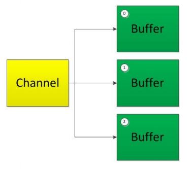

注意：按照缓冲区的顺序，从 Channel 中读取的数据依次将 Buffer 填满。

**聚集写入（Gathering Writes）是指将多个 Buffer 中的数据“聚集”到 Channel。**

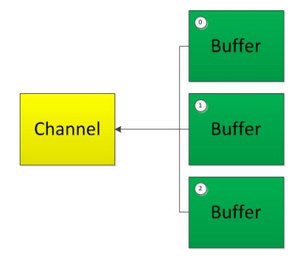

注意：按照缓冲区的顺序，写入 position 和 limit 之间的数据到 Channel 。

#### transferFrom()

将数据从源通道传输到其他 Channel 中：

```java
RandomAccessFile fromFile = new RandomAccessFile("data/fromFile.txt","rw");
//获取FileChannel
FileChannel fromChannel = fromFile.getChannel();

RandomAccessFile toFile = new RandomAccessFile("data/toFile.txt","rw");
FileChannel toChannel = toFile.getChannel();

//定义传输位置
long position = 0L;

//最多传输的字节数
long count = fromChannel.size();

//将数据从源通道传输到另一个通道
toChannel.transferFrom(fromChannel,count,position);
```

#### transferTo()

将数据从源通道传输到其他 Channel 中：

```java
RandomAccessFile fromFile = new RandomAccessFile("data/fromFile.txt","rw");
//获取FileChannel
FileChannel fromChannel = fromFile.getChannel();

RandomAccessFile toFile = new RandomAccessFile("data/toFile.txt","rw");
FileChannel toChannel = toFile.getChannel();

//定义传输位置
long position = 0L;

//最多传输的字节数
long count = fromChannel.size();

//将数据从源通道传输到另一个通道
fromChannel.transferTo(position,count,toChannel);
```

#### FileChannel 的常用方法

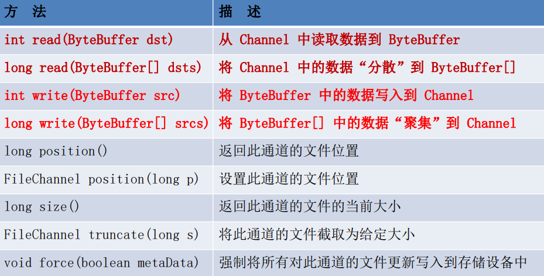

### NIO 的非阻塞式网络通信

#### 阻塞与非阻塞

* 传统的 IO 流都是阻塞式的。也就是说，当一个线程调用 read() 或 write()时，该线程被阻塞，直到有一些数据被读取或写入，该线程在此期间不能执行其他任务。因此，在完成网络通信进行 IO 操作时，由于线程会阻塞，所以服务器端必须为每个客户端都提供一个独立的线程进行处理，当服务器端需要处理大量客户端时，性能急剧下降。


*  Java NIO 是非阻塞模式的。当线程从某通道进行读写数据时，若没有数据可用时，该线程可以进行其他任务。线程通常将非阻塞 IO 的空闲时间用于在其他通道上执行 IO 操作，所以单独的线程可以管理多个输入和输出通道。因此，NIO 可以让服务器端使用一个或有限几个线程来同时处理连接到服务器端的所有客户端。

#### 选择器（Selector）

*  选择器（Selector） 是 SelectableChannle 对象的多路复用器，Selector 可以同时监控多个 SelectableChannel 的 IO 状况，也就是说，利用 Selector可使一个单独的线程管理多个 Channel。Selector 是非阻塞 IO 的核心。


*  SelectableChannle 的结构如下图：

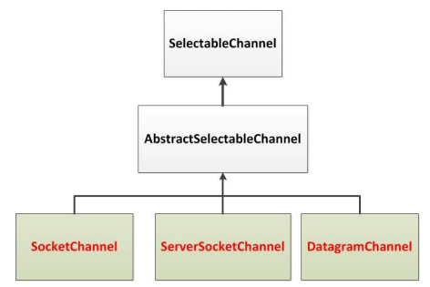

#### 选择器（Selector）的应用

创建 Selector ：通过调用 Selector.open() 方法创建一个 Selector。

```java
//创建选择器
Selector selector = Selector.open();
```

向选择器注册通道：SelectableChannel.register(Selector sel, int ops)

```java
//创建一个Socket套接字
Socket socket = new Sokcet(InetAddress.getByName("127.0.0.1"),9898);

//获取SocketChannel
SocketChannel channel = scoket.getChannel();

//创建选择器
Selector selector = Selector.open();

//将SocketChannel切换到非阻塞模式
channel.configureBlocking(false);

//向Selector注册Channel
SelectionKey key = channel.register(selector,SelectionKey.OP_READ);
```

#### SelectionKey

*  当调用 register(Selector sel, int ops) 将通道注册选择器时，选择器

对通道的监听事件，需要通过第二个参数 ops 指定。

*  可以监听的事件类型（可使用 SelectionKey 的四个常量表示）：
  * 读 : SelectionKey.OP_READ （1）
  * 写 : SelectionKey.OP_WRITE （4）
  * 连接 : SelectionKey.OP_CONNECT （8）
  * 接收 : SelectionKey.OP_ACCEPT （16）


*  若注册时不止监听一个事件，则可以使用“位或”操作符连接。

```java
//注册"监听事件"
int interestSet = SelectionKey.OP_READ|SelectionKey.OP_WRITE;
```

SelectionKey：表示 SelectableChannel 和 Selector 之间的注册关系。每次向选择器注册通道时就会选择一个事件(选择键)。选择键包含两个表示为整数值的操作集。操作集的每一位都表示该键的通道所支持的一类可选择操作。

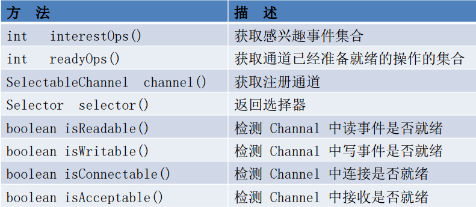

#### Selector 的常用方法

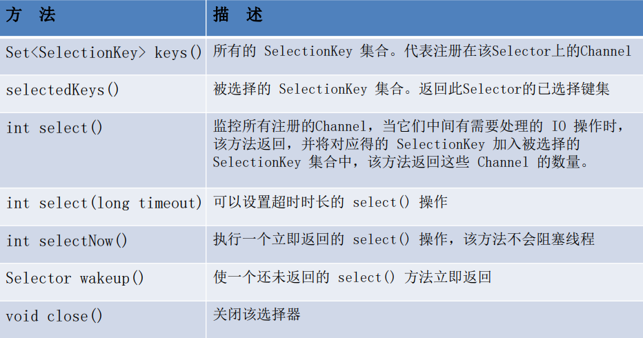

#### SocketChannel

Java NIO中的SocketChannel是一个连接到TCP网络套接字的通道。

操作步骤：

* 打开 SocketChannel
* 读写数据
* 关闭 SocketChannel

Java NIO中的 ServerSocketChannel 是一个可以监听新进来的TCP连接的通道，就像标准IO中的ServerSocket一样。

#### DatagramChannel 

Java NIO中的DatagramChannel是一个能收发UDP包的通道。
操作步骤：

* 打开 DatagramChannel
* 接收/发送数据

#### 管道 (Pipe)

Java NIO 管道是2个线程之间的单向数据连接。Pipe有一个source通道和一个sink通道。数据会被写到sink通道，从source通道读取。

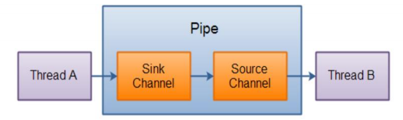

##### 向管道写数据

```java
@Test
public void test1() throws IOException{
  String str = "测试数据";
  
  //创建管道
  Pipe pipe = Pipe.open();
  
  //向管道写输入
  Pipe.SinkChannel sinkChannel = pipe.sink();
  
  //通过SinkChannel的write()方法写数据
  ByteBuffer buf = ByteBuffer.allocate(1024);
  buf.clear();
  buf.put(str.getBytes());
  buf.flip();
  
  while(buf.hasRemaining()){
    sinkChannel.write(buf);
  }
}
```

##### 从管道读取数据

从读取管道的数据，需要访问source通道。

```java
//从管道读取数据
Pipe.SourceChannel sourceChannel = pipe.source();
```

调用source通道的read()方法来读取数据

```java
//调用SourceChannel的read()方法读取数据
ByteBuffer buf = ByteBuffer.allocate(1024);
sourceChannel.read(buf);
```

### NIO.2 – Path、Paths、Files

#### NIO.2

随着 JDK 7 的发布，Java对NIO进行了极大的扩展，增强了对文件处理和文件系统特性的支持，以至于我们称他们为 NIO.2。因为 NIO 提供的一些功能，NIO已经成为文件处理中越来越重要的部分。

#### Path 与 Paths

* java.nio.file.Path 接口代表一个平台无关的平台路径，描述了目录结构中文件的位置。
* Paths 提供的 get() 方法用来获取 Path 对象：
  *  Path get(String first, String … more) : 用于将多个字符串串连成路径。


*  Path 常用方法：
  *  boolean endsWith(String path) : 判断是否以 path 路径结束
  *  boolean startsWith(String path) : 判断是否以 path 路径开始
  *  boolean isAbsolute() : 判断是否是绝对路径
  *  Path getFileName() : 返回与调用 Path 对象关联的文件名
  *  Path getName(int idx) : 返回的指定索引位置 idx 的路径名称
  *  int getNameCount() : 返回Path 根目录后面元素的数量
  *  Path getParent() ：返回Path对象包含整个路径，不包含 Path 对象指定的文件路径
  *  Path getRoot() ：返回调用 Path 对象的根路径
  *  Path resolve(Path p) :将相对路径解析为绝对路径
  *  Path toAbsolutePath() : 作为绝对路径返回调用 Path 对象
  *  String toString() ： 返回调用 Path 对象的字符串表示形式

#### Files 类

* java.nio.file.Files 用于操作文件或目录的工具类。
* Files常用方法：
  *  Path copy(Path src, Path dest, CopyOption … how) : 文件的复制
  *  Path createDirectory(Path path, FileAttribute … attr) : 创建一个目录
  *  Path createFile(Path path, FileAttribute … arr) : 创建一个文件
  *  void delete(Path path) : 删除一个文件
  *  Path move(Path src, Path dest, CopyOption…how) : 将 src 移动到 dest 位置
  *  long size(Path path) : 返回 path 指定文件的大小
* Files常用方法：用于判断
  *  boolean exists(Path path, LinkOption … opts) : 判断文件是否存在
  *  boolean isDirectory(Path path, LinkOption … opts) : 判断是否是目录
  *  boolean isExecutable(Path path) : 判断是否是可执行文件
  *  boolean isHidden(Path path) : 判断是否是隐藏文件
  *  boolean isReadable(Path path) : 判断文件是否可读
  *  boolean isWritable(Path path) : 判断文件是否可写
  *  boolean notExists(Path path, LinkOption … opts) : 判断文件是否不存在
  *  `public static <A extends BasicFileAttributes> A readAttributes(Path path,Class<A> type,LinkOption...options)` : 获取与 path 指定的文件相关联的属性。


* Files常用方法：用于操作内容
  * SeekableByteChannel newByteChannel(Path path, OpenOption…how) : 获取与指定文件的连接，how 指定打开方式
  * DirectoryStream newDirectoryStream(Path path) : 打开 path 指定的目录
  * InputStream newInputStream(Path path, OpenOption…how):获取 InputStream 对象
  * OutputStream newOutputStream(Path path, OpenOption…how) : 获取 OutputStream 对象]()

#### 自动资源管理

Java 7 增加了一个新特性，该特性提供了另外一种管理资源的方式，这种方式能自动关闭文件。这个特性有时被称为自动资源管理(Automatic Resource Management, ARM)， 该特性以 try 语句的扩展版为基础。自动资源管理主要用于，当不再需要文件（或其他资源）时，可以防止无意中忘记释放它们。

自动资源管理基于 try 语句的扩展形式：

```java
try(需要关闭的资源声明){
//可能发生异常的语句
}catch(异常类型 变量名){
//异常的处理语句
}
……
finally{
//一定执行的语句
}
/*
当 try 代码块结束时，自动释放资源。因此不需要显示的调用 close() 方法。该形式也称为“带资源的 try 语句”。
注意：
1. try 语句中声明的资源被隐式声明为 final ，资源的作用局限于带资源的 try 语句
2. 可以在一条 try 语句中管理多个资源，每个资源以“;” 隔开即可。
3. 需要关闭的资源，必须实现了 AutoCloseable 接口或其自接口 Closeable
*/
```