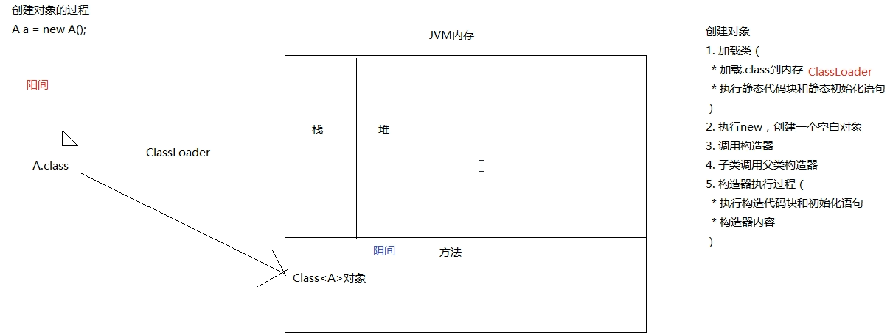
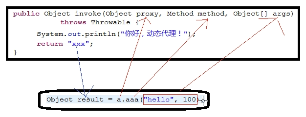
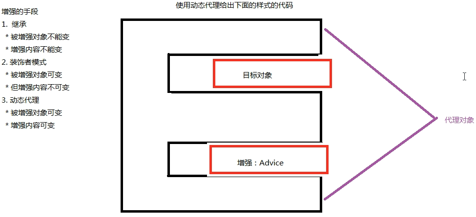
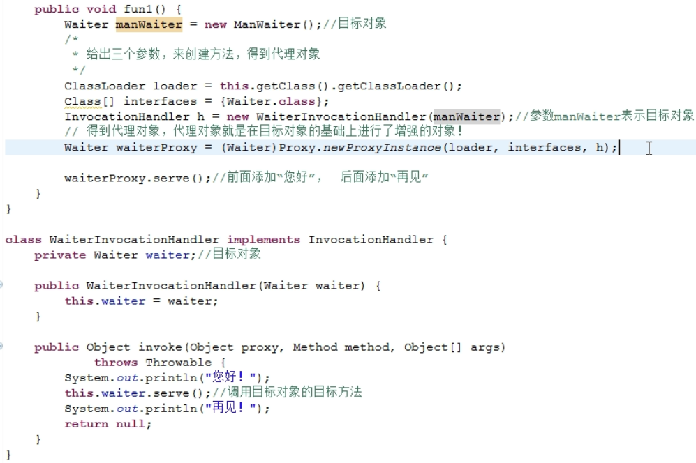
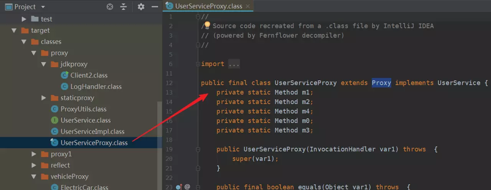
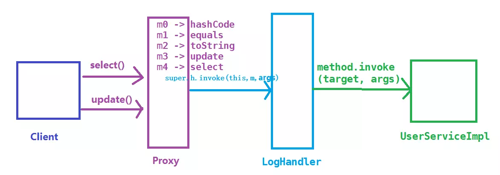
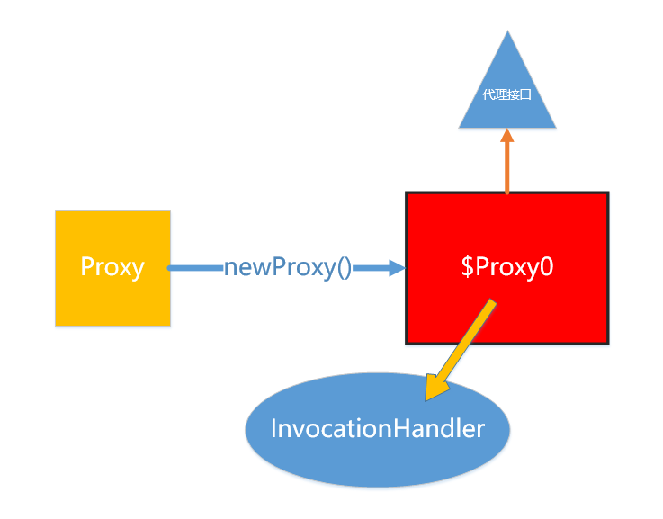

# Java三种代理

## 代理模式介绍

代理模式是一种设计模式，提供了对目标对象额外的访问方式，即通过代理对象访问目标对象，这样可以在不修改原目标对象的前提下，提供额外的功能操作，扩展目标对象的功能。

简言之，代理模式就是设置一个中间代理来控制访问原目标对象，以达到增强原对象的功能和简化访问方式。

通过使用代理，通常有两个优点，并且能够分别与我们提到的微商代理的两个特点对应起来：

优点一：可以隐藏委托类的实现;

优点二：可以实现客户与委托类间的解耦，在不修改委托类代码的情况下能够做一些额外的处理。

**代理模式**：给某一个对象提供一个代理，并由代理对象来控制对真实对象的访问。代理模式是一种结构型设计模式。

代理模式角色分为 3 种：

**Subject（抽象主题角色）**：定义代理类和真实主题的公共对外方法，也是代理类代理真实主题的方法；

**RealSubject（真实主题角色**）：真正实现业务逻辑的类；

**Proxy（代理主题角色）**：用来代理和封装真实主题；

代理模式的结构比较简单，其核心是代理类，为了让客户端能够**一致性地对待**真实对象和代理对象，在代理模式中引入了抽象层

**代理模式UML类图**


代理模式**按照职责**（使用场景）来分类，至少可以分为以下几类：1、远程代理。 2、虚拟代理。 3、Copy-on-Write 代理。 4、保护（Protect or Access）代理。 5、Cache代理。 6、防火墙（Firewall）代理。 7、同步化（Synchronization）代理。 8、智能引用（Smart Reference）代理等等。

如果**根据字节码的创建时机**来分类，可以分为静态代理和动态代理：

- 所谓**静态**也就是在**程序运行前**就已经存在代理类的**字节码文件**，代理类和真实主题角色的关系在运行前就确定了。
- 而动态代理的源码是在程序运行期间由**JVM**根据反射等机制**动态的生成**，所以在运行前并不存在代理类的字节码文件

## 静态代理

虽然静态代理实现简单，且不侵入原代码，但是，当场景稍微复杂一些的时候，静态代理的缺点也会暴露出来。

1.  当需要代理多个类的时候，由于代理对象要实现与目标对象一致的接口，有两种方式：

- 只维护一个代理类，由这个代理类实现多个接口，但是这样就导致**代理类过于庞大**
- 新建多个代理类，每个目标对象对应一个代理类，但是这样会**产生过多的代理类**

2. 当接口需要增加、删除、修改方法的时候，目标对象与代理类都要同时修改，**不易维护**。

编写一个接口 UserService ，以及该接口的一个实现类 UserServiceImpl

```java
public interface UserService {
    public void select();   
    public void update();
}

public class UserServiceImpl implements UserService {  
    public void select() {  
        System.out.println("查询 selectById");
    }
    public void update() {
        System.out.println("更新 update");
    }
}

```

我们将通过静态代理对 UserServiceImpl 进行功能增强，在调用 `select` 和 `update` 之前记录一些日志。写一个代理类 UserServiceProxy，代理类需要实现 UserService

```java
public class UserServiceProxy implements UserService {
    private UserService target; // 被代理的对象

    public UserServiceProxy(UserService target) {
        this.target = target;
    }
    public void select() {
        before();
        target.select();    // 这里才实际调用真实主题角色的方法
        after();
    }
    public void update() {
        before();
        target.update();    // 这里才实际调用真实主题角色的方法
        after();
    }

    private void before() {     // 在执行方法之前执行
        System.out.println(String.format("log start time [%s] ", new Date()));
    }
    private void after() {      // 在执行方法之后执行
        System.out.println(String.format("log end time [%s] ", new Date()));
    }
}

```

客户端测试

```java
public class Client1 {
    public static void main(String[] args) {
        UserService userServiceImpl = new UserServiceImpl();
        UserService proxy = new UserServiceProxy(userServiceImpl);

        proxy.select();
        proxy.update();
    }
}

```

输出

```java
log start time [Thu Dec 20 14:13:25 CST 2018] 
查询 selectById
log end time [Thu Dec 20 14:13:25 CST 2018] 
log start time [Thu Dec 20 14:13:25 CST 2018] 
更新 update
log end time [Thu Dec 20 14:13:25 CST 2018] 
```

通过静态代理，我们达到了功能增强的目的，而且没有侵入原代码，这是静态代理的一个优点。

## 动态代理

**为什么类可以动态的生成？**

这就涉及到Java虚拟机的**类加载机制**了，推荐翻看《深入理解Java虚拟机》7.3节 类加载的过程。

Java虚拟机类加载过程主要分为五个阶段：加载、验证、准备、解析、初始化。其中加载阶段需要完成以下3件事情：

1. 通过一个类的全限定名来获取定义此类的二进制字节流
2. 将这个字节流所代表的静态存储结构转化为方法区的运行时数据结构
3. 在内存中生成一个代表这个类的 `java.lang.Class` 对象，作为方法区这个类的各种数据访问入口

由于虚拟机规范对这3点要求并不具体，所以实际的实现是非常灵活的，关于第1点，**获取类的二进制字节流**（class字节码）就有很多途径：

- 从ZIP包获取，这是JAR、EAR、WAR等格式的基础
- 从网络中获取，典型的应用是 Applet
- **运行时计算生成**，这种场景使用最多的是动态代理技术，在 java.lang.reflect.Proxy 类中，就是用了 ProxyGenerator.generateProxyClass 来为特定接口生成形式为 `*$Proxy` 的代理类的二进制字节流
- 由其它文件生成，典型应用是JSP，即由JSP文件生成对应的Class类
- 从数据库中获取等等

所以，动态代理就是想办法，根据接口或目标对象，计算出代理类的字节码，然后再加载到JVM中使用。但是如何计算？如何生成？情况也许比想象的复杂得多，我们需要借助现有的方案。

#### 常见的字节码操作类库

> 这里有一些介绍：[java-source.net/open-source…](https://link.juejin.im?target=https%3A%2F%2Fjava-source.net%2Fopen-source%2Fbytecode-libraries)
>
> Apache BCEL (Byte Code Engineering Library)：是Java classworking广泛使用的一种框架，它可以深入到JVM汇编语言进行类操作的细节。
>
> ObjectWeb ASM：是一个Java字节码操作框架。它可以用于直接以二进制形式动态生成stub根类或其他代理类，或者在加载时动态修改类。
>
> CGLIB(Code Generation Library)：是一个功能强大，高性能和高质量的代码生成库，用于扩展JAVA类并在运行时实现接口。
>
> Javassist：是Java的加载时反射系统，它是一个用于在Java中编辑字节码的类库; 它使Java程序能够在运行时定义新类，并在JVM加载之前修改类文件。
>
> ...

#### 实现动态代理的思考方向

为了让生成的代理类与目标对象（真实主题角色）保持一致性，从现在开始将介绍以下两种最常见的方式：

1. 通过实现接口的方式 -> JDK动态代理
2. 通过继承类的方式 -> CGLIB动态代理

注：使用ASM对使用者要求比较高，使用Javassist会比较麻烦

#### newProxyInstance

在运行时，动态实现一组指定的接口的实现类对象（在运行时，创建实现了指定的一组接口的对象）

`Object proxyObject = Poxy.newProxyInstance(ClassLoader classLoader,Class[] interfaces,InvocationHandler h)`
ClassLoader：类加载器
用来加载类的，把.class文件加载到内存，形成Class对象
Class[] interfaces：指定要实现的接口们
InvocationHandler：代理对象的所有方法（个别不执行，getClass()）都会调用InvocationHandler的invoke()方法

#### InvocationHandler
`public Object invoke(Object proxy,Method method,Object[] args);`
这个invoke方法在什么时候被调用！
在调用代理对象所实现接口中的方法时调用
Object proxy：当前对象，在调用谁的方法
Method method：当前被调用的方法（目标方法）
Object[] args：实参！







### JDK动态代理

JDK动态代理主要涉及两个类：`java.lang.reflect.Proxy` 和 `java.lang.reflect.InvocationHandler`，我们仍然通过案例来学习

编写一个调用逻辑处理器 LogHandler 类，提供日志增强功能，并实现 InvocationHandler 接口；在 LogHandler 中维护一个目标对象，这个对象是被代理的对象（真实主题角色）；在 `invoke` 方法中编写方法调用的逻辑处理

```java
import java.lang.reflect.InvocationHandler;
import java.lang.reflect.Method;
import java.util.Date;

public class LogHandler implements InvocationHandler {
    Object target;  // 被代理的对象，实际的方法执行者

    public LogHandler(Object target) {
        this.target = target;
    }
    @Override
    public Object invoke(Object proxy, Method method, Object[] args) throws Throwable {
        before();
        Object result = method.invoke(target, args);  // 调用 target 的 method 方法
        after();
        return result;  // 返回方法的执行结果
    }
    // 调用invoke方法之前执行
    private void before() {
        System.out.println(String.format("log start time [%s] ", new Date()));
    }
    // 调用invoke方法之后执行
    private void after() {
        System.out.println(String.format("log end time [%s] ", new Date()));
    }
}

```

编写客户端，获取动态生成的代理类的对象须借助 Proxy 类的 newProxyInstance 方法，具体步骤可见代码和注释

```java
import proxy.UserService;
import proxy.UserServiceImpl;
import java.lang.reflect.InvocationHandler;
import java.lang.reflect.Proxy;

public class Client2 {
    public static void main(String[] args) throws IllegalAccessException, InstantiationException {
        // 设置变量可以保存动态代理类，默认名称以 $Proxy0 格式命名
        // System.getProperties().setProperty("sun.misc.ProxyGenerator.saveGeneratedFiles", "true");
        // 1. 创建被代理的对象，UserService接口的实现类
        UserServiceImpl userServiceImpl = new UserServiceImpl();
        // 2. 获取对应的 ClassLoader
        ClassLoader classLoader = userServiceImpl.getClass().getClassLoader();
        // 3. 获取所有接口的Class，这里的UserServiceImpl只实现了一个接口UserService，
        Class[] interfaces = userServiceImpl.getClass().getInterfaces();
        // 4. 创建一个将传给代理类的调用请求处理器，处理所有的代理对象上的方法调用
        //     这里创建的是一个自定义的日志处理器，须传入实际的执行对象 userServiceImpl
        InvocationHandler logHandler = new LogHandler(userServiceImpl);
        /*
		   5.根据上面提供的信息，创建代理对象 在这个过程中，
               a.JDK会通过根据传入的参数信息动态地在内存中创建和.class 文件等同的字节码
               b.然后根据相应的字节码转换成对应的class，
               c.然后调用newInstance()创建代理实例
		 */
        UserService proxy = (UserService) Proxy.newProxyInstance(classLoader, interfaces, logHandler);
        // 调用代理的方法
        proxy.select();
        proxy.update();
        
        // 保存JDK动态代理生成的代理类，类名保存为 UserServiceProxy
        // ProxyUtils.generateClassFile(userServiceImpl.getClass(), "UserServiceProxy");
    }
}

```

运行结果

```java
log start time [Thu Dec 20 16:55:19 CST 2018] 
查询 selectById
log end time [Thu Dec 20 16:55:19 CST 2018] 
log start time [Thu Dec 20 16:55:19 CST 2018] 
更新 update
log end time [Thu Dec 20 16:55:19 CST 2018] 

```

InvocationHandler 和 Proxy 的主要方法介绍如下：

**java.lang.reflect.InvocationHandler**

`Object invoke(Object proxy, Method method, Object[] args)` 定义了代理对象调用方法时希望执行的动作，用于集中处理在动态代理类对象上的方法调用

**java.lang.reflect.Proxy**

`static InvocationHandler getInvocationHandler(Object proxy)`  用于获取指定代理对象所关联的调用处理器

`static Class<?> getProxyClass(ClassLoader loader, Class<?>... interfaces)` 返回指定接口的代理类

`static Object newProxyInstance(ClassLoader loader, Class<?>[] interfaces, InvocationHandler h)` 构造实现指定接口的代理类的一个新实例，所有方法会调用给定处理器对象的 invoke 方法

`static boolean isProxyClass(Class<?> cl)` 返回 cl 是否为一个代理类

#### 代理类的调用过程

生成的代理类到底长什么样子呢？借助下面的工具类，把代理类保存下来再探个究竟
（通过设置环境变量sun.misc.ProxyGenerator.saveGeneratedFiles=true也可以保存代理类）

```java
import sun.misc.ProxyGenerator;
import java.io.FileOutputStream;
import java.io.IOException;

public class ProxyUtils {
    /**
     * 将根据类信息动态生成的二进制字节码保存到硬盘中，默认的是clazz目录下
     * params: clazz 需要生成动态代理类的类
     * proxyName: 为动态生成的代理类的名称
     */
    public static void generateClassFile(Class clazz, String proxyName) {
        // 根据类信息和提供的代理类名称，生成字节码
        byte[] classFile = ProxyGenerator.generateProxyClass(proxyName, clazz.getInterfaces());
        String paths = clazz.getResource(".").getPath();
        System.out.println(paths);
        FileOutputStream out = null;
        try {
            //保留到硬盘中
            out = new FileOutputStream(paths + proxyName + ".class");
            out.write(classFile);
            out.flush();
        } catch (Exception e) {
            e.printStackTrace();
        } finally {
            try {
                out.close();
            } catch (IOException e) {
                e.printStackTrace();
            }
        }
    }
}

```

然后在 Client2 测试类的main的最后面加入一行代码

```java
// 保存JDK动态代理生成的代理类，类名保存为 UserServiceProxy
ProxyUtils.generateClassFile(userServiceImpl.getClass(), "UserServiceProxy");
```

IDEA 再次运行之后就可以在 target 的类路径下找到 UserServiceProxy.class，双击后IDEA的反编译插件会将该二进制class文件



UserServiceProxy 的代码如下所示：

```java
import java.lang.reflect.InvocationHandler;
import java.lang.reflect.Method;
import java.lang.reflect.Proxy;
import java.lang.reflect.UndeclaredThrowableException;
import proxy.UserService;

public final class UserServiceProxy extends Proxy implements UserService {
    private static Method m1;
    private static Method m2;
    private static Method m4;
    private static Method m0;
    private static Method m3;

    public UserServiceProxy(InvocationHandler var1) throws  {
        super(var1);
    }

    public final boolean equals(Object var1) throws  {
        // 省略...
    }

    public final String toString() throws  {
        // 省略...
    }

    public final void select() throws  {
        try {
            super.h.invoke(this, m4, (Object[])null);
        } catch (RuntimeException | Error var2) {
            throw var2;
        } catch (Throwable var3) {
            throw new UndeclaredThrowableException(var3);
        }
    }

    public final int hashCode() throws  {
        // 省略...
    }

    public final void update() throws  {
        try {
            super.h.invoke(this, m3, (Object[])null);
        } catch (RuntimeException | Error var2) {
            throw var2;
        } catch (Throwable var3) {
            throw new UndeclaredThrowableException(var3);
        }
    }

    static {
        try {
            m1 = Class.forName("java.lang.Object").getMethod("equals", Class.forName("java.lang.Object"));
            m2 = Class.forName("java.lang.Object").getMethod("toString");
            m4 = Class.forName("proxy.UserService").getMethod("select");
            m0 = Class.forName("java.lang.Object").getMethod("hashCode");
            m3 = Class.forName("proxy.UserService").getMethod("update");
        } catch (NoSuchMethodException var2) {
            throw new NoSuchMethodError(var2.getMessage());
        } catch (ClassNotFoundException var3) {
            throw new NoClassDefFoundError(var3.getMessage());
        }
    }
}

```

从 UserServiceProxy 的代码中我们可以发现：

- UserServiceProxy 继承了 Proxy 类，并且实现了被代理的所有接口，以及equals、hashCode、toString等方法
- 由于 UserServiceProxy 继承了 Proxy 类，所以每个代理类都会关联一个 InvocationHandler 方法调用处理器
- 类和所有方法都被 `public final` 修饰，所以代理类只可被使用，不可以再被继承
- 每个方法都有一个 Method 对象来描述，Method 对象在static静态代码块中创建，以 `m + 数字` 的格式命名
- 调用方法的时候通过 `super.h.invoke(this, m1, (Object[])null);` 调用，其中的 `super.h.invoke` 实际上是在创建代理的时候传递给 `Proxy.newProxyInstance` 的 LogHandler 对象，它继承 InvocationHandler 类，负责实际的调用处理逻辑

而 LogHandler 的 invoke 方法接收到 method、args 等参数后，进行一些处理，然后通过反射让被代理的对象 target 执行方法

```java
    @Override
    public Object invoke(Object proxy, Method method, Object[] args) throws Throwable {
        before();
        Object result = method.invoke(target, args);       // 调用 target 的 method 方法
        after();
        return result;  // 返回方法的执行结果
    }

```

JDK动态代理执行方法调用的过程简图如下：



#### 动态代理的秘密

一定有同学对于为什么 Proxy 能够动态产生不同接口类型的代理感兴趣，我的猜测是肯定通过传入进去的接口然后通过反射动态生成了一个接口实例。
比如 SellWine 是一个接口，那么 Proxy.newProxyInstance() 内部肯定会有

```java
new SellWine();
```

这样相同作用的代码，不过它是通过反射机制创建的。那么事实是不是这样子呢？直接查看它们的源码好了。需要说明的是，我当前查看的源码是 1.8 版本。

```java
public static Object newProxyInstance(ClassLoader loader,
                                          Class<?>[] interfaces,
                                          InvocationHandler h)
        throws IllegalArgumentException
    {
        Objects.requireNonNull(h);

        final Class<?>[] intfs = interfaces.clone();


        /*
         * Look up or generate the designated proxy class.
         */
        Class<?> cl = getProxyClass0(loader, intfs);

        /*
         * Invoke its constructor with the designated invocation handler.
         */
        try {


            final Constructor<?> cons = cl.getConstructor(constructorParams);
            final InvocationHandler ih = h;
            if (!Modifier.isPublic(cl.getModifiers())) {
                AccessController.doPrivileged(new PrivilegedAction<Void>() {
                    public Void run() {
                        cons.setAccessible(true);
                        return null;
                    }
                });
            }

            return cons.newInstance(new Object[]{h});

        } catch (IllegalAccessException|InstantiationException e) {
            throw new InternalError(e.toString(), e);
        } catch (InvocationTargetException e) {
            Throwable t = e.getCause();
            if (t instanceof RuntimeException) {
                throw (RuntimeException) t;
            } else {
                throw new InternalError(t.toString(), t);
            }
        } catch (NoSuchMethodException e) {
            throw new InternalError(e.toString(), e);
        }
    }
```

newProxyInstance 的确创建了一个实例，它是通过 cl 这个 Class 文件的构造方法反射生成。cl 由 getProxyClass0() 方法获取。

```java
private static Class<?> getProxyClass0(ClassLoader loader,
                                       Class<?>... interfaces) {
    if (interfaces.length > 65535) {
        throw new IllegalArgumentException("interface limit exceeded");
    }

    // If the proxy class defined by the given loader implementing
    // the given interfaces exists, this will simply return the cached copy;
    // otherwise, it will create the proxy class via the ProxyClassFactory
    return proxyClassCache.get(loader, interfaces);
}
```

直接通过缓存获取，如果获取不到，注释说会通过 ProxyClassFactory 生成。

```java
/**
     * A factory function that generates, defines and returns the proxy class given
     * the ClassLoader and array of interfaces.
     */
    private static final class ProxyClassFactory
        implements BiFunction<ClassLoader, Class<?>[], Class<?>>
    {
        // Proxy class 的前缀是 “$Proxy”，
        private static final String proxyClassNamePrefix = "$Proxy";

        // next number to use for generation of unique proxy class names
        private static final AtomicLong nextUniqueNumber = new AtomicLong();

        @Override
        public Class<?> apply(ClassLoader loader, Class<?>[] interfaces) {

            Map<Class<?>, Boolean> interfaceSet = new IdentityHashMap<>(interfaces.length);
            for (Class<?> intf : interfaces) {
                /*
                 * Verify that the class loader resolves the name of this
                 * interface to the same Class object.
                 */
                Class<?> interfaceClass = null;
                try {
                    interfaceClass = Class.forName(intf.getName(), false, loader);
                } catch (ClassNotFoundException e) {
                }
                if (interfaceClass != intf) {
                    throw new IllegalArgumentException(
                        intf + " is not visible from class loader");
                }
                /*
                 * Verify that the Class object actually represents an
                 * interface.
                 */
                if (!interfaceClass.isInterface()) {
                    throw new IllegalArgumentException(
                        interfaceClass.getName() + " is not an interface");
                }
                /*
                 * Verify that this interface is not a duplicate.
                 */
                if (interfaceSet.put(interfaceClass, Boolean.TRUE) != null) {
                    throw new IllegalArgumentException(
                        "repeated interface: " + interfaceClass.getName());
                }
            }

            String proxyPkg = null;     // package to define proxy class in
            int accessFlags = Modifier.PUBLIC | Modifier.FINAL;

            /*
             * Record the package of a non-public proxy interface so that the
             * proxy class will be defined in the same package.  Verify that
             * all non-public proxy interfaces are in the same package.
             */
            for (Class<?> intf : interfaces) {
                int flags = intf.getModifiers();
                if (!Modifier.isPublic(flags)) {
                    accessFlags = Modifier.FINAL;
                    String name = intf.getName();
                    int n = name.lastIndexOf('.');
                    String pkg = ((n == -1) ? "" : name.substring(0, n + 1));
                    if (proxyPkg == null) {
                        proxyPkg = pkg;
                    } else if (!pkg.equals(proxyPkg)) {
                        throw new IllegalArgumentException(
                            "non-public interfaces from different packages");
                    }
                }
            }

            if (proxyPkg == null) {
                // if no non-public proxy interfaces, use com.sun.proxy package
                proxyPkg = ReflectUtil.PROXY_PACKAGE + ".";
            }

            /*
             * Choose a name for the proxy class to generate.
             */
            long num = nextUniqueNumber.getAndIncrement();
            String proxyName = proxyPkg + proxyClassNamePrefix + num;

            /*
             * Generate the specified proxy class.
             */
            byte[] proxyClassFile = ProxyGenerator.generateProxyClass(
                proxyName, interfaces, accessFlags);
            try {
                return defineClass0(loader, proxyName,
                                    proxyClassFile, 0, proxyClassFile.length);
            } catch (ClassFormatError e) {
                /*
                 * A ClassFormatError here means that (barring bugs in the
                 * proxy class generation code) there was some other
                 * invalid aspect of the arguments supplied to the proxy
                 * class creation (such as virtual machine limitations
                 * exceeded).
                 */
                throw new IllegalArgumentException(e.toString());
            }
        }
    }
```

这个类的注释说，通过指定的 ClassLoader 和 接口数组 用工厂方法生成 proxy class。 然后这个 proxy class 的名字是：

```java

// Proxy class 的前缀是 “$Proxy”，
private static final String proxyClassNamePrefix = "$Proxy";

long num = nextUniqueNumber.getAndIncrement();

String proxyName = proxyPkg + proxyClassNamePrefix + num;


```

所以，动态生成的代理类名称是**包名+$Proxy+id序号**。

生成的过程，核心代码如下：

```java
byte[] proxyClassFile = ProxyGenerator.generateProxyClass(
                proxyName, interfaces, accessFlags);

         
return defineClass0(loader, proxyName,
                    proxyClassFile, 0, proxyClassFile.length);


```

这两个方法，我没有继续追踪下去，defineClass0() 甚至是一个 native 方法。我们只要知道，动态创建代理这回事就好了。

现在我们还需要做一些验证，我要检测一下动态生成的代理类的名字是不是**包名+$Proxy+id序号**。

```java
public class Test {

	public static void main(String[] args) {
		// TODO Auto-generated method stub
		
		MaotaiJiu maotaijiu = new MaotaiJiu();
		
		Wuliangye wu = new Wuliangye();
		
		Furongwang fu = new Furongwang();
		
		InvocationHandler jingxiao1 = new GuitaiA(maotaijiu);
		InvocationHandler jingxiao2 = new GuitaiA(wu);
		
		InvocationHandler jingxiao3 = new GuitaiA(fu);
		
		SellWine dynamicProxy = (SellWine) Proxy.newProxyInstance(MaotaiJiu.class.getClassLoader(),
				MaotaiJiu.class.getInterfaces(), jingxiao1);
		SellWine dynamicProxy1 = (SellWine) Proxy.newProxyInstance(MaotaiJiu.class.getClassLoader(),
				MaotaiJiu.class.getInterfaces(), jingxiao2);
		
		dynamicProxy.mainJiu();
		
		dynamicProxy1.mainJiu();
		
		SellCigarette dynamicProxy3 = (SellCigarette) Proxy.newProxyInstance(Furongwang.class.getClassLoader(),
				Furongwang.class.getInterfaces(), jingxiao3);
		
		dynamicProxy3.sell();
		
		System.out.println("dynamicProxy class name:"+dynamicProxy.getClass().getName());
		System.out.println("dynamicProxy1 class name:"+dynamicProxy1.getClass().getName());
		System.out.println("dynamicProxy3 class name:"+dynamicProxy3.getClass().getName());
		
	}

}
```

结果如下：

```java
销售开始  柜台是： GuitaiA
我卖得是茅台酒。
销售结束
销售开始  柜台是： GuitaiA
我卖得是五粮液。
销售结束
销售开始  柜台是： GuitaiA
售卖的是正宗的芙蓉王，可以扫描条形码查证。
销售结束

dynamicProxy class name:com.sun.proxy.$Proxy0
dynamicProxy1 class name:com.sun.proxy.$Proxy0
dynamicProxy3 class name:com.sun.proxy.$Proxy1
```

SellWine 接口的代理类名是：com.sun.proxy.$Proxy0
SellCigarette 接口的代理类名是：com.sun.proxy.$Proxy1

这说明动态生成的 proxy class 与 Proxy 这个类同一个包。

下面用一张图让大家记住动态代理涉及到的角色。


红框中 `$Proxy0`就是通过 Proxy 动态生成的。
`$Proxy0`实现了要代理的接口。
`$Proxy0`通过调用 `InvocationHandler`来执行任务。

## cglib代理

[cglib](https://github.com/cglib/cglib) (Code Generation Library )是一个第三方代码生成类库，运行时在内存中动态生成一个子类对象从而实现对目标对象功能的扩展。

**cglib特点**

- JDK的动态代理有一个限制，就是使用动态代理的对象必须实现一个或多个接口。
  如果想代理没有实现接口的类，就可以使用CGLIB实现。
- CGLIB是一个强大的高性能的代码生成包，它可以在运行期扩展Java类与实现Java接口。
  它广泛的被许多AOP的框架使用，例如Spring AOP和dynaop，为他们提供方法的interception（拦截）。
- CGLIB包的底层是通过使用一个小而快的字节码处理框架ASM，来转换字节码并生成新的类。
  不鼓励直接使用ASM，因为它需要你对JVM内部结构包括class文件的格式和指令集都很熟悉。

cglib与动态代理最大的**区别**就是

- 使用动态代理的对象必须实现一个或多个接口
- 使用cglib代理的对象则无需实现接口，达到代理类无侵入。

使用cglib需要引入[cglib的jar包](https://repo1.maven.org/maven2/cglib/cglib/3.2.5/cglib-3.2.5.jar)，如果你已经有spring-core的jar包，则无需引入，因为spring中包含了cglib。

- cglib的Maven坐标

```maven
<dependency>
    <groupId>cglib</groupId>
    <artifactId>cglib</artifactId>
    <version>3.2.5</version>
</dependency>
```


maven引入CGLIB包，然后编写一个UserDao类，它没有接口，只有两个方法，select() 和 update()

```java
public class UserDao {
    public void select() {
        System.out.println("UserDao 查询 selectById");
    }
    public void update() {
        System.out.println("UserDao 更新 update");
    }
}

```

编写一个 LogInterceptor ，继承了 MethodInterceptor，用于方法的拦截回调

```java
import java.lang.reflect.Method;
import java.util.Date;

public class LogInterceptor implements MethodInterceptor {
    /**
     * @param object 表示要进行增强的对象
     * @param method 表示拦截的方法
     * @param objects 数组表示参数列表，基本数据类型需要传入其包装类型，如int-->Integer、long-Long、double-->Double
     * @param methodProxy 表示对方法的代理，invokeSuper方法表示对被代理对象方法的调用
     * @return 执行结果
     * @throws Throwable
     */
    @Override
    public Object intercept(Object object, Method method, Object[] objects, MethodProxy methodProxy) throws Throwable {
        before();
        Object result = methodProxy.invokeSuper(object, objects);   // 注意这里是调用 invokeSuper 而不是 invoke，否则死循环，methodProxy.invokesuper执行的是原始类的方法，method.invoke执行的是子类的方法
        after();
        return result;
    }
    private void before() {
        System.out.println(String.format("log start time [%s] ", new Date()));
    }
    private void after() {
        System.out.println(String.format("log end time [%s] ", new Date()));
    }
}

```

测试

```java
import net.sf.cglib.proxy.Enhancer;

public class CglibTest {
    public static void main(String[] args) {
        DaoProxy daoProxy = new DaoProxy(); 
        Enhancer enhancer = new Enhancer();
        enhancer.setSuperclass(Dao.class);  // 设置超类，cglib是通过继承来实现的
        enhancer.setCallback(daoProxy);

        Dao dao = (Dao)enhancer.create();   // 创建代理类
        dao.update();
        dao.select();
    }
}

```

运行结果

```java
log start time [Fri Dec 21 00:06:40 CST 2018] 
UserDao 查询 selectById
log end time [Fri Dec 21 00:06:40 CST 2018] 
log start time [Fri Dec 21 00:06:40 CST 2018] 
UserDao 更新 update
log end time [Fri Dec 21 00:06:40 CST 2018] 

```

还可以进一步多个 MethodInterceptor 进行过滤筛选

```java
public class LogInterceptor2 implements MethodInterceptor {
    @Override
    public Object intercept(Object object, Method method, Object[] objects, MethodProxy methodProxy) throws Throwable {
        before();
        Object result = methodProxy.invokeSuper(object, objects);
        after();
        return result;
    }
    private void before() {
        System.out.println(String.format("log2 start time [%s] ", new Date()));
    }
    private void after() {
        System.out.println(String.format("log2 end time [%s] ", new Date()));
    }
}

// 回调过滤器: 在CGLib回调时可以设置对不同方法执行不同的回调逻辑，或者根本不执行回调。
public class DaoFilter implements CallbackFilter {
    @Override
    public int accept(Method method) {
        if ("select".equals(method.getName())) {
            return 0;   // Callback 列表第1个拦截器
        }
        return 1;   // Callback 列表第2个拦截器，return 2 则为第3个，以此类推
    }
}

```

再次测试

```java
public class CglibTest2 {
    public static void main(String[] args) {
        LogInterceptor logInterceptor = new LogInterceptor();
        LogInterceptor2 logInterceptor2 = new LogInterceptor2();
        Enhancer enhancer = new Enhancer();
        enhancer.setSuperclass(UserDao.class);   // 设置超类，cglib是通过继承来实现的
        enhancer.setCallbacks(new Callback[]{logInterceptor, logInterceptor2, NoOp.INSTANCE});   // 设置多个拦截器，NoOp.INSTANCE是一个空拦截器，不做任何处理
        enhancer.setCallbackFilter(new DaoFilter());

        UserDao proxy = (UserDao) enhancer.create();   // 创建代理类
        proxy.select();
        proxy.update();
    }
}

```

运行结果

```java
log start time [Fri Dec 21 00:22:39 CST 2018] 
UserDao 查询 selectById
log end time [Fri Dec 21 00:22:39 CST 2018] 
log2 start time [Fri Dec 21 00:22:39 CST 2018] 
UserDao 更新 update
log2 end time [Fri Dec 21 00:22:39 CST 2018] 

```

CGLIB 创建动态代理类的模式是：

1. 查找目标类上的所有非final 的public类型的方法定义；
2. 将这些方法的定义转换成字节码；
3. 将组成的字节码转换成相应的代理的class对象；
4. 实现 MethodInterceptor接口，用来处理对代理类上所有方法的请求

## JDK动态代理与CGLIB动态代理对比

JDK动态代理：基于Java反射机制实现，必须要实现了接口的业务类才能用这种办法生成代理对象。

cglib动态代理：基于ASM机制实现，通过生成业务类的子类作为代理类。

JDK Proxy 的优势：

- 最小化依赖关系，减少依赖意味着简化开发和维护，JDK 本身的支持，可能比 cglib 更加可靠。
- 平滑进行 JDK 版本升级，而字节码类库通常需要进行更新以保证在新版 Java 上能够使用。
- 代码实现简单。

基于类似 cglib 框架的优势：

- 无需实现接口，达到代理类无侵入
- 只操作我们关心的类，而不必为其他相关类增加工作量。
- 高性能

### 面试题

**描述动态代理的几种实现方式？分别说出相应的优缺点**

代理可以分为 "静态代理" 和 "动态代理"，动态代理又分为 "JDK动态代理" 和 "CGLIB动态代理" 实现。

**静态代理**：代理对象和实际对象都继承了同一个接口，在代理对象中指向的是实际对象的实例，这样对外暴露的是代理对象而真正调用的是 Real Object

- **优点**：可以很好的保护实际对象的业务逻辑对外暴露，从而提高安全性。
- **缺点**：不同的接口要有不同的代理类实现，会很冗余

**JDK 动态代理**：

- 为了解决静态代理中，生成大量的代理类造成的冗余；
- JDK 动态代理只需要实现 InvocationHandler 接口，重写 invoke 方法便可以完成代理的实现，
- jdk的代理是利用反射生成代理类 Proxyxx.class 代理类字节码，并生成对象
- jdk动态代理之所以**只能代理接口**是因为**代理类本身已经extends了Proxy，而java是不允许多重继承的**，但是允许实现多个接口
- **优点**：解决了静态代理中冗余的代理实现类问题。
- **缺点**：JDK 动态代理是基于接口设计实现的，如果没有接口，会抛异常。

**CGLIB 代理**：

- 由于 JDK 动态代理限制了只能基于接口设计，而对于没有接口的情况，JDK方式解决不了；
- CGLib 采用了非常底层的字节码技术，其原理是通过字节码技术为一个类创建子类，并在子类中采用方法拦截的技术拦截所有父类方法的调用，顺势织入横切逻辑，来完成动态代理的实现。
- 实现方式实现 MethodInterceptor 接口，重写 intercept 方法，通过 Enhancer 类的回调方法来实现。
- 但是CGLib在创建代理对象时所花费的时间却比JDK多得多，所以对于单例的对象，因为无需频繁创建对象，用CGLib合适，反之，使用JDK方式要更为合适一些。
- 同时，由于CGLib由于是采用动态创建子类的方法，对于final方法，无法进行代理。
- **优点**：没有接口也能实现动态代理，而且采用字节码增强技术，性能也不错。
- **缺点**：技术实现相对难理解些。

### CGlib 对接口实现代理？

```java
import net.sf.cglib.proxy.Enhancer;
import net.sf.cglib.proxy.MethodInterceptor;
import net.sf.cglib.proxy.MethodProxy;
import proxy.UserService;
import java.lang.reflect.Method;

/**
 * 创建代理类的工厂 该类要实现 MethodInterceptor 接口。
 * 该类中完成三样工作：
 * （1）声明目标类的成员变量，并创建以目标类对象为参数的构造器。用于接收目标对象
 * （2）定义代理的生成方法，用于创建代理对象。方法名是任意的。代理对象即目标类的子类
 * （3）定义回调接口方法。对目标类的增强这在这里完成
 */
public class CGLibFactory implements MethodInterceptor {
    // 声明目标类的成员变量
    private UserService target;

    public CGLibFactory(UserService target) {
        this.target = target;
    }
    // 定义代理的生成方法,用于创建代理对象
    public UserService myCGLibCreator() {
        Enhancer enhancer = new Enhancer();
        // 为代理对象设置父类，即指定目标类
        enhancer.setSuperclass(UserService.class);
        /**
         * 设置回调接口对象 注意，只所以在setCallback()方法中可以写上this，
         * 是因为MethodIntecepter接口继承自Callback，是其子接口
         */
        enhancer.setCallback(this);
        return (UserService) enhancer.create();// create用以生成CGLib代理对象
    }
    @Override
    public Object intercept(Object obj, Method method, Object[] args, MethodProxy proxy) throws Throwable {
        System.out.println("start invoke " + method.getName());
        Object result = method.invoke(target, args);
        System.out.println("end invoke " + method.getName());
        return result;
    }
}
```

参考：

[Java 动态代理详解](https://juejin.im/post/5c1ca8df6fb9a049b347f55c)

