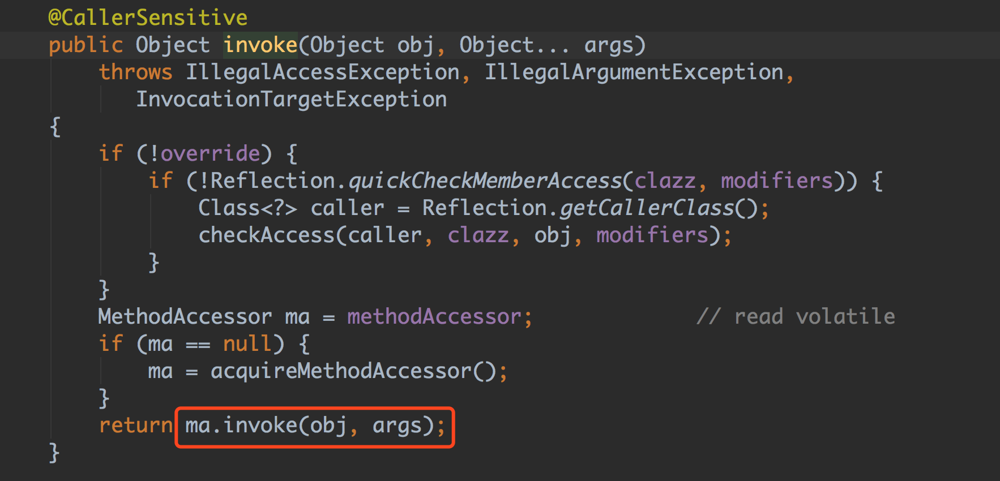
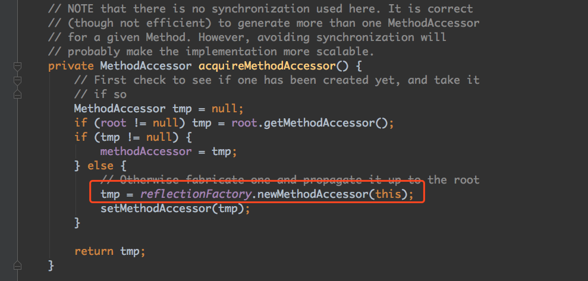
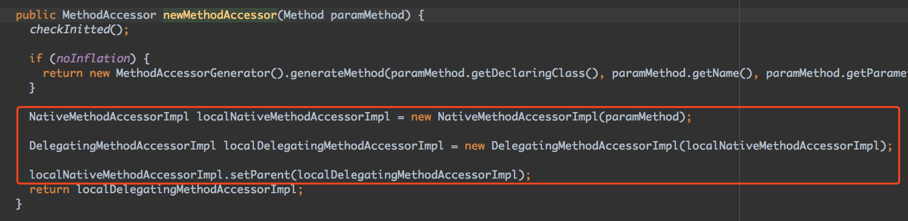
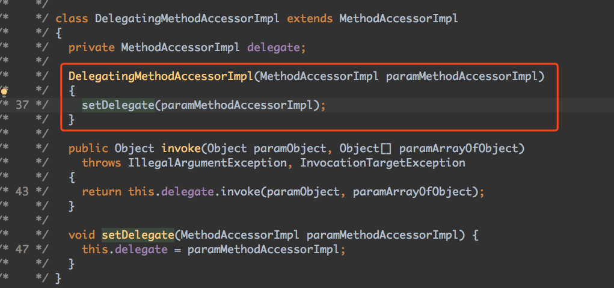
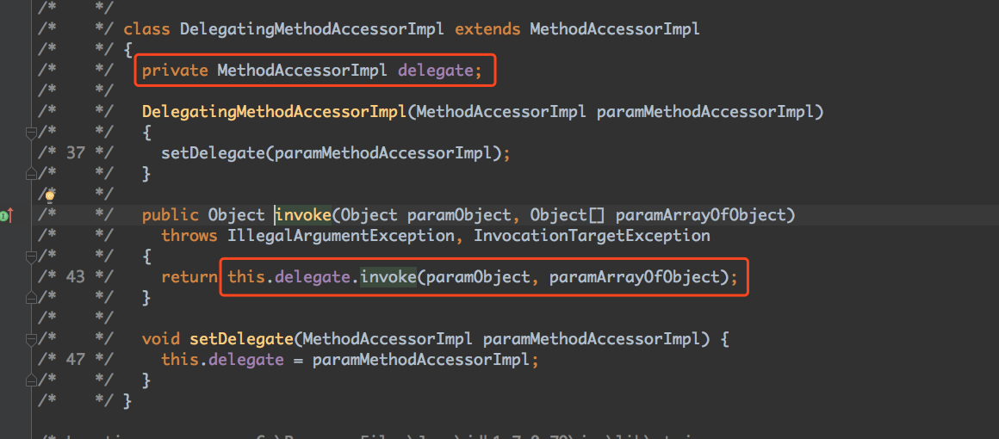
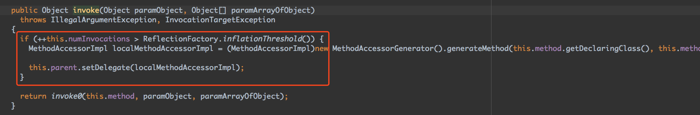
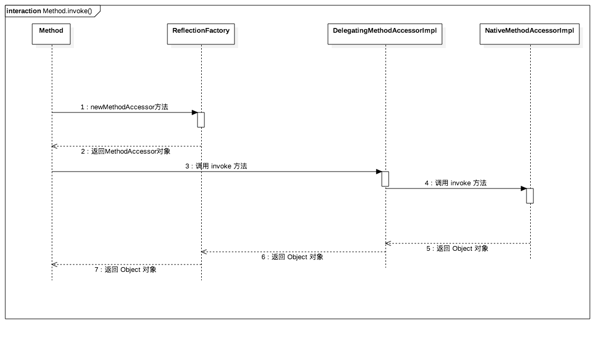

# 反射

> Java 反射机制在程序**运行时**，对于任意一个类，都能够知道这个类的所有属性和方法；对于任意一个对象，都能够调用它的任意一个方法和属性。这种 **动态的获取信息** 以及 **动态调用对象的方法** 的功能称为 **java 的反射机制**。

反射机制很重要的一点就是“运行时”，其使得我们可以在程序运行时加载、探索以及使用编译期间完全未知的 `.class` 文件。换句话说，Java 程序可以加载一个运行时才得知名称的 `.class` 文件，然后获悉其完整构造，并生成其对象实体、或对其 fields（变量）设值、或调用其 methods（方法）。

**要想剖析一个类，必须先要获取到该类的字节码文件对象，而解剖使用的就是Class类中的方法，所以先要获取到每一个字节码文件对应的Class类型的对象**

反射库提供了一个非常丰富且精心设计的工具集，以便编写能够动态操作Java代码的程序.。

能够分析类能力的程序称为反射，反射机制的功能极其强大，反射机制可以用来:

- 在运行中分析类的能力
- 在运行中查看对象
- 实现通用的数组操作代码
- 利用Method对象。

## Class类

在程序运行期间，Java运行时系统始终未所有的对象维护一个被称为运行时的类型标识。这个信息跟踪着每个对象所属的类。虚拟机利用运行时类型信息选择相应的方法执行。

然后，可以通过专门的Java类访问这些信息。保存这些信息的类被称为Class，这个名字很容易让人混淆。**Object类中的getClass()方法将会返回一个Class类型的实例。**

一个Class对象表示一个特定类的属性，**getName()方法返回类的名字**。

调用forName获得类名对应的Class对象,这个方法在类名保存在字符串中，并可在运行中改变就可以使用，只有在className是类名或接口名时才能够执行。否则将抛出一个checked exception(已检查异常)，所以无论何时使用这个方法，都应该提供一个异常处理器。

如果T是任意的Java类型，T.class将代表匹配的类对象，一个Class对象实际表示的是一个类型，而这个类型未必一定是一种类。虚拟机为每个类型管理一个Class对象，因此，可以利用==运算符实现两个类对象比较的操作符。newInstance()可以快速地创建一个类的实例。**newInstance方法**调用默认的构造器初始化新创建的对象，如果这个类没有默认的构造器，就会抛出一个异常。将forName与newInstance配合起来使用，可以根据存储在字符串中的类名创建一个对象。

```java
String s = “java.util.Date”;
Object m = Class.forName(s).newInstance();
```

## 利用反射分析类的能力

**检查类的结构:**

在java.lang.reflect包中有三个类Field、Method和Constructor分别用于描述类的域、方法和构造器。

这三个类都有一个叫做getName的方法，用来返回项目的名称。

Field类有一个getType方法，用来返回描述域所属类型的Class对象。Method和Constructor类有能够报告参数类型的方法，

Method类还有一个可以报告返回类型的方法。

这三个类还有一个叫做getModifiers的方法，它将返回一个整形数值，用不同的位开关描述public和static这样的修饰符使用状况。

另外还有java.lang.reflect包中的Modifier类的静态方法分析getModifiers返回的整形数值。

还可以利用Modifier.toString方法将修饰符打印出来。

Class类中的getFields、getMethods和getConstructors方法将分别返回类提供的public域、方法和构造器数组，其中包括超类的公有成员。

Class类的getDeclareFields、getDeclareMethods和getDeclaredConstructors方法将分别返回类中生命的全部域、方法和构造器，其中包括私有和受保护成员，但不包括超类的成员。

**在运行时使用反射分析对象：**

如果f是一个Field类型的对象，obj是某个包含f域的类的对象，f.get(obj)。将返回一个对象，其值为obj域的当前值。

反射机制的默认行为受限于java的访问控制，然而，如果一个java程序没有收到安全管理器的控制，就可以覆盖访问控制，需要调用Field、Method或Construtor对象的setAsseccible方法

## 类的加载和加载时机

### 类的加载

* 当程序要使用某个类时，如果该类还未被加载到内存中，则系统会通过加载，连接，初始化三步来实现对这个类进行初始化
* 加载
  * 就是指将class文件读入内存，并为之创建一个Class对象
  * 任何类被使用时系统都会建立有个Class对象
* 连接
  * 验证：是否有正确的内部结构，并和其它类协调一致
  * 准备：负责为类的静态成员分配内存，并设置默认初始化值
  * 解析：将类的二进制数据中的符号引用替换为直接引用
* 初始化

### 类初始化时机

1. 创建类的实例
2. 访问类的静态变量，或者为静态变量赋值
3. 掉用类的静态方法
4. 使用反射方式来强制创建某个类或接口对应的java.lang.Class对象
5. 初始化某个类的子类
6. 直接使用java.exe命令来运行某个主类

### 类加载器

负责将.class文件加载到内存中，并为之生成对应的Class对象

**类加载器的组成**

**Bootstrap ClassLoader根类加载器**

* 也被称为引导类加载器，负责Java核心类的加载
  * 比如System.String等，在JDK中JRE的lib目录下rt.jar文件中

**Extension ClassLoader扩展类加载器**

* 负责JRE的扩展目录中jar包的加载
  * 在JDK中JRE的lib目录下的ext目录

**System CLassLoader系统类加载器**

* 负责在JVM启动时加载来自Java命令的class文件，以及classpath环境变量所指定的jar包和类路径


## 反射的基本应用

反射可以用于判断任意对象所属的类，获得 Class 对象，构造任意一个对象以及调用一个对象。(反射相关的类一般都在 java.lang.relfect 包里)。

### 获得Class对象

* 使用Class类的forName静态方法：

  ```java
  public static Class<?> forName(String className)
  //比如在 JDBC 开发中常用此方法加载数据库驱动:
  Class.forName(driver);
  ```

* 直接获取某一个对象的class：

  ```java
  Class<?> klass = int.class;
  Class<?> classInt = Integer.TYPE;
  ```

* 调用某个对象的getClass()方法：

  ```java
  StringBuilder str = new StringBuilder("123");
  Class<?> klass = str.getClass();
  ```

### 判断是否为某个类的实例

一般地，我们用 `instanceof` 关键字来判断是否为某个类的实例。同时我们也可以借助反射中 Class 对象的 `isInstance()` 方法来判断是否为某个类的实例，它是一个 native 方法：

```java
public native boolean isInstance(Object obj);
```

### 创建实例

通过反射来生成对象主要有两种方式。

- 使用Class对象的newInstance()方法来创建Class对象对应类的实例。

  ```java
  Class<?> c = String.class;
  Object str = c.newInstance();
  ```

- 先通过Class对象获取指定的Constructor对象，再调用Constructor对象的newInstance()方法来创建实例。这种方法可以用指定的构造器构造类的实例。

  ```java
  //获取String所对应的Class对象
  Class<?> c = String.class;
  //获取String类带一个String参数的构造器
  Constructor constructor = c.getConstructor(String.class);
  //根据构造器创建实例
  Object obj = constructor.newInstance("23333");
  System.out.println(obj);
  ```

### 获取类的构造方法

#### 获取无参构造

```java
Class c = Class.forNmae("cn.goya.Student");
//获取构造方法
/*
public Constructor[] getConstructors();所有公共构造方法
public Constructor[] getDeclaredConstructors();所有构造方法
Constructor[] cons = c.getDeclaredConstructors();
for(Constructor con : cons){
	System.out.println(con);
}
*/

//获取单个构造方法
/*
public Constructor<T> getConstructor(Class<?>... parameterTypes)
参数表示的是:你要获取的构造方法的构造参数个数及数据类型的class字节码文件对象
*/
Constructor con = c.getConstructor();//返回的是构造方法对象
//Student s = new Student();
//System.out.println(s);
//public T newInstance(Object... initargs)
//使用此Constructor对象表示的构造方法来创建该构造方法的声明类的新实例，并用指定的初始化参数初始化该实例
Object obj = con.newInstance();
System.out.println(obj);
//Student s = (Student)obj;
//s.show();
```

#### 获取带参构造

```java
/*
public Student(String name,int age,String address)
Student s = new Student("张三","18","西安");
System.out.println(s);
*/
//获取字节码文件对象
Class c = Class.forName("cn.goya.Student");
//获取带参构造方法对象
//public Constructor<T> getConstructor(Class<?>... parameterTypes)
Constructor con = c.getConstructor(String.classs,int.class,String.class);
//获取带参构造方法对象创建对象
//public T new Instance(Object... initargs);
Objec obj = con.newInstance("张三","18","西安");
System.out.println(obj);
```

#### 获取私有构造

```java
/*
private Student(String name){}
Student s = new Student("李四");
System.out.println(s);
*/
//获取字节码文件对象
Class c = Class.forName("cn.goya.Student");
//获取私有构造方法对象
//NoSuchMethodException:没有这个方法异常
//原因是一开始我们使用的方法只能获取公共的，下面这种方法就可以
Constructor con = c.getDeclaredConstructor(String.class);
//用该私有构造方法创建对象
//IllegalAcessException:非法访问异常
//暴力访问
con.setAccessible(true);//值为true则指示反射的对象在使用时应该取消Java语言访问检查
Object obj = con.newInstance("李四");
System.out.println(obj);
```

### 获取类的成员变量

```java
//获取所有成员
getFields.getDeclaredFields();
//获取单个成员
getFields.getDeclaredField();
//修改成员的值
set(Object obj,Object value);
//将指定对象变量上此Field对象表示的字段设置为指定的新值
```

案例

```java
//获取字节码文件对象
Class c = Class.forName("cn.goya.Student");
//获取所有成员变量
/*
Field[] fields = c.getFields();
Field[] fields = c.getDeclaredFiedls();
for(Field field:fields){
	System.out.println(field);
}
*/
//Student s = new Student();s.address="上海";

//通过无参构造方法创建对象
Constructor con = c.getConstructor();
Object obj = con.newInstance();
System.out.println(obj);

//获取单个的成员
//获取address并对其赋值
Field addressField = c.getField("address");
//public void set(obj,Object value)
//将指定此对象变量上此Field对象表示的字段设置为指定的新值
addressField.set(obj,"上海");//给obj对象的addrrssField字段设置值
System.out.println(obj);
```

**对于基本类型的静态常量，JVM 在编译阶段会把引用此常量的代码替换成具体的常量值**。

这么说来，在实际开发中，如果我们想修改某个类的常量值，恰好那个常量是基本类型的，岂不是无能为力了？反正我个人认为除非修改源码，否则真没办法！

这里所谓的无能为力是指：**我们在程序运行时刻依然可以使用反射修改常量的值（后面会代码验证），但是 JVM 在编译阶段得到的 .class 文件已经将常量优化为具体的值，在运行阶段就直接使用具体的值了，所以即使修改了常量的值也已经毫无意义了**。

### 获取成员方法

#### 获取无参无返回值的成员方法

```java
//获取字节码文件对象
Class c = Class.forName("cn.goya.Student");

//获取所有的方法
//Method[] methods = c.getMethods();//获取自己的包括父亲的公共方法
//Method[] methods = c.getDeclareMethods();//获取自己的所有的方法
/*
for(Method method:methods){
	System.out.println(method);
}
*/

Constructor con = c.getConstructor();
Object obj = con.newInstance();
/*
Student s = new Student(); s.show();
*/

//获取单个方法并使用
//public void show()
//public Method getMethod(String name,Class<?>... parameterTypes)
//第一个参数表示的方法名，第二个参数表示的是方法的参数的class类型
Methdo m1 = c.getMethod("show");
//public Object invoke(Object obj,Object... args)
m1.invole(obj);
```

#### 获取带参带返回值成员的方法

```java
//public void method(String s)
Method m2 = c.getMethod("method",String.class);
m2.invoke(obj,"hello");

//public String getString(String s,int i)
Method m3 = c.getMethod("getString",String.class,int.class);

//private void function()
Method m3 = c.getDeclaredMethod("function");
m4.setAccessible(true);
m4.invoke(obj);
```

### 通过反射越过泛型检查

```java
ArrayList<Integer> array = new ArrayList<Integer>();
Class c = array.getClass();//集合ArrayList的class对象
Method m = c.getMethod("add",Object.class);
m.invoke(array,"hello");//调用array的add方法，传入的值是hello
```

## 反射源码解析

当我们懂得了如何使用反射后，今天我们就来看看 JDK 源码中是如何实现反射的。或许大家平时没有使用过反射，但是在开发 Web 项目的时候会遇到过下面的异常：

```java
java.lang.NullPointerException 
...
sun.reflect.DelegatingMethodAccessorImpl.invoke(DelegatingMethodAccessorImpl.java:43)
  at java.lang.reflect.Method.invoke(Method.java:497)
```

可以看到异常堆栈指出了异常在 Method 的第 497 的 invoke 方法中，其实这里指的 invoke 方法就是我们反射调用方法中的 invoke。

```java
Method method = clz.getMethod("setPrice", int.class); 
method.invoke(object, 4);   //就是这里的invoke方法
```

例如我们经常使用的 Spring 配置中，经常会有相关 Bean 的配置：

```java
<bean class="com.chenshuyi.Apple">
</bean>
```

当我们在 XML 文件中配置了上面这段配置之后，Spring 便会在启动的时候利用反射去加载对应的 Apple 类。而当 Apple 类不存在或发生启发异常时，异常堆栈便会将异常指向调用的 invoke 方法。

从这里可以看出，我们平常很多框架都使用了反射，而反射中最最终的就是 Method 类的 invoke 方法了。

下面我们来看看 JDK 的 invoke 方法到底做了些什么。

进入 Method 的 invoke 方法我们可以看到，一开始是进行了一些权限的检查，最后是调用了 MethodAccessor 类的 invoke 方法进行进一步处理，如下图红色方框所示。



那么 MethodAccessor 又是什么呢？

其实 MethodAccessor 是一个接口，定义了方法调用的具体操作，而它有三个具体的实现类：

- sun.reflect.DelegatingMethodAccessorImpl
- sun.reflect.MethodAccessorImpl
- sun.reflect.NativeMethodAccessorImpl

而要看 ma.invoke() 到底调用的是哪个类的 invoke 方法，则需要看看 MethodAccessor 对象返回的到底是哪个类对象，所以我们需要进入 acquireMethodAccessor() 方法中看看。

从 acquireMethodAccessor() 方法我们可以看到，代码先判断是否存在对应的 MethodAccessor 对象，如果存在那么就复用之前的 MethodAccessor 对象，否则调用 ReflectionFactory 对象的 newMethodAccessor 方法生成一个 MethodAccessor 对象。

在 ReflectionFactory 类的 newMethodAccessor 方法里，我们可以看到首先是生成了一个 NativeMethodAccessorImpl 对象，再这个对象作为参数调用 DelegatingMethodAccessorImpl 类的构造方法。

这里的实现是使用了代理模式，将 NativeMethodAccessorImpl 对象交给 DelegatingMethodAccessorImpl 对象代理。我们查看 DelegatingMethodAccessorImpl 类的构造方法可以知道，其实是将 NativeMethodAccessorImpl 对象赋值给 DelegatingMethodAccessorImpl 类的 delegate 属性。

所以说ReflectionFactory 类的 newMethodAccessor 方法最终返回 DelegatingMethodAccessorImpl 类对象。所以我们在前面的 ma.invoke() 里，其将会进入 DelegatingMethodAccessorImpl 类的 invoke 方法中。

进入 DelegatingMethodAccessorImpl 类的 invoke 方法后，这里调用了 delegate 属性的 invoke 方法，它又有两个实现类，分别是：DelegatingMethodAccessorImpl 和 NativeMethodAccessorImpl。按照我们前面说到的，这里的 delegate 其实是一个 NativeMethodAccessorImpl 对象，所以这里会进入 NativeMethodAccessorImpl 的 invoke 方法。

而在 NativeMethodAccessorImpl 的 invoke 方法里，其会判断调用次数是否超过阀值（numInvocations）。如果超过该阀值，那么就会生成另一个MethodAccessor 对象，并将原来 DelegatingMethodAccessorImpl 对象中的 delegate 属性指向最新的 MethodAccessor 对象。

到这里，其实我们可以知道 MethodAccessor 对象其实就是具体去生成反射类的入口。通过查看源码上的注释，我们可以了解到 MethodAccessor 对象的一些设计信息。

> "Inflation" mechanism. Loading bytecodes to implement Method.invoke() and Constructor.newInstance() currently costs 3-4x more than an invocation via native code for the first invocation (though subsequent invocations have been benchmarked to be over 20x faster).Unfortunately this cost increases startup time for certain applications that use reflection intensively (but only once per class) to bootstrap themselves.
>
> Inflation 机制。初次加载字节码实现反射，使用 Method.invoke() 和 Constructor.newInstance() 加载花费的时间是使用原生代码加载花费时间的 3 - 4 倍。这使得那些频繁使用反射的应用需要花费更长的启动时间。
>
> To avoid this penalty we reuse the existing JVM entry points for the first few invocations of Methods and Constructors and then switch to the bytecode-based implementations. Package-private to be accessible to NativeMethodAccessorImpl and NativeConstructorAccessorImpl.
>
> 为了避免这种痛苦的加载时间，我们在第一次加载的时候重用了 JVM 的入口，之后切换到字节码实现的实现。

就像注释里说的，实际的 MethodAccessor 实现有两个版本，一个是 Native 版本，一个是 Java 版本。

Native 版本一开始启动快，但是随着运行时间边长，速度变慢。Java 版本一开始加载慢，但是随着运行时间边长，速度变快。正是因为两种存在这些问题，所以第一次加载的时候我们会发现使用的是 NativeMethodAccessorImpl 的实现，而当反射调用次数超过 15 次之后，则使用 MethodAccessorGenerator 生成的 MethodAccessorImpl 对象去实现反射。

Method 类的 invoke 方法整个流程可以表示成如下的时序图：

 invoke 方法内部有两种实现方式，一种是 native 原生的实现方式，一种是 Java 实现方式，这两种各有千秋。而为了最大化性能优势，JDK 源码使用了代理的设计模式去实现最大化性能。

