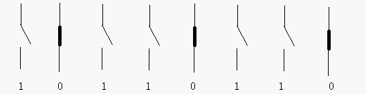
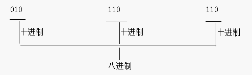
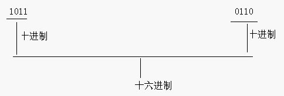
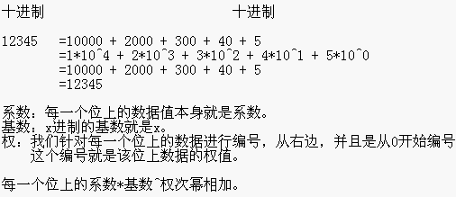
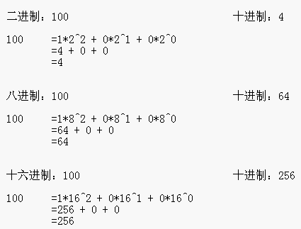
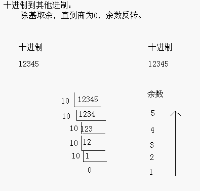
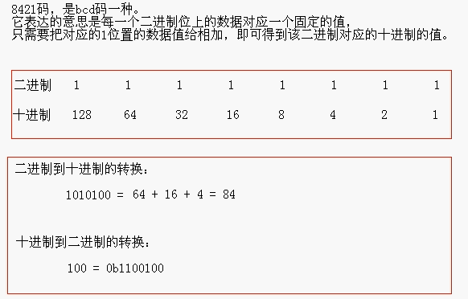
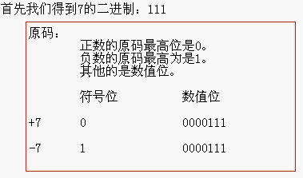
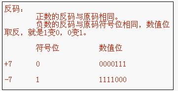
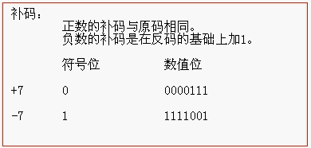

# JavaSE-基础语法

## 关键字

被Java语言赋予特定含义的单词

特点：全部小写，goto和const作为保留字存在

|    abstract    |      assert      |    boolean    |     break      |    byte    |
| :------------: | :--------------: | :-----------: | :------------: | :--------: |
|    **case**    |    **catch**     |   **char**    |   **class**    | **const**  |
|  **continue**  |   **default**    |    **do**     |   **double**   |  **else**  |
|    **enum**    |   **extends**    |   **final**   |  **finally**   | **float**  |
|    **for**     |     **goto**     |    **if**     | **implements** | **import** |
| **instanceof** |     **int**      | **interface** |    **long**    | **native** |
|    **new**     |   **package**    |  **private**  | **protected**  | **public** |
|   **return**   |   **strictfp**   |   **short**   |   **static**   | **super**  |
|   **switch**   | **synchronized** |   **this**    |   **throw**    | **throws** |
| **transient**  |     **try**      |   **void**    |  **volatile**  | **while**  |

## 标识符

给类、接口、方法、变量等起名的字符序列

组成规则：数字、字母、下划线和$（见名知意），不能以数字开头，不能是java中的关键字，区分大小写

``` java
int count = 10;
float size01 = 25.0F;
double size_02 = 30.23;
char size$03 = 'a';
```

## 常量

### 字面值常量

在程序执行过程中，其值不发生改变的量，常量在编译阶段会存入到调用这个常量的方法所在类的常量池中。并且调用类并没有直接引用到定义常量的类，因此并不会触发定义常量的类的初始化。

#### 字符串常量

"a"、"hello"、等双引号括起来的常量

``` java
String s = "a";
String s2 = "hello";
```

#### 整数常量

1、2、123等数值类型常量

``` java
int a = 1;
int b = 2;
```

#### 小数常量

12.345等小数形式常量

``` java
float f = 12.32F;
```

#### 字符常量

'a'、'A'、'0'等用单引号括起来的常量

可与是英文字母、数字、标点符号以及由转义序列来表示的特殊字符。'\u0000'表示一个空白字符，即在单引号之间没有任何字符，之所以能这样表示，是因为Java采用Unicode字符集，Unicode字符以\u开头，空白字符在Unicode码表中对应的值为'\u0000'

``` java
char c = 'a';
char c1 = 'A';
```

#### 布尔常量

只有两种值类型的常量：true/false

``` java
boolean b = true;
boolean b1 = false;
```

### 自定义常量

利用关键字final指示常量，表示这个变量只能被赋值一次，且常量名建议使用全大写

```java
final int MAX_SIZE = 10;
```

## 变量

变量就是程序运行中可变的量，定义格式：数据类型 变量名 = 初始化值;

```java
int a = 10;
```

在Java中，每一个变量属于一种数据类型，在生命变量时，变量所属的类型位于变量之前，变量就是指在程序执行过程中值在某个范围内可以发生改变的量。声明一个变量后，必须使用赋值语句对变量进行显示初始化，变量的声明尽可能靠近变量第一次使用的地方。

## 数据类型

### 1、基本数据类型

Java种基本数据类型有4类8种

分别为：

#### 整数类型

| 数据类型  | 默认值  |       大小       |                   取值范围                   |
| :---: | :--: | :------------: | :--------------------------------------: |
| byte  |  0   | 8bit == 1byte  |                 -128~127                 |
| short |  0   | 16bit == 2byte |               -32768~32767               |
|  int  |  0   | 32bit == 4byte |          -2147483648~2147483647          |
| long  |  0L  | 64bit == 8byte | -9223372036854775808~9223372036854775807 |

``` java
//整数
byte b = 1;
short s = 2;
int i = 4;
long l = 8L;

byte b4 = 3 + 4;
/*
	这里不报错是因为右边先进行计算，得到数值然后进行判断，是否在byte的范围内，
	如果在就不报错，如果不在就报错
*/
//byte b5 = 100+150; 报错
```

#### 浮点数类型

|  数据类型  | 默认值  |       大小       |              取值范围               |
| :----: | :--: | :------------: | :-----------------------------: |
| float  | 0.0f | 32bit == 4byte |      1.4E-45~3.4028235E38       |
| double | 0.0  | 64bit == 8byte | 4.9E-324~1.7976931348623157E308 |

``` java
//浮点数
float f = 4.0F;
double d = 8.0;

//float f2 = 3.14; 报错
/*
	可以看到这里会报错，是因为在定义浮点类型数据的时候如果不加修饰符默认是double类型
	当double赋值给float，大类型转小类型则会报错
*/
float f3 = 3.1415F;
float f4 = (float) 3.1415; //这里加了强制类型转换，所以也不报错
/*
	那f3、f4有什么区别吗？
	f3定义的是一个float类型，f4最初定义的是一个double类型，然后强制转换成float类型
*/

```

#### 字符类型

| 数据类型 |   默认值    |       大小       |  取值范围  |
| :--: | :------: | :------------: | :----: |
| char | '\u0000' | 16bit == 2byte | 0~6553 |

``` java
//字符类型
char c = 'a';
```

#### 布尔类型

| 数据类型 |  默认值  |      大小       |    取值范围    |
| :--: | :---: | :-----------: | :--------: |
| 布尔类型 | false | 8bit == 1byte | true/false |

``` java
//布尔类型
boolean bool = false;
```

### 数据类型转换

数据类型转换:(隐式转换)
byte、short、char --> int --> long --> float --> double
byte、short、char之间不参与相互转换，直接转换成int类型参与运算
强制类型转换:(强制转换)
格式:
目标数据类型 变量名 = (目标数据类型) (被转换的数据)
强制类型转换会损失精度。

### 2、引用类型

底层结构和基本类型差别较大

* 类类型

当传入的值是一个类类型时，需要传入的是该类的对象

* 接口类型

当传入值是一个接口类型时，需要传入的是该接口的实现类对象

* 数组类型
* 枚举
* 注解

## 运算符

### 算数运算符

+、-、*、/、%、++、--

++在前，先自增再运算，++在后先运算再自增

--同理

``` java
a = 3；
b = 4；
b = a++;//在这里，++在后，先赋值再自增
System.out.println("a: "+ a+"b: "+b);//a = 4 , b = 4
c = a;
c = ++b;
System.out.println("b: "+ b+"c: "+c);//b = 5 , c = 5
d = c;
d = --a + b--;
System.out.println("a: "+ a+"b: "+b+"d "+d);//a = 3 , b = 4 , d = 8
```

### 赋值运算符

=、+=、-=、*=、/=、%=

=代表赋值运算符，将右边的值赋给左边

在这里需要注意+=、-=、*=、/=、%=。这代表的是一个运算符，相对于+、-、*、/，如果在等号两边数据类型不一致时，+=会进行自动类型转换

``` java
byte a = 1;
byte b = 2;
a = a + b; //这里会报错，因为a和b是byte类型，执行完相加赋值给a时会自动转为int类型，而a是byte类型，就会出现类型不匹配问题这里相当于 a = (int) a + b;
a += b; //这里不会报错，+=在运算时会自动进行类型转换
```

**总结：+ 、+=举例**

+：在编译将右边表达式结果计算出来后，和左边的变量类型比较精度，如果左边的精度低于右边的结果的精度，编译器会显式的报错，告诉程序员去强制转型。所以（a = a+b;）会报错，最后将表达式的结果复制到变量所在的内存区

+=：编译器自动隐式直接将+=运算符后面的操作数强制装换为前面变量的类型，然后在变量所在的内存区上直接根据右边的操作数修改左边变量内存存储的二进制数值所以 （a += b;）不报错最后达到和赋值运算符相同的目的。与前者相比，由于后者是位操作，效率也较前者高。

### 比较运算符

==、！=、>、<、>=、<=

==代表判断是否相等，比较运算符返回值都是boolean类型

在这里需要注意的是，==比较基本数据类型时比较的是值，比较引用类型时比较的是两个对象的地址值

### 逻辑运算符

&、|、^、!、&&、||

逻辑运算符用来连接boolean类型的表达式

&(逻辑与)：有false则false

|(逻辑或)：有true则true

^(异或)：相同则false，不同则true

!(非)：非true则false，非false则true

&&(短路与)：和&相同，不过有短路效果，左边是false，右边不执行

||(短路或)：和|相同，有短路效果，左边是true，右边不执行

### 位运算符

操作二进制

<<、>>、>>>、&、|、^、~

* <<：左移，空位补0，被移除的最高位丢弃
  * 3 << 2 = 12 ----- 3 * 2 * 2 = 12
* .>>：右移，被移位的二进制最高位是0，右移后，空缺位补0，最高位是1.最高位补1
  * 3 >> 1 = 1 ----- 3/2=1
* .>>>：无符号右移，被移位二进制最高位无论是0或者是1，空缺位都用0补
  * 3 >>> 1 = 1 ----- 3/2=1
* &：与运算，任何二进制位和0进行&运算，结果是0，和1进行&运算结果是原值
  * 6&3=2
* |：或运算，任何二进制位和0进行|运算，结果是原值，和1进行|运算结果是1
  * 6|3=7
* ^：异或运算，任何相同二进制位进行^运算，结果是0，不相同二进制位^运算结果是1
  * 6^3=5
  * 一个数据对另外一个数据异或两次，该数不变
* ~：反码
  * ~6=-7

### 三元运算符

格式：比较表达式?表达式1:表达式2;

执行流程：首先计算比较表达式的值，是true就执行表达式1，是false就执行表达式2

``` java
int a = 3;
int b = 4;
a > b ? ++a : ++b;
```

## 控制流

### 条件语句

If(condition) statement

这里的条件必须用括号括起来

If(condition) statement1 else statement2

``` java
public static void main(String[] args){
  int a = 3;
  int b = 4;
  if(a>b){
    a++;
  }else if(a == b){
    a--;
  }else{
    b++
  }
}
```

### 循环

#### while循环

当条件是true时，while循环执行一条语句。

While(condition) statement

``` java
public static void main(String[] args){
  while(true){
    System.out.println("这是一个死循环");
  }
}
```

#### do-while循环

先执行语句，再检测循环条件

Do statement while (condition);

``` java
public static void main(String[] args){
  int n = 1;
  do{
    System.out.println("我数到第"+n+"个数了");
  }while(n>0);
}
```


### 确定循环

for(初始化语句;判断条件语句;控制条件语句){循环体语句;}

```java
//九九乘法表
for (int x = 1; x <= 9; x++) {
  for (int y = 1; y <= x; y++) {
    System.out.println(x + "*" + y + "=" + x * y + "\t");
  }
  System.out.println();
}
```


#### for each循环

Java有一种功能很强的循环结构，可以用来依次处理数组中的每个元素

for(variable: collection) statement

### 多重选择

``` java
Switch (chioce)//这里可选择数据类型有：基本数据类型，引用类型String，以及枚举和基本类型的封装类型
{
case 1:
…
break;
case 2:
…
break;
.
.
.
defalut:
…
break;
}
```

**在这里简单说一下break、continue、return三者的区别？**

**break语句**的使用场合主要是switch语句和循环结构。在循环结构中使用break语句，如果执行了break语句，那么就退出循环，接着执行循环结构下面的第一条语句。如果在多重嵌套循环中使用break语句，当执行break语句的时候，退出的是它所在的循环结构，对外层循环没有任何影响。如果循环结构里有switch语句，并且在switch语句中使用了break语句，当执行switch语句中的break语句时，仅退出switch语句，不会退出外面的循环结构。

break可以跳出单层循环，也可以跳出多层循环（需要标签语句配合）

``` java
int n = 1;
do{
  System.out.println("我数到第"+n+"个数了");
  break;//这里可以看到，break跳出do-while循环，接着执行while循环
}while(n>0);

while(n<100){
  System.out.println("这是一个循环");
  n++;
}
//输出结果
/*
我数到第1个数了
这是一个循环
这是一个循环
这是一个循环
...
*/
```

**continue语句**是最特殊的，因为它并没有真的退出循环，而是只结束本次循环体的执行，所以在使用continue的时候要注意这一点。

在for循环中，首先执行表达式1（注意表达式1在整个循环中仅执行一次），接着执行表达式2，如果满足条件，那么执行循环体，如果在循环体中执行了continue语句，那么就跳转到表达式3处执行，接下进行下一次循环，执行表达式2，看是否满足条件；在while循环中，如果执行了continue语句，那么就直接跳转到表达式处，开始下一次的循环判断；在do while循环体中如果执行了continue语句，那么就跳转到表达式处进行下一次的循环判断，

**return语句**，如果在程序中遇到return语句，那么代码就退出该函数的执行，返回到函数的调用处，如果是main()函数，那么结束整个程序的运行。

[JavaSE12扩展Switch语句](https://www.infoq.cn/article/HPohK0NfIssFx41yO*e2)

## 大数值

如果基本的整数和浮点数精度不能够满足需求，那么可以使用java.math包中的两个很有用的类:BigInteger和BigDecimal。前者实现了任意精度的整数运算，后者实现了任意精度的浮点数运算。

使用静态的valueOf方法可以将普通的数值转换为大数值

处理大数值用大数值类中的add和multiply方法。

``` java
BigInteger a = BigInteger.valueOf(100);
BigInteger c = a.add(b);  //c=a+b;
BigInteger d = c.multiply(b.add(BigInteger.valueOf(2)));//d=c*(b+2)
```

* BigInteger：任意精度的整数运算


* BigDecimal：任意精度的浮点数运算

``` java
/**
* 下面的方法都来自：java.math.BigInteger 包
*/
BigInteger add(BigInteger other)
BigInteger subtract(BigInteger other)
BigInteger multiply(BigInteger other)
BigInteger divide(BigInteger other)
BigInteger mod(BigInteger other)
/* 返回这个大整数和另一个大整数 other 的和、差、积、商以及余数 */

int compareTo(BigInteger other)
/* 如果这个大整数与另一个大整数 other 相等，返回 0；
如果这个大整数小于另一个大整数 other，返回负数；否则，返回正数 */

static BigInteger valueOf(long x)
/* 返回值等于 x 的大整数 */

BigDecimal add(BigDecimal other)
BigDecimal subtract(BigDecimal other)
BigDecimal multiply(BigDecimal other)
BigDecimal divide(BigDecimal other)
/* 返回这个大实数和另一个大实数 other 的和、差、积、商。
在此，需要注意的是：想要计算商，必须给出舍入方式，例如  RoundingModel.HALF_UP */

int compareTo(BigDecimal other)
/* 如果这个大实数与另一个大实数 other 相等，返回 0；
如果这个大实数小于另一个大实数 other，返回负数；否则，返回正数 */

static BigDecimal valueOf(long x)
static BigDecimal valueOf(long x, int scale)
/* 返回值等于 x 或者 x/10^(scale) 的大实数 */
```

##  

## 进制

进制也就是进位制，是人们规定的一种进位方法。
对于任何一种进制---X进制，就表示某一位置上的数运算时是逢X进一位。 十进制是逢十进一，十六进制是逢十六进一，二进制就是逢二进一，以此类推，x进制就是逢x进位。

### 二进制



用8个这样的信号来表示一个数据，这个数据的单位叫做：字节

1 byte = 8 bit

1k = 1024byte

1m = 1024k

通过数字1,0来表示开关，这样由1,0组成的数据就是二进制数据

二进制数有两个特点：它由两个基本数字0，1组成，二进制数运算规律是逢二进一。

为区别于其它进制数，二进制数的书写通常在数的右下方注上基数2，或加后面加B表示。

例如：二进制数10110011可以写成（10110011）2，或写成10110011B

### 八进制

把二进制的数据，从右开始，每三位一组合，最左边不够的时候，补0。然后分别计算出对应的十进制数值，最后，再把每个十进制数据组合起来，就是一个八进制数据。



### 十进制

人们通常使用的是十进制。它的特点有两个：有0，1，2….9十个基本数字组成，十进制数运算是按“逢十进一”的规则进行的.

### 十六进制

把二进制的数据从右开始，每四位一组合，最左边不够的时候补0.然后分别进算出对应的的十进制数值，最后，再把每个十进制数据组合起来，就是一个十六进制数据。



### 不同进制的组成

| **二进制**  | **由0,1组成，以0b开头**                     |
| -------- | ------------------------------------ |
| **八进制**  | **由0,1…7组成，以0开头**                    |
| **十进制**  | **由0,1…9组成，整数默认是十进制**                |
| **十六进制** | **由0,1…9,a,b,c,d,e,f(大小均可)组成，以0x开头** |

### 进制转换

#### 其他进制到十进制的转换





#### 十进制到其他进制的转换



#### 8421码（进制的快速转换）



### 有符号数据表示

在计算机内，有符号数由3种表示法：原码、反码和补码。所有的数据的运算都是采用补码进行的。

* **原码**
  * 就是二进制定点表示法，即最高位为符号位，”0“表示正，”1“表示负，其余位表示数值大小。
* **反码**
  * 正数的反码与其原码相同；负数的反码是对其原码逐位取反，但符号位除外。
* **补码**
  * 正数的补码与其原码相同；负数的补码是在其反码的末位+1。

**+7、-7的原码反码补码表示：**







