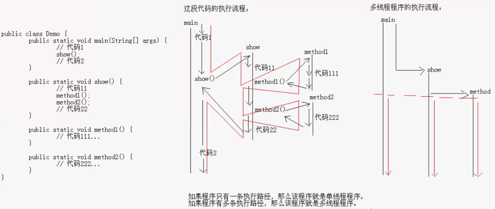
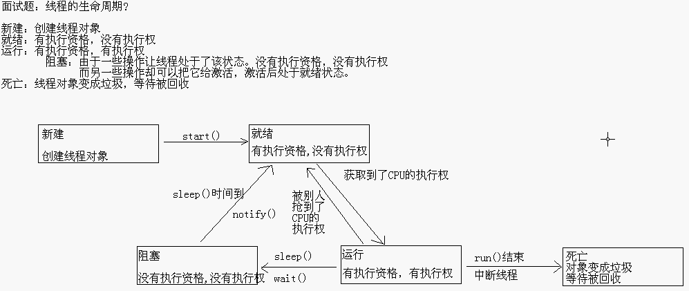
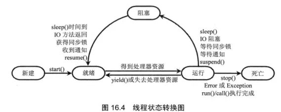
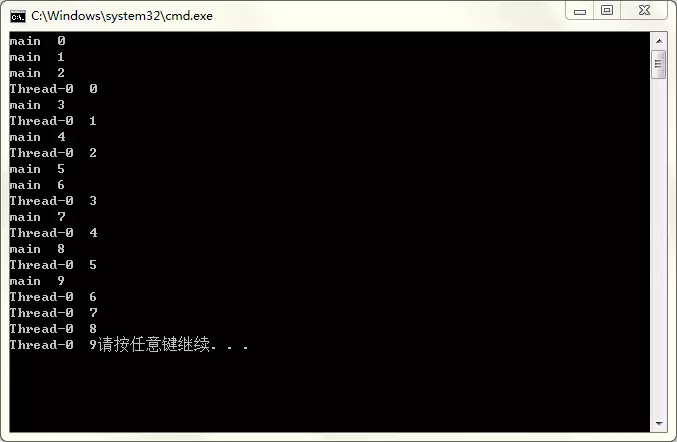
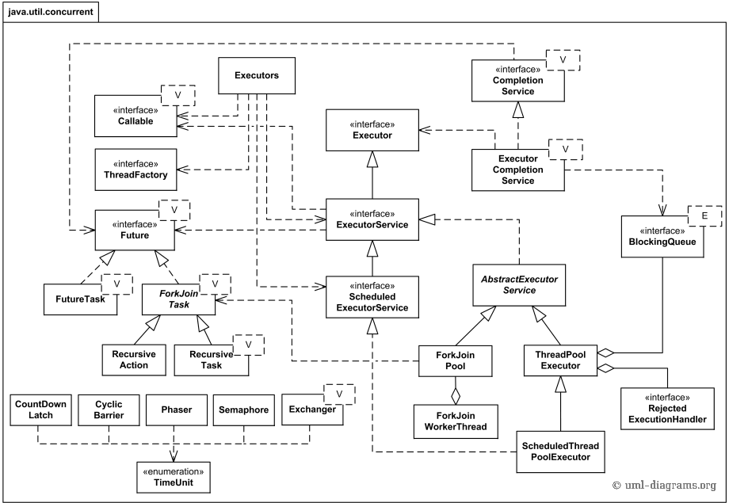
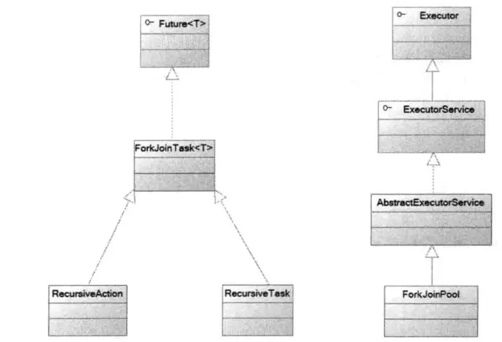
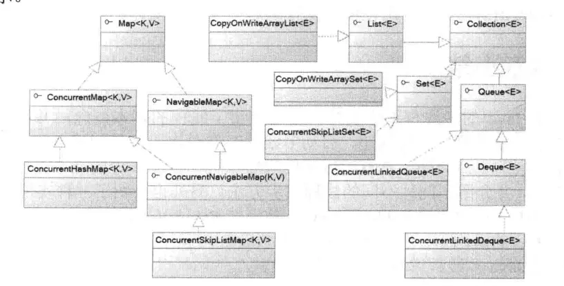

# 多线程

## 多线程引入



### 进程与线程

**进程**

正在运行的程序，是系统进行资源分配和调用的独立单位

每一个进程都有它自己的内存空间和系统资源

通过任务管理器我们就看到了进程的存在

所有运行中的任务通常对应一个进程,当一个程序进入内存运行时,即变成一个进程.进程是处于运行过程中的程序,并且具有一定独立的功能,进程是系统进行资源分配和调度的一个独立单位.

进程是指一个内存中运行的应用程序，每个进程都有自己独立的一块内存空间，即进程空间或（虚空间）。进程不依赖于线程而独立存在，一个进程中可以启动多个线程。比如在Windows系统中，一个运行的exe就是一个进程。

进程的特性:  **独立性**  、**动态性**   

**并发性**:多个进程可以在单个处理器上并发执行,多个进程之间不会相互影响.

**并发**和**并行**的区别

**并行(parellel)**指的是在同一时刻,有多条指令在多个处理器上同时被执行;

**并发**指的是在同一时刻只能有一条指令执行,但多个进程指令被快速轮换执行,使得宏观上具有多个进程同时执行的结果.

**线程**

线程是指进程中的一个执行流程，一个进程中可以运行多个线程。比如java.exe进程中可以运行很多线程。线程总是属于某个进程，线程没有自己的虚拟地址空间，与进程内的其他线程一起共享分配给该进程的所有资源。

是进程中的单个顺序控制流，是一条执行路径

一个进程如果只有一条执行路径，则称为单线程程序

一个进程如果由多条执行路径，则称为多线程程序

**总结**

进程在执行过程中拥有独立的内存单元，进程有独立的地址空间，而多个线程共享内存，从而极大地提高了程序的运行效率。

线程在执行过程中与进程还是有区别的。每个独立的线程有一个程序运行的入口、顺序执行序列和程序的出口。但是线程不能够独立执行，必须依存在应用程序中，由应用程序提供多个线程执行控制。

进程是具有一定独立功能的程序关于某个数据集合上的一次运行活动，进程是系统进行资源分配和调度的一个独立单位。

线程是进程的一个实体，是CPU调度和分派的基本单位，它是比进程更小的能独立运行的基本单位。线程自己基本上不拥有系统资源，只拥有一点在运行中必不可少的资源（如程序计数器,一组寄存器和栈），但是它可与同属一个进程的其他的线程共享进程所拥有的全部资源。

线程有自己的堆栈和局部变量，但线程之间没有单独的地址空间，一个线程包含以下内容：

* 一个指向当前被执行指令的指令指针；
* 一个栈；
* 一个寄存器值的集合，定义了一部分描述正在执行线程的处理器状态的值
* 一个私有的数据区。

我们使用Join()方法挂起当前线程，直到调用Join()方法的线程执行完毕。该方法还存在包含参数的重载版本，其中的参数用于指定等待线程结束的最长时间（即超时）所花费的毫秒数。如果线程中的工作在规定的超时时段内结束，该版本的Join()方法将返回一个布尔量True。

简而言之：

一个程序至少有一个进程，一个进程至少有一个线程。
线程的划分尺度小于进程，使得多进程程序的并发性高。
另外，进程在执行过程中拥有独立的内存单元，而多个线程共享内存，从而极大地提高了程序的运行效率。
线程在执行过程中与进程还是有区别的。每个独立的线程有一个程序运行的入口、顺序执行序列和程序的出口。但是线程不能够独立执行，必须依存在应用程序中，由应用程序提供多个线程执行控制。
从逻辑角度来看，多线程的意义在于一个应用程序中，有多个执行部分可以同时执行。但操作系统并没有将多个线程看做多个独立的应用，来实现进程的调度和管理以及资源分配。这就是进程和线程的重要区别。

在Java中，每次程序运行至少启动2个线程：一个是main线程，一个是垃圾收集线程。因为每当使用java命令执行一个类的时候，实际上都会启动一个JVM，每一个JVM实际上就是在操作系统中启动了一个进程。

## 多线程概念

多线程扩展了多进程的概念,使得同一进程可以同时并发处理多个任务.线程也被称为轻量级进程,线程时进程的执行单元.线程在程序中是独立的并发的执行流.当进程被初始化之后,主线程就被创建了.

线程是进程的组成部分,一个进程可以有多个线程,但一个线程必须有一个父进程.线程可以拥有自己的栈,自己的程序计数器和自己的局部变量,但不拥有系统资源,它与父进程的其他线程共享该进程所拥有的全部资源.因为多个线程共享父进程的所有资源,因此编程比较方便,但必须更加小心,需要**确保线程不会妨碍到同一进程里的其他线程**.

**线程是独立运行的,它并不知道进程中是否还有其他的线程存在**.线程的执行是抢占式的:当前运行的线程在任何时候都可能被挂起,以便另一个线程可以运行.

一个线程可以创建和撤销另一个线程,同一个进程中的多个线程之间可以并发执行.

从逻辑角度来看,多线程存在于一个应用程序中,让一个应用程序可以有多个执行部分同时进行,但操作系统无须将多个线程看做多个独立的应用,对多线程实现调度和管理以及资源分配.线程的调度和管理由进程本身负责完成.

总结:

1. **操作系统可以同时执行多个任务,每个任务就是进程**;
2. **进程可以同时执行多个任务,每个任务就是线程**.

多线程的优势

1. **进程**之间不能共享内存,但**线程之间共享内存很容易**
2. 系统创建进程需要为该进程重新分配系统资源,但创建线程则代价小得多,因此使用多线程来实现多任务并发比多进程的效率高.
3. Java语言内置了多线程功能支持,而不是单纯地作为底层操作系统的调度方式,从而简化了Java的多线程编程.

多线程的应用是很广泛的,比如一个浏览器必须能同时下载多个图片,一个web服务器必须能同时响应多个用户请求;Java虚拟机本身就在后台提供了一个超级线程来进行垃圾回收.....

## Java程序运行原理

Java命令会启动Java虚拟机，启动JVM，等于启动了一个应用程序，也就是启动了一个进程，该进程会自动启动一个“主线程”，然后主线程去调用某个类的main方法，所以main方法运行在主线程中，在此之前的所有程序都是单线程的。

**JVM虚拟机的启动是单线程的还是多线程的？**

多线程的，原因是垃圾回收线程也要先启动，否则很容易出现内存溢出。现在的垃圾回收线程加上前面的主线程，最低启动了两个线程，所以jvm的启动是多线程的

**实现多线程的程序**

由于线程是依赖进程而存在的，所以我们应该先创建一个进程出来，而进程是由系统创建的，所以我们应该去调用系统功能创建一个进程。

Java是不能直接调用系统功能的，所以我们没有办法直接实现多线程程序，但是，Java可以去调用C/C++写好的程序来实现多线程程序，由C/C++去调用系统功能创建进程，然后由Java去调用这样的东西，然后提供一些类供我们使用，我们就可以实现多线程程序了。

## Java中的线程

在Java中，“线程”指两件不同的事情：

1. java.lang.Thread类的一个实例；
2. 线程的执行。

在 Java程序中，有两种方法创建线程：

一是对 Thread 类进行派生并覆盖 run方法；

二是通过实现Runnable接口创建。

使用java.lang.Thread类或者java.lang.Runnable接口编写代码来定义、实例化和启动新线程。

一个Thread类实例只是一个对象，像Java中的任何其他对象一样，具有变量和方法，生死于堆上。

Java中，每个线程都有一个调用栈，即使不在程序中创建任何新的线程，线程也在后台运行着。

一个Java应用总是从main()方法开始运行，main()方法运行在一个线程内，他被称为主线程。

 一旦创建一个新的线程，就产生一个新的调用栈。

线程总体分两类：用户线程和守候线程。

当所有用户线程执行完毕的时候，JVM自动关闭。但是守候线程却不独立于JVM，守候线程一般是由操作系统或者用户自己创建的。

## Java线程：创建与启动

### 定义线程

1. 扩展java.lang.Thread类。

通过继承Thread类创建线程类的具体步骤和具体代码如下：

   • 定义一个继承Thread类的子类，并重写该类的run()方法；

   • 创建Thread子类的实例，即创建了线程对象；

   • 调用该线程对象的start()方法启动线程。

```java
class SomeThead extends Thraad   { 
    public void run()   { 
     //do something here  
    }  
 } 
 
public static void main(String[] args){
 SomeThread oneThread = new SomeThread();   
  步骤3：启动线程：   
 oneThread.start(); 
}
```

2. 实现java.lang.Runnable接口。

通过实现Runnable接口创建线程类的具体步骤和具体代码如下：

   • 定义Runnable接口的实现类，并重写该接口的run()方法；

   • 创建Runnable实现类的实例，并以此实例作为Thread的target对象，即该Thread对象才是真正的线程对象。

```java
class SomeRunnable implements Runnable   { 
  public void run()   { 
  //do something here  
  }  
} 
Runnable oneRunnable = new SomeRunnable();   
Thread oneThread = new Thread(oneRunnable);   
oneThread.start(); 
```

通过实现Runnable接口创建多线程时,Thread类的作用就是把run()方法包装成线程执行体.

可以看到**两个子线程的i变量是连续的**这是因为采用Runnable接口的方式创建的多个线程可以共享线程类的实例变量.是因为:程序创建的Runnable对象只是线程的target,而多个线程可以共享一个target,所以多个线程可以共享一个线程类(实际上应该是线程的target类)的实例变量.

3. 通过Callable和Future创建线程

通过Callable和Future创建线程的具体步骤和具体代码如下：

   • 创建Callable接口的实现类，并实现call()方法，该call()方法将作为线程执行体，并且有返回值。
   • 创建Callable实现类的实例，使用FutureTask类来包装Callable对象，该FutureTask对象封装了该Callable对象的call()方法的返回值。
   • 使用FutureTask对象作为Thread对象的target创建并启动新线程。
   • 调用FutureTask对象的get()方法来获得子线程执行结束后的返回值其中，Callable接口(也只有一个方法)定义如下： 

```java
public interface Callable   { 
  V call() throws Exception;  
 } 
/*
  步骤1：创建实现Callable接口的类SomeCallable(略);   
  步骤2：创建一个类对象： 
      Callable oneCallable = new SomeCallable(); 
  步骤3：由Callable创建一个FutureTask对象：   
    FutureTask oneTask = new FutureTask(oneCallable); 
  注释： FutureTask是一个包装器，它通过接受Callable来创建，它同时实现了 Future和Runnable接口。 
  步骤4：由FutureTask创建一个Thread对象：   
    Thread oneThread = new Thread(oneTask);   
  步骤5：启动线程：  
    oneThread.start(); 
*/
```

从Java5开始,Java提供了Callable接口,该接口可以理解为是Runnable接口的增强版,Callable接口提供了一个call()方法可以作为线程执行体,但call()方法比run()方法功能更强大,call()方法可以有返回值.call()方法可以声明抛出的异常.

但是Callable接口并不是Runnable接口的子接口,所以Callable对象不能直接作为Thread的target.而且call()方法还有一个返回值,call()方法并不是直接调用的,它是作为线程执行体被调用的.好在Java提供了Future接口来代表Callable接口里的Call()方法的返回值,并为Future接口提供了一个FutureTask实现类,该实现类既实现了Future接口,并实现了Runnable接口----可以作为Thread类的target.

在Future接口里定义了几个公共方法来控制它关联的Callable任务.

Callable接口有泛型限制,并且Callable接口里的泛型形参类型与call()方法返回值类型相同.而且Callable接口是函数式接口,可以用Lambda表达式创建Callable对象

创建并启动具有返回值的线程的步骤如下:

1. 创建Callable接口的实现类,并实现call()方法,该call()方法将作为线程执行体,且该call()方法有返回值,再创建Callable实现类的实例.
2. 使用FutureTask类来包装Callable对象,该FutureTask对象封装了该Callable对象的call()方法的返回值
3. 使用FutureTask对象作为Thread对象的target创建并启动新线程
4. 调用FutureTask对象的get()方法来获得子线程执行结束后的返回值.

### 获取和设置线程名称

**获取线程对象的名称**

```java
public final String getName();//获取线程的名称
```

注：当实现Runnable接口时，获取线程应该是**Thread.currentThread()**

```java
public static Thread currentThread();//返回当前正在执行的线程对象
```

**设置线程对象的名称**

```java
public final void setName(String name);//设置线程名称 
```

**常见问题**

1. 线程的名字，一个运行中的线程总是有名字的，名字有两个来源，一个是虚拟机自己给的名字，一个是你自己的定的名字。在没有指定线程名字的情况下，虚拟机总会为线程指定名字，并且主线程的名字总是mian，非主线程的名字不确定。
2. 线程都可以设置名字，也可以获取线程的名字，连主线程也不例外。
3. 获取当前线程的对象的方法是：Thread.currentThread()；
4. 在上面的代码中，只能保证：每个线程都将启动，每个线程都将运行直到完成。一系列线程以某种顺序启动并不意味着将按该顺序执行。对于任何一组启动的线程来说，调度程序不能保证其执行次序，持续时间也无法保证。
5. 当线程目标run()方法结束时该线程完成。
6. 一旦线程启动，它就永远不能再重新启动。只有一个新的线程可以被启动，并且只能一次。一个可运行的线程或死线程可以被重新启动。
7. 线程的调度是JVM的一部分，在一个CPU的机器上上，实际上一次只能运行一个线程。一次只有一个线程栈执行。JVM线程调度程序决定实际运行哪个处于可运行状态的线程。
8. 众多可运行线程中的某一个会被选中做为当前线程。可运行线程被选择运行的顺序是没有保障的。
9. 尽管通常采用队列形式，但这是没有保障的。队列形式是指当一个线程完成“一轮”时，它移到可运行队列的尾部等待，直到它最终排队到该队列的前端为止，它才能被再次选中。事实上，我们把它称为可运行池而不是一个可运行队列，目的是帮助认识线程并不都是以某种有保障的顺序排列而成一个一个队列的事实。
10. 尽管我们没有无法控制线程调度程序，但可以通过别的方式来影响线程调度的方式。

### 创建线程的三种方式对比

采用实现Runnable,Callable接口的方式创建多线程的优缺点:

1. 线程类只是实现了Runnable接口或Callable接口,还可以继承其他类
2. 多个线程可以共享同一个target对象,非常适合多个相同线程来处理同一份资源的情况,较好的体现了面向对象的思想
3. 需要访问当前线程,则必须使用Thread.currentThread()方法

采用继承Thread类的方式创建多线程的优缺点:

1. 因为该线程已经继承了Thread类,所以不能在继承其他父类
2. 编写简单,如果需要访问当前线程,则无需使用Thread.currentThread()方法,直接使用this即可获得当前线程.

### run()和start()

run()：仅仅是封装被线程执行的代码，直接调用时普通方法

start()：首先启动了线程，然后再由jvm去调用该线程的run()方法

注意:**启动线程使用的是start()方法,而不是run()方法!永远都不要调用线程对象的run()方法!!!**调用start()方法来启动线程,系统会把该run()方法当成线程来处理;如果直接调用线程对象的run()方法,系统会把线程对象当做普通对象来处理,而run()方法也是一个普通方法,而不是线程执行体.

## 线程的生命周期



### 1. 新建状态

​       用new关键字和Thread类或其子类建立一个线程对象后，该线程对象就处于新生状态。处于新生状态的线程有自己的内存空间，通过调用start方法进入就绪状态（runnable）。

注意：不能对已经启动的线程再次调用start()方法，否则会出现[Java](http://lib.csdn.net/base/17).lang.IllegalThreadStateException异常。

### 2. 就绪状态

​       处于就绪状态的线程已经具备了运行条件，但还没有分配到CPU，处于线程就绪队列（尽管是采用队列形式，事实上，把它称为可运行池而不是可运行队列。因为cpu的调度不一定是按照先进先出的顺序来调度的），等待系统为其分配CPU。等待状态并不是执行状态，当系统选定一个等待执行的Thread对象后，它就会从等待执行状态进入执行状态，系统挑选的动作称之为“cpu调度”。一旦获得CPU，线程就进入运行状态并自动调用自己的run方法。

提示：如果希望子线程调用start()方法后立即执行，可以使用Thread.sleep()方式使主线程睡眠一伙儿，转去执行子线程。

### 3. 运行状态

​      处于运行状态的线程最为复杂，它可以变为阻塞状态、就绪状态和死亡状态。****

处于就绪状态的线程，如果获得了cpu的调度，就会从就绪状态变为运行状态，执行run()方法中的任务。如果该线程失去了cpu资源，就会又从运行状态变为就绪状态。重新等待系统分配资源。也可以对在运行状态的线程调用yield()方法，它就会让出cpu资源，再次变为就绪状态。

注： 当发生如下情况是，线程会从运行状态变为阻塞状态：

1. 线程调用sleep方法主动放弃所占用的系统资源
2. 线程调用一个阻塞式IO方法，在该方法返回之前，该线程被阻塞
3. 线程试图获得一个同步监视器，但更改同步监视器正被其他线程所持有
4. 线程在等待某个通知（notify）
5. 程序调用了线程的suspend方法将线程挂起。不过该方法容易导致死锁，所以程序应该尽量避免使用该方法。

当线程的run()方法执行完，或者被强制性地终止，例如出现异常，或者调用了stop()、desyory()方法等等，就会从运行状态转变为死亡状态。

### 4. 阻塞状态

1. 线程调用sleep()方法主动放弃所占用的处理器资源
2. 线程调用了一个堵塞式IO方法,在该方法返回之前,该线程被堵塞
3. 线程试图获得一个同步监视器,但该同步监视器正被其他线程所持有
4. 线程在等待某个通知(notify)
5. 线程调用了线程的suspend()方法将该线程挂起,这个方法容易引起死锁(要尽量避免!!!)**已过时。***该方法已经遭到反对，因为它具有固有的死锁倾向。如果目标线程挂起时在保护关键系统资源的监视器上保持有锁，则在目标线程重新开始以前任何线程都不能访问该资源。如果重新开始目标线程的线程想在调用resume之前锁定该监视器，则会发生死锁。这类死锁通常会证明自己是“冻结”的进程。*

如果当前线程被堵塞之后,其他线程就可以获得执行的机会,被堵塞的线程会在合适的时候重新进入**就绪状态**,注意是**就绪状态而不是运行状态**.被堵塞线程的堵塞解除后,必须重新等待线程调度器再次调用它.

**解除上面的堵塞**

1. 调用sleep()方法的线程经过了指定的时间
2. 线程调用的堵塞式IO方法已经返回
3. 线程成功地获得了试图取得的同步监视器
4. 线程正在等待某个通知时,其他线程发出了一条通知
5. 处于挂起状态的线程被调用了resume()恢复方法



线程状态转换图

不难看出,**线程从堵塞状态进入就绪状态,无法直接进入运行状态**.而就绪和运行状态之间的转换通常不受程序控制,而是由系统线程调度所决定,当处于就绪状态的线程获取到CPU的资源时,该线程进入运行状态;当处于运行状态的线程失去处理器资源时,该线程进入就绪状态.  有一个方法例外:可以**调用yield()方法可以让运行状态的线程转入就绪状态**.

### 5. 死亡状态

线程会以下列三种方式结束,结束后就处于死亡状态

1. run()或call()方法执行完成,线程正常结束
2. 线程抛出一个未捕获的Exception或Error
3. 直接调用该线程的stop()方法来结束该线程-----该方法容易引起死锁(不推荐!!!)

当主线程结束时,其他线程不受任何影响,并不会随之结束.一旦子线程启动起来,它就拥有和主线程相同的地位,它不会受主线程的影响

为了测试某个线程是否已经死亡,可以调用该对象的isAlive()方法,当线程处于**就绪**,**运行**,**堵塞**三种状态时,该方法返回true,当线程处于**新建**和**死亡**两种状态时,该方法将返回false

**不要对一个已经死亡的线程再调用start()方法来让它重新启动**,死亡就是死亡,该线程将不可再次作为线程执行.**如果依然对一个已经死亡的线程再次调用start()方法来启动该线程,将会引发IllegalThreadStateException异常**,这表明处于死亡状态的线程已经无法再次运行了.

## 线程管理/控制线程

### 线程的调度及获取和设置线程优先级

假如我们计算机只有一个cpu，那么cpu在某一个时刻只能执行一条指令，线程只有得到cpu时间片，也就是使用权，才可以执行指令，那么java是如何对线程进行调用的呢？

线程有两种调度模型：

时间调度模型和抢占式调度模型

时间调度模型：所有线程轮流使用cpu使用权，平均分配每个线程占用cpu的时间片

**抢占式调度和协作式调度策略**

**抢占式调度**:线代桌面和服务器操作系统一般采取抢占式调度策略,系统会给每个可执行的线程一个小时间段来处理任务;当该时间段用完后,系统就会剥夺该线程所占用的资源,让其他线程获得执行的机会.在选择下一个进程的时候,系统会考虑线程的优先级

**协作式调度**:小型设备如手机则采取协作式调度策略,只有当一个线程调用了它的sleep()或yeid()方法后才会放弃所占用的资源-----即必须由该线程主动放弃所占用的资源

Java使用的是抢占式调度模型

#### 设置和获取线程优先级

每个线程默认的优先级都与创建它的父线程具有相同的优先级，在默认情况下，main线程具有普通优先级。

Thread类提供了setPriority(int newPriority)和getPriority()方法来设置和返回一个指定线程的优先级，其中setPriority方法的参数是一个整数，范围是1~·0之间，也可以使用Thread类提供的三个静态常量：

```java
MAX_PRIORITY   =10
MIN_PRIORITY   =1
NORM_PRIORITY   =5
```

```java
public final int getPriority();//返回线程对象的优先级
public final void setPriority(int newPriority);//更改线程的优先级
```

注意：

线程默认的优先级是5

线程优先级范围是：1-10

线程优先级高仅仅表示线程获取的CPU时间片几率高，但是在次数比较多，或者多次运行的时候才能看到比较好的效果

虽然Java提供了10个优先级别，但这些优先级别需要操作系统的支持。不同的操作系统的优先级并不相同，而且也不能很好的和Java的10个优先级别对应。所以我们应该使用MAX_PRIORITY、MIN_PRIORITY和NORM_PRIORITY三个静态常量来设定优先级，这样才能保证程序最好的可移植性。

### 线程睡眠--sleep

如果需要**让当前正在执行的线程暂停一段时间,并进入堵塞状态,则可以通过调用Thread类的静态sleep()方法来实现**.

sleep()方法有两种重载形式:

1.static void sleep(long millis):让当前正在执行的线程暂停millis毫秒,并进入堵塞状态

2.static void sleep(long millis,intnanos):让当前正在执行的线程暂停millis毫秒加nanos毫微秒,并进入堵塞状态(很少用)

当**当前线程**调用sleep()方法进入堵塞状态后,在其睡眠时间段内,该线程不会获得执行的机会,即使系统中没有其他可执行的线程,处于sleep()中的线程也不会执行,因此sleep()方法常用来**暂停程序的执行**.

```java
public class Test1 {  
    public static void main(String[] args) throws InterruptedException {  
        System.out.println(Thread.currentThread().getName());  
        MyThread myThread=new MyThread();  
        myThread.start();  
        myThread.sleep(1000);//这里sleep的就是main线程，而非myThread线程  
        Thread.sleep(10);  
        for(int i=0;i<100;i++){  
            System.out.println("main"+i);  
        }  
    }  
} 
```

### 线程让步--yield

yeid()方法也是Thread类提供的一个静态方法,**它也可以让当前正在执行的线程暂停,但它不会阻塞该线程,它只是让该线程转入就绪状态**.**yield()只是让当前线程暂停一下,让系统的线程调度器重新调度一次**.完全可能的情况是:当某个线程调用了yield()方法暂停之后,线程调度器又将其调度出来重新执行.

当某个线程调用了yield()方法暂停之后,只有优先级与当前线程相同,或者**优先级比当前线程更高**的**处于就绪状态**的线程才会获得执行的机会.

```java
public class Test1 {  
    public static void main(String[] args) throws InterruptedException {  
        new MyThread("低级", 1).start();  
        new MyThread("中级", 5).start();  
        new MyThread("高级", 10).start();  
    }  
}  
  
class MyThread extends Thread {  
    public MyThread(String name, int pro) {  
        super(name);// 设置线程的名称  
        this.setPriority(pro);// 设置优先级  
    }  
  
    @Override  
    public void run() {  
        for (int i = 0; i < 30; i++) {  
            System.out.println(this.getName() + "线程第" + i + "次执行！");  
            if (i % 5 == 0)  
                Thread.yield();  
        }  
    }  
} 
```

**sleep()和yield()方法的区别**

1.sleep()方法暂停当前线程后,会给其他线程机会,不会理会其他线程的优先级:但yield()方法只会给优先级相同,或优先级更高的线程执行机会

2.sleep()方法会使线程进入堵塞状态,知道经过堵塞时间才会转入就绪状态;而yield()不会将线程转入堵塞状态,它只是强调当前线程进入就绪状态.因此完全有可能某个线程调用yield()方法暂停之后,立即重新获得处理器资源而被执行

3.sleep()方法声明抛出了InterruptedException异常,所以调用sleep()方法时要么捕捉该异常,要么显式声明抛出该异常;而yield()方法则没有声明抛出任何异常

4.sleep()方法比yield()方法有更好的移植性,通常不建议用yield()方法来控制并发线程的执行.

### 线程加入--join

Thread提供了让一个线程等待另一个线程完成的方法-------join()方法.当某个执行流中调用其他线程的join()方法时,调用线程将被堵塞,**直到被join()方法加入的join线程执行完为止**.

比如下面程序中的mian线程即主线程,主线程中调用了其他线程(jt线程)的join()方法,此时调用线程(main线程)将被堵塞,直到被join()方法加入的join线程执行完毕为止.

join()方法通常由**使用线程的程序调用**,**目的**是:将大问题划分为许多小问题,每个小问题分配一个线程.当所有的小问题都得到解决处理后,再调用主线程来进一步操作.

```java
public class JoinThread extends Thread{
  // 提供一个有参数的构造器，用于设置该线程的名字
  public JoinThread(String name){
    super(name);
   }
  // 重写run()方法，定义线程执行体
  public void run(){
    for(inti =0; i <100; i++ ){
      System.out.println(getName() +"  "+ i);
        }
  }
public static void main(String[] args) throws Exception{
  // 启动子线程
  newJoinThread("新线程").start();
  for(inti =0; i <100; i++ ){
    if(i ==20) {      
      JoinThread jt =new JoinThread("被Join的线程");
      jt.start();
      // main线程调用了jt线程的join()方法，main线程
      // 必须等jt执行结束才会向下执行
      jt.join();   
    }   
    System.out.println(Thread.currentThread().getName()+"  "+ i);        
  }
}
}
```


上述代码中main线程中调用了jt线程的join()方法,main线程必须要等jt线程执行完毕之后才会向下执行

join()方法有如下三种重载的方法:

1. join():等待被join的线程执行完成.
2. join(long millis):等待被join的线程的时间最长为millis毫秒.
3. join(long millis,int nanos):等待被join的线程的事件最长为millis毫秒加nanos毫微秒(这个方法很少用!!!)

### 后台(守护)线程

有一种线程,它是在后台运行的,它的任务是为其他的线程提供服务的,这种线程称为后台线程(Daemon Thread).JVM的垃圾回收线程就是典型的后台线程.

后台线程的特征:**如果所有的前台线程都死亡,后台线程自动死亡**.

调用Thread对象的setDaemon(true)方法可将指定线程设置成后台线程.

守护线程使用的情况较少，但并非无用，举例来说，JVM的垃圾回收、内存管理等线程都是守护线程。还有就是在做数据库应用时候，使用的数据库连接池，连接池本身也包含着很多后台线程，监控连接个数、超时时间、状态等等。调用线程对象的方法setDaemon(true)，则可以将其设置为守护线程。

守护线程的用途为：

​     • 守护线程通常用于执行一些后台作业，例如在你的应用程序运行时播放背景音乐，在文字编辑器里做自动语法检查、自动保存等功能。

​     • Java的垃圾回收也是一个守护线程。守护线的好处就是你不需要关心它的结束问题。例如你在你的应用程序运行的时候希望播放背景音乐，如果将这个播放背景音乐的线程设定为非守护线程，那么在用户请求退出的时候，不仅要退出主线程，还要通知播放背景音乐的线程退出；如果设定为守护线程则不需要了。

setDaemon方法的详细说明：

```java
public final void setDaemon(boolean on);
//将该线程标记为守护线程或用户线程。当正在运行的线程都是守护线程时，Java 虚拟机退出。    
//该方法必须在启动线程前调用。 该方法首先调用该线程的 checkAccess 方法，且不带任何参数。这可能抛出 SecurityException（在当前线程中）。   
//参数：
// on - 如果为 true，则将该线程标记为守护线程。    
// 抛出：    
//IllegalThreadStateException - 如果该线程处于活动状态。    
//SecurityException - 如果当前线程无法修改该线程。
```

**注：**JRE判断程序是否执行结束的标准是所有的前台执线程行完毕了，而不管后台线程的状态，因此，在使用后台线程时候一定要注意这个问题。

```java
public class DaemonThread extends Thread{
  // 定义后台线程的线程执行体与普通线程没有任何区别
  public void run(){
      for(int i =0; i <1000; i++ ){
            System.out.println(getName() +"  "+ i);
       }
    }
  public static void main(String[] args){
    DaemonThread t =new DaemonThread();
    // 将此线程设置成后台线程
    t.setDaemon(true);
    // 启动后台线程
    t.start();
    for(int i =0; i <10; i++ ){
      System.out.println(Thread.currentThread().getName()  +"  "+ i); 
    }
// -----程序执行到此处，前台线程（main线程）结束------
// 后台线程也应该随之结束
  }
}
```



本来该线程应该执行到i=999才会结束,但运行程序时不难发现该后台线程无法运行到999,因为当主线程也就是程序中唯一的前台线程运行结束后,JVM会主动退出,因而后台线程也就被结束了.

Thread类还提供了一个isDaemon()方法来判断当前线程是否为后台线程.

上面程序中:主线程默认是前台线程,t线程默认是后台线程.并不是所有的线程默认都是前台线程,有些线程默认就是后台线程-----------**前台线程创建的子线程默认是前台线程,后台线程创建的子线程默认是后台线程**.

前台线程死亡之后,JVM会通知后台线程死亡,**但从它接收到指令到做出相应,需要一定时间**(这也是为什么上图中:在main线程死亡之后Thread-0还进行了一会才死亡的原因).而且将某个线程设置为后台线程,必须要在该线程启动之前设置,即setDaemon(true)必须在start()方法之前调用,否则会引发IllegalThreadStateException异常

### 正确结束线程

Thread.stop()、Thread.suspend、Thread.resume、Runtime.runFinalizersOnExit这些终止线程运行的方法已经被废弃了，使用它们是极端不安全的！想要安全有效的结束一个线程，可以使用下面的方法：

​    • 正常执行完run方法，然后结束掉；

​    • 控制循环条件和判断条件的标识符来结束掉线程。

```java
class MyThread extends Thread {  
    int i=0;  
    boolean next=true;  
    @Override  
    public void run() {  
        while (next) {  
            if(i==10)  
                next=false;  
            i++;  
            System.out.println(i);  
        }  
    }  
}
```

## 线程同步

由系统的线程调度具有一定的随机性造成的,不过即使程序偶然出现问题,那也是由于编程不当引起的.当多个线程来访问同一个数据时,很容易"偶然"出现安全性问题.

java允许多线程并发控制，当多个线程同时操作一个可共享的资源变量时（如数据的增删改查），将会导致数据不准确，相互之间产生冲突，因此加入同步锁以避免在该线程没有完成操作之前，被其他线程的调用，从而保证了该变量的唯一性和准确性。

### 同步代码块

因为run()方法的方法体不具有同步安全性------程序中有两个并发线程在同一个对象;而且系统恰好在一个方法内执行线程切换,切换给另一个修改对象的线程,所以就出现了问题.就跟以前讲的文件并发访问,当有两个进程并发修改同一个文件时就有可能造成异常.

为了解决上述问题,Java引入了同步监视器来解决这个问题,使用同步监视器的通用方法就是同步代码块

**synchronized**

```java
synchronized(obj){//括号里的obj就是同步监视器
  ......//此处的代码就是同步代码块
}
```

上述代码的含义是:在线程开始执行同步代码块之前,必须先获得对同步监视器的锁定.

**任何时刻只能有一个线程可以获得同步监视器的锁定,当同步代码块执行完成之后,该线程会释放该同步监视器的锁定**.

同步监视器的目的:**阻止两个线程对同一个共享资源进行并发访问**,推介使用**可能被并发访问的共享资源充当同步监视器**

```java
public class DrawThread extends Thread{// 模拟用户账户privateAccount account;
  // 当前取钱线程所希望取的钱数
  private double drawAmount;
  public DrawThread(String name , Account account,double drawAmount{
    super(name);
    this.account = account;
    this.drawAmount = drawAmount;    
  }
// 当多条线程修改同一个共享数据时，将涉及数据安全问题。
  public void run(){
// 使用account作为同步监视器，任何线程进入下面同步代码块之前，
// 必须先获得对account账户的锁定——其他线程无法获得锁，也就无法修改它
// 这种做法符合：“加锁 → 修改 → 释放锁”的逻辑
    synchronized(account){
      // 账户余额大于取钱数目
      if(account.getBalance() >= drawAmount){
        // 吐出钞票System.out.println(getName() +"取钱成功！吐出钞票:"+drawAmount);
        try{
          Thread.sleep(1);
        }catch(InterruptedException ex){
          ex.printStackTrace();
        }
// 修改余额
        account.setBalance(account.getBalance() - drawAmount);               
        System.out.println("\t余额为: "+ account.getBalance());
          }else{
        System.out.println(getName() +"取钱失败！余额不足！");
      }
    }
    // 同步代码块结束，该线程释放同步锁
  }
}
```

这种做法符合"加锁---修改---释放锁"的逻辑,任何线程在修改指定资源之前,首先对该资源加锁,在加锁期间其他线程无法修改该资源,当线程修改完成后,该线程释放对该资源的锁定.

通过这种方式可以**保证并发线程在同一时刻只有一个线程可以进入修改共享资源的代码区**(也被称为临界区),所以**同一时刻最多只有一个线程处于临界区内,从而保证了线程的安全性**.

### 同步方法

Java多线程还提供了同步方法来和同步代码块相对应,使用synchronized字来修饰某个方法,该方法称为同步方法.对于synchronized关键字修饰的实例方法,无须显式指定同步监视器,同步方法的同步监视器是this,也就是调用该方法的对象.

通过同步方法可以非常方便的实现线程安全的类,线程安全的类具有如下特征:

1.该类的对象可以被多个线程安全地访问

2.每个线程调用该对象的任意方法之后都能得到正确结果

3.每个线程调用该对象的任意方法之后,该对象状态依然保持合理的状态

不可变类总是线程安全的,因为它的对象时不可变的;但**可变对象需要额外的方法来保证其线程安全**.

由于java的每个对象都有一个内置锁，当用此关键字修饰方法时，内置锁会保护整个方法。在调用该方法前，需要获得内置锁，否则就处于阻塞状态。

```java
public class Account{
  // 封装账户编号、账户余额两个成员变量
  private String accountNo;
  private double balance;
  public Account(){}// 构造器
  public Account(String accountNo ,doublebalance){
    this.accountNo = accountNo;
    this.balance = balance;
  }
  // accountNo的setter和getter方法
  public void setAccountNo(String accountNo){
    this.accountNo = accountNo;
  }
  public String getAccountNo(){
    returnthis.accountNo;
  }
  // 因此账户余额不允许随便修改，所以只为balance提供getter方法，
  public double getBalance(){
    returnthis.balance;
  }
  // 提供一个线程安全draw()方法来完成取钱操作
  public synchronized voidd raw(double drawAmount){
    // 账户余额大于取钱数目
    if(balance >= drawAmount){
    // 吐出钞票
      System.out.println(Thread.currentThread().getName()+"取钱成功！吐出钞票:"+ drawAmount);
      try{
        Thread.sleep(1);
      }catch(InterruptedException ex){
        ex.printStackTrace();
      }
      // 修改余额
      balance -= drawAmount;
      System.out.println("\t余额为: "+ balance);
    }else{
      System.out.println(Thread.currentThread().getName() +"取钱失败！余额不足！");
        }
    }
  // 下面两个方法根据accountNo来重写hashCode()和equals()方法
  public int hashCode(){
    return accountNo.hashCode();
  }
  public boolean equals(Object obj){
    if(this== obj)return true;
    if(obj !=null&& obj.getClass() == Account.class){
      Account target =(Account)obj;
      return target.getAccountNo().equals(accountNo);
    }
    return false;
  }
}
```

增加了一个代表取钱的draw()方法,并使用synchronized关键字来修饰该方法,把该方法编程同步方法,该同步方法的同步监视器是this,对于同一个Account账户而言,任意时刻只能有一个线程获得对Account对象的锁定,然后进入draw()方法执行取钱操作-----这样也可以保证多个线程并发取钱的线程安全.

注意:**synvhronized关键字可以修饰方法,可以修饰代码块,但不能修饰构造器,成员变量等等**.

```java
public class DrawThread extends Thread{
  // 模拟用户账户
  private Account account;
  // 当前取钱线程所希望取的钱数
  private double drawAmount;
  public DrawThread(String name,Account account,doubledrawAmount){
    super(name);
    this.account = account;
    this.drawAmount = drawAmount;
  }
  // 当多条线程修改同一个共享数据时，将涉及数据安全问题。
  public void run(){
    // 直接调用account对象的draw方法来执行取钱
    // 同步方法的同步监视器是this，this代表调用draw()方法的对象。
    // 也就是说：线程进入draw()方法之前，必须先对account对象的加锁
    account.draw(drawAmount);    
  }
}
```

在上面的示例中,调用draw()方法的对象是account,多个线程并发修改同一份account之前,必须先对account对象加锁,这也符合"加锁---修改---释放锁"的逻辑

在上面的示例中,调用draw()方法的对象是account,多个线程并发修改同一份account之前,必须先对account对象加锁,这也符合"加锁---修改---释放锁"的逻辑

**面向对象中的一种流行的设计模式:**

DDD(领域驱动设计):这种方式认为每个类都应该是完备的领域对象,比如:Account代表用户账户,应该提供用户账户的相关方法;通过draw()方法来执行取钱操作(实际上还应该提供transfer()等方法来完成转账等操作),而不是直接将setBalance()方法暴露出来任人操作,这样才能保证Account对象的完整性和一致性.

**可变类的线程安全是以降低程序的运行效率作为代价的**.

1. 不要堆线程安全类的所有方法进行同步,只对那些会改变竞争资源(竞争资源也就是共享资源)的方法进行同步.
2. 可变类有两种运行环境:单线程环境和多线程环境,则应该为该可变类提供两种版本,即线程不安全版本和线程安全版本.在单线程环境中使用线程不安全版本以保证性能(StringBuilder);在多线程中使用线程安全的版本(StringBuffer)

**释放同步监视器的锁定**

程序无须显式释放对同步监视器的锁定,线程会在如下几种情况下释放对同步监视器的锁定

1. 当前线程的同步方法,同步代码块执行结束
2. 当前线程在同步代码块,同步方法中遇到break,return终止了代码块导致其异常结束
3. 当前线程在同步代码块,同步方法中出现了未处理的Error和Exception
4. 当前线程执行同步代码块和同步方法时,程序执行了同步监视器对象的wait()方法,当前线程暂停,并释放同步监视器

**下面出现的情况,线程不会释放同步监视器**

1. 当前线程在执行同步代码块,同步方法时,程序调用了Thread.sleep(),Thread.yield()方法来暂停当前线程的执行,当前线程并不会释放同步监视器
2. 线程在执行同步代码块时,其他线程调用了该线程的suspend()方法将该线程挂起,该线程不会释放同步监视器.程序应该尽量避免使用suspend()和resume()方法来控制线程.

### 使用特殊域变量(volatile)实现线程同步 

   • volatile关键字为域变量的访问提供了一种免锁机制；

   • 使用volatile修饰域相当于告诉虚拟机该域可能会被其他线程更新；

   • 因此每次使用该域就要重新计算，而不是使用寄存器中的值；

   • volatile不会提供任何原子操作，它也不能用来修饰final类型的变量。

> volatile关键字表示直接操内存池里的数据
>
> 不操作副本，直接操作原始空间
>
> 主要定义在属性上
>
> 无法描述同步处理，只是一种直接内存的处理，避免了副本的操作，而synchronize是实现同步的

    public class SynchronizedThread {
      class Bank {
    private volatile int account = 100;
    public int getAccount() {
      return account;
    }
    /**
    * 用同步方法实现
    * 
    * @param money
    */
    public synchronized void save(int money) {
      account += money;
    }
    /**
    * 用同步代码块实现
    * 
    * @param money
    */
    public void save1(int money) {
      synchronized (this) {
        account += money;
      }
    }
  }
  class NewThread implements Runnable {
    private Bank bank;
    public NewThread(Bank bank) {
      this.bank = bank;
    }
    @Override
    public void run() {
      for (int i = 0; i < 10; i++) {
        // bank.save1(10);
        bank.save(10);
        System.out.println(i + "账户余额为：" +bank.getAccount());
      }
    }
}
  /**
  * 建立线程，调用内部类
      */
        public void useThread() {
    Bank bank = new Bank();
    NewThread new_thread = new NewThread(bank);
    System.out.println("线程1");
    Thread thread1 = new Thread(new_thread);
    thread1.start();
    System.out.println("线程2");
    Thread thread2 = new Thread(new_thread);
    thread2.start();
  }

  public static void main(String[] args) {
    SynchronizedThread st = new SynchronizedThread();
    st.useThread();
  }
```

**注：**多线程中的非同步问题主要出现在对域的读写上，如果让域自身避免这个问题，则就不需要修改操作该域的方法。用final域，有锁保护的域和volatile域可以避免非同步的问题。

### 同步锁

通过显式定义同步锁对象来实现同步-----同步锁对象由Lock对象充当.(这是一种更为强大的线程同步机制)

Lock是控制多个线程对共享资源进行访问的工具,每次只能有一个线程对Lock对象加锁,程序开始访问共享资源之前首先要先获得Lock对象

某些锁可能允许对共享资源并发访问,如ReadWriteLock(读写锁);

Lock,ReadWriteLock是Java5提供的两个根接口,并为Lock提供了ReentrantLock(可重入锁)实现类,为ReadWriteLock提供了ReentrantReadWriteLock实现类

ReentrantReadWriteLock为读写提供了三种锁模式:Writing,ReadingOptimistic,Reading

在实现线程安全的控制中比较常用的是ReentrantLock(可重入锁).使用该Lock对象可以显式地释放锁,加锁.

在[Java](http://www.2cto.com/kf/ware/Java/)SE5.0中新增了一个java.util.concurrent包来支持同步。ReentrantLock类是可重入、互斥、实现了Lock接口的锁，它与使用synchronized方法和快具有相同的基本行为和语义，并且扩展了其能力。ReenreantLock类的常用方法有：    

​```java
 ReentrantLock();// 创建一个ReentrantLock实例         
 lock();//获得锁        
 unlock();//释放锁
```

**注：**ReentrantLock()还有一个可以创建公平锁的构造方法，但由于能大幅度降低程序运行效率，不推荐使用

```java
//只给出要修改的代码，其余代码与上同
class Bank {
  private int account = 100;
  //需要声明这个锁
  private Lock lock = new ReentrantLock();
  public int getAccount() {
    return account;
  }
  //这里不再需要synchronized 
  public void save(int money) {
    lock.lock();
    try{
      account += money;
    }finally{
      lock.unlock();
    }
  }
｝ 
```

```java
import java.util.concurrent.locks.*;

public class Account{
  // 定义锁对象
  private final ReentrantLock lock = new ReentrantLock();
  //.......
  // 提供一个线程安全draw()方法来完成取钱操作(定义一个保证线程安全的方法)
  public void draw(doubledrawAmount){
    // 加锁
    lock.lock();
    try{
      // 账户余额大于取钱数目
      if(balance >= drawAmount){
        // 吐出钞票
        System.out.println(Thread.currentThread().getName() +"取钱成功！吐出钞票:"+ drawAmount);
        try{
          Thread.sleep(1);
        }catch(InterruptedException ex){             
          ex.printStackTrace();
        }
        // 修改余额balance -= drawAmount;
        System.out.println("\t余额为: "+ balance);
      }else{
        System.out.println(Thread.currentThread().getName()  +"取钱失败！余额不足！");
      }
    }finally{
      // 修改完成，释放锁
      lock.unlock();
    }
  }
  // 下面两个方法根据accountNo来重写hashCode()和equals()方法
  public int hashCode(){
    return accountNo.hashCode();
  }
  public boolean equals(Object obj){
    if(this== obj) return true;
    if(obj !=null&& obj.getClass() == Account.class){
      Account target = (Account)obj;
      returntarget.getAccountNo().equals(accountNo);
    }
    return false;
  }
}
```


使用ReentrantLock对象来进行同步,加锁和释放锁出现在不同的作用范围内时,通常建议使用finally块来确保在必要时释放锁.

程序中实现draw()方法时,进入方法开始执行后立即请求对ReentrantLock对象进行加锁,当执行完draw()方法的取钱逻辑后,程序使用finally块确保释放锁.

使用Lock时是显式调用Lock对象作为同步锁,而使用同步方法时系统隐式地使用当前对象作为同步监视器,同样都符合"加锁---修改---释放锁"的操作模式,而且Lock对象时每个Lock对象都对应一个Account对象,一样可以保证对于同一个Account对象,同一时刻只能有一个线程能进入临界区

ReentrantLock锁具有可重入性,一个线程可以对已加锁的ReentrantLock锁再次加锁,ReentrantLock对象会维持一个计数器来追踪lock()方法的嵌套使用,线程在每次调用lock()方法加锁后,必须显式调用unlock()方法来释放锁,所以一段被锁保护的代码可以调用另一个被相同锁保护的方法.

#### 死锁

**当两个线程互相等待对方释放同步监视器时就会发生死锁**.

产生死锁的四个必要条件如下。当下边的四个条件都满足时即产生死锁，即任意一个条件不满足既不会产生死锁。

* 互斥条件：资源不能被共享，只能被同一个进程使用
* 请求与保持条件：已经得到资源的进程可以申请新的资源
* 非剥夺条件：已经分配的资源不能从相应的进程中被强制剥夺
* 循环等待条件：系统中若干进程组成环路，该环路中每个进程都在等待相邻进程占用的资源

举个常见的死锁例子：进程A中包含资源A,进程B中包含资源B，A的下一步需要资源B，B的下一步需要资源A，所以它们就互相等待对方占有的资源释放，所以也就产生了一个循环等待死锁。

Java没有提供任何检测措施来处理死锁的情况,所以多线程编程时应该尽量采取措施来避免死锁的出现.一旦出现死锁,整个程序既不会发生任何异常,也不会给出任何提示,只是所有线程处于堵塞状态,无法继续.

**处理死锁的方法**

- 忽略该问题，也即鸵鸟算法。当发生了什么问题时，不管他，直接跳过，无视它；
- 检测死锁并恢复；
- 资源进行动态分配；
- 破除上面的四种死锁条件之一。

死锁很容易发生,尤其是在系统中出现多个同步监视器的情况下:

```java
classA {
  public synchronized void foo( B b ){
    System.out.println("当前线程名: "+ Thread.currentThread().getName()+" 进入了A实例的foo()方法");
// ①
    try{  
      Thread.sleep(200);
    }catch(InterruptedException ex){
      ex.printStackTrace();
    }
    System.out.println("当前线程名: "+ Thread.currentThread().getName()+" 企图调用B实例的last()方法");
// ③
    b.last();
  }
public synchronized void last(){
  System.out.println("进入了A类的last()方法内部");
}
}
classB {
  public synchronized voidbar(A a){
    System.out.println("当前线程名: "+ Thread.currentThread().getName()+" 进入了B实例的bar()方法");
// ②
    try{
      Thread.sleep(200);
    }catch(InterruptedException ex){
      ex.printStackTrace();
    }
    System.out.println("当前线程名: "+ Thread.currentThread().getName()            +" 企图调用A实例的last()方法");
    // ④a.last();    
  }
  public synchronized void last(){
    System.out.println("进入了B类的last()方法内部");
  }
}
public class DeadLock implements Runnable{
  A a =newA();
  B b =newB();
  public void init(){
    Thread.currentThread().setName("主线程");
    // 调用a对象的foo方法a.foo(b);
    System.out.println("进入了主线程之后");
  }
  public void run(){
    Thread.currentThread().setName("副线程");
    // 调用b对象的bar方法b.bar(a);
    System.out.println("进入了副线程之后");
  }
  public static void main(String[] args){
    DeadLock dl =newDeadLock();
    // 以dl为target启动新线程
    newThread(dl).start();
    // 调用init()方法
    dl.init();   
  }
}
```

Thread类的suspend()方法也容易导致死锁,Java不推介使用该方法来暂停线程的执行.

## 线程通信

程序通常无法准确控制线程的轮换执行,但Java也提供了一些机制来保证线程协调运行.

传统的线程通信

Object类提供的三个方法(这三个方法必须由**同步监视器对象**来调用):

**同步监视器对象可以分为下列两种情况:**

1.使用synchronized修饰的同步方法,该类的默认实例(this)就是同步监视器.

2.使用synchronized修饰的同步代码块,同步监视器是synchronized后括号里的**对象**

**这三个方法解释如下:**

wait():导致当前线程等待,直到其它线程调用该同步监视器的notify()方法或notifyAll()方法来唤醒该线程.调用wait()方法的当前线程会释放对该同步监视器的锁定.

notify():唤醒此同步监视器上等待的单个线程.只有当前线程放弃对该同步监视器的锁定后(使用wait()方法),才可以执行被唤醒的线程.

notifyAll():唤醒在此同步监视器上等待的所有线程.只有当前线程放弃对该同步监视器的锁定后,才可以执行被唤醒的线程.

**单个消费者生产者例子如下：**

```java
class Resource{  //生产者和消费者都要操作的资源  
    private String name;  
    private int count=1;  
    private boolean flag=false;  
    public synchronized void set(String name){  
        if(flag)  
            try{wait();}catch(Exception e){}  
        this.name=name+"---"+count++;  
        System.out.println(Thread.currentThread().getName()+"...生产者..."+this.name);  
        flag=true;  
        this.notify();  
    }  
    public synchronized void out(){  
        if(!flag)  
            try{wait();}catch(Exception e){}  
        System.out.println(Thread.currentThread().getName()+"...消费者..."+this.name);  
        flag=false;  
        this.notify();  
    }  
}  
class Producer implements Runnable{  
    private Resource res;  
    Producer(Resource res){  
        this.res=res;  
    }  
    public void run(){  
        while(true){  
            res.set("商品");  
        }  
    }  
}  
class Consumer implements Runnable{  
    private Resource res;  
    Consumer(Resource res){  
        this.res=res;  
    }  
    public void run(){  
        while(true){  
            res.out();  
        }  
    }  
}  
public class ProducerConsumerDemo{  
    public static void main(String[] args){  
        Resource r=new Resource();  
        Producer pro=new Producer(r);  
        Consumer con=new Consumer(r);  
        Thread t1=new Thread(pro);  
        Thread t2=new Thread(con);  
        t1.start();  
        t2.start();  
    }  
}//运行结果正常，生产者生产一个商品，紧接着消费者消费一个商品。
```

但是如果有多个生产者和多个消费者，上面的代码是有问题，比如2个生产者，2个消费者，运行结果就可能出现生产的1个商品生产了一次而被消费了2次，或者连续生产2个商品而只有1个被消费，这是因为此时共有4个线程在操作Resource对象r,  而notify()唤醒的是线程池中第1个wait()的线程，所以生产者执行notify()时，唤醒的线程有可能是另1个生产者线程，这个生产者线程从wait()中醒来后不会再判断flag，而是直接向下运行打印出一个新的商品，这样就出现了连续生产2个商品。
**为了避免这种情况，修改代码如下：**

```java
class Resource{  
        private String name;  
        private int count=1;  
        private boolean flag=false;  
        public synchronized void set(String name){  
            while(flag) /*原先是if,现在改成while，这样生产者线程从冻结状态醒来时，还会再判断flag.*/  
                try{wait();}catch(Exception e){}  
            this.name=name+"---"+count++;  
            System.out.println(Thread.currentThread().getName()+"...生产者..."+this.name);  
            flag=true;  
            this.notifyAll();/*原先是notity(), 现在改成notifyAll(),这样生产者线程生产完一个商品后可以将等待中的消费者线程唤醒，否则只将上面改成while后，可能出现所有生产者和消费者都在wait()的情况。*/  
        }  
        public synchronized void out(){  
            while(!flag) /*原先是if,现在改成while，这样消费者线程从冻结状态醒来时，还会再判断flag.*/  
                try{wait();}catch(Exception e){}  
            System.out.println(Thread.currentThread().getName()+"...消费者..."+this.name);  
            flag=false;  
            this.notifyAll(); /*原先是notity(), 现在改成notifyAll(),这样消费者线程消费完一个商品后可以将等待中的生产者线程唤醒，否则只将上面改成while后，可能出现所有生产者和消费者都在wait()的情况。*/  
        }  
    }  
    public class ProducerConsumerDemo{  
        public static void main(String[] args){  
            Resource r=new Resource();  
            Producer pro=new Producer(r);  
            Consumer con=new Consumer(r);  
            Thread t1=new Thread(pro);  
            Thread t2=new Thread(con);  
            Thread t3=new Thread(pro);  
            Thread t4=new Thread(con);  
            t1.start();  
            t2.start();  
            t3.start();  
            t4.start();  
        }  
    }
```

### 使用Condition控制线程通信

如果程序使用Lock对象保证同步,则系统中不存在隐式地同步监视器,也就不能用wait(),notify(),notifyAll()方法进行线程通信了.

当使用Lock对象来保证同步时,Java提供了一个Condition类来保持协调,使用Conditon可以让那些已经得到Lock对象却无法继续执行的线程释放Lock对象,Conditon对象也可以唤醒其它处于等待的线程.

Conditon将同步监视器方法(wait(),notify(),notifyAll())分解成不同的对象,以便通过将这些对象和Lock对象组合使用,为每个对象提供多个等待集(wait-set).Lock替代了同步方法或同步代码块,Conditon替代了同步监视器的功能.

Conditon实例绑定在一个Lock对象上,要获得特定Lock实例的Conditon实例,调用Lock对象的newConditon()方法即可.

**Conditon类提供了如下三个方法:**

await():类似于隐式同步器上的wait()方法,导致当前线程等待,直到其它线程调用该Conditon的signal()方法或signalAll()方法来唤醒线程.

signal():唤醒在此Lock对象上等待的单个线程.只有当前线程放弃对该Lock对象的锁定后(使用await()方法),才可以执行被唤醒线程

signalAll():唤醒在此Lock对象上等待的所有线程.只有当前线程放弃对该Lock对象的锁定后(使用await()方法),才可以执行被唤醒线程

```java
class Resource{  
        private String name;  
        private int count=1;  
        private boolean flag=false;  
        private Lock lock = new ReentrantLock();/*Lock是一个接口，ReentrantLock是该接口的一个直接子类。*/  
        private Condition condition_pro=lock.newCondition(); /*创建代表生产者方面的Condition对象*/  
        private Condition condition_con=lock.newCondition(); /*使用同一个锁，创建代表消费者方面的Condition对象*/  
          
        public void set(String name){  
            lock.lock();//锁住此语句与lock.unlock()之间的代码  
            try{  
                while(flag)  
                    condition_pro.await(); //生产者线程在conndition_pro对象上等待  
                this.name=name+"---"+count++;  
                System.out.println(Thread.currentThread().getName()+"...生产者..."+this.name);  
                flag=true;  
                 condition_con.signalAll();  
            }  
            finally{  
                lock.unlock(); //unlock()要放在finally块中。  
            }  
        }  
        public void out(){  
            lock.lock(); //锁住此语句与lock.unlock()之间的代码  
            try{  
                while(!flag)  
                    condition_con.await(); //消费者线程在conndition_con对象上等待  
            System.out.println(Thread.currentThread().getName()+"...消费者..."+this.name);  
            flag=false;  
            condition_pro.signqlAll(); /*唤醒所有在condition_pro对象下等待的线程，也就是唤醒所有生产者线程*/  
            }  
            finally{  
                lock.unlock();  
            }  
        }  
    }
```

### 使用堵塞队列(BlockingQueue)控制线程通信

Java5提供了一个BlockingQueue接口,虽然BlockingQueue也是Queue的子接口,但它的主要作用**不是作为容器,而是作为线程同步的工具**.

BlockingQueue具有一个特征:当生产者线程试图向BlockingQueue中放入元素时,如果该队列已满,则线程堵塞;当消费者线程试图从BlockingQueue中取出元素时,如果该队列已经已空,则该线程堵塞.

程序中两个线程通过交替向BlockingQueue中放入元素取出元素,即可实现控制线程通信.

BlockingQueue提供下面两个支持堵塞的方法:

* put(E e):尝试把e元素放入BlockingQueue中,如果该队列的元素已满,则堵塞线程
* take():尝试从BlockingQueue的头部取出元素,如果该队列的元素已空,则堵塞该线程.

BlockingQueue继承了Queue接口,当然也可以使用Queue接口中的方法

* 在队列尾部插入元素:add(E e),offer(E e)和put(E e)方法,当该队列已满时,这三个方法分别抛出异常,返回false,堵塞队列.
* 在队列头部删除并返回删除的元素:remove(),poll(),和take()方法.当该队列已空时,这三个方法分别会抛出异常,返回false,堵塞队列.
* 在队列头部取出但不删除元素:包括element()和peek()方法,当队列已空时,这两个方法分别抛出异常,返回false.

BlockingQueue包含如下5个实现类:

```java
ArrayBlockingQueue ：基于数组实现的BlockingQueue队列。

LinkedBlockingQueue：基于链表实现的BlockingQueue队列。

PriorityBlockingQueue：它并不是保准的阻塞队列，该队列调用remove（）、poll（）、take（）等方法提取出元素时，并不是取出队列中存在时间最长的元素，而是队列中最小的元素。
                       它判断元素的大小即可根据元素（实现Comparable接口）的本身大小来自然排序，也可使用Comparator进行定制排序。

SynchronousQueue：同步队列。对该队列的存、取操作必须交替进行。

DelayQueue：它是一个特殊的BlockingQueue，底层基于PriorityBlockingQueue实现，不过，DelayQueue要求集合元素都实现Delay接口（该接口里只有一个long getDelay（）方法），
            DelayQueue根据集合元素的getDalay（）方法的返回值进行排序。
```


下面使用ArrayBlockingQueue为例来介绍堵塞队列的功能和用法.

```java
import java.util.concurrent.*;
public class BlockingQueueTest {
  public static void main(String[] args) throws Exception{
    // 定义一个长度为2的阻塞队列
    BlockingQueue bq =newArrayBlockingQueue<>(2);
    bq.put("Java");
    // 与bq.add("Java"、bq.offer("Java")相同
    bq.put("Java");
    // 与bq.add("Java"、bq.offer("Java")相同
    bq.put("Java");
    // ① 阻塞线程。
    //bq.add("Java");
    //抛出异常//bq.offer("Java");
    //返回false,元素不会被放入
  }
}
```

与此类似的是:BlockingQueue已空的情况下:

使用take()方法取出元素会堵塞线程;

使用remove()方法尝试取出元素将引发异常;

使用poll()方法取出元素将会返回false,元素不会被删除.

示例：

```java
import java.util.concurrent.ArrayBlockingQueue;
import java.util.concurrent.BlockingQueue;
public class BlockingQueueTest{
    public static void main(String[] args)throws Exception{
        //创建一个容量为1的BlockingQueue
        
        BlockingQueue<String> b=new ArrayBlockingQueue<>(1);
        //启动3个生产者线程
        new Producer(b).start();
        new Producer(b).start();
        new Producer(b).start();
        //启动一个消费者线程
        new Consumer(b).start();
        
    }
}
class Producer extends Thread{
    private BlockingQueue<String> b;
    
    public Producer(BlockingQueue<String> b){
        this.b=b;
        
    }
    public synchronized void run(){
        String [] str=new String[]{
            "java",
            "struts",
            "Spring"
        };
        for(int i=0;i<9999999;i++){
            System.out.println(getName()+"生产者准备生产集合元素！");
            try{
            
                b.put(str[i%3]);
                sleep(1000);
                //尝试放入元素，如果队列已满，则线程被阻塞
                
            }catch(Exception e){System.out.println(e);}
            System.out.println(getName()+"生产完成："+b);
        }
        
    }
}
class Consumer extends Thread{
    private BlockingQueue<String> b;
    public Consumer(BlockingQueue<String> b){
        this.b=b;
    }
    public  synchronized  void run(){
    
        while(true){
            System.out.println(getName()+"消费者准备消费集合元素！");
            try{
                sleep(1000);
                //尝试取出元素，如果队列已空，则线程被阻塞
                b.take();
            }catch(Exception e){System.out.println(e);}
            System.out.println(getName()+"消费完："+b);
        }
    
    }
}
```

## 线程组和未处理异常

### 线程组

Java使用ThreadGroup来表示线程组,它可以对一批线程进行分类管理.Java允许程序直接对线程组进行控制.对线程组的控制相当于同时控制这批线程.

**用户创建的所有线程都属于指定线程组**,**如果程序没有显示指定线程属于哪个线程组,那么该线程属于默认线程组**.在默认情况下,**子线程和创建它的父线程都处于同一线程组内**,比如:A线程创建了B线程,并且没有指定B线程属于哪一个线程组,那么B线程属于A线程所在的那个线程组.

**一旦某个线程加入了指定的线程组之后,该线程将一直属于该线程组,直到该线程死亡**.线程运行中途不能改变它所属的线程组.

Thread类提供了几个构造器来设置新创建的线程属于哪个线程组

* Thread(ThreadGroup group, Runnable target):以target的run()方法作为线程执行体创建新线程,属于group线程组.
* Thread(ThreadGroup group, Runnable target,String name):以target的run()方法作为线程执行体创建新线程,该线程属于group线程组,且线程名为name
* Thread(ThreadGroup group, String name):创建新线程,新线程名字为name,属于group线程组.

Thread类提供了一个`getThreadGroup()`方法来返回线程所属的线程组,getThreadGroup()方法的返回值是ThreadGroup对象,表示一个线程组.

ThreadGroup类提供了下面两个简单的构造器来创建实例:

* ThreadGroup(String name):以指定的线程组名字来创建新的线程组
* ThreadGroup(ThreadGroup parent,String name):以指定的名字,指定的父线程组创建一个新线程组.

线程组总会有一个名字字符串类型的名字,该名字可以通过ThreadGroup的getName()方法来获取,但是不允许改变线程组名字.

ThreadGroup类提供了如下几个常用的方法来操作整个线程组里的所有线程:

* int activeCount():返回此线程组中活动线程总数
* interrupt():中断此线程组中所有线程
* isDaemon():判断该线程组是否是后台线程组
* setDaemon(boolean daemon):把该线程组设置成后台线程组.
* setMaxPriority(int pri):设置线程组的最高优先级

```java
class MyThread extends Thread{
  // 提供指定线程名的构造器
  public MyThread(String name){
    super(name);
  }
  // 提供指定线程名、线程组的构造器
  public MyThread(ThreadGroup group , String name){
    super(group, name);
  }
  public void run(){
    for(inti =0; i <20; i++ ){ 
      System.out.println(getName() +" 线程的i变量"+ i);
    }
  }
}
public class ThreadGroupTest{
  public static void main(String[] args){
    // 获取主线程所在的线程组，这是所有线程默认的线程组
    ThreadGroup mainGroup = Thread.currentThread().getThreadGroup();      
    System.out.println("主线程组的名字："+ mainGroup.getName());
    System.out.println("主线程组是否是后台线程组："+ mainGroup.isDaemon());
    newMyThread("主线程组的线程").start();
    ThreadGroup tg =newThreadGroup("新线程组");
    tg.setDaemon(true);
    System.out.println("tg线程组是否是后台线程组："+ tg.isDaemon());
    MyThread tt =newMyThread(tg ,"tg组的线程甲");
    tt.start();newMyThread(tg ,"tg组的线程乙").start();   
  }
}
```

### 异常

ThreadGroup内还定义了一个`void uncaughtException(Thread t,Throwable e):`该方法可以处理该线程组内的任意线程所抛出的未处理异常.该方法中的t代表出现异常的线程,e代表该线程抛出的异常.void uncaughtException(Thread t,Throwable e)该方法属于Thread.UncaughtExceptionHandler接口里唯一的一个方法,该接口是Thread类的一个静态内部接口

**Thread类提供如下两个方法来设置异常处理器:**

* static setDefaultUncaughtExceptionHandler(Thread.UncaughtExceptionHandler eh):为该线程类的**所有线程实例**设置默认的异常处理器.
* setUncaughtExceptionHandler(Thread.UncaughtExceptionHandler eh):为**指定的线程实例**设置异常处理器

ThreadGroup类实现了Thread.UncaughtExceptionHandler接口,所以每个线程所属的线程组都会作为默认的异常处理器.

当一个线程抛出未处理的异常时,JVM会首先查找该异常所对应的异常处理器(setUncaughtExceptionHandler(Thread.UncaughtExceptionHandler eh)方法设置的异常处理器),如果找到该异常处理器,则将调用该异常处理器处理该异常;否则JVM将会调用该线程所属的线程组对象的uncaughtExceptio()方法来处理该异常.

**线程组处理异常的默认流程如下:**

1. 如果该线程组有父线程组,则调用父线程组的uncaughtException()方法来处理该异常
2. 如果该线程实例所属的线程类有默认的异常处理器(由setUncaughtExceptionHandler(Thread.UncaughtExceptionHandler eh)方法设置的异常处理器),那么就调用该异常处理器来处理该异常.
3. 如果该异常对象是ThreadDeath的对象,则不做任何处理;否则,将异常跟踪栈的信息打印到System.err错误输出流,并结束该线程

下面程序为主线程设置了异常处理器,当主线程运行抛出未处理的异常时,该异常处理器会起作用.

```java
class MyExHandler implements Thread.UncaughtExceptionHandler{
  // 实现uncaughtException方法，该方法将处理线程的未处理异常
  public void uncaughtException(Thread t, Throwable e){
    System.out.println(t +" 线程出现了异常："+ e);  
  }
}
public class ExHandler {
  public static void main(String[] args){
    // 设置主线程的异常处理器
    Thread.currentThread().setUncaughtExceptionHandler(newMyExHandler());
    inta =5/0;// ①System.out.println("程序正常结束！");
  }
}
//结果为:
//Thread[main,5,main] 线程出现了异常：java.lang.ArithmeticException: / by zero
```

**说明异常处理器与通过catch捕捉异常是不同的,当使用catch捕捉异常时,通常不会向上传播给上一级调用者;但使用异常处理器对异常进行处理之后,异常依然会传播给上一级调用者**.

## 线程池

系统启动一个新线程的成本是比价高的,因为涉及到与操作系统交互,在这种情况下,使用线程池可以很好的提高性能,尤其是当程序中需要创建大量生存期很短的线程时,更应该考虑使用线程池

线程池在系统启动时即创建大量空闲的线程,程序将一个Runnable对象或Callable对象传给线程池,线程池就会启动一个线程来执行它们的run()或call()方法,当run()或call()方法执行结束后,该线程并不会死亡,而是再次返回线程池中称为空闲状态,等待执行下一个Runnable对象的run()或call()方法.

使用线程池可以有效控制系统中并发线程的数量,当系统中包含大量并发线程时,会导致系统性能剧烈下降,甚至JVM崩溃,而线程池的最大线程数参数可以控制系统中并发线程数不超过此数.

合理利用线程池能够带来三个好处：

1. 降低资源消耗。通过重复利用已创建的线程降低线程创建和销毁造成的消耗。
2. 提高响应速度。当任务到达时，任务可以不需要等到线程创建就能立即执行。
3. 提高线程的可管理性。线程是稀缺资源，如果无限制的创建，不仅会消耗系统资源，还会降低系统的稳定性，使用线程池可以进行统一的分配，调优和监控。

Java5新增了一个Executors工厂类来产生线程池,该工厂类提供了如下几个静态工厂方法来创建线程池

使用线程池来执行线程任务的步骤如下:

1. 调用Executor类的静态工厂方法创建一个ExecutorService对象,该对象代表一个线程池.
2. 创建Runnable实现类或Callable实现类的实例,作为线程执行任务.
3. 调用ExecutorService对象的submit()方法提交Runnable实例或Callable实例
4. 当不想提交任何任务时,调用ExecutorService对象的shutdown()方法来关闭线程池.

### 使用Executors工厂类产生线程池

Executor线程池框架的最大优点是把任务的提交和执行解耦。客户端将要执行的任务封装成Task，然后提交即可。而Task如何执行客户端则是透明的。具体点讲，提交一个Callable对象给ExecutorService（如最常用的线程池ThreadPoolExecutor），将得到一个Future对象，调用Future对象的get方法等待执行结果。线程池实现原理类结构图如下：



ExecutorService**是[Java](http://lib.csdn.net/base/17)中对线程池定义的一个接口，它`java.util.concurrent`包中。**

Java API对ExecutorService接口的实现有两个，所以这两个即是Java线程池具体实现类如下：

```java

```

除此之外，ExecutorService还继承了`Executor`接口（注意区分Executor接口和Executors工厂类），这个接口只有一个`execute()`方法，最后我们看一下整个继承树：

​    使用Executors执行多线程任务的步骤如下：

  • 调用Executors类的静态工厂方法创建一个ExecutorService对象，该对象代表一个线程池；

  • 创建Runnable实现类或Callable实现类的实例，作为线程执行任务；

  • 调用ExecutorService对象的submit()方法来提交Runnable实例或Callable实例；

  • 当不想提交任务时，调用ExecutorService对象的shutdown()方法来关闭线程池。   

**使用Executors的静态工厂类创建线程池的方法如下：**

1. newFixedThreadPool() ： 

​     作用：该方法返回一个固定线程数量的线程池，该线程池中的线程数量始终不变，即不会再创建新的线程，也不会销毁已经创建好的线程，自始自终都是那几个固定的线程在工作，所以该线程池可以控制线程的最大并发数。 
栗子：假如有一个新任务提交时，线程池中如果有空闲的线程则立即使用空闲线程来处理任务，如果没有，则会把这个新任务存在一个任务队列中，一旦有线程空闲了，则按FIFO方式处理任务队列中的任务。

2. newCachedThreadPool() ： 

​     作用：该方法返回一个可以根据实际情况调整线程池中线程的数量的线程池。即该线程池中的线程数量不确定，是根据实际情况动态调整的。 
栗子：假如该线程池中的所有线程都正在工作，而此时有新任务提交，那么将会创建新的线程去处理该任务，而此时假如之前有一些线程完成了任务，现在又有新任务提交，那么将不会创建新线程去处理，而是复用空闲的线程去处理新任务。那么此时有人有疑问了，那这样来说该线程池的线程岂不是会越集越多？其实并不会，因为线程池中的线程都有一个“保持活动时间”的参数，通过配置它，如果线程池中的空闲线程的空闲时间超过该“保存活动时间”则立刻停止该线程，而该线程池默认的“保持活动时间”为60s。

3. newSingleThreadExecutor() ： 

​     作用：该方法返回一个只有一个线程的线程池，即每次只能执行一个线程任务，多余的任务会保存到一个任务队列中，等待这一个线程空闲，当这个线程空闲了再按FIFO方式顺序执行任务队列中的任务。

4. newScheduledThreadPool() ： 

​     作用：该方法返回一个可以控制线程池内线程定时或周期性执行某任务的线程池。

5. newSingleThreadScheduledExecutor() ： 

​     作用：该方法返回一个可以控制线程池内线程定时或周期性执行某任务的线程池。只不过和上面的区别是该线程池大小为1，而上面的可以指定线程池的大小。

**注：**Executors只是一个工厂类，它所有的方法返回的都是`ThreadPoolExecutor`、`ScheduledThreadPoolExecutor`这两个类的实例。

**ExecutorService有如下几个执行方法**

```java
//execute(Runnable);
//这个方法接收一个Runnable实例，并且异步的执行，请看下面的实例：
ExecutorService executorService = Executors.newSingleThreadExecutor();
executorService.execute(new Runnable() {
public void run() {
    System.out.println("Asynchronous task");
}
});
executorService.shutdown();
//--------------------------

//submit(Runnable);
//submit(Runnable)和execute(Runnable)区别是前者可以返回一个Future对象，通过返回的Future对象，我们可以检查提交的任务是否执行完毕，请看下面执行的例子：
Future future = executorService.submit(new Runnable() {
public void run() {
    System.out.println("Asynchronous task");
}
});
future.get();  //returns null if the task has finished correctly.
//如果任务执行完成，future.get()方法会返回一个null。注意，future.get()方法会产生阻塞。
//--------------------------

//submit(Callable);
//submit(Callable)和submit(Runnable)类似，也会返回一个Future对象，但是除此之外，submit(Callable)接收的是一个Callable的实现，Callable接口中的call()方法有一个返回值，可以返回任务的执行结果，而Runnable接口中的run()方法是void的，没有返回值。请看下面实例：
Future future = executorService.submit(new Callable(){
public Object call() throws Exception {
    System.out.println("Asynchronous Callable");
    return "Callable Result";
}
});
System.out.println("future.get() = " + future.get());
//如果任务执行完成，future.get()方法会返回Callable任务的执行结果。另外，future.get()方法会产生阻塞。
//--------------------------

//invokeAny(...)
//invokeAny(...)方法接收的是一个Callable的集合，执行这个方法不会返回Future，但是会返回所有Callable任务中其中一个任务的执行结果。这个方法也无法保证返回的是哪个任务的执行结果，反正是其中的某一个。请看下面实例：
ExecutorService executorService = Executors.newSingleThreadExecutor();

Set<Callable<String>> callables = new HashSet<Callable<String>>();

callables.add(new Callable<String>() {
public String call() throws Exception {
    return "Task 1";
}
});
callables.add(new Callable<String>() {
public String call() throws Exception {
    return "Task 2";
}
});
callables.add(new Callable<String>() {
    public String call() throws Exception {
    return "Task 3";
}
});
String result = executorService.invokeAny(callables);
System.out.println("result = " + result);
executorService.shutdown();
//每次执行都会返回一个结果，并且返回的结果是变化的，可能会返回“Task2”也可是“Task1”或者其它。
//--------------------------

//invokeAll(...)
// invokeAll(...)与 invokeAny(...)类似也是接收一个Callable集合，但是前者执行之后会返回一个Future的List，其中对应着每个Callable任务执行后的Future对象。情况下面这个实例：
ExecutorService executorService = Executors.newSingleThreadExecutor();

Set<Callable<String>> callables = new HashSet<Callable<String>>();

callables.add(new Callable<String>() {
public String call() throws Exception {
    return "Task 1";
}
});
callables.add(new Callable<String>() {
    public String call() throws Exception {
    return "Task 2";
}
});
callables.add(new Callable<String>() {
public String call() throws Exception {
    return "Task 3";
}
});

List<Future<String>> futures = executorService.invokeAll(callables);
for(Future<String> future : futures){
    System.out.println("future.get = " + future.get());
}
executorService.shutdown();
```

**ExecutorService关闭方法**

当我们使用完成ExecutorService之后应该关闭它，否则它里面的线程会一直处于运行状态。举个例子，如果的应用程序是通过main()方法启动的，在这个main()退出之后，如果应用程序中的ExecutorService没有关闭，这个应用将一直运行。之所以会出现这种情况，是因为ExecutorService中运行的线程会阻止JVM关闭。

要关闭ExecutorService中执行的线程，我们可以调用**ExecutorService.shutdown()**方法。在调用shutdown()方法之后，ExecutorService不会立即关闭，但是它不再接收新的任务，直到当前所有线程执行完成才会关闭，所有在shutdown()执行之前提交的任务都会被执行。

如果想立即关闭ExecutorService，我们可以调用**ExecutorService.shutdownNow()**方法。这个动作将跳过所有正在执行的任务和被提交还没有执行的任务。但是它并不对正在执行的任务做任何保证，有可能它们都会停止，也有可能执行完成。

### 使用Java8增强的ForkJoinPool产生线程池

Java8增强的ForkJoinPool

Java7提供了ForkJoinPool来支持将一个任务分解为多个"小任务"并行计算,再把多个"小任务"的结果合并成总的计算结果.ForkJoinPool是ExecutorService的实现类,因此是一种特殊的线程池.

ForkJoinPool提供如下两个常用的构造器:

* ForkJoinPool(int parallelism):创建一个包含parallelism个并行线程的ForkJoinPool.
* ForkJoinPool():以Runtime.availableProcessors()方法的返回值作为parallelism参数来创建ForkJoinPool

Java8为ForkJoinPool增加了通用池功能.ForkJoinPool类通过如下两个静态方法提供通用池功能:

ForkJoinPool commonPool():该方法返回一个通用池,通用池的运行状态不会受shutdown()或shutdownNow()方法的影响.如果程序直接执行System.exit(0)来终止虚拟机,通用池以及通用池中正在执行的任务都会被自动终止.

int getCommonPoolParallelism():该方法返回通用池的并行级别.

创建了ForkJoinPool实例之后,就可以调用ForkJoinPool的submit(ForkJoinTask task)或invoke(ForkJoinTask task)方法来执行指定的任务了.其中ForkJoinTask代表一个可以并行,合并的任务.ForkJoinTask是一个抽象类,它有两个抽象子类:RecursiveAction和RecursiveTask.其中RecursiveAction代表有返回值的任务,RecursiveTask代表没有返回值的任务.



在Java 8中，引入了自动并行化的概念。它能够让一部分Java代码自动地以并行的方式执行，前提是使用了ForkJoinPool。

ForkJoinPool同ThreadPoolExecutor一样，也实现了Executor和ExecutorService接口。它使用了一个无限队列来保存需要执行的任务，而线程的数量则是通过构造函数传入，如果没有向构造函数中传入希望的线程数量，那么当前计算机可用的CPU数量会被设置为线程数量作为默认值。

ForkJoinPool主要用来使用分治法(Divide-and-Conquer Algorithm)来解决问题。典型的应用比如快速排序算法。这里的要点在于，ForkJoinPool需要使用相对少的线程来处理大量的任务。比如要对1000万个数据进行排序，那么会将这个任务分割成两个500万的排序任务和一个针对这两组500万数据的合并任务。以此类推，对于500万的数据也会做出同样的分割处理，到最后会设置一个阈值来规定当数据规模到多少时，停止这样的分割处理。比如，当元素的数量小于10时，会停止分割，转而使用插入排序对它们进行排序。那么到最后，所有的任务加起来会有大概2000000+个。问题的关键在于，对于一个任务而言，只有当它所有的子任务完成之后，它才能够被执行。所以当使用ThreadPoolExecutor时，使用分治法会存在问题，因为ThreadPoolExecutor中的线程无法像任务队列中再添加一个任务并且在等待该任务完成之后再继续执行。而使用ForkJoinPool时，就能够让其中的线程创建新的任务，并挂起当前的任务，此时线程就能够从队列中选择子任务执行。比如，我们需要统计一个double数组中小于0.5的元素的个数，那么可以使用ForkJoinPool进行实现如下：

```java
public class ForkJoinTest {
    private double[] d;
    private class ForkJoinTask extends RecursiveTask {
        private int first;
        private int last;
        public ForkJoinTask(int first, int last) {
            this.first = first;
            this.last = last;
        }
        protected Integer compute() {
            int subCount;
            if (last - first < 10) {
                subCount = 0;
                for (int i = first; i <= last; i++) {
                    if (d[i] < 0.5){
                        subCount++;
                     }
                }
             }else {
                int mid = (first + last) /2;
                ForkJoinTask left = new ForkJoinTask(first, mid);
                left.fork();
                ForkJoinTask right = new ForkJoinTask(mid + 1, last);
                right.fork();
                subCount = left.join();
                subCount += right.join();
            }
            return subCount;
        }
    }
    public static void main(String[] args) {
        ForkJoinPool pool=new ForkJoinPool();
        pool.submit(new ForkJoinTask(0, 9999999));
        pool.awaitTermination(2,TimeUnit.SECONDS);
        System.out.println("Found " + n + " values");
    }
}
```

以上的关键是fork()和join()方法。在ForkJoinPool使用的线程中，会使用一个内部队列来对需要执行的任务以及子任务进行操作来保证它们的执行顺序。

**注：**使用ThreadPoolExecutor和ForkJoinPool的性能差异：

1. 首先，使用ForkJoinPool能够使用数量有限的线程来完成非常多的具有父子关系的任务，比如使用4个线程来完成超过200万个任务。但是，使用ThreadPoolExecutor时，是不可能完成的，因为ThreadPoolExecutor中的Thread无法选择优先执行子任务，需要完成200万个具有父子关系的任务时，也需要200万个线程，显然这是不可行的。
2. ForkJoinPool能够实现工作窃取(Work Stealing)，在该线程池的每个线程中会维护一个队列来存放需要被执行的任务。当线程自身队列中的任务都执行完毕后，它会从别的线程中拿到未被执行的任务并帮助它执行。因此，提高了线程的利用率，从而提高了整体性能。
3. 对于ForkJoinPool，还有一个因素会影响它的性能，就是停止进行任务分割的那个阈值。比如在之前的快速排序中，当剩下的元素数量小于10的时候，就会停止子任务的创建。

**结论：**

1. 当需要处理递归分治算法时，考虑使用ForkJoinPool；
2. 仔细设置不再进行任务划分的阈值，这个阈值对性能有影响；
3. Java 8中的一些特性会使用到ForkJoinPool中的通用线程池。在某些场合下，需要调整该线程池的默认的线程数量。

## 线程相关类

### ThreadLocal

ThreadLocal它并不是一个线程，而是一个可以在每个线程中存储数据的数据存储类，通过它可以在指定的线程中存储数据，数据存储之后，只有在指定线程中可以获取到存储的数据，对于其他线程来说则无法获取到该线程的数据。 即多个线程通过同一个ThreadLocal获取到的东西是不一样的，就算有的时候出现的结果是一样的（偶然性，两个线程里分别存了两份相同的东西），但他们获取的本质是不同的。使用这个工具类可以简化多线程编程时的并发访问，很简洁的隔离多线程程序的竞争资源。

它代表一个线程局部变量,通过把数据放在ThreadLocal中就可以让每个线程创建一个该变量的副本,从而避免并发访问的线程安全问题.

ThreadLocal类支持泛型支持.通过使用ThreadLocal类可以**简化多线程编程中的并发访问**,使用这个工具类可以**简捷地隔离多线程程序的竞争资源**.

线程局部变量(ThreadLocal)的功用非常简单,就是为每一个使用该变量的线程都提供一个变量值的副本,使每一个使用该变量的线程都提供一个变量值的副本,**使每一个线程都可以独立地改变自己的副本,而不会和其他线程的副本冲突**.

对于多线程资源共享的问题，同步机制采用了“以时间换空间”的方式，而ThreadLocal采用了“以空间换时间”的方式。前者仅提供一份变量，让不同的线程排队访问，而后者为每一个线程都提供了一份变量，因此可以同时访问而互不影响。ThreadLocal类提供了如下的三个public方法：

```java
ThreadLocal();//创建一个线程本地变量。
T get();//返回此线程局部变量的当前线程副本中的值，如果这是线程第一次调用该方法，则创建并初始化此副本。
protected  T initialValue();//返回此线程局部变量的当前线程的初始值。
```

下面通过系统源码来分析出现这个结果的原因。 在ThreadLocal中存在着两个很重要的方法，get()和set()方法，一个读取一个设置。

```java
/**
    * Returns the value of this variable for the current thread. If an entry
    * doesn't yet exist for this variable on this thread, this method will
    * create an entry, populating the value with the result of
    * {@link #initialValue()}.
    *
    * @return the current value of the variable for the calling thread.
    */
    @SuppressWarnings("unchecked")
    public T get() {
       // Optimized for the fast path.
       Thread currentThread = Thread.currentThread();
       Values values = values(currentThread);
       if (values != null) {
            Object[] table = values.table;
            int index = hash & values.mask;
            if (this.reference == table[index]) {
   　　　　　      return (T) table[index + 1];
             }
        } else {
    　　　　values = initializeValues(currentThread);
    　　}
    　　return (T) values.getAfterMiss(this);
    }
    /**
    * Sets the value of this variable for the current thread. If set to
    * {@code null}, the value will be set to null and the underlying entry will
    * still be present.
    *
    * @param value the new value of the variable for the caller thread.
    */
    public void set(T value) {
         Thread currentThread = Thread.currentThread();
    　　 Values values = values(currentThread);
    　　 if (values == null) {
    　　　　  values = initializeValues(currentThread);
    　　　}
       values.put(this, value);
    }
```

从注释上可以看出，get方法会返回一个当前线程的变量值，如果数组不存在就会创建一个新的。另外，对于“当前线程”和“数组”，数组对于每个线程来说都是不同的 values.table。而values是通过当前线程获取到的一个Values对象，因此这个数组是每个线程唯一的，不能共用，而下面的几句话也更直接了，获取一个索引，再返回通过这个索引找到数组中对应的值。这也就解释了为什么多个线程通过同一个ThreadLocal返回的是不同的东西。

​     Java中为什么要这么设置呢？

- ThreadLocal在日常开发中使用到的地方较少，但是在某些特殊的场景下，通过ThreadLocal可以轻松实现一些看起来很复杂的功能。一般来说，当某些数据是以线程为作用域并且不同线程具有不同的数据副本的时候，就可以考虑使用ThreadLocal。例如在Handler和Looper中。对于Handler来说，它需要获取当前线程的Looper，很显然Looper的作用域就是线程并且不同的线程具有不同的Looper，这个时候通过ThreadLocal就可以轻松的实现Looper在线程中的存取。如果不采用ThreadLocal，那么系统就必须提供一个全局的哈希表供Handler查找指定的Looper，这样就比较麻烦了，还需要一个管理类。
- ThreadLocal的另一个使用场景是复杂逻辑下的对象传递，比如监听器的传递，有些时候一个线程中的任务过于复杂，就可能表现为函数调用栈比较深以及代码入口的多样性，这种情况下，我们又需要监听器能够贯穿整个线程的执行过程。这个时候就可以使用到ThreadLocal，通过ThreadLocal可以让监听器作为线程内的全局对象存在，在线程内通过get方法就可以获取到监听器。如果不采用的话，可以使用参数传递，但是这种方式在设计上不是特别好，当调用栈很深的时候，通过参数来传递监听器这个设计太糟糕。而另外一种方式就是使用static静态变量的方式，但是这种方式存在一定的局限性，拓展性并不是特别的强。比如有10个线程在执行，就需要提供10个监听器对象。

 **注：**ThreadLocal和其他所有的同步机制一样，都是为了解决多线程中对于同一变量的访问冲突。值普通的同步机制中，通过对象加锁来实现多线程对同一变量的安全访问，且该变量是多线程共享的，所有需要使用这种同步机制来明确分开是在什么时候对变量进行读写，在什么时候需要锁定该对象。此种情况下，系统并没有将这个资源复制多份，而是采取安全机制来控制访问而已。ThreadLocal只是从另一个角度解决多线程的并发访问，即将需要并发访问的资源复制多份，每个线程拥有一份资源，每个线程都有自己的资源副本。

ThreadLocal并不能代替同步机制,同步机制是为了同步多个线程对相同资源的并发访问,是多个线程之间进行通信的有效方式,而ThreadLocal是为了隔离多个线程的数据共享,从根本上上避免多个线程之间对共享资源(变量)的竞争,也就不需要对多个线程进行同步了.

**总结：**若多个线程之间需要共享资源，以达到线程间的通信时，就使用同步机制；若仅仅需要隔离多线程之间的关系资源，则可以使用ThreadLocal。

### 包装线程不安全的集合

前面提到了ArrayList,LinkedList,HashSet,TreeSet,HashMap,TreeMap都是线程不安全的集合,当**多个并发线程**访问这些集合存取元素时,就可能会破坏这些集合的数据完整性.

可以使用Collections提供的类方法把这些集合编程线性安全的集合.

如果需要把某个集合包装成线性安全的集合,应该在创建之后立即包装

//使用Collections的synchronizedMap方法将一个普通的HashMap包装成一个线程安全的类

`HashMap m=Collections.synchronizedMap(newHashMap());`

**线程安全的集合类**



### 定时器

定时器是一个应用十分广泛的线程工具，可用于调度多个定时任务以后台线程的方式执行，在Java中，可以通过Timer和TimerTask类来实现定义调度的功能

```Java
//Timer
public Timer();
public void schedule(TimerTask task,long delay);
public void schedule(TimerTask task,long delay,long period);
//TimerTask
public abstract void run();
public boolean cancel();
```

开发中：Quartz是一个完全由Java编写的开源调度框架

本文转载编辑于

[Java多线程](https://www.jianshu.com/p/b33ff24b411e)

[Java多线程详解](https://www.cnblogs.com/snow-flower/p/6114765.html)

推荐博文：

[Java中的多线程你只要看这一篇就够了](https://www.cnblogs.com/wxd0108/p/5479442.html)

