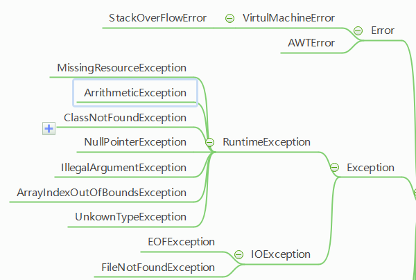
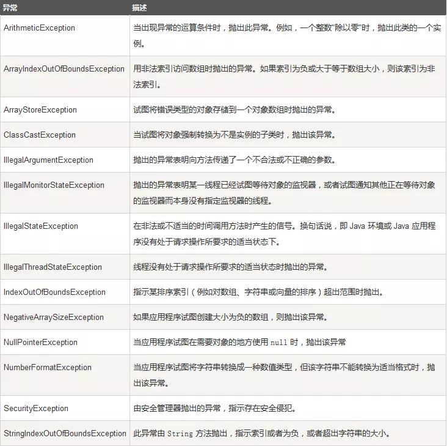
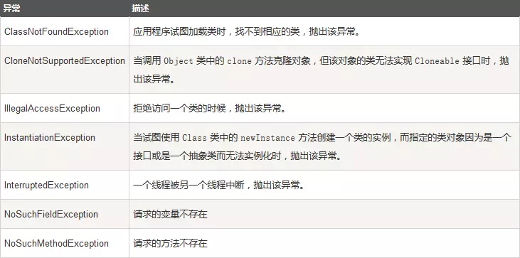
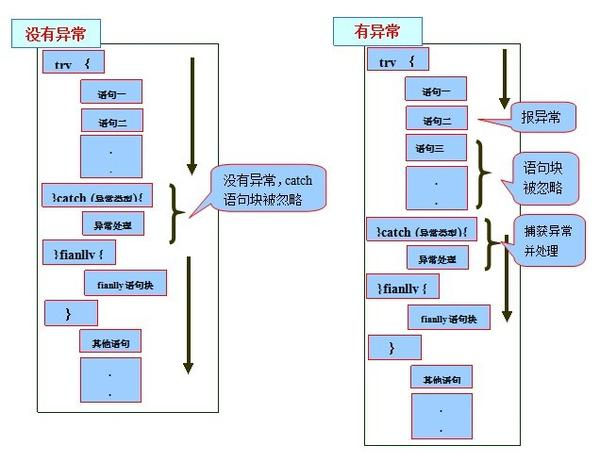

# 异常

异常指不期而至的各种状况，如：文件找不到、网络连接失败、非法参数等。异常是一个事件，它发生在程序运行期间，干扰了正常的指令流程。Java通 过API中Throwable类的众多子类描述各种不同的异常。因而，Java异常都是对象，是Throwable子类的实例，描述了出现在一段编码中的 错误条件。当条件生成时，错误将引发异常。

- **Throwable 类**是 Java 语言中所有错误或异常的超类。
- 只有当对象是此类（或其子类之一）的实例时，才能通过 Java 虚拟机或者 Java throw 语句抛出。类似地，只有此类或其子类之一才可以是 catch 子句中的参数类型。
- Throwable 包含了其线程创建时线程执行堆栈的快照。它还包含了给出有关错误更多信息的消息字符串。
- 最后，它还可以包含 cause（原因）：另一个导致此 throwable 抛出的 throwable。此 cause 设施在 1.4 版本中首次出现。它也称为异常链 设施，因为 cause 自身也会有 cause，依此类推，就形成了异常链，每个异常都是由另一个异常引起的。



上图可以看到Java异常体系层次结构图

 在 Java 中，所有的异常都有一个共同的祖先 Throwable（可抛出）。Throwable 指定代码中可用异常传播机制通过 Java 应用程序传输的任何问题的共性。异常对象都是派生于Throwable类的一个实例，如果Java中内置的异常类不能满足需求，可以创建者自己的异常类。

在 Java 中一个异常的产生，主要有如下三种原因：

1. Java 内部错误发生异常，Java 虚拟机产生的异常。
2. 编写的程序代码中的错误所产生的异常，例如空指针异常、数组越界异常等。这种异常称为未检査的异常，一般需要在某些类中集中处理这些异常。
3. 通过 throw 语句手动生成的异常，这种异常称为检査的异常，一般用来告知该方法的调用者一些必要的信息。

Java 通过面向对象的方法来处理异常。在一个方法的运行过程中，如果发生了异常，则这个方法会产生代表该异常的一个对象，并把它交给运行时的系统，运行时系统寻找相应的代码来处理这一异常。

我们把生成异常对象，并把它提交给运行时系统的过程称为拋出（throw）异常。运行时系统在方法的调用栈中查找，直到找到能够处理该类型异常的对象，这一个过程称为捕获（catch）异常。


 **Throwable：** 有两个重要的子类：Exception（异常）和 Error（错误），二者都是 Java 异常处理的重要子类，各自都包含大量子类。

## 检查与非检查

注意：异常和错误的区别：异常能被程序本身可以处理，错误是无法处理。通常，Java的异常(包括Exception和Error)分为**可查的异常（checked exceptions）和不可查的异常（unchecked exceptions）。**派生于Error类或RuntimeException类的所有异常称为未检查异常，所有其他的异常称为已检查异常。编译器将核查是否为所有的已检查异常提供类了异常处理器。
      可查异常（编译器要求必须处置的异常）：正确的程序在运行中，很容易出现的、情理可容的异常状况。可查异常虽然是异常状况，但在一定程度上它的发生是可以预计的，而且一旦发生这种异常状况，就必须采取某种方式进行处理。

      除了RuntimeException及其子类以外，其他的Exception类及其子类都属于可查异常。这种异常的特点是Java编译器会检查它，也就是说，当程序中可能出现这类异常，要么用try-catch语句捕获它，要么用throws子句声明抛出它，否则编译不会通过。

     不可查异常(编译器不要求强制处置的异常):包括运行时异常（RuntimeException与其子类）和错误（Error）。

    ### 常见的非检查性异常：



### 常见的检查性异常：



## Error

* **Error（错误）：**Error类层次结构描述了Java运行时系统的内部错误和资源耗尽错误。是程序无法处理的错误，表示运行应用程序中较严重问题。大多数错误与代码编写者执行的操作无关，而表示代码运行时 JVM（Java 虚拟机）出现的问题。例如，Java虚拟机运行错误（Virtual MachineError），当 JVM 不再有继续执行操作所需的内存资源时，将出现 OutOfMemoryError。这些异常发生时，Java虚拟机（JVM）一般会选择线程终止。

  这些错误表示故障发生于虚拟机自身、或者发生在虚拟机试图执行应用时，如Java虚拟机运行错误（Virtual MachineError）、类定义错误（NoClassDefFoundError）等。这些错误是不可查的，因为它们在应用程序的控制和处理能力之 外，而且绝大多数是程序运行时不允许出现的状况。对于设计合理的应用程序来说，即使确实发生了错误，本质上也不应该试图去处理它所引起的异常状况。在 Java中，错误通过Error的子类描述。

  - Error 是 Throwable 的子类，用于指示合理的应用程序**不应该试图捕获的严重问题**。
  - 大多数这样的错误都是异常条件。虽然 ThreadDeath 错误是一个“正规”的条件，但它也是 Error 的子类，因为大多数应用程序都不应该试图捕获它。
  - 在执行该方法期间，无需在其 throws 子句中声明可能抛出但是未能捕获的 Error 的任何子类，因为这些错误可能是再也不会发生的异常条件。
  - Java 程序通常不捕获错误。错误一般发生在严重故障时，它们在Java程序处理的范畴之外。

## Exception

* **Exception（异常）：** 是程序本身可以处理的异常。

Exception 类有一个重要的子类 RuntimeException。RuntimeException 类及其子类表示“JVM 常用操作”引发的错误。例如，若试图使用空值对象引用、除数为零或数组越界，则分别引发运行时异常（NullPointerException、ArithmeticException）和 ArrayIndexOutOfBoundException。

Exception 这种异常分两大类运行时异常和非运行时异常(编译异常)。程序中应当尽可能去处理这些异常。

- Exception 常用异常主要分为两类
  - **非运行时异常 （编译异常）：**是RuntimeException以外的异常，类型上都属于Exception类及其子类。从程序语法角度讲是必须进行处理的异常，如果不处理，程序就不能编译通过。如IOException、SQLException等以及用户自定义的Exception异常，一般情况下不自定义检查异常。IOException（I/O 输入输出异常），其中 IOException 及其子类异常又被称作「受查异常」，程序本身没有问题，由于向I/O错误这类问题属于其他异常、试图在文件尾部后面读取数据、试图打开一个不存在的文件、试图根据给定的字符串查找Class对象，而这个字符串表示的类并不存在。
  - 另一类是 **RuntimeException（运行时异常）**，RuntimeException 被称作「非受查异常」。运行时异常的特点是Java编译器不会检查它，也就是说，当程序中可能出现这类异常，即使没有用try-catch语句捕获它，也没有用throws子句声明抛出它，也会编译通过。错误的类型转换、数组访问越界、访问空指针、如果出现RuntimeException异常，那就一定是你的问题。
- 受查异常就是指，编译器在编译期间要求必须得到处理的那些异常，你必须在编译期处理了。

## 异常处理机制

在 Java 应用程序中，异常处理机制为：**抛出异常**，**捕捉异常**。

对于运行时异常、错误或可查异常，Java技术所要求的异常处理方式有所不同。

由于运行时异常的不可查性，为了更合理、更容易地实现应用程序，Java规定，运行时异常将由Java运行时系统自动抛出，允许应用程序忽略运行时异常。

对于方法运行中可能出现的Error，当运行方法不欲捕捉时，Java允许该方法不做任何抛出声明。因为，大多数Error异常属于永远不能被允许发生的状况，也属于合理的应用程序不该捕捉的异常。

对于所有的可查异常，Java规定：一个方法必须捕捉，或者声明抛出方法之外。也就是说，当一个方法选择不捕捉可查异常时，它必须声明将抛出异常。

能够捕捉异常的方法，需要提供相符类型的异常处理器。所捕捉的异常，可能是由于自身语句所引发并抛出的异常，也可能是由某个调用的方法或者Java运行时 系统等抛出的异常。也就是说，一个方法所能捕捉的异常，一定是Java代码在某处所抛出的异常。简单地说，异常总是先被抛出，后被捕捉的。

任何Java代码都可以抛出异常，如：自己编写的代码、来自Java开发环境包中代码，或者Java运行时系统。无论是谁，都可以通过Java的throw语句抛出异常。

从方法中抛出的任何异常都必须使用throws子句。

捕捉异常通过try-catch语句或者try-catch-finally语句实现。

总体来说，Java规定：对于可查异常必须捕捉、或者声明抛出。允许忽略不可查的RuntimeException和Error。

### 抛出异常

当一个方法出现错误引发异常时，方法创建异常对象并交付运行时系统，异常对象中包含了异常类型和异常出现时的程序状态等异常信息。运行时系统负责寻找处置异常的代码并执行。

什么时候使用throws子句声明异常，什么异常必须使用throws子句声明:

调用一个抛出已检查异常的方法

程序运行过程中发现错误，并且利用throw语句抛出一个已检查异常

程序出现错误

Java虚拟机和运行时库出现的内部错误

对于那些可能被他人使用的Java方法，应该根据异常规范，在方法的首部声明

这个方法可能抛出异常，如果一个方法有可能抛出多个已检查异常，那么就必须在方法的首部列出所有的异常类，每个异常类之间用逗号隔开。但是不需要声明Java内部错误，即从Error继承的错误。

 任何Java代码都可以抛出异常，如：自己编写的代码、来自Java开发环境包中代码，或者Java运行时系统。无论是谁，都可以通过Java的throw语句抛出异常。从方法中抛出的任何异常都必须使用throws子句。

#### throws抛出异常

如果一个方法可能会出现异常，但没有能力处理这种异常，可以在方法声明处用throws子句来声明抛出异常。例如汽车在运行时可能会出现故障，汽车本身没办法处理这个故障，那就让开车的人来处理。

throws语句用在方法定义时声明该方法要抛出的异常类型，如果抛出的是Exception异常类型，则该方法被声明为抛出所有的异常。多个异常可使用逗号分割。throws语句的语法格式为：throws 异常类名

```java
methodname throws Exception1,Exception2,..,ExceptionN
{
}
```

方法名后的throws Exception1,Exception2,...,ExceptionN 为声明要抛出的异常列表。当方法抛出异常列表的异常时，方法将不对这些类型及其子类类型的异常作处理，而抛向调用该方法的方法，由他去处理。例如：

```java
import java.lang.Exception;
public class TestException {
	static void pop() throws NegativeArraySizeException {
		// 定义方法并抛出NegativeArraySizeException异常
		int[] arr = new int[-3]; // 创建数组
	}
 
	public static void main(String[] args) { // 主方法
		try { // try语句处理异常信息
			pop(); // 调用pop()方法
		} catch (NegativeArraySizeException e) {
			System.out.println("pop()方法抛出的异常");// 输出异常信息
		}
	}
 
}
```

使用throws关键字将异常抛给调用者后，如果调用者不想处理该异常，可以继续向上抛出，但最终要有能够处理该异常的调用者。

pop方法没有处理异常NegativeArraySizeException，而是由main函数来处理。

##### Throws抛出异常的规则：

    1) 如果是不可查异常（unchecked exception），即Error、RuntimeException或它们的子类，那么可以不使用throws关键字来声明要抛出的异常，编译仍能顺利通过，但在运行时会被系统抛出。

    2）必须声明方法可抛出的任何可查异常（checked exception）。即如果一个方法可能出现受可查异常，要么用try-catch语句捕获，要么用throws子句声明将它抛出，否则会导致编译错误

    3)仅当抛出了异常，该方法的调用者才必须处理或者重新抛出该异常。当方法的调用者无力处理该异常的时候，应该继续抛出，而不是囫囵吞枣。

    4）调用方法必须遵循任何可查异常的处理和声明规则。若覆盖一个方法，则不能声明与覆盖方法不同的异常。声明的任何异常必须是被覆盖方法所声明异常的同类或子类。

```java
void method1() throws IOException{}  //合法  
 
//编译错误，必须捕获或声明抛出IOException  
void method2(){  
  method1();  
}  
 
//合法，声明抛出IOException  
void method3()throws IOException {  
  method1();  
}  
 
//合法，声明抛出Exception，IOException是Exception的子类  
void method4()throws Exception {  
  method1();  
}  
 
//合法，捕获IOException  
void method5(){  
 try{  
    method1();  
 }catch(IOException e){…}  
}  
 
//编译错误，必须捕获或声明抛出Exception  
void method6(){  
  try{  
    method1();  
  }catch(IOException e){throw new Exception();}  
}  
 
//合法，声明抛出Exception  
void method7()throws Exception{  
 try{  
  method1();  
 }catch(IOException e){throw new Exception();}  
} 
```

判断一个方法可能会出现异常的依据如下：
     1. 方法中有throw语句。例如，以上method7()方法的catch代码块有throw语句。

          2. 调用了其他方法，其他方法用throws子句声明抛出某种异常。例如，method3()方法调用了method1()方法，method1()方法声明抛出IOException，因此，在method3()方法中可能会出现IOException。

#### 使用throw抛出异常

throw总是出现在函数体中，用来抛出一个Throwable类型的异常。程序会在throw语句后立即终止，它后面的语句执行不到，然后在包含它的所有try块中（可能在上层调用函数中）从里向外寻找含有与其匹配的catch子句的try块。
我们知道，异常是异常类的实例对象，我们可以创建异常类的实例对象通过throw语句抛出。如果出现了异常情况，我们可以把该异常抛出，这个时候抛出的应该是异常的对象。该语句的语法格式为：
 throw new exceptionname;
例如抛出一个IOException类的异常对象：
throw new IOException;
要注意的是，throw 抛出的只能够是可抛出类Throwable 或者其子类的实例对象。下面的操作是错误的：
throw new String("exception");
这是因为String 不是Throwable 类的子类。

如果抛出了检查异常，则还应该在方法头部声明方法可能抛出的异常类型。该方法的调用者也必须检查处理抛出的异常。

如果所有方法都层层上抛获取的异常，最终JVM会进行处理，处理也很简单，就是打印异常消息和堆栈信息。如果抛出的是Error或RuntimeException，则该方法的调用者可选择处理该异常。

```java
package Test;
import java.lang.Exception;
public class TestException {
	static int quotient(int x, int y) throws MyException { // 定义方法抛出异常
		if (y < 0) { // 判断参数是否小于0
			throw new MyException("除数不能是负数"); // 异常信息
		}
		return x/y; // 返回值
	}
	public static void main(String args[]) { // 主方法
		int  a =3;
		int  b =0; 
		try { // try语句包含可能发生异常的语句
			int result = quotient(a, b); // 调用方法quotient()
		} catch (MyException e) { // 处理自定义异常
			System.out.println(e.getMessage()); // 输出异常信息
		} catch (ArithmeticException e) { // 处理ArithmeticException异常
			System.out.println("除数不能为0"); // 输出提示信息
		} catch (Exception e) { // 处理其他异常
			System.out.println("程序发生了其他的异常"); // 输出提示信息
		}
	}
}
class MyException extends Exception { // 创建自定义异常类
	String message; // 定义String类型变量
	public MyException(String ErrorMessagr) { // 父类方法
		message = ErrorMessagr;
	}
 
	public String getMessage() { // 覆盖getMessage()方法
		return message;
	}
}
```

#### throws和throw的区别

**throws：**

用在方法声明后面，跟的是异常类名

可以跟多个异常类名，用逗号隔开

表示抛出异常，由该方法的调用者来处理

throws表示出现异常的一种可能性，并不一定会发生这些异常

**throw：**

用在方法体内，跟的是异常对象名

只能抛出一个异常对象名

表示抛出异常，由方法体内的语句处理

throw则是抛出了异常，执行throw则一定抛出了某种异常

### 捕获异常

在方法抛出异常之后，运行时系统将转为寻找合适的异常处理器（exception handler）。潜在的异常处理器是异常发生时依次存留在调用栈中的方法的集合。当异常处理器所能处理的异常类型与方法抛出的异常类型相符时，即为合适 的异常处理器。运行时系统从发生异常的方法开始，依次回查调用栈中的方法，直至找到含有合适异常处理器的方法并执行。当运行时系统遍历调用栈而未找到合适 的异常处理器，则运行时系统终止。同时，意味着Java程序的终止。

#### try...catch语句

其基本格式为：

```java
try{
  //可能出现问题的代码
}catch(异常名 变量){
  //针对问题的处理
}
/*
try{
   // 程序代码
}catch(异常类型1 异常的变量名1){
  // 程序代码
}catch(异常类型2 异常的变量名2){
  // 程序代码
}catch(异常类型2 异常的变量名2){
  // 程序代码
}
*/
```

关键词try后的一对大括号将一块可能发生异常的代码包起来，称为监控区域。Java方法在运行过程中出现异常，则创建异常对象。将异常抛出监控区域之 外，由Java运行时系统试图寻找匹配的catch子句以捕获异常。若有匹配的catch子句，则运行其异常处理代码，try-catch语句结束。

try后可以有多个catch

匹配的原则是：如果抛出的异常对象属于catch子句的异常类，或者属于该异常类的子类，则认为生成的异常对象与catch块捕获的异常类型相匹配。

```java
//捕捉throw语句抛出的“除数为0”异常
public class TestException {
	public static void main(String[] args) {
		int a = 6;
		int b = 0;
		try { // try监控区域
			
			if (b == 0) throw new ArithmeticException(); // 通过throw语句抛出异常
			System.out.println("a/b的值是：" + a / b);
		}
		catch (ArithmeticException e) { // catch捕捉异常
			System.out.println("程序出现异常，变量b不能为0。");
		}
		System.out.println("程序正常结束。");
	}
}
//运行结果：程序出现异常，变量b不能为0。
//程序正常结束。
//在try监控区域通过if语句进行判断，当“除数为0”的错误条件成立时引发ArithmeticException异常，创建 ArithmeticException异常对象，并由throw语句将异常抛给Java运行时系统，由系统寻找匹配的异常处理器catch并运行相应异 常处理代码，打印输出“程序出现异常，变量b不能为0。”try-catch语句结束，继续程序流程。
//事实上，“除数为0”等ArithmeticException，是RuntimException的子类。而运行时异常将由运行时系统自动抛出，不需要使用throw语句。
```

```java
//捕捉运行时系统自动抛出“除数为0”引发的ArithmeticException异常。
	public static void main(String[] args) {
		int a = 6;
		int b = 0;
		try {
			System.out.println("a/b的值是：" + a / b);
		} catch (ArithmeticException e) {
			System.out.println("程序出现异常，变量b不能为0。");
		}
		System.out.println("程序正常结束。");
	}
}
//运行结果：程序出现异常，变量b不能为0。
//程序正常结束。
/*
System.out.println("a/b的值是：" + a/b);
在运行中出现“除数为0”错误，引发ArithmeticException异常。运行时系统创建异常对象并抛出监控区域，转而匹配合适的异常处理器catch，并执行相应的异常处理代码。
由于检查运行时异常的代价远大于捕捉异常所带来的益处，运行时异常不可查。Java编译器允许忽略运行时异常，一个方法可以既不捕捉，也不声明抛出运行时异常。
*/
```

```java
//不捕捉、也不声明抛出运行时异常。
public class TestException {
	public static void main(String[] args) {
		int a, b;
		a = 6;
		b = 0; // 除数b 的值为0
		System.out.println(a / b);
	}
}
/*
运行结果：
Exception in thread "main" java.lang.ArithmeticException: / by zero
at Test.TestException.main(TestException.java:8)
*/
```

```java
//程序可能存在除数为0异常和数组下标越界异常。
public class TestException {
	public static void main(String[] args) {
		int[] intArray = new int[3];
		try {
			for (int i = 0; i <= intArray.length; i++) {
				intArray[i] = i;
				System.out.println("intArray[" + i + "] = " + intArray[i]);
				System.out.println("intArray[" + i + "]模 " + (i - 2) + "的值:  "
						+ intArray[i] % (i - 2));
			}
		} catch (ArrayIndexOutOfBoundsException e) {
			System.out.println("intArray数组下标越界异常。");
		} catch (ArithmeticException e) {
			System.out.println("除数为0异常。");
		}
		System.out.println("程序正常结束。");
	}
}
/*
运行结果：

intArray[0] = 0

intArray[0]模 -2的值:  0

intArray[1] = 1

intArray[1]模 -1的值:  0

intArray[2] = 2

除数为0异常。

程序正常结束。
程序可能会出现除数为0异常，还可能会出现数组下标越界异常。程序运行过程中ArithmeticException异常类型是先行匹配的，因此执行相匹配的catch语句：
*/
```

需要注意的是，一旦某个catch捕获到匹配的异常类型，将进入异常处理代码。一经处理结束，就意味着整个try-catch语句结束。其他的catch子句不再有匹配和捕获异常类型的机会。

 Java通过异常类描述异常类型，异常类的层次结构如图1所示。对于有多个catch子句的异常程序而言，应该尽量将捕获底层异常类的catch子 句放在前面，同时尽量将捕获相对高层的异常类的catch子句放在后面。否则，捕获底层异常类的catch子句将可能会被屏蔽。

RuntimeException异常类包括运行时各种常见的异常，ArithmeticException类和ArrayIndexOutOfBoundsException类都是它的子类。因此，RuntimeException异常类的catch子句应该放在 最后面，否则可能会屏蔽其后的特定异常处理或引起编译错误。

#### try...catch...finall语句

try-catch语句还可以包括第三部分，就是finally子句。它表示无论是否出现异常，都应当执行的内容。

- finally 关键字用来创建在 try 代码块后面执行的代码块。
- **无论是否发生异常，finally 代码块中的代码总会被执行**。在 finally 代码块中，可以运行清理类型等收尾善后性质的语句。

try-catch-finally语句的一般语法形式为：

```java
try {
  // 可能会发生异常的程序代码
} catch (Type1 id1) {
  // 捕获并处理try抛出的异常类型Type1
} catch (Type2 id2) {
  // 捕获并处理try抛出的异常类型Type2
} finally {
  // 无论是否发生异常，都将执行的语句块
}
```

```java
public class TestException {
	public static void main(String args[]) {
		int i = 0;
		String greetings[] = { " Hello world !", " Hello World !! ",
				" HELLO WORLD !!!" };
		while (i < 4) {
			try {
				// 特别注意循环控制变量i的设计，避免造成无限循环
				System.out.println(greetings[i++]);
			} catch (ArrayIndexOutOfBoundsException e) {
				System.out.println("数组下标越界异常");
			} finally {
				System.out.println("--------------------------");
			}
		}
	}
}
/*
运行结果：
Hello world !
--------------------------
Hello World !!
--------------------------
HELLO WORLD !!!
--------------------------
数组下标越界异常
--------------------------
*/
```

try 块：用于捕获异常。其后可接零个或多个catch块，如果没有catch块，则必须跟一个finally块。
catch 块：用于处理try捕获到的异常。
finally 块：无论是否捕获或处理异常，finally块里的语句都会被执行。当在try块或catch块中遇到return语句时，finally语句块将在方法返回之前被执行。

在以下4种特殊情况下，finally块不会被执行：

1. 在finally语句块中发生了异常。
2. 在前面的代码中用了System.exit()退出程序。
3. 程序所在的线程死亡。
4. 关闭CPU。

```java
//JDK7出现了新的异常处理方案
try{
  ...
}catch(异常名1|异常名2|... 变量){
  ...
}
//这个方法虽然简洁，但是也不够好
//处理方式是一致的(实际开发中，好多时候可能就是针对同类型的问题，给出同一个处理)
//多个异常之间必须是平级关系
```

try里面发现问题后，jvm会帮我们生成一个异常对象，然后把这个对象抛出，和catch里面的类进行匹配，如果该对象是某个类型的，就会执行该catch里面的处理信息

异常中要了解的几个方法：

```java
public String getMessage();//异常的消息字符串
public String toString();//返回异常的简单信息描述
//此对象的类的name(全路径名)
//":"(冒号和一个空格)
//调用此对象getLocalizeMessage()方法的结果(默认返回的是getMessage()的内容)
printStackTrace();//获取异常类名和异常的信息，以及异常出现在程序中的位置，返回值void，把信息输出在控制台
```

##### finally关键字

被finally控制的语句体一定会执行(特殊情况：在执行到finally之前jvm退出了(比如System.exit(0))

**finally的作用：**

用于释放资源，在IO流操作和数据库操作中会见到

**面试题：**

final,finally,和finalize的区别？

final：最终的意思，可以修饰类，成员变量，成员方法

finally：是异常处理的一部分，用于释放资源

finalize：是Object类的一个方法，用于垃圾回收

如果catch里面有return语句，请问finally里面的代码还会执行吗？如果会，请问是在return前还是return后？

会，前。准确的说应该是中间

```java
public class FinallyDemo{
  public static void main(String[] args){
    System.out.println(getInt());
  }
  public static int getInt(){
    int a = 10;
    try{
      System.out.println(a/0);
      a = 20;
    }catch(ArithmeticException e){
      a = 30;
      return a;
      /*
      return a 在程序执行到这一步的时候，这里不是return a而是return 30;这个返回路径就形成了，但是呢，他发现后面还有finally，所以继续执行finally的内容，a=40.再次回到以前的返回路径，继续走return 30;
      */
    }finally{
      a = 40;
      return a;//如果这样结果就是40了
    }
    //return a;
  }
}
```

#### try..carch...finally语句的执行顺序

1. 当try没有捕获到异常时：try语句块中的语句逐一被执行，程序将跳过catch语句块，执行finally语句块和其后的语句；
2. 当try捕获到异常，catch语句块里没有处理此异常的情况：当try语句块里的某条语句出现异常时，而没有处理此异常的catch语句块时，此异常将会抛给JVM处理，finally语句块里的语句还是会被执行，但finally语句块后的语句不会被执行；
3. 当try捕获到异常，catch语句块里有处理此异常的情况：在try语句块中是按照顺序来执行的，当执行到某一条语句出现异常时，程序将跳到catch语句块，并与catch语句块逐一匹配，找到与之对应的处理程序，其他的catch语句块将不会被执行，而try语句块中，出现异常之后的语句也不会被执行，catch语句块执行完后，执行finally语句块里的语句，最后执行finally语句块后的语句；



### 我们应该如何处理异常以及异常注意事项

原则：如果该功能内部可以将问题处理，用try，如果处理不了，交由调用者处理，用throws

区别：后续程需要继续运行就try，后续程序不需要继续运行就throws

举例：感冒了就自己吃点药 try

吃了好几天药没得结果得了H7N9，那就得throws

如果医院没有特效药就变成Error

### 异常注意事项

子类覆盖父类的方法时，子类的方法必须抛出相同的异常或父类。

如果父类抛出了多个异常，子类覆盖父类时，只能抛出相同的异常或者时他的子集，子类不能抛出父类没有的异常

如果被覆盖的方法没有异常抛出，那么子类的方法绝对不可以抛出异常，如果子类方法内由异常发生，那么子类只能try，不能throws

## 自定义异常

java不可能所有的情况都考虑到，所以在实际的开发中，我们可能需要自己定义异常

而我们自己随意的写一个类，是不能作为异常类来看的，要想你的类是一个异常类就必须继承自Exception或者RuntimeException：

两种方式：

* 继承Exception
* 继承RuntimeException

## 异常链

      1. 如果调用quotient(3,-1)，将发生MyException异常，程序调转到catch (MyException e)代码块中执行；

      2.  如果调用quotient(5,0)，将会因“除数为0”错误引发ArithmeticException异常，属于运行时异常类，由Java运行时系统自动抛出。quotient（）方法没有捕捉ArithmeticException异常，Java运行时系统将沿方法调用栈查到main方法，将抛出的异常上传至quotient（）方法的调用者：

         int result = quotient(a, b); // 调用方法quotient()
        由于该语句在try监控区域内，因此传回的“除数为0”的ArithmeticException异常由Java运行时系统抛出，并匹配catch子句：

       catch (ArithmeticException e) { // 处理ArithmeticException异常
System.out.println("除数不能为0"); // 输出提示信息
} 

        处理结果是输出“除数不能为0”。Java这种向上传递异常信息的处理机制，形成异常链。

       Java方法抛出的可查异常将依据调用栈、沿着方法调用的层次结构一直传递到具备处理能力的调用方法，最高层次到main方法为止。如果异常传递到main方法，而main不具备处理能力，也没有通过throws声明抛出该异常，将可能出现编译错误。

            3. 如还有其他异常发生，将使用catch (Exception e)捕捉异常。由于Exception是所有异常类的父类，如果将catch (Exception e)代码块放在其他两个代码块的前面，后面的代码块将永远得不到执行，就没有什么意义了，所以catch语句的顺序不可掉换。

## Throwable类中的常用方法

注意：catch关键字后面括号中的Exception类型的参数e。Exception就是try代码块传递给catch代码块的变量类型，e就是变量名。catch代码块中语句"e.getMessage();"用于输出错误性质。通常异常处理常用3个函数来获取异常的有关信息:

     getCause()：返回抛出异常的原因。如果 cause 不存在或未知，则返回 null。

　 getMeage()：返回异常的消息信息。
　 printStackTrace()：对象的堆栈跟踪输出至错误输出流，作为字段 System.err 的值。

     有时为了简单会忽略掉catch语句后的代码，这样try-catch语句就成了一种摆设，一旦程序在运行过程中出现了异常，就会忽略处理异常，而错误发生的原因很难查找。

## Java常见异常

在Java中提供了一些异常用来描述经常发生的错误，对于这些异常，有的需要程序员进行捕获处理或声明抛出，有的是由Java虚拟机自动进行捕获处理。Java中常见的异常类:

1. runtimeException子类:

      1.  java.lang.ArrayIndexOutOfBoundsException

          数组索引越界异常。当对数组的索引值为负数或大于等于数组大小时抛出。
          2. java.lang.ArithmeticException
          算术条件异常。譬如：整数除零等。
          3. java.lang.NullPointerException
          空指针异常。当应用试图在要求使用对象的地方使用了null时，抛出该异常。譬如：调用null对象的实例方法、访问null对象的属性、计算null对象的长度、使用throw语句抛出null等等
          4. java.lang.ClassNotFoundException
          找不到类异常。当应用试图根据字符串形式的类名构造类，而在遍历CLASSPAH之后找不到对应名称的class文件时，抛出该异常。

            5. java.lang.NegativeArraySizeException  数组长度为负异常
         6. java.lang.ArrayStoreException 数组中包含不兼容的值抛出的异常
         7. java.lang.SecurityException 安全性异常
         8. java.lang.IllegalArgumentException 非法参数异常

2. IOException

      1. IOException：操作输入流和输出流时可能出现的异常。
      2. EOFException   文件已结束异常
      3. FileNotFoundException   文件未找到异常


3. 其他
  1. ClassCastException    类型转换异常类
  2. ArrayStoreException  数组中包含不兼容的值抛出的异常
  3. SQLException   操作数据库异常类
  4. NoSuchFieldException   字段未找到异常
  5. NoSuchMethodException   方法未找到抛出的异常
  6. NumberFormatException    字符串转换为数字抛出的异常
  7. StringIndexOutOfBoundsException 字符串索引超出范围抛出的异常
  8. IllegalAccessException  不允许访问某类异常
  9. InstantiationException  当应用程序试图使用Class类中的newInstance()方法创建一个类的实例，而指定的类对象无法被实例化时，抛出该异常

##分析堆栈跟踪元素：

堆栈跟踪是一个方法调用过程的列表，它包含了程序执行过程中方法调用的特定位置。

可以调用Throwable类的printStackTrace方法访问堆栈跟踪的文本描述信息。

还可以使用getStackTrace方法，它会得到StackTraceElement对象的一个数组。StackTraceElement类含有能够获得文件名和当前执行的代码号的方法，还含有能够获得类名和方法名的方法。toString方法将产生一个格式化字符串，其中包含所获得的信息。静态的Thread.getAllStackTrace方法，它可以产生所有线程的堆栈跟踪。

## 断言

断言机制允许在测试期间向代码插入一些检查语句，当代码发布时，这些插入的检测语句将会被自动的移走

Java语言引入关键字assert。这个关键字有两种形式:

assert 条件;

assert 条件:表达式;

要想断言x是一个非负数值:assert >= 0;

或者将x的实际值传递给AssertionError对象

Assert x >= 0 : x;

在默认情况下，断言被禁用。可以在运行程序时用 –enableassertions或-ea选项启用它: java –enableassertions Myapp。

在启动或禁用断言时不必重新编译程序。启用或禁用断言是类加载器的功能。当断言被禁用时，类加载器将跳过断言代码，因此不会降低程序运行速度。

也可以在某个类或某个包中使用断言:

Java –ea:MyClass –ea:com.mycompany.mylib… MyApp

这条命令将开启MyClass类在com.mycompany.mylib包和它的子包中的所有类的断言。

## 记录日志

日志系统管理着一个名为Logger.global的默认日志记录器，可以用System.out替换它，并通过调用info方法记录日志信息:Logger.getGlobal().info

日志记录器级别:SEVERE,WARNING,INFO,CONFIG,FINE,FINER,FINERST.

logger.setlevel(level.FINE);


