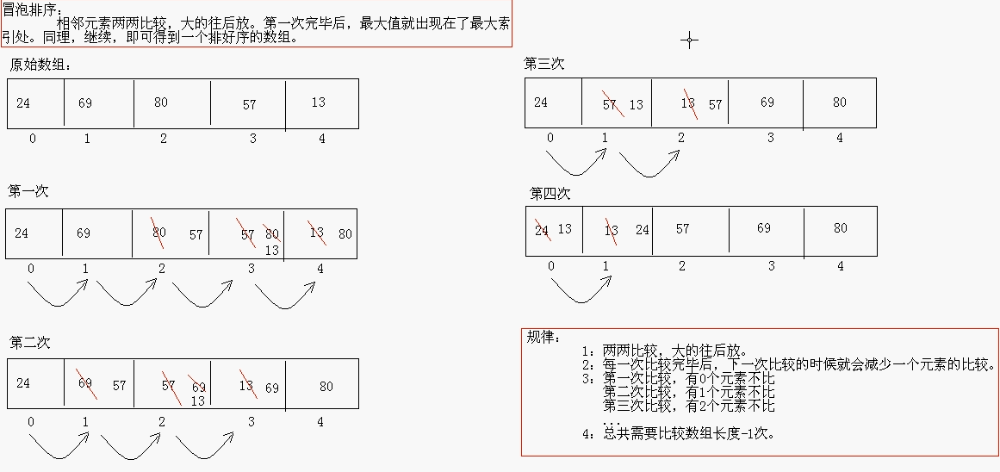

# 数组

数组是一种数据结构，用来存储同一类型值的集合。通过一个整型下标可以访问数组中的每一个值。

int[]a = new int[3];

new int[3]:在堆内存空间创建一个int类型数组，数组有三个元素，有一个唯一地址值    

a:int类型数组，（引用类型），引用int[]a数组在堆内存创建的内存空间的唯一地址值 

int:指定数组类型

数组在定义的时候必须进行初始化（静态初始化或者动态初始化）否则会报错。

int类型数组默认初始化值为0

String类型数组默认初始化值为null

boolean类型数组默认初始化值为false

double类型数组默认初始化值为0.0

快速创建数组：

int[]a = {1,2,3};

## 数组的定义格式

声明数组变量时，需要指出数组类型和数组变量的名字

`int[] a;`

## 数组的初始化

动态初始化：初始化时只指定数组长度，由系统为数组分配初始化值

静态初始化：初始化时指定每个数组元素的初始化值，由系统决定数组长度

- 动态初始化

只给长度，系统给出默认值。

`int [] arr = new int [3];`

- 静态初始化

给出值，系统决定长度

`int[] arr = new int[] {1,2,3};`

`int [] arr = {1,2,3};`

## for each循环

Java有一种功能很强的循环结构，可以用来依次处理数组中的每个元素

`for(variable: collection) statement`

## 数组拷贝

在Java中允许将一个数组变量拷贝给另一个数组变量。这时两个变量将引用同一个数组

`int[] luckyNumbers = smallPrimes;`

`luckyNumbers[5] = 12 //smallPrimes[5] = 12`

如果希望将一个数组的所有值拷贝到一个新的数字组中去，则要使用Arrays类的copyTo方法。

`int[] copiedLuckyNumbers = Arrays.copyOf(luckyNumbers.length);`

第二个参数是新数组的长度。

增加数组的大小:

`luckyNumbers = Arrays.copyOf(luckyNumbers,2 * luckyNumbers.length) ;`

如果数组元素是数值型，那么多余的元素将被赋值为0，如果数组元素是布尔值，则为false，如果长度小于原始数组的长度，则只拷贝最前  面的数据元素

`Arrays.copyOf(数组,数组长度);`

如果数组元素是数值型，那么多余的元素将被赋值为0；如果数组元素是布尔型，则将赋值为false。相反，如果长度小于原始数组的长度，则只拷贝最前面的数据元素.

## Java的内存分配

*  栈

存储局部变量

- 堆

存储所有new出来的东西

- 方法区
- 本地方法区（系统相关）
- 寄存器（cpu使用）
- 栈内存和堆内存的区别

栈：数据使用完毕就消失

堆：每一个new出来的东西都有地址、每一个变量都有默认值

数据使用完毕后，在垃圾回收器空闲的时候回收。

- 一个数组内存图


## 数组排序

`Arrays.sort(数组);`优化的快速排序算法

`static String toString(type[] a)`:返回包含a中数据元素的字符串，这些数据元素被放在括号内，并用逗号分隔.

`statictype copyOf(type[] a,int length)`:

`static type copyOf(type[] a,int start,int end)`:

返回与a类型相同的一个数组，其长度为length或者end-start，数组元素为a的值

拷贝的数据元素长度如果大于原数据元素长度，结果为0或false

`static void sort(type[] a);`

`static int binarySearch(type[] a,type v)`:

`static int binarySearch(type[] a,int start,int end,type v)`

利用二分搜索算法查找值V，如果查找成功，则返回相应的下标值，否则，返回一个负数r

`static void fill(type[] a,type v)`:将数组的所有数据元素值设置为v

`static boolean equals(type[] a,type[] b)`:如果两个数组大小，下标相同的元素都对应相等，返回true.

## 数组常见操作

### 遍历

方式一：

```java
public static void printArray(int[] arr){
  for(int x = 0; x<arr.length; x++){
    System.out.println(arr[x]);
  }
}
```

方式二：

```java
public static void printArray2(int[] arr){
  System.out.println("[");
  for(int x=0;x<arr.length;x++){
    if(x == arr.length-1){
      System.out.println(arr[x]+"]");
    }else{
      System.out.println(arr[x]+",");
    }
  }
}
```

### 最值

最大值：

```java
public static int getMax(int[] arr){
  int max = arr[0];
  for(int x = 1; x < arr.length; x++){
    if(arr[x] > max){
      max = arr[x];
    }
  }
  return max;
}
```

最小值：

```java
public static int getMax(int[] arr){
  int max = arr[0];
  for(int x =1; x < arr.length;x++){
    if(arr[x] > max){
      max = arr[x];
    }
  }
  return max;
}
```

### 逆序

```java
public static int reverse(int[] arr){
  for(int x = 0; x < arr.length/2; x++){
    int temp = arr[x];
    arr[x] = arr[arr.length-1-x];
    arr[arr.length-1-x] = temp;
  }
  return -1;
}
```

### 查表

```java
public static String getString(String[] strArray,int index){
  return strArray[index];
}
```

### 基本查找

方式一：

```java
public static int getIndex(int[] arr,int value){
  for(int x = 0;x < arr.length; x++){
    if(arr[x] == value){
      return x;
    }
  }
  return -1;
}
```

方式二：

```java
public static int getIndex2(int[] arr,int value){
  int index = -1;
  for(int x = 0; x< arr.length;x++){
    if(arr[x] == value){
      index = x;
      break;
    }
  }
  return idex;
}
```

## 二维数组

二维数组是元素是一维数组的数组。

格式:

`数据类型[][] 数组名 = new 数组类型[m][n];`

`数据类型[][] 数组名 = new 数组类型[m][];`

`数据类型[][] 数组名 = new 数组类型[][]{{…},{…},{…}};`

`数据类型[][] 数组名 = {{…},{…},{…}};`

### 二维数组的遍历

```java
public static void printArray3(int[][] arr){
  for(int x= 0; x<arr.length;x++){
    System.out.println(arr[x][y]+" ");
  }
  System.out.println();
}
```

### 二维数组的求和

```java
int[][] arr = {{22,33,23},{45,65,85},{52,77,969},{55,44,11}}
//定义一个求和变量sum，初始化值是0
int sum = 0;
//通过遍历就可以得到每一个二维数组的元素
for(int x= 0;x<arr.length;x++){
  for(int y = 0;y<arr[x].length;y++){
    sum += arr[x][y];
  }
}
//输出结果
System.out.println(sum);
```

### 杨辉三角

```java
Scanner sc = new Scanner(System.in);
System.out.println("请输入一个数据:");
int n = sc.nextInt();
int[][] arr = new int[n][n];
for(int x = 0;x<arr.length;x++){
  arr[x][0] =1;
  arr[x][x] =1;
}
for(int x =2;x<arr.length;x++){
  for(int y =1;y<=x-1;y++){
    arr[x][y] = arr[x-1][y-1]+arr[x-1][y];
  }
}
for(int x = 0;x<arr.length;x++){
  for(int y = 0;y<arr[x].length;y++){
    System.out.println(arr[x][y]+" ");
  }
  System.out.println();
}

```

## 注意

char类型与其他基本引用类型不同

```java
public void println(char x[]){
  synchronized(this){
    print(x);
    newLine();
  }
}
//println方法会直接输出char数组的值
```

```java
public void println(Object x){
  String s = String.valueOf(x);
  synchronized(this){
    print(s);
    newLine();
  }
}
//其他类型：syste.out.print方法会打印出数组的地址值
```

## 数组的高级二分查找

查找：

基本查找：数组元素无序(从头找到尾)

二分查找(折半查找)：数组元素有序


## 冒泡排序




相邻位置比较，从小到大顺序，如果小就往前放，如果大就往后放

外层循环控制轮数

`for(inti = 0;i<a.length-1;j++)`

内层循环控制：比大小，换位置

`for(intj = 0;j<a.length-1-i;j++)`

```java
public void bubbleTest(){
  int[] a = {5,456,654,855,1};
  for(int i = 0; i < a.length; i++){
    for(int j = 0; j < a.length-1-i; j++){
      if(a[j] > a[j+1]){
        int temp = a[j];
        a[j] = a[j+1];
        a[j+1] = temp;
      }
    }
  }
  System.out.println(Arrays.toString(a));
}
```


内层循环控制一个数和几个数比

外层循环控制你内层循环循环几次，你比几次

i<a.length-1:循环a数组长度-1（元素个数的循环次数，最后一次可以不用比）    

j<a.length-1-i:循环a数组-1（下标数）-i（最后不用循环多次，次数在递减）

`new Scanner(System.in).nextInt()`    

nextInt()方法有一个默认值，为10