# 注解

## 什么是注解

语法：@注解名称
注解的作用：替代xml配置文件
servlet3.0就可以不使用web.xml,而是所有配置都使用注解
注解是由框架来读取使用的

> 以前，『XML』是各大框架的青睐者，它以松耦合的方式完成了框架中几乎所有的配置，但是随着项目越来越庞大，『XML』的内容也越来越复杂，维护成本变高。
>
> 于是就有人提出来一种标记式高耦合的配置方式，『注解』。方法上可以进行注解，类上也可以注解，字段属性上也可以注解，反正几乎需要配置的地方都可以进行注解。
>
> 关于『注解』和『XML』两种不同的配置模式，争论了好多年了，各有各的优劣，注解可以提供更大的便捷性，易于维护修改，但耦合度高，而 XML 相对于注解则是相反的。
>
> 追求低耦合就要抛弃高效率，追求效率必然会遇到耦合。

实际上Java注解与普通修饰符(public、static、void等)的使用方式并没有多大区别，下面的例子是常见的注解：

```java
public class AnnotationDemo {
    //@Test注解修饰方法A
    @Test
    public static void A(){
        System.out.println("Test.....");
    }

    //一个方法上可以拥有多个不同的注解
    @Deprecated
    @SuppressWarnings("uncheck")
    public static void B(){

    }
}
```

通过在方法上使用@Test注解后，在运行该方法时，测试框架会自动识别该方法并单独调用，@Test实际上是一种标记注解，起标记作用，运行时告诉测试框架该方法为测试方法。而对于@Deprecated和@SuppressWarnings(“uncheck”)，则是Java本身内置的注解，在代码中，可以经常看见它们，但这并不是一件好事，毕竟当方法或是类上面有@Deprecated注解时，说明该方法或是类都已经过期不建议再用，@SuppressWarnings 则表示忽略指定警告，比如@SuppressWarnings(“uncheck”)，这就是注解的最简单的使用方式

## 注解的本质

「java.lang.annotation.Annotation」接口中有这么一句话，用来描述『注解』。

```java
The common interface extended by all annotation types

//所有的注解类型都继承自这个普通的接口（Annotation）
```

这句话有点抽象，但却说出了注解的本质。我们看一个 JDK 内置注解的定义：

```java
@Target(ElementType.METHOD)
@Retention(RetentionPolicy.SOURCE)
public @interface Override {

}
```

这是注解 @Override 的定义，其实它本质上就是：

```java
public interface Override extends Annotation{
    
}
```

没错，注解的本质就是一个继承了 Annotation 接口的接口。有关这一点，你可以去反编译任意一个注解类，你会得到结果的。

**一个注解准确意义上来说，只不过是一种特殊的注释而已，如果没有解析它的代码，它可能连注释都不如。**

而解析一个类或者方法的注解往往有两种形式，一种是编译期直接的扫描，一种是运行期反射。反射的事情我们待会说，而编译器的扫描指的是编译器在对 java 代码编译字节码的过程中会检测到某个类或者方法被一些注解修饰，这时它就会对于这些注解进行某些处理。

典型的就是注解 @Override，一旦编译器检测到某个方法被修饰了 @Override 注解，编译器就会检查当前方法的方法签名是否真正重写了父类的某个方法，也就是比较父类中是否具有一个同样的方法签名。

这一种情况只适用于那些编译器已经熟知的注解类，比如 JDK 内置的几个注解，而你自定义的注解，编译器是不知道你这个注解的作用的，当然也不知道该如何处理，往往只是会根据该注解的作用范围来选择是否编译进字节码文件，仅此而已。

### 元注解

『元注解』是用于修饰注解的注解，通常用在注解的定义上，例如：

```java
@Target(ElementType.METHOD)
@Retention(RetentionPolicy.SOURCE)
public @interface Override {

}
```

这是我们 @Override 注解的定义，你可以看到其中的 @Target，@Retention 两个注解就是我们所谓的『元注解』，『元注解』一般用于指定某个注解生命周期以及作用目标等信息。

JAVA 中有以下几个『元注解』：

- @Target：注解的作用目标
- @Retention：注解的生命周期
- @Documented：注解是否应当被包含在 JavaDoc 文档中
- @Inherited：是否允许子类继承该注解

其中，@Target 用于指明被修饰的注解最终可以作用的目标是谁，也就是指明，你的注解到底是用来修饰方法的？修饰类的？还是用来修饰字段属性的。

@Target 的定义如下：

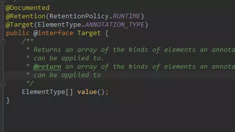

我们可以通过以下的方式来为这个 value 传值：

```java
@Target(value = {ElementType.FIELD})
```

被这个 @Target 注解修饰的注解将只能作用在成员字段上，不能用于修饰方法或者类。其中，ElementType 是一个枚举类型，有以下一些值：

- ElementType.TYPE：允许被修饰的注解作用在类、接口和枚举上
- ElementType.FIELD：允许作用在属性字段上
- ElementType.METHOD：允许作用在方法上
- ElementType.PARAMETER：允许作用在方法参数上
- ElementType.CONSTRUCTOR：允许作用在构造器上
- ElementType.LOCAL_VARIABLE：允许作用在本地局部变量上
- ElementType.ANNOTATION_TYPE：允许作用在注解上
- ElementType.PACKAGE：允许作用在包上

@Retention 用于指明当前注解的生命周期，它的基本定义如下：

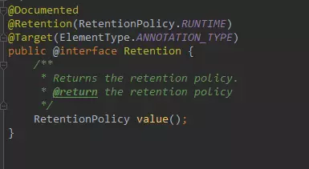

同样的，它也有一个 value 属性：

```java
@Retention(value = RetentionPolicy.RUNTIME
```

这里的 RetentionPolicy 依然是一个枚举类型，它有以下几个枚举值可取：

- RetentionPolicy.SOURCE：当前注解编译期可见，不会写入 class 文件
- RetentionPolicy.CLASS：类加载阶段丢弃，会写入 class 文件
- RetentionPolicy.RUNTIME：永久保存，可以反射获取

@Retention 注解指定了被修饰的注解的生命周期，一种是只能在编译期可见，编译后会被丢弃，一种会被编译器编译进 class 文件中，无论是类或是方法，乃至字段，他们都是有属性表的，而 JAVA 虚拟机也定义了几种注解属性表用于存储注解信息，但是这种可见性不能带到方法区，类加载时会予以丢弃，最后一种则是永久存在的可见性。

剩下两种类型的注解我们日常用的不多，也比较简单，这里不再详细的进行介绍了，你只需要知道他们各自的作用即可。@Documented 注解修饰的注解，当我们执行 JavaDoc 文档打包时会被保存进 doc 文档，反之将在打包时丢弃。@Inherited 注解修饰的注解是具有可继承性的，也就说我们的注解修饰了一个类，而该类的子类将自动继承父类的该注解。

### Java的内置三大注解

除了上述四种元注解外，JDK 还为我们预定义了另外三种注解，它们是：

- @Override
- @Deprecated
- @SuppressWarnings

@Override 注解想必是大家很熟悉的了，它的定义如下：

```java
@Target(ElementType.METHOD)
@Retention(RetentionPolicy.SOURCE)
public @interface Override {
}
```

它没有任何的属性，所以并不能存储任何其他信息。它只能作用于方法之上，编译结束后将被丢弃。

所以你看，它就是一种典型的『标记式注解』，仅被编译器可知，编译器在对 java 文件进行编译成字节码的过程中，一旦检测到某个方法上被修饰了该注解，就会去匹对父类中是否具有一个同样方法签名的函数，如果不是，自然不能通过编译。

@Deprecated 的基本定义如下：

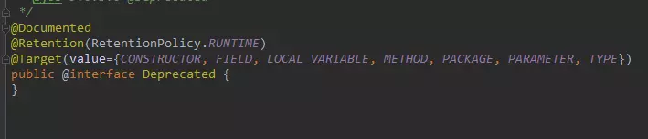

依然是一种『标记式注解』，永久存在，可以修饰所有的类型，作用是，标记当前的类或者方法或者字段等已经不再被推荐使用了，可能下一次的 JDK 版本就会删除。

当然，编译器并不会强制要求你做什么，只是告诉你 JDK 已经不再推荐使用当前的方法或者类了，建议你使用某个替代者。

@SuppressWarnings 主要用来压制 java 的警告，它的基本定义如下：

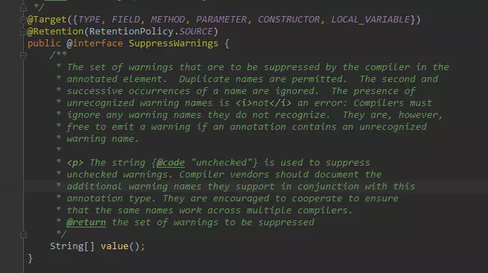

它有一个 value 属性需要你主动的传值，这个 value 代表一个什么意思呢，这个 value 代表的就是需要被压制的警告类型。例如：

```java
public static void main(String[] args) {
    Date date = new Date(2018, 7, 11);
}
```

这么一段代码，程序启动时编译器会报一个警告。

```java
Warning:(8, 21) java: java.util.Date 中的 Date(int,int,int) //已过时
```

而如果我们不希望程序启动时，编译器检查代码中过时的方法，就可以使用 @SuppressWarnings 注解并给它的 value 属性传入一个参数值来压制编译器的检查。

```java
@SuppressWarning(value = "deprecated")
public static void main(String[] args) {
    Date date = new Date(2018, 7, 11);
}
```

这样你就会发现，编译器不再检查 main 方法下是否有过时的方法调用，也就压制了编译器对于这种警告的检查。

当然，JAVA 中还有很多的警告类型，他们都会对应一个字符串，通过设置 value 属性的值即可压制对于这一类警告类型的检查。

自定义注解的相关内容就不再赘述了，比较简单，通过类似以下的语法即可自定义一个注解。

```java
public @interface InnotationName{
    
}
```

当然，自定义注解的时候也可以选择性的使用元注解进行修饰，这样你可以更加具体的指定你的注解的生命周期、作用范围等信息。

### 注解的使用

#### 定义注解类
@Overrid：作用在方法上的注解，当方法不是重写父类的方法时会报错
@Deprecated：作用在方法伤害，标记该方法为作废方法（已过时）
@SuppressWarnings：作用在方法上，压制警告

定义注解使用@interface
public @interface MyAnn{}
所有的注解都是Annotation的子类

#### 使用注解

* 注解的作用目标：
  * 类（接口、枚举）
  * 属性
  * 方法
  * 构造器
  * 参数
  * 局部变量
  * 包

#### 注解的属性
* 定义属性
    * 格式：类型 属性名()

* 使用注解时给属性赋值
    * @MyAnno1(age=100,name="zhangSan")

* 注解属性的默认值：在定义注解时，可以给注解指定默认值
    * int age() default 100;
    * 在使用注解时，可以不给带有默认值的属性赋值

* 名为value的属性的特权
    * 当使用注解时，如果只给名为value的属性赋值时，可以省略"value="
        * 例如：@MyAnno1(value="hello"),可以书写成 @MyAnno1("hello")

* 注解属性的类型
    * 8种基本类型
    * String
    * Enum
    * Class
    * 注解类型
    * 以上类型的一维数组类型
    * 当给数组类型的属性赋值时，若数组元素的个数为1时，可以省略大括号

    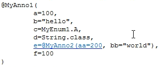

    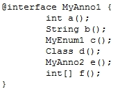
#### 注解的作用目标限定以及保存策略限定
* 让一个注解，它的作用目标只能在类上，不能再方法上，这就叫作用目标的限定
    * 再定义注解时，给注解添加注解，这个注解是@Target
      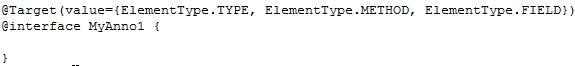
* 保留策略
    * 源代码文件(SOURCE)：只在源代码种存在，当编译时就被忽略了
    * 字节码文件(CLASS)：注解在源代码中存在，然后编译时会把注解信息放到class文件，但jvm在加载类时，会忽略注解
    * JVM中(RUNTIME)：注解在源代码、字节码文件中存在，并且在JVM加载类时，会把注解加载到JVM内存中（它是唯一可反射注解)
      限定注解的保留策略：使用Retention
      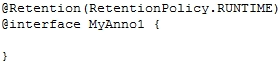

## 注解与反射

「注解的本质就是一个继承了 Annotation 接口的接口」，现在我们就来从虚拟机的层面看看，注解的本质到底是什么。

首先，我们自定义一个注解类型：

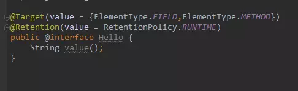

这里我们指定了 Hello 这个注解只能修饰字段和方法，并且该注解永久存活，以便我们反射获取。

之前我们说过，虚拟机规范定义了一系列和注解相关的属性表，也就是说，无论是字段、方法或是类本身，如果被注解修饰了，就可以被写进字节码文件。属性表有以下几种：

- RuntimeVisibleAnnotations：运行时可见的注解
- RuntimeInVisibleAnnotations：运行时不可见的注解
- RuntimeVisibleParameterAnnotations：运行时可见的方法参数注解
- RuntimeInVisibleParameterAnnotations：运行时不可见的方法参数注解
- AnnotationDefault：注解类元素的默认值

给大家看虚拟机的这几个注解相关的属性表的目的在于，让大家从整体上构建一个基本的印象，注解在字节码文件中是如何存储的。

所以，对于一个类或者接口来说，Class 类中提供了以下一些方法用于反射注解。

- getAnnotation：返回指定的注解
- isAnnotationPresent：判定当前元素是否被指定注解修饰
- getAnnotations：返回所有的注解
- getDeclaredAnnotation：返回本元素的指定注解
- getDeclaredAnnotations：返回本元素的所有注解，不包含父类继承而来的

方法、字段中相关反射注解的方法基本是类似的，这里不再赘述，我们下面看一个完整的例子。

首先，设置一个虚拟机启动参数，用于捕获 JDK 动态代理类。

```java
-Dsun.misc.ProxyGenerator.saveGeneratedFiles=true
```

然后 main 函数。

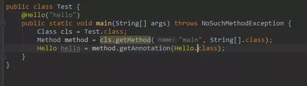

我们说过，注解本质上是继承了 Annotation 接口的接口，而当你通过反射，也就是我们这里的 getAnnotation 方法去获取一个注解类实例的时候，其实 JDK 是通过动态代理机制生成一个实现我们注解（接口）的代理类。

我们运行程序后，会看到输出目录里有这么一个代理类，反编译之后是这样的：

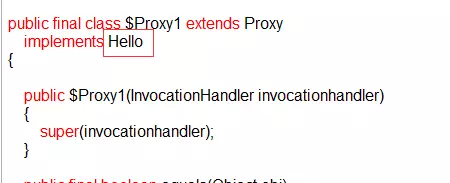

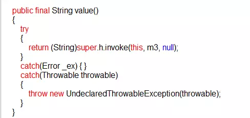

代理类实现接口 Hello 并重写其所有方法，包括 value 方法以及接口 Hello 从 Annotation 接口继承而来的方法。

而这个关键的 InvocationHandler 实例是谁？

AnnotationInvocationHandler 是 JAVA 中专门用于处理注解的 Handler， 这个类的设计也非常有意思。

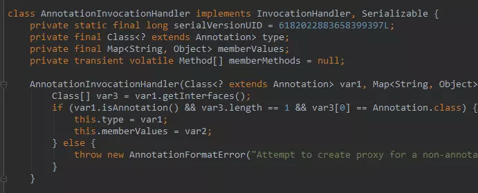

这里有一个 memberValues，它是一个 Map 键值对，键是我们注解属性名称，值就是该属性当初被赋上的值。

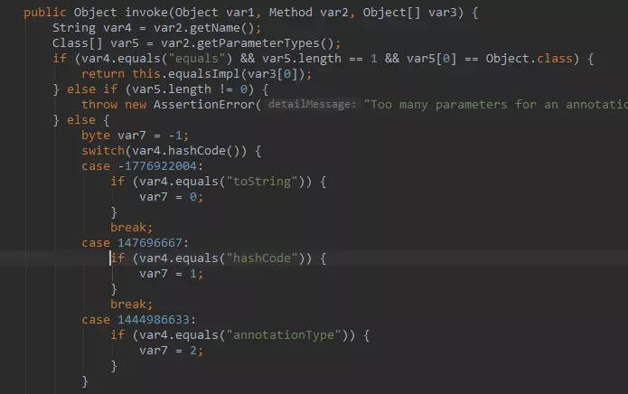

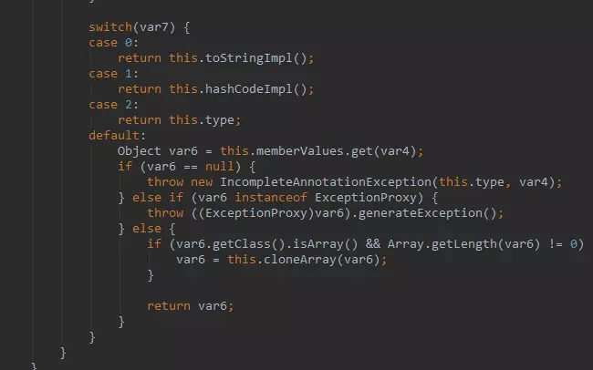

而这个 invoke 方法就很有意思了，大家注意看，我们的代理类代理了 Hello 接口中所有的方法，所以对于代理类中任何方法的调用都会被转到这里来。

var2 指向被调用的方法实例，而这里首先用变量 var4 获取该方法的简明名称，接着 switch 结构判断当前的调用方法是谁，如果是 Annotation 中的四大方法，将 var7 赋上特定的值。

如果当前调用的方法是 toString，equals，hashCode，annotationType 的话，AnnotationInvocationHandler 实例中已经预定义好了这些方法的实现，直接调用即可。

那么假如 var7 没有匹配上这四种方法，说明当前的方法调用的是自定义注解字节声明的方法，例如我们 Hello 注解的 value 方法。**这种情况下，将从我们的注解 map 中获取这个注解属性对应的值。**

其实，JAVA 中的注解设计个人觉得有点反人类，明明是属性的操作，非要用方法来实现。当然，如果你有不同的见解，欢迎留言探讨。

最后我们再总结一下整个反射注解的工作原理：

首先，我们通过键值对的形式可以为注解属性赋值，像这样：@Hello（value = "hello"）。

接着，你用注解修饰某个元素，编译器将在编译期扫描每个类或者方法上的注解，会做一个基本的检查，你的这个注解是否允许作用在当前位置，最后会将注解信息写入元素的属性表。

然后，当你进行反射的时候，虚拟机将所有生命周期在 RUNTIME 的注解取出来放到一个 map 中，并创建一个 AnnotationInvocationHandler 实例，把这个 map 传递给它。

最后，虚拟机将采用 JDK 动态代理机制生成一个目标注解的代理类，并初始化好处理器。

那么这样，一个注解的实例就创建出来了，它本质上就是一个代理类，你应当去理解好 AnnotationInvocationHandler 中 invoke 方法的实现逻辑，这是核心。一句话概括就是，**通过方法名返回注解属性值**。

## Java8中注解增强

### 元注解@Repeatable

元注解@Repeatable是JDK1.8新加入的，它表示在同一个位置重复相同的注解。在没有该注解前，一般是无法在同一个类型上使用相同的注解的

```java
//Java8前无法这样使用
@FilterPath("/web/update")
@FilterPath("/web/add")
public class A {}
```

Java8前如果是想实现类似的功能，我们需要在定义@FilterPath注解时定义一个数组元素接收多个值如下

```java
@Target(ElementType.TYPE)
@Retention(RetentionPolicy.RUNTIME)
public @interface FilterPath {
    String [] value();
}

//使用
@FilterPath({"/update","/add"})
public class A { }
```

但在Java8新增了@Repeatable注解后就可以采用如下的方式定义并使用了

```java
package com.zejian.annotationdemo;

import java.lang.annotation.*;

//使用Java8新增@Repeatable原注解
@Target({ElementType.TYPE,ElementType.FIELD,ElementType.METHOD})
@Retention(RetentionPolicy.RUNTIME)
@Repeatable(FilterPaths.class)//参数指明接收的注解class
public @interface FilterPath {
    String  value();
}

@Target(ElementType.TYPE)
@Retention(RetentionPolicy.RUNTIME)
@interface FilterPaths {
    FilterPath[] value();
}

//使用案例
@FilterPath("/web/update")
@FilterPath("/web/add")
@FilterPath("/web/delete")
class AA{ }
```

我们可以简单理解为通过使用@Repeatable后，将使用@FilterPaths注解作为接收同一个类型上重复注解的容器，而每个@FilterPath则负责保存指定的路径串。为了处理上述的新增注解，Java8还在AnnotatedElement接口新增了getDeclaredAnnotationsByType() 和 getAnnotationsByType()两个方法并在接口给出了默认实现，在指定@Repeatable的注解时，可以通过这两个方法获取到注解相关信息。但请注意，旧版API中的getDeclaredAnnotation()和 getAnnotation()是不对@Repeatable注解的处理的(除非该注解没有在同一个声明上重复出现)。注意getDeclaredAnnotationsByType方法获取到的注解不包括父类，其实当 getAnnotationsByType()方法调用时，其内部先执行了getDeclaredAnnotationsByType方法，只有当前类不存在指定注解时，getAnnotationsByType()才会继续从其父类寻找，但请注意如果@FilterPath和@FilterPaths没有使用了@Inherited的话，仍然无法获取。下面通过代码来演示：

```java
//使用Java8新增@Repeatable原注解
@Target({ElementType.TYPE,ElementType.FIELD,ElementType.METHOD})
@Retention(RetentionPolicy.RUNTIME)
@Repeatable(FilterPaths.class)
public @interface FilterPath {
    String  value();
}


@Target(ElementType.TYPE)
@Retention(RetentionPolicy.RUNTIME)
@interface FilterPaths {
    FilterPath[] value();
}

@FilterPath("/web/list")
class CC { }

//使用案例
@FilterPath("/web/update")
@FilterPath("/web/add")
@FilterPath("/web/delete")
class AA extends CC{
    public static void main(String[] args) {

        Class<?> clazz = AA.class;
        //通过getAnnotationsByType方法获取所有重复注解
        FilterPath[] annotationsByType = clazz.getAnnotationsByType(FilterPath.class);
        FilterPath[] annotationsByType2 = clazz.getDeclaredAnnotationsByType(FilterPath.class);
        if (annotationsByType != null) {
            for (FilterPath filter : annotationsByType) {
                System.out.println("1:"+filter.value());
            }
        }

        System.out.println("-----------------");

        if (annotationsByType2 != null) {
            for (FilterPath filter : annotationsByType2) {
                System.out.println("2:"+filter.value());
            }
        }


        System.out.println("使用getAnnotation的结果:"+clazz.getAnnotation(FilterPath.class));


        /**
         * 执行结果(当前类拥有该注解FilterPath,则不会从CC父类寻找)
         1:/web/update
         1:/web/add
         1:/web/delete
         -----------------
         2:/web/update
         2:/web/add
         2:/web/delete
         使用getAnnotation的结果:null
         */
    }
}
```

从执行结果来看如果当前类拥有该注解@FilterPath,则getAnnotationsByType方法不会从CC父类寻找，下面看看另外一种情况，即AA类上没有@FilterPath注解

```java
//使用Java8新增@Repeatable原注解
@Target({ElementType.TYPE,ElementType.FIELD,ElementType.METHOD})
@Retention(RetentionPolicy.RUNTIME)
@Inherited //添加可继承元注解
@Repeatable(FilterPaths.class)
public @interface FilterPath {
    String  value();
}


@Target(ElementType.TYPE)
@Retention(RetentionPolicy.RUNTIME)
@Inherited //添加可继承元注解
@interface FilterPaths {
    FilterPath[] value();
}

@FilterPath("/web/list")
@FilterPath("/web/getList")
class CC { }

//AA上不使用@FilterPath注解,getAnnotationsByType将会从父类查询
class AA extends CC{
    public static void main(String[] args) {

        Class<?> clazz = AA.class;
        //通过getAnnotationsByType方法获取所有重复注解
        FilterPath[] annotationsByType = clazz.getAnnotationsByType(FilterPath.class);
        FilterPath[] annotationsByType2 = clazz.getDeclaredAnnotationsByType(FilterPath.class);
        if (annotationsByType != null) {
            for (FilterPath filter : annotationsByType) {
                System.out.println("1:"+filter.value());
            }
        }

        System.out.println("-----------------");

        if (annotationsByType2 != null) {
            for (FilterPath filter : annotationsByType2) {
                System.out.println("2:"+filter.value());
            }
        }


        System.out.println("使用getAnnotation的结果:"+clazz.getAnnotation(FilterPath.class));


        /**
         * 执行结果(当前类没有@FilterPath,getAnnotationsByType方法从CC父类寻找)
         1:/web/list
         1:/web/getList
         -----------------
         使用getAnnotation的结果:null
         */
    }
}
```

注意定义@FilterPath和@FilterPath时必须指明@Inherited，getAnnotationsByType方法否则依旧无法从父类获取@FilterPath注解，这是为什么呢，不妨看看getAnnotationsByType方法的实现源码：

```java
//接口默认实现方法
default <T extends Annotation> T[] getAnnotationsByType(Class<T> annotationClass) {
//先调用getDeclaredAnnotationsByType方法
T[] result = getDeclaredAnnotationsByType(annotationClass);

//判断当前类获取到的注解数组是否为0
if (result.length == 0 && this instanceof Class && 
//判断定义注解上是否使用了@Inherited元注解 
 AnnotationType.getInstance(annotationClass).isInherited()) { // Inheritable
        //从父类获取
       Class<?> superClass = ((Class<?>) this).getSuperclass();
   if (superClass != null) {
      result = superClass.getAnnotationsByType(annotationClass);
       }
   }

   return result;
}
```

### 新增的两种ElementType

在Java8中 ElementType 新增两个枚举成员，TYPE_PARAMETER 和 TYPE_USE ，在Java8前注解只能标注在一个声明(如字段、类、方法)上，Java8后，新增的TYPE_PARAMETER可以用于标注类型参数，而TYPE_USE则可以用于标注任意类型(不包括class)。如下所示

```java
//TYPE_PARAMETER 标注在类型参数上
class D<@Parameter T> { }

//TYPE_USE则可以用于标注任意类型(不包括class)
//用于父类或者接口
class Image implements @Rectangular Shape { }

//用于构造函数
new @Path String("/usr/bin")

//用于强制转换和instanceof检查,注意这些注解中用于外部工具，它们不会对类型转换或者instanceof的检查行为带来任何影响。
String path=(@Path String)input;
if(input instanceof @Path String)

//用于指定异常
public Person read() throws @Localized IOException.

//用于通配符绑定
List<@ReadOnly ? extends Person>
List<? extends @ReadOnly Person>

@NotNull String.class //非法，不能标注class
import java.lang.@NotNull String //非法，不能标注import
```

这里主要说明一下TYPE_USE，类型注解用来支持在Java的程序中做强类型检查，配合第三方插件工具（如Checker Framework），可以在编译期检测出runtime error（如UnsupportedOperationException、NullPointerException异常），避免异常延续到运行期才发现，从而提高代码质量，这就是类型注解的主要作用。总之Java 8 新增加了两个注解的元素类型ElementType.TYPE_USE 和ElementType.TYPE_PARAMETER ，通过它们，我们可以把注解应用到各种新场合中。

参考博文：

[深入理解Java注解类型(@Annotation)](https://blog.csdn.net/javazejian/article/details/71860633)（Java8中注解增强）

[JAVA 注解的基本原理](https://juejin.im/post/5b45bd715188251b3a1db54f)

推荐博文：

[深入浅出Java注解](https://www.jianshu.com/p/5cac4cb9be54)


