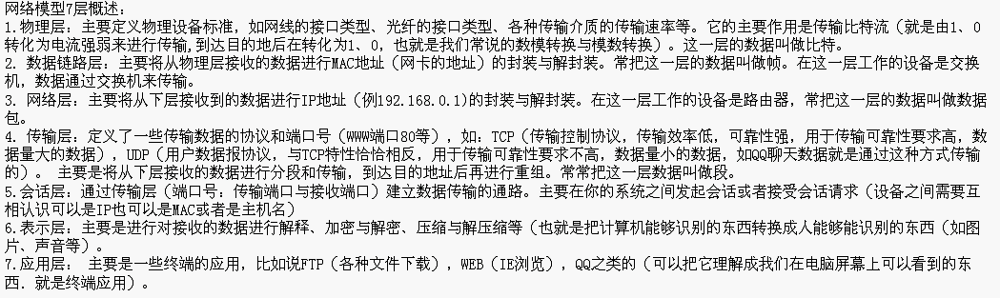
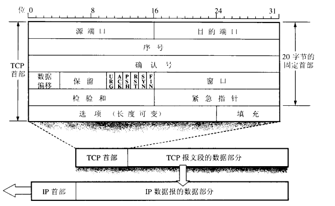

# 网络编程概述

**计算机网络**

是指将地理位置不同的具有独立功能的多台计算机及其外部设备，通过通信线路连接起来，在网络操作系统，网络管理软件及网络通信协议和协调下，实现资源共享和信息传递的计算机系统

计算机网络的主要功能：

资源共享

信息传输与集中处理

均衡负荷与分布处理

综合信息服务(www/综合业务数字网络 ISDN)

**网络编程**

就是用来实现网络互连的不同计算机上运行的程序间可以进行数据交换。Java语言对网络编程提供了良好的支持，通过其提供的接口我们可以很方便地进行网络编程

## 网络

### 什么是网络

**网络是几乎可以实时相互发送和接收数据的计算机和其他设备的集合。**网络通常用线缆连接，数据为转换为电磁波，通过线缆移动。不过，无线网络会通过无线电波传输数据，许多长距离的传输现在会用通过玻璃纤维发送可见光的光纤电缆来完成。

网络中的每台机器为一个节点（node）。大多数节点是计算机，但是打印机、路由器、网桥、网关、ATM机也都是节点。每个网络节点都有地址 (address)，这是用于唯一标识节点的一个字节序列。每个地址中的字节越多，可用的地址就越多，就可以有更多的设备同时连入网络。

不同的网络会以不同的方式分配地址。以太网（Ethernet）地址与物理以太网硬件关联。以太网硬件的生产厂家使用预分配的厂商编码确保他们的硬件地址或与其他厂家的硬件地址不冲突。每家厂商都要负责保证不会生产出两块地址相同的以太网卡。

所有现代计算机网络都是包交换（分组交换）网络：**流经网络的数据分割成小块，称为包（packet,也称分组），每个包都单独加以处理。每个包都包含了由谁发送和将发往何处的信息。**

计算机来回传递数据时还有另一个重要的一个点，那就是协议，**协议（protocol）是定义计算机如何通信的一组明确的规则：包括地址格式、数据如何分包等**。针对网络通信的不同方面，定义有很多不同的协议。例如：Hypertext Transfer Protocol(HTTP)。

### 网络通信协议及接口

**网络模型**

计算机网络之间以何种规则进行通信，就是网络模型研究问题

网络模型一般是指：

OSI(Open System Interconnection开放系统互连)参考模型

TCP/IP参考模型

**网络通信协议**

计算机网络中实现通信必须有一些约定，即通信协议；包括对速率，传输代码，代码结构，传输控制步骤，出错控制等制定的标准。

网络通信接口：

为了使两个节点之间能进行对话，必须在他们之间建立通信工具（即接口），使彼此之间，能进行信息交换。接口包括两部分：

- 硬件装置：实现结点之间的信息传送
- 软件装置：规定双方进行通信的约定协议

### 通信协议分层思想

通过网络发送数据是一项复杂的操作，必须仔细地协调网络的物理特性以及所发送数据的路基特征。为了对应用程序开发人员和最终用户隐藏这种复杂性，网络通信的不同方面被分解为多个层。每一层表示为物理硬件（即线缆和电流）与所传输信息之间的不同抽象层次。在理论上，每一层只与紧挨其上和其下的层对话。将网络分层，这样就可以修改甚至替换某一层的软件，只要层与层之间的接口保持不变，就不会影响到其他层。

**为什么要分层：**

由于结点之间联系很复杂，在制定协议时，把复杂成份分解成一些简单的成份，再将它们复合起来。最常用的复合方式就是层次方式，及同层间可以通信，上一层可以调用下一层，而与再下一层不发生关系。各层互不影响，利于系统的开发和扩展。

**通信协议的分层规定：**

把用户应用程序作为最高层，把物理通信线路作为最底层，将其间的协议处理分为若干层，规定每层处理的任务，也规定每层的接口标准。


上面的图显示了网络中可能存在的协议栈。

#### 四层分层

有几种不同的分层模型，分别适合特定类型网络的需要。我这边主要介绍适用于Internet的标准TCP/IP四层模型，如下图所示：


**主机网络层**

主机网络层定义了一个特定的网络接口（如以太网或WiFi天线）如何通过物理连接向本地网络或世界其他地方发送IP数据报。主机网络层中，由连接不同计算机的硬件（线缆、光纤电缆、无线电波或烟信号）组成的部分有时称为网络的物理层。Java程序员不需要担心这一层，除非出现了问题，比如插头从计算机后面掉了下来，或者有人挖断了你与外部世界之间的T-1线。换句话说，Java从来都看不到物理层。

**网际层**

网际层主机网络层的下一层，这也是作为Java程序员需要考虑的第一层，网际层协议定义了数据位和字节如何组织为更大的分组，称为包，还定义了寻址机制，不同计算机要按这个寻址机制查找对方。网际协议（IP）是世界上使用最广泛的网际层协议，也是Java唯一理解的网际层协议。

网际协议主要是两个协议：IPV4和IPV6，IPV4使用32位地址，IPV6使用128位地址，另外还增加了一些技术特性来帮助完成路由。这是两个完全不同的网络协议，如果没有特殊的网关/或隧道协议，即使在相同的网络上它们也无法做到互操作，不过Java几乎对你隐藏了所有这些区别。

除了路由和寻址，网际层的第二个作用是支持不同类型的主机网络层相互对话。Internet路由器会完成WiFi和Ethernet、Ethernet和DSL、DSL和光纤往返等协议之间的转换。如果没有网际层或类似的分层，则每个计算机只能与同一类网络上的其他计算机对话。网际层负责使用同够协议将异构网络相互连接。

**传输层**

原始数据报有一些缺点。最显著的缺点是不能保证可靠传送，即使能传送也可能在传输中遭到破坏。首部校验只能检测首部中的破坏情况，而不能检测数据报中的数据部分。最后即使数据报能到底目的地而未被破坏，也不一定会以发送时的顺序到达。

传输层（transport layer）负责确保各包以发送的顺序接收，并保证没有数据丢失或破坏。如果丢包，传输层会请求发送方重传这个包。为实现这个目标，IP网络会给每个数据报添加一个附加首部，其中包含有更多信息。

这一层上主要有两个协议。第一个是传输控制协议（Transmission Control Protocol，TCP），这是一个开销很高的协议，支持对丢失或破坏的数据进行重传，并按照发送时的顺序进行传送。第二个协议是用户数据报协议（User Datagram Protocol ，UDP），它允许接收方检测被破坏的包，但不保证这些包以正确的顺序传送（或者包有可能根本未传送）。但是，UDP通常比TCP快。TCP称为可靠（reliable）协议；UDP是不可靠（unreliable）协议。

**应用层**

向用户传送数据的层称为应用层（application layer）。它下面的三层共同定义了数据如何从一台计算机传输到另一台计算机。应用层确定了数据传输后的操作。有用户Web的HTTP，还有用户电子邮件的SMTP、POP、IMAP、；用于文件传输的FTP、FSP、TFTP，用于文件访问的NFS；用于文件共享的Gnutella和BitTorrent；用于语音通信的会话启动协议（Session Initiation Protocol，SIP）和Skype等。此外你的程序可以在必要时定义自己的应用层协议。

**IP、TCP、UDP**

IP设计为允许任意两点之间有多个路由，可以绕过被破坏的路由器实现数据包的路由。由于两点间存在多个路由，并且两点间的最短路径可能由于网络业务流量或其他因素而随时间改变，所以构成某个特定数据流的包可能不会采用相同的路由。另外，即使它们全部到达，也可能不会以发送的顺序到达。为了改进这种基本机制，将TCP置于IP之上，使连接的两端能够确认接收IP包，以及请求重传丢失或被破坏的包。此外，TCP允许接收端的包按发送时的顺序重新组合在一起。

不过，TCP会有很大的开销。因此，如果有些情况丢失个别包不会完全破坏数据的话，也可以使用UDP发送数据包，而不需要TCP提供保证。UDP是不可靠协议，它不能保证包一定会到达目的地，也不保证包会以发送时的相同顺序到达。但是它开销小，速度快，也可以在应用层的UDP数据流中建立纠错码，来解决数据丢失问题。

可以在IP之上运行很多其他协议。但是Java支持的协议只有TCP和UDP，以及建立在TCP和UDP之上的应用层协议。所有其他传输层、网际层和更底层的协议，如ICMP、IGMP、ARP、RARP、RSVP和其他洗衣在Java程序中都只能通过连接到原生代码来实现。

**IP地址和域名**

IPv4网络中的每台计算机都有一个4字节的数字标识。一般写为点分四段格式，如192.1.32.90，这4个数中，每个数都是一个无符号字节，范围从0到255。IPv4网络中的每台计算机都有一个唯一的4节地址。当数据通过网络传输时，包的首部会包括要发往的机器地址（目的地址）和发送这个包的机器地址（源地址）。沿路的路由器通过检查目的地址来选择发送数据包的最佳路由。包括源地址是为了让接收方知道要向谁回复。

虽然计算机可以轻松地处理数字，但人类对于记忆数字却不在行。因此开发了域名系统（Domain Name System，DNS）用来将人类易于记忆的主机名（如www.12345.com）转换为数字Internet地址（如208.201.243.99）。当Java程序访问网络时，他们需要同时处理数字地址和相应的主机名。这些方法由java.net.InetAddress类提供。

**端口**

如果每台计算机一次只做一件事情，那么地址可能就足够了。但是，现代计算机同时要做很多不同的事情。电子邮件需要与FTP请求分开，而FTP又要与Web业务流分开。这是通过端口（port）实现的。每台有IP地址的计算机都有几千个逻辑端口（确切地讲，每个传输层协议有65535个端口）。这些只是计算机内存中的抽象，不表示任何物理实物，与USB端口不同。每个端口由1到65535之间的一个数字标识。每个端口可以分配给一个特定的服务。

**防火墙**

Internet上有些顽皮的人。为了把他们关在门外，在本地网络建立一个访问点，检查所有进出该访问点的业务流通常很有用。位于Internet和本地网络之间的一些硬件和软件会检查所有进出的数据，以保证其合法性，这就称为防火墙（firewall）。防火墙通常是将本地网络连接到更大的Internet的路由器的一部分，还可以完成其他任务，如网络地址转换。此外，防火墙也可以是单独的机器。防火墙主要还是负责检查传入或传出其网络接口的各个包，根据一组规则接收或拒绝这些包。

过滤通常是基于网络地址和端口的。Java与防火墙没有太大关系，除非防火墙总是碍你事。

#### 七层模型





### IP协议

IP协议是网络层的主要协议，支持网间互连的数据报通信，它提供主要功能由：

* 无连接数据报传送
* 数据报路由选择和差错控制


**IP地址**

每个人的电脑都有一个独一无二的IP地址，这样互相通信时就不会传错信息了。

IP地址是用一个点来分成四段的，在计算机内部IP地址是用四个字节来表示的，一个字节代表一段，每一个字节代表的数最大只能到达255。

要想让落网中的计算机能够互相通信，必须为每台计算机指定一个标识号，通过这个标识号来指定要接受数据的计算机和识别发送的计算机，在TCP/IP协议中，这个标识号就是IP地址


**IP地址的组成：网络号段+主机号段**

A类：第一号段为网络号段+后三段的主机号段

一个网络号：256*256*256=16777216

B类：前二号段为网络号段+后二段的主机号段

一个网络号：256*256=65536

C类：前三号段为网络号段+后一段的主机号段

一个网络号：256

IP地址的分类：

A类：1.0.0.1---127.255.255.254-->(1)10.x.x.x是私有地址(私有地址就是在互联网上不使用，而被用在局域网络中的地址)

B类：128.0.0.1---191.255.255.254 172.16.0.0---172.31.255.255是私有地址。169.254.x.x是保留地址

C类：192.0.0.1---223.255.255.254 192.168.x.x是私有地址

D类：224.0.0.1---239.255.255.254

E类：240.0.0.1---247.255.255.254


### 端口

**端口号**

物理端口：网卡口

逻辑端口：

* 每个网络都会至少有一个逻辑端口
* 用于标识进程的逻辑地址，不同进程的标识
* 有效端口：0-65535，其中0-1024系统使用或保留端口

**查看端口**

- 用命令提示符cmd查看所有端口：netstat -ano
- 查看具体程序：使用任务管理器查看PID

### URL

**URI=URL+URN**

URI：Uniform Resource Identifier ，统一资源标志符。
URL：Uniform Resource Locator，统一资源定位符。
URN：Uniform Resource Name，统一资源命名。

网络三大基石：HTML，HTTP，URL

- 在www上，每一信息资源都有统一且唯一的地址，即统一资源定位符。Uniform Resource Locator。
  如：https://localhost:8080/index.html ，有4部分组成。（协议，主机域名或IP，端口号，资源文件名）

#### URL类

**构造方法摘要**

```java
URL(String spec)
//根据 String 表示形式创建 URL 对象。

URL(String protocol, String host, int port, String file)
//根据指定 protocol、host、port 号和 file 创建 URL 对象。

URL(String protocol, String host, String file)
//根据指定的 protocol 名称、host 名称和 file 名称创建 URL。
```

**常用方法摘要**

```java
String getAuthority()
//获取此 URL 的授权部分。

int getDefaultPort()
//获取与此 URL 关联协议的默认端口号。

String getFile()
//获取此 URL 的文件名。

String getHost()
//获取此 URL 的主机名（如果适用）。

String getPath()
//获取此 URL 的路径部分。

int getPort()
//获取此 URL 的端口号。

String getUserInfo()
//获取此 URL 的 userInfo 部分。
```

**案例：**

```java
import java.net.MalformedURLException;
import java.net.URL;

public class TestURL {
    public static void main(String[] args) throws MalformedURLException {

        URL url2 = new URL("https://www.bilibili.com/");
        
        //获取此的授权部分 URL 。
        System.out.println(url2.getAuthority());

        //获取此 URL的文件名。
        System.out.println(url2.getFile());

        //获取端口
        System.out.println(url2.getPort());

        //获取主机
        System.out.println(url2.getHost());

        //获得默认端口
        System.out.println(url2.getDefaultPort());

        //获得路径
        System.out.println(url2.getPath());

        //获取该 URL的userInfo部分。
        System.out.println(url2.getUserInfo());
    }
}
```

### HTTP协议

HTTP，超文本传输协议，英文全称是Hypertext Transfer Protocol，它是互联网上应用最为广泛的一种网络协议。HTTP是一种应用层协议，它是基于TCP协议之上的请求/响应式的协议，即一个客户端与服务器建立连接后，向服务器发送一个请求；服务器接到请求后，给予相应的响应信息。HTTP协议默认的端口号为80.

现在使用的HTTP协议是HTTP/1.1版本，1997年之前采用的是HTTP1.0版本。HTTP连接在1.0版本中采用非持续连接工作方式，1.1版本采用的是持续连接工作方式，持续连接是指服务器在发送响应后仍然在一段时间内保持这条由TCP运输层协议建立起来的连接，使客户机和服务器可以继续在这条连接上传输HTTP报文。

是否采用持续连接工作方式，1.0中默认是关闭的，需要在HTTP头加入"Connection:Keep-Alive"，才能启用Keep-Alive。HTTP1.1中默认启用Keep-Alive，如果加入"Connection:close"，才关闭。目前大部分浏览器都是用HTTP1.1协议，也就是说默认都会发起Keep-Alive的连接请求了，所以是否能完成一个完整的Keep- Alive连接就看服务器设置情况。

#### HTTP报文

HTTP协议是基于TCP协议之上的请求/响应式协议，下面主要介绍HTTP报文的格式，HTTP报文主要有请求报文和响应报文两种。首先看请求报文的格式：


HTTP请求报文由请求行、首部行和实体主体组成，由浏览器发送给服务器。上面这张图中SP表示空格，cr lf表示回车和换行。


上面这张图是HTTP响应报文，它由状态行、首部行和实体主体组成。下面两张图是在谷歌浏览器内访问服务器查看的HTTP请求和响应。


#### HTTP请求方法和响应状态码

在上面的HTTP请求报文例子中，我们可以看到请求方法是GET，这表示请求读取由URL所标志的信息，除了GET，还有其它几种常用的方法。


在HTTP响应报文的例子中，我们可以看到状态码是200，表示响应成功。下表是其它状态码，总共5大类，33种。


#### HTTPS和HTTP的区别

HTTPS（全称：Hyper Text Transfer Protocol over Secure Socket Layer），是以安全为目标的HTTP通道，简单讲是HTTP的安全版。即HTTP下加入SSL层，HTTPS的安全基础是SSL，因此加密的详细内容就需要SSL。它是一个URI scheme（抽象标识符体系），句法类同http:体系。用于安全的HTTP数据传输。https:URL表明它使用了HTTP，但HTTPS存在不同于HTTP的默认端口及一个加密/身份验证层（在HTTP与TCP之间）。

超文本传输协议HTTP协议被用于在Web浏览器和网站服务器之间传递信息。HTTP协议以明文方式发送内容，不提供任何方式的数据加密，如果攻击者截取了Web浏览器和网站服务器之间的传输报文，就可以直接读懂其中的信息，因此HTTP协议不适合传输一些敏感信息，比如信用卡号、密码等。

为了解决HTTP协议的这一缺陷，需要使用另一种协议：安全套接字层超文本传输协议HTTPS。为了数据传输的安全，HTTPS在HTTP的基础上加入了SSL协议，SSL依靠证书来验证服务器的身份，并为浏览器和服务器之间的通信加密。

HTTPS和HTTP的区别主要为以下四点：1、https协议需要到ca申请证书，一般免费证书很少，需要交费。2、http是超文本传输协议，信息是明文传输，https 则是具有安全性的ssl加密传输协议。3、http和https使用的是完全不同的连接方式，用的端口也不一样，前者是80，后者是443。4、http的连接很简单，是无状态的；HTTPS协议是由SSL+HTTP协议构建的可进行加密传输、身份认证的网络协议，比http协议安全。

### TCP协议与UDP协议

#### UDP：

UDP，用户数据报协议，英文全称是User Datagram Protocol，它是TCP/IP协议簇中无连接的运输层协议。

将数据源和目的封装成数据包中，不需要建立连接，每个数据报的大小在限制在64K，因无连接，是不可靠协议；不需要建立连接，速度快

##### UDP协议格式


UDP格式

从图中可以看到，UDP协议十分简单，它由两部分组成：首部和数据。其中，首部仅有8个字节，包括源端口和目的端口，长度（UDP用于数据报的长度）、校验和。

#### TCP：

TCP（Transmission Control Protocol ，传输控制协议）是面向连接的传输层协议。TCP层是位于IP层之上，应用层之下的中间层。不同主机的应用层之间经常需要可靠的、像管道一样的连接，但是IP层不提供这样的流机制，而是提供不可靠的包交换。TCP协议采用字节流传输数据。

TCP建立连接，形成传输数据的通道，在连接中进行大数据量传输，通过三次握手完成连接，是可靠协议；必须建立连接，效率会低

##### TCP报文段格式

TCP报文段包括协议首部和数据两部分，协议首部的固定部分有20个字节，首部的固定部分后面是选项部分。



**下面是报文段首部各个字段的含义。**

1. 源端口号以及目的端口号，各占2个字节，端口是传输层和应用层的服务接口，用于寻找发送端和接收端的进程，一般来讲，通过端口号和IP地址，可以唯一确定一个TCP连接，在网络编程中，通常被称为一个socket接口。
2. 序号，占4字节，用来标识从TCP发送端向TCP接收端发送的数据字节流。
3. 确认序号，占4字节，包含发送确认的一端所期望收到的下一个序号，因此，确认序号应该是上次已经成功收到数据字节序号加1.
4. 数据偏移，占4位，用于指出TCP首部长度，若不存在选项，则这个值为20字节，数据偏移的最大值为60字节。
5. 保留字段占6位，暂时可忽略，值全为0
6. 标志位
   URG（紧急） : 为1时表明紧急指针字段有效
   ACK（确认）：为1时表明确认号字段有效
   PSH（推送）：为1时接收方应尽快将这个报文段交给应用层
   RST（复位）：为1时表明TCP连接出现故障必须重建连接
   SYN（同步）：在连接建立时用来同步序号
   FIN （终止）： 为1时表明发送端数据发送完毕要求释放连接
7. 接收窗口占2个字节，用于流量控制和拥塞控制，表示当前接收缓冲区的大小。在计算机网络中，通常是用接收方的接收能力的大小来控制发送方的数据发送量。TCP连接的一端根据缓冲区大小确定自己的接收窗口值，告诉对方，使对方可以确定发送数据的字节数。
8. 校验和占2个字节，范围包括首部和数据两部分。
9. 选项是可选的，默认情况是不选。

##### 三次握手与四次挥手

TCP是面向连接的协议，因此每个TCP连接都有3个阶段：连接建立、数据传送和连接释放。连接建立经历三个步骤，通常称为“三次握手”。

TCP三次握手过程如下：


1. 第一次握手
   客户机发送连接请求报文段到服务器，并进入SYN_SENT状态，等待服务器确认。（SYN = 1,seq=x）
2. 第二次握手
   服务器收到连接请求报文，如果同意建立连接，向客户机发回确认报文段，并为该TCP连接分配TCP缓存和变量。(SYN=1,ACK=1,seq=y,ack=x+1)。
3. 第三次握手
   客户机收到服务器的确认报文段后，向服务器给出确认报文段，并且也要给该连接分配缓存和变量。此包发送完毕，客户端和服务器进入ESTABLISHED（TCP连接成功）状态，完成三次握手。(ACK=1,seq=x+1,ack=y+1)。

**TCP四次挥手过程如下：**


由于TCP连接是全双工的，因此每个方向都必须单独进行关闭。这原则是当一方完成它的数据发送任务后就能发送一个FIN来终止这个方向的连接。收到一个 FIN只意味着这一方向上没有数据流动，一个TCP连接在收到一个FIN后仍能发送数据。首先进行关闭的一方将执行主动关闭，而另一方执行被动关闭。

1. TCP客户端发送一个FIN，用来关闭客户到服务器的数据传送。
2. 服务器收到这个FIN，它发回一个ACK，确认序号为收到的序号加1。和SYN一样，一个FIN将占用一个序号。
3. 服务器关闭客户端的连接，发送一个FIN给客户端。
4. 客户端发回ACK报文确认，并将确认序号设置为收到序号加1。

#### 总结

TCP和UDP位于同一层，都是建立在IP层的基础之上。由于两台电脑之间有不同的IP地址，因此两台电脑就可以区分开来，也就可以互相通话了。通话一般有两种通话方式：第一种是TCP，第二种是UDP。TCP是可靠的连接，**TCP就像打电话，需要先打通对方电话，等待对方有回应后才会跟对方继续说话，也就是一定要确认可以发信息以后才会把信息发出去。TCP上传任何东西都是可靠的，只要两台机器上建立起了连接，在本机上发送的数据就一定能传到对方的机器上，UDP就好比发电报，发出去就完事了，对方有没有接收到它都不管，所以UDP是不可靠的。** TCP传送数据虽然可靠，但传送得比较慢，UDP传送数据不可靠，但是传送得快。

### InetAddress类

此类表示互联网协议 (IP) 地址。

常用方法摘要

```java
byte[] getAddress();
//返回此 InetAddress 对象的原始 IP 地址。
  
static InetAddress getByName(String host);
//在给定主机名的情况下确定主机的 IP 地址。

String getHostAddress();
//返回 IP 地址字符串（以文本表现形式）。

String getHostName();
//获取此 IP 地址的主机名。

static InetAddress getLocalHost();
//返回本地主机。

```

127.0.0.1：本机地址，主要用于测试。别名：Localhost
**案例：**

```java
import java.net.InetAddress;
import java.net.UnknownHostException;

public class TestIP {
    public static void main(String[] args) throws UnknownHostException {
        //InetAdress类表示IP地址

        //获取本机IP
        InetAddress ip = InetAddress.getLocalHost();
        System.out.println(ip);
        //获得主机名
        System.out.println(ip.getHostName());
        //获得IP地址
        System.out.println(ip.getHostAddress());
    }
}
```

```java
import java.net.InetAddress;
import java.net.UnknownHostException;

public class TestIP2 {
    public static void main(String[] args) throws UnknownHostException {
        InetAddress inetAddress = InetAddress.getByName("www.baidu.com");
        // 获取此 IP 地址的主机名。
        System.out.println(inetAddress.getHostName());
        //返回 IP 地址字符串（以文本表现形式）。
        System.out.println(inetAddress.getHostAddress());
    }
}
```

### 常见问题

1. OSI参考模型的分为哪几层，每层的功能？
   OSI，开放系统互连参考模型，它的7个层次自顶到下依次为应用层，表示层，会话层，传输层，网络层，数据链路层和物理层。各层的功能见文章开始。
2. TCP协议和UDP协议的区别？
   TCP协议是传输控制协议，UDP协议是用户数据报协议，两者都是传输层的协议，主要区别在于前者是可靠的，面向连接的协议，后者是不可靠的，无连接的协议。其它的区别还有，TCP协议传输速度慢，UDP常用于一次性传输比较少量数据的网络应用。
3. TCP三次握手为什么不能是两次?
   主要是防止两次握手情况下已经失效的连接请求报文段突然又传送到服务端而产生错误。例如，客户机A向服务器B发送TCP连接请求，第一个连接请求报文在网络的某个节点长时间滞留，A超时后认为报文丢失，于是再重传一次连接请求，B收到后建立连接。数据传输完毕后双方断开连接，而这时之前滞留的连接请求到达了服务端B，而B认为A又发来连接请求。如果两次握手建立连接，A并无连接请求，造成B的资源浪费。
4. HTTP请求的GET方法和POST方法的区别？
   GET和POST是HTTP请求的两种方法，主要区别在于GET方法是请求读取由URL所标志的信息，POST是给服务器添加信息。[点击查看更多](http://kb.cnblogs.com/page/188928/)
5. 在浏览器中输入网址到显示出页面的整个过程？
   (1) 输出包含域名的网址 (2) 浏览器向DNS请求解析域名对应的IP地址 (3) 域名系统DNS解析出域名对应的IP地址 (4) 浏览器与该服务器建立TCP连接 (5) 浏览器发送HTTP请求 (6) 服务器通过HTTP响应把页面文件发送给浏览器 (7) TCP连接释放 (8) 浏览器解释文件，并显示

### InetSocketAddress类

此类实现 IP 套接字地址（IP 地址 + 端口号）

**构造方法摘要**

```java
InetSocketAddress(InetAddress addr, int port);
//根据 IP 地址和端口号创建套接字地址。

InetSocketAddress(int port);
//创建套接字地址，其中 IP 地址为通配符地址，端口号为指定值。

InetSocketAddress(String hostname, int port);
//根据主机名和端口号创建套接字地址。

```

**常用方法摘要**

```java
InetAddress getAddress();
//获取 InetAddress。

String getHostName();
//获取 hostname。

int getPort();
//获取端口号。
```

**案例**

```java
import java.net.InetAddress;
import java.net.InetSocketAddress;

public class TestPort {
    public static void main(String[] args) {
        InetSocketAddress inetSocketAddress = new InetSocketAddress("127.0.0.1",8082);
        System.out.println(inetSocketAddress.getHostName());
        //获得InetSocketAddress的端口
        System.out.println(inetSocketAddress.getPort());
        System.out.println(inetSocketAddress.getHostString());
        //返回一个InetAddress对象（IP对象）
        InetAddress address = inetSocketAddress.getAddress();
    }
}

```

## Socker编程

一般的网络编程都称为Socket编程，Socket的英文意思是“插座”。那么什么是Socket呢？简单地说，Socket，套接字，就是两台主机之间逻辑连接的端点。TPC/IP协议是传输层协议，主要解决数据如何在网络中传输，而HTTP是应用层协议，主要解决如何包装数据。Socket，本质上就是一组接口，是对TCP/IP协议的封装和应用(程序员层面上)。

Socket编程主要涉及到客户端和服务器端两个方面，首先是在服务器端创建一个服务器套接字(ServerSocket)，并把它附加到一个端口上，服务器从这个端口监听连接。端口号的范围是0到65536，但是0到1024是为特权服务保留的端口号，我们可以选择任意一个当前没有被其他进程使用的端口。

客户端请求与服务器进行连接的时候，根据服务器的域名或者IP地址，加上端口号，打开一个套接字。当服务器接受连接后，服务器和客户端之间的通信就像输入输出流一样进行操作。


### Socket使用范例

**服务器端ServerSocket**

```java
import java.net.*;
import java.io.*;
public class TestServerSocket{
        public static void main(String args[]) throws Exception{
                ServerSocket ss = new ServerSocket(6666);
                /*创建一个ServerSocket对象时往往会给它指定一个端口号
                指定端口号的意思是这个new出来的ServerSocket对象要使用的
                是哪一个端口号，通过哪一个端口号来监听客户端的连接
                因此指定一个端口号的意义就是为了告诉计算机ServerSocket对象
                在哪个地方监听客户端的连接*/
                /*服务器端接收客户端连接的请求是不间断地接收的，所以服务器端的
                编程一般都是死循环，永不休止地运行着。*/
                while(true){
                            Socket s = ss.accept();
                            /*在服务器端调用accept()方法接受客户端的连接对象,accept()方法是
                            一个阻塞式方法，一直在傻傻地等待着是否有客户端申请连接上来
                            然后服务器端的Socket插座就和客户端的Socket插座建立了连接了*/
                            /*客户端能否连接上服务器端，取决于服务器端是否接受客户端的连接请求
                            如果接受了客户端的连接请求，那么在服务器端就安装上一个Socket插座
                            通过这个插座与连接上的客户端就可以建立连接，互相通信了*/
                            System.out.println("A Client Connected!");
                            /*使用InputStream流接收从客户端发送过来的信息，使用DataInputStream数据流处理接收到的信息*/
                DataInputStream dis = new DataInputStream(s.getInputStream());
                            /*使用readUTF(方法将接收到的信息全部读取出来，存储到变量str里面
                            readUTF()方法也是一个阻塞式方法，会傻傻地等待客户端发送信息过来，然后将接收到的信息读取出来
                            如果客户端不写东西过来，它就一直在服务器端傻傻地等待着，直到客户端写东西过来为止
                            堵塞式的方法效率往往是不高的,比如说一个客户端连接上来了，但是它迟迟不发送信息，
                            那么服务器端的程序就阻塞住了，这样另外一个客户端就连接不上来了，因为另外一个客户端要想连接
                            上服务器端，就必须得在服务器端调用accept()方法，可accept()方法必须得在下一次循环时才能够被
                            调用，现在服务器端的程序运行到调用readUTF()这个方法时就阻塞住了，它要等待着已经连接上来的
                            那个客户端发送信息过来后将信息读取出来，如果客户端一直不发信息到服务器端，那么readUTF()方法
                            就一直无法读取到信息，那么服务器端的程序会阻塞在这里，无法进行下次循环，这样其他的客户端就
                            无法连接到服务器端了*/
                            String str = dis.readUTF();
                            System.out.println(str);
                    }
            }
    }
```

**客户端Socket**

```java
import java.net.*;
import java.io.*;
public class TestClientSocket{
    public static void main(String args[]) throws Exception{
        Socket s = new Socket("127.0.0.1",6666);
        /*Client申请连接到Server端上*/
        /*连接上服务器端以后，就可以向服务器端输出信息和接收从服务器端返回的信息
        输出信息和接收返回信息都要使用流式的输入输出原理进行信息的处理*/
        /*这里是使用输出流OutputStream向服务器端输出信息*/
        OutputStream os = s.getOutputStream();
        DataOutputStream dos = new DataOutputStream(os);
        Thread.sleep(30000);/*客户端睡眠30秒后再向服务器端发送信息*/
        dos.writeUTF("Hello Server!");
    }
}
```


客户端通过端口6666向服务器端请求连接，服务器端接受客户端的连接请求以后，就在服务器端上安装一个Socket，然后让这个Socket与客户端的Socket连接，这样服务器端就可以与客户端互相通信了，当有另外一个客户端申请连接时，服务器端接受了以后，又会安装另外一个Socket与这个客户端的Socket进行连接。

## UDP与TCP协议编程

### UDP协议

**需求：**完成在线咨询功能，学生和老师在线一对一交流

**分析：**

使用基于UDP协议的Socket网络编程实现
不需要利用IO流实现数据的传输
每个数据发送单元被统一封装成数据包的方式，发送方将数据包发送到网络中，数据包在网络中去寻找他的目的地，一切以包为中心。

**UDP基本概念：**

DatagramSocket：用于发送或接收数据包的套接字
DatagramPacket：数据包

1. ​

**实现**

接收方

**流程：**

1. 创建发送端Socket对象
2. 创建数据，并把数据打包
3. 调用Socket对象的发送方法发送数据包
4. 释放资源

```java
import java.io.IOException;
import java.net.DatagramPacket;
import java.net.DatagramSocket;

public class PeopleOne {
    public static void main(String[] args) throws IOException {
        //1.开放一个端口
        DatagramSocket socket = new DatagramSocket(5051);
        //2.准备容器接收
        byte[] receiveBuf = new byte[100];
        //3.等待包裹容器封包
        DatagramPacket packet = new DatagramPacket(receiveBuf,receiveBuf.length);
        System.out.println("等你包裹来。。。。");
        while (true){
            //4.接收包裹
            socket.receive(packet);
            //5.解析包裹
            String receStr = new String(packet.getData(),0,packet.getLength());
            System.out.println("我收到了："+receStr);
            if (receStr.equals("exit")){
                break;
            }
        }
        //6.释放资源
        socket.close();
    }
}

```

发送方

**流程：**

1. 创建发送端Socket对象
2. 创建数据(接收容器)
3. 调用Socket对象的接收方法接收数据
4. 解析数据包，并显示在控制台
5. 释放资源

```java
import java.io.IOException;
import java.net.*;
import java.util.Scanner;

public class PeopleTwo {
    public static void main(String[] args) throws IOException {
        //1.指定一个端口进行发送
        DatagramSocket socket = new DatagramSocket();
        //2.指定一个IP
        InetAddress addr = InetAddress.getByName("127.0.0.1");
        int port = 5051;
        //3.准备一个小容器
        byte[] sendBuf;
        while (true){
            Scanner scanner = new Scanner(System.in);
            System.out.println("你要发什么东西：");
            String s = scanner.nextLine();
            //4.加入要放的数据
            sendBuf = s.getBytes();
            //5.数据打包
            DatagramPacket packet = new DatagramPacket(sendBuf,sendBuf.length,addr,port);
            //6.发送包
            socket.send(packet);
            if (s.equals("exit")){
                break;
            }
        }
        //7.释放资源
        socket.close();
    }
}

```

UDP发送接收图解


### TCP协议

**需求：**完成网络登录功能

用户输入用户名密码，服务器给出登录成功或失败的提示
**分析：**

使用基于TCP协议的Socket网络编程实现
TCP协议基于请求响应模式
在网络通讯中，第一次主动发起通讯的程序被作为客户端程序
第一次通讯中等待连接的程序被称作服务器程序
利用IO流实现数据的传输

**实现**

服务器
**流程**

1. 创建发送端的Socket对象
2. 获取输出流，写数据
3. 释放资源

```java
import java.io.DataInputStream;
import java.io.IOException;
import java.io.InputStream;
import java.net.ServerSocket;
import java.net.Socket;

public class TestServer {

    public static void main(String[] args) throws IOException {
        //服务器开启了一个监听端口
        ServerSocket serverSocket = new ServerSocket(6666);
        System.out.println("开启了服务器");
        while (true){
            //等待客户端连接
            Socket accept = serverSocket.accept();
            System.out.println("有一个人连接过来了");
            //获得客户端输入的东西
            InputStream inputStream = accept.getInputStream();
            //包装成DataInputStream流
            DataInputStream dataInputStream = new DataInputStream(inputStream);
            //通过流流读取消息
            String s = dataInputStream.readUTF();
            System.out.println(s);
        }
    }
}

```

客户端

**流程**

1. 创建接收端的Socket对象
2. 监听客户端连接，返回一个Socket对象
3. 获取输入流，读取数据显示在控制台
4. 释放资源

```java
import java.io.DataOutputStream;
import java.io.IOException;
import java.net.Socket;

public class TestClient {
    public static void main(String[] args) throws IOException {
        //创建同一连接
        Socket s = new Socket("127.0.0.1",6666);
        DataOutputStream dos = new DataOutputStream(s.getOutputStream());
        dos.writeUTF("hello,world！");
    }
}

```

本博文参考于

[Java - 网络编程完全总结](https://www.cnblogs.com/midiyu/p/7875574.html)

[Java网络编程](https://blog.csdn.net/allenfoxxxxx/article/details/90707505)

[Java网络编程的基本网络概念](https://www.cnblogs.com/jimoer/p/9485668.html)

