# 集合框架

## 对象数组

数据既可以存储基本数据类型，也可以存储引用类型，它存储引用类型的时候的数组就叫对象数组

假如有一个学生类

```java
class Student{
  private String name;
  private int age;
  public Student(){
  }
  public Student(String name,int age){
    this.name = name;
    this.age = age;
  }
  public String getName(){
    return name;
  }
  public void setName(String name){
    this.name = name;
  }
  public int getAge(){
    return age;
  }
  public void setName(int age){
    this.age = age;
  }
}
class StudentTest{
  public static vodi main(String[] args){
    //创建学生数组(对象数组)
    Student[] students = new Student(5);
    //创建5个学生对象并赋值
    Student s1 = new Student("张三",18);
    Student s2 = new Student("李四",19);
    Student s3 = new Student("王五",20);
    Student s4 = new Student("赵六",21);
    Student s5 = new Student("陈七",22);
    //把学生对象放到数组中
    student[0] = s1;
    student[1] = s2;
    student[2] = s3;
    student[3] = s4;
    student[4] = s5;
    for(int x = 0; x<student.length;x++){
      Student s = student[x];
      System.out.println(s.getName()+"---"+s.getAge);
    }
  }
}
```

### 可变参数

定义方法时候不知道定义多少个参数

```java
//格式
修饰符 返回值类型 方法名(数据类型... 变量名){}
//这里的变量其实是一个数组，如果一个方法有可变参数，并且有多个参数，那么可变参数肯定是最后一个
```

## 集合

在面向对象的语言中，对事务的描述都是通过对象体现的，为了方便多个对象进行操作，我们就必须把这多个对象进行存储，而不能是一个基本的变量，应该是一个容器类型的变量。而学过的容器类型的有数组和StringBuffer，StringBuffer的结果是一个字符串，不能满足要求。当选择数组作为容器，这就是对象数组，然而对象数组长度是固定的，不能满足变化的需求，这就产生了集合容器。

数据结构是以某种形式将数据组织在一起的集合，它不仅存储数据，还支持访问和处理数据的操作。Java提供了几个能有效地组织和操作数据的数据结构，这些数据结构通常称为Java集合框架。

Java容器里只能放对象，对于基本类型（int, long, float, double等），需要将其包装成对象类型后（Integer, Long, Float, Double等）才能放到容器里。很多时候拆包装和解包装能够自动完成。这虽然会导致额外的性能和空间开销，但简化了设计和编程。

由于Java里对象都在堆上，且对象只能通过引用访问，容器里放的其实是对象的引用而不是对象本身

**数组和集合的区别？**

* 长度区别

  * 数组的长度固定
  * 集合长度可变

* 内容不同

  * 数组存储的是同一种类型的元素
  * 集合可以存储不同类型的元素

* 元素的数据类型问题

  * 数组可以存储基本数据类型，也可以存储引用数据类型
  * 集合只能存储引用类型

  ### 集合继承体系

  

*Map*接口没有继承自*Collection*接口，因为*Map*表示的是关联式容器而不是集合。但Java为我们提供了从*Map*转换到*Collection*的方法，可以方便的将*Map*切换到集合视图。

上图中提供了*Queue*接口，却没有*Stack*，这是因为*Stack*的功能已被JDK 1.6引入的*Deque*取代

### Collection集合功能概述

在这里可以看到Collection接口所提供的所有方法：


其中，有几个比较常用的方法，比如方法add()添加一个元素到集合中，addAll()将指定集合中的所有元素添加到集合中，contains()方法检测集合中是否包含指定的元素，toArray()方法返回一个表示集合的数组。

```java
//Collection接口
//1、添加功能
boolean add(Object obj);//添加一个元素
boolean addAll(Collection c);//添加一个集合的元素
//2、删除功能
void clear();//移除所有元素
boolean remove(Object o);//移除一个元素
boolean removeAll(Collection c);//移除一个集合的元素
//3、判断功能
boolean contains(Object o);//判断集合中是否包含指定的元素
boolean containsAll(Collection c);//判断集合中是否包含指定的集合元素
boolean isEmpty();//判断集合是否为空
//4、获取功能
Iterator<E> iterator();
//5、长度功能
 int size();//元素的个数
//6、交集功能
boolean retainAll(Collection c);//两个集合都有的元素
//7、把集合转为数组
Object[] toArray();
```

同时我们看方法列表有一个特别有意思的方法`boolean removeIf(Predicate<? super E>)`

这是Java8新特性里加的方法，下面是他的源码：

```java
/**
     * Removes all of the elements of this collection that satisfy the given
     * predicate.  Errors or runtime exceptions thrown during iteration or by
     * the predicate are relayed to the caller.
     *
     * @implSpec
     * The default implementation traverses all elements of the collection using
     * its {@link #iterator}.  Each matching element is removed using
     * {@link Iterator#remove()}.  If the collection's iterator does not
     * support removal then an {@code UnsupportedOperationException} will be
     * thrown on the first matching element.
     *
     * @param filter a predicate which returns {@code true} for elements to be
     *        removed
     * @return {@code true} if any elements were removed
     * @throws NullPointerException if the specified filter is null
     * @throws UnsupportedOperationException if elements cannot be removed
     *         from this collection.  Implementations may throw this exception if a
     *         matching element cannot be removed or if, in general, removal is not
     *         supported.
     * @since 1.8
     */
    default boolean removeIf(Predicate<? super E> filter) {
        Objects.requireNonNull(filter);
        boolean removed = false;
        final Iterator<E> each = iterator();
        while (each.hasNext()) {
            if (filter.test(each.next())) {
                each.remove();
                removed = true;
            }
        }
        return removed;
    }
```

我们可以看到，这就是一个添加了判断的移除，并且可以实现自定义过滤器，并且是public default，并且这个方法在接口里，实际调用则是接口的实现类提供的。

```java
public static void main(String[] args) {

    List<Integer> list = new ArrayList<>();
    list.add(1);
    list.add(2);
    list.add(3);
    list.add(4);
    list.removeIf(s -> s%2==0);               // 过滤掉模2等于0的数
    list.forEach(s -> System.out.println(s)); // 输出 1 3

    List<String> strings = new ArrayList<>();
    strings.add("ab");
    strings.add("ac");
    strings.add("bc");
    strings.add("cd");
    Predicate<String> predicate = (s) -> s.startsWith("a"); // 这里单独定义了过滤器
    strings.removeIf(predicate);                            // 过滤掉以"a"开头的元素
    strings.forEach(s -> System.out.println(s));            // 输出 bc cd
}
```

### Collection集合继承体系

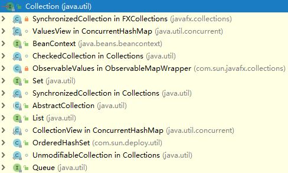

可以看到Collection接口有四个子接口BeanContext、Set、List、Queue。

#### 集合的遍历

##### 增强for

```java
//for循环的一种
for(元素数据类型 变量:数组或者Collection集合){
  使用变量即可，该变量就是元素
}
//简化数组和集合的遍历，增强for目标不能为null，所以最好使用前对其做非null判断
```

```java
ArrayList<String> array = new ArrayList<String>();
array.add("hello");
array.add("world");
for(String s : array){
  System.out.println(s);
}
```

##### 迭代器

迭代器是遍历集合的一种方式，是以来集合存在的

```java
Collection c = new ArrayList();
c.add("hello");
c.add("world");
//通过集合获取迭代器对象
Iterator it = c.iterator();
while(it.hasNext()){
  String s = (String)it.next();
  System.out.println(s);
}
```

**迭代器为什么不定义一个类而是一个接口？**

假设迭代器定义的是一个类，这样我们就可以创建该类的对象，调用该类的方法实现集合的遍历，但是，Java中提供了很多的集合类，而这些集合类的数据结构是不同的，所以，存储的方式和遍历的方式应该是不同的，进而他们的遍历方式也应该是不一样的，最终就没有定义迭代器类。

而无论是哪种集合，都应该具备获取元素的操作，并且最好在辅助于判断功能。再提取这两个功能就是接口

那么在真正具体的实现类在哪里呢？再真正具体的子类中，以内部类的方式体现的。

**迭代器源码：**

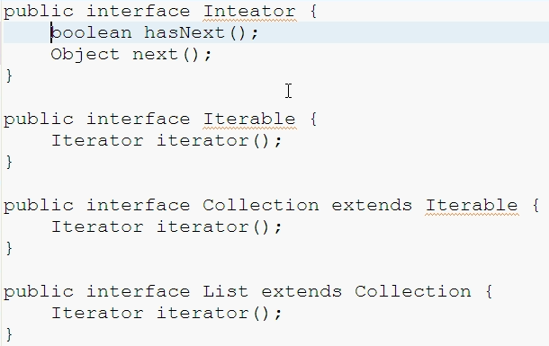

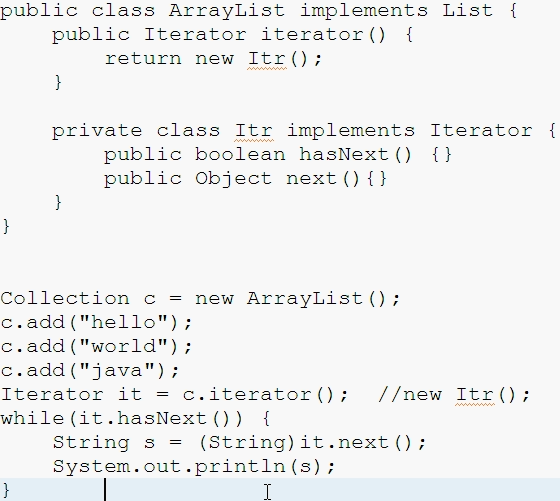

#### BeanContext

提供与 bean 上下文有关的类和接口。bean 上下文是一个 bean 的容器，它定义所包含 bean 的执行环境。但单个 bean 上下文中可能有几个 bean，一个 bean 上下文可以嵌套在另一个 bean 上下文中。

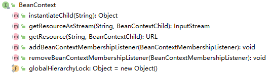

#### List(重点)

List接口扩展自Collection，它可以定义一个允许重复的有序集合（也称序列）。从List接口中的方法来看，List接口主要是增加了面向位置的操作，允许在指定位置上操作元素，同时增加了一个能够双向遍历线性表的新列表迭代器ListIterator，通常允许重复的元素。

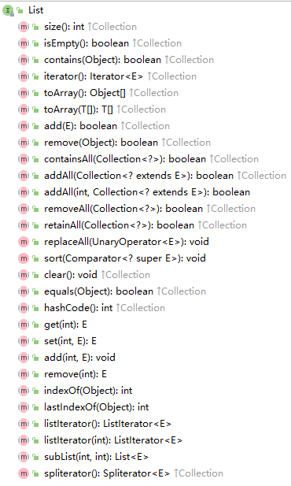

**List集合的特有功能：**

```java
//添加功能
void add(int index,Object element);//在指定位置添加元素
//获取功能
Object get(int index);//获取指定位置的元素
//列表迭代器
ListIterator listIterator();//:List集合特有的迭代器
//删除功能
Object remove(int index);//根据索引删除元素，返回被删除的元素
//修改功能
Object set(int index,Object element);//根据索引修改元素，返回被修饰的元素
```

**数据结构简单分析**

数据结构之栈和队列：

- 栈：先进后出
- 队列：先进先出
- 数组：查询快，增删慢
- 链表：查询慢，增删快

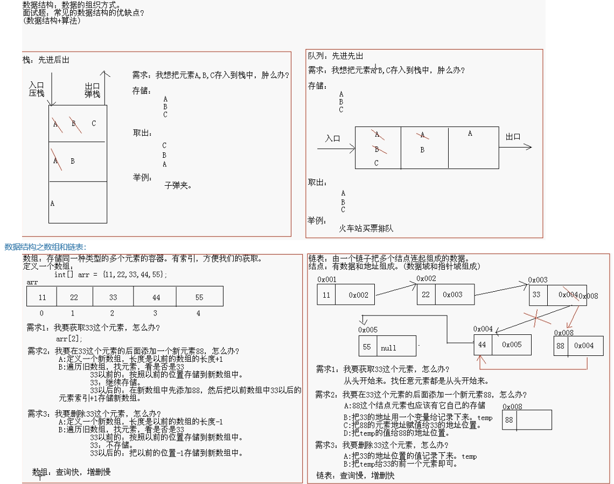

我们说的链表是单向链表，其实如果把头元素的地址给了最后一个元素的地址位置，就是循环列表，如果每个结点有3部分组成，就可以组成双向链表，如果再把前后的对应也连接起来，就成了双向循环链表。

##### ArrayList

*ArrayList*实现了List接口，是顺序容器，即元素存放的数据与放进去的顺序相同，允许放入null元素，底层通过数组实现。除该类未实现同步外，其余跟*Vector*大致相同。每个*ArrayList*都有一个容量（capacity），表示底层数组的实际大小，容器内存储元素的个数不能多于当前容量。当向容器中添加元素时，如果容量不足，容器会自动增大底层数组的大小。Java泛型只是编译器提供的语法糖，所以这里的数组是一个Object数组，以便能够容纳任何类型的对象。

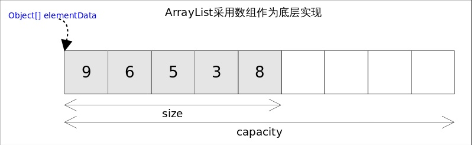

size(), isEmpty(), get(), set()方法均能在常数时间内完成，add()方法的时间开销跟插入位置有关，addAll()方法的时间开销跟添加元素的个数成正比。其余方法大都是线性时间。

为追求效率，ArrayList没有实现同步（synchronized），如果需要多个线程并发访问，用户可以手动同步，也可使用Vector替代。

```java
//Set()方法
//既然底层是一个数组ArrayList的set()方法也就变得非常简单，直接对数组的指定位置赋值即可。
 /**
     * Replaces the element at the specified position in this list with
     * the specified element.
     *
     * @param index index of the element to replace
     * @param element element to be stored at the specified position
     * @return the element previously at the specified position
     * @throws IndexOutOfBoundsException {@inheritDoc}
     */
    public E set(int index, E element) {
        rangeCheck(index);//下标越界检查
      /*
      private void rangeCheck(int index) {
        if (index >= size)
            throw new IndexOutOfBoundsException(outOfBoundsMsg(index));
      }
      */
      E oldValue = elementData(index);
        elementData[index] = element;//赋值到指定位置，复制的仅仅是引用
        return oldValue;
    }

//get()方法
//get()方法唯一要注意的是由于底层数组是Object[]，得到元素后需要进行类型转换。
/**
     * Returns the element at the specified position in this list.
     *
     * @param  index index of the element to return
     * @return the element at the specified position in this list
     * @throws IndexOutOfBoundsException {@inheritDoc}
     */
    public E get(int index) {
        rangeCheck(index);//下标越界检查

        return elementData(index);//返回下标元素
    }

//add()
//ArrayList方法是add(E e)，add(int index, E e)。这两个方法都是向容器中添加新元素，这可能会导致capacity不足，因此在添加元素之前，都需要进行剩余空间检查，如果需要则自动扩容。扩容操作最终是通过grow()方法完成的。
   /**
     * Appends the specified element to the end of this list.
     *
     * @param e element to be appended to this list
     * @return <tt>true</tt> (as specified by {@link Collection#add})
     */
    public boolean add(E e) {
        ensureCapacityInternal(size + 1);  // Increments modCount!!
        elementData[size++] = e;
        return true;
    }

    /**
     * Inserts the specified element at the specified position in this
     * list. Shifts the element currently at that position (if any) and
     * any subsequent elements to the right (adds one to their indices).
     *
     * @param index index at which the specified element is to be inserted
     * @param element element to be inserted
     * @throws IndexOutOfBoundsException {@inheritDoc}
     */
    public void add(int index, E element) {
        rangeCheckForAdd(index);

        ensureCapacityInternal(size + 1);  // Increments modCount!!
        System.arraycopy(elementData, index, elementData, index + 1,
                         size - index);
        elementData[index] = element;
        size++;
    }

 /**
     * Increases the capacity to ensure that it can hold at least the
     * number of elements specified by the minimum capacity argument.
     *
     * @param minCapacity the desired minimum capacity
     */
    private void grow(int minCapacity) {
        // overflow-conscious code
        int oldCapacity = elementData.length;
        int newCapacity = oldCapacity + (oldCapacity >> 1);//扩容到原来的1.5倍
        if (newCapacity - minCapacity < 0)
            newCapacity = minCapacity;
        if (newCapacity - MAX_ARRAY_SIZE > 0)
            newCapacity = hugeCapacity(minCapacity);
        // minCapacity is usually close to size, so this is a win:
        elementData = Arrays.copyOf(elementData, newCapacity);//扩展空间并复制
    }

    private static int hugeCapacity(int minCapacity) {
        if (minCapacity < 0) // overflow
            throw new OutOfMemoryError();
        return (minCapacity > MAX_ARRAY_SIZE) ?
            Integer.MAX_VALUE :
            MAX_ARRAY_SIZE;
    }

```

由于Java GC自动管理了内存，这里也就不需要考虑源数组释放的问题。

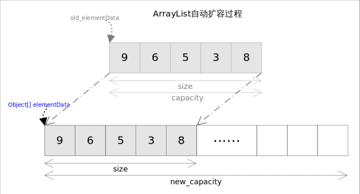

空间的问题解决后，插入过程就显得非常简单。

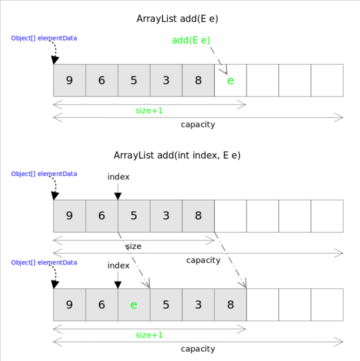

add(int index, E e)需要先对元素进行移动，然后完成插入操作，也就意味着该方法有着线性的时间复杂度。

```java
//addAll()
    /**
     * Appends all of the elements in the specified collection to the end of
     * this list, in the order that they are returned by the
     * specified collection's Iterator.  The behavior of this operation is
     * undefined if the specified collection is modified while the operation
     * is in progress.  (This implies that the behavior of this call is
     * undefined if the specified collection is this list, and this
     * list is nonempty.)
     *
     * @param c collection containing elements to be added to this list
     * @return <tt>true</tt> if this list changed as a result of the call
     * @throws NullPointerException if the specified collection is null
     */
    public boolean addAll(Collection<? extends E> c) {
        Object[] a = c.toArray();
        int numNew = a.length;
        ensureCapacityInternal(size + numNew);  // Increments modCount
        System.arraycopy(a, 0, elementData, size, numNew);
        size += numNew;
        return numNew != 0;
    }

    /**
     * Inserts all of the elements in the specified collection into this
     * list, starting at the specified position.  Shifts the element
     * currently at that position (if any) and any subsequent elements to
     * the right (increases their indices).  The new elements will appear
     * in the list in the order that they are returned by the
     * specified collection's iterator.
     *
     * @param index index at which to insert the first element from the
     *              specified collection
     * @param c collection containing elements to be added to this list
     * @return <tt>true</tt> if this list changed as a result of the call
     * @throws IndexOutOfBoundsException {@inheritDoc}
     * @throws NullPointerException if the specified collection is null
     */
    public boolean addAll(int index, Collection<? extends E> c) {
        rangeCheckForAdd(index);

        Object[] a = c.toArray();
        int numNew = a.length;
        ensureCapacityInternal(size + numNew);  // Increments modCount

        int numMoved = size - index;
        if (numMoved > 0)
            System.arraycopy(elementData, index, elementData, index + numNew,
                             numMoved);

        System.arraycopy(a, 0, elementData, index, numNew);
        size += numNew;
        return numNew != 0;
    }
//addAll()方法能够一次添加多个元素，根据位置不同也有两个把本，一个是在末尾添加的addAll(Collection<? extends E> c)方法，一个是从指定位置开始插入的addAll(int index, Collection<? extends E> c)方法。跟add()方法类似，在插入之前也需要进行空间检查，如果需要则自动扩容；如果从指定位置插入，也会存在移动元素的情况。

//addAll()的时间复杂度不仅跟插入元素的多少有关，也跟插入的位置相关。
```

```java
//remove()
//remove()方法也有两个版本，一个是remove(int index)删除指定位置的元素，另一个是remove(Object o)删除第一个满足o.equals(elementData[index])的元素。删除操作是add()操作的逆过程，需要将删除点之后的元素向前移动一个位置。需要注意的是为了让GC起作用，必须显式的为最后一个位置赋null值。
    /**
     * Removes the element at the specified position in this list.
     * Shifts any subsequent elements to the left (subtracts one from their
     * indices).
     *
     * @param index the index of the element to be removed
     * @return the element that was removed from the list
     * @throws IndexOutOfBoundsException {@inheritDoc}
     */
    public E remove(int index) {
        rangeCheck(index);

        modCount++;
        E oldValue = elementData(index);

        int numMoved = size - index - 1;
        if (numMoved > 0)
            System.arraycopy(elementData, index+1, elementData, index,
                             numMoved);
        elementData[--size] = null; // clear to let GC do its work:清除该位置的引用，让GC起作用

        return oldValue;
    }

    /**
     * Removes the first occurrence of the specified element from this list,
     * if it is present.  If the list does not contain the element, it is
     * unchanged.  More formally, removes the element with the lowest index
     * <tt>i</tt> such that
     * <tt>(o==null&nbsp;?&nbsp;get(i)==null&nbsp;:&nbsp;o.equals(get(i)))</tt>
     * (if such an element exists).  Returns <tt>true</tt> if this list
     * contained the specified element (or equivalently, if this list
     * changed as a result of the call).
     *
     * @param o element to be removed from this list, if present
     * @return <tt>true</tt> if this list contained the specified element
     */
    public boolean remove(Object o) {
        if (o == null) {
            for (int index = 0; index < size; index++)
                if (elementData[index] == null) {
                    fastRemove(index);
                    return true;
                }
        } else {
            for (int index = 0; index < size; index++)
                if (o.equals(elementData[index])) {
                    fastRemove(index);
                    return true;
                }
        }
        return false;
    }
//关于Java GC这里需要特别说明一下，有了垃圾收集器并不意味着一定不会有内存泄漏。对象能否被GC的依据是是否还有引用指向它，上面代码中如果不手动赋null值，除非对应的位置被其他元素覆盖，否则原来的对象就一直不会被回收。
```

##### LinkedList

*LinkedList*同时实现了*List*接口和*Deque*接口，也就是说它既可以看作一个顺序容器，又可以看作一个队列（*Queue*），同时又可以看作一个栈（*Stack*）。这样看来，*LinkedList*简直就是个全能冠军。当你需要使用栈或者队列时，可以考虑使用*LinkedList*，一方面是因为Java官方已经声明不建议使用*Stack*类，更遗憾的是，Java里根本没有一个叫做*Queue*的类（它是个接口名字）。关于栈或队列，现在的首选是*ArrayDeque*，它有着比*LinkedList*（当作栈或队列使用时）有着更好的性能。

```java
public class LinkedList<E>
    extends AbstractSequentialList<E>
    implements List<E>, Deque<E>, Cloneable, java.io.Serializable
```

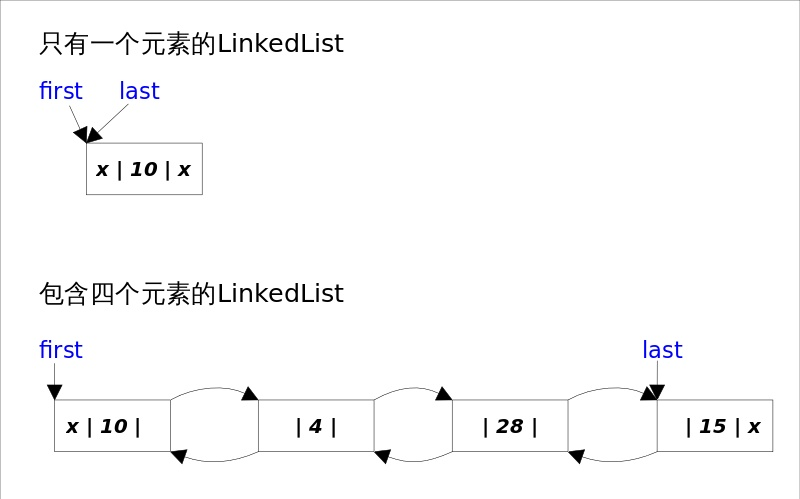

*LinkedList*底层**通过双向链表实现**，本节将着重讲解插入和删除元素时双向链表的维护过程，也即是之间解跟*List*接口相关的函数，双向链表的每个节点用内部类*Node*表示。*LinkedList*通过first和last引用分别指向链表的第一个和最后一个元素。注意这里没有所谓的哑元，当链表为空的时候first和last都指向null。

```java
//Node内部类
private static class Node<E> {
    E item;
    Node<E> next;
    Node<E> prev;
    Node(Node<E> prev, E element, Node<E> next) {
        this.item = element;
        this.next = next;
        this.prev = prev;
    }
}
```

*LinkedList*的实现方式决定了所有跟下标相关的操作都是线性时间，而在首段或者末尾删除元素只需要常数时间。为追求效率*LinkedList*没有实现同步（synchronized），如果需要多个线程并发访问，可以先采用Collections.synchronizedList()方法对其进行包装。

```java
//add()
//add()方法有两个版本，一个是add(E e)，该方法在LinkedList的末尾插入元素，因为有last指向链表末尾，在末尾插入元素的花费是常数时间。只需要简单修改几个相关引用即可；另一个是add(int index, E element)，该方法是在指定下表处插入元素，需要先通过线性查找找到具体位置，然后修改相关引用完成插入操作。

```

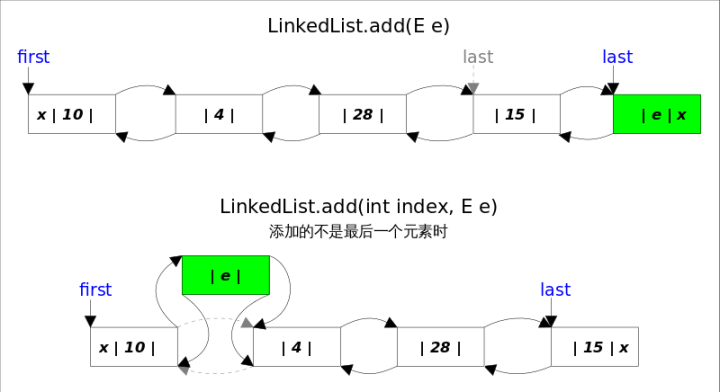

结合上图，可以看出add(E e)的逻辑非常简单。

```java
//add(E e)
public boolean add(E e) {
    final Node<E> l = last;
    final Node<E> newNode = new Node<>(l, e, null);
    last = newNode;
    if (l == null)
        first = newNode;//原来链表为空，这是插入的第一个元素
    else
        l.next = newNode;
    size++;
    return true;
}
```

add(int index, E element)的逻辑稍显复杂，可以分成两部，

1.先根据index找到要插入的位置；

2.修改引用，完成插入操作。

```java
//add(int index, E element)
public void add(int index, E element) {
    checkPositionIndex(index);//index >= 0 && index <= size;
    if (index == size)//插入位置是末尾，包括列表为空的情况
        add(element);
    else{
        Node<E> succ = node(index);//1.先根据index找到要插入的位置
        //2.修改引用，完成插入操作。
        final Node<E> pred = succ.prev;
        final Node<E> newNode = new Node<>(pred, e, succ);
        succ.prev = newNode;
        if (pred == null)//插入位置为0
            first = newNode;
        else
            pred.next = newNode;
        size++;
    }
}
```

上面代码中的node(int index)函数有一点小小的trick，因为链表双向的，可以从开始往后找，也可以从结尾往前找，具体朝那个方向找取决于条件index < (size >> 1)，也即是index是靠近前端还是后端。

```java
//remove()
//remove()方法也有两个版本，一个是删除跟指定元素相等的第一个元素remove(Object o)，另一个是删除指定下标处的元素remove(int index)。
```

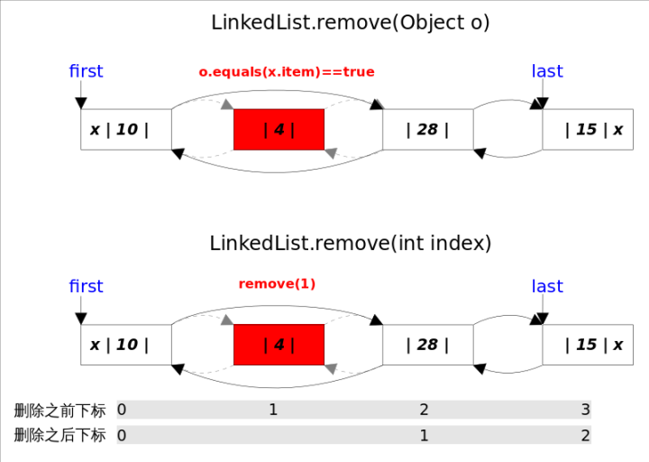

两个删除操作都要1.先找到要删除元素的引用，2.修改相关引用，完成删除操作。在寻找被删元素引用的时候remove(Object o)调用的是元素的equals方法，而remove(int index)使用的是下标计数，两种方式都是线性时间复杂度。在步骤2中，两个revome()方法都是通过unlink(Node<E> x)方法完成的。这里需要考虑删除元素是第一个或者最后一个时的边界情况。

```java
//unlink(Node<E> x)，删除一个Node
E unlink(Node<E> x) {
    final E element = x.item;
    final Node<E> next = x.next;
    final Node<E> prev = x.prev;
    if (prev == null) {//删除的是第一个元素
        first = next;
    } else {
        prev.next = next;
        x.prev = null;
    }
    if (next == null) {//删除的是最后一个元素
        last = prev;
    } else {
        next.prev = prev;
        x.next = null;
    }
    x.item = null;//let GC work
    size--;
    return element;
}
```

```java
//get()
//get(int index)得到指定下标处元素的引用，通过调用上文中提到的node(int index)方法实现。
public E get(int index) {
    checkElementIndex(index);//index >= 0 && index < size;
    return node(index).item;
}
```

```java
//set()
//set(int index, E element)方法将指定下标处的元素修改成指定值，也是先通过node(int index)找到对应下表元素的引用，然后修改Node中item的值。
public E set(int index, E element) {
    checkElementIndex(index);
    Node<E> x = node(index);
    E oldVal = x.item;
    x.item = element;//替换新值
    return oldVal;
}
```


**自定义栈集合**

```java
public class MyStack{
  private LinkedList link;
  public MyStack(){
    link = new LinkedList();
  }
  public void add(Object obj){
    link.addFirst(obj);
  }
  public Object get(){
    return link.removeFirst();
  }
  public boolean isEmpty(){
    return link.isEmpty();
  }
}
```

**LinkList的特有功能**

```java
//添加功能
public void addFirst(Object e);
public void addLast(Object e);
//获取功能
public Object getFirst();
public Object getLast();
//删除功能
public Object removeFirst();
public Object removeLst();
```

##### Vector

##### **Vector的特有功能**

```java
//添加功能
public void addElement(Object obj);
//获取功能
public Object elementAt(int index);
public Enumeration elements();
  boolean hasMoreElements();
  Object nextElement();
```

Vector的遍历

```java
Vector v = new Vector();
v.addElement("hello");
v.addElement("world");
v.addElement("java");
//遍历
for(int x = 0; x < v.size(); x++){
  String s = (String)v.elementAt(x);
  System.out.println(s);
}
 System.out.println("------------");
Enumeration en = v.elements();//返回的是实现类的对象
while(en.hasMoreElements()){
  String s = (String)en.nextElement();
  System.out.println(s);
}
```

#### Set(重点)

Set接口扩展自Collection，它与List的不同之处在于，规定Set的实例不包含重复的元素。AbstractSet是一个实现Set接口的抽象类，Set接口有三个具体实现类，分别是散列集HashSet、链式散列集LinkedHashSet和树形集TreeSet。

##### HashSet

散列集HashSet是一个用于实现Set接口的具体类，可以使用它的无参构造方法来创建空的散列集，也可以由一个现有的集合创建散列集。在散列集中，有两个名词需要关注，初始容量和客座率。实际上HashSet就是基于后面介绍的HashMap而实现的，客座率是确定在增加规则集之前，该规则集的饱满程度，当元素个数超过了容量与客座率的乘积时，容量就会自动翻倍。

```java
public class TestHashSet {
    public static void main(String[] args) {
        Set<String> set = new HashSet<>();
        set.add("11111");
        set.add("22222");
        set.add("33333");
        set.add("44444");
        set.add("22222");
        System.out.println(set.size());
        for (String e : set) {
            System.out.println(e);
        }
    }
}
```

从输出结果我们可以看到，规则集里最后有4个元素，而且在输出时元素还是无序的。

查看散列集HashSet的源码实现可以看到它内部是使用一个HashMap来存放元素的，因为HashSet的元素就是其内部HashMap的**键集合**，所以HashSet可以做到元素不重复。

**HashSet如何保证元素唯一性？**

底层数据结构是哈希表（元素是链表的数组）

哈希表依赖于哈希值存储

添加功能依赖两个方法：int hashCode();boolean equals(Object obj);

在这里，首先比较哈希值hashCode()是否相同，如果相同，元素重复，不添加。比较地址值或者走equals()，如果不同就直接添加到集合中。

如果类没有重写这两个方法，默认使用的Object()，一般来说不相同，而String类重写了hashCode()和equals()方法，所以他就可以把内容相同的字符串去掉，只留下一个。

##### LinkHashSet

LinkedHashSet是继承自HashSet的，支持对规则集内的元素排序。HashSet中的元素是没有被排序的，而LinkedHashSet中的元素可以按照它们插入规则集的顺序提取。

底层数据结构由哈希表和链表组成

##### TreeSet

TreeSet扩展自AbstractSet，并实现了NavigableSet，AbstractSet扩展自AbstractCollection，树形集是一个有序的Set，其底层是一颗树，这样就能从Set里面提取一个有序序列了。在实例化TreeSet时，我们可以给TreeSet指定一个比较器Comparator来指定树形集中的元素顺序。树形集中提供了很多便捷的方法。

使用元素的自然顺序对元素进行排序，或者根据创建set时提供的Comparator进行排序，具体取决于使用的构造方法

TreeSet如何保证元素的排序和唯一性？

底层数据结构是一种自平衡的二叉树（红黑树）

###### Comparable

Compar to 

自然排序

真正的比较是依赖于元素的compare to 方法，而这个方定义在comparable里

要重写该方法，就必须先实现comparable接口

元素的唯一性和如何存储

第一个元素存储的时候，直接作为根节点存储

从第二个元素开始，每个元素从根节点开始比较

| 大    | 就作为右孩子 |
| ---- | ------ |
| 小    | 作为左孩子  |
| 相等   | 不搭理    |

元素是如何取出来的

从根节点开始，按照左中右的原则依次取出元素即可

保证元素的排序方式

自然排序

让元素所属的类实现Comparable接口

比较器排序

让集合构造方法接收Comparator的实现类对象

#### Queue

##### 队列

队列与栈是相对的一种数据结构。只允许在一端进行插入操作，而在另一端进行删除操作的线性表。栈的特点是后进先出，而队列的特点是先进先出。队列的用处很大，但大多都是在其他的数据结构中，比如，树的按层遍历，图的广度优先搜索等都需要使用队列做为辅助数据结构。

##### 单向队列

单向队列比较简单，只能向队尾添加元素，从队头删除元素。比如最典型的排队买票例子，新来的人只能在队列后面，排到最前边的人才可以买票，买完了以后，离开队伍。这个过程是一个非常典型的队列。

定义队列的接口：

```java
public interface Queue {
    public boolean add(Object elem); // 将一个元素放到队尾，如果成功，返回true
    public Object remove(); // 将一个元素从队头删除，如果成功，返回true
}
```

一个队列只要能入队，和出队就可以了。这个队列的接口就定义好了，具体的实现有很多种办法，例如，可以使用数组做存储，可以使用链表做存储。
其实大家页可以看一下JDK源码，在java.util.Queue中，可以看到队列的定义。只是它是泛型的。基本上，Queue.java中定义的接口都是进队，出队。只是行为有所不同。例如，remove如果失败，会抛出异常，而poll失败则返回null,但它俩其实都是从队头删除元素。

##### 单向队列

如果一个队列的头和尾都支持元素入队，出队，那么这种队列就称为双向队列，英文是Deque。大家可以通过java.util.Deque来查看Deque的接口定义，这里节选一部分：

```java
public interface Deque<E> extends Queue<E> {
    /**
     * Inserts the specified element at the front of this deque if it is
     * possible to do so immediately without violating capacity restrictions,
     * throwing an {@code IllegalStateException} if no space is currently
     * available.  When using a capacity-restricted deque, it is generally
     * preferable to use method {@link #offerFirst}.
     *
     * @param e the element to add
     * @throws IllegalStateException if the element cannot be added at this
     *         time due to capacity restrictions
     * @throws ClassCastException if the class of the specified element
     *         prevents it from being added to this deque
     * @throws NullPointerException if the specified element is null and this
     *         deque does not permit null elements
     * @throws IllegalArgumentException if some property of the specified
     *         element prevents it from being added to this deque
     */
    void addFirst(E e);


    void addLast(E e);


    E removeFirst();

    E removeLast();
}
```

最重要的也就是这4个，一大段英文，没啥意思，其实就是说，addFirst是向队头添加元素，如果不满足条件就会抛异常，然后定义了各种情况下抛出的异常类型。
只要记住队列是先进先出的数据结构就好了，今天不必要把这些东西都掌握，一步步来。

##### Queue

Queue也继承自Collection，用来存放等待处理的集合，这种场景一般用于缓冲、并发访问。

Queue是用于在处理之前保存元素的集合。
除了基本的集合操作，队列提供了额外的插入、提取和检查操作。
每个方法都有两种形式:一种是在操作失败时抛出一个异常，另一个则返回一个特殊值(根据操作的不同)(返回null或false)。
插入操作的后一种形式是专门为有容量限制的队列实现而设计的;
在大多数实现中，插入操作不会失败。

```java
public interface Queue<E> extends Collection<E> {
    //插入（抛出异常）
    boolean add(E e);
    //插入（返回特殊值）
    boolean offer(E e);
    //移除（抛出异常）
    E remove();
    //移除（返回特殊值）
    E poll();
    //检查（抛出异常）
    E element();
    //检查（返回特殊值）
    E peek();
}
```

可以看出Queue接口没有什么神秘面纱，都不需要揭开。不存在花里胡哨，就只有这6个方法。额外的添加、删除、查询操作。

值得一提的是，Queue是个接口，它提供的add，offer方法初衷是希望子类能够禁止添加元素为null，这样可以避免在查询时返回null究竟是正确还是错误。实际上大多数Queue的实现类的确响应了Queue接口的规定，比如ArrayBlockingQueue，PriorityBlockingQueue等等。

但还是有一些实现类没有这样要求，比如LinkedList。

虽然 LinkedList 没有禁止添加 null，但是一般情况下 Queue 的实现类都不允许添加 null 元素，为啥呢？因为poll(),peek()方法在异常的时候会返回 null，你添加了null 以后，当获取时不好分辨究竟是否正确返回。

##### PriorityQueue

PriorityQueue又叫做优先级队列，保存队列元素的顺序不是按照及加入队列的顺序，而是按照队列元素的大小进行重新排序。因此当调用peek()或pool()方法取出队列中头部的元素时，并不是取出最先进入队列的元素，而是取出队列的最小元素。

>基于优先级堆的无界的优先级队列。
>
>PriorityQueue的元素根据自然排序进行排序，或者按队列构建时提供的 Comparator进行排序，具体取决于使用的构造方法。
>
>优先队列不允许 null 元素。
>
>通过自然排序的PriorityQueue不允许插入不可比较的对象。
>
>该队列的头是根据指定排序的最小元素。
>
>如果多个元素都是最小值，则头部是其中的一个元素——任意选取一个。
>
>队列检索操作poll、remove、peek和element访问队列头部的元素。
>
>优先队列是无界的，但有一个内部容量，用于管理用于存储队列中元素的数组的大小。
>
>基本上它的大小至少和队列大小一样大。
>
>当元素被添加到优先队列时，它的容量会自动增长。增长策略的细节没有指定。

一句话概括，PriorityQueue使用了一个高效的数据结构：堆。底层是使用数组保存数据。还会进行排序，优先将元素的最小值存到队头。

**PriorityQueue的排序方式**

 PriorityQueue中的元素可以默认自然排序或者通过提供的Comparator（比较器）在队列实例化时指定的排序方式进行排序。需要注意的是，当PriorityQueue中没有指定的Comparator时，加入PriorityQueue的元素必须实现了Comparable接口（元素是可以进行比较的），否则会导致 ClassCastException。

**PriorityQueue本质**

Java中*PriorityQueue*实现了*Queue*接口，不允许放入null元素；其通过堆实现，具体说是通过完全二叉树（*complete binary tree*）实现的**小顶堆**（任意一个非叶子节点的权值，都不大于其左右子节点的权值），也就意味着可以通过数组来作为*PriorityQueue*的底层实现。

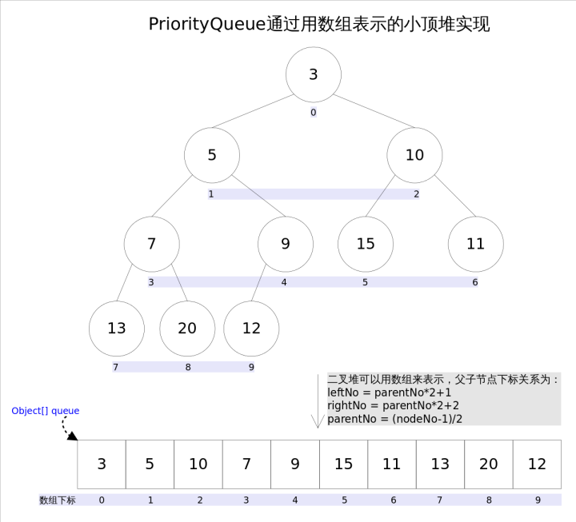

上图中我们给每个元素按照层序遍历的方式进行了编号，如果你足够细心，会发现父节点和子节点的编号是有联系的，更确切的说父子节点的编号之间有如下关系：

leftNo = parentNo*2+1

rightNo = parentNo*2+2

parentNo = (nodeNo-1)/2

通过上述三个公式，可以轻易计算出某个节点的父节点以及子节点的下标。这也就是为什么可以直接用数组来存储堆的原因。

*PriorityQueue*的peek()和element操作是常数时间，add(), offer(), 无参数的remove()以及poll()方法的时间复杂度都是*log(N)*。

PriorityQueue 本质也是一个动态数组，在这一方面与ArrayList是一致的。看一下它的构造方法：

```java
 public PriorityQueue(int initialCapacity) {
        this(initialCapacity, null);
    }

public PriorityQueue(Comparator<? super E> comparator) {
        this(DEFAULT_INITIAL_CAPACITY, comparator);
    }

public PriorityQueue(int initialCapacity,
                         Comparator<? super E> comparator) {
        // Note: This restriction of at least one is not actually needed,
        // but continues for 1.5 compatibility
        if (initialCapacity < 1)
            throw new IllegalArgumentException();
        this.queue = new Object[initialCapacity];
        this.comparator = comparator;
    }
```

* PriorityQueue调用默认的构造方法时，使用默认的初始容量（`DEFAULT_IITIAL_CAPACITY = 11`）创建一个PriorityQueue，并根据其自然顺序来排序其元素（使用加入其中的集合元素实现的Comparable）。
* 当使用指定容量的构造方法时，使用指定的初始容量创建一个 PriorityQueue，并根据其自然顺序来排序其元素（使用加入其中的集合元素实现的Comparable）
* 当使用指定的初始容量创建一个 PriorityQueue，并根据指定的比较器comparator来排序其元素。当添加元素到集合时，会先检查数组是否还有余量，有余量则把新元素加入集合，没余量则调用  grow()方法增加容量，然后调用siftUp将新加入的元素排序插入对应位置。

除了这些，还要注意的是：

1. PriorityQueue不是线程安全的。如果多个线程中的任意线程从结构上修改了列表， 则这些线程不应同时访问 PriorityQueue 实例，这时请使用线程安全的PriorityBlockingQueue 类。
2. 不允许插入 null 元素。
3. PriorityQueue实现插入方法（offer、poll、remove() 和 add 方法） 的时间复杂度是O(log(n)) ；实现 remove(Object) 和 contains(Object) 方法的时间复杂度是O(n) ；实现检索方法（peek、element 和 size）的时间复杂度是O(1)。所以在遍历时，若不需要删除元素，则以peek的方式遍历每个元素。
4. 方法iterator()中提供的迭代器并不保证以有序的方式遍历PriorityQueue中的元素。

**方法剖析**

- **add()和offer()**

add(E e)和offer(E e)的语义相同，都是向优先队列中插入元素，只是Queue接口规定二者对插入失败时的处理不同，前者在插入失败时抛出异常，后则则会返回false。对于*PriorityQueue*这两个方法其实没什么差别。

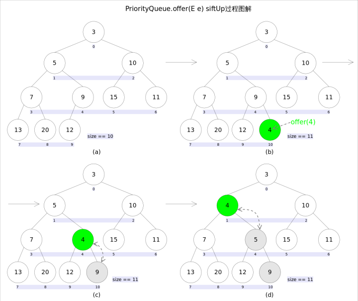

新加入的元素可能会破坏小顶堆的性质，因此需要进行必要的调整。

```java
//offer(E e)
public boolean offer(E e) {
    if (e == null)//不允许放入null元素
        throw new NullPointerException();
    modCount++;
    int i = size;
    if (i >= queue.length)
        grow(i + 1);//自动扩容
    size = i + 1;
    if (i == 0)//队列原来为空，这是插入的第一个元素
        queue[0] = e;
    else
        siftUp(i, e);//调整
    return true;
}
```

上述代码中，扩容函数grow()类似于ArrayList里的grow()函数，就是再申请一个更大的数组，并将原数组的元素复制过去，这里不再赘述。需要注意的是siftUp(int k, E x)方法，该方法用于插入元素x并维持堆的特性。

```java
//siftUp()
private void siftUp(int k, E x) {
    while (k > 0) {
        int parent = (k - 1) >>> 1;//parentNo = (nodeNo-1)/2
        Object e = queue[parent];
        if (comparator.compare(x, (E) e) >= 0)//调用比较器的比较方法
            break;
        queue[k] = e;
        k = parent;
    }
    queue[k] = x;
}
```

新加入的元素x可能会破坏小顶堆的性质，因此需要进行调整。调整的过程为：**从k指定的位置开始，将x逐层与当前点的parent进行比较并交换，直到满足x >= queue[parent]为止**。注意这里的比较可以是元素的自然顺序，也可以是依靠比较器的顺序。

- **element()和peek()**

element()和peek()的语义完全相同，都是获取但不删除队首元素，也就是队列中权值最小的那个元素，二者唯一的区别是当方法失败时前者抛出异常，后者返回null。根据小顶堆的性质，堆顶那个元素就是全局最小的那个；由于堆用数组表示，根据下标关系，0下标处的那个元素既是堆顶元素。所以**直接返回数组0下标处的那个元素即可**。

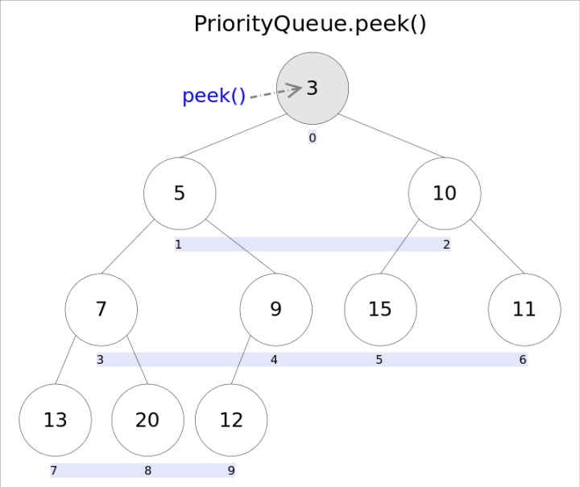

代码也就非常简洁：

```java
//peek()
public E peek() {
    if (size == 0)
        return null;
    return (E) queue[0];//0下标处的那个元素就是最小的那个
}
```

- **remove()和poll()**

remove()和poll()方法的语义也完全相同，都是获取并删除队首元素，区别是当方法失败时前者抛出异常，后者返回null。由于删除操作会改变队列的结构，为维护小顶堆的性质，需要进行必要的调整。

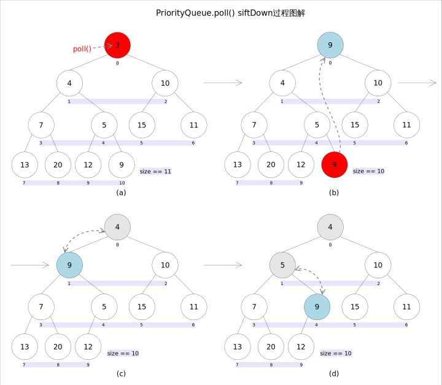

代码如下：

```java
public E poll() {
    if (size == 0)
        return null;
    int s = --size;
    modCount++;
    E result = (E) queue[0];//0下标处的那个元素就是最小的那个
    E x = (E) queue[s];
    queue[s] = null;
    if (s != 0)
        siftDown(0, x);//调整
    return result;
}
```

上述代码首先记录0下标处的元素，并用最后一个元素替换0下标位置的元素，之后调用siftDown()方法对堆进行调整，最后返回原来0下标处的那个元素（也就是最小的那个元素）。重点是siftDown(int k, E x)方法，该方法的作用是**从k指定的位置开始，将x逐层向下与当前点的左右孩子中较小的那个交换，直到x小于或等于左右孩子中的任何一个为止**。

```java
//siftDown()
private void siftDown(int k, E x) {
    int half = size >>> 1;
    while (k < half) {
        //首先找到左右孩子中较小的那个，记录到c里，并用child记录其下标
        int child = (k << 1) + 1;//leftNo = parentNo*2+1
        Object c = queue[child];
        int right = child + 1;
        if (right < size &&
            comparator.compare((E) c, (E) queue[right]) > 0)
            c = queue[child = right];
        if (comparator.compare(x, (E) c) <= 0)
            break;
        queue[k] = c;//然后用c取代原来的值
        k = child;
    }
    queue[k] = x;
}
```

- **remove(Object o)**

remove(Object o)方法用于删除队列中跟o相等的某一个元素（如果有多个相等，只删除一个），该方法不是*Queue*接口内的方法，而是*Collection*接口的方法。由于删除操作会改变队列结构，所以要进行调整；又由于删除元素的位置可能是任意的，所以调整过程比其它函数稍加繁琐。具体来说，remove(Object o)可以分为2种情况：1. 删除的是最后一个元素。直接删除即可，不需要调整。2. 删除的不是最后一个元素，从删除点开始以最后一个元素为参照调用一次siftDown()即可。此处不再赘述。

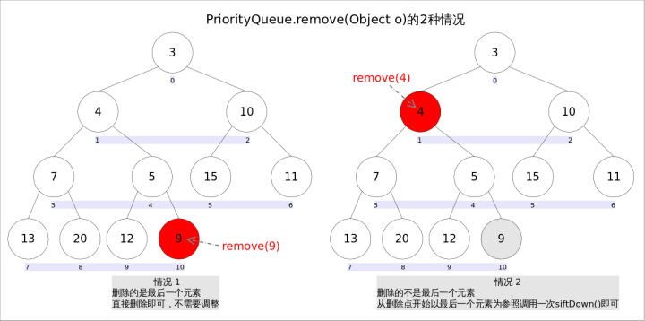

具体代码如下：

```java
//remove(Object o)
public boolean remove(Object o) {
    //通过遍历数组的方式找到第一个满足o.equals(queue[i])元素的下标
    int i = indexOf(o);
    if (i == -1)
        return false;
    int s = --size;
    if (s == i) //情况1
        queue[i] = null;
    else {
        E moved = (E) queue[s];
        queue[s] = null;
        siftDown(i, moved);//情况2
        ......
    }
    return true;
}
```

##### ArrayDeque

Java里有一个叫做Stack的类，却没有叫做Queue的类（它是个接口名字）。当需要使用栈时，Java已不推荐使用Stack，而是推荐使用更高效的ArrayDeque；既然Queue只是一个接口，当需要使用队列时也就首选ArrayDeque了（次选是LinkedList）。

要讲栈和队列，首先要讲Deque接口。Deque的含义是“double ended queue”，即双端队列，它既可以当作栈使用，也可以当作队列使用。下表列出了Deque与Queue相对应的接口：

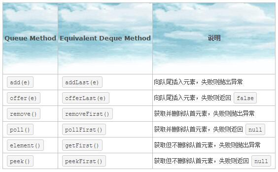

下表列出了*Deque*与*Stack*对应的接口：

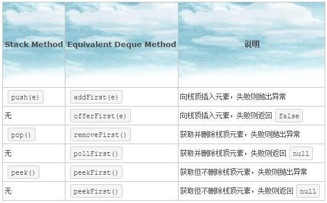

上面两个表共定义了*Deque*的12个接口。添加，删除，取值都有两套接口，它们功能相同，区别是对失败情况的处理不同。**一套接口遇到失败就会抛出异常，另一套遇到失败会返回特殊值（false或null）**。除非某种实现对容量有限制，大多数情况下，添加操作是不会失败的。**虽然Deque的接口有12个之多，但无非就是对容器的两端进行操作，或添加，或删除，或查看**。明白了这一点讲解起来就会非常简单。

*ArrayDeque*和*LinkedList*是*Deque*的两个通用实现，由于官方更推荐使用*AarryDeque*用作栈和队列，加之上一篇已经讲解过*LinkedList*，本文将着重讲解*ArrayDeque*的具体实现。

从名字可以看出*ArrayDeque*底层通过数组实现，为了满足可以同时在数组两端插入或删除元素的需求，该数组还必须是循环的，即**循环数组（circular array）**，也就是说数组的任何一点都可能被看作起点或者终点。*ArrayDeque*是非线程安全的（not thread-safe），当多个线程同时使用的时候，需要程序员手动同步；另外，该容器不允许放入null元素。

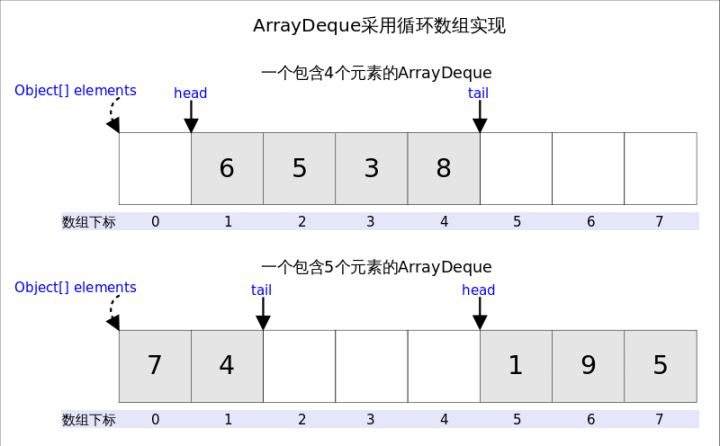

上图中我们看到，**head指向首端第一个有效元素，tail指向尾端第一个可以插入元素的空位**。因为是循环数组，所以head不一定总等于0，tail也不一定总是比head大。

**方法剖析**

addFirst()

addFirst(E e)的作用是在*Deque*的首端插入元素，也就是在head的前面插入元素，在空间足够且下标没有越界的情况下，只需要将elements[--head] = e即可。

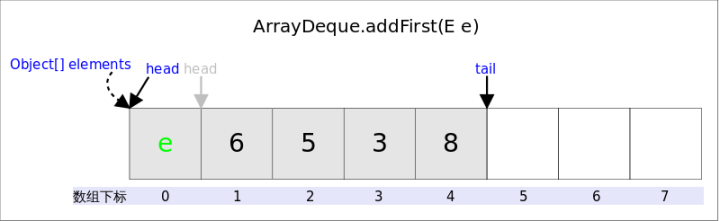

实际需要考虑：

1. 空间是否够用，以及
2. 下标是否越界的问题。上图中，如果head为0之后接着调用addFirst()，虽然空余空间还够用，但head为-1，下标越界了。下列代码很好的解决了这两个问题。

```java
//addFirst(E e)
public void addFirst(E e) {
    if (e == null)//不允许放入null
        throw new NullPointerException();
    elements[head = (head - 1) & (elements.length - 1)] = e;//2.下标是否越界
    if (head == tail)//1.空间是否够用
        doubleCapacity();//扩容
}
```

上述代码我们看到，**空间问题是在插入之后解决的**，因为tail总是指向下一个可插入的空位，也就意味着elements数组至少有一个空位，所以插入元素的时候不用考虑空间问题。

下标越界的处理解决起来非常简单，head = (head - 1) & (elements.length - 1)就可以了，**这段代码相当于取余，同时解决了head为负值的情况**。因为elements.length必需是2的指数倍，elements - 1就是二进制低位全1，跟head - 1相与之后就起到了取模的作用，如果head - 1为负数（其实只可能是-1），则相当于对其取相对于elements.length的补码。

下面再说说扩容函数doubleCapacity()，其逻辑是申请一个更大的数组（原数组的两倍），然后将原数组复制过去。过程如下图所示：

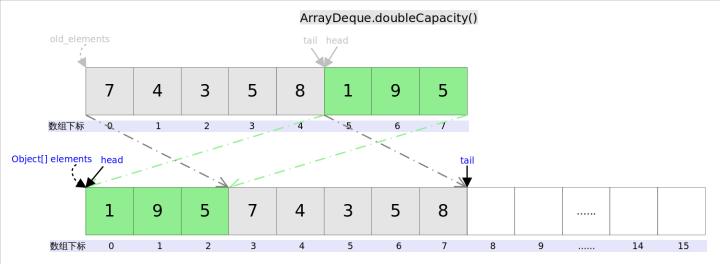

图中我们看到，复制分两次进行，第一次复制head右边的元素，第二次复制head左边的元素。

```java
//doubleCapacity()
private void doubleCapacity() {
    assert head == tail;
    int p = head;
    int n = elements.length;
    int r = n - p; // head右边元素的个数
    int newCapacity = n << 1;//原空间的2倍
    if (newCapacity < 0)
        throw new IllegalStateException("Sorry, deque too big");
    Object[] a = new Object[newCapacity];
    System.arraycopy(elements, p, a, 0, r);//复制右半部分，对应上图中绿色部分
    System.arraycopy(elements, 0, a, r, p);//复制左半部分，对应上图中灰色部分
    elements = (E[])a;
    head = 0;
    tail = n;
}
```

addLast()

addLast(E e)的作用是在*Deque*的尾端插入元素，也就是在tail的位置插入元素，由于tail总是指向下一个可以插入的空位，因此只需要elements[tail] = e;即可。插入完成后再检查空间，如果空间已经用光，则调用doubleCapacity()进行扩容。

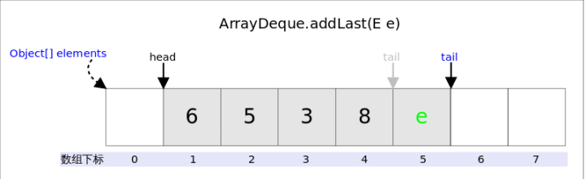

```java
public void addLast(E e) {
    if (e == null)//不允许放入null
        throw new NullPointerException();
    elements[tail] = e;//赋值
    if ( (tail = (tail + 1) & (elements.length - 1)) == head)//下标越界处理
        doubleCapacity();//扩容
}
```

下标越界处理方式addFirt()中已经讲过，不再赘述。

pollFirst()

pollFirst()的作用是删除并返回*Deque*首端元素，也即是head位置处的元素。如果容器不空，只需要直接返回elements[head]即可，当然还需要处理下标的问题。由于ArrayDeque中不允许放入null，当elements[head] == null时，意味着容器为空。

```java
public E pollFirst() {
    E result = elements[head];
    if (result == null)//null值意味着deque为空
        return null;
    elements[h] = null;//let GC work
    head = (head + 1) & (elements.length - 1);//下标越界处理
    return result;
}
```

**pollLast()**

pollLast()的作用是删除并返回*Deque*尾端元素，也即是tail位置前面的那个元素。

```java
public E pollLast() {
    int t = (tail - 1) & (elements.length - 1);//tail的上一个位置是最后一个元素
    E result = elements[t];
    if (result == null)//null值意味着deque为空
        return null;
    elements[t] = null;//let GC work
    tail = t;
    return result;
}
```

peekFirst()

peekFirst()的作用是返回但不删除*Deque*首端元素，也即是head位置处的元素，直接返回elements[head]即可。

```java
public E peekFirst() {
    return elements[head]; // elements[head] is null if deque empty
}
```

peekLast()

peekLast()的作用是返回但不删除*Deque*尾端元素，也即是tail位置前面的那个元素。

```java
public E peekLast() {
    return elements[(tail - 1) & (elements.length - 1)];
}
```

### Collection集合总结

- List 有序，可重复

- - ArrayList

  - - 底层数据结构是数组，查询快，增删慢
    - 线程不安全

  - Vector

  - - 底层数据结构是数组，查询快，增删慢
    - 线程安全，效率低

  - LinkedList

  - - 底层数据结构是链表，查询慢，增删快
    - 线程不安全，效率高

- Set 无序，唯一

- - HashSet

  - - 底层数据结构是哈希表
    - 如何保证元素的唯一性的呢？

依赖两个方法：hashCode(),equals()

开发中自动生成这个两个方法即可

- LinkedHashSet

- - 底层数据结构是链表和哈希表
  - 由链表保证元素有序
  - 有哈希表保证元素唯一


- TreeSet

- - 底层数据结构是红黑树

  - 如何保证元素排序的呢？

  - - 自然排序
    - 比较器排序

  - 如何保证元素的唯一性的呢？

  - - 根据比较的返回值是否是0来决定

针对Collection集合我们到底使用谁呢？

唯一吗？

* 是：Set
  * 排序吗？
    * 是：TreeSet
    * 否：HashSet

如果你知道是Set，但不知道是哪个Set，就用HashSet

* 否：List
  * 要安全吗？
    * 是：Vector
    * 否：ArrayList或者LinkedList
      * 查询多：ArrayList
      * 增删多：LinkedList

如果你知道是List，但不知道是哪个List，就用ArrayList

如果你知道是Collection集合，但不知道使用谁，就用ArrayList

如果你知道用集合，就用ArrayList

在集合中常见的数据结构

ArrayXxx：底层数据结构是数据，查询快，增删慢

LinkedXxx：底层数据结构是链表，查询慢，增删快

HashXxx：底层数据结构是哈希表，依赖两个方法：hashCode()和equals()

TreeXxx：底层数据结构是二叉树，两种排序方法：自然排序和比较器排序


