# Map接口

Map，图，是一种存储键值对映射的容器类，在Map中键可以是任意类型的对象，但不能有重复的键，每个键都对应一个值，真正存储在图中的是键值构成的条目。

**Map和Collection集合的区别：**

Map容器存储元素是成对出现的，Map集合的键是唯一的，值是可重复的

Collection集合存储元素是单独出现的，Set是唯一的，List是可重复的

Map容器的数据结构值针对键有效，跟值无关

Collection集合的数据结构是针对元素有效

下面是接口Map的类结构。

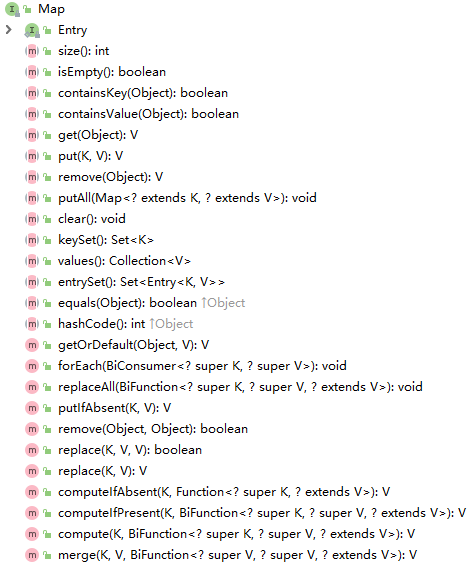

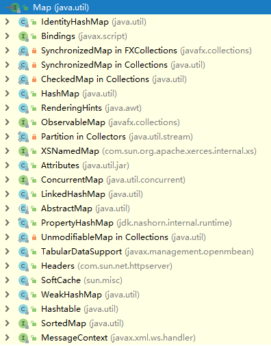

从上面这张图中我们可以看到接口Map提供了很多查询、更新和获取存储的键值对的方法，更新包括方法clear()、put()、putAll()、remove()等等，查询方法包括containsKey、containsValue等等。Map接口常用的有三个具体实现类，分别是HashMap、LinkedHashMap、TreeMap。

## Map的遍历

- 键找值

- - 获取所有的键的集合
  - 遍历键的集合，得到每一个键
  - 根据键到集合中去找值

- 键值对对象找键和值

- - 获取所有键值对对象的集合
  - 遍历键值对对象的集合，获取每一个键值对对象
  - 根据键值对对象去获取键和值。

```java
Map<String,String> map = new HashMap<String,String>();
//创建元素并添加集合
map.put("a","A");
map.put("b","B");
map.put("c","C");
//遍历
Set<String> set = map.keySet();
//遍历键的集合，获取得到每一个键
for(String key:set){
  //根据键去找值
  String value = map.get(key);
  System.out.println(key+"---"+value);
}
```

```java
//Set<map.Entry<K,V>> entrySet():返回的是键值对对象的集合
//创建集合对象
Map<String,String> map = new HashMap<String,String>();
map.put("a","A");
map.put("b","B");
map.put("c","C");
//获取所有键值对对象的集合
Set<Map.Entry<String,String>> set = map.entrySet();
//遍历键值对对象的集合，得到每一个键值对对象
for(Map.Entry<Stirng,String> me :set){
  //根据键值对对象获取键和值
  String key = me.getKey();
  String value = me.getValue();
  System.out.println(key+"---"+value);
}
```

## HashMap

HashMap是基于哈希表的Map接口的非同步实现，继承自AbstractMap，AbstractMap是部分实现Map接口的抽象类。在平时的开发中，HashMap的使用还是比较多的。

*HashSet*和*HashMap*,二者在Java里有着相同的实现，前者仅仅是对后者做了一层包装，也就是说**HashSet里面有一个HashMap（适配器模式）**。

*HashMap*实现了*Map*接口，允许放入null元素，除该类未实现同步外，其余跟Hashtable大致相同，跟*TreeMap*不同，该容器不保证元素顺序，根据需要该容器可能会对元素重新哈希，元素的顺序也会被重新打散，因此不同时间迭代同一个*HashMap*的顺序可能会不同。
根据对冲突的处理方式不同，哈希表有两种实现方式，一种开放地址方式（Open addressing），另一种是冲突链表方式（Separate chaining with linked lists）。**Java HashMap采用的是冲突链表方式**。

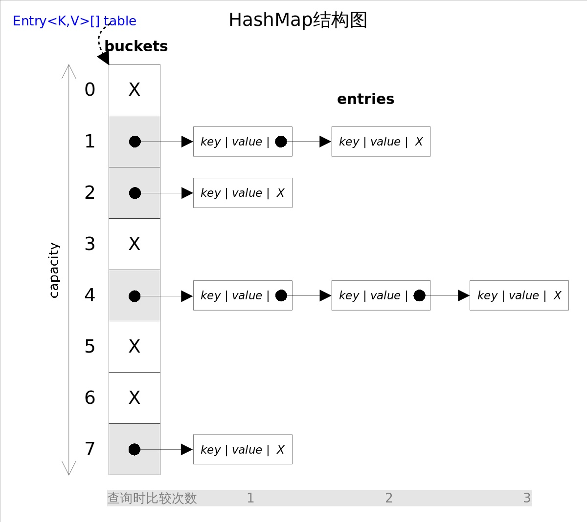

从上图容易看出，如果选择合适的哈希函数，put()和get()方法可以在常数时间内完成。但在对*HashMap*进行迭代时，需要遍历整个table以及后面跟的冲突链表。因此对于迭代比较频繁的场景，不宜将*HashMap*的初始大小设的过大。

有两个参数可以影响*HashMap*的性能：初始容量（inital capacity）和负载系数（load factor）。初始容量指定了初始table的大小，负载系数用来指定自动扩容的临界值。当entry的数量超过capacity*load_factor时，容器将自动扩容并重新哈希。对于插入元素较多的场景，将初始容量设大可以减少重新哈希的次数。

在之前的版本中，HashMap采用数组+链表实现，即使用链表处理冲突，同一hash值的链表都存储在一个链表里。但是当链表中的元素较多，即hash值相等的元素较多时，通过key值依次查找的效率较低。而JDK1.8中，HashMap采用数组+链表+红黑树实现，当链表长度超过阈值（8）时，将链表转换为红黑树，这样大大减少了查找时间。

哈希表内部使用Entry[]数组存放数据(Entry是封装键值对的对象)

数组默认的初始容量是16(可以通过构造方法参数指定)

数组容量会翻倍增长--StringBuilder翻倍+2

将对向放入到*HashMap*或*HashSet*中时，有两个方法需要特别关心：hashCode()和equals()。**hashCode()方法决定了对象会被放到哪个bucket里，当多个对象的哈希值冲突时，equals()方法决定了这些对象是否是“同一个对象”**。所以，如果要将自定义的对象放入到HashMap或HashSet中，需要@Override hashCode()和equals()方法。

```java
static class Node<K,V> implements Map.Entry<K,V> {
        final int hash;
        final K key;
        V value;
        Node<K,V> next;

        //构造函数 ( Hash值键值下一个节点 )
        Node(int hash, K key, V value, Node<K,V> next) {
            this.hash = hash;
            this.key = key;
            this.value = value;
            this.next = next;
        }

        public final K getKey()        { return key; }
        public final V getValue()      { return value; }
        public final String toString() { return key + "=" + value; }

        public final int hashCode() {
            return Objects.hashCode(key) ^ Objects.hashCode(value);
        }

        public final V setValue(V newValue) {
            V oldValue = value;
            value = newValue;
            return oldValue;
        }

        public final boolean equals(Object o) {
            if (o == this)
                return true;
            if (o instanceof Map.Entry) {
                Map.Entry<?,?> e = (Map.Entry<?,?>)o;
                if (Objects.equals(key, e.getKey()) &&
                    Objects.equals(value, e.getValue()))
                    return true;
            }
            return false;
        }
    }
```

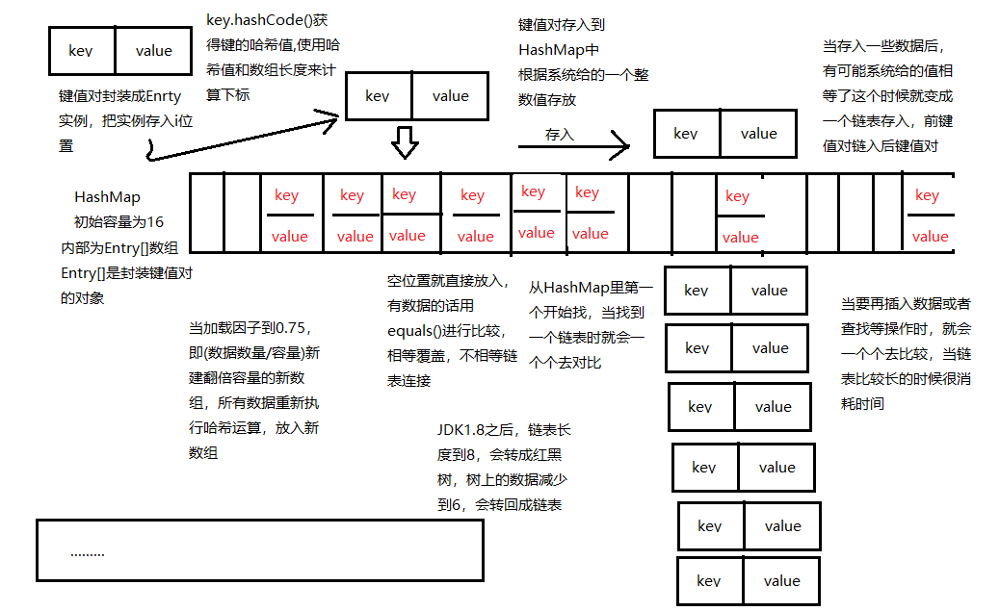

Key.hashCode() 获得键的哈希值

使用哈希值和数组长度，来计算下标

把键值对封装成Entry实例

把Entry实例放入i 位置

空位置，直接放入

有数据，依次使用equals()进行比较是否相等

如果有相等的，覆盖值

如果没有相等的，链表连接在一起，放在链表头部，后进先出（碰撞）

负载率，加载因子到0.75(数据数量/容量)

新建翻倍容量的新数组

所有数据重新执行哈希运算，放入新数组

问题：

如果碰撞过多会造成效率低，所以尽可能要去避免。所以hashcode方法和equals重写的时候尽量严谨一些，并且尽量保持一致（对象一样，生成的hashcode值一样）

Jdk1.8之后

链表长度到8，会转成红黑树（平衡的二叉树）

树上的数据减少到6，会转回成链表

hashCode()

Object()方法

默认实现，使用内存地址作为哈希值，可以重写hashCode()方法，使用属性数据来计算产生哈希值

HashSet底层如何优化：

尽可能让对象的哈希值不通过

方法：

基本类型可以加值

引用类型就加哈希值

//哈希值尽量的分散

int p = 31;        //固定

int r =1;                //可以改变

r= r * p + x;

r= r * p + y;

returnr;

### 方法剖析

- **get()**

get(Object key)方法根据指定的key值返回对应的value，该方法调用了getEntry(Object key)得到相应的entry，然后返回entry.getValue()。因此getEntry()是算法的核心。
算法思想是首先通过hash()函数得到对应bucket的下标，然后依次遍历冲突链表，通过key.equals(k)方法来判断是否是要找的那个entry。

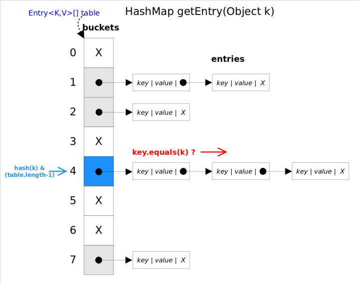

上图中hash(k)&(table.length-1)等价于hash(k)%table.length，原因是*HashMap*要求table.length必须是2的指数，因此table.length-1就是二进制低位全是1，跟hash(k)相与会将哈希值的高位全抹掉，剩下的就是余数了。

```java
//getEntry()方法
final Entry<K,V> getEntry(Object key) {
    ......
    int hash = (key == null) ? 0 : hash(key);
    for (Entry<K,V> e = table[hash&(table.length-1)];//得到冲突链表
         e != null; e = e.next) {//依次遍历冲突链表中的每个entry
        Object k;
        //依据equals()方法判断是否相等
        if (e.hash == hash &&
            ((k = e.key) == key || (key != null && key.equals(k))))
            return e;
    }
    return null;
}
```

- **put()**

put(K key, V value)方法是将指定的key, value对添加到map里。该方法首先会对map做一次查找，看是否包含该元组，如果已经包含则直接返回，查找过程类似于getEntry()方法；如果没有找到，则会通过addEntry(int hash, K key, V value, int bucketIndex)方法插入新的entry，插入方式为**头插法**。

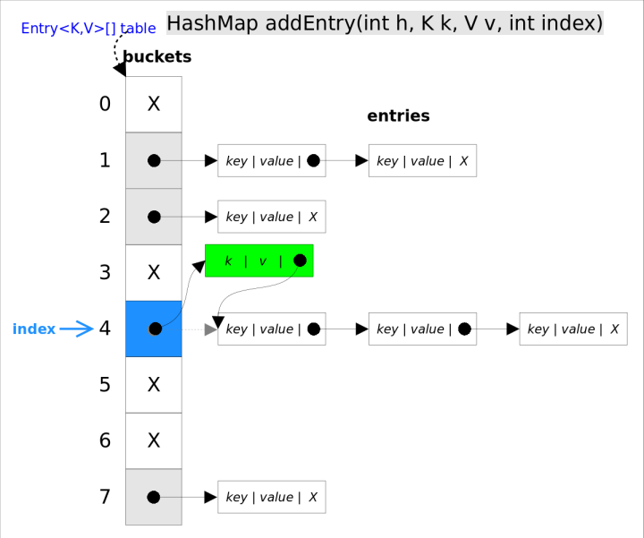

```java
//addEntry()
void addEntry(int hash, K key, V value, int bucketIndex) {
    if ((size >= threshold) && (null != table[bucketIndex])) {
        resize(2 * table.length);//自动扩容，并重新哈希
        hash = (null != key) ? hash(key) : 0;
        bucketIndex = hash & (table.length-1);//hash%table.length
    }
    //在冲突链表头部插入新的entry
    Entry<K,V> e = table[bucketIndex];
    table[bucketIndex] = new Entry<>(hash, key, value, e);
    size++;
}
```

- **remove()**

remove(Object key)的作用是删除key值对应的entry，该方法的具体逻辑是在removeEntryForKey(Object key)里实现的。removeEntryForKey()方法会首先找到key值对应的entry，然后删除该entry（修改链表的相应指针）。查找过程跟getEntry()过程类似。

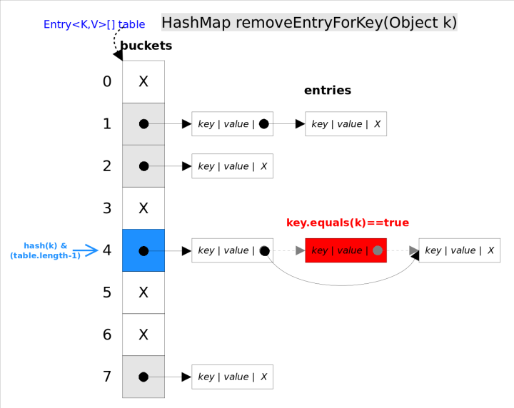

```java
//removeEntryForKey()
final Entry<K,V> removeEntryForKey(Object key) {
    ......
    int hash = (key == null) ? 0 : hash(key);
    int i = indexFor(hash, table.length);//hash&(table.length-1)
    Entry<K,V> prev = table[i];//得到冲突链表
    Entry<K,V> e = prev;
    while (e != null) {//遍历冲突链表
        Entry<K,V> next = e.next;
        Object k;
        if (e.hash == hash &&
            ((k = e.key) == key || (key != null && key.equals(k)))) {//找到要删除的entry
            modCount++; size--;
            if (prev == e) table[i] = next;//删除的是冲突链表的第一个entry
            else prev.next = next;
            return e;
        }
        prev = e; e = next;
    }
    return e;
}
```

### HashSet

前面已经说过*HashSet*是对*HashMap*的简单包装，对*HashSet*的函数调用都会转换成合适的*HashMap*方法，因此*HashSet*的实现非常简单，只有不到300行代码。这里不再赘述。

```java
//HashSet是对HashMap的简单包装
public class HashSet<E>
{
    ......
    private transient HashMap<E,Object> map;//HashSet里面有一个HashMap
    // Dummy value to associate with an Object in the backing Map
    private static final Object PRESENT = new Object();
    public HashSet() {
        map = new HashMap<>();
    }
    ......
    public boolean add(E e) {//简单的方法转换
        return map.put(e, PRESENT)==null;
    }
    ......
}
```

> 在HashMap中要找到某个元素，需要根据key的hash值来求得对应数组中的位置。对于任意给定的对象，只要它的hashCode()返回值相同，那么程序调用hash(int h)方法所计算得到的hash码值总是相同的。我们首先想到的就是把hash值对数组长度取模运算，这样一来，元素的分布相对来说是比较均匀的。但是，“模”运算的消耗还是比较大的，在HashMap中，**(n - 1) & hash**用于计算对象应该保存在table数组的哪个索引处。HashMap底层数组的长度总是2的n次方，当数组长度为2的n次幂的时候，**(n - 1) & hash** 算得的index相同的几率较小，数据在数组上分布就比较均匀，也就是说碰撞的几率小，相对的，查询的时候就不用遍历某个位置上的链表，这样查询效率也就较高了。

## LinkedHashMap

LinkedHashMap继承自HashMap，它主要是用链表实现来扩展HashMap类，HashMap中条目是没有顺序的，但是在LinkedHashMap中元素既可以按照它们插入图的顺序排序，也可以按它们最后一次被访问的顺序排序。

*LinkedHashSet*和*LinkedHashMap*在Java里也有着相同的实现，前者仅仅是对后者做了一层包装，也就是说**LinkedHashSet里面有一个LinkedHashMap（适配器模式）**。

*LinkedHashMap*实现了*Map*接口，即允许放入key为null的元素，也允许插入value为null的元素。从名字上可以看出该容器是*linked list*和*HashMap*的混合体，也就是说它同时满足*HashMap*和*linked list*的某些特性。**可将LinkedHashMap看作采用linked list增强的HashMap。**

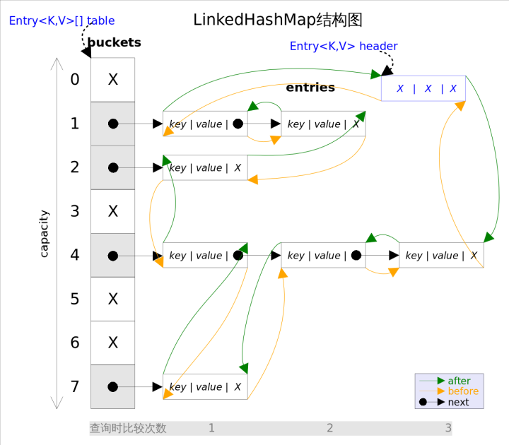

事实上*LinkedHashMap*是*HashMap*的直接子类，**二者唯一的区别是LinkedHashMap在HashMap的基础上，采用双向链表（doubly-linked list）的形式将所有entry连接起来，这样是为保证元素的迭代顺序跟插入顺序相同**。上图给出了*LinkedHashMap*的结构图，主体部分跟*HashMap*完全一样，多了header指向双向链表的头部（是一个哑元），**该双向链表的迭代顺序就是entry的插入顺序**。

除了可以保迭代历顺序，这种结构还有一个好处：**迭代LinkedHashMap时不需要像HashMap那样遍历整个table，而只需要直接遍历header指向的双向链表即可**，也就是说*LinkedHashMap*的迭代时间就只跟entry的个数相关，而跟table的大小无关。

有两个参数可以影响*LinkedHashMap*的性能：初始容量（inital capacity）和负载系数（load factor）。初始容量指定了初始table的大小，负载系数用来指定自动扩容的临界值。当entry的数量超过capacity*load_factor时，容器将自动扩容并重新哈希。对于插入元素较多的场景，将初始容量设大可以减少重新哈希的次数。

将对象放入到*LinkedHashMap*或*LinkedHashSet*中时，有两个方法需要特别关心：hashCode()和equals()。**hashCode()方法决定了对象会被放到哪个bucket里，当多个对象的哈希值冲突时，equals()方法决定了这些对象是否是“同一个对象”**。所以，如果要将自定义的对象放入到LinkedHashMap或LinkedHashSet中，需要@Override hashCode()和equals()方法。

通过如下方式可以得到一个跟源*Map**迭代顺序**一样的LinkedHashMap*：

```java
void foo(Map m) {
    Map copy = new LinkedHashMap(m);
    ...
}
```

出于性能原因，*LinkedHashMap*是非同步的（not synchronized），如果需要在多线程环境使用，需要程序员手动同步；或者通过如下方式将*LinkedHashMap*包装成（wrapped）同步的：

```java
Map m = Collections.synchronizedMap(new LinkedHashMap(...));
```

- **get()**

get(Object key)方法根据指定的key值返回对应的value。该方法跟HashMap.get()方法的流程几乎完全一样

- **put()**

put(K key, V value)方法是将指定的key, value对添加到map里。该方法首先会对map做一次查找，看是否包含该元组，如果已经包含则直接返回，查找过程类似于get()方法；如果没有找到，则会通过addEntry(int hash, K key, V value, int bucketIndex)方法插入新的entry。

注意，这里的**插入有两重含义**：

1. 从table的角度看，新的entry需要插入到对应的bucket里，当有哈希冲突时，采用头插法将新的entry插入到冲突链表的头部。
2. 从header的角度看，新的entry需要插入到双向链表的尾部。

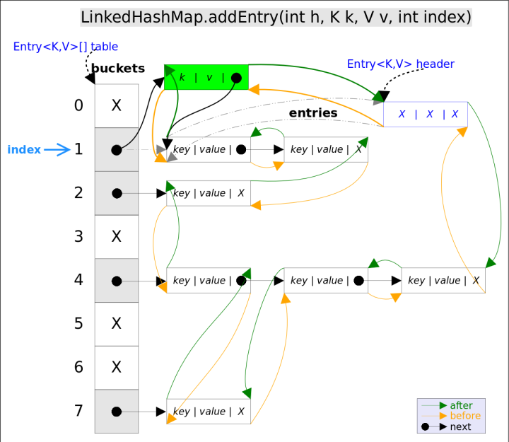

addEntry()代码如下：

```java
// LinkedHashMap.addEntry()
void addEntry(int hash, K key, V value, int bucketIndex) {
    if ((size >= threshold) && (null != table[bucketIndex])) {
        resize(2 * table.length);// 自动扩容，并重新哈希
        hash = (null != key) ? hash(key) : 0;
        bucketIndex = hash & (table.length-1);// hash%table.length
    }
    // 1.在冲突链表头部插入新的entry
    HashMap.Entry<K,V> old = table[bucketIndex];
    Entry<K,V> e = new Entry<>(hash, key, value, old);
    table[bucketIndex] = e;
    // 2.在双向链表的尾部插入新的entry
    e.addBefore(header);
    size++;
}
```

上述代码中用到了addBefore()方法将新entry e插入到双向链表头引用header的前面，这样e就成为双向链表中的最后一个元素。addBefore()的代码如下：

```java
// LinkedHashMap.Entry.addBefor()，将this插入到existingEntry的前面
private void addBefore(Entry<K,V> existingEntry) {
    after  = existingEntry;
    before = existingEntry.before;
    before.after = this;
    after.before = this;
}
```

上述代码只是简单修改相关entry的引用而已。

- **remove()**

remove(Object key)的作用是删除key值对应的entry，该方法的具体逻辑是在removeEntryForKey(Object key)里实现的。removeEntryForKey()方法会首先找到key值对应的entry，然后删除该entry（修改链表的相应引用）。查找过程跟get()方法类似。

注意，这里的**删除也有两重含义**：

> 1. 从table的角度看，需要将该entry从对应的bucket里删除，如果对应的冲突链表不空，需要修改冲突链表的相应引用。
> 2. 从header的角度来看，需要将该entry从双向链表中删除，同时修改链表中前面以及后面元素的相应引用。

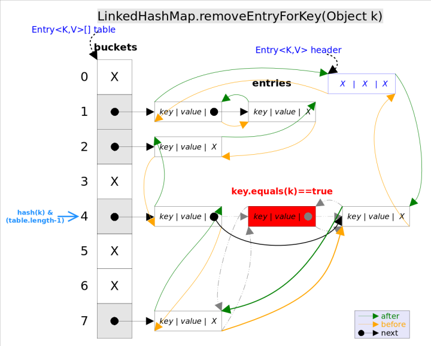

removeEntryForKey()对应的代码如下：

```java
// LinkedHashMap.removeEntryForKey()，删除key值对应的entry
final Entry<K,V> removeEntryForKey(Object key) {
    ......
    int hash = (key == null) ? 0 : hash(key);
    int i = indexFor(hash, table.length);// hash&(table.length-1)
    Entry<K,V> prev = table[i];// 得到冲突链表
    Entry<K,V> e = prev;
    while (e != null) {// 遍历冲突链表
        Entry<K,V> next = e.next;
        Object k;
        if (e.hash == hash &&
            ((k = e.key) == key || (key != null && key.equals(k)))) {// 找到要删除的entry
            modCount++; size--;
            // 1. 将e从对应bucket的冲突链表中删除
            if (prev == e) table[i] = next;
            else prev.next = next;
            // 2. 将e从双向链表中删除
            e.before.after = e.after;
            e.after.before = e.before;
            return e;
        }
        prev = e; e = next;
    }
    return e;
}
```

### LinkedHashSet

前面已经说过*LinkedHashSet*是对*LinkedHashMap*的简单包装，对*LinkedHashSet*的函数调用都会转换成合适的*LinkedHashMap*方法，因此*LinkedHashSet*的实现非常简单，这里不再赘述。

```java
public class LinkedHashSet<E>
    extends HashSet<E>
    implements Set<E>, Cloneable, java.io.Serializable {
    ......
    // LinkedHashSet里面有一个LinkedHashMap
    public LinkedHashSet(int initialCapacity, float loadFactor) {
        map = new LinkedHashMap<>(initialCapacity, loadFactor);
    }
    ......
    public boolean add(E e) {//简单的方法转换
        return map.put(e, PRESENT)==null;
    }
    ......
}
```

## TreeMap

TreeMap基于红黑树数据结构的实现，键值可以使用Comparable或Comparator接口来排序。TreeMap继承自AbstractMap，同时实现了接口NavigableMap，而接口NavigableMap则继承自SortedMap。SortedMap是Map的子接口，使用它可以确保图中的条目是排好序的。

在实际使用中，如果更新图时不需要保持图中元素的顺序，就使用HashMap，如果需要保持图中元素的插入顺序或者访问顺序，就使用LinkedHashMap，如果需要使图按照键值排序，就使用TreeMap。

## WeakHashMap

*WeakHashMap*，从名字可以看出它是某种 *Map*。它的特殊之处在于 *WeakHashMap* 里的entry可能会被GC自动删除，即使程序员没有调用remove()或者clear()方法。

更直观的说，当使用 *WeakHashMap* 时，即使没有显示的添加或删除任何元素，也可能发生如下情况：

> - 调用两次size()方法返回不同的值；
> - 两次调用isEmpty()方法，第一次返回false，第二次返回true；
> - 两次调用containsKey()方法，第一次返回true，第二次返回false，尽管两次使用的是同一个key；
> - 两次调用get()方法，第一次返回一个value，第二次返回null，尽管两次使用的是同一个对象。

遇到这么奇葩的现象，你是不是觉得使用者一定会疯掉？其实不然，*WeekHashMap* 的这个特点特别适用于需要缓存的场景。在缓存场景下，由于内存是有限的，不能缓存所有对象；对象缓存命中可以提高系统效率，但缓存MISS也不会造成错误，因为可以通过计算重新得到。

要明白 *WeekHashMap* 的工作原理，还需要引入一个概念：弱引用（WeakReference）。我们都知道Java中内存是通过GC自动管理的，GC会在程序运行过程中自动判断哪些对象是可以被回收的，并在合适的时机进行内存释放。GC判断某个对象是否可被回收的依据是，是否有有效的引用指向该对象。如果没有有效引用指向该对象（基本意味着不存在访问该对象的方式），那么该对象就是可回收的。这里的“有效引用”并不包括弱引用。也就是说，虽然弱引用可以用来访问对象，但进行垃圾回收时弱引用并不会被考虑在内，仅有弱引用指向的对象仍然会被GC回收。

*WeakHashMap* 内部是通过弱引用来管理entry的，弱引用的特性对应到 *WeakHashMap* 上意味着什么呢？将一对key, value放入到 *WeakHashMap* 里并不能避免该key值被GC回收，除非在 *WeakHashMap* 之外还有对该key的强引用。

关于强引用，弱引用等概念以后再具体讲解，这里只需要知道Java中引用也是分种类的，并且不同种类的引用对GC的影响不同就够了。

**具体实现**

WeakHashMap的存储结构类似于HashMap

**Weak HashSet?**

既然有 *WeekHashMap*，是否有 *WeekHashSet* 呢？答案是没有:( 。不过Java *Collections*工具类给出了解决方案，Collections.newSetFromMap(Map<E,Boolean> map)方法可以将任何 *Map*包装成一个*Set*。通过如下方式可以快速得到一个 *Weak HashSet*：

```java
// 将WeakHashMap包装成一个Set
Set<Object> weakHashSet = Collections.newSetFromMap(
        new WeakHashMap<Object, Boolean>());
```

不出你所料，newSetFromMap()方法只是对传入的 *Map*做了简单包装：

```java
// Collections.newSetFromMap()用于将任何Map包装成一个Set
public static <E> Set<E> newSetFromMap(Map<E, Boolean> map) {
    return new SetFromMap<>(map);
}

private static class SetFromMap<E> extends AbstractSet<E>
    implements Set<E>, Serializable
{
    private final Map<E, Boolean> m;  // The backing map
    private transient Set<E> s;       // Its keySet
    SetFromMap(Map<E, Boolean> map) {
        if (!map.isEmpty())
            throw new IllegalArgumentException("Map is non-empty");
        m = map;
        s = map.keySet();
    }
    public void clear()               {        m.clear(); }
    public int size()                 { return m.size(); }
    public boolean isEmpty()          { return m.isEmpty(); }
    public boolean contains(Object o) { return m.containsKey(o); }
    public boolean remove(Object o)   { return m.remove(o) != null; }
    public boolean add(E e) { return m.put(e, Boolean.TRUE) == null; }
    public Iterator<E> iterator()     { return s.iterator(); }
    public Object[] toArray()         { return s.toArray(); }
    public <T> T[] toArray(T[] a)     { return s.toArray(a); }
    public String toString()          { return s.toString(); }
    public int hashCode()             { return s.hashCode(); }
    public boolean equals(Object o)   { return o == this || s.equals(o); }
    public boolean containsAll(Collection<?> c) {return s.containsAll(c);}
    public boolean removeAll(Collection<?> c)   {return s.removeAll(c);}
    public boolean retainAll(Collection<?> c)   {return s.retainAll(c);}
    // addAll is the only inherited implementation
    ......
}
```

## Hashtable

Hashtable和前面介绍的HashMap很类似，它也是一个散列表，存储的内容是键值对映射，不同之处在于，Hashtable是继承自Dictionary的，Hashtable中的函数都是同步的，这意味着它也是线程安全的，另外，Hashtable中key和value都不可以为null。

上面的三个集合类都是在Java2之前推出的容器类，可以看到，尽管在使用中效率比较低，但是它们都是线程安全的。下面介绍两个特殊的集合类。

## Map总结

- Map

- - Map集合的数据结构仅仅针对键有效，与值无关。
  - 存储的键值对形式的元素，键唯一，值可重复。


- HashMap

- - 底层数据结构是哈希表

  - 哈希表依赖两个方法：hashCode()和equals()

  - 执行顺序：

  - - 首先判断hashCode()值是否相同

    - - 是：继续执行equals(),看其返回值

      - - 是true：说明元素重复，不添加
        - 是false：就直接添加到集合

      - 否：就直接添加到集合

    - 最终：自动生成hashCode()和equals()即可

  - LinkedHashSet

  - - 底层数据结构由链表和哈希表组成
    - 由链表保证元素有序
    - 由哈希表保证元素唯一

- Hashtable

- - 底层数据结构是哈希表.线程安全，效率低

  - 哈希表依赖两个方法：hashCode()和equals()

  - 执行顺序：

  - - 首先判断hashCode()值是否相同

    - - 是：继续执行equals(),看其返回值

      - - 是true：说明元素重复，不添加
        - 是false：就直接添加到集合

      - 否：就直接添加到集合

    - 最终：自动生成hashCode()和equals()即可

- TreeMap

- - 底层数据结构是红黑树（是一种平衡的二叉树）

  - 如何保证元素唯一性呢？

  - - 根据比较的返回值是否是0来确定

  - 如何保证元素的排序呢？

  - - 两种方式

    - - 自然排序（元素具备比较性）

      - - 让元素所属的类实现Comparable接口

      - 比较器排序（集合具备比较性）

      - - 让集合接受一个Comparator的实现类对象

集合的常见方法及遍历方式

Collection：

add()

remove()

contains()

iterator()

size()

遍历：

增强for

迭代器

- List

get（）

遍历：

普通for

- Set

Map：

put()

remove()

containskey(),containsValue()

keySet()

get()

value()

entrySet()

size()

遍历：

根据键找值

根据键值对对象分别找键和值

## Collections工具类

针对集合操作的工具类，有对集合进行排序和二分查找的方法

```java
public static <T> void sort(List<T> list);//排序，默认情况下是自然排序
public static <T> void binarySearch(List<?> list,T key);//二分查找
public static void reverse(List<T> list);//反转
public static void shuffle(List<?> list);//随机置换
```

# 红黑树

## 体介绍

Java *TreeMap*实现了*SortedMap*接口，也就是说会按照key的大小顺序对*Map*中的元素进行排序，key大小的评判可以通过其本身的自然顺序（natural ordering），也可以通过构造时传入的比较器（Comparator）。

**TreeMap底层通过红黑树（Red-Black tree）实现**，也就意味着containsKey(), get(), put(), remove()都有着log(n)的时间复杂度。其具体算法实现参照了《算法导论》。

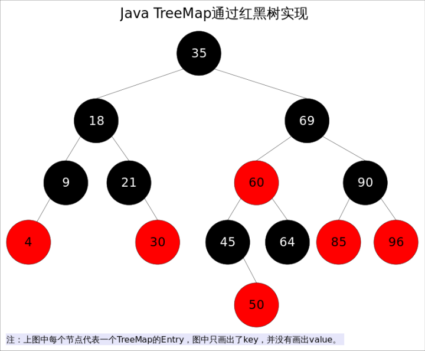

出于性能原因，*TreeMap*是非同步的（not synchronized），如果需要在多线程环境使用，需要程序员手动同步；或者通过如下方式将*TreeMap*包装成（wrapped）同步的：

SortedMap m = Collections.synchronizedSortedMap(new TreeMap(...));

**红黑树是一种近似平衡的二叉查找树，它能够确保任何一个节点的左右子树的高度差不会超过二者中较低那个的一陪**。具体来说，红黑树是满足如下条件的二叉查找树（binary search tree）：

1. 每个节点要么是红色，要么是黑色。
2. 根节点必须是黑色
3. 红色节点不能连续（也即是，红色节点的孩子和父亲都不能是红色）。
4. 对于每个节点，从该点至null（树尾端）的任何路径，都含有相同个数的黑色节点。

在树的结构发生改变时（插入或者删除操作），往往会破坏上述条件3或条件4，需要通过调整使得查找树重新满足红黑树的条件。

## 预备知识

前文说到当查找树的结构发生改变时，红黑树的条件可能被破坏，需要通过调整使得查找树重新满足红黑树的条件。调整可以分为两类：一类是颜色调整，即改变某个节点的颜色；另一类是结构调整，集改变检索树的结构关系。结构调整过程包含两个基本操作：**左旋（Rotate Left），右旋（RotateRight）**。

## 左旋

左旋的过程是将x的右子树绕x逆时针旋转，使得x的右子树成为x的父亲，同时修改相关节点的引用。旋转之后，二叉查找树的属性仍然满足。

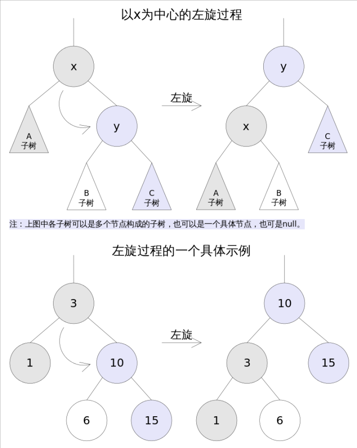

*TreeMap*中左旋代码如下：

```java
//Rotate Left
private void rotateLeft(Entry<K,V> p) {
    if (p != null) {
        Entry<K,V> r = p.right;
        p.right = r.left;
        if (r.left != null)
            r.left.parent = p;
        r.parent = p.parent;
        if (p.parent == null)
            root = r;
        else if (p.parent.left == p)
            p.parent.left = r;
        else
            p.parent.right = r;
        r.left = p;
        p.parent = r;
    }
}
```

## **右旋**

右旋的过程是将x的左子树绕x顺时针旋转，使得x的左子树成为x的父亲，同时修改相关节点的引用。旋转之后，二叉查找树的属性仍然满足。

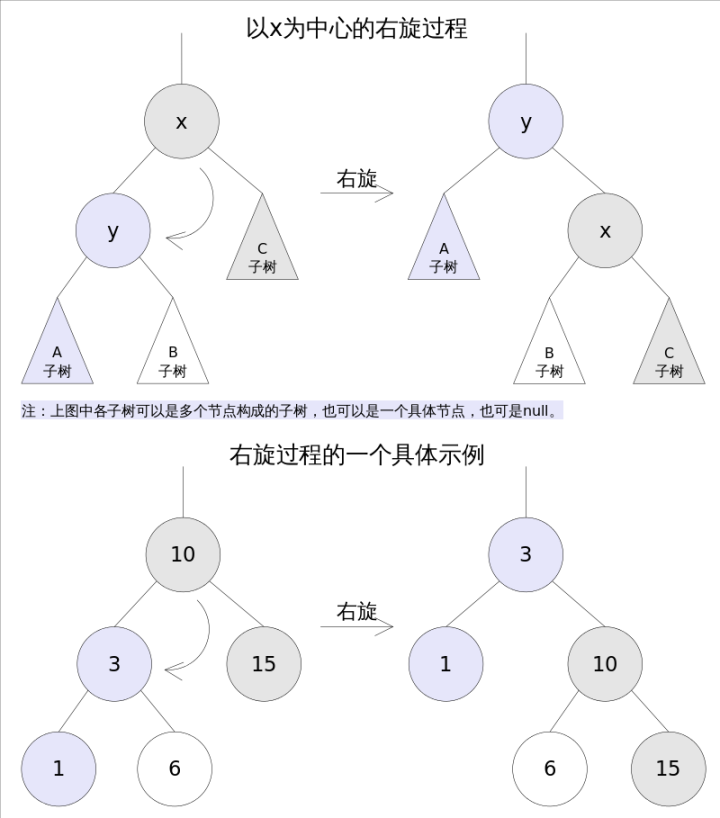

*TreeMap*中右旋代码如下：

```java
//Rotate Right
private void rotateRight(Entry<K,V> p) {
    if (p != null) {
        Entry<K,V> l = p.left;
        p.left = l.right;
        if (l.right != null) l.right.parent = p;
        l.parent = p.parent;
        if (p.parent == null)
            root = l;
        else if (p.parent.right == p)
            p.parent.right = l;
        else p.parent.left = l;
        l.right = p;
        p.parent = l;
    }
}
```

## 方法剖析

- **get()**

get(Object key)方法根据指定的key值返回对应的value，该方法调用了getEntry(Object key)得到相应的entry，然后返回entry.value。因此getEntry()是算法的核心。算法思想是根据key的自然顺序（或者比较器顺序）对二叉查找树进行查找，直到找到满足k.compareTo(p.key) == 0的entry。

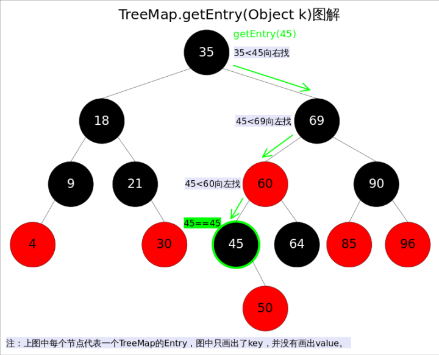

具体代码如下：

```java
//getEntry()方法
final Entry<K,V> getEntry(Object key) {
    ......
    if (key == null)//不允许key值为null
        throw new NullPointerException();
    Comparable<? super K> k = (Comparable<? super K>) key;//使用元素的自然顺序
    Entry<K,V> p = root;
    while (p != null) {
        int cmp = k.compareTo(p.key);
        if (cmp < 0)//向左找
            p = p.left;
        else if (cmp > 0)//向右找
            p = p.right;
        else
            return p;
    }
    return null;
}

```

- **put()**

put(K key, V value)方法是将指定的key, value对添加到map里。该方法首先会对map做一次查找，看是否包含该元组，如果已经包含则直接返回，查找过程类似于getEntry()方法；如果没有找到则会在红黑树中插入新的entry，如果插入之后破坏了红黑树的约束，还需要进行调整（旋转，改变某些节点的颜色）。

```java
public V put(K key, V value) {
    ......
    int cmp;
    Entry<K,V> parent;
    if (key == null)
        throw new NullPointerException();
    Comparable<? super K> k = (Comparable<? super K>) key;//使用元素的自然顺序
    do {
        parent = t;
        cmp = k.compareTo(t.key);
        if (cmp < 0) t = t.left;//向左找
        else if (cmp > 0) t = t.right;//向右找
        else return t.setValue(value);
    } while (t != null);
    Entry<K,V> e = new Entry<>(key, value, parent);//创建并插入新的entry
    if (cmp < 0) parent.left = e;
    else parent.right = e;
    fixAfterInsertion(e);//调整
    size++;
    return null;
}

```

上述代码的插入部分并不难理解：首先在红黑树上找到合适的位置，然后创建新的entry并插入（当然，新插入的节点一定是树的叶子）。难点是调整函数fixAfterInsertion()，前面已经说过，调整往往需要1.改变某些节点的颜色，2.对某些节点进行旋转。

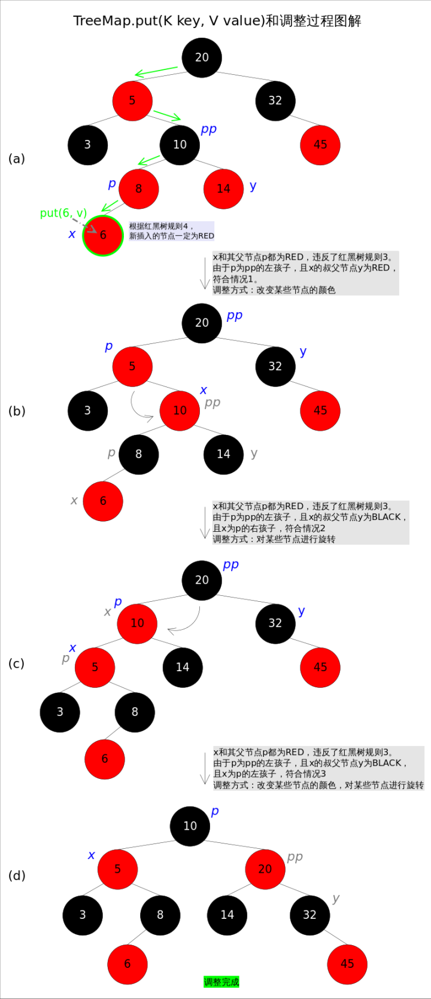

调整函数fixAfterInsertion()的具体代码如下，其中用到了上文中提到的rotateLeft()和rotateRight()函数。通过代码我们能够看到，情况2其实是落在情况3内的。情况4～情况6跟前三种情况是对称的，因此图解中并没有画出后三种情况，读者可以参考代码自行理解。

```java
//红黑树调整函数fixAfterInsertion()
private void fixAfterInsertion(Entry<K,V> x) {
    x.color = RED;
    while (x != null && x != root && x.parent.color == RED) {
        if (parentOf(x) == leftOf(parentOf(parentOf(x)))) {
            Entry<K,V> y = rightOf(parentOf(parentOf(x)));
            if (colorOf(y) == RED) {//如果y为null，则视为BLACK
                setColor(parentOf(x), BLACK);              // 情况1
                setColor(y, BLACK);                        // 情况1
                setColor(parentOf(parentOf(x)), RED);      // 情况1
                x = parentOf(parentOf(x));                 // 情况1
            } else {
                if (x == rightOf(parentOf(x))) {
                    x = parentOf(x);                       // 情况2
                    rotateLeft(x);                         // 情况2
                }
                setColor(parentOf(x), BLACK);              // 情况3
                setColor(parentOf(parentOf(x)), RED);      // 情况3
                rotateRight(parentOf(parentOf(x)));        // 情况3
            }
        } else {
            Entry<K,V> y = leftOf(parentOf(parentOf(x)));
            if (colorOf(y) == RED) {
                setColor(parentOf(x), BLACK);              // 情况4
                setColor(y, BLACK);                        // 情况4
                setColor(parentOf(parentOf(x)), RED);      // 情况4
                x = parentOf(parentOf(x));                 // 情况4
            } else {
                if (x == leftOf(parentOf(x))) {
                    x = parentOf(x);                       // 情况5
                    rotateRight(x);                        // 情况5
                }
                setColor(parentOf(x), BLACK);              // 情况6
                setColor(parentOf(parentOf(x)), RED);      // 情况6
                rotateLeft(parentOf(parentOf(x)));         // 情况6
            }
        }
    }
    root.color = BLACK;
}

```

- **remove()**

remove(Object key)的作用是删除key值对应的entry，该方法首先通过上文中提到的getEntry(Object key)方法找到key值对应的entry，然后调用deleteEntry(Entry<K,V> entry)删除对应的entry。由于删除操作会改变红黑树的结构，有可能破坏红黑树的约束，因此有可能要进行调整。

## 寻找节点后继

对于一棵二叉查找树，给定节点t，其后继（树种比大于t的最小的那个元素）可以通过如下方式找到：

> 1. t的右子树不空，则t的后继是其右子树中最小的那个元素。
> 2. t的右孩子为空，则t的后继是其第一个向左走的祖先。

后继节点在红黑树的删除操作中将会用到。

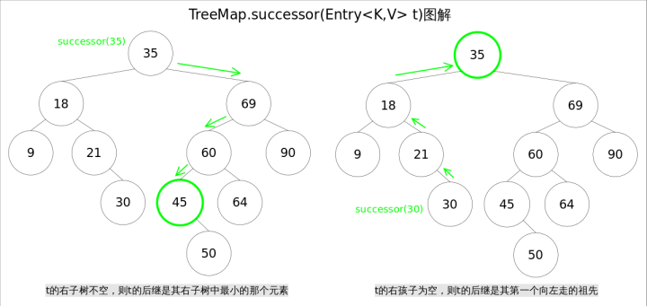

TreeMap

中寻找节点后继的代码如下：

```
// 寻找节点后继函数successor()
static <K,V> TreeMap.Entry<K,V> successor(Entry<K,V> t) {
    if (t == null)
        return null;
    else if (t.right != null) {// 1. t的右子树不空，则t的后继是其右子树中最小的那个元素
        Entry<K,V> p = t.right;
        while (p.left != null)
            p = p.left;
        return p;
    } else {// 2. t的右孩子为空，则t的后继是其第一个向左走的祖先
        Entry<K,V> p = t.parent;
        Entry<K,V> ch = t;
        while (p != null && ch == p.right) {
            ch = p;
            p = p.parent;
        }
        return p;
    }
}

```

**remove()**

remove(Object key)的作用是删除key值对应的entry，该方法首先通过上文中提到的getEntry(Object key)方法找到key值对应的entry，然后调用deleteEntry(Entry<K,V> entry)删除对应的entry。由于删除操作会改变红黑树的结构，有可能破坏红黑树的约束条件，因此有可能要进行调整。

getEntry()函数前面已经讲解过，这里重点放deleteEntry()上，该函数删除指定的entry并在红黑树的约束被破坏时进行调用fixAfterDeletion(Entry<K,V> x)进行调整。

**由于红黑树是一棵增强版的二叉查找树，红黑树的删除操作跟普通二叉查找树的删除操作也就非常相似，唯一的区别是红黑树在节点删除之后可能需要进行调整**。现在考虑一棵普通二叉查找树的删除过程，可以简单分为两种情况：

> 1. 删除点p的左右子树都为空，或者只有一棵子树非空。
> 2. 删除点p的左右子树都非空。

对于上述情况1，处理起来比较简单，直接将p删除（左右子树都为空时），或者用非空子树替代p（只有一棵子树非空时）；对于情况2，可以用p的后继s（树中大于x的最小的那个元素）代替p，然后使用情况1删除s（此时s一定满足情况1，可以画画看）。

基于以上逻辑，红黑树的节点删除函数deleteEntry()代码如下：

```java
// 红黑树entry删除函数deleteEntry()
private void deleteEntry(Entry<K,V> p) {
    modCount++;
    size--;
    if (p.left != null && p.right != null) {// 2. 删除点p的左右子树都非空。
        Entry<K,V> s = successor(p);// 后继
        p.key = s.key;
        p.value = s.value;
        p = s;
    }
    Entry<K,V> replacement = (p.left != null ? p.left : p.right);
    if (replacement != null) {// 1. 删除点p只有一棵子树非空。
        replacement.parent = p.parent;
        if (p.parent == null)
            root = replacement;
        else if (p == p.parent.left)
            p.parent.left  = replacement;
        else
            p.parent.right = replacement;
        p.left = p.right = p.parent = null;
        if (p.color == BLACK)
            fixAfterDeletion(replacement);// 调整
    } else if (p.parent == null) {
        root = null;
    } else { // 1. 删除点p的左右子树都为空
        if (p.color == BLACK)
            fixAfterDeletion(p);// 调整
        if (p.parent != null) {
            if (p == p.parent.left)
                p.parent.left = null;
            else if (p == p.parent.right)
                p.parent.right = null;
            p.parent = null;
        }
    }
}

```

上述代码中占据大量代码行的，是用来修改父子节点间引用关系的代码，其逻辑并不难理解。下面着重讲解删除后调整函数fixAfterDeletion()。首先请思考一下，删除了哪些点才会导致调整？**只有删除点是BLACK的时候，才会触发调整函数**，因为删除RED节点不会破坏红黑树的任何约束，而删除BLACK节点会破坏规则4。

跟上文中讲过的fixAfterInsertion()函数一样，这里也要分成若干种情况。记住，无论有多少情况，具体的调整操作只有两种：1.改变某些节点的颜色，2.对某些节点进行旋转。

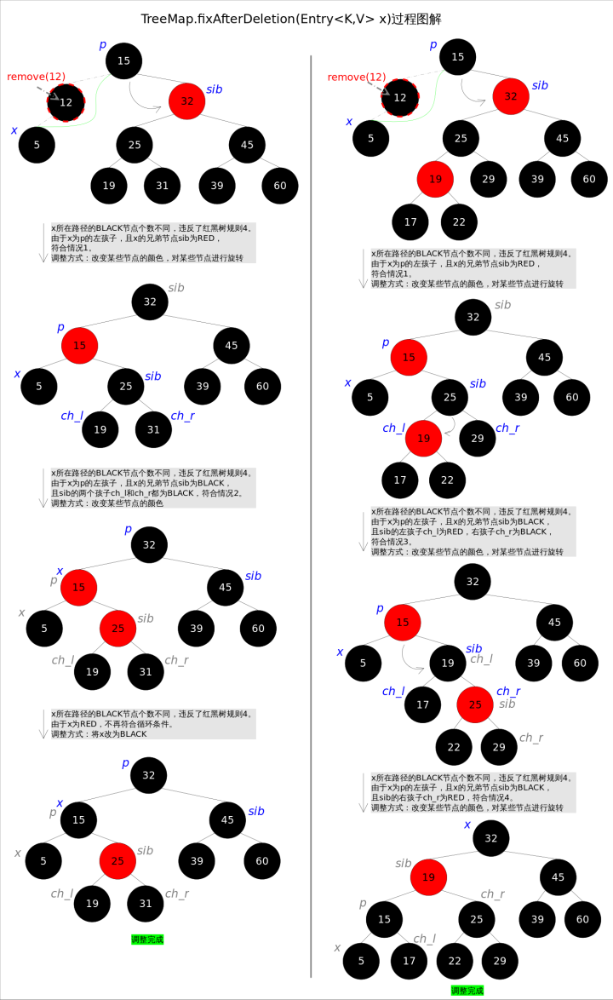

上述图解的总体思想是：将情况1首先转换成情况2，或者转换成情况3和情况4。当然，该图解并不意味着调整过程一定是从情况1开始。通过后续代码我们还会发现几个有趣的规则：a).如果是由情况1之后紧接着进入的情况2，那么情况2之后一定会退出循环（因为x为红色）；b).一旦进入情况3和情况4，一定会退出循环（因为x为root）。

删除后调整函数fixAfterDeletion()的具体代码如下，其中用到了上文中提到的rotateLeft()和rotateRight()函数。通过代码我们能够看到，情况3其实是落在情况4内的。情况5～情况8跟前四种情况是对称的，因此图解中并没有画出后四种情况，读者可以参考代码自行理解。

```java
private void fixAfterDeletion(Entry<K,V> x) {
    while (x != root && colorOf(x) == BLACK) {
        if (x == leftOf(parentOf(x))) {
            Entry<K,V> sib = rightOf(parentOf(x));
            if (colorOf(sib) == RED) {
                setColor(sib, BLACK);                   // 情况1
                setColor(parentOf(x), RED);             // 情况1
                rotateLeft(parentOf(x));                // 情况1
                sib = rightOf(parentOf(x));             // 情况1
            }
            if (colorOf(leftOf(sib))  == BLACK &&
                colorOf(rightOf(sib)) == BLACK) {
                setColor(sib, RED);                     // 情况2
                x = parentOf(x);                        // 情况2
            } else {
                if (colorOf(rightOf(sib)) == BLACK) {
                    setColor(leftOf(sib), BLACK);       // 情况3
                    setColor(sib, RED);                 // 情况3
                    rotateRight(sib);                   // 情况3
                    sib = rightOf(parentOf(x));         // 情况3
                }
                setColor(sib, colorOf(parentOf(x)));    // 情况4
                setColor(parentOf(x), BLACK);           // 情况4
                setColor(rightOf(sib), BLACK);          // 情况4
                rotateLeft(parentOf(x));                // 情况4
                x = root;                               // 情况4
            }
        } else { // 跟前四种情况对称
            Entry<K,V> sib = leftOf(parentOf(x));
            if (colorOf(sib) == RED) {
                setColor(sib, BLACK);                   // 情况5
                setColor(parentOf(x), RED);             // 情况5
                rotateRight(parentOf(x));               // 情况5
                sib = leftOf(parentOf(x));              // 情况5
            }
            if (colorOf(rightOf(sib)) == BLACK &&
                colorOf(leftOf(sib)) == BLACK) {
                setColor(sib, RED);                     // 情况6
                x = parentOf(x);                        // 情况6
            } else {
                if (colorOf(leftOf(sib)) == BLACK) {
                    setColor(rightOf(sib), BLACK);      // 情况7
                    setColor(sib, RED);                 // 情况7
                    rotateLeft(sib);                    // 情况7
                    sib = leftOf(parentOf(x));          // 情况7
                }
                setColor(sib, colorOf(parentOf(x)));    // 情况8
                setColor(parentOf(x), BLACK);           // 情况8
                setColor(leftOf(sib), BLACK);           // 情况8
                rotateRight(parentOf(x));               // 情况8
                x = root;                               // 情况8
            }
        }
    }
    setColor(x, BLACK);
}

```

### TreeSet

前面已经说过TreeSet是对TeeMap的简单包装，对TreeSet的函数调用都会转换成合适的TeeMap方法，因此TreeSet的实现非常简单。这里不再赘述。

```java
// TreeSet是对TreeMap的简单包装
public class TreeSet<E> extends AbstractSet<E>
    implements NavigableSet<E>, Cloneable, java.io.Serializable
{
    ......
    private transient NavigableMap<E,Object> m;
    // Dummy value to associate with an Object in the backing Map
    private static final Object PRESENT = new Object();
    public TreeSet() {
        this.m = new TreeMap<E,Object>();// TreeSet里面有一个TreeMap
    }
    ......
    public boolean add(E e) {
        return m.put(e, PRESENT)==null;
    }
    ......
}
```