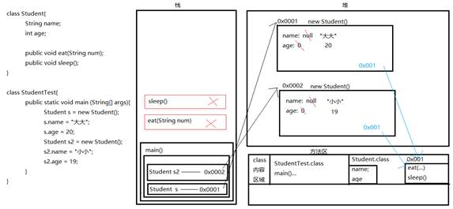

# 面向对象

## 对象与类

### 类

类是构造对象的模板或蓝图，类可以看作是一组对象的集合。一类事物的抽象。举个很简单的例子，经常会听到很多人说：“我不是那类人”。比如那一类就可以理解为“类”。那对象呢，对象就是”我“。在类与类之间，最常见的关系有：依赖（uses-a）、聚合（has-a）、继承（is-a）

### 对象

由类构造对象的过程称为创建类的实例，而这个示例就是对象，对于每个特定的类实例（对象）都有一组特定的实例域值，这些值的集合就是这个对象的当前状态。对象中的数据称为实例域，操作数据的过程称为方法。

**对象的三个主要特征：**

**对象的行为，对象的状态，对象标识**

对象状态的改变必须通过调用方法实现

作为一个类的实例，每个对象的标识永远是不同的，状态常常也存在着差异。

要想使用对象，必须首先构造对象，并指定其初始状态，然后对对象应用方法。

在Java中，使用构造器构造新实例。构造器是一种特殊的方法，用来构造并初始化对象，构造器的名字应该与类名相同。

一个对象变量并没有实际包含一个对象，而仅仅引用一个对象，任何对象变量的值都是对存储在另外一个地方的一个对象的引用，new操作符的返回值也是一个引用。如果将一个方法应用于一个值为null的对象上，就会产生错误。局部变量不会自动初始化为null，必须通过调用new或将他们呢设置为null进行初始化

### 对象内存图



在Java1.8之后永久区（PremGen）没有，方法区改为MetaSpace物理内存

具体可以看这篇文章：

[Java内存区域与Java对象](https://crowhawk.github.io/2017/08/09/jvm_1/)

### 成员变量与局部变量

定义这个对象的信息

成员变量与局部变量的区别

|      | 在类中位置       | 在内存中位置 | 生命周期                  | 初始化值                |
| ---- | ----------- | ------ | --------------------- | ------------------- |
| 成员变量 | 在类中方法外      | 在堆内存   | 随着对象创建而存在，随着对象消失而消失   | 有默认初始化值             |
| 局部变量 | 在方法内或者方法声明上 | 在栈内存   | 随着方法调用而存在，随着方法调用完毕而消失 | 没有默认初始化值，必须先定义赋值再使用 |

注意：当局部变量名称和成员变量名称一致时，采用就近原则

``` java
public class Cat {
    String name;//默认值为null
    int age;//默认值为0
    int num;//默认值为0

    public static void main(String[] args) {
        int num = 3;//局部变量
        System.out.println("这里有"+num+"只小猫");//输出为3
      	Cat c = new Cat();//创建Cat对象
        c.name="大大";
        c.age=18;
        System.out.println(c.name+c.age);//大大18
    }
}
```

### 方法

方法就是函数，函数在Java中被称为方法。方法是完成特定功能的代码块

方法在内存中位于方法区

方法是随着调用才会加载

方法与方法是平级关系，不能嵌套定义

方法定义时候参数之间用逗号隔开

方法调用升级后不用再传递数据类型

如果方法有明确返回值，一定要有return带回一个值

格式：修饰符 返回值类型 方法名 (参数类型 参数名1,参数类型 参数名2...){函数体; return 返回值;}

``` java
public void eat(String name,Date date){
  System.out.println(date+"吃了"+name);
}
public String MyName(String firstName,String lastName){
  String myname = firstName+lastName;
  return myname;
}
```


#### 方法的重载

在同一个类中，允许存在一个以上的同名方法，只要它们的参数个数或者参数类型不同即可

特点：与返回值类型无关，只看方法名和参数列表，在调用时虚拟机通过参数列表的不同来区分同名方法

```java
public class Cat {
    String name;
    int age;
    int num;
    public void eat(){
        System.out.println("猫吃鱼");
    }
    public void eat(String name){
        System.out.println("猫吃"+name);
    }
}

```

### 形参与实参

**形参：**方法被调用时需要传递进来的参数，如：show(int a)中的a，它只有在show被调用期间a才有意义，也就是会被分配内存空间，在方法show执行完成后，a就会被销毁释放空间，也就是不存在了

**实参：**方法被调用时是传入的实际值，它在方法被调用前就已经被初始化并且在方法被调用时传入。

```java
public static void show(int a) {
    a = 20;
    System.out.println(a);
}
public static void main(String[] args) {
    int a = 10;//实参
  	show(a);
}
```

int a=10;中的a在被调用之前就已经创建并初始化，在调用show方法时，他被当做参数传入，所以这个a是实参。
而show(int a)中的a只有在show被调用时它的生命周期才开始，而在show调用结束之后，它也随之被JVM释放掉，，所以这个a是形参。

当形式参数和返回值类型是引用类型时会和基本类型不同：

形参和返回值是类类型：实际传入的是该类对象

形参和返回值是抽象类：实际传入的是该抽象类的子类对象

形参和返回值是接口：需要的是该接口的实现类对象

#### Java到底是值传递还是传引用？

首先在Java里面有两种数据类型，基本数据类型与引用类型。

基本类型直接保存在变量中，引用类型变量保存的只是实际对象的地址，一般这种变量为”引用“，引用指向实际对象，实际对象中保存着内容。

按值调用(call by value):表示方法接收的是调用者提供的值

按引用调用(call byreference):表示方法接收的是调用者提供的变量地址

- 一个方法不能修改一个基本数据类型的参数（数值型和布尔型）
- 一个方法可以改变一个对象参数的状态
- 一个方法不能让对象参数引用一个新的对象

一个方法可以修改传递引用所对应的变量值，而不能修改传递值调用所对应的变量值。Java语言总是采用按值调用，也就是说，方法得到的是所有参数值的一个拷贝，特别是，方法不能修改传递给它的任何参数变量的内容。按引用调用，方法得到是对象引用及其他的拷贝同时引用同一个对象。


```java
int num = 1;//变量num保存着1这个值
int[] arr = new int[5];//变量arr在栈内存保存的是这个数组在堆内存的地址值，这个地址值引用堆内存的数组实际值
```

=：表示赋值运算符，对于基本数据类型，赋值运算符会直接改变变量的值，原本的值被覆盖，对于引用类型，赋值运算符改变引用中的地址值，而不是在堆内存的实际值。

``` java
int[] arr = new int[3];//这里并不会改变原本数组的值，而只是把新数组的引用赋值给arr
```


局部变量和方法参数在jvm中的储存方法是相同的，都是在栈上开辟空间来储存的，随着进入方法开辟，退出方法回收。以32位JVM为例，boolean/byte/short/char/int/float以及引用都是分配4字节空间，long/double分配8字节空间。对于每个方法来说，最多占用多少空间是一定的，这在编译时就可以计算好。

我们都知道JVM内存模型中有，stack和heap的存在，但是更准确的说，是每个线程都分配一个独享的stack，所有线程共享一个heap。对于每个方法的局部变量来说，是绝对无法被其他方法，甚至其他线程的同一方法所访问到的，更别说修改。

当我们在方法中声明一个 int i = 0，或者 Object obj = null 时，仅仅涉及stack，不影响到heap，当我们 new Object() 时，会在heap中开辟一段内存并初始化Object对象。当我们将这个对象赋予obj变量时，仅仅是stack中代表obj的那4个字节变更为这个对象的地址。

当我们声明一个数组时，如int[] arr = new int[10]，因为数组也是对象，arr实际上是引用，stack上仅仅占用4字节空间，new int[10]会在heap中开辟一个数组对象，然后arr指向它。

当我们声明一个二维数组时，如 `int[][] arr2 = new int[2]4]`，arr2同样仅在stack中占用4个字节，会在内存中开辟一个长度为2的，类型为int[]的数组，然后arr2指向这个数组。这个数组内部有两个引用（大小为4字节），分别指向两个长度为4的类型为int的数组。

所以当我们传递一个数组引用给一个方法时，数组的元素是可以被改变的，但是无法让数组引用指向新的数组。

**那Java是如何存储各种类型的数据呢？**

Java语言并不能操纵内存，一切都是由JVM来管理控制的，因此Java内存区域的划分也就是JVM的区域划分。详细底层可以参考：[Java的值传递和引用传递](https://juejin.im/post/5bce68226fb9a05ce46a0476#heading-9)

### 匿名对象

匿名对象就是没有名字的对象（是对象的一种简化表示形式）

匿名对象调用完毕就是垃圾，可以被垃圾回收器回收。

匿名对象可以作为实际参数传递

**对象调用方法仅仅一次的时候：**

``` java
//带名字的调用
Student s = new Student();
s.show();
s.show();
System.out.println("-------");
//匿名对象调用方法
new Student().show();
new Student().show();//不同的是，这里是创建了一个新的对象，并不是一个对象调用两次
//对于匿名对象，任何时候使用==比较，返回值是false
System.out.println("-------")
```

**作为实际参数传递：**

``` java
StudentDemo sd = new StudentDemo();
sd.method(new Student());//这里是method方法参数是一个学生类对象，这里使用匿名对象传入
new StudentDemo().method(new Student());//链式编程，等同于上面
```

### this关键字

代表所在类的对象引用

方法被哪个对象调用，this就代表哪个对象

当局部变量隐藏成员变量，可以使用this

this可以看作是一个变量，它的值是当前对象的引用

```java
public class Dog {
    int age;
    public Dog(int age) {
        this.age = age;//这个age是形参age，就近原则
      /*
      	这里的this是区分局部的形参age和成员变量this，
      	这个this.age相当于Dog d = new Dog;d.age;
      */
    }
    public Dog growDog(){//这个方法需要一个Dog对象的返回值
        age++;
        return this;//this相当于Dog类的对象
    }
    public void ageNow(){
        System.out.println("今年我"+age+"岁了");
    }
    public static void main(String[] args) {
        Dog d = new Dog(3);
        d.growDog().ageNow();
      //这里可以说是一个链式编程，创建dog类对象调用growDog方法，返回dog类对象再调用ageNow方法
    }
}

```

这个程序执行流程详解：


由上可以看出来，this一般出现在方法里，代表调用者，一开始this并不确定是谁，只有当谁调用了这个方法或者谁创建了这个对象，那么this就代表谁。

### final关键字

final：最终的意思。常见的是它可以修饰类，方法，变量。

特点：

* final可以修饰类，该类不能被继承。
* final可以修饰方法，该方法不能被重写。（覆盖，复写）
* final可以修饰变量，该变量不能被重新赋值，因为这个变量其实是常量。

当final修饰局部变量的问题：

基本类型：基本类型的值不能发生改变

引用类型：引用类型的地址值不能发生改变，但是该对象堆内存的值可以改变

``` java
public static void main (String[] args){
  int x = 100;
  x = 200;
  System.out.println("x:"+x);//x:200
  final int y = 300;
  //y = 400; 报错，无法为最终变量赋值
  Student s = new Student();//Student类里有一个final int age = 10;
  System.out.println(s.age);
  //s.age = 20;报错
  
  final Student ss = new Student();//final修饰引用类型，去掉Student上age的final
  ss.age = 100;
  //重新分配内存空间
  //ss = new Student(); 报错
}
```

final修饰变量的初始化时机：

被final修饰的变量只能赋值一次

在构造方法完毕前(非静态常量)

``` java
class finalDemo(){
  int num;
  final int num2;
  {
    //num2 = 20;报错
  }
  public finalDemo(){
    num = 10;
    //num2 = 20;报错
  }
}
```

由于继承中方法有一个现象：方法重写

所以父类的功能就会被子类给覆盖掉。

有时候我们不想让子类去覆盖掉父类的功能，只能让他使用。

这个时候，针对这种情况，Java就提供了一个关键字：final

### static关键字

针对多个对象有共同的相同的成员变量值的时候，Java就提供了一个关键字来修饰：static

**static的特点：**（可以修饰成员变量、成员方法）

- 随着类的加载而加载
- 优先于对象存在
- 被类的所有对象共享
- 可以通过类名调用（也可以通过对象名-一般不选择这种）

静态修饰的内容一般我们称其为：与类相关的，类成员

**static关键字注意事项：**

- 在静态方法中是没有this关键字的

  - 静态是随着类的加载而加载，this是随着对象的创建而存在。
  - 静态比对象先存在

- 静态方法只能访问静态的成员变量和静态的成员方法

- - 静态方法：

  - - 成员变量：只能访问静态变量
    - 成员方法：只能访问静态成员方法

  - 非静态方法：

  - - 成员变量：可以是静态的，也可以是非静态的
    - 成员方法：可以是静态的成员方法，也可以是非静态的成员方法

  - 静态只能访问静态

**静态变量和成员变量的区别：**

* 所属不同
  * 静态变量属于类，所以也称为类变量
  * 成员变量属于对象，所以也称为实例变量（对象变量）
* 内存中位置不同
  * 静态变量存储于方法区的静态区
  * 成与变量存储于堆内存
* 内存出现时间不同
  * 静态变量随着类的加载而加载，随着类的消失而消失
  * 成员变量随着对象的创建而存在，也可以通过对象调用
* 调用不同
  * 静态变量可以通过类名调用，也可以通过对象调用
  * 成员变量只能通过对象名调用

### 构造方法

给对象的数据进行初始化

格式：

- 方法名与类名相同
- 没有返回值类型，连void都没有
- 没有具体的返回值

构造方法的注意事项：

如果我们没有给出构造方法，系统将自动提供一个无参构造方法

如果我们给出了构造方法，系统将不再提供默认的无参构造方法

如果我们还想使用无参构造方法，就必须自己给出。建议永远给出

给成员变量赋值有两种方式：

- setXxx()
- 构造方法

### 类的组成

成员变量

构造方法

成员方法：

根据返回值：void与非void

根据形式参数列表：空参与非空参

**Student类初始化过程：**


类初始化过程：

1. 加载class文件进内存
2. 在栈内存开辟空间
3. 在对内存为类对象开辟空间
4. 对对象的成员变量进行默认初始化
5. 对对象的成员变量进行显示初始化
6. 通过构造方法对对象的成员变量赋值
7. 对象初始化完毕，吧对象地址复制给变量

**对象析构与finalize方法：**

在析构器中最常见的操作是回收分配给对象的存储空间，但Java不支持析构器，可以为任何一个类添加finalize方法，将在垃圾回收器清除对象之前调用。

**动态绑定：**

调用对象方法的执行过程：

编译器查看对象的声明类型和方法名

编译器查看调用方法时提供的参数类型

如果是private方法、static方法、final方法、或者构造器，那么编译器将准备的知道该调用哪个方法，这种调用方式为静态绑定。

调用的方法依赖于隐式参数的实际类型，并且在运行时实现动态绑定。

当程序运行时，并且采用动态绑定调用方法时，虚拟机一定调用与x所引用对象的实际类型最合适的那个类的方法。

虚拟机为了节省开销和时间，为每个类预先创建了一个方法表。

**什么时候定义成员变量：**

如果这个变量是用来描述这个类的信息的，那么该变量就应该定义为成员变量

变量的范围越小越好，因为能及时收回

**main方法格式**：


### 代码块

在Java中，使用{ }括起来的代码被称为代码块

根据其位置和声明不同，可以分为

**局部代码块：**

局部位置，用于限定变量的生命周期，及早释放，提高内存利用率

**构造代码块**

- 在类中的成员位置，用{ }括起来的代码。每次调用构造方法执行前，都会先执行构造代码块。

作用：

可以把多个构造方法中的共同代码放到一起，对对象进行初始化。

**静态代码块：**

在类中的成员位置，用{ }括起来的代码，只不过它用static修饰了

对类的数据进行初始化，仅仅只执行一次

作用：

一般是对类进行初始化

面试题：

静态代码块，构造代码块，构造方法的执行顺序？

静态代码块 -- 构造代码块 -- 构造方法

静态代码块：只执行一次

构造代码块：每次调用构造方法都执行