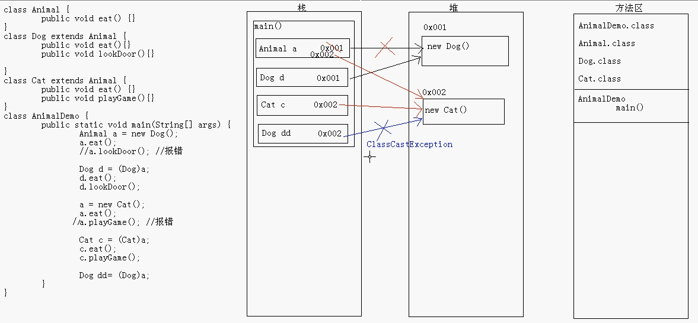

# 面向对象2

## 继承

>关键字extends表明正在构造的新类派生于一个已存在的类。已存在的类称为超类，基类或父类，新类称为子类。派生类等。子类比超类拥有的功能更加丰富。
>
>在通过扩展父类定义子类的时候，仅需要指出子类与超类的不同之处。因为在设计类的时候，应该将通用的方法放在超类中，而将具有特殊用途的方法放在子类中。由于子类的构造器不能访问父类的私有域，所以必须利用父类的构造器对这部分私有域进行初始化，我们可以通过super实现对父类构造器的调用，使用super调用构造器的语句必须是子类构造器的第一条语句。
>
>如果子类的构造器没有显示的调用父类构造器，则将自动的调用超类默认的构造器，如果超类没有不带参数的构造器，并且子类的构造器中又没有显示的调用超类其他的构造器，则Java编译器将报告错误。
>
>由一个公共超类派生出来的所有类的集合被称为继承层次，从某个特定的类到其祖先的路径称为该类的继承链。把多个类中相同的内容给提取出来定义到一个类中例如

``` java
class dog{
  String name;
  int age;
   public void eat(String name){
    System.out.println(name+"吃饭");
  }
  public void sleep(String name){
    System.out.println(name+"睡觉");
  }
}
class cat{
  String name;
  int age;
   public void eat(String name){
    System.out.println(name+"吃饭");
  }
  public void sleep(String name){
    System.out.println(name+"睡觉");
  }
}
```

像这种情况，可以把公共的提取出来，然后去继承提取的那个类，也就是父类

``` java
class animal{
  //animal类可以看作所有动物类的父类，任何动物都可以有名字，年龄，都会吃饭睡觉，所以将这些公共的提取出来，那么子类只需要继承这个类便拥有这些方法以及成员变量
  String name;
  int age;
  public void eat(String name){
    System.out.println(name+"吃饭");
  }
  public void sleep(String name){
    System.out.println(name+"睡觉");
  }
}

class dog extends animal(){
  //这里子类dog就拥有父类animal的成员变量以及方法，可以对其赋值或者方法的重写
}
class cat extends animal(){
  
}
```

像这样的extends关系就叫做继承，但是继承中子类不能继承父类的私有成员，构造方法(但可以通过super去访问)，继承体现的是is a的关系，在java中只支持单继承，但可以多层继承(继承体系)

继承的标准格式就是：`class 子类名 extends 父类名{}`

### 使用了继承有什么好处呢？

* 提高了代码的复用性
* ### 提高了代码的维护性
* 让类与类之间产生了关系，是多态的前提(同时这一点也是弊端，当类与类之间产生了关系，就不可避免的会有耦合，然而在开发原则里明确表示：低耦合高内聚，当耦合度高了可以这么形容，”牵一发而动全身“)

假设我们有这么一个需求，有一家做信息检索的公司，他们需要对手机的各个品牌做一个统计以及对比，现在需要开发一个软件，需要编写entity，在使用继承并且掌握现有知识的前提下如何去设计呢？

首先我们应该分析一下，这家公司对产品内不同品牌进行对比，那么主题是手机，手机下有不同的品牌

``` java
//假设我们手机有这些功能以及参数
class Phone(){
  double size;
  String color;
  String name;
  String cpu_id;
  int ram_size;
  int rom_size;
  int camera_pixel;//摄像头像素
  ...
  public void takePhone(){
    System.out.println("打电话");
  }
  public void takePhoto(){
    System.out.println("拍照");
  }
  ...
}
//我现在有一个华为手机，那么我定义一个类HuaweiPhone继承Phone
class HuaweiPhone extends Phone{
  //在这里我就不用每添加一个品牌再去写那些共有的特性，而是去继承父类，如果功能有特殊的那么重写或新加
  int camera_num; //摄像头数量
    public void takeMaxPhoto(){
    	System.out.println("夜拍，徕卡相机拍更厉害的照片");
  }
}
//同样小米手机，等其他手机也是类似，当我们新加一个手机品牌那么只需要继承这个类即可，再去写我们特有的功能
```

在上述代码中可能会好奇，为什么只是写了一个关键字extends，子类便可以使用父类的成员变量，成员方法。

### 继承中构造方法：

在继承体系中，子类会继承父类中的数据，可能还会使用父类的数据。那么我们知道，在一个类中，给成员变量赋值有两种方法，一种是用方法赋值，一种是构造方法赋值。用构造方法赋值在new一个对象时需要对有参的构造方法传入值。而构造方法当自己没有声明，java会帮你写一个无参的构造方法。但是当你写了一个有参的构造方法如果还要使用无参的构造方法必须声名一个。系统不会再帮你生成无参构造方法。

在这里，子类的构造方法默认访问了父类中空参数的构造方法，从而构造出父类对象。

构造方法用于初始化一个实例对象，所以static修饰是没有任何意义的;多个线程不会同时创建内存地址相同的同一个对象，所以synchronized修饰没有意义;

构造方法不能被子类继承，所以final和abstract修饰没有意义

构造方法是没有返回类型的，void也不行。

当用户没有给java类定义明确的构造方法的时候,java为我们提供了一个默认的构造方法,这个构造方法没有参数,修饰符是public并且方法体为空。如果用户有定义构造方法，就不会有默认构造方法！！！
其实默认的构造方法还分为两种,一种就是刚刚说过的隐藏的构造方法,另一种就是显示定义的默认构造方法.
如果一个类中定义了一个或者多个构造方法,并且每一个构造方法都是带有参数形式的,那么这个类就没有默认的构造方法（需要显示的声明无参构造方法）

####  this与super：

**"this"的用法：**

实例方法中可以使用this关键字,它指向正在执行方法的类的实例对象,当然static方法中是不可以使用this对象的,因为静态方法不属于类的实例对象;而构造方法中同样可以使用this关键字,构造器中的this是指向同一个对象中不同参数的另一个构造器。

1. 构造方法中通过this关键字调用其他构造方法时,那么这句代码必须放在第一行,否则会编译错误。
2. 构造方法中只能通过this调用一次其他的构造方法。

**"super"的用法：**

实例方法和构造方法中的super关键字都用于去指向父类,实例方法中的super关键字是去调用父类当中的某个方法

构造器中使用super关键字调用父类中的构造器

在实例化子类对象时,程序会先调用父类的默认构造方法,然后再执行子类的构造方法。

在实例化类的对象时,类中的成员变量会首先进行初始化,如果其中的成员变量有对象，那么它们也会按照顺序执行初始化工作。在所有类成员初始化完成后，才调用对象所在类的构造方法创建对象。构造方法作用就是初始化。 

如果一个类中有静态对象,那么他会在非静态对象初始化前进行初始化,但只初始化一次。而非静态对象每次调用时都要初始化。

程序中主类的静态变量会在main()方法执行前初始化

一个类初始化顺序：父类的静态成员-->子类的静态成员-->父类的非静态成员-->父类的默认构造函数被调用-->子类的非静态对象（变量）--> 子类的构造函数。

### 继承中成员方法的关系

子类中的方法和父类中的方法声明不一样 直接调用

子类中的方法和父类中的方法声明一样：

* 通过子类调用方法：
  * 先找子类中看有没有这个方法，有就使用
  * 再看父类有没有这个方法，有就使用
  * 如果没有就报错

### 方法重写与方法重载

方法重写（Override）：子类中出现了和父类中方法声明一模一样的方法

方法重载（Overload）：本类中出现的方法名一样，参数列表不同的方法。与返回值无关

子类对象调用方法的时候：

* 先找子类本身，再找父类

方法重写的应用：

* 当子类需要父类的功能，而功能主体子类有自己的特有内容时，可以重写父类中的方法。
* 这样，即沿袭了父类的功能，又定义了子类特有的内容。

注意事项：

- 父类中私有的方法不能被重写
- 子类重写父类方法是，访问权限不能更低
- 父类静态方法，子类必须通过静态方法进行重写

子类重写父类方法的时候，最好声明一模一样

## 多态

同一个对象（事务），在不同时刻体现出来的不同状态

比如小米手机是小米手机同样也是手机

在上面的例子中当`Phone p = new XiaomiPhone()`

可以看作是多态

#### 多态的前提：

* 要有继承关系，


* 要有方法重写（也可以没有，但是没有这个就没有意义）
* 要有父类引用子类对象`fu f = new zi()`

#### 多态中成员访问特点：

成员变量

* 编译看左边，运行看左边

构造方法

* 创建子类对象的时候，访问父类的构造方法，对父类的数据进行初始化

成员方法

* 编译看左边，运行看右边

静态方法

* 编译看左边，运行看左边

（静态和类相关，算不上重写，所以访问还是左边的）

由于成员方法存在方法重写，所以它运行看右边。

#### 多态的好处

提高了代码的维护性（继承保证）

提高了代码的扩展性（多态保证）

#### 多态的弊端

不能使用子类的特有功能。

父类使用子类特有功能

- 创建子类对象调用方法即可（可以，但是很多时候不合理，而且太占内存）


- 把父类的引用强制转换为子类的引用（向下转型）

``` java
//对象间转型问题
//向上转型
Fu f = new Zi();
//向下转型
Zi z = new (Zi)f;//要求该f必须能够转换为Zi的
```

多态中的内存图解：


对象变化内存图解：




## 封装

封装从字面上来理解就是包装的意思，专业点就是信息隐藏，是指利用抽象数据类型将数据和基于数据的操作封装在一起，使其构成一个不可分割的独立实体，数据被保护在抽象数据类型的内部，尽可能地隐藏内部的细节，只保留一些对外接口使之与外部发生联系。系统的其他对象只能通过包裹在数据外面的已经授权的操作来与这个封装的对象进行交流和交互。也就是说用户是无需知道对象内部的细节（当然也无从知道），但可以通过该对象对外的提供的接口来访问该对象。

对于封装而言，一个对象它所封装的是自己的属性和方法，所以它是不需要依赖其他对象就可以完成自己的操作。

使用封装有三大好处：

* 良好的封装能够减少耦合。
* 类内部的结构可以自由修改。
* 可以对成员进行更精确的控制。
* 隐藏信息，实现细节。

所以封装把一个对象的属性私有化，同时提供一些可以被外界访问的属性的方法，如果不想被外界方法，我们大可不必提供方法给外界访问。但是如果一个类没有提供给外界访问的方法，那么这个类也没有什么意义了。封装确实可以使我们容易地修改类的内部实现，而无需修改使用了该类的客户代码。可以对成员变量进行更精确的控制

### Package关键字

#### 包的概述：

- 其实就是文件夹

- 作用：

- - 把对相同的类名放到不同的包中
  - 对类进行分类管理

#### 包的定义：

Package 包名；

多级包用.分开

#### 注意事项：

- package语句必须是程序的第一条可执行的代码
- package语句在一个java文件中只能有一个
- 如果没有package，默认表示无包名

#### 带包的编译和运行：

- 手动式

- 1. 编写一个带包的Java文件
  2. 通过Javac命令编译该Java文件
  3. 手动创建包名
  4. 把b步骤的class文件放到c步骤的最低层包
  5. 回到和包根目录在同一个目录的地方，然后运行带包运行

- 自动式

- 1. 编写一个带包的java文件
  2. javac编译的时候带上-d即可

Javac -d .HelloWorld.java

1. 回到和包根目录在同一个目录的地方，然后运行带包运行

### import关键字的概述和使用

导包：

格式：import 包名；

这种方式导入是到类的名称。

注意：我们用谁就导谁

面试题：

package，import，class有没有顺序关系？

有

package>import>class 

package：只能有一个

import：可以有多个

class：可以有多个，建议是一个

### 四种权限修饰符

|             | 本类   | 同一个包下（子类和无关类） | 不同包下（子类） | 不同包下（无关类） |
| ----------- | ---- | ------------- | -------- | --------- |
| private     | Y    |               |          |           |
| 默认（default） | Y    | Y             |          |           |
| protected   | Y    | Y             | Y        |           |
| public      | Y    | Y             | Y        | Y         |

### 类及其组成所使用的常见修饰符

**修饰符：**

权限修饰符：private，默认修饰符，protected，public

状态修饰符：static，final

抽象修饰符：abstract

**类：**

权限修饰符：默认修饰符，public

状态修饰符：final

抽象修饰符：abstract

用的最多的就是public

**成员变量：**

权限修饰符：private，默认修饰符，protected，public

状态修饰符：static，final

用的最多的就是，private

**构造方法：**

权限修饰符：private，默认修饰符，protected，public

用的最多的就是public

**成员方法：**

权限修饰符：private，默认修饰符，protected，public

状态修饰符：static，final

抽象修饰符：abstract

用的最多的就是public

**除此以外的组合规则：**

成员变量：public static final

成员方法：public static

public abstract

public final

## 类初始化过程

#### 类初始化过程

加载class文件进内存

在栈内存开辟空间

在对内存为类对象开辟空间

对对象的成员变量进行默认初始化

对对象的成员变量进行显示初始化

通过构造方法对对象的成员变量赋值

对象初始化完毕，吧对象地址复制给变量

#### 对象析构与finalize方法：

在析构器中最常见的操作是回收分配给对象的存储空间，但Java不支持析构器，可以为任何一个类添加finalize方法，将在垃圾回收器清除对象之前调用。

 

#### 动态绑定：

调用对象方法的执行过程：

编译器查看对象的声明类型和方法名

编译器查看调用方法时提供的参数类型

如果是private方法、static方法、final方法、或者构造器，那么编译器将准备的知道该调用哪个方法，这种调用方式为静态绑定。

调用的方法依赖于隐式参数的实际类型，并且在运行时实现动态绑定。

当程序运行时，并且采用动态绑定调用方法时，虚拟机一定调用与x所引用对象的实际类型最合适的那个类的方法。

虚拟机为了节省开销和时间，为每个类预先创建了一个方法表。

## 内部类

把类定义在其他类的内部，这个类就被称为内部类

``` java
class Outer{
  class Inner{
  }
}
```

### 内部类的访问特点

- 内部类可以直接访问外部类的成员，包括私有
- 外部类要访问内部类的成员，必须创建对象

``` java
class Outer{
  private int num = 10;
  class Inner{
    public void show(){
      System.out.println(num);
    }
    public void method(){
      Inner i = new Inner();
      i.show();
    }
  }
}
```

### 内部类位置：

成员位置：在成员位置定义的类，称为成员内部类。

局部位置：在局部位置定义的类，称为局部内部类


成员内部类：

如何直接访问内部类的成员：

外部类名.内部类名 对象名 = 外部类对象.内部类对象

``` java
class Outer{
  private int num = 10;
  class Inner{
    public void show(){
      System.out.println(num);
    }
}
  class InnerClassDemo{
    public static void main(Stringp[] args){
      Outer.Inner oi = new Outer().new Inner();
    }
  }
```

成员内部类的修饰符：

private 为了保证数据的安全性

static 为了方便访问数据

注意：静态内部类访问的外部类数据必须用静态修饰

成员内部类被静态修饰后的访问方式是：

格式：外部类名.内部类名 对象名 = new 外部类名.内部类名();

``` java
class Outer{
  private int num = 10;
  private static int num2 = 100;
  
  public static class Inner{
    public void show(){
      System.out.println(num2);
    }
    public static void show2(){
      System.out.println(num2);
    }
  }
}
class InnerClassDemo{
  public static void main(String[] args){
    Outer.Inner oi = new Outer.Inner();
    oi.show();
    oi.show2();
    //show2另一种调用方式
    Outer.Inner.show2();
  }
}

```

局部内部类：

- 可以直接访问外部类的成员
- 在局部位置，可以创建内部类对象，通过对象调用内部类方法，来使用局部内部类功能

面试题：

局部内部类访问局部变量的注意事项？

- 局部内部类访问局部变量必须用final修饰
- 为什么呢？

局部变量是随着方法的额调用而调用，随着调用完毕而消失。

而堆内存的内容并不会立即消失，所以我们加final修饰。

加入final修饰后，这个变量就常量。

```java
class Outer{
  private int num = 10;
  public void method(){
    class Inner{
      public void show(){
        System.out.println(num);
      }
    }
    Inner i = new Inner()
    i.show();
  }
}
```

### 匿名内部类

就是内部类的简化写法

前提：存在一个类或者接口

这里的类可以是具体类也可以是抽象类

格式：

```java
new 类名或者接口名(){
重写方法;
}
```

本质是什么呢？

是一个继承了该类或者实现了该接口的子类匿名对象

``` java
interface Inter{
  public abstract void show();
}
class Outer{
  public void method(){
    new Inter(){
      public void show(){
        System.out.println("show");
      }
    };
  }
}
```

#### 匿名内部类的方法调用

调用一个方法：

``` java
interface Inter{
  public abstract void show();
}
class Outer{
  public void method(){
    new Inter(){
      public void show(){
        System.out.println("show");
      }
    }.show();
  }
}
```

调用多个方法：

``` java
Inter i = new Inter(){//多态
  public void show(){
    System.out.println("show");
  }
  public void show2(){
    System.out.println("show2");
  }
};
i.show();
i.show2();
```

#### 匿名内部类在开发中的应用：

``` java
interface Person{
  public abstract void study();
}
class PersonDemo{
  //接口名作为形式参数
  //这里需要的不是接口，而是接口的实现类的对象
  public void method(Person p){
    p.study();
  }
}

//实现类
class Student implements Person{
  public void study(){
    System.out.println("好好学习，天天向上");
  }
}

class InnerClassDemo{
  public static void main(String[] args){
    //测试
    PersonDemo pd = new PersonDemo();
    Person p = new Person();
    pd.method(p);
    Systemout.println("------");
    
    //匿名内部类在开发中的使用
    //匿名内部类的本质是继承类或者实现了接口的子类匿名对象
    pd.method(new Person(){
      public void study(){
        System.out.println("好好学习，天天向上");
      }
    });
  }
}
```

>内部类方法可以访问该类定义所在的作用域中的数据，包括私有的数据
>
>内部类可以对同一个包中的其他类隐藏起来
>
>当想要定义一个回调函数且不想编写大量代码时，使用匿名内部类比较便捷
>
>内部类可以直接访问外部类的成员，包括私有
>
>外部类要访问内部类的成员，必须创建对象
>
>内部类的位置:
>
>成员位置:成员内部类
>
>外部类名.内部类名 对象名 = 外部类对象.内部类对象    
>
>private:私有。 外部类创建方法，方法内创建对象，调用内部类方法。
>
>Static(为了方便访问数据)内部类用静态修饰是因为内部类可以看出是外部类的成员,内部类被静态修饰后，访问外部类数据必须用静态修饰
>
>局部位置:局部内部类
>
>使用内部类访问对象状态:
>
>内部类既可以访问自身的数据域，也可以访问创建它的外围类对象的数据域。
>
>内部类的特殊语法规则:
>
>OuterClass.this:表示外围类引用
>
>OuterClass.InnerClass:在外围类的作用域之后，引用内部类
>
>局部内部类:
>
>局部类不能用public或private访问说明符进行声明。它的作用域被限定在声明这个具备类的块中。
>
>局部类有一个优势，即对外部世界可以完全的隐藏起来。
>
>可以直接访问外部类成员
>
>在局部位置，可以创建内部类对象，通过内部类对象，通过对象内部类方法，来使用局部内部类功能
>
>匿名内部类:
>
>假如只创建这个类的一个对象，就不必命名，这种类被称为匿名内部类
>
>new SuperType(construction parameters)
>
>{
>
>Inner class methods and data
>
>}
>
>由于构造器的名字必须与类名相同，而匿名类没有类名，所以匿名类不能有构造器，取而代之的是，将构造器参数传递给超类构造器，尤其是内部类实现接口的时候，不能有任何构造参数。
>
>前提:存在一个类或者接口，这里的类可以是具体类也可以是抽象类
>
>new 类名或者接口名(){
>
>重写方法;
>
>}
>
>本质是一个继承了该类或者实现了该接口的子类匿名对象 
>
>静态内部类:
>
>有时候，使用内部类只是为了把一个类隐藏在另外一个类的内部，并不需要内部类引用外围类对象，为此，可以将内部类声明为static，以便取消产生的引用

