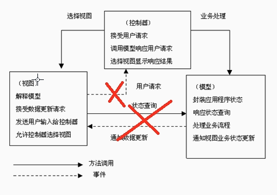
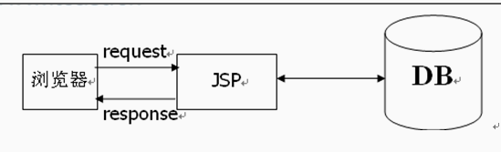
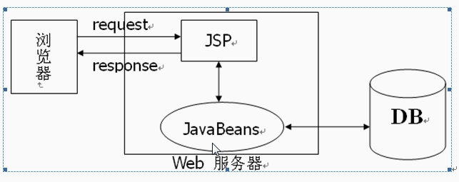
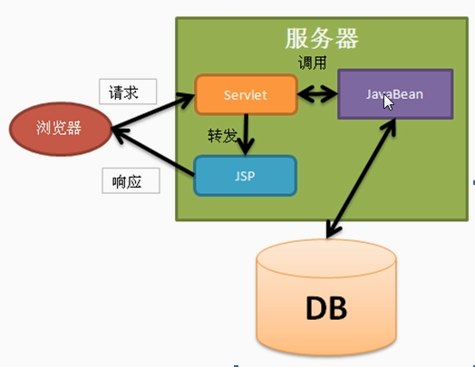
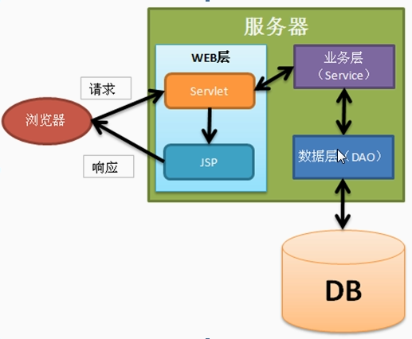

# MVC

不是java独有，所有的B/S结构都使用的它
M--Model模型
V--View视图（jsp）
C--Cotroller控制器（Servlet）
JSP Model1

JSP Model1

JSP Model2

***JavaWeb三层框架***
Web层 -->与web相关的内容（Servlet，JSP，Servlet相关API:request,response,session,ServletContext）
业务层 -->业务对象(service)
数据层 -->操作数据库（DAO Data Access Object)(所有对数据库的操作不能跳出到DAO之外)

