# MyBatis

## JDBC编码问题

***sql_table.sql:记录表结构***
***sql_data.sql:记录测试数据，在实际企业开发中，最后提供一个初始化数据脚本***

### 原生态jdbc编程中的问题总结

代码

```java
package com.cj.mybatis.jdbc;

import java.sql.Connection;
import java.sql.DriverManager;
import java.sql.PreparedStatement;
import java.sql.ResultSet;
import java.sql.SQLException;

public class JdbcTest {
    public static void main(String[] args) {
        //数据库连接
        Connection connection = null;
        //预编译的Statement，使用预编译的Statement提高数据库的性能
        PreparedStatement preparedStatement = null;
        //结果集
        ResultSet resultSet = null;
        try {
            // 加载数据库驱动
            Class.forName("com.mysql.jdbc.Driver");
            // 通过驱动管理类获取数据库链接
            connection = 
            DriverManager.getConnection("jdbc:mysql://localhost:3306/mybatis?characterEncoding=utf-8",
                    "root", "123456");
            // 定义<u>sql</u>语句 ?表示占位符
            String sql = "select * from user where username = ?";
            // 获取预处理statement
            preparedStatement = connection.prepareStatement(sql);
            // 设置参数，第一个参数为sql语句中参数的序号（从1开始），第二个参数为设置的参数值
            preparedStatement.setString(1, "王五");
            // 向数据库发出sql执行查询，查询出结果集
            resultSet = preparedStatement.executeQuery();
            // 遍历查询结果集
            while (resultSet.next()) {
                System.out.println(resultSet.getString("id") + "  " + resultSet.getString("username"));
            }
        } catch (Exception e) {
            e.printStackTrace();
        } finally {
            // 释放资源
            if (resultSet != null) {
                try {
                    resultSet.close();
                } catch (SQLException e) {
                    // TODO Auto-generated catch 
                    e.printStackTrace();
                }
            }
            if (preparedStatement != null) {
                try {
                    preparedStatement.close();
                } catch (SQLException e) {
                    // TODO Auto-generated catch 
                    e.printStackTrace();
                }
            }
            if (connection != null) {
                try {
                    connection.close();
                } catch (SQLException e) {
                    // TODO Auto-generated catch 
                    e.printStackTrace();
                }
            }
        }
    }
}

//结果：
//26 王五
```

**问题总结：**

* 数据库连接，使用时创建，不适用立即释放，对数据库进行频繁连接开启和关闭，造成数据库资源浪费，影响数据库性能
* 将sql语句硬编码到java代码中，如果sql语句修改，需要重新编译java代码，不利于系统维护。
    * 设想：将sql语句配置在xml文件中，即使sql变化，不需要对java代码进行重新编译
* 向preparedStatement中设置参数，对占位符位置和设置参数值，硬编码在java代码中
    * 设想：将sql语句及占位符和参数全部配置在xml中
* 从resultSet中遍历结果集时，存在硬编码，将获取表的字段进行硬编码
    * 设想：将查询的结果集，自动映射成java对象

## MyBatis

### MyBatis是什么？

* mybatis是一个持久层框架，是apache下的顶级项目
    * 托管在github上
* mybatis让程序将主要精力放在sql上，通过mybatis提供的映射方式，自由灵活生成（半自动化，大部分需要程序员编写sql）满足需要的sql语句
* mybatis可以将向preparedStatement中输入的参数自动进行输入映射，将查询结果集灵活映射成java对象（输出映射）

### MyBatis框架

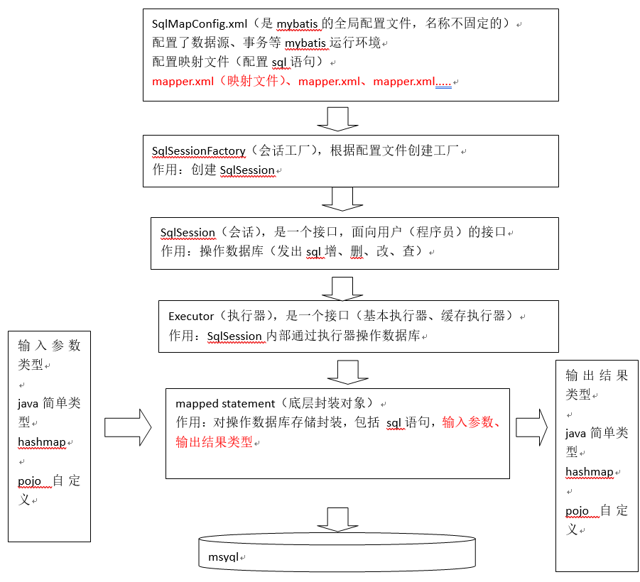

### 入门程序
#### 需求
* 根据用户id（主键）查询用户信息
* 根据用户名称模糊拆线呢用户信息
* 添加用户
* 删除用户
* 更新用户

#### log4j
在开发环境下日志级别要设置成DEBUG，生产环境设置成info或error

#### 工程结构

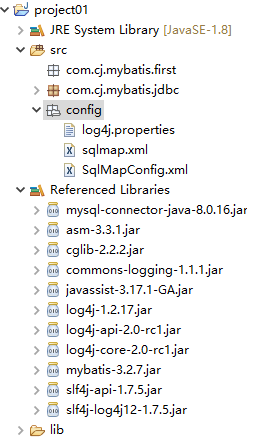

#### SqlMapConfig.xml
配置mybatis的运行环境，数据源，事务等

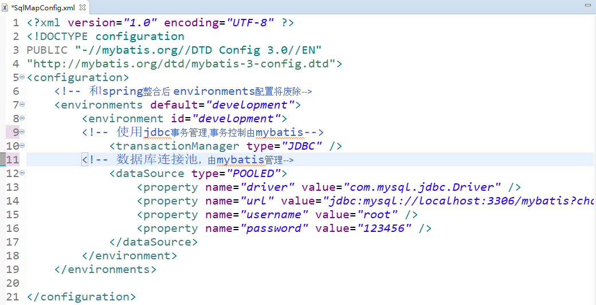

#### 根据用户id（主键）查询用户信息
##### po类

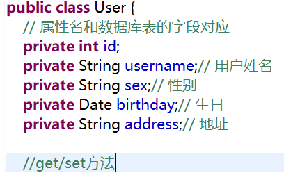

##### 映射文件
映射文件命名：User.xml，mapper代理开发映射文件名称叫XXXMapper.xml，比如UserMapper.xml、ItemsMapper.xml
在映射文件中配置sql语句

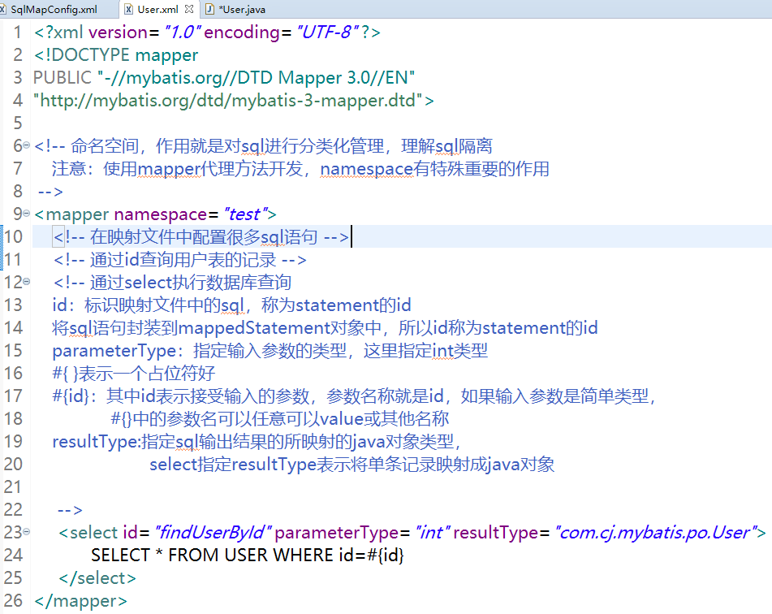

##### 在SqlMapConfig中加载映射文件

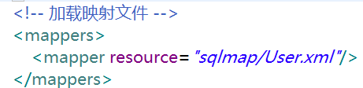

##### 程序编写

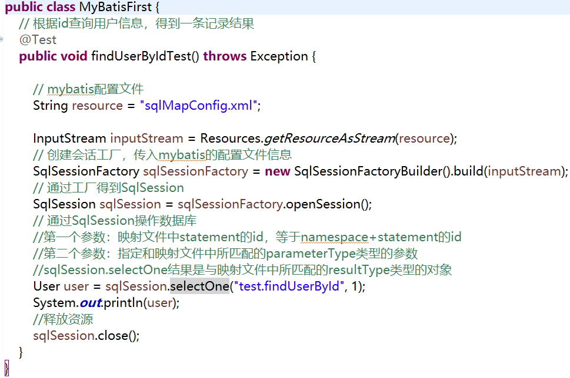

#### 根据用户名称模糊查询用户信息
##### 映射文件

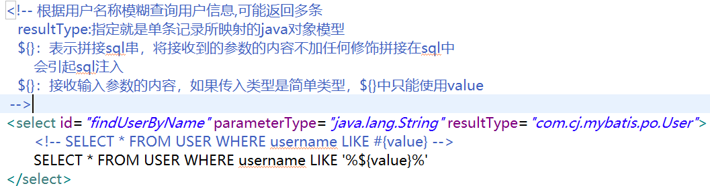

这样可能引起sql注入

##### 测试类

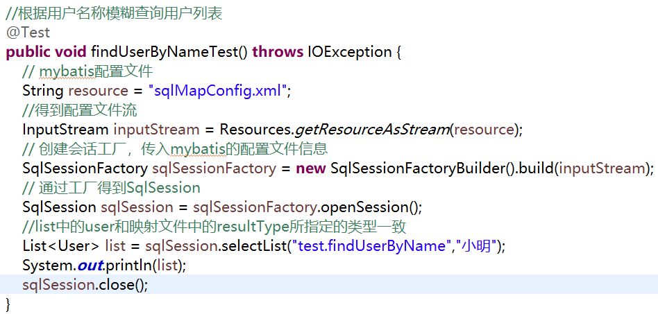


#### 查询用户小结
parameterType：在映射文件中通过parameterType指定输入参数的类型
resultType：在映射文件中通过resultType指定输出结果的类型

`#{}`：表示占位符

`${}`：表示拼接字符串，会引起sql注入，不建议使用
selectOne：表示查询出一条记录进行映射，如果使用selectOne，可以实现使用selectList也可以实现（list中只有一个对象）
selectList：表示查询出一个列表（多条记录 ）进行映射，如果使用selectList查询多条记录，不能使用selectOne

#### 添加用户
##### 映射文件
在User.xml中配置添加用户的Statement

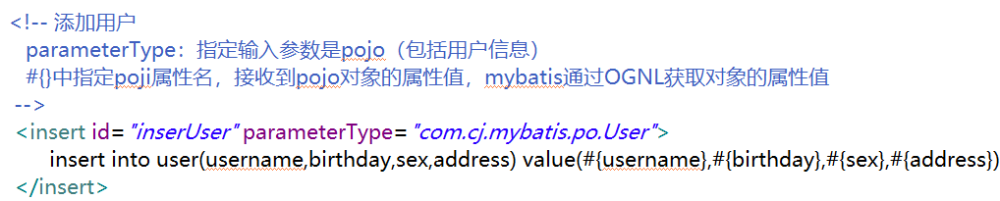

##### 测试类

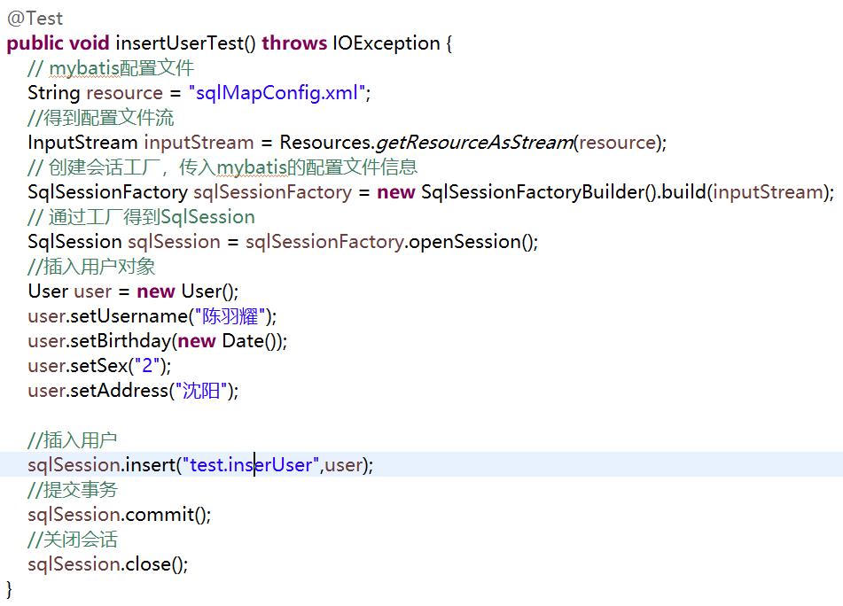

#### 主键返回
##### 自增主键返回
mysql自增主键，执行insert提交之前自动生成一个自增主键。
通过mysql函数获取到刚插入记录的自增主键：
LAST_INSERT_ID()
是insert之后调用此函数。

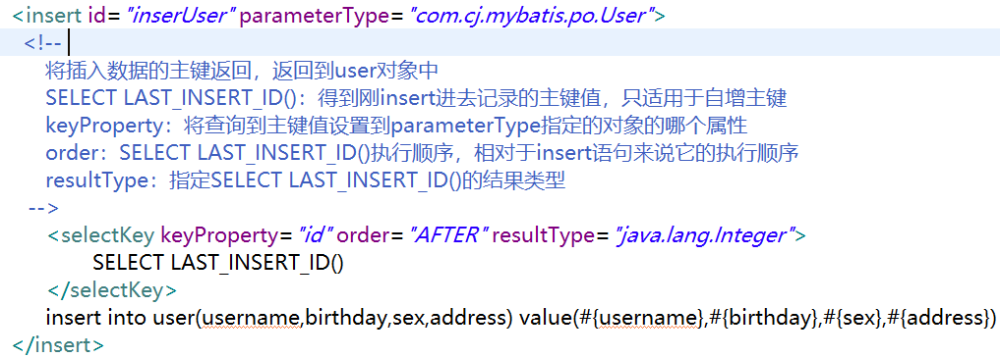

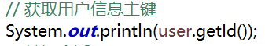

##### 非自增主键返回（使用uuid())
使用mysql的uuid()函数生成主键，需要修改表中id字段类型为string，长度设置成35位。
执行思路：
先通过uuid()查询到主键，将主键输入 到sql语句中。
执行uuid()语句顺序相对于insert语句之前执行。

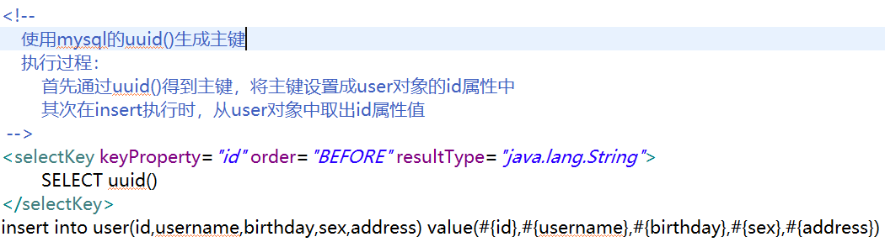

**Oracle使用序列生成主键：**
首先自定义一个序列且用于生成主键，selectKey使用如下：

```xml
<insert  id="insertUser" parameterType="cn.cj.mybatis.po.User">
<selectKey resultType="java.lang.Integer" order="BEFORE" keyProperty="id">
SELECT 自定义序列.NEXTVAL FROM DUAL
</selectKey>
insert into user(id,<u>username</u>,birthday,sex,address) 
       values(#{id},#{<u>username</u>},#{birthday},#{sex},#{address})
</insert>
```
注意这里使用的order是“BEFORE”

#### 删除用户
##### 映射文件

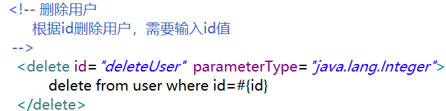

##### 测试类

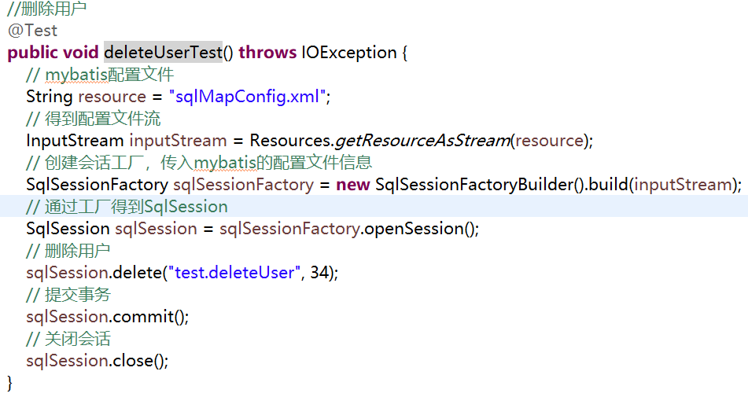

#### 更新用户
##### 映射文件

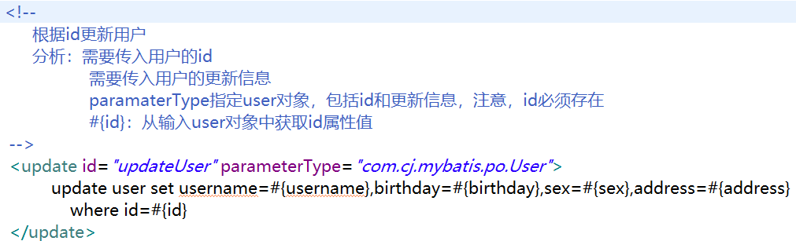

##### 测试类

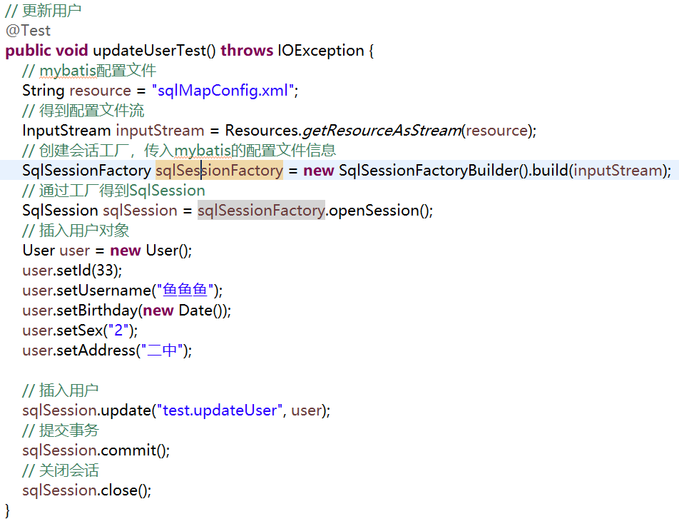

### MyBatis和Hibernate的本质区别-mapper

#### hibernate
是一个标准ORM框架（对象关系映射）。入门门槛较高，不需要程序员写sql，sql语句自动生成
对sql进行优化、修改比较困难
应用场景：适用于需求变化不多的中小型项目，比如后台管理系统，erp、orm、oa
#### mybatis
专注sql本身，需要程序员自己编写sql语句，sql修改、优化比较方便，mybatis是一个不完全的ORM框架，虽然程序员自己写sql，mybatis也可以实现映射（输入映射、输出映射）
应用场景：适用于需求变化较多的项目，比如互联网项目

**企业进行技术选型，以低成本 高回报作为技术选型原则，根据项目组的技术力量进行选择**

#### mybatis开发dao方法
##### SqlSesssion应用场合
***sqlSession使用范围***
**SqlSessionFactoryBuilder：** 
通过SqlSessionFactoryBuilder创建会话工厂SqlSessionFactory
将SqlSessionBuilder当成一个工具类使用即可，不需要使用单例管理SqlSessionFactoryBuilder
在需要创建SqlSessionFactory时候，只需要new一次SqlSessionFactoryBuilder
**SqlSessionFactory：** 
通过SqlSessionFactory创建SqlSession，通过单例模式管理SqlSessionFactory（工厂一旦创建，使用一个实例。
将来mybatis和spring整合后，使用单例模式管理SqlSessionFactory
**SqlSession：**
SqlSession是一个面向用户（程序员）的接口
SqlSession中提供了很多操作数据库的方法：如selectOne（返回单个对象）、selectList（返回单个或多个对象）
SqlSession是线程不安全的，在SqlSession实现类中除了有接口中的方法（操作数据库的方法）还有数据域属性
***SqlSession最佳应用场合在方法体内，定义局部变量使用。***

#### 原始dao开发方法（写dao接口和dao实现类）
程序员需要写dao接口和dao实现类
需要向dao实现类中注入SqlSessionFactory，在方法体内通过SqlSessionFactory创建SqlSession

##### dao接口

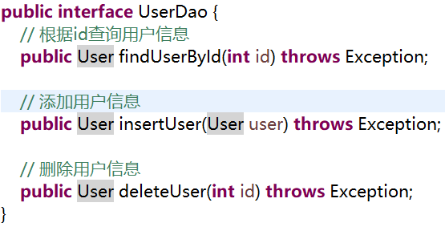

##### dao接口实现类

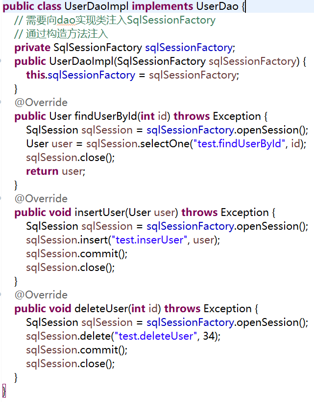

##### 测试代码

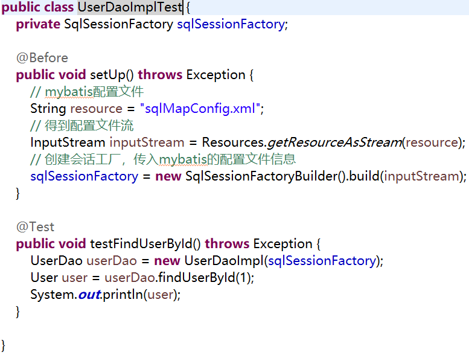

##### 原始dao开发问题

* dao的接口实现类方法中存在大量模板方法，设想能否将这些代码提取出来
* 在调用SqlSession方法时将statement的id硬编码了
* 调用SqlSession方法时传入的变量，由于SqlSession方法使用泛型，即使变量类型传入错误，在编译阶段也不报错，不利于开发

#### mapper代理方法（只需要mapper接口（相当于dao接口））

##### 思路：
编写映射文件
只需要编写mapper接口（相当于dao接口）
遵循一些开发规范：mybatis可以自动生成mapper接口实现类代理对象
**开发规范:**
在mapper.xml中namespace等于mapper接口地址

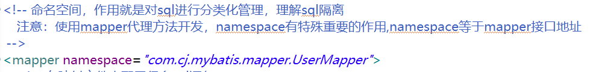

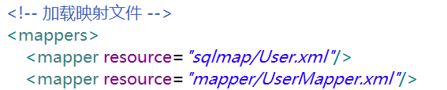

mapper.java接口中的方法名和mapper.xml中statement的id一致
mapper.java接口中的方法输入参数类型和mapper.xml中statement的parmeterType指定的类型一致
mapper.java接口中的方法返回值类型和mapper.xml中statement的resultType指定的类型一致

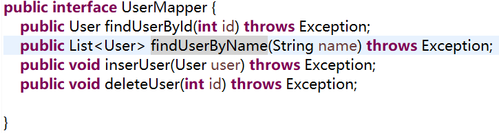

总结：以上开发规范主要是对下边的代码进行统一生成

##### 测试

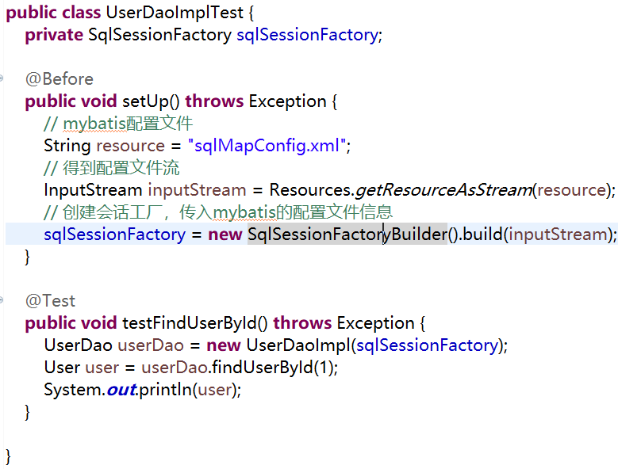

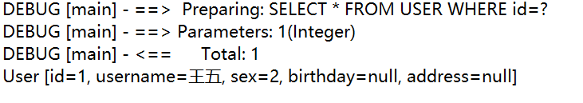

**代理对象内部调用selectOne或selectList：**
如果mapper方法返回单个pojo对象（非集合对象），代理对象内部通过selectOne查询数据库
如果mapper方法返回集合对象，代理对象内部通过selectList查询数据库
**mapper接口方法参数只能有一个是否影响系统开发：**
mapper接口方法参数只能有一个，系统是否不利于扩展维护
系统框架中，dao层代码是被业务层公用的
即使mapper接口只有一个参数，可以使用包装类型的pojo满足不同的业务方法的需求
注意：持久层方法的参数可以包装类型、map...，service方法中建议不要使用包装类型（不利于业务层的可扩展性）

### SqlMapConfig

mybatis的全局配置文件SqlMapConfig.xml配置内容：

* properties（属性）
* settings（全局配置参数)
* typeAliases（类型别名）
* typeHandlers（类型处理器)
* objectFactory（对象工厂）
* plugins（插件)
* environments（环境集合属性对象）：
    * environment（环境子属性对象）：
        * transactionManager（事务管理）
        * dataSource（数据源）
* mappers（映射器）

#### Properties属性
将数据库连接参数单独配置在db.properties中，只需要在SqlMapConfig.xml中加载db.properties的属性值。
在SqlMapConfig中就不需要对数据库的连接参数硬编码
将数据库连接参数只配置在db.properties中，原因：方便对参数进行统一管理，其他xml可以引用该db.properties

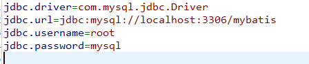

在sqlMapConfig.xml加载属性文件：

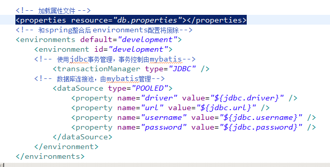

**properties特性：**

* 注意： 

    MyBatis 将按照下面的顺序来加载属性：
    在 properties 元素体内定义的属性首先被读取。 
    然后会读取properties 元素中resource或 url 加载的属性，它会覆盖已读取的同名属性。 
    最后读取parameterType传递的属性，它会覆盖已读取的同名属性。

* 建议：

    不要在properties元素体内添加任何属性值，只将属性值定义在properties文件中。
    在properties文件中定义属性名要有一定的特殊性，如：XXXXX.XXXXX.XXXX

* 因此：

    通过parameterType传递的属性具有最高优先级，resource或 url 加载的属性次之，
    最低优先级的是 properties 元素体内定义的属性。

#### settings全局参数配置
mybatis框架在运行时可以调整一些运行参数

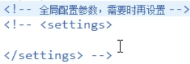

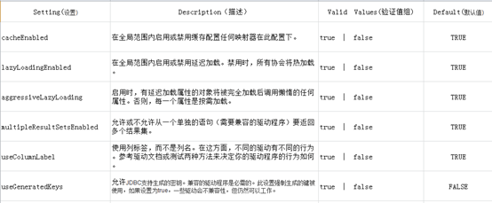

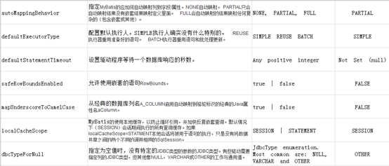

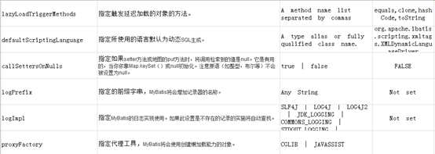

#### typeAliases（别名）
在mapper.xml中，定义很多的statement，statement需要parameterType指定输入参数的类型、需要resultType指定输出结果的映射类型
如果在指定类型时输入类型全路径，不方便进行开发，可以针对parameterType或resultType指定的类型定义一些别名，在mapper.xml中通过别名定义，方便开发
##### mybatis默认支持的别名

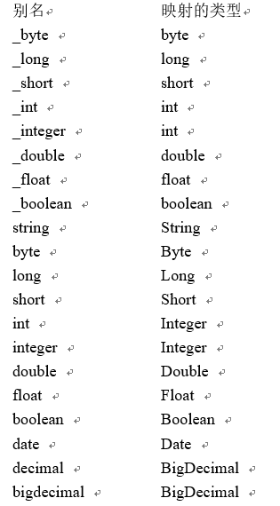

##### 自定义别名
**单个别名的定义：**

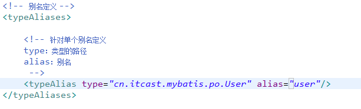

引用别名：

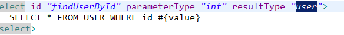

**批量别名的定义：**

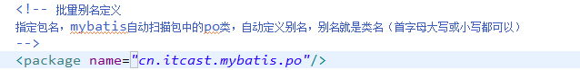

#### typeHandlers（类型处理器）
mybatis中通过typeHandlers类型处理器完成jdbc类型和java类型的转换
通常情况下，mybatis提供的类型处理器满足日常需要，不需要自定义

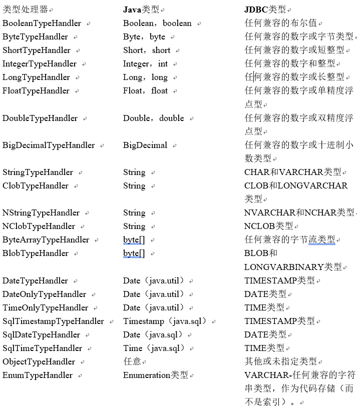

#### mappers（映射配置）
**通过resource加载单个映射文件：**

```xml
<!--通过resource方法一次加载一个映射文件-->
<mapper resource="mapper/UserMapper.xml"/>
```

**通过mapper接口加载单个映射文件：**
规范：需要将mapper接口类名和mapper.xml映射文件保持一致，且在一个目录中
前提：使用mapper代理方法

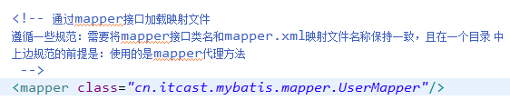

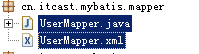

***批量加载多个mapper：***

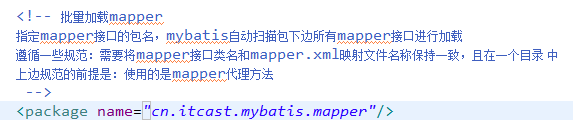

### 输入映射/输出映射

#### 输入映射
通过parameterType指定输入参数的类型，类型可以是简单类型、hashmap、pojo包装类型
##### 传递pojo的包装对象
完成用户信息的综合查询，需要传入查询条件（可能包括用户信息、其他信息、商品、订单的）
针对上边需求，建议使用自定义的包装类型的pojo
在包装类型的pojo中将复杂的查询条件包装进去
UserCustom是User的扩展类，子类

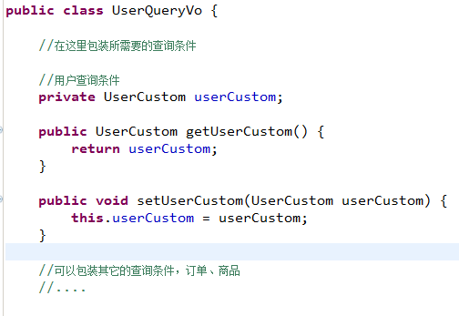

**mapper.xml**
在UserMapper.xml中定义用户信息综合查询（查询条件复杂，通过高级查询进行复杂关联查询）

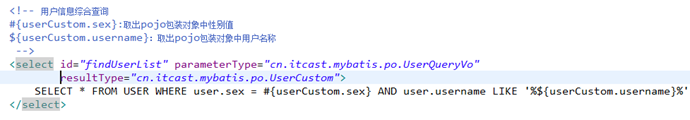

**mapper.java**

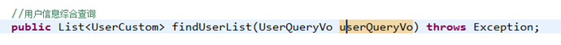

**测试代码：**

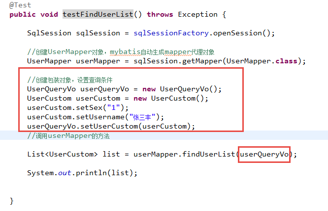

##### 传递HashMap

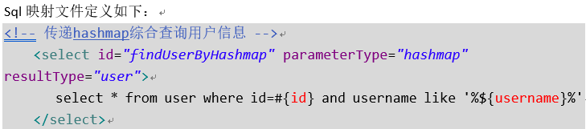


上边红色标注的是hashmap的key

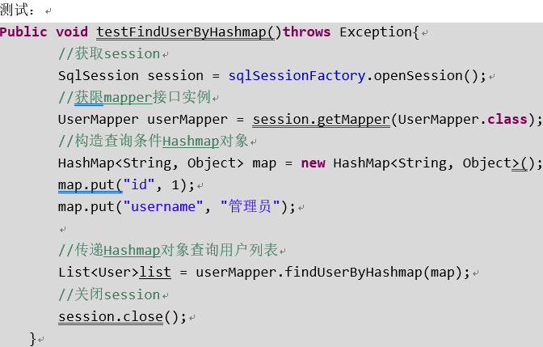

#### 输出映射
##### resultType
使用resultType进行输出映射，只有查询出来的列名和pojo中的属性名一致，该列才可以映射成功
如果查询出来的列名和pojo中的属性名全部不一致，没有创建pojo对象
只要查询出来的列名和pojo中的属性有一个一致，就会创建pojo对象

**输出简单类型：**
用户信息的综合查询列表总数，通过查询总数和上边用户综合查询列表才可以实现分页
***mapper.xml***

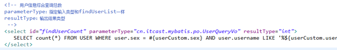

***mapper.java***

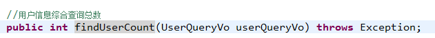

***测试：***

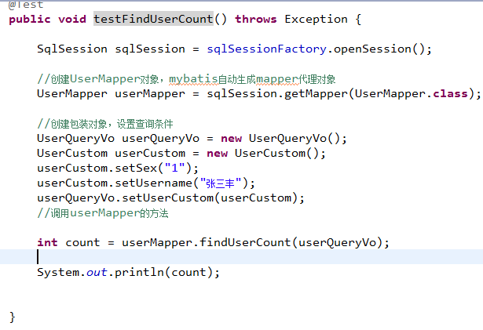

***总结***
查询出来的结果集只有一行切一列，可以使用简单类型进行输出映射

**输出pojo对象和pojo列表：**
不管是输出pojo单个对象还是一个列表（list中包括pojo），在mapper.xml中resultType指定的类型是一样的。
在mapper.java指定的方法返回值类型不一样：
输出单个pojo对象，方法返回值是单个对象类型

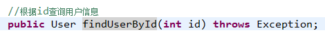

输出pojo对象list，方法返回值是List`<pojo>`

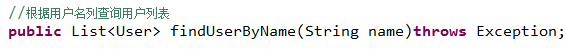

生成的动态代理对象中是根据mapper方法的返回值类型确定是调用selectOne(返回单个对象调用)还是selectList （返回集合对象调用 ）
**输出hashmap：**
输出pojo对象可以改用hashmap输出类型，将输出的字段名称作为map的key，value为字段值。

##### resultMap
mybatis中使用resultMap完成高级输出结果映射
**使用方法：**
如果查询出来的列名和pojo的属性名不一致，通过定义一个resultMap对列名和pojo属性名之间做一个映射关系

* 定义reslutMap
* 使用resultMap作为statement的输出映射类型

将下边的sql使用User完成映射
SELECT id id_,username username_ FROM USER WHERE id=#{value}
User类中属性名和上边查询列名不一致。
**定义resultMap：**

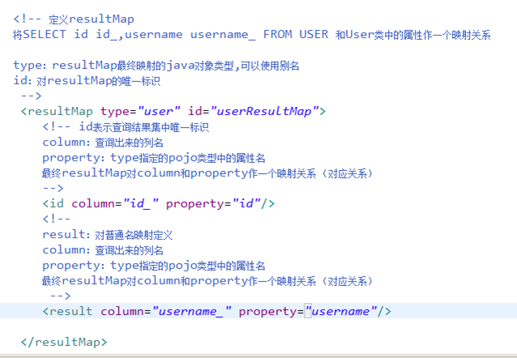

**使用resultMap作为statement的输出映射关系：**

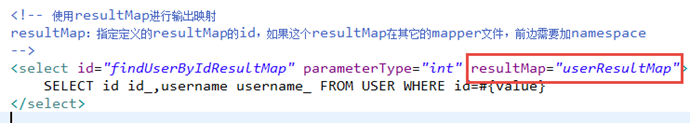

**mapper.java**

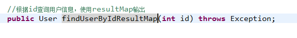

**测试：**

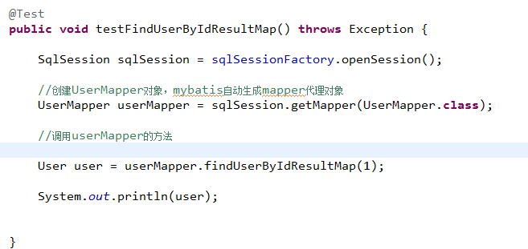

**总结**
使用resultType进行输出映射，只有查询出来的列名和pojo中的属性名一致，该列才可以映射成功。
如果查询出来的列名和pojo的属性名不一致，通过定义一个resultMap对列名和pojo属性名之间作一个映射关系。

### 动态sql

#### 什么是动态sql
mybatis核心对sql语句进行灵活操作，通过表达式进行判断，对sql进行灵活拼接、组装
**需求：**
用户信息综合查询列表和用户信息查询列表总数这两个statement的定义使用动态sql
对查询条件进行判断，如果参数不为空才进行查询条件拼接
mapper.xml

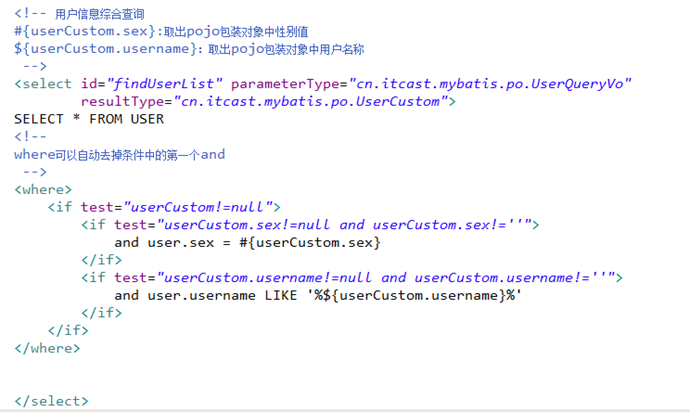

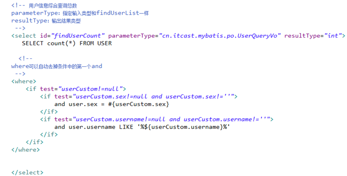

测试代码：

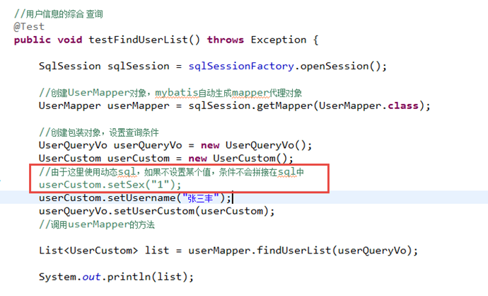

#### sql片段
**定义：**
将上边实现的动态sql判断代码块抽取出来，组成一个sql片段，其他的statement中就可以引用这个sql

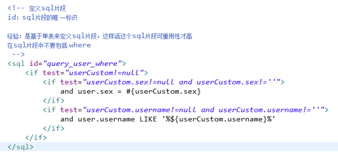

**引用：**

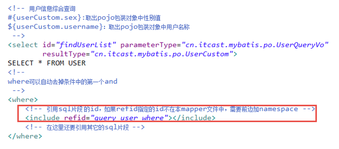

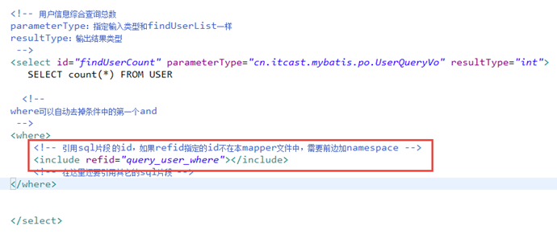

#### foreach
向sql传递数组或List，mybatis使用foreach解析
**需求：**
在用户查询列表和查询总数的statement中增加多个id输入查询。
sql语句如下：
两种方法：

```sql
SELECT * FROM USER WHERE id=1 OR id=10 OR id=16
SELECT * FROM USER WHERE id IN(1,10,16)
```

**在输入参数类型中添加`List<Integer>`ids传入多个id**

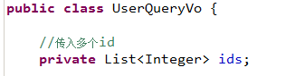

**修改mapper.xml**

```sq
WHERE id=1 OR id=10 OR id=16
```

在查询条件中，查询条件定义成一个sql片段，需要修改sql片段。

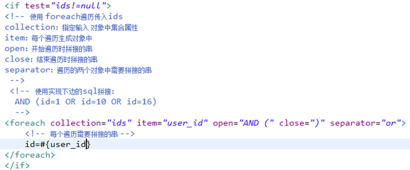

**测试代码：**

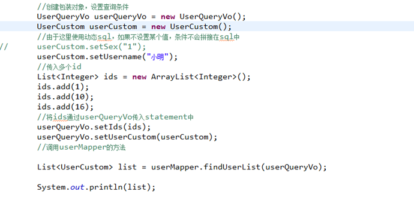

**另外一个sql的实现：**

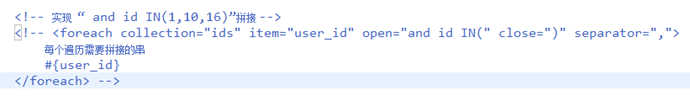

### 高级映射

#### 订单商品数据模型

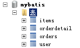

##### 数据模型分析思路
1、每张表记录的数据内容
         分模块对每张表记录的内容进行熟悉，相当 于你学习系统 需求（功能）的过程。
2、每张表重要的字段设置
         非空字段、外键字段
3、数据库级别表与表之间的关系
         外键关系
4、表与表之间的业务关系
         在分析表与表之间的业务关系时一定要建立 在某个业务意义基础上去分析。

##### 数据模型分析

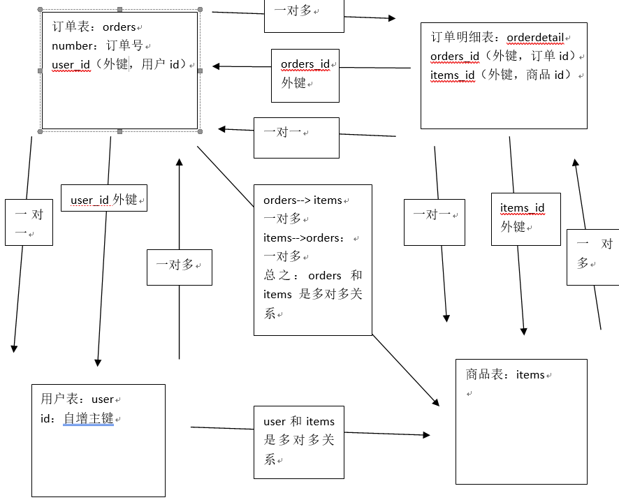

用户表user：
记录了购买商品的用户信息
订单表：orders
记录了用户所创建的订单（购买商品的订单）
订单明细表：orderdetail：
记录了订单的详细信息即购买商品的信息
商品表：items
记录了商品信息
表与表之间的业务关系：
在分析表与表之间的业务关系时需要建立 在某个业务意义基础上去分析。
先分析数据级别之间有关系的表之间的业务关系：
usre和orders：
user---->orders：一个用户可以创建多个订单，一对多
orders--->user：一个订单只由一个用户创建，一对一
orders和orderdetail：
orders---》orderdetail：一个订单可以包括 多个订单明细，因为一个订单可以购买多个商品，每个商品的购买信息在orderdetail记录，一对多关系
orderdetail--> orders：一个订单明细只能包括在一个订单中，一对一
orderdetail和itesm：
orderdetail---》itesms：一个订单明细只对应一个商品信息，一对一
items--> orderdetail:一个商品可以包括在多个订单明细 ，一对多
再分析数据库级别没有关系的表之间是否有业务关系：
orders和items：
orders和items之间可以通过orderdetail表建立 关系。

#### 一对一查询
##### 需求
查询订单信息，关联查询创建订单的用户信息
##### resultType
###### sql语句
确定查询的主表：订单表
确定查询的关联表：用户表
关联查询使用内链接？还是外链接？
由于orders表中有一个外键（user_id），通过外键关联查询用户表只能查询出一条记录，可以使用内链接。

```sql
SELECT 
  orders.* ,
  USER.username,
  USER.sex,
  USER.address 
FROM
  orders,
  USER 
WHERE orders.user_id = user.id
```
###### 创建pojo
将上边sql查询的结果映射到pojo中，pojo中必须包括所有查询列名。
原始的Orders.java不能映射全部字段，需要新创建的pojo。
创建 一个pojo继承包括查询字段较多的po类。

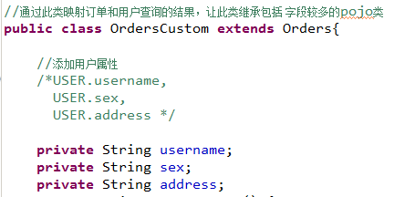

###### mapper.xml

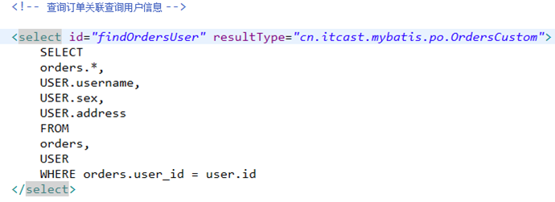

###### mapper.java

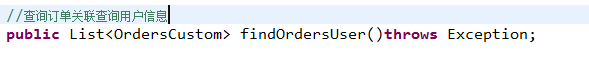

##### resultMap

###### sql语句
同resultType实现的sql
###### 使用resultMap映射的思路
使用resultMap将查询结果中的订单信息映射到Orders对象中，在orders类中添加User属性，将关联查询出来的用户信息映射到orders对象中的user属性中。
###### 需要Orders类中添加user属性

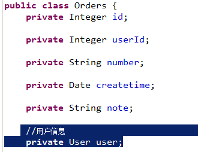]

###### mapper.xml

**定义resultMap**

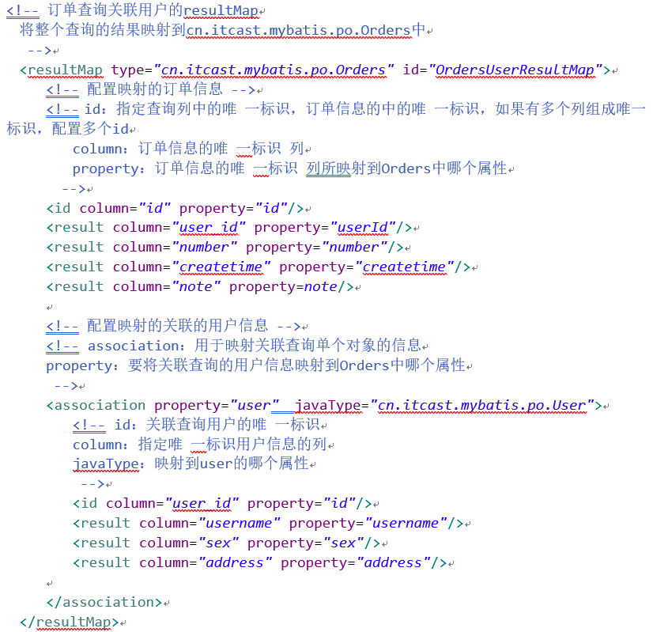

**statement定义**

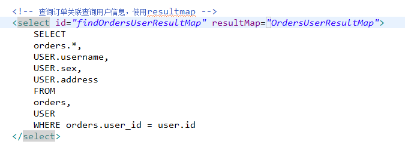

###### mapper.java

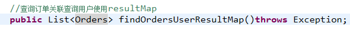

##### resultType和resultMap实现一对一查询小结
实现一对一查询：
resultType：使用resultType实现较为简单，如果pojo中没有包括查询出来的列名，需要增加列名对应的属性，即可完成映射。
如果没有查询结果的特殊要求建议使用resultType。
resultMap：需要单独定义resultMap，实现有点麻烦，如果对查询结果有特殊的要求，使用resultMap可以完成将关联查询映射pojo的属性中。
resultMap可以实现延迟加载，resultType无法实现延迟加载。

#### 一对多查询
##### 需求
查询订单及订单明细的信息
##### sql语句
确定主查询表：订单表
确定关联查询表：订单明细表
在一对一查询基础上添加订单明细表关联即可。

```sql
SELECT 
  orders.* ,
  USER.username,
  USER.sex,
  USER.address,
  orderdetail.id orderdetail_id,
  orderdetail.items_id,
  orderdetail.items_num,
  orderdetail.orders_id
FROM
  orders,
  USER,
  orderdetail
WHERE orders.user_id = user.id AND orderdetail.orders_id=orders.id
```
##### 分析
使用resultType将上边的 查询结果映射到pojo中，订单信息的就是重复

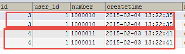

要求：
对orders映射不能出现重复记录。
在orders.java类中添加List<orderDetail> orderDetails属性。
最终会将订单信息映射到orders中，订单所对应的订单明细映射到orders中的orderDetails属性中。

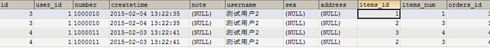

映射成的orders记录数为两条（orders信息不重复）
每个orders中的orderDetails属性存储了该 订单所对应的订单明细。

##### 在orders中添加list订单明细属性
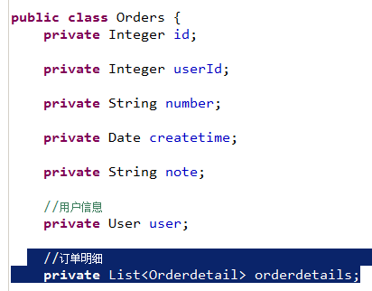
##### mapper.xml
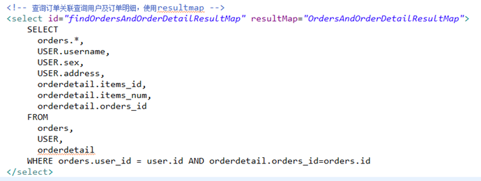
##### resultMap定义
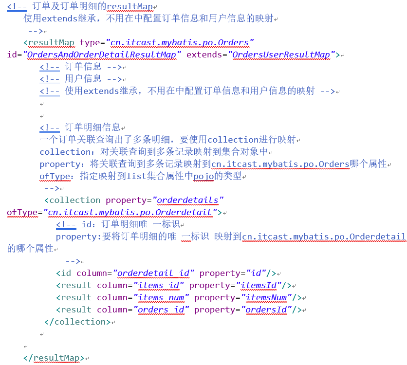
##### mapper.java
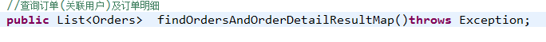
##### 小结
mybatis使用resultMap的collection对关联查询的多条记录映射到一个list集合属性中。
使用resultType实现：
将订单明细映射到orders中的orderdetails中，需要自己处理，使用双重循环遍历，去掉重复记录，将订单明细放在orderdetails中。
#### 多对多查询
##### 需求
查询用户及用户购买商品信息
##### sql语句
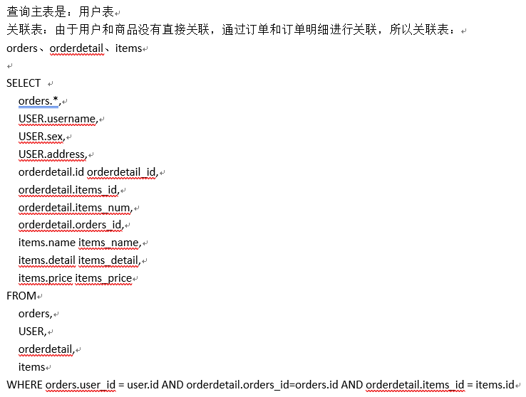
##### 映射思路

将用户信息映射到user中

在user类添加订单列表属性`List<Orders>oderlist`,将用户创建的订单映射到orderslist

在Orders中添加订单明细列表属性`List<OrderDetail>oderdetails`,将订单的明细映射到oderdetails

在OrderDetail中添加Idems属性，将订单明细对应的商品映射到items

##### mapper.xml
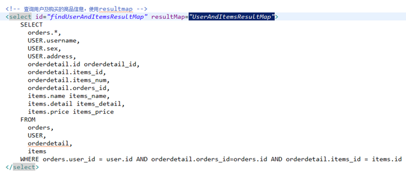
##### resultMap定义
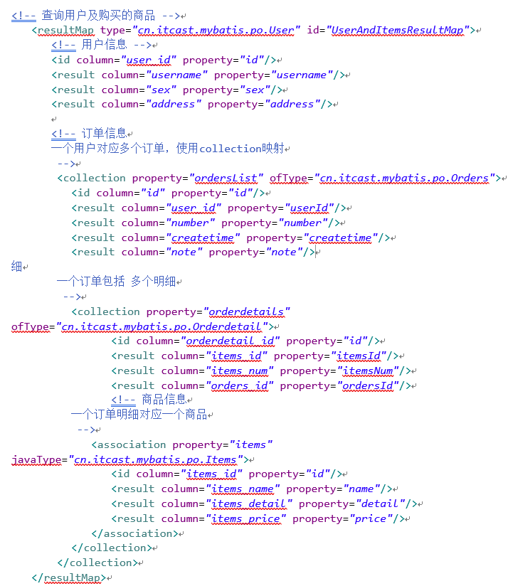
##### mapper.java
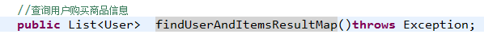
##### 多对多查询总结
将查询用户购买的商品信息明细清单，（用户名、用户地址、购买商品名称、购买商品时间、购买商品数量）
针对上边的需求就使用resultType将查询到的记录映射到一个扩展的pojo中，很简单实现明细清单的功能。
一对多是多对多的特例，如下需求：
查询用户购买的商品信息，用户和商品的关系是多对多关系。
需求1：
查询字段：用户账号、用户名称、用户性别、商品名称、商品价格(最常见)
企业开发中常见明细列表，用户购买商品明细列表，
使用resultType将上边查询列映射到pojo输出。
需求2：
查询字段：用户账号、用户名称、购买商品数量、商品明细（鼠标移上显示明细）
使用resultMap将用户购买的商品明细列表映射到user对象中。
总结：
使用resultMap是针对那些对查询结果映射有特殊要求的功能，，比如特殊要求映射成list中包括 多个list。
##### resultMap总结
resultType：
作用：
         将查询结果按照sql列名pojo属性名一致性映射到pojo中。
场合：
         常见一些明细记录的展示，比如用户购买商品明细，将关联查询信息全部展示在页面时，此时可直接使用resultType将每一条记录映射到pojo中，在前端页面遍历list（list中是pojo）即可。
resultMap：
         使用association和collection完成一对一和一对多高级映射（对结果有特殊的映射要求）。
association：
作用：
         将关联查询信息映射到一个pojo对象中。
场合：
         为了方便查询关联信息可以使用association将关联订单信息映射为用户对象的pojo属性中，比如：查询订单及关联用户信息。
         使用resultType无法将查询结果映射到pojo对象的pojo属性中，根据对结果集查询遍历的需要选择使用resultType还是resultMap。
collection：
作用：
         将关联查询信息映射到一个list集合中。
场合：
         为了方便查询遍历关联信息可以使用collection将关联信息映射到list集合中，比如：查询用户权限范围模块及模块下的菜单，可使用collection将模块映射到模块list中，将菜单列表映射到模块对象的菜单list属性中，这样的作的目的也是方便对查询结果集进行遍历查询。
         如果使用resultType无法将查询结果映射到list集合中。
### 延迟加载
#### 什么是延迟加载
resultMap可以实现高级映射（使用association、collection实现一对一及一对多映射），association、collection具备延迟加载功能。
需求：
如果查询订单并且关联查询用户信息。如果先查询订单信息即可满足要求，当我们需要查询用户信息时再查询用户信息。把对用户信息的按需去查询就是延迟加载。
延迟加载：先从单表查询、需要时再从关联表去关联查询，大大提高 数据库性能，因为查询单表要比关联查询多张表速度要快。
#### 使用association实现延迟加载
##### 需求
查询订单并且关联查询用户信息
##### mapper.xml
需要定义两个mapper的方法对应的statement。
1、只查询订单信息
SELECT * FROM orders
在查询订单的statement中使用association去延迟加载（执行）下边的satatement(关联查询用户信息)
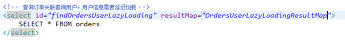
2、关联查询用户信息
&nbsp;&nbsp;&nbsp;&nbsp;&nbsp;&nbsp;&nbsp;&nbsp;&nbsp;通过上边查询到的订单信息中user_id去关联查询用户信息
&nbsp;&nbsp;&nbsp;&nbsp;&nbsp;&nbsp;&nbsp;&nbsp;&nbsp;使用UserMapper.xml中的findUserById

```xml
<select id="findUserById" parameterType="int" resultType="user">
	SELECT * FROM USER WHERE id=#{value}
</select>
```


上边先去执行findOrdersUserLazyLoading，当需要去查询用户的时候再去执行findUserById，通过resultMap的定义将延迟加载执行配置起来。

##### 延迟加载resultMap
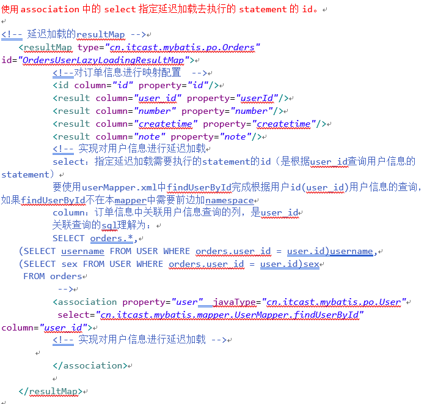
##### mapper.java
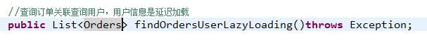
##### 测试：
1、执行上边mapper方法（findOrdersUserLazyLoading），内部去调用cn.itcast.mybatis.mapper.OrdersMapperCustom中的findOrdersUserLazyLoading只查询orders信息（单表）。
2、在程序中去遍历上一步骤查询出的List<Orders>，当我们调用Orders中的getUser方法时，开始进行延迟加载。
3、延迟加载，去调用UserMapper.xml中findUserbyId这个方法获取用户信息。

**延迟加载配置：**
mybatis默认没有开启延迟加载，需要在SqlMapConfig.xml中setting配置。
在mybatis核心配置文件中配置：
lazyLoadingEnabled、aggressiveLazyLoading
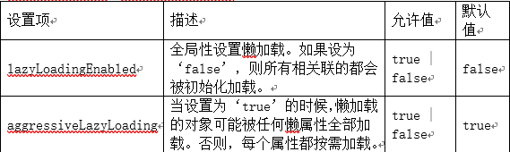
在SqlMapConfig.xml中配置：

```xml
<!--全局配置参数，需要时再设置-->
<settings>
	<!--打开延迟加载的开关-->
  	<setting name="lazyLoadingEnabled" value="true"/>
  	<!--将积极加载改为消极加载，即按需要加载-->
  	<setting name="aggressiveLazyLoading" value="false"></setting>
</settings>
```


**代码：**
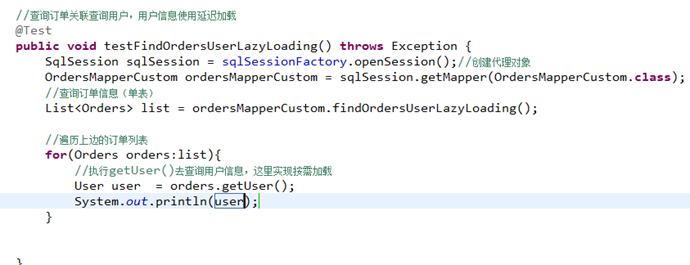

##### 延迟加载思考
不使用mybatis提供的association及collection中的延迟加载功能，如何实现延迟加载？？
实现方法如下：
定义两个mapper方法：
1、查询订单列表
2、根据用户id查询用户信息
实现思路：
先去查询第一个mapper方法，获取订单信息列表
在程序中（service），按需去调用第二个mapper方法去查询用户信息。
总之：
使用延迟加载方法，先去查询简单的sql（最好单表，也可以关联查询），再去按需要加载关联查询的其它信息。

### 查询缓存

#### 什么是查询缓存
mybatis提供查询缓存，用于减轻数据压力，提高数据库性能。
mybaits提供一级缓存，和二级缓存。
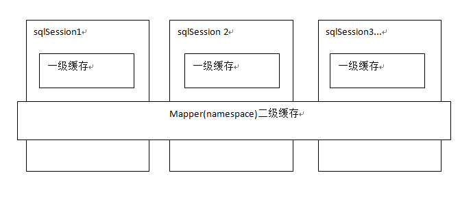
一级缓存是SqlSession级别的缓存。在操作数据库时需要构造 sqlSession对象，在对象中有一个数据结构（HashMap）用于存储缓存数据。不同的sqlSession之间的缓存数据区域（HashMap）是互相不影响的。
二级缓存是mapper级别的缓存，多个SqlSession去操作同一个Mapper的sql语句，多个SqlSession可以共用二级缓存，二级缓存是跨SqlSession的。
为什么要用缓存？
如果缓存中有数据就不用从数据库中获取，大大提高系统性能。

#### 一级缓存

##### 一级缓存工作原理

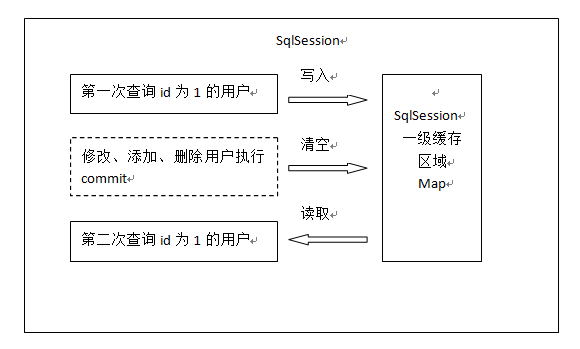

第一次发起查询用户id为1的用户信息，先去找缓存中是否有id为1的用户信息，如果没有，从数据库查询用户信息。
得到用户信息，将用户信息存储到一级缓存中
如果sqlSession去执行commit操作（执行插入、更新、删除），清空SqlSession中的一级缓存，这样做的目的为了让缓存中存储的是最新的信息，避免脏读。
第二次发起查询用户id为1的用户信息，先去找缓存中是否有id为1的用户信息，缓存中有，直接从缓存中获取用户信息。

##### 一级缓存测试

mybatis默认支持一级缓存，不需要在配置文件去配置。
按照上边一级缓存原理步骤去测试。

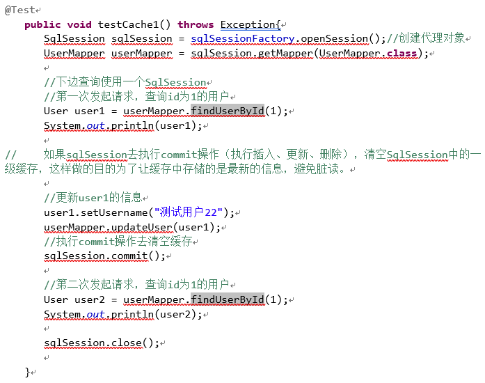

##### 一级缓存应用

正式开发，是将mybatis和spring进行整合开发，事务控制在service中。
一个service方法中包括 很多mapper方法调用。
service{
         //开始执行时，开启事务，创建SqlSession对象
         //第一次调用mapper的方法findUserById(1)
         //第二次调用mapper的方法findUserById(1)，从一级缓存中取数据
         //方法结束，sqlSession关闭
}
如果是执行两次service调用查询相同 的用户信息，不走一级缓存，因为session方法结束，sqlSession就关闭，一级缓存就清空。

#### 二级缓存

##### 二级缓存原理

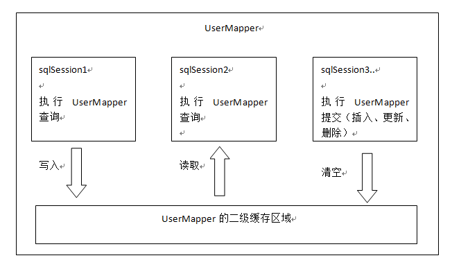
首先开启mybatis的二级缓存。
sqlSession1去查询用户id为1的用户信息，查询到用户信息会将查询数据存储到二级缓存中。
如果SqlSession3去执行相同 mapper下sql，执行commit提交，清空该 mapper下的二级缓存区域的数据。
sqlSession2去查询用户id为1的用户信息，去缓存中找是否存在数据，如果存在直接从缓存中取出数据。
二级缓存与一级缓存区别，二级缓存的范围更大，多个sqlSession可以共享一个UserMapper的二级缓存区域。
UserMapper有一个二级缓存区域（按namespace分） ，其它mapper也有自己的二级缓存区域（按namespace分）。
每一个namespace的mapper都有一个二缓存区域，两个mapper的namespace如果相同，这两个mapper执行sql查询到数据将存在相同 的二级缓存区域中。

##### 开启二级缓存

mybaits的二级缓存是mapper范围级别，除了在SqlMapConfig.xml设置二级缓存的总开关，还要在具体的mapper.xml中开启二级缓存。
在核心配置文件SqlMapConfig.xml中加入
`<setting name="cacheEnabled" value="true"/>`
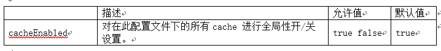
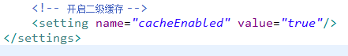
在UserMapper.xml中开启二缓存，UserMapper.xml下的sql执行完成会存储到它的缓存区域（HashMap）。
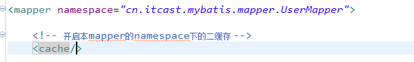

##### 调用pojo类实现序列化接口

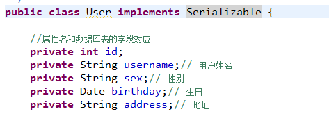
为了将缓存数据取出执行反序列化操作，因为二级缓存数据存储介质多种多样，不一样在内存。

##### 测试方法

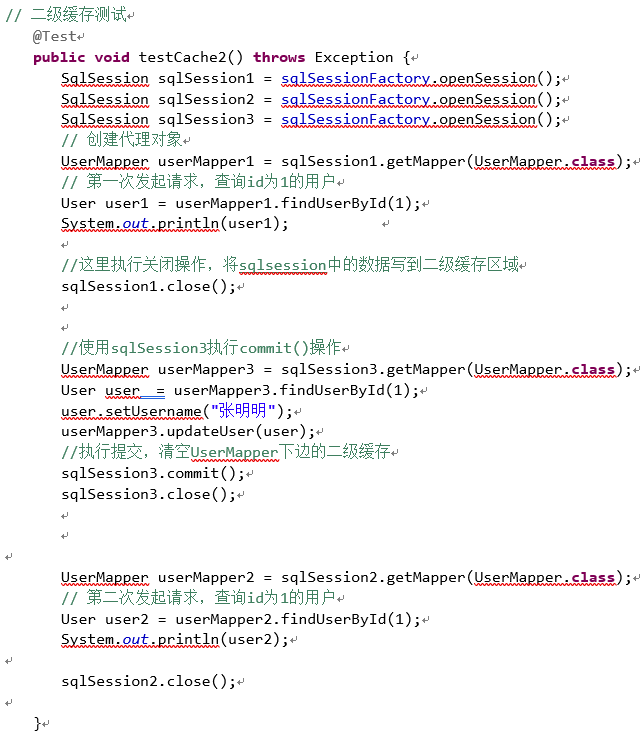

##### userCache配置

在statement中设置useCache=false可以禁用当前select语句的二级缓存，即每次查询都会发出sql去查询，默认情况是true，即该sql使用二级缓存。
`<select id="findOrderListResultMap" resultMap="ordersUserMap" useCache="false">`
总结：针对每次查询都需要最新的数据sql，要设置成useCache=false，禁用二级缓存。

##### 刷新缓存（就是清空缓存）

在mapper的同一个namespace中，如果有其它insert、update、delete操作数据后需要刷新缓存，如果不执行刷新缓存会出现脏读。
 设置statement配置中的flushCache="true" 属性，默认情况下为true即刷新缓存，如果改成false则不会刷新。使用缓存时如果手动修改数据库表中的查询数据会出现脏读。
如下：
`<insert id="insertUser" parameterType="cn.itcast.mybatis.po.User" flushCache="true">`
总结：一般下执行完commit操作都需要刷新缓存，flushCache=true表示刷新缓存，这样可以避免数据库脏读。

### mybatis整合ehcache
ehcache是一个分布式缓存框架
#### 分布缓存
我们系统为了提高系统并发，性能、一般对系统进行分布式部署（集群部署方式）
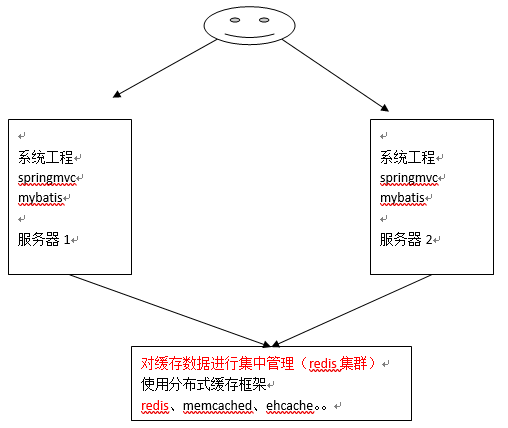
不使用分布缓存，缓存的数据在各各服务单独存储，不方便系统 开发。所以要使用分布式缓存对缓存数据进行集中管理。
mybatis无法实现分布式缓存，需要和其它分布式缓存框架进行整合。
#### 整合方法
mybatis提供了一个cache接口，如果要实现自己的缓存逻辑，实现cache接口开发即可。
mybatis和ehcache整合，mybatis和ehcache整合包中提供了一个cache接口的实现类。
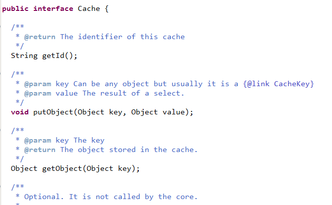
mybatis默认实现cache类是：
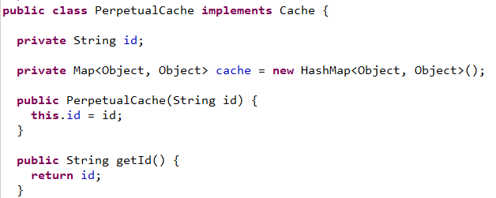
#### 加入ehcache包
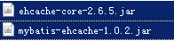
#### 整合ehcache
配置mapper中cache中的type为ehcache对cache接口的实现类型。
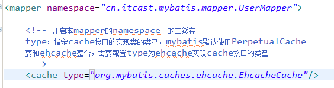
#### 加入ehcache的配置文件
在classpath下配置ehcache.xml
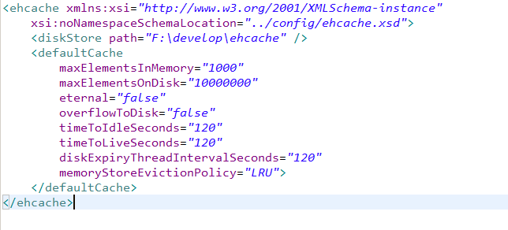
#### 二级应用场景
对于访问多的查询请求且用户对查询结果实时性要求不高，此时可采用mybatis二级缓存技术降低数据库访问量，提高访问速度，业务场景比如：耗时较高的统计分析sql、电话账单查询sql等。
         实现方法如下：通过设置刷新间隔时间，由mybatis每隔一段时间自动清空缓存，根据数据变化频率设置缓存刷新间隔flushInterval，比如设置为30分钟、60分钟、24小时等，根据需求而定。
#### 二级缓存局限性
mybatis二级缓存对细粒度的数据级别的缓存实现不好，比如如下需求：对商品信息进行缓存，由于商品信息查询访问量大，但是要求用户每次都能查询最新的商品信息，此时如果使用mybatis的二级缓存就无法实现当一个商品变化时只刷新该商品的缓存信息而不刷新其它商品的信息，因为mybaits的二级缓存区域以mapper为单位划分，当一个商品信息变化会将所有商品信息的缓存数据全部清空。解决此类问题需要在业务层根据需求对数据有针对性缓存。

## spring和mybatis整合

### 整合思路
需要spring通过单例方式管理SqlSessionFactory。
spring和mybatis整合生成代理对象，使用SqlSessionFactory创建SqlSession。（spring和mybatis整合自动完成）
持久层的mapper都需要由spring进行管理。

### 整合环境

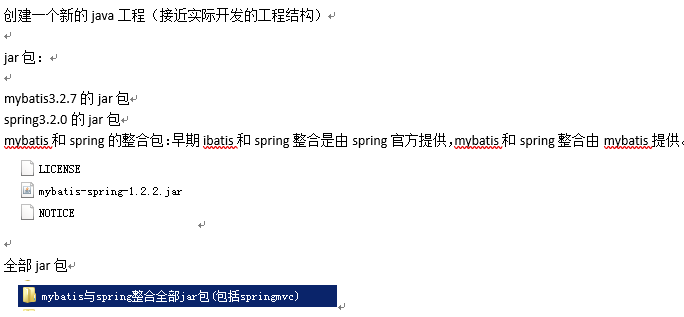

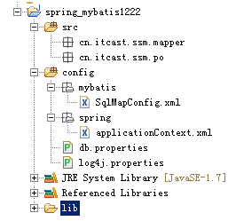

### SqlSessionFactory
在applicationContext.xml配置sqlSessionFactory和数据源
sqlSessionFactory在mybatis和spring的整合包下。

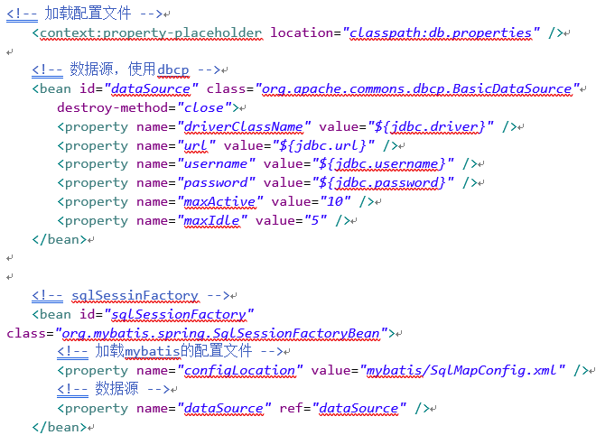

### 原始dao开发（和spring整合后）

#### User.xml

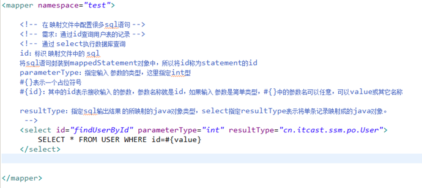

在SqlMapconfig.xml中加载User.xml

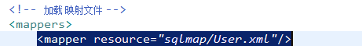

#### dao（实现类继承SqlSessionDaoSupport）

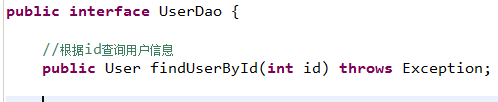

dao接口实现类需要注入SqlSessoinFactory，通过spring进行注入。
这里spring声明配置方式，配置dao的bean：
让UserDaoImpl实现类继承SqlSessionDaoSupport

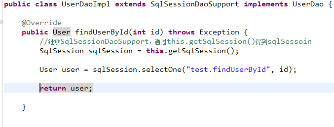

#### 配置dao

在applicationContext.xml中配置dao。

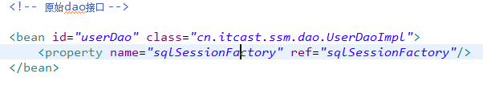

#### 测试程序

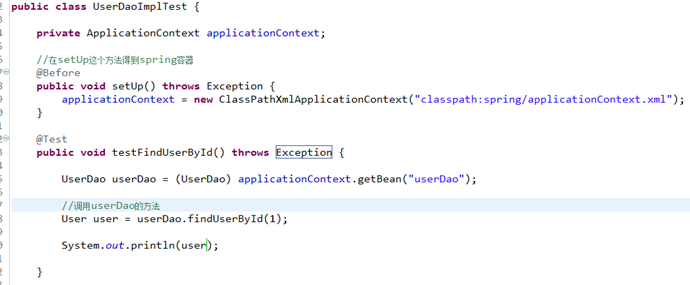


### mapper代理开发

#### mapper.xml和mapper.java

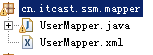

#### 通过MapperFactoryBean创建代理对象

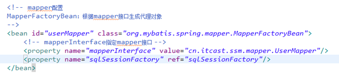

此方法问题：
需要针对每个mapper进行配置，麻烦。

#### 通过MapperScannerConfigurer进行mapper扫描（建议使用）

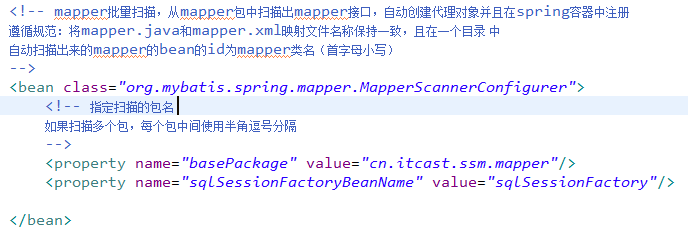

#### 测试代码

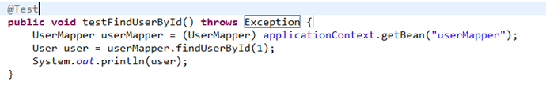

## 逆向工程

mybaits需要程序员自己编写sql语句，mybatis官方提供逆向工程 可以针对单表自动生成mybatis执行所需要的代码（mapper.java,mapper.xml、po..）
企业实际开发中，常用的逆向工程方式：
由于数据库的表生成java代码。

### 下载逆向工程

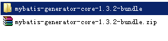

### 使用方法

#### 运行逆向工程
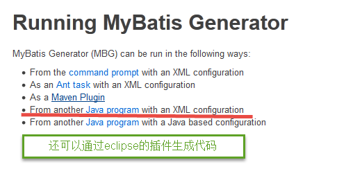
建议使用java程序方式，不依赖开发工具。

#### 生成代码配置文件
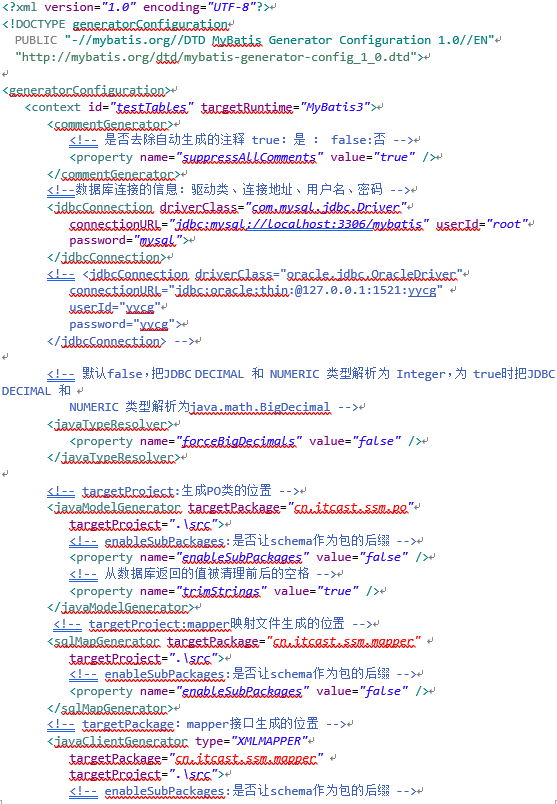
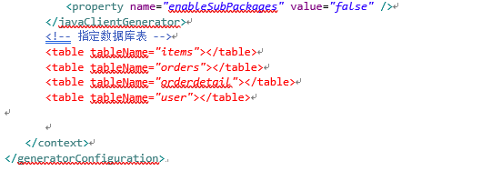
#### 执行生成程序
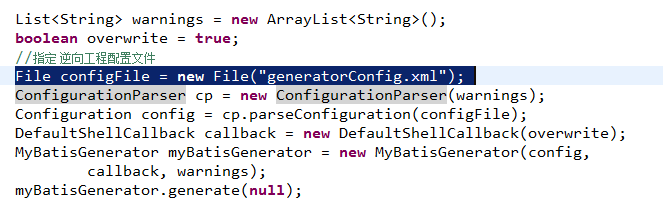
生成后的代码：
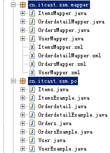
#### 使用生成的代码
需要将生成工程中所生成的代码拷贝到自己的工程中。
测试ItemsMapper中的方法
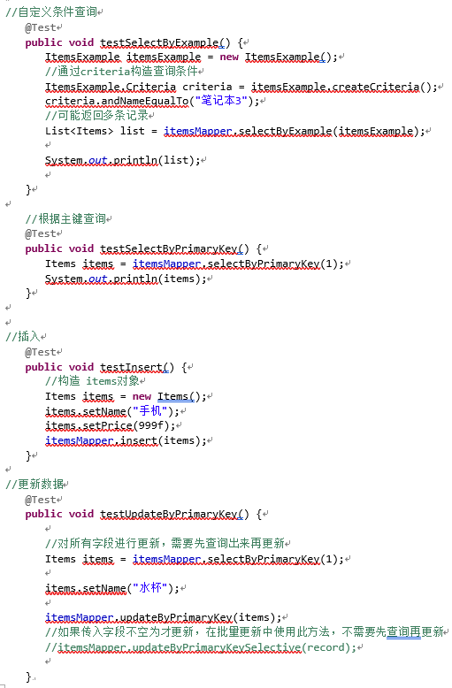

### 使用方法二(IDEA，常用)

mybatis-generator.xml

```xml
<?xml version="1.0" encoding="UTF-8"?>
<!DOCTYPE generatorConfiguration
        PUBLIC "-//mybatis.org//DTD MyBatis Generator Configuration 1.0//EN"
        "http://mybatis.org/dtd/mybatis-generator-config_1_0.dtd">

<generatorConfiguration>

    <context id="DB2Tables" targetRuntime="MyBatis3">
        <!--数据库链接地址账号密码-->
        <jdbcConnection driverClass="com.mysql.cj.jdbc.Driver"
                        connectionURL="jdbc:mysql://127.0.0.1:3306/seckill"
                        userId="root"
                        password="123456">
        </jdbcConnection>

        <javaTypeResolver >
            <property name="forceBigDecimals" value="false" />
        </javaTypeResolver>
        <!--生成dataobject类存放位置-->
        <javaModelGenerator targetPackage="com.goya.dataobject" targetProject="src/main/java">
            <property name="enableSubPackages" value="true" />
            <property name="trimStrings" value="true" />
        </javaModelGenerator>
        <!--生成映射文件存放位置-->
        <sqlMapGenerator targetPackage="mapping"  targetProject="src/main/resources">
            <property name="enableSubPackages" value="true" />
        </sqlMapGenerator>
        <!--生成dao类存放位置-->
        <javaClientGenerator type="XMLMAPPER" targetPackage="com.goya.dao"  targetProject="src/main/java">
            <property name="enableSubPackages" value="true" />
        </javaClientGenerator>
        <!--生成对应表及类名-->
<!--        <table tableName="user_info" domainObjectName="UserDO" enableCountByExample="false"-->
<!--        enableUpdateByExample="false" enableDeleteByExample="false"-->
<!--               enableSelectByExample="false" selectByExampleQueryId="false"></table>-->
<!--        <table tableName="user_password" domainObjectName="UserPass" enableCountByExample="false"-->
<!--               enableUpdateByExample="false" enableDeleteByExample="false"-->
<!--               enableSelectByExample="false" selectByExampleQueryId="false"></table>-->
        <table tableName="user_info" domainObjectName="UserDO" enableCountByExample="false"
               enableUpdateByExample="false" enableDeleteByExample="false"
               enableSelectByExample="false" selectByExampleQueryId="false"></table>
        <table tableName="user_password" domainObjectName="UserPasswordDO" enableCountByExample="false"
               enableUpdateByExample="false" enableDeleteByExample="false"
               enableSelectByExample="false" selectByExampleQueryId="false"></table>


    </context>
</generatorConfiguration>
```

pom plugin

```xml
<!--mybatis自动生成插件-->
<plugin>
  <groupId>org.mybatis.generator</groupId>
  <artifactId>mybatis-generator-maven-plugin</artifactId>
  <version>1.3.5</version>
  <dependencies>
    <dependency>
      <groupId>org.mybatis.generator</groupId>
      <artifactId>mybatis-generator-core</artifactId>
      <version>1.3.5</version>
    </dependency>
    <dependency>
      <groupId>mysql</groupId>
      <artifactId>mysql-connector-java</artifactId>
      <version>8.0.16</version>
    </dependency>
  </dependencies>
  <executions>
    <execution>
      <id>mybatis generator</id>
      <phase>package</phase>
      <goals>
        <goal>generate</goal>
      </goals>
    </execution>
  </executions>
  <configuration>
    <!--允许移动生成的文件-->
    <verbose>true</verbose>
    <!--允许覆盖,企业开发不要设置为true-->
    <overwrite>true</overwrite>
    <configurationFile>
      src/main/resources/mybatis-generator.xml
    </configurationFile>
  </configuration>
</plugin>
```

