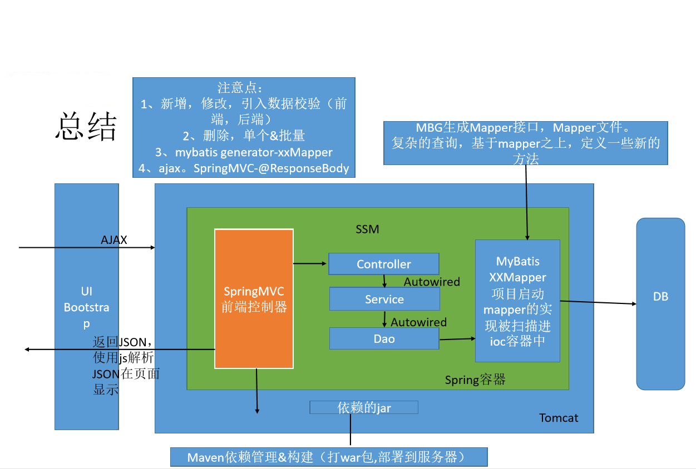

# SSM高级整合

## 创建Maven Web项目
创建Maven项目，生成web.xml文件
```xml
<?xml version="1.0" encoding="UTF-8"?><web-app xmlns:xsi="http://www.w3.org/2001/XMLSchema-instance" xmlns="http://java.sun.com/xml/ns/javaee" xsi:schemaLocation="http://java.sun.com/xml/ns/javaee http://java.sun.com/xml/ns/javaee/web-app_2_5.xsd" id="WebApp_ID" version="2.5">

</web-app>
```
>web.xml是整个项目的核心配置文件，也可以理解为Web程序访问的入口，非常重要在servlet3.0及后续版本中，此配置文件可省略，采用注解方式替代

在项目的pom.xml文件中增加依赖关系
```xml
<dependencies>    <dependency>        <groupId>javax.servlet</groupId>        <artifactId>servlet-api</artifactId>        <version>2.5</version>    </dependency>    <dependency>        <groupId>javax.servlet.jsp</groupId>        <artifactId>jsp-api</artifactId>        <version>2.1.3-b06</version>    </dependency>    <dependency>        <groupId>org.springframework</groupId>        <artifactId>spring-core</artifactId>        <version>4.0.0.RELEASE</version>    </dependency>    <dependency>        <groupId>org.springframework</groupId>        <artifactId>spring-context</artifactId>        <version>4.0.0.RELEASE</version>    </dependency>    <dependency>        <groupId>org.springframework</groupId>        <artifactId>spring-jdbc</artifactId>        <version>4.0.0.RELEASE</version>    </dependency>    <dependency>        <groupId>org.springframework</groupId>        <artifactId>spring-orm</artifactId>        <version>4.0.0.RELEASE</version>    </dependency>    <dependency>        <groupId>org.springframework</groupId>        <artifactId>spring-web</artifactId>        <version>4.0.0.RELEASE</version>    </dependency>    <dependency>        <groupId>org.springframework</groupId>        <artifactId>spring-webmvc</artifactId>        <version>4.0.0.RELEASE</version>    </dependency>    <dependency>        <groupId>com.mchange</groupId>        <artifactId>c3p0</artifactId>        <version>0.9.2</version>    </dependency>    <dependency>        <groupId>cglib</groupId>        <artifactId>cglib</artifactId>        <version>2.2</version>    </dependency>    <dependency>        <groupId>org.aspectj</groupId>        <artifactId>aspectjweaver</artifactId>        <version>1.6.8</version>    </dependency>    <!-- Spring整合MyBatis -->    <!-- MyBatis中延迟加载需要使用Cglib -->    <!-- 
https://mvnrepository.com/artifact/org.mybatis/mybatis 
-->    <dependency>        <groupId>org.mybatis</groupId>        <artifactId>mybatis</artifactId>        <version>3.2.8</version>    </dependency>    <dependency>        <groupId>org.mybatis</groupId>        <artifactId>mybatis-spring</artifactId>        <version>1.2.2</version>    </dependency>    <!-- 控制日志输出：结合log4j -->    <dependency>        <groupId>log4j</groupId>        <artifactId>log4j</artifactId>        <version>1.2.17</version>    </dependency>    <dependency>        <groupId>org.slf4j</groupId>        <artifactId>slf4j-api</artifactId>        <version>1.7.7</version>    </dependency>    <dependency>        <groupId>org.slf4j</groupId>        <artifactId>slf4j-log4j12</artifactId>        <version>1.7.7</version>    </dependency>    <dependency>        <groupId>mysql</groupId>        <artifactId>mysql-connector-java</artifactId>        <version>5.1.37</version>    </dependency>    <dependency>        <groupId>jstl</groupId>        <artifactId>jstl</artifactId>        <version>1.2</version>    </dependency>    <!-- ********其他****************************** -->    <!-- Ehcache二级缓存 -->    <dependency>        <groupId>net.sf.ehcache</groupId>        <artifactId>ehcache</artifactId>        <version>1.6.2</version>    </dependency>    <!-- 石英调度 - 开始 -->    <dependency>        <groupId>org.quartz-scheduler</groupId>        <artifactId>quartz</artifactId>        <version>1.8.5</version>    </dependency>    <dependency>        <groupId>org.springframework</groupId>        <artifactId>spring-context-support</artifactId>        <version>4.0.0.RELEASE</version>    </dependency>    <dependency>        <groupId>commons-collections</groupId>        <artifactId>commons-collections</artifactId>        <version>3.1</version>    </dependency>    <!-- 石英调度 - 结束 -->    <dependency>        <groupId>org.codehaus.jackson</groupId>        <artifactId>jackson-mapper-asl</artifactId>        <version>1.9.2</version>    </dependency>    <dependency>        <groupId>org.apache.poi</groupId>        <artifactId>poi</artifactId>        <version>3.9</version>    </dependency>    <dependency>        <groupId>org.jfree</groupId>        <artifactId>jfreechart</artifactId>        <version>1.0.19</version>    </dependency>    <dependency>        <groupId>commons-fileupload</groupId>        <artifactId>commons-fileupload</artifactId>        <version>1.3.1</version>    </dependency>    <dependency>        <groupId>org.freemarker</groupId>        <artifactId>freemarker</artifactId>        <version>2.3.19</version>    </dependency>    <dependency>        <groupId>org.activiti</groupId>        <artifactId>activiti-engine</artifactId>        <version>5.15.1</version>    </dependency>    <dependency>        <groupId>org.activiti</groupId>        <artifactId>activiti-spring</artifactId>        <version>5.15.1</version>    </dependency>    <dependency>        <groupId>org.apache.commons</groupId>        <artifactId>commons-email</artifactId>        <version>1.3.1</version>    </dependency>    <dependency>        <groupId>org.activiti</groupId>        <artifactId>activiti-explorer</artifactId>        <version>5.15.1</version>        <exclusions>            <exclusion>                <artifactId>groovy-all</artifactId>                <groupId>org.codehaus.groovy</groupId>            </exclusion>        </exclusions>    </dependency></dependencies>  

```
## 集成Spring框架
Spring框架是整个系统架构的核心，将前端请求数据的处理以及数据库的数据操作整合在一起，非常重要。
在web.xml文件中增加配置信息集成Spring框架
```xml
<web-app>
...
    <context-param>
        <param-name>contextConfigLocation</param-name>
        <param-value>classpath*:spring/spring-*.xml</param-value>
    </context-param>
    <listener>
        <listener-class>org.springframework.web.context.ContextLoaderListener</listener-class>
    </listener>
...
</web-app>
```
Spring环境构建时需要读取web应用的初始化参数contextConfigLocation, 从classpath中读取配置文件`spring/spring-*.xml`
在项目src/main/resources目录中增加spring文件夹，并在其中增加spring-context.xml配置文件。
```xml
<?xml version="1.0" encoding="UTF-8"?><beans xmlns="http://www.springframework.org/schema/beans"
    xmlns:xsi="http://www.w3.org/2001/XMLSchema-instance"
    xmlns:context="http://www.springframework.org/schema/context"
    xmlns:tx="http://www.springframework.org/schema/tx"
    xmlns:aop="http://www.springframework.org/schema/aop"
    xsi:schemaLocation="http://www.springframework.org/schema/aop http://www.springframework.org/schema/aop/spring-aop-4.0.xsd
        http://www.springframework.org/schema/beans http://www.springframework.org/schema/beans/spring-beans.xsd
        http://www.springframework.org/schema/tx http://www.springframework.org/schema/tx/spring-tx-4.0.xsd
        http://www.springframework.org/schema/context http://www.springframework.org/schema/context/spring-context-4.0.xsd">
        
</beans>
```
Spring框架的核心是构建对象，整合对象之间的关系（IOC）及扩展对象功能（AOP），所以需要在spring-context.xml配置文件中增加业务对象扫描的相关配置。扫描后由Spring框架进行管理和组合。
```xml
<beans>
    ...
    <context:component-scan base-package="com.atguigu.*" >
        <context:exclude-filter type="annotation" expression="org.springframework.stereotype.Controller"/>
    </context:component-scan>
    ...
</beans>
```
>扫描配置中为什么要排除Controller注解Controller注解的的作用是声明控制器（处理器）类。从数据流转的角度，这个类应该是由SpringMVC框架进行管理和组织的，所以不需要由Spring框架扫描。

## 集成SpringMVC框架
SpringMVC框架用于处理系统中数据的流转及控制操作。
（从哪里来，到哪里去。多么有哲理的一句话。）
集成SpringMVC框架，需要在web.xml文件中增加配置信息

```xml
<web-app>
...
    <servlet>
        <servlet-name>springmvc</servlet-name>
        <servlet-class>org.springframework.web.servlet.DispatcherServlet</servlet-class>
        <init-param>
            <param-name>contextConfigLocation</param-name>
            <param-value>classpath:spring/springmvc-context.xml</param-value>
        </init-param>
        <load-on-startup>1</load-on-startup>
    </servlet>
    <servlet-mapping>
        <servlet-name>springmvc</servlet-name>
        <url-pattern>/</url-pattern>
    </servlet-mapping>
...
</web-app>
```

SpringMVC环境构建时需要读取servlet初始化参数init-param, 从classpath中读取配置文件`spring/springmvc-context.xml`
在项目src/main/resources/spring目录中，增加springmvc-context.xml配置文件。
```xml
<?xml version="1.0" encoding="UTF-8"?><beans xmlns="http://www.springframework.org/schema/beans"
    xmlns:xsi="http://www.w3.org/2001/XMLSchema-instance"
    xmlns:context="http://www.springframework.org/schema/context"
    xmlns:p="http://www.springframework.org/schema/p"
    xmlns:mvc="http://www.springframework.org/schema/mvc"
    xsi:schemaLocation="http://www.springframework.org/schema/mvc http://www.springframework.org/schema/mvc/spring-mvc-4.0.xsd
        http://www.springframework.org/schema/beans http://www.springframework.org/schema/beans/spring-beans.xsd
        http://www.springframework.org/schema/context http://www.springframework.org/schema/context/spring-context-4.0.xsd">

</beans>
```
SpringMVC框架的核心是处理数据的流转，所以需要在springmvc-context.xml配置文件中增加控制器对象（Controller）扫描的相关配置。扫描后由SpringMVC框架进行管理和组合。
```xml
<beans>
    ...
    <context:component-scan base-package="com.atguigu.*" use-default-filters="false" >
        <context:include-filter type="annotation" expression="org.springframework.stereotype.Controller"/>
    </context:component-scan>
    ...
</beans>
```
>静态资源如何不被SpringMVC框架进行拦截在配置文件中增加`<mvc:default-servlet-handler/>`, `<mvc:annotation-driven />`即可在实际的项目中静态资源不会和动态资源放在一起，也就意味着不会放置在服务器中，所以这些配置可以省略。

如果SpringMVC框架数据处理为页面跳转，那么需要配置相应的视图解析器ViewResolver。
```xml
<beans>
    ...
    <bean class="org.springframework.web.servlet.view.InternalResourceViewResolver" >
        <property name="viewClass" value="org.springframework.web.servlet.view.JstlView"/>
        <property name="prefix" value="/WEB-INF/jsp/"/>
        <property name="suffix" value=".jsp"/>
    </bean>
    ...
</beans>
```
>如果有多个视图解析器怎么办？SpringMVC框架中允许存在多个视图解析器，框架会按照配置声明顺序，依次进行解析。SpringMVC框架中配置多个视图解析器时，如果将InternalResourceViewResolver解析器配置在前，那么即使找不到视图，框架也不会继续解析，直接发生404错误，所以必须将InternalResourceViewResolver解析器放置在最后。

如果SpringMVC框架数据处理为响应JSON字符串，那么为了浏览器方便对响应的字符串进行处理，需要明确字符串的类型及编码方式。

**如果增加了<mvc:annotation-driven />标签，下面的配置可省略。**
```xml
<beans>
    ...
    <bean class="org.springframework.web.servlet.mvc.annotation.AnnotationMethodHandlerAdapter" >
        <property name="messageConverters" >
            <list>
                <bean class="org.springframework.http.converter.json.MappingJacksonHttpMessageConverter" >
                    <property name="supportedMediaTypes" >
                        <list>
                            <value>application/json;charset=UTF-8</value>
                        </list>
                    </property>
                </bean>
            </list>
        </property>
    </bean>
    ...
</beans>
```
如果项目中含有文件上传业务，还需要增加文件上传解析器MultipartResolver
```xml
<beans>
    ...
    <bean id="multipartResolver" class="org.springframework.web.multipart.commons.CommonsMultipartResolver" p:defaultEncoding="UTF-8" >
        <property name="maxUploadSize" value="2097152"/>
        <property name="resolveLazily" value="true"/>
    </bean>
    ...
</beans>
```
## 集成Mybatis框架
Mybatis框架主要处理业务和数据库之间的数据交互，所以创建对象和管理对象生命周期的职责可以委托Spring框架完成。如：创建Mybatis核心对象。
```xml
<beans>
    ...
    <bean id="sqlSessionFactory" class="org.mybatis.spring.SqlSessionFactoryBean" >
        <property name="configLocation" value="classpath:mybatis/config.xml" />
        <property name="dataSource" ref="dataSource" />
        <property name="mapperLocations" >
            <list>
                <value>classpath*:mybatis/mapper-*.xml</value>
            </list>
        </property>
    </bean>
    ...
    <bean id="mapperScannerConfigurer" class="org.mybatis.spring.mapper.MapperScannerConfigurer" >
        <property name="basePackage" value="com.atguigu.atcrowdfunding.**.dao" />
    </bean>
    ...
</beans>
```
既然需要和数据库进行关联，那么Mybatis核心对象就需要依赖于数据库连接池（C3P0）,所以在Spring配置文件中增加相应的配置。
```xml

<beans>
    ...
    <bean id="dataSource" class="com.mchange.v2.c3p0.ComboPooledDataSource" >
        <property name="driverClass" value="com.mysql.jdbc.Driver"/>
        <property name="jdbcUrl" value="jdbc:mysql://localhost:3306/atcrowdfunding?rewriteBatchedStatements=true&amp;useUnicode=true&amp;characterEncoding=utf8"/>
        <property name="user" value="root"/>
        <property name="password" value="root"/>
    </bean>
    ...
</beans>
```
集成Mybatis框架时同时还需要增加核心配置文件mybatis/config.xml。
```xml
<?xml version="1.0" encoding="UTF-8"?><!DOCTYPE configuration PUBLIC "-//mybatis.org//DTD Config 3.0//EN" "http://mybatis.org/dtd/mybatis-3-config.dtd"><configuration>
    <typeAliases>
        ...
    </typeAliases></configuration>
```
及SQL映射文件`mybatis/mapper-*.xml`。
```xml
<?xml version="1.0" encoding="UTF-8"?><!DOCTYPE mapper PUBLIC "-//mybatis.org//DTD Mapper 3.0//EN" "http://mybatis.org/dtd/mybatis-3-mapper.dtd"><mapper namespace="xxx.XXDao" >
...
</mapper>
```
为了保证数据操作的一致性，必须在程序中增加事务处理。Spring框架采用声明式事务，通过AOP的方式将事务增加到业务中。所以需要在Spring配置文件中增加相关配置
```xml
<beans>
    ...
    <bean id="transactionManager" class="org.springframework.jdbc.datasource.DataSourceTransactionManager" >
        <property name="dataSource" ref="dataSource"/>
    </bean>
    <tx:advice id="transactionAdvice" transaction-manager="transactionManager" >
        <tx:attributes>
            <tx:method name="*" propagation="REQUIRED" isolation="DEFAULT" rollback-for="java.lang.Exception" />
            <tx:method name="query*" read-only="true" />
        </tx:attributes>
    </tx:advice>    
    <aop:config>
        <aop:advisor advice-ref="transactionAdvice" pointcut="execution(* com.atguigu..*Service.*(..))"/>
    </aop:config>
    ...
</beans>
```
测试前，需要在数据库中增加atcrowdfunding库及t_user表。
```sql
CREATE DATABASE `atcrowdfunding`;
...
CREATE TABLE `t_user` (
  `id` int(11) NOT NULL AUTO_INCREMENT
  PRIMARY KEY (`id`)
) ENGINE=InnoDB AUTO_INCREMENT=5 DEFAULT CHARSET=utf8;
```
## 框架集成测试
框架集成完毕后，需要增加代码程序进行简单的测试。
增加代码前请参考《阿里巴巴Java开发手册》
在src/main/java/com/atguigu/atcrowdfunding/controller目录中增加UserController
```java
package com.atguigu.atcrowdfunding.controller;
import java.util.HashMap;
import java.util.Map;

import org.springframework.stereotype.Controller;
import org.springframework.web.bind.annotation.RequestMapping;
import org.springframework.web.bind.annotation.ResponseBody;

@Controller
@RequestMapping("/user")
public class UserController {

    @RequestMapping("/index")
    public String index() {
        return "user/index";
    }
    
    @ResponseBody
    @RequestMapping("/json")
    public Object json() {
        Map map = new HashMap();
        map.put("username", "张三");
        return map;
    }
}
```
将web项目发布到服务器中，启动服务器，浏览器中分别输入路径http://127.0.0.1:8080/应用路径名称/user/index，http://127.0.0.1:8080/应用路径名称/user/json进行测试。
>如果访问成功，说明项目中SpringMVC框架集成成功。

在src/main/java/com/atguigu/atcrowdfunding/service目录中增加UserService接口。
```java

package com.atguigu.atcrowdfunding.service;

public interface UserService {

}
```
在src/main/java/com/atguigu/atcrowdfunding/service/impl目录中增加UserServiceImpl实现类。
```java

package com.atguigu.atcrowdfunding.service.impl;

import com.atguigu.atcrowdfunding.service.UserService;
import org.springframework.beans.factory.annotation.Autowired;
import org.springframework.stereotype.Service;

@Service
public class UserServiceImpl implements UserService {
    @Autowired
    private UserDao userDao;
}
```

在src/main/java/com/atguigu/atcrowdfunding/dao目录中增加UserDao接口。
```java

package com.atguigu.atcrowdfunding.dao;

public interface UserDao {

}
```
修改UserController类，增加对UserService接口的引用。
```java

package com.atguigu.atcrowdfunding.controller;

import java.util.HashMap;
import java.util.Map;

import org.springframework.beans.factory.annotation.Autowired;
import org.springframework.stereotype.Controller;
import org.springframework.web.bind.annotation.RequestMapping;
import org.springframework.web.bind.annotation.ResponseBody;

@Controller
@RequestMapping("/user")
public class UserController {

    @Autowired
    private UserService userService;
    
    @RequestMapping("/index")
    public String index() {
        return "user/index";
    }
    
    @ResponseBody
    @RequestMapping("/json")
    public Object json() {
        Map map = new HashMap();
        map.put("username", "张三");
        return map;
    }
}
```
重启服务器，重新通过浏览器中访问路径http://127.0.0.1:8080/应用路径名称/user/index进行测试。
>如果访问成功，说明项目中Spring框架（IOC功能）集成成功。


在src/main/java/com/atguigu/corwdfunding/bean目录中增加User实体类
```java

package com.atguigu.atcrowdfunding.bean;

public class User {

}
```
在UserService接口中增加方法声明queryById，并在UserServiceImpl类中默认实现
```java

package com.atguigu.atcrowdfunding.service;

import com.atguigu.atcrowdfunding.bean.User;
public interface UserService {
    public User queryById();
}
```
```java

package com.atguigu.atcrowdfunding.service.impl;

import com.atguigu.atcrowdfunding.bean.User;
import com.atguigu.atcrowdfunding.service.UserService;
import org.springframework.beans.factory.annotation.Autowired;
import org.springframework.stereotype.Service;

@Service
public class UserServiceImpl implements UserService {
    @Autowired
    private UserDao userDao;
    
    public User queryById() {
        return userDao.queryById();
    }
}
```
>如果访问成功，说明项目中Spring框架（AOP功能）集成成功。

在UserDao中增加查询语句，实现数据库查询
```java

package com.atguigu.atcrowdfunding.dao;

import com.atguigu.atcrowdfunding.bean.User;
import org.apache.ibatis.annotations.Select;

public interface UserDao {
    
        @Select("select * from t_user where id = 1")
        public User queryById();
}
```
>如果访问成功，说明项目中Mybatis框架集成成功。

## 模拟生产环境
Web软件开发中，由于开发阶段不同，系统环境主要分为：开发环境，测试环境，生产环境。
将系统部署到生产环境后，经常会听开发人员这么说：这个Bug不应该呀，我们在测试时没问题呀，怎么到了生产环境就不行了呢!!!
其实之所以会出现这种情况，很大程度上是因为我们在项目的不同阶段时，对应用系统的访问方式不一样所造成的。
一般在开发，测试阶段时，我们都会以本地服务器地址http://localhost:8080/project访问系统，但是在生产环境中，我们的访问方式发生了变化：http://com.xxxxx/，由于环境的不同，导致访问方式的变化，那么就会产生很多之前没有的问题。
**如果能将开发，测试，生产环境的访问方式保持一致的话，那么就可以提前发现客户在使用时所发生的问题，将这些问题提前解决，还是非常不错的。**
* 将Tomcat服务器的默认HTTP监听端口号：8080修改为80
* 将项目中.settings目录下的配置文件org.eclipse.wst.common.component中的context-root属性修改为/(斜杠)
* 修改系统主机文件c:\Windows\System32\drivers\etc\hosts增加IP地址和域名的解析关系：127.0.0.1 www.atcrowdfunding.com