# Spring

spring是开源的轻量级框架

spring是一站式框架：
spring在javaee三层结构中，每一层都提供不同的解决技术
web层：springMVC
service层：spring的ioc
dao层：spring的jdbcTemplate

EJB：重量级框架（相比spring比EJB依赖资源少，销毁的资源少）

**spring核心主要两部分：**

* **AOP：** 面向切面编程，扩展功能不是修改源代码实现
* **IOC：** 控制反转，比如有一个类，在类里有方法（不是静态方法），调用类里面的方法，创建类的对象，使用对象调用方法，创建类对象的过程，需要new出来对象，把对象的创建不是通过new方式实现，而是交给spring配置创建类对象（反射）

spring版本：4.x

## IOC

把对象的创建交给spring进行管理
ioc操作两部分：
ioc的配置文件方式
ioc的注解方式

### IOC底层原理

**IOC底层原理实用技术**
xml配置文件
dom4j解决xml
工厂设计模式
反射

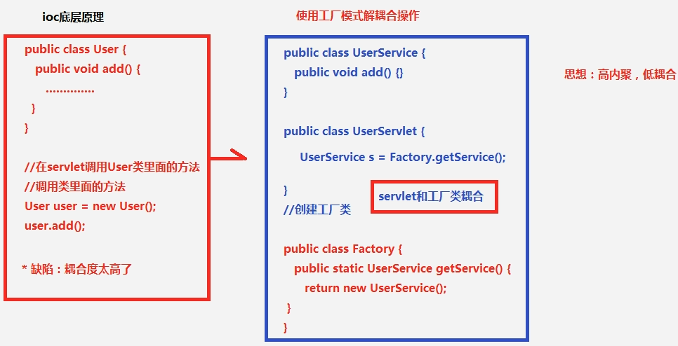

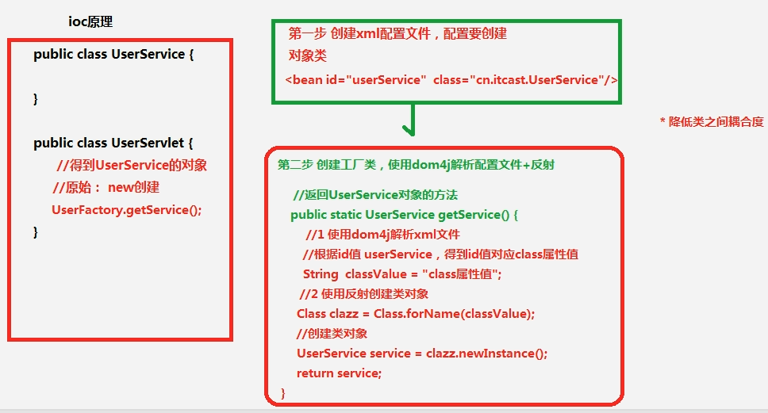

### IOC入门案例
第一步：导入jar包：
核心四个基本功能jar包

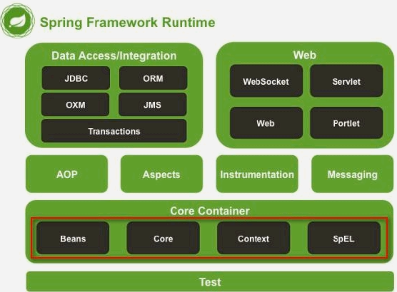

导入支持日志输出的jar包
第二步：创建类，在类里面创建方法
第三步：创建spring配置文件，配置创建类：
spring核心配置文件名称和位置不是固定的：
建议放在src下面，官方建议：applicationContext.xml
引入schema约束：

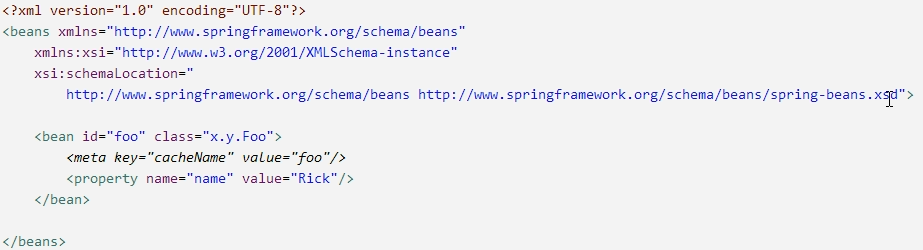

配置：

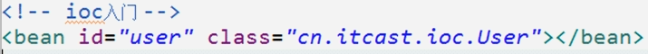

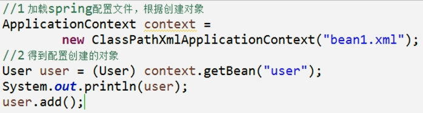

## Spring的bean管理（xml方式）

Bean实例化的方式
在spring里面通过配置文件创建对象
bean实例化三种方式实现：

* **第一种：使用类的无参数构造创建：**

  当类里面没有无参数的构造，出现异常

  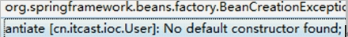

* 第二种：使用静态工厂创建：

  创建静态的方法，返回类的对象

  

  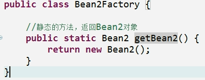

* 第三种：使用实例工厂创建：

  创建不是静态的方法，返回类的对象

  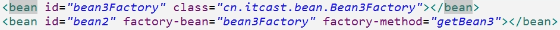

  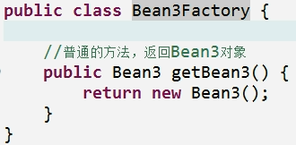

## Bean标签的常用属性

id属性：起的名称，id属性属性值名称任意命名，不能包含特殊符号，根据id值得到配置对象
class属性：创建对象所在类的全路径
name属性：功能和id属性一样的，name属性可以包含特殊符号（遗留的struts1）
scope属性：

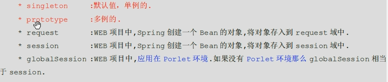

## 属性注入
创建对象时候，向类里面属性里面设置值
属性注入方式介绍（三种方式）：

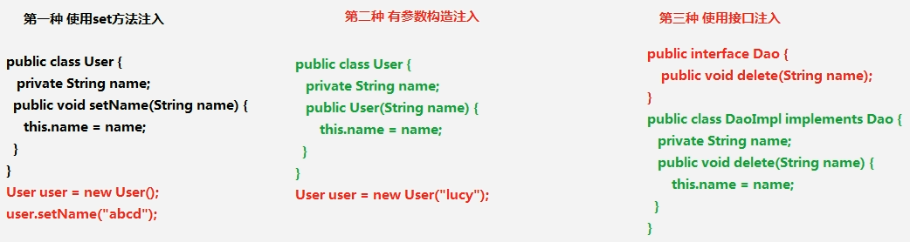

**在spring框架里面，支持前两种方式：**

* **set方法注入**

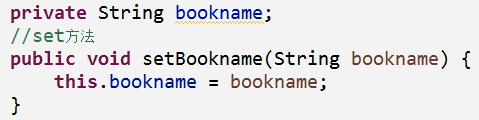

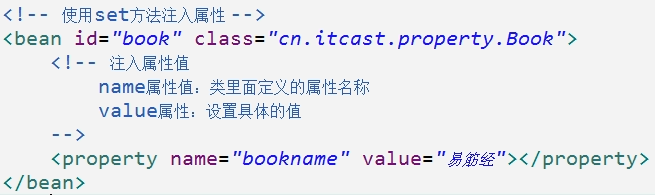

* 有参数构造注入

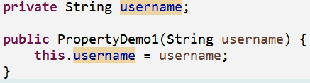

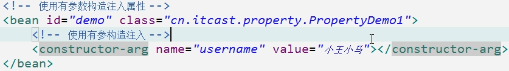

测试：

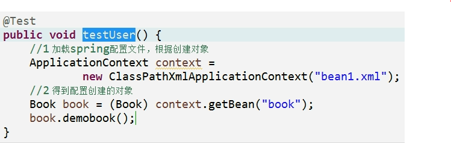

**注入对象类型属性**
创建service类和dao类：
在service得到dao对象
具体实现：
在service里面把dao作为类型属性
生成dao类型属性的set方法

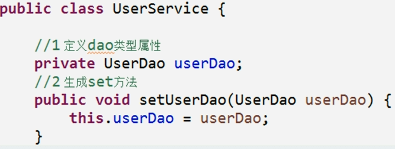

在配置文件中完成注入关系

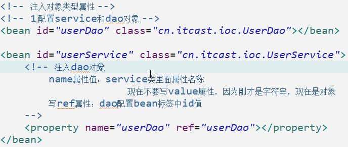

**P名称空间注入**

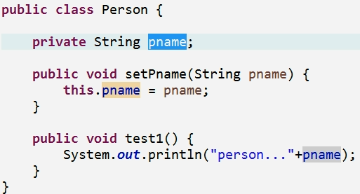

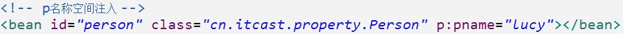

**复杂类型属性注入**

数组
list集合
map集合
properties类型

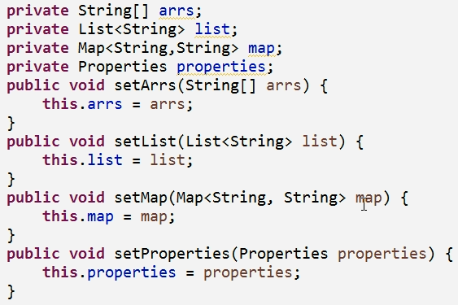

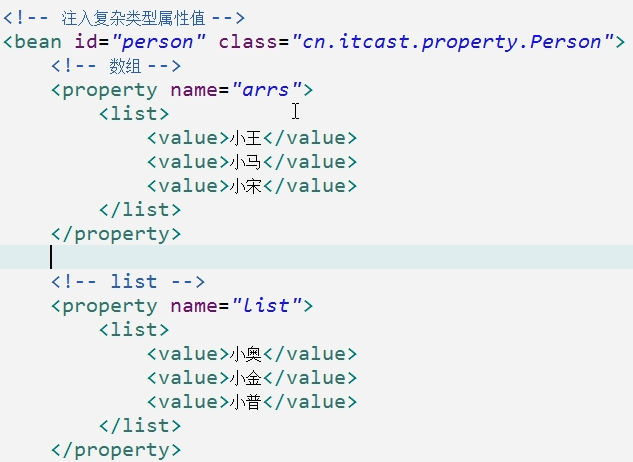

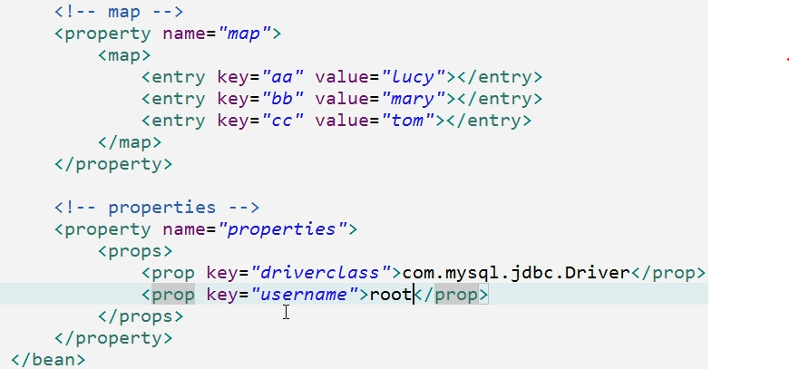

## IOC和DI区别
IOC：控制反转，把对象创建交给spring进行配置
DI：依赖注入，向类里面的属性中设置值

关系：依赖注入不能单独存在，需要在ioc基础之上完成操作

## Spring的bean管理（注解）
代码里面特殊的标记，使用注解可以完成功能
注解写法：@注解名称(属性名称=属性值)
注解使用在类上面，方法上面和属性上面

### Spring注解开发准备

导入jar包：导入基本jar包，导入aop的jar包
创建类，创建方法
创建spring配置文件，引入约束：
做spring的ioc注解开发，引入新约束

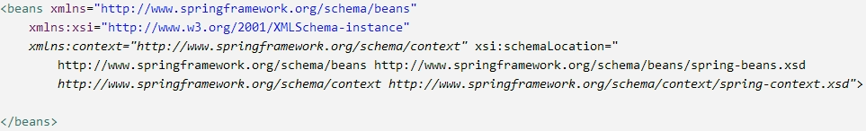

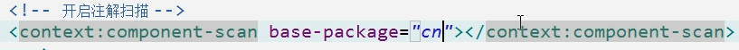

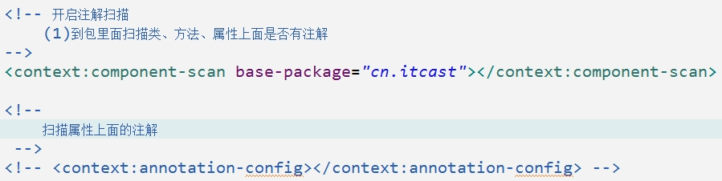

### 注解创建对象

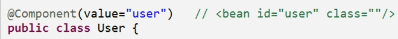

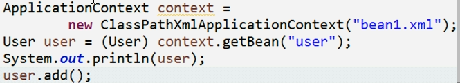

创建对象有四个注解：这四个注解功能是一样的，都创建对象

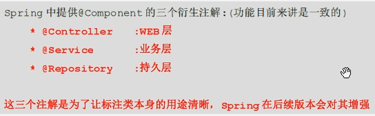

创建对象单实例、多实例：

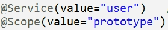

### 注解注入属性
创建service，创建dao，在service里得到dao对象
注入属性第一个注解：@Autowired，根据类名找属性
name属性值写注解创建dao对象value值

@Resource(name="userDao")

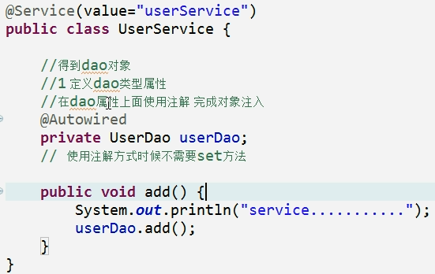

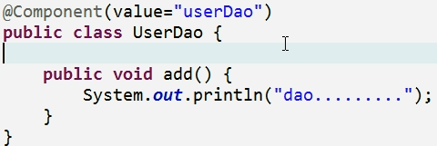

### 配置文件和注解混合使用
创建对象操作使用配置文件方式实现

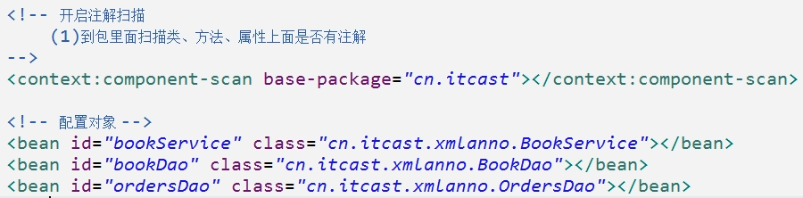

注入属性的操作使用注解方式实现

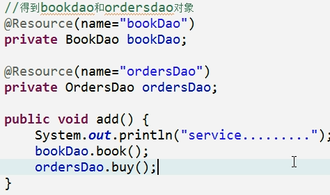

## AOP原理
AOP：面向切面（方面）编程，扩展功能不修改源代码实现
AOP采取横向抽取机制，取代了传统纵向继承体系重复性代码

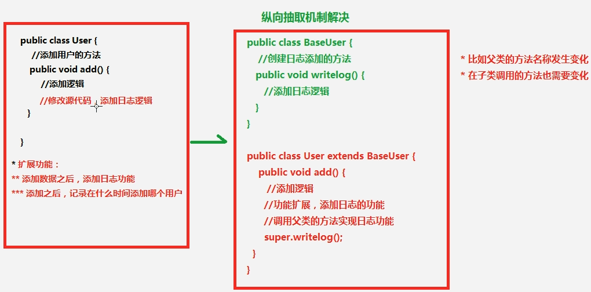

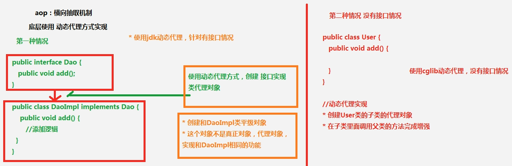

### AOP操作术语

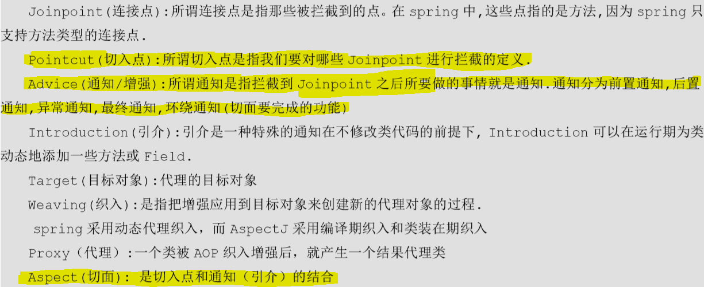

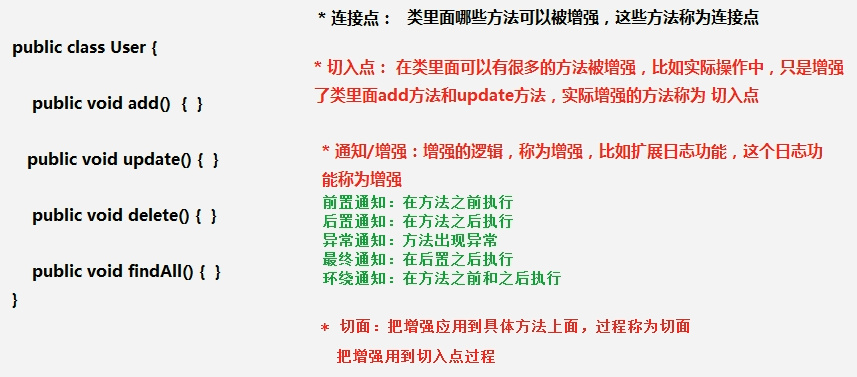

### Spring的AspectJ简介

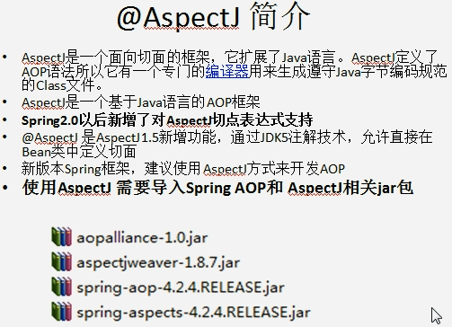

aspectJ不是spring一部分，而是和spring一起使用进行aop操作
spring2.0以后新增了对AspectJ支持
使用aspectJ实现aop有两种方式：
基于aspectj的xml配置
基于aspectj的注解方式

**AOP准备工作：**
除了导入基本的jar包之外，还需要导入aop相关的jar包
创建sprig核心配置文件，导入aop约束

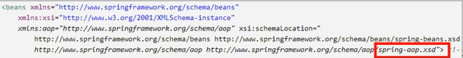

**使用表达式配置切入点：**

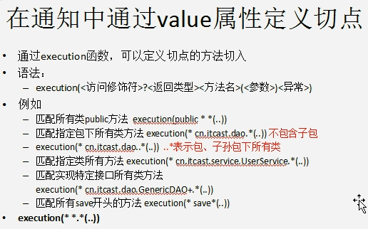

切入点：实际增强的方法
常用表达式：

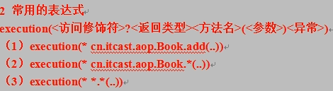

execution(<访问修饰符>?<返回类型><方法名>(<参数>)<异常>)
execution(* 增强方法的全路径)：

**aspectj的AOP操作：**

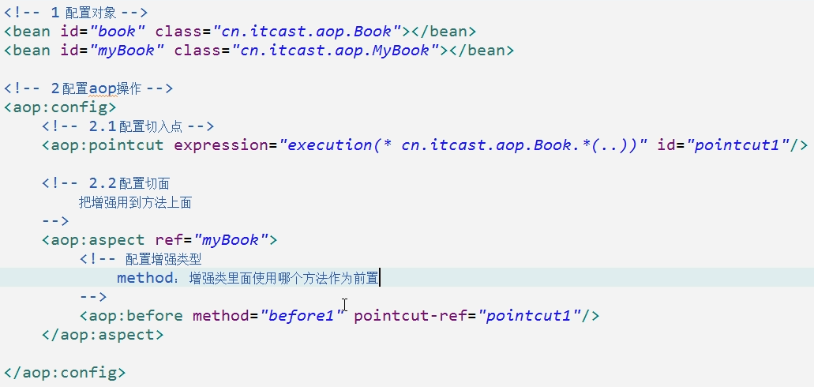

**aspectk的aop其他操作：**

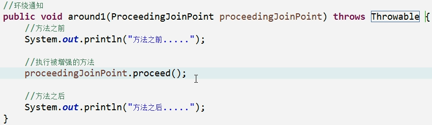

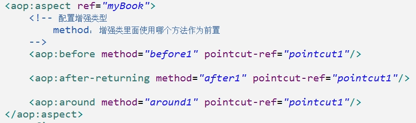

## log4j
通过log4j可以看到程序运行过程中更详细的信息
经常使用log4j查看日志
使用：
导入log4j的jar包
复制log4j的配置文件，复制到src下面

日志级别：info（基本信息）、debug（更详细信息）

## 基于aspectj的注解aop

**使用注解实现aop操作**

1. 第一步：创建对象：

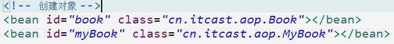

2. 第二步：在spring核心配置文件中，开启aop操作

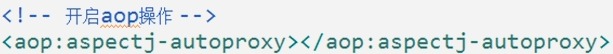

3. 第三步：在增强类上面使用注解完成aop操作

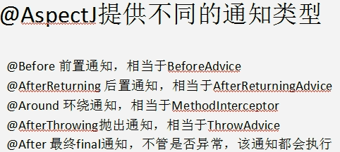

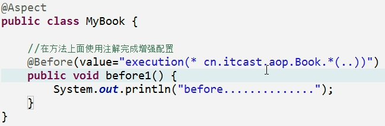

## Spring的jdbcTemplate操作
spring框架一站式框架
针对javaee三层，每一层都有解决技术
针对dao层，使用jdbcTemplate
spring对不同的持久化层技术都进行封装

jdbcTemplate对jdbc进行了封装
jdbcTemplate使用和dbutils使用很相似，都对数据库进行crud操作

### 增加
导入jdbcTemplate的jar包和数据库驱动jar包

创建对象，设置数据库信息
创建jdbcTemplate对象，设置数据源
调用jdbcTemplate对象里面的方法实现操作

### 修改

### 删除

### 查询

使用jdbcTemplate实现查询操作
dbutils：

#### 查询具体实现：

##### 第一个：查询返回某一个值

第一个参数是sql语句
第二个参数，返回类型的class

##### 第二个：查询返回对象

**JDBC实现：**

**jdbcTemplate实现：**

第一个参数是sql语句
第二个参数是RowMapper，是接口，类似于dbutils里面接口
第三个参数是可变参数

##### 第三个：查询返回list集合

## Spring配置c3p0连接池
第一步：导入jar包

第二步：创建spring配置文件，配置连接池

把代码在配置文件进行配置：

dao使用jdbcTemplate：
创建service和dao，配置service和dao对象，在service注入dao对象

创建jdbcTemplate对象，把模板对象注入到dao里面

在jdbcTemplate对象里面注入dataSource

## Spring的事务管理
spring事务管理两种方式：
第一种：编程式事务管理（不用）
第二种：声明式事务管理：
基于xml配置文件实现
基于注解实现

### spring事务管理的api介绍

spring针对不同的dao层框架，提供接口不同的实现类

配置事务管理器

### 搭建转账环境
创建数据库表，添加数据

创建service和dao类，完成注入关系：

service层又叫业务逻辑层

dao层，单独对数据库操作层，在dao层不添加业务

产生问题：如果小王少1000，出现异常，小马不会多1000，钱丢了
解决：添加事务解决，出现异常进行回滚操作

**声明式事务管理（xml配置）：**
配置文件方式使用aop思想配置

1. 第一步：配置事务管理器：

   

2. 第二步：配置事务增强：

   

3. 第三步：配置切面：

   

**声明式事务管理（注解）：**

1. 第一步：配置事务管理器

   

2. 第二步：配置事务注解

   

3. 第三步：在要使用事务的方法所在类上面添加注解

   

## Spring整合web项目原理
>1、加载spring核心配置文件：
>
>new对象，功能可以实现，效率很低
>2、实现思想：把加载配置文件和创建对象过程，在服务器启动时候完成
>3、实现原理：
>ServletContext对象
>监听器
>
>具体使用：
>在服务器启动时候，为每个项目创建一个ServletContext对象
>在ServletContext对象创建时候，使用监听器可以具体到ServletContext对象在什么时候创建
>使用监听器监听到ServletContext对象创建时候
>加载spring配置文件，把配置文件配置对象创建
>把创建出来的对象放到ServletContext域对象里面（setAttribute方法）
>获取对象时候，到ServletContext域得到getAttribute方法）

## Spring整合web项目

 演示问题：
 action调用service，service调用dao

每次访问action时候，都会加载spring配置文件
 解决方案：
 在服务器启动时候，创建对象加载配置文件
 底层使用监听器、ServletContext对象
 在spring里面不需要自己写代码实现，帮封装：
 封装了一个监听器，只需要配置监听器就可以了
 配置监听器之前，导入spring整合web项目jar包

 指定加载spring配置文件位置

