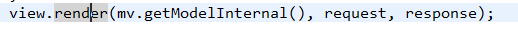
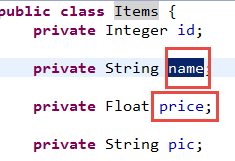
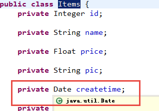
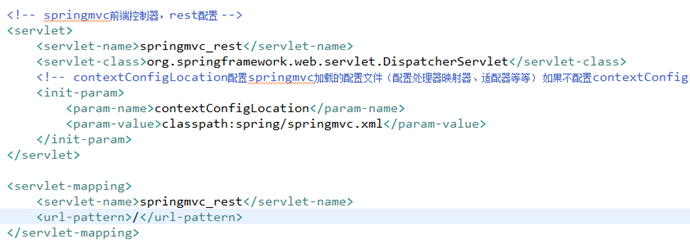

# SpringMVC

## 什么是springmvc

springmvc是spring框架的一个模块，springmvc和spring无需通过中间整合层进行整合。
springmvc是一个基于mvc的web框架。


## mvc在b/s系统下的应用

mvc是一个设计模式，mvc在b/s系统下的应用：


## springmvc框架


* 第一步：**发起请求到前端控制器(DispatcherServlet)**
* 第二步：**前端控制器请求HandlerMapping查找 Handler**
  * **可以根据xml配置、注解进行查找**
* 第三步：**处理器映射器HandlerMapping向前端控制器返回Handler**
* 第四步：**前端控制器调用处理器适配器去执行Handler**
* 第五步：**处理器适配器去执行Handler**
* 第六步：**Handler执行完成给适配器返回ModelAndView**
* 第七步：**处理器适配器向前端控制器返回ModelAndView**
  * **ModelAndView是springmvc框架的一个底层对象，包括 Model和view**
* 第八步：**前端控制器请求视图解析器去进行视图解析**
  * **根据逻辑视图名解析成真正的视图(jsp)**
* 第九步：**视图解析器向前端控制器返回View**
* 第十步：**前端控制器进行视图渲染**
  * **视图渲染将模型数据(在ModelAndView对象中)填充到request域**
* 第十一步：**前端控制器向用户响应结果** 

**组件：**

1. 前端控制器DispatcherServlet（不需要程序员开发）

   作用接收请求，响应结果，相当于转发器，中央处理器。

   有了DispatcherServlet减少了其它组件之间的耦合度。

2. 处理器映射器HandlerMapping(不需要程序员开发)

   作用：根据请求的url查找Handler

3. 处理器适配器HandlerAdapter

   作用：按照特定规则（HandlerAdapter要求的规则）去执行Handler

4. 处理器Handler(需要程序员开发)

   注意：编写Handler时按照HandlerAdapter的要求去做，这样适配器才可以去正确执行Handler


5. 视图解析器View resolver(不需要程序员开发)

   作用：进行视图解析，根据逻辑视图名解析成真正的视图（view）


6. 视图View(需要程序员开发jsp)

   View是一个接口，实现类支持不同的View类型（jsp、freemarker、pdf...）

## 入门程序

### 需求
以案例作为驱动。
springmvc和mybaits使用一个案例（商品订单管理）。
功能需求：商品列表查询

### 环境准备
数据库环境：mysql5.1

java环境：
jdk1.7.0_72
eclipse indigo
springmvc版本：spring3.2
需要spring3.2所有jar（一定包括spring-webmvc-3.2.0.RELEASE.jar）


### 配置前端控制器

在web.xml中配置前端控制器。


### 配置处理器适配器

在classpath下的springmvc.xml中配置处理器适配器

通过查看原代码：

此适配器能执行实现 Controller接口的Handler。


### 开发Handler

需要实现 controller接口，才能由org.springframework.web.servlet.mvc.SimpleControllerHandlerAdapter适配器执行。


### 视图编写


### 配置Handler
将编写Handler在spring容器加载


### 配置处理器映射器
在classpath下的springmvc.xml中配置处理器映射器


### 配置视图解析器
需要配置解析jsp的视图解析器。


### 部署调试
访问地址：http://localhost:8080/springmvcfirst1208/queryItems.action
处理器映射器根据url找不到Handler，报下边的错误。说明url错误。

处理器映射器根据url找到了Handler，转发的jsp页面找到，报下边的错误，说明jsp页面地址错误了


### 非注解的处理器映射器和适配器

#### 非注解的处理器映射器

处理器映射器：
org.springframework.web.servlet.handler.BeanNameUrlHandlerMapping
另一个映射器：
org.springframework.web.servlet.handler.SimpleUrlHandlerMapping

多个映射器可以并存，前端控制器判断url能让哪些映射器映射，就让正确的映射器处理。

#### 非注解的处理器适配器

org.springframework.web.servlet.mvc.SimpleControllerHandlerAdapter
要求编写的Handler实现 Controller接口。
org.springframework.web.servlet.mvc.HttpRequestHandlerAdapter
要求编写的Handler实现 HttpRequestHandler接口。


```java
  //使用此方法可以通过修改response，设置响应的数据格式，比如响应<u>json</u>数据
      /*
      esponse.setCharacterEncoding("<u>utf</u>-8");
      response.setContentType("application/json;charset=utf-8");
      response.getWriter().write("json串");
      */
```

### DispatcherServlet.properties


前端控制器从上边的文件中加载处理映射器、适配器、视图解析器等组件，如果不在springmvc.xml中配置，使用默认加载的。

### 注解的处理器映射器和适配器

在spring3.1之前使用org.springframework.web.servlet.mvc.annotation.DefaultAnnotationHandlerMapping注解映射器。
在spring3.1之后使用org.springframework.web.servlet.mvc.method.annotation.RequestMappingHandlerMapping注解映射器。
在spring3.1之前使用org.springframework.web.servlet.mvc.annotation.AnnotationMethodHandlerAdapter注解适配器。
在spring3.1之后使用org.springframework.web.servlet.mvc.method.annotation.RequestMappingHandlerAdapter注解适配器。

#### 配置注解映射器和适配器


#### 开发注解Handler

使用注解的映射器和注解的适配器。（注解的映射器和注解的适配器必须配对使用）


#### 在spring容器种加载Handler


#### 部署调试

访问：http://localhost:8080/springmvcfirst1208/queryItems.action

### 源码分析

通过前端控制器源码分析springmvc的执行过程。
第一步：前端控制器接收请求
调用doDiapatch

第二步：前端控制器调用处理器映射器查找 Handler


第三步：调用处理器适配器执行Handler，得到执行结果ModelAndView

第四步：视图渲染，将model数据填充到request域。
视图解析，得到view:

调用view的渲染方法，将model数据填充到request域
渲染方法：



###入门程序小结

通过入门程序理解springmvc前端控制器、处理器映射器、处理器适配器、视图解析器用法。
前端控制器配置：
第一种：*.action，访问以.action结尾 由DispatcherServlet进行解析
第二种：/，所以访问的地址都由DispatcherServlet进行解析，对于静态文件的解析需要配置不让DispatcherServlet进行解析
   使用此种方式可以实现 RESTful风格的<u>url</u>
处理器映射器：
非注解处理器映射器（了解）
注解的处理器映射器（掌握）
         对标记@Controller类中标识有@RequestMapping的方法进行映射。在@RequestMapping里边定义映射的url。使用注解的映射器不用在xml中配置url和Handler的映射关系。
处理器适配器：
非注解处理器适配器（了解）
注解的处理器适配器（掌握）
         注解处理器适配器和注解的处理器映射器是配对使用。理解为不能使用非注解映射器进行映射。
<mvc:annotation-driven></mvc:annotation-driven>可以代替下边的配置：

实际开发使用：mvc:annotation-driven
视图解析器配置前缀和后缀：

程序中不用指定前缀和后缀：


## SpringMVC和MyBatis整合

### 需求
使用springmvc和mybatis完成商品列表查询。

### 整合思路
springmvc+mybaits的系统架构：


* 第一步：整合dao层

  mybatis和spring整合，通过spring管理mapper接口。

  使用mapper的扫描器自动扫描mapper接口在spring中进行注册。


* 第二步：整合service层

  通过spring管理 service接口。

  使用配置方式将service接口配置在spring配置文件中。

  实现事务控制。


* 第三步：整合springmvc

  由于springmvc是spring的模块，不需要整合。

### 整合环境
数据库环境：mysql5.1

java环境：
jdk1.7.0_72
eclipse indigo
springmvc版本：spring3.2
所需要的jar包：
数据库驱动包：mysql5.1
mybatis的jar包
mybatis和spring整合包
log4j包
dbcp数据库连接池包
spring3.2所有jar包
jstl包
参考：
工程结构：

### 整合dao

mybatis和spring进行整合。

####  sqlMapConfig.xml

mybatis自己的配置文件。


#### applicationContext-dao.xml

配置：
数据源
SqlSessionFactory
mapper扫描器


#### 逆向工程生成po类及mapper（单表增删改查）


将生成的文件拷贝至工程中。

#### 手动定义商品查询mapper
针对综合查询mapper，一般情况会有关联查询，建议自定义mapper

#### ItemsMapperCustom.xml
sql语句：

```sql
SELECT * FROM items  WHERE items.name LIKE '%笔记本%
```


#### ItemsMapperCustom.java


### 整合service

让spring管理service接口。

#### 定义service接口


#### 在spring容器配置service（applicationContext-service.xml）

创建applicationContext-service.xml，文件中配置service。

```xml
<!--商品管理的service-->
<bean id="itemsService" class="cn.itcast.ssm.service.impl.ItemServiceImpl"/>
```

#### 事务控制（applicationContext-transaction.xml）

在applicationContext-transaction.xml中使用spring声明式事务控制方法。


### 整合springmvc

#### springmvc.xml

创建springmvc.xml文件，配置处理器映射器、适配器、视图解析器。


#### 配置前端控制器

#### 编写Controller（就是Handler）


#### 编写jsp


### 加载spring容器

将mapper、service、controller加载到spring容器中。

建议使用通配符加载上边的配置文件。
在web.xml中，添加spring容器监听器，加载spring容器。


## 注解开发

### 商品修改功能开发

#### 需求
操作流程：

1. 进入商品查询列表页面

2. 点击修改，进入商品修改页面，页面中显示了要修改的商品（从数据库查询）

   要修改的商品从数据库查询，根据商品id(主键)查询商品信息

3. 在商品修改页面，修改商品信息，修改后，点击提交

#### 开发mapper

**mapper：**
根据id查询商品信息
根据id更新Items表的数据
不用开发了，使用逆向工程生成的代码。

#### 开发service

**接口功能：**
根据id查询商品信息
修改商品信息


#### 开发controller
方法：
商品信息修改页面显示
商品信息修改提交

### @RequestMapping

* url映射
    * 定义controller方法对应的url，进行处理器映射使用。
* 窄化请求映射

    
* 限制http请求方法
    * 出于安全性考虑，对http的链接进行方法限制。
    * 如果限制请求为post方法，进行get请求，报错：

      

      

### controller方法的返回值

* 返回ModelAndView
    需要方法结束时，定义ModelAndView，将model和view分别进行设置。
* 返回string
    如果controller方法返回string

1. 表示返回逻辑视图名。

真正视图(jsp路径)=前缀+逻辑视图名+后缀


2. redirect重定向

商品修改提交后，重定向到商品查询列表。
redirect重定向特点：浏览器地址栏中的url会变化。修改提交的request数据无法传到重定向的地址。因为重定向后重新进行request（request无法共享）


3. forward页面转发

通过forward进行页面转发，浏览器地址栏url不变，request可以共享。


* 返回void

在controller方法形参上可以定义request和response，使用request或response指定响应结果：

1. 使用request转向页面，如下：

   request.getRequestDispatcher("页面路径").forward(request, response);


2. 也可以通过response页面重定向：

   response.sendRedirect("url")


3. 也可以通过response指定响应结果，例如响应json数据如下：

   response.setCharacterEncoding("utf-8");

   response.setContentType("application/json;charset=utf-8");

   response.getWriter().write("json串");

### 参数绑定
#### spring参数绑定过程
从客户端请求key/value数据，经过参数绑定，将key/value数据绑定到controller方法的形参上。
springmvc中，接收页面提交的数据是通过方法形参来接收。而不是在controller类定义成员变更接收！！！！


#### 默认支持的类型：
直接在controller方法形参上定义下边类型的对象，就可以使用这些对象。在参数绑定过程中，如果遇到下边类型直接进行绑定。
##### HttpServletRequest
通过request对象获取请求信息
##### HttpServletResponse
通过response处理响应信息
##### HttpSession
通过session对象得到session中存放的对象
##### Model/ModelMap
model是一个接口，modelMap是一个接口实现 。
作用：将model数据填充到request域。
#### 简单类型
通过@RequestParam对简单类型的参数进行绑定。
如果不使用@RequestParam，要求request传入参数名称和controller方法的形参名称一致，方可绑定成功。
如果使用@RequestParam，不用限制request传入参数名称和controller方法的形参名称一致。
通过required属性指定参数是否必须要传入，如果设置为true，没有传入参数，报下边错误：


#### pojo绑定
页面中input的name和controller的pojo形参中的属性名称一致，将页面中数据绑定到pojo。
页面定义：

controller的pojo形参的定义：

#### 自定义参数绑定实现日期类型绑定
对于controller形参中pojo对象，如果属性中有日期类型，需要自定义参数绑定。
将请求日期数据串传成 日期类型，要转换的日期类型和pojo中日期属性的类型保持一致。

所以自定义参数绑定将日期串转成java.util.Date类型。
需要向处理器适配器中注入自定义的参数绑定组件。
##### 自定义日期类型绑定

##### 配置方式

```xml
<mvc:annotation-driven conversion-service="conversionService"></mvc:annotation-driven>
```


##### 配置方式2


### springmvc和struts2的区别
1. springmvc基于方法开发的，struts2基于类开发的。

   springmvc将url和controller方法映射。映射成功后springmvc生成一个Handler对象，对象中只包括了一个method。
   方法执行结束，形参数据销毁。
   springmvc的controller开发类似service开发。

2. springmvc可以进行单例开发，并且建议使用单例开发，struts2通过类的成员变量接收参数，无法使用单例，只能使用多例。

3. 经过实际测试，struts2速度慢，在于使用struts标签，如果使用struts建议使用jstl。

### 问题
#### post乱码
在web.xml添加post乱码filter
在web.xml中加入

以上可以解决post请求乱码问题。
对于get请求中文参数出现乱码解决方法有两个：
修改tomcat配置文件添加编码与工程编码一致，如下：

另外一种方法对参数进行重新编码：
ISO8859-1是tomcat默认编码，需要将tomcat编码后的内容按utf-8编码

### 包装类型pojo参数绑定
#### 需求

商品查询controller方法中实现商品查询条件传入

#### 实现方法
第一种方法：在形参中 添加HttpServletRequest request参数，通过request接收查询条件参数。
第二种方法：在形参中让包装类型的pojo接收查询条件参数。

**分析：**

* 页面传参数的特点：复杂，多样性。条件包括 ：用户账号、商品编号、订单信息。。。
* 如果将用户账号、商品编号、订单信息等放在简单pojo（属性是简单类型）中，pojo类属性比较多，比较乱。
* 建议使用包装类型的pojo，pojo中属性是pojo。

#### 页面参数和controller方法形参定义

**页面参数：**

商品名称：`<input name="itemsCustom.name" />`
注意：itemsCustom和包装pojo中的属性一致即可。

**controller方法形参：**

```java
 public ModelAndView queryItems(HttpServletRequest request,
                                ItemsQueryVo itemsQueryVo) throws Exception

```


### 集合类型绑定
#### 数组绑定
##### 需求
商品批量删除，用户在页面选择多个商品，批量删除。
##### 表现层实现
关键：将页面选择(多选)的商品id，传到controller方法的形参，方法形参使用数组接收页面请求的多个商品id。
controller方法定义：

页面定义：

#### list绑定
##### 需求
通常在需要批量提交数据时，将提交的数据绑定到`list<pojo>`中，比如：成绩录入（录入多门课成绩，批量提交），
本例子需求：批量商品修改，在页面输入多个商品信息，将多个商品信息提交到controller方法中。
##### 表现层实现
controller方法定义：

1. 进入批量商品修改页面(页面样式参考商品列表实现)

         2. 批量修改商品提交

            使用List接收页面提交的批量数据，通过包装pojo接收，在包装pojo中定义`list<pojo>`属性


页面定义：


#### map绑定
也通过在包装pojo中定义map类型属性。
在包装类中定义Map对象，并添加get/set方法，action使用包装对象接收。
包装类中定义Map对象如下：

页面定义如下：

Contrller方法定义如下：

### springmvc校验
#### 校验理解
项目中，通常使用较多是前端的校验，比如页面中js校验。对于安全要求较高点建议在服务端进行校验。
**服务端校验：**

* 控制层conroller：校验页面请求的参数的合法性。在服务端控制层conroller校验，不区分客户端类型（浏览器、手机客户端、远程调用）
* 业务层service（使用较多）：主要校验关键业务参数，仅限于service接口中使用的参数。
* 持久层dao：一般是不校验的。

#### springmvc校验需求
springmvc使用hibernate的校验框架validation(和hibernate没有任何关系)。
校验思路：

* 页面提交请求的参数，请求到controller方法中，使用validation进行校验。如果校验出错，将错误信息展示到页面。

具体需求：

* 商品修改，添加校验（校验商品名称长度，生产日期的非空校验），如果校验出错，在商品修改页面显示错误信息。

#### 环境准备
hibernate的校验框架validation所需要jar包：

#### 配置校验器

#### 校验器注入到处理器适配器中

#### 在pojo种添加校验规则
在ItemsCustom.java中添加校验规则：

#### CustomValidationMessages.properties
在CustomValidationMessages.properties配置校验错误信息：

#### 捕获校验错误信息

//在需要校验的<u>pojo</u>前边添加@Validated，在需要校验的<u>pojo</u>后边添加BindingResult bindingResult接收校验出错信息
//注意：@Validated和BindingResult bindingResult是配对出现，并且形参顺序是固定的（一前一后）。
#### 在页面显示校验错误信息
在controller中将错误信息传到页面即可。

页面显示错误信息：

#### 分组校验
##### 需求
在pojo中定义校验规则，而pojo是被多个 controller所共用，当不同的controller方法对同一个pojo进行校验，但是每个controller方法需要不同的校验。
解决方法：
定义多个校验分组（其实是一个java接口），分组中定义有哪些规则
每个controller方法使用不同的校验分组
##### 校验分组

##### 在校验规则种添加分组

##### 在controller方法使用指定分组的校验

### 数据回显
#### 什么是数据回显
提交后，如果出现错误，将刚才提交的数据回显到刚才的提交页面。
#### pojo数据回显方法
1、springmvc默认对pojo数据进行回显。
pojo数据传入controller方法后，springmvc自动将pojo数据放到request域，key等于pojo类型（首字母小写）
使用@ModelAttribute指定pojo回显到页面在request中的key
2、@ModelAttribute还可以将方法的返回值传到页面
在商品查询列表页面，通过商品类型查询商品信息。
在controller中定义商品类型查询方法，最终将商品类型传到页面。

页面上可以得到itemTypes数据。

3、使用最简单方法使用model，可以不用@ModelAttribute

#### 简单类型数据回显
使用最简单方法使用model。
model.addAttribute("id", id);

### 异常处理
#### 异常处理思路
系统中异常包括两类：预期异常和运行时异常RuntimeException，前者通过捕获异常从而获取异常信息，后者主要通过规范代码开发、测试通过手段减少运行时异常的发生。
系统的dao、service、controller出现都通过throws Exception向上抛出，最后由springmvc前端控制器交由异常处理器进行异常处理，如下图：

springmvc提供全局异常处理器（一个系统只有一个异常处理器）进行统一异常处理。
#### 自定义异常类
对不同的异常类型定义异常类，继承Exception。

#### 全局异常处理器
**思路：**
系统遇到异常，在程序中手动抛出，dao抛给service、service给controller、controller抛给前端控制器，前端控制器调用全局异常处理器。
**全局异常处理器处理思路：**
解析出异常类型

* 如果该异常类型是系统 自定义的异常，直接取出异常信息，在错误页面展示
* 如果该异常类型不是系统 自定义的异常，构造一个自定义的异常类型（信息为“未知错误”）

springmvc提供一个HandlerExceptionResolver接口

#### 错误页面

#### 在springmvc.xml配置全局异常处理器

#### 异常测试
在controller、service、dao中任意一处需要手动抛出异常。
如果是程序中手动抛出的异常，在错误页面中显示自定义的异常信息，如果不是手动抛出异常说明是一个运行时异常，在错误页面只显示“未知错误”。
在商品修改的controller方法中抛出异常 .

在service接口中抛出异常：

如果与业务功能相关的异常，建议在service中抛出异常。
与业务功能没有关系的异常，建议在controller中抛出。
上边的功能，建议在service中抛出异常。

### 上传图片
#### 需求
在修改商品页面，添加上传商品图片功能。
#### springmvc中对多部件类型解析
在 页面form中提交enctype="multipart/form-data"的数据时，需要springmvc对multipart类型的数据进行解析。
在springmvc.xml中配置multipart类型解析器。

#### 加入上传图片的jar
上边的解析内部使用下边的jar进行图片上传。

#### 创建图片虚拟目录存储图片
通过图形界面配置：

也可以直接修改tomcat的配置：
在conf/server.xml文件，添加虚拟 目录 ：

注意：在图片虚拟目录 中，一定将图片目录分级创建（提高i/o性能），一般我们采用按日期(年、月、日)进行分级创建。
#### 上传图片代码
##### 页面

##### controller方法
修改：商品修改controller方法：


### json数据交互
#### 为什么要进行json数据交互
json数据格式在接口调用中、html页面中较常用，json格式比较简单，解析还比较方便。
比如：webservice接口，传输json数据.
#### springmvc进行json交互


1. 请求json、输出json，要求请求的是json串，所以在前端页面中需要将请求的内容转成json，不太方便。
2. 请求key/value、输出json。此方法比较常用。

#### 环境准备
##### 加载json转的jar包
springmvc中使用jackson的包进行json转换（@requestBody和@responseBody使用下边的包进行json转），如下：

##### 配置json转换器
在注解适配器中加入messageConverters

注意：如果使用`<mvc:annotation-driven /> `则不用定义上边的内容。
#### json交互测试
##### 输入json串，输出是json串
###### json页面
使用jquery的ajax提交json串，对输出的json结果进行解析。

###### controller

###### 测试结果

##### 输入key/value，输出是json串
###### jsp页面
使用jquery的ajax提交key/value串，对输出的json结果进行解析。

###### controller

###### 测试结果


### RESTful支持
#### 什么是RESTful
RESTful架构，就是目前最流行的一种互联网软件架构。它结构清晰、符合标准、易于理解、扩展方便，所以正得到越来越多网站的采用。
RESTful（即Representational State Transfer的缩写）其实是一个开发理念，是对http的很好的诠释。

1. 对url进行规范，写RESTful格式的url

   非REST的url：http://...../queryItems.action?id=001&type=T01

   REST的url风格：http://..../items/001

   ​	特点：url简洁，将参数通过url传到服务端

2. http的方法规范

   不管是删除、添加、更新。。使用url是一致的，如果进行删除，需要设置http的方法为delete，同理添加。。。

   后台controller方法：判断http方法，如果是delete执行删除，如果是post执行添加。

3. 对http的contentType规范

   请求时指定contentType，要json数据，设置成json格式的type。。

#### REST的例子
##### 需求
查询商品信息，返回json数据。
##### controller
定义方法，进行url映射使用REST风格的url，将查询商品信息的id传入controller .
输出json使用@ResponseBody将java对象输出json。

@RequestMapping(value="/ itemsView/{id}")：{×××}占位符，请求的URL可以是“/viewItems/1”或“/viewItems/2”，通过在方法中使用@PathVariable获取{×××}中的×××变量。
@PathVariable用于将请求URL中的模板变量映射到功能处理方法的参数上。
如果RequestMapping中表示为"/ itemsView /{id}"，id和形参名称一致，@PathVariable不用指定名称。
##### REST方法的前端控制器配置
在web.xml配置：

#### 对静态资源的解析
配置前端控制器的url-parttern中指定/，对静态资源的解析出现问题：

在springmvc.xml中添加静态资源解析方法。


### 拦截器
#### 拦截定义
定义拦截器，实现HandlerInterceptor接口。接口中提供三个方法。

#### 拦截器配置
##### 针对HandlerMapping配置
springmvc拦截器针对HandlerMapping进行拦截设置，如果在某个HandlerMapping中配置拦截，经过该 HandlerMapping映射成功的handler最终使用该 拦截器。

##### 类似全局的拦截器
springmvc配置类似全局的拦截器，springmvc框架将配置的类似全局的拦截器注入到每个HandlerMapping中。

#### 拦截器测试
##### 测试需求
测试多个拦截器各各方法执行时机。
##### 编写两个拦截

##### 两个拦截器都放行

总结：
preHandle方法按顺序执行，
postHandle和afterCompletion按拦截器配置的逆向顺序执行。
##### 拦截器1放行，拦截器2不放行

##### 拦截器1不放行，拦截器2不放行

##### 小结
根据测试结果，对拦截器应用。
比如：统一日志处理拦截器，需要该 拦截器preHandle一定要放行，且将它放在拦截器链接中第一个位置。
比如：登陆认证拦截器，放在拦截器链接中第一个位置。权限校验拦截器，放在登陆认证拦截器之后。（因为登陆通过后才校验权限）
#### 拦截器应用（实现登录认证）
##### 需求
1. 用户请求url

2. 拦截器进行拦截校验

   如果请求的url是公开地址（无需登陆即可访问的url），让放行
   如果用户session 不存在跳转到登陆页面
   如果用户session存在放行，继续操作。

##### 登录controller方法

##### 登录认证拦截实现
###### 代码实现

###### 拦截器配置
