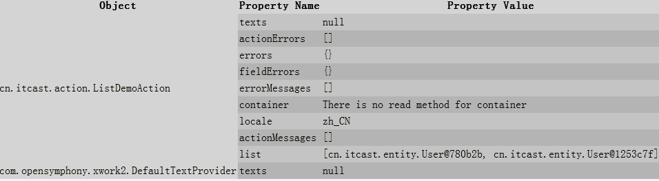
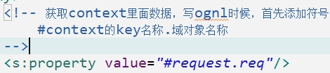

# Struts2

> 软件=应用组件+业务组件
> 应用组件可以写成框架，框架开发方便很多，是半成品的软件。
> 框架的性能问题：低

Struts2框架：Struts2=WebWork+Struts名字+杂七杂八
MVC框架：(jsp+servlet)+service+dao
Struts1和Struts2没关系
WebWork内核是XWork
**Struts2版本：2.3.24
**Web层常见框架：** struts2、springMVC

## Struts简单模型

## Struts2搭建

**Struts2搭建流程**

1. 下载Struts2jar包

2. 创建空项目

3. 导包：lib中有jar包，不是都用的上；在apps目录里面，找到示例程序，从示例程序复制jar包：blank.war

4. 配置核心控制器

   

5. 添加struts配置文件：在src目录下创建struts.xml

   

6. 创建start.jsp

   

7. 写一个Action类：每次访问action，默认执行名称execute方法

   

8. 配置文件src下面：struts.xml：

   

   ​

9. 补充：添加结果的配置

   

10. 引入dtd约束

11. 在Action中添加返回值

    

12. http://localhost:8080/项目名/xxx.action

## Struts2基本执行过程

过滤器在服务器创建时候创建，创建过滤器时候执行init方法

在init方法中加载配置文件

包含自己创建的配置文件和struts2自带配置文件：struts.xml、web.xml

## Struts2配置

struts2位置与名称是固定的

根标签：struts

### 在配置文件中主要三个标签

#### package

**类似于代码包，区分不同的action，要配置action，必须先写package，再写action**

package标签属性：

* name属性：
  * name属性属性值跟功能本身没有关系
  * 在一个配置文件可以写多个package标签，name属性值不能相同
* extends属性：
  * 属性值是固定的：extends="struts-default"
  * 写了这个属性之后，在package里面配置的类具有action功能
* namespace属性：
  * namespace属性值和action标签里的name属性值构成访问路径，可以不写，默认是"/"

#### action

**action标签配置action访问路径**

action标签属性：

* name属性：
  * namespace属性值和action标签里的name属性值构成访问路径
  * 在package标签里写多个action标签，但action的name属性值不能相同的
* class属性：
  * action的全路径
* method：
  * 比如在action里面默认执行execute方法，但是在action里面写其他的方法
  * 让action里面多个方法执行，使用method进行配置

#### result

**根本action的方法返回值，配置到不同的路径里面**

* name属性：
  * 和方法返回值一样
* type属性：
  * 配置如何到路径中（转发或重定向）
  * 默认做的转发操作

### 修改struts2默认常量值

**常用方式：**

在struts.xml中进行配置：

struts.properties进行修改
web.xml进行配置
**最常用常量：**

表单提交数据到action里面，在action可以获取表单提交数据

**表单提交数据有中文，乱码问题：**

* POST提交直接设置编码
* GET提交做编码转换

如果在action获取表单通过post方式提交中文，中文乱码问题帮解决了，不需要自己处理问题

## 分模块开发

单独写配置文件，把配置文件引入到核心配置为文件中

## Action的编写方式

**action编写有三种方法：**

* 第一种：创建普通类，这个不继承任何类，不实现任何接口
* 第二种：创建类，实现接口Action
* **第三种：创建类，继承类ActionSupport**

## Action方法访问介绍

三种方式实现

* **第一种：使用action标签的method属性，在这个属性里面写执行的action方法**
* **第二种：使用通配符方式实现**
* 第三种：动态访问实现（不用）

如果action方法有返回值，在配置文件中没有配置，出现错误：404
action里面的方法有返回值，如果有返回值时候类型必须是String
action里面的方法可以没有返回值， 没有返回值的时候，在result标签不需要配置：
把方法写出void
让返回值，返回"none"

### 使用method属性

缺陷：action每个方法都需要配置，如果action里面有多个方法，配置很多的action  

### 使用通配符实现

在action标签里面name属性，name属性里面写上* 号：理解：可以匹配任意内容

### 全局结果页面

result标签配置action方法的返回值到不同的页面
如果多个action，方法里面返回值相同的，到页面也是相同的，这个时候可以使用全局页面配置
在package标签里面进行配置：只生效于当前package

### 局部结果页面

配置了全局，也配置了局部，最终以局部为准

**Result标签的type属性：**
result标签里面除了name属性之外，还有一个属性type属性
type属性：如何到路径里面（转发还是重定向）
type属性值：
默认值：做转发操作，值是dispatcher

做重定向操作，值是redirect

dispatcher、redirect这两个值一般针对到页面中配置，配置到其他的action里面：
chain：转发到action，一般不用，缓存问题
redirectAction：重定向到action（写action访问名称）

## 使用ActionContext获取表单数据

之前web阶段，提交表单到servlet里面，在servlet里面使用request对象里面的方法获取，getParameter，getParameterMap方法。
提交表单到action，但是action没有request对象，不能直接使用request对象
action获取表单提交数据主要三种方式

1. **使用ActionContext类、**

   **方法：**

   

   因为方法不是静态方法，需要创建ActionContext类的对象

   这个ActionContext类对象不是new出来的

   

   **演示：**

   创建表单，提交表单到action里面

   在action使用ActionContext获取数据

   

2. **使用ServletActionContext类**

   

   调用类里的静态方法，得到request对象

   

3. 使用接口注入方式（一般不用）

   让action实现接口，得到request对象

   

   

## 在Action操作域对象

request、session、servletContext对象

### Struts2封装获取表单数据方式

**原始方式获取表单封装到实体对象：**
使用ServletActionContext获取表单数据封装到实体类对象里面

**Struts2提供的封装方式：**

#### **属性封装：**

直接把表单提交属性封装到action的属性里面
**实现步骤：**

1. 在action成员变量位置定义变量
2. 变量名称和表单输入项的name属性值一样
3. 生成变量的set方法（set和get方法都写出来）

使用属性封装获取表单数据到属性里面，不能把数据直接封装到实体类对象里面

#### **模型驱动封装：**

使用模型驱动方式，可以直接把表单数据封装到实体类对象里面
前提要求：表单输入项name属性值和实体类属性名称一样
**实现步骤：**

1. action实现接口ModelDriven

   

2. 实现接口里面的方法，getModel方法。把创建对象返回

3. 在action里面创建实体类对象

   

使用模型驱动和属性封装注意问题：

在一个action中，获取表单数据可以属性封装，使用模型驱动封装，不能同时使用属性封装和模型驱动封装获取同一表单数据，如果同时使用，只执行模型驱动

#### 表达式封装：（会用）

实现过程：

使用表达式封装可以把表单数据封装到实体类对象里面

1. 第一步：在action里面声明实体类
2. 第二步：生成实体类变量的set和get方法

3. 第三步：在表单输入项的name属性值里面写表达式形式

   

#### 比较表达式封装和模型驱动封装

使用表达式封装和模型驱动封装都可以把数据封装到实体类对象里面
不同点：

* 使用模型驱动只能把数据封装到一个实体类里面
* 在一个action里面不能使用模型驱动把数据封装到不同的实体类对象里面
* 使用表达式封装可以把数据封装到不同的实体类里面

### 封装数据到集合

#### **封装数据到list集合：**

1. 第一步：在action声明List

2. 第二步：生成list变量的set和get方法

   

3. 第三步：在表单输入项里面写表达式

   

#### **封装到Map集合：**

1. 第一步：声明map集合

2. 第二步：生成get和set方法

   

3. 第三步：在表单输入项的name属性值里面写表达式

   

## OGNL表达式

EL表达式在jsp中获取域对象里面的值
OGNL表达式：在struts2里面操作值栈数据，一般把ognl在struts2操作：和struts2标签一起使用操作值栈

使用OGNL时候先导入jar包，struts2有jar包

导入标签库：

## 值栈

web阶段，在servlet里面进行操作，把数据放到域对象里面，在页面中使用el表达式获取到，域对象在一定范围内，存值和取值
struts2里面提供本身一种存储机制，类似于域对象，是值栈，可以存值和取值
在action里面把数据放到值栈里面，在页面中获取到值栈数据
**servlet和action区别：**

* servlet：默认在第一次访问时候创建，创建一次
* action：访问时候创建，每次访问action时候，都会创建action对象，创建多次，多实例对象

**值栈存储位置：**

* 每次访问action时候，都会创建action对象
* 在每个action对象里面只会有一个值栈对象

### 获取值栈对象

获取值栈对象有多种方式:
**（常用方法）使用ActionContext类里面的方法得到值栈对象**

### 值栈的内部结构

 值栈分为两部分：

*  第一部分：root，结构是list集合

  *  一般操作都是root里面数据

*  第二部分：context，结构是map集合

  

struts2里面的标签：s:debug，使用这个标签可以查看值栈结构和存储值
访问action，执行action的方法有返回值，配置返回值到jsp页面中，在jsp页面中使用debug这个标签

在action没有任何操作，栈顶元素是

 action对象里面有值栈对象
 值栈对象里面有action引用

### 向值栈中放数据

向值栈放数据多种方式：

* 第一种：获取值栈对象，调用值栈对象里面的set方法

  

  

* 第二种：获取值栈对象，调用值栈对象里面的push方法

  

  

* **第三种：在action定义变量，生成变量的get方法**

  

  

  

### 向值栈放对象

实现步骤：

1. 第一步：定义对象变量
2. 第二步：生成变量的get方法
3. 第三步：在执行的方法里面向对象中设置值

### 向值栈放list集合

1. 第一步：定义list集合变量
2. 第二步：生成变量的get方法
3. 第三步：在执行的方法里面向list集合设置值

### 从值栈获取数据

使用struts2的标签+ognl表达式获取值栈数据

`<s:property value="ognl表达式"/>`

**获取字符串：**

1.  第一步：向值栈中放入数据

   

2.  第二步：在jsp使用struts2标签+ognl表达式获取

   

 **获取list集合：**

* 第一种方式：

  

* 第二种方式：

  

* 第三种方式：

  

### 获取set和push方法设置值

 **使用set方法向值栈放数据，获取**

 **使用push方法向值栈放数据，获取**

使用push方法设置值，没有名称，只有设置的值
 向值栈放数据，把向值栈放数据存到数组里面，数组名称top，根据数组获取值

### el表达式为什么获取值栈数据

EL表达式可以获取值栈数据（为什么）：性能不好
EL表达式获取域对象值
向域对象里面放值使用setAttribute方法，获取值使用getAttribute方法
底层增强request对象里面的方法getAttribute方法：
首先从request域获取值，如果获取到，直接返回
如果从request域获取不到值，到值栈中把值获取出来，把值放到域对象里面
查看源代码：

### OGNL的#、%使用

使用#获取context里面数据
向request域放值

在页面中使用ognl获取

 **%使用：**

在struts2标签中表单标签

在struts2标签里面使用ognl表达式，如果直接在struts2表单标签里面使用ognl表达式不识别，只有%之后才会识别

## 拦截器

struts2是框架，封装了很多功能。struts2里面封装的功能都是在拦截器里面
struts2里面封装了很多功能，有很多拦截器，不是每次这些拦截器都执行，每次执行默认的拦截器
struts2默认拦截器

**拦截器在什么时候执行？**
在action对象创建之后，action的方法执行之前

### 拦截器底层原理

拦截器底层使用两个原理
**aop思想**
文字描述：

> AOP是面向切面（方面）编程，有基本功能，扩展功能，不通过修改源代码方式扩展功能 （底层：动态代理）

画图分析：

**责任链模式**
在java中有很多设计模式，责任链模式是其中的一种
责任链模式和过滤链很相似
责任链模式：

> 要执行多个操作，有添加、修改、删除三个操作
>
> 首先执行添加操作，添加操作执行之后做类似于放行操作，执行修改操作，修改操作执行之后做类似于放行操作，执行删除操作

过滤链：一个请求可以有多个过滤器进行过滤，每个过滤器只有做放行才能到下一个过滤器

**aop思想和责任链模式如何应用到拦截器里面？**
文字描述：

> 拦截器在action对象创建之后，action方法执行之前执行
>
> 在action方法执行之前执行默认拦截器，执行过程使用aop思想，在action并没有直接调用拦截器方法，而是使用配置文件方式进行操作
>
> 执行拦截器时候，执行很多的拦截器，这个过程使用责任链模式
>
> 假如执行三个拦截器，执行拦截器1，执行拦截器1之后做放行操作，执行拦截器2，执行拦截器2之后做放行，执行拦截器3，执行拦截器3之后放行，执行action方法

画图分析

查看源代码：
执行action

创建action对象，使用后动态代理方式

执行action的方法

执行很多的拦截器，遍历执行

类似于放行的操作方法

### 过滤器和拦截器的区别

过滤器：过滤器理论上可以过滤任意内容，比如html、jsp、servlet、图片路径
拦截器：拦截器只可以拦截action

### 自定义拦截器
在struts2里面有很多的拦截器，这些拦截器是struts2封装的功能，但是在实际开发中，struts2里面的拦截器中可以没有要使用的功能，这个时候需要自己写拦截器实现功能

**拦截器结构：**
查看源代码看拦截器结构：

继承类:

在接口里面有三个方法：

初始化方法:

销毁：

拦截逻辑的操作：

开发中建议：
写类，继承MethodFilterInterceptor实现
让action里面的某个方法不进行拦截
让拦截器和action有关系
不是在action调用拦截器的方法，而是用过配置文件方式让建立关系

### 自定义登录拦截器

### struts2标签

**表单标签：**

