# Maven

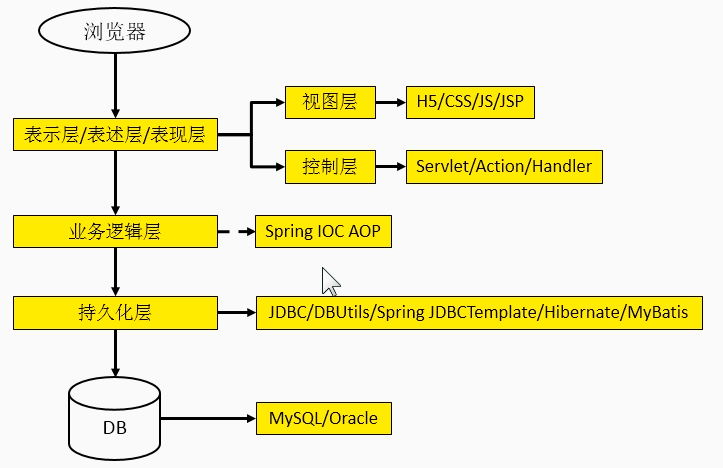

## 目前的技术在开发中存在的问题

* **一个项目就是一个工程**
    * 一个项目如果非常庞大，就不适合用package来划分模块，最好是每一个模块对应一个工程
    * 借助于Maven就可以将一个项目拆分成多个工程
* **项目中需要的jar包必须手动"复制"、"粘贴"到WEB-INF/lib目录下**
    * 带来的问题：同样的jar包文件重复出现在不同的项目工程中，一方面浪费存储空间，另外让工程比较臃肿
    * 借助Maven，可以将jar包仅仅保存在"仓库中"，有需要使用的工程"引用"这个文件接口，并不需要真的把jar包复制过来
* **jar包需要别人替我们准备好，或者到官网下载**
    * 不同技术的官网提供jar包下载的形式是五花八门的
    * 有些技术的官网就是通过Maven或SVN等专门的工具来提供下载的
    * 如果以不规范的方式下载的jar包，那么卡中的内容很可能也是不规范的
    * 借助于Maven可以以一种规范的方式下载jar包，因为所有知名框架或第三方工具的jar包以及按照统一的规范放在了Maven的中央仓库的，以规范的方式下载的jar包，内容也是可靠的
    * "统一的规范"不仅是对IT开发领域非常重要，对于整个人类社会都是非常重要的
* **一个jar包依赖的其他jar包需要自己手动加入到项目中**
    * FileUpload组件 -> IO组件。commons-fileupload-1.3.jar依赖于commons-io-2.0.1.jar
    * 如果所有的jar包之间的依赖关系都需要程序员自己非常清楚了解，那么就会增大学习成本
    * Maven会自动将依赖的jar包导入出来

## Maven是什么？

* **Maven是一款服务于java平台的自动化构建工具**
    *     Make->Ant-Maven->Gradle
* **构建**
    * 概念：以java源文件、框架配置文件、JSP、HTML、图片等资源为原材料去生产一个可以运行的项目的过程
        * 编译
        * 部署
        * 构建

    * 编译：java源文件->编译->Class字节码文件->交给JVM去执行

    * 部署：一个BS项目最终运行的并不是动态Web工程本身，而是这个动态Web工程编译得结果
        * 动态Web工程-->编译、部署-->编译结果

    * 运行时环境

        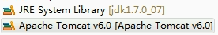

    * 其实是一组jar包的引用，并没有把jar包本身复制到工程中，所以并不是目录

        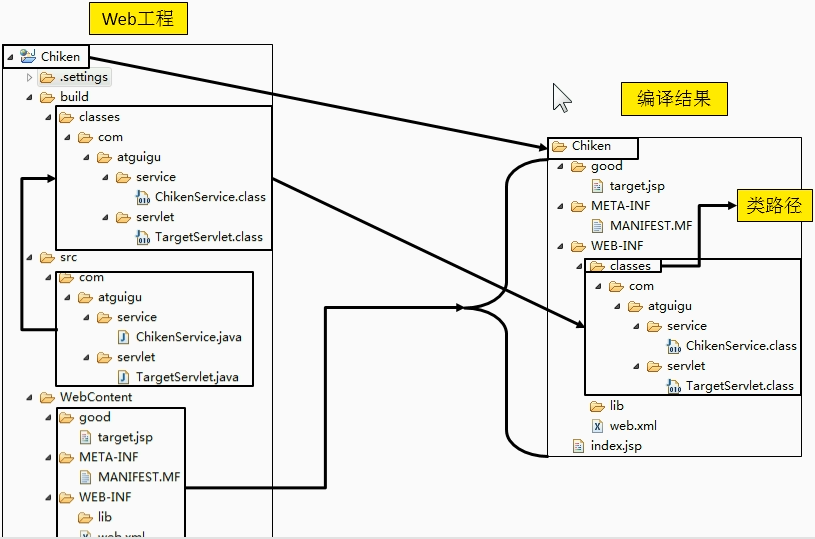

    * 开发过程中，所有的路径或配置文件中的配置的类路径等都是以编译结果的目录结构为标准的


* **构建过程中的各个环节**
    * 清理：将以前编译得到的旧的class字节码文件删除，为下一次编译做准备
    * 编译：将Java源程序编译成class字节码文件
    * 测试：自动测试，自动调用junit程序
    * 报告：测试程序执行的结果
    * 打包：动态Web工程打war包，Java工程打jar包
    * 安装：Maven特定的概念--将打包得到的文件复制到"仓库"中的指定位置
    * 部署：将动态Web工程生成的war包复制到Servlet容器的指定目录下，使其可以运行
* **自动化构建**

## 安装Maven的核心程序

* 检查Java_Home环境变量
* 解压Maven核心程序的压缩包，放在一个非中文无空格路径下
* 配置Maven相关的环境变量
    * MAVEN_HOME或M2_HOME
    * path:maven的bin目录

## Maven的核心概念

* **约定的目录结构**
* **POM**
    * 含义：Project Object Model项目对象模型
    * pom.xml对于Maven工程是核心配置文件，与构建过程相关的一切设置都在这个文件中进行配置
* **坐标**
    * Maven中的坐标
        * 使用下面三个向量在仓库中定位一个Maven工程（gav）
            * groupid：公司或组织域名倒叙+项目名
            * artifactid：模块名
            * version：版本

        * Maven工程的坐标与仓库中路径的对应关系

            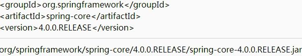


* **依赖**
* 仓库
    * 仓库的分类
        * 本地仓库：当前电脑上部署的仓库目录，为当前电脑上所有Maven工程服务
        * 远程仓库：
            * 私服：架设在当前局域网环境下，为当前局域网范围内的所有Maven工程服务

              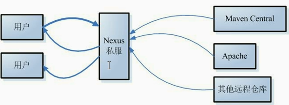

            * 中央仓库：架设在Internate上，为全世界所有Maven工程服务

            * 中央仓库的镜像：架设在各大洲，为中央仓库分担流量，减轻中央仓库的压力，同时更快的响应用户请求


* 生命周期/插件/目标
* 继承
* 聚合

## 第一个Maven工程

* **创建约定的目录结构**
    * 根目录：工程名
    * src目录：源码
    * pom.xml文件：Maven工程的核心配置文件
    * main目录：存放主程序
    * test目录：存放测试程序
    * java目录：存放java源文件
    * resource目录：存放框架或其他工具的配置文件
* **为什么要遵守约定的目录结构？**
    * Maven要负责我们这个项目的自动化构建，以编译为例，Maven要想自动进行编译，那么它必须知道java源文件保存在哪里
    * 如果我们自定义的东西想要框架或工具知道，有两种办法：
        * 以配置的方式明确告诉框架
        * 遵守框架已经存在的约定
    * 约定>配置>编码
* **常用Maven命令**
    * 注意：执行与构建过程相关的Maven命令，必须进入pom.xml所在目录
        * 与构建过程相关：编译、测试、打包、...
    * 常用命令：
        * mvn clean：清理
        * mvn compile：编译主程序
        * mvn test-compile：编译测试程序
        * mvn test：执行测试
        * mvn package：打包
        * mvn install：安装
        * mvn site：生成站点
* 关于联网问题
    * Maven的核心程序中仅仅定义了抽象的生命周期，但是具体的工作必须由特定的插件来完成。而插件本身并不包含在Maven的核心程序中
    * 当我们执行的Maven命令需要用到某些插件式，Maven核心程序会首先到本地仓库中查找
    * 本地仓库的默认位置：[系统中当前用户的家目录]\.m2\repository
    * Maven核心程序如果在本地仓库中找不到需要的插件，那么它会自动连接外网，到中央仓库下载
    * 如果此时无法连接外网，则构建失败
    * 修改默认本地仓库的位置，可以让Maven核心程序到我们事先准备好的目录下查找插件
        * 找到Maven解压目录\conf\settings.xml
        * 在settings.xml文件中找到localRepository标签
        * 将<localRepository>/path/to/local/repo</localRepository>从注释中取出
        * 将标签体内容内容修改为已经准备好的Maven仓库目录


* 依赖
    * Maven解析依赖信息时会到本地仓库中查找被依赖的 jar包
        * 对于我们自己开发的Maven工程。使用install命令安装后就可以进入仓库

    *  依赖的范围

        

    * compile范围依赖

        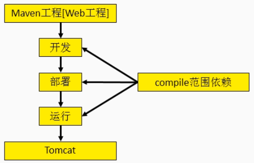

    * 对主程序是否有效：有效

    * 对测试程序是否有效：有效

    * 是否参与打包：参与

    * 是否参与部署：参与

* test范围依赖

    *  对主程序是否有效：无效
    *  对测试程序是否有效：有效
    *  是否参与打包：不参与
    *  是否参与部署：不参与

* provided范围依赖

    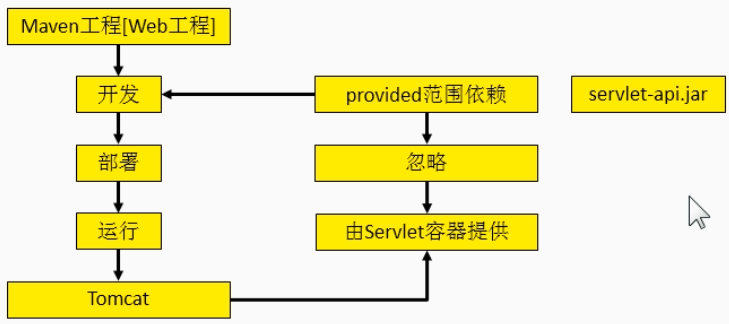

    * 对主程序是否有效：有效
    * 对测试程序是否有效：有效
    * 是否参与打包：不参与
    * 是否参与部署：不参与


* 生命周期
    * 各个构建环节的执行顺序：不能打乱顺序，必须按照 既定的正确顺序来执行
    * Maven的核心程序中定义了抽象的生命周期，生命周期中各个阶段的具体任务是由插件来完成的
    * Maven核心程序为了更好的实现自动化构建，按照这一特点执行生命周期中的各个阶段：不论现在要执行生命周期中的哪一个阶段，都是从这个生命周期最初的位置开始执行
    * 插件和目标
        * 生命周期的各个阶段仅仅定义了要执行的任务是什么
        * 各个阶段和插件的目标是对应的
        * 相似的目标由特定的插件来完成的
        * 可以将目标看作：调用插件功能的命令

| 生命周期阶段       | 插件目标        | 插件                    |
| ------------ | ----------- | --------------------- |
| compile      | compile     | maven-compiler-plugin |
| test-compile | testCompile | maven-compiler-plugin |

## Maven插件的使用

* Eclipse中Maven插件的设置
    * Maven插件：Eclipse内置
        * installations：指定Maven核心程序的设置，不建议使用内置的
        * user settings：指定conf/settings.xml的位置，进而获取本地仓库的位置
    * 基本操作
        * 创建Maven版的Java工程
        * 创建Maven版的Web工程
        * 执行Maven命令

* 依赖
    * 依赖的传递性

      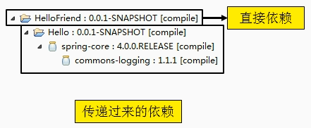

    * 好处：可以传递的依赖不必在每个模块中都重复声明，在"最下面"的工程中依赖一次即可

    * 注意：非compile范围的依赖不能传递，所以在各个工程模块中如果需要就得重复声明依赖

* 依赖的排除

    * 需要设置依赖排除的场合

        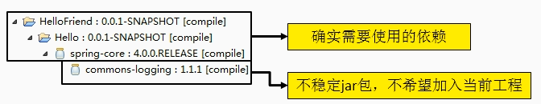

    * 依赖排除的设置方式

    ```xml
    <exclusions>
      <exclusion>
        <groupId></groupId>
        <artifactId></artifactId>
      </exclusion>
    </exclusions>
    ```

    * 依赖的原则

      * 作用：解决模块工程之间的jar包冲突问题

      * 验证路径最短者原则

        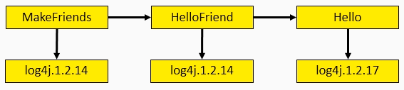

      * 路径相同时，先声明者优先（先声明指的是dependency标签的声明顺序）

        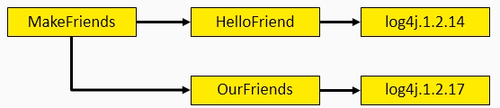

    * 统一管理依赖版本

      * 建议配置方式

        * 使用properties标签统一声明版本号

          ```xml
          <properties>                           									<cj.spring.version>4.0.0.RELEASE</cj.spring.version>
          </properties>
          ```

        * 在需要统一版本的位置，使用${自定义标签名}引用声明的版本号

          ```xml
          <version>${cj.spring.version}</version>
          ```

        * 其实properties标签配合自定义标签声明数据的配置并不是只能用于声明依赖的版本号，凡是需要统一声明后再引用的场合都可以使用

* 继承

    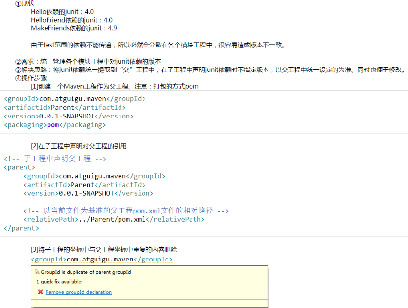

    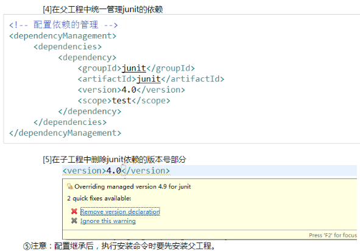

* 聚合

    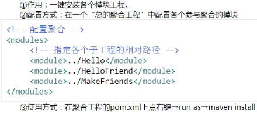

推荐博文：

[一个小时学会Maven](https://www.cnblogs.com/best/p/9676515.html#_lab2_1_2)

[Maven默认骨架](https://blog.csdn.net/qq_37859539/article/details/80182729)

