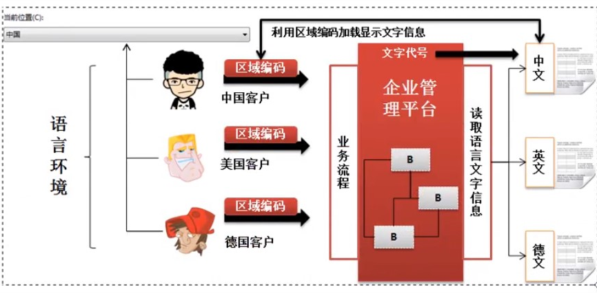

#  国际化程序实现原理
定义保存文字的文件信息
根据不同的区域语言的编码读取指定的资源信息



## Locale类

描述区域和语言编码的类

```java
public Locale(String language);
public Locale(String language,String country);

Locale loc = new Locale("zh","CN");  //中文环境

Locale.getDefault(): //默认环境
```

## 读取资源文件：ResourceBundle

获取ResourceBundle类对象的方法:

` public static final ResourceBundle getBundle(String baseName);`
baseName -> 描述资源文件的名称，但是没有后缀
`String getString()`:获取资源信息

## 消息格式化

**MessageFormat类**

占位符 {0},
`format()`:处理占位符信息