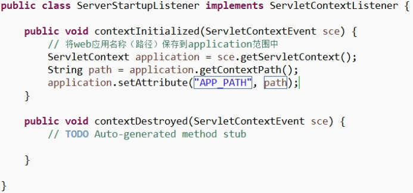
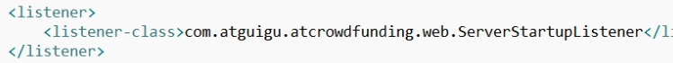

# 绝对路径与相对路径

绝对路径：不可改变的路径
本地绝对路径：增加盘符的路径（e:/test/test.html）
网络绝对路径：增加协议，IP地址，端口号的路径（http://localhost:8080/test/test.html）
相对路径：可以改变的路径，但是以基准路径为参考，查找其他路径
默认情况下，相对路径的基准路径是以当前资源的访问路径为基准
路径以斜杠开头，表示的特殊的相对路径，在不同的场景中，相对的位置会发生变化。
url : http://localhost:8080/atcrowdfunding-web/test/test.html
前台路径：&lt;a href=rdquo;/sssssrdquo;&gt;&lt;img src=rdquo;rdquo;&gt;
相对服务器的根 ： http://localhost:8080/sssss
后台路径：forward（rdquo;/user.jsprdquo;）, xml
相对web应用的根：http://localhost:8080/atcrowdfunding-web/user.jsp
监听器解决路径问题：

